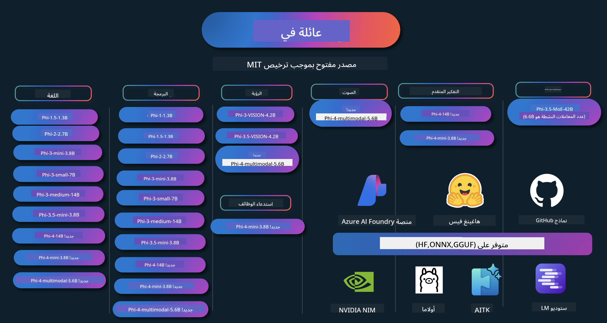

<!--
CO_OP_TRANSLATOR_METADATA:
{
  "original_hash": "8f2577190cbe70305b9de13df37e1c9a",
  "translation_date": "2025-04-03T05:45:07+00:00",
  "source_file": "README.md",
  "language_code": "ar"
}
-->
# Phi Cookbook: أمثلة عملية باستخدام نماذج Phi من مايكروسوفت

Phi هي سلسلة من نماذج الذكاء الاصطناعي مفتوحة المصدر التي طورتها مايكروسوفت.

Phi هو حالياً النموذج اللغوي الصغير الأكثر قوة وفعالية من حيث التكلفة، حيث يقدم نتائج ممتازة في مجالات متعددة مثل اللغات، التفكير، إنشاء النصوص/المحادثات، البرمجة، الصور، الصوت، وغيرها من السيناريوهات.

يمكنك نشر Phi على السحابة أو الأجهزة الطرفية، كما يمكنك بسهولة بناء تطبيقات ذكاء اصطناعي توليدي باستخدام قوة حسابية محدودة.

اتبع هذه الخطوات للبدء باستخدام هذه الموارد:
1. **نسخ المستودع**: اضغط على 
2. **استنساخ المستودع**:   `git clone https://github.com/microsoft/PhiCookBook.git`
3. [**انضم إلى مجتمع مايكروسوفت للذكاء الاصطناعي على Discord وتواصل مع الخبراء والمطورين الآخرين**](https://discord.com/invite/ByRwuEEgH4?WT.mc_id=aiml-137032-kinfeylo)

## 🌐 دعم متعدد اللغات
[فرنسي](../fr/README.md) | [إسباني](../es/README.md) | [ألماني](../de/README.md) | [روسي](../ru/README.md) | [عربي](./README.md) | [فارسي](../fa/README.md) | [أردو](../ur/README.md) | [صيني (مبسّط)](../zh/README.md) | [صيني (تقليدي، ماكاو)](../mo/README.md) | [صيني (تقليدي، هونغ كونغ)](../hk/README.md) | [صيني (تقليدي، تايوان)](../tw/README.md) | [ياباني](../ja/README.md) | [كوري](../ko/README.md) | [هندي](../hi/README.md) | [بنغالي](../bn/README.md) | [ماراثي](../mr/README.md) | [نيبالي](../ne/README.md) | [بنجابي (غورمخي)](../pa/README.md) | [برتغالي (البرتغال)](../pt/README.md) | [برتغالي (البرازيل)](../br/README.md) | [إيطالي](../it/README.md) | [بولندي](../pl/README.md) | [تركي](../tr/README.md) | [يوناني](../el/README.md) | [تايلاندي](../th/README.md) | [سويدي](../sv/README.md) | [دنماركي](../da/README.md) | [نرويجي](../no/README.md) | [فنلندي](../fi/README.md) | [هولندي](../nl/README.md) | [عبري](../he/README.md) | [فيتنامي](../vi/README.md) | [إندونيسي](../id/README.md) | [مالايو](../ms/README.md) | [تاغالوغ (فلبيني)](../tl/README.md) | [سواحلي](../sw/README.md) | [مجري](../hu/README.md) | [تشيكي](../cs/README.md) | [سلوفاكي](../sk/README.md) | [روماني](../ro/README.md) | [بلغاري](../bg/README.md) | [صربي (سيريلي)](../sr/README.md) | [كرواتي](../hr/README.md) | [سلوفيني](../sl/README.md)
## جدول المحتويات

- المقدمة
  - [مرحباً بك في عائلة Phi](./md/01.Introduction/01/01.PhiFamily.md)
  - [إعداد بيئتك](./md/01.Introduction/01/01.EnvironmentSetup.md)
  - [فهم التقنيات الرئيسية](./md/01.Introduction/01/01.Understandingtech.md)
  - [أمان الذكاء الاصطناعي لنماذج Phi](./md/01.Introduction/01/01.AISafety.md)
  - [دعم الأجهزة لنماذج Phi](./md/01.Introduction/01/01.Hardwaresupport.md)
  - [نماذج Phi وتوافرها عبر المنصات](./md/01.Introduction/01/01.Edgeandcloud.md)
  - [استخدام Guidance-ai وPhi](./md/01.Introduction/01/01.Guidance.md)
  - [نماذج سوق GitHub](https://github.com/marketplace/models)
  - [كتالوج نماذج Azure AI](https://ai.azure.com)

- استنتاج Phi في بيئات مختلفة
    - [Hugging face](./md/01.Introduction/02/01.HF.md)
    - [نماذج GitHub](./md/01.Introduction/02/02.GitHubModel.md)
    - [كتالوج نماذج Azure AI Foundry](./md/01.Introduction/02/03.AzureAIFoundry.md)
    - [Ollama](./md/01.Introduction/02/04.Ollama.md)
    - [أداة الذكاء الاصطناعي VSCode (AITK)](./md/01.Introduction/02/05.AITK.md)
    - [NVIDIA NIM](./md/01.Introduction/02/06.NVIDIA.md)

- استنتاج عائلة Phi
    - [استنتاج Phi في iOS](./md/01.Introduction/03/iOS_Inference.md)
    - [استنتاج Phi في Android](./md/01.Introduction/03/Android_Inference.md)
    - [استنتاج Phi في Jetson](./md/01.Introduction/03/Jetson_Inference.md)
    - [استنتاج Phi في AI PC](./md/01.Introduction/03/AIPC_Inference.md)
    - [استنتاج Phi باستخدام إطار عمل Apple MLX](./md/01.Introduction/03/MLX_Inference.md)
    - [استنتاج Phi في الخادم المحلي](./md/01.Introduction/03/Local_Server_Inference.md)
    - [استنتاج Phi في الخادم البعيد باستخدام أداة الذكاء الاصطناعي](./md/01.Introduction/03/Remote_Interence.md)
    - [استنتاج Phi باستخدام Rust](./md/01.Introduction/03/Rust_Inference.md)
    - [استنتاج Phi--Vision محلياً](./md/01.Introduction/03/Vision_Inference.md)
    - [استنتاج Phi باستخدام Kaito AKS، حاويات Azure (الدعم الرسمي)](./md/01.Introduction/03/Kaito_Inference.md)

- [تكميم عائلة Phi](./md/01.Introduction/04/QuantifyingPhi.md)
    - [تكميم Phi-3.5 / 4 باستخدام llama.cpp](./md/01.Introduction/04/UsingLlamacppQuantifyingPhi.md)
    - [تكميم Phi-3.5 / 4 باستخدام إضافات الذكاء الاصطناعي التوليدي لـ onnxruntime](./md/01.Introduction/04/UsingORTGenAIQuantifyingPhi.md)
    - [تكميم Phi-3.5 / 4 باستخدام Intel OpenVINO](./md/01.Introduction/04/UsingIntelOpenVINOQuantifyingPhi.md)
    - [تكميم Phi-3.5 / 4 باستخدام إطار عمل Apple MLX](./md/01.Introduction/04/UsingAppleMLXQuantifyingPhi.md)

- تقييم Phi
- [Response AI](./md/01.Introduction/05/ResponsibleAI.md)
    - [Azure AI Foundry للتقييم](./md/01.Introduction/05/AIFoundry.md)
    - [استخدام Promptflow للتقييم](./md/01.Introduction/05/Promptflow.md)
 
- RAG مع Azure AI Search
    - [كيفية استخدام Phi-4-mini و Phi-4-multimodal (RAG) مع Azure AI Search](https://github.com/microsoft/PhiCookBook/blob/main/code/06.E2E/E2E_Phi-4-RAG-Azure-AI-Search.ipynb)

- عينات تطوير تطبيقات Phi
  - تطبيقات النصوص والدردشة
    - عينات Phi-4 🆕
      - [📓] [الدردشة باستخدام نموذج Phi-4-mini ONNX](./md/02.Application/01.TextAndChat/Phi4/ChatWithPhi4ONNX/README.md)
      - [الدردشة باستخدام نموذج Phi-4 المحلي ONNX في .NET](../../md/04.HOL/dotnet/src/LabsPhi4-Chat-01OnnxRuntime)
      - [تطبيق Console للدردشة في .NET مع Phi-4 ONNX باستخدام Sementic Kernel](../../md/04.HOL/dotnet/src/LabsPhi4-Chat-02SK)
    - عينات Phi-3 / 3.5
      - [روبوت دردشة محلي في المتصفح باستخدام Phi3 و ONNX Runtime Web و WebGPU](https://github.com/microsoft/onnxruntime-inference-examples/tree/main/js/chat)
      - [دردشة OpenVino](./md/02.Application/01.TextAndChat/Phi3/E2E_OpenVino_Chat.md)
      - [نموذج متعدد - Phi-3-mini التفاعلي و OpenAI Whisper](./md/02.Application/01.TextAndChat/Phi3/E2E_Phi-3-mini_with_whisper.md)
      - [MLFlow - إنشاء غلاف واستخدام Phi-3 مع MLFlow](./md//02.Application/01.TextAndChat/Phi3/E2E_Phi-3-MLflow.md)
      - [تحسين النموذج - كيفية تحسين نموذج Phi-3-min لـ ONNX Runtime Web باستخدام Olive](https://github.com/microsoft/Olive/tree/main/examples/phi3)
      - [تطبيق WinUI3 مع Phi-3 mini-4k-instruct-onnx](https://github.com/microsoft/Phi3-Chat-WinUI3-Sample/)
      - [تطبيق WinUI3 متعدد النماذج للملاحظات المدعومة بالذكاء الاصطناعي](https://github.com/microsoft/ai-powered-notes-winui3-sample)
      - [تخصيص وتكامل نماذج Phi-3 المخصصة مع Prompt flow](./md/02.Application/01.TextAndChat/Phi3/E2E_Phi-3-FineTuning_PromptFlow_Integration.md)
      - [تخصيص وتكامل نماذج Phi-3 المخصصة مع Prompt flow في Azure AI Foundry](./md/02.Application/01.TextAndChat/Phi3/E2E_Phi-3-FineTuning_PromptFlow_Integration_AIFoundry.md)
      - [تقييم نموذج Phi-3 / Phi-3.5 المُخصص في Azure AI Foundry مع التركيز على مبادئ الذكاء الاصطناعي المسؤول من Microsoft](./md/02.Application/01.TextAndChat/Phi3/E2E_Phi-3-Evaluation_AIFoundry.md)
      - [📓] [عينة توقع اللغة باستخدام Phi-3.5-mini-instruct (صيني/إنجليزي)](../../md/02.Application/01.TextAndChat/Phi3/phi3-instruct-demo.ipynb)
      - [روبوت دردشة RAG باستخدام Phi-3.5-Instruct WebGPU](./md/02.Application/01.TextAndChat/Phi3/WebGPUWithPhi35Readme.md)
      - [استخدام GPU الخاص بنظام Windows لإنشاء حل Prompt flow باستخدام Phi-3.5-Instruct ONNX](./md/02.Application/01.TextAndChat/Phi3/UsingPromptFlowWithONNX.md)
      - [استخدام Microsoft Phi-3.5 tflite لإنشاء تطبيق Android](./md/02.Application/01.TextAndChat/Phi3/UsingPhi35TFLiteCreateAndroidApp.md)
      - [مثال Q&A في .NET باستخدام نموذج Phi-3 المحلي ONNX مع Microsoft.ML.OnnxRuntime](../../md/04.HOL/dotnet/src/LabsPhi301)
      - [تطبيق Console للدردشة في .NET مع Semantic Kernel و Phi-3](../../md/04.HOL/dotnet/src/LabsPhi302)

  - عينات تعتمد على SDK استدلال Azure AI 
    - عينات Phi-4 🆕
      - [📓] [إنشاء كود المشروع باستخدام Phi-4-multimodal](./md/02.Application/02.Code/Phi4/GenProjectCode/README.md)
    - عينات Phi-3 / 3.5
      - [قم ببناء Visual Studio Code GitHub Copilot Chat الخاص بك باستخدام عائلة Microsoft Phi-3](./md/02.Application/02.Code/Phi3/VSCodeExt/README.md)
      - [قم بإنشاء وكيل دردشة Visual Studio Code الخاص بك باستخدام Phi-3.5 ونماذج GitHub](/md/02.Application/02.Code/Phi3/CreateVSCodeChatAgentWithGitHubModels.md)

  - عينات التفكير المتقدم
    - عينات Phi-4 🆕
      - [📓] [عينات التفكير المتقدم Phi-4-mini](./md/02.Application/03.AdvancedReasoning/Phi4/AdvancedResoningPhi4mini/README.md)
  
  - العروض التوضيحية
      - [العروض التوضيحية لـ Phi-4-mini المستضافة على Hugging Face Spaces](https://huggingface.co/spaces/microsoft/phi-4-mini?WT.mc_id=aiml-137032-kinfeylo)
      - [العروض التوضيحية لـ Phi-4-multimodal المستضافة على Hugging Face Spaces](https://huggingface.co/spaces/microsoft/phi-4-multimodal?WT.mc_id=aiml-137032-kinfeylo)
  - عينات الرؤية
    - عينات Phi-4 🆕
      - [📓] [استخدام Phi-4-multimodal لقراءة الصور وإنشاء الكود](./md/02.Application/04.Vision/Phi4/CreateFrontend/README.md)
    - عينات Phi-3 / 3.5
- [📓][Phi-3-vision-Image text to text](../../md/02.Application/04.Vision/Phi3/E2E_Phi-3-vision-image-text-to-text-online-endpoint.ipynb)  
      - [Phi-3-vision-ONNX](https://onnxruntime.ai/docs/genai/tutorials/phi3-v.html)  
      - [📓][Phi-3-vision CLIP Embedding](../../md/02.Application/04.Vision/Phi3/E2E_Phi-3-vision-image-text-to-text-online-endpoint.ipynb)  
      - [DEMO: Phi-3 Recycling](https://github.com/jennifermarsman/PhiRecycling/)  
      - [Phi-3-vision - مساعد اللغة البصرية - باستخدام Phi3-Vision و OpenVINO](https://docs.openvino.ai/nightly/notebooks/phi-3-vision-with-output.html)  
      - [Phi-3 Vision Nvidia NIM](./md/02.Application/04.Vision/Phi3/E2E_Nvidia_NIM_Vision.md)  
      - [Phi-3 Vision OpenVino](./md/02.Application/04.Vision/Phi3/E2E_OpenVino_Phi3Vision.md)  
      - [📓][Phi-3.5 Vision نموذج متعدد الإطارات أو متعدد الصور](../../md/02.Application/04.Vision/Phi3/phi3-vision-demo.ipynb)  
      - [Phi-3 Vision نموذج ONNX محلي باستخدام Microsoft.ML.OnnxRuntime .NET](../../md/04.HOL/dotnet/src/LabsPhi303)  
      - [نموذج ONNX محلي لـ Phi-3 Vision باستخدام Microsoft.ML.OnnxRuntime .NET القائم على القوائم](../../md/04.HOL/dotnet/src/LabsPhi304)  

  - عينات الصوت  
    - عينات Phi-4 🆕  
      - [📓] [استخراج النصوص الصوتية باستخدام Phi-4-multimodal](./md/02.Application/05.Audio/Phi4/Transciption/README.md)  
      - [📓] [عينة صوتية لـ Phi-4-multimodal](../../md/02.Application/05.Audio/Phi4/Siri/demo.ipynb)  
      - [📓] [عينة ترجمة الصوت باستخدام Phi-4-multimodal](../../md/02.Application/05.Audio/Phi4/Translate/demo.ipynb)  
      - [.NET تطبيق كونسول باستخدام Phi-4-multimodal لتحليل ملف صوتي وإنشاء نص](../../md/04.HOL/dotnet/src/LabsPhi4-MultiModal-02Audio)  

  - عينات MOE  
    - عينات Phi-3 / 3.5  
      - [📓] [Phi-3.5 نماذج Mixture of Experts (MoEs) عينة وسائل التواصل الاجتماعي](../../md/02.Application/06.MoE/Phi3/phi3_moe_demo.ipynb)  
      - [📓] [بناء خط أنابيب استرجاع معزز للتوليد (RAG) باستخدام NVIDIA NIM Phi-3 MOE، بحث Azure AI، و LlamaIndex](../../md/02.Application/06.MoE/Phi3/azure-ai-search-nvidia-rag.ipynb)  

  - عينات استدعاء الوظائف  
    - عينات Phi-4 🆕  
      - [📓] [استخدام استدعاء الوظائف مع Phi-4-mini](./md/02.Application/07.FunctionCalling/Phi4/FunctionCallingBasic/README.md)  
      - [📓] [استخدام استدعاء الوظائف لإنشاء وكلاء متعددين باستخدام Phi-4-mini](../../md/02.Application/07.FunctionCalling/Phi4/Multiagents/Phi_4_mini_multiagent.ipynb)  
      - [📓] [استخدام استدعاء الوظائف مع Ollama](../../md/02.Application/07.FunctionCalling/Phi4/Ollama/ollama_functioncalling.ipynb)  

  - عينات المزج متعدد الوسائط  
    - عينات Phi-4 🆕  
      - [📓] [استخدام Phi-4-multimodal كصحفي تقني](../../md/02.Application/08.Multimodel/Phi4/TechJournalist/phi_4_mm_audio_text_publish_news.ipynb)  
      - [.NET تطبيق كونسول باستخدام Phi-4-multimodal لتحليل الصور](../../md/04.HOL/dotnet/src/LabsPhi4-MultiModal-01Images)  

- تحسين Phi  
  - [سيناريوهات تحسين الأداء](./md/03.FineTuning/FineTuning_Scenarios.md)  
  - [تحسين الأداء مقابل RAG](./md/03.FineTuning/FineTuning_vs_RAG.md)  
  - [تحسين الأداء لجعل Phi-3 خبيرًا في الصناعة](./md/03.FineTuning/LetPhi3gotoIndustriy.md)  
  - [تحسين Phi-3 باستخدام أدوات الذكاء الاصطناعي لـ VS Code](./md/03.FineTuning/Finetuning_VSCodeaitoolkit.md)  
  - [تحسين Phi-3 باستخدام خدمة Azure Machine Learning](./md/03.FineTuning/Introduce_AzureML.md)  
  - [تحسين Phi-3 باستخدام Lora](./md/03.FineTuning/FineTuning_Lora.md)  
  - [تحسين Phi-3 باستخدام QLora](./md/03.FineTuning/FineTuning_Qlora.md)  
  - [تحسين Phi-3 باستخدام Azure AI Foundry](./md/03.FineTuning/FineTuning_AIFoundry.md)  
  - [تحسين Phi-3 باستخدام CLI/SDK الخاص بـ Azure ML](./md/03.FineTuning/FineTuning_MLSDK.md)  
- [التخصيص باستخدام Microsoft Olive](./md/03.FineTuning/FineTuning_MicrosoftOlive.md)  
  - [مختبر عملي للتخصيص باستخدام Microsoft Olive](./md/03.FineTuning/olive-lab/readme.md)  
  - [تخصيص Phi-3-vision باستخدام Weights and Bias](./md/03.FineTuning/FineTuning_Phi-3-visionWandB.md)  
  - [تخصيص Phi-3 باستخدام إطار عمل Apple MLX](./md/03.FineTuning/FineTuning_MLX.md)  
  - [تخصيص Phi-3-vision (الدعم الرسمي)](./md/03.FineTuning/FineTuning_Vision.md)  
  - [تخصيص Phi-3 باستخدام Kaito AKS و Azure Containers (الدعم الرسمي)](./md/03.FineTuning/FineTuning_Kaito.md)  
  - [تخصيص Phi-3 و Phi-3.5 Vision](https://github.com/2U1/Phi3-Vision-Finetune)  

- مختبر عملي  
  - [استكشاف النماذج المتطورة: LLMs، SLMs، التطوير المحلي والمزيد](https://github.com/microsoft/aitour-exploring-cutting-edge-models)  
  - [إطلاق الإمكانيات في معالجة اللغة الطبيعية: التخصيص باستخدام Microsoft Olive](https://github.com/azure/Ignite_FineTuning_workshop)  

- أوراق بحثية ومنشورات أكاديمية  
  - [الكتب المدرسية هي كل ما تحتاجه II: تقرير تقني phi-1.5](https://arxiv.org/abs/2309.05463)  
  - [تقرير تقني Phi-3: نموذج لغوي عالي الكفاءة محليًا على هاتفك](https://arxiv.org/abs/2404.14219)  
  - [تقرير تقني Phi-4](https://arxiv.org/abs/2412.08905)  
  - [تقرير تقني Phi-4-Mini: نماذج لغوية متعددة الوسائط قوية وصغيرة الحجم عبر مزيج من LoRAs](https://arxiv.org/abs/2503.01743)  
  - [تحسين نماذج اللغة الصغيرة لاستدعاء الوظائف داخل المركبة](https://arxiv.org/abs/2501.02342)  
  - [(WhyPHI) تخصيص PHI-3 للإجابة على أسئلة الاختيار المتعدد: المنهجية، النتائج، والتحديات](https://arxiv.org/abs/2501.01588)  

## استخدام نماذج Phi  

### Phi على Azure AI Foundry  

يمكنك تعلم كيفية استخدام Microsoft Phi وكيفية بناء حلول شاملة على أجهزتك المختلفة. لتجربة Phi بنفسك، ابدأ باللعب بالنماذج وتخصيص Phi لسيناريوهاتك باستخدام [كتالوج نماذج Azure AI Foundry](https://aka.ms/phi3-azure-ai). يمكنك معرفة المزيد من خلال دليل البدء السريع [Azure AI Foundry](/md/02.QuickStart/AzureAIFoundry_QuickStart.md).  

**مساحة التجربة**  
لكل نموذج مساحة مخصصة لتجربة النموذج [Azure AI Playground](https://aka.ms/try-phi3).  

### Phi على GitHub Models  

يمكنك تعلم كيفية استخدام Microsoft Phi وكيفية بناء حلول شاملة على أجهزتك المختلفة. لتجربة Phi بنفسك، ابدأ باللعب بالنماذج وتخصيص Phi لسيناريوهاتك باستخدام [كتالوج نماذج GitHub](https://github.com/marketplace/models?WT.mc_id=aiml-137032-kinfeylo). يمكنك معرفة المزيد من خلال دليل البدء السريع [GitHub Model Catalog](/md/02.QuickStart/GitHubModel_QuickStart.md).  

**مساحة التجربة**  
لكل نموذج [مساحة مخصصة لتجربة النموذج](/md/02.QuickStart/GitHubModel_QuickStart.md).  

### Phi على Hugging Face  

يمكنك أيضًا العثور على النموذج على [Hugging Face](https://huggingface.co/microsoft).  

**مساحة التجربة**  
[مساحة Hugging Chat للتجربة](https://huggingface.co/chat/models/microsoft/Phi-3-mini-4k-instruct).  

## الذكاء الاصطناعي المسؤول  

تلتزم Microsoft بمساعدة عملائنا في استخدام منتجات الذكاء الاصطناعي لدينا بشكل مسؤول، ومشاركة ما تعلمناه، وبناء شراكات قائمة على الثقة من خلال أدوات مثل ملاحظات الشفافية وتقييمات الأثر. يمكن العثور على العديد من هذه الموارد في [https://aka.ms/RAI](https://aka.ms/RAI).  
تعتمد نهج Microsoft في الذكاء الاصطناعي المسؤول على مبادئ الذكاء الاصطناعي الخاصة بنا وهي الإنصاف، الموثوقية والسلامة، الخصوصية والأمان، الشمولية، الشفافية، والمساءلة.  

النماذج الكبيرة لمعالجة النصوص والصور والصوت - مثل تلك المستخدمة في هذا المثال - قد تتصرف بطرق غير عادلة أو غير موثوقة أو مسيئة، مما قد يتسبب في أضرار. يرجى الرجوع إلى [ملاحظة الشفافية لخدمة Azure OpenAI](https://learn.microsoft.com/legal/cognitive-services/openai/transparency-note?tabs=text) للحصول على معلومات حول المخاطر والقيود.  

النهج الموصى به لتقليل هذه المخاطر هو تضمين نظام أمان في بنية التطبيق يمكنه اكتشاف ومنع السلوك الضار. [أمان محتوى Azure AI](https://learn.microsoft.com/azure/ai-services/content-safety/overview) يوفر طبقة حماية مستقلة، قادرة على اكتشاف المحتوى الضار الذي يتم إنشاؤه من قبل المستخدمين أو الذكاء الاصطناعي في التطبيقات والخدمات. يشمل أمان محتوى Azure AI واجهات برمجة التطبيقات للنصوص والصور التي تمكنك من اكتشاف المواد الضارة. داخل Azure AI Foundry، تتيح لك خدمة أمان المحتوى عرض واستكشاف وتجربة أمثلة للكود الخاص باكتشاف المحتوى الضار عبر وسائط مختلفة. يوجهك [وثائق البدء السريع](https://learn.microsoft.com/azure/ai-services/content-safety/quickstart-text?tabs=visual-studio%2Clinux&pivots=programming-language-rest) في كيفية إرسال طلبات إلى الخدمة.  

جانب آخر يجب أخذه بعين الاعتبار هو الأداء العام للتطبيق. مع التطبيقات متعددة الوسائط والنماذج المتعددة، يعتبر الأداء هو أن النظام يعمل كما تتوقع أنت والمستخدمون، بما في ذلك عدم إنتاج مخرجات ضارة. من المهم تقييم أداء التطبيق العام باستخدام [مقيمي الأداء والجودة ومقيمي المخاطر والسلامة](https://learn.microsoft.com/azure/ai-studio/concepts/evaluation-metrics-built-in). لديك أيضًا القدرة على إنشاء وتقييم [مقيمي مخصصين](https://learn.microsoft.com/azure/ai-studio/how-to/develop/evaluate-sdk#custom-evaluators).  
يمكنك تقييم تطبيق الذكاء الاصطناعي الخاص بك في بيئة التطوير باستخدام [Azure AI Evaluation SDK](https://microsoft.github.io/promptflow/index.html). سواء كنت تستخدم مجموعة بيانات اختبار أو هدفًا معينًا، يتم قياس نتائج تطبيق الذكاء الاصطناعي التوليدي الخاص بك كميًا باستخدام أدوات التقييم المدمجة أو أدوات التقييم المخصصة التي تختارها. للبدء باستخدام Azure AI Evaluation SDK لتقييم النظام الخاص بك، يمكنك اتباع [دليل البدء السريع](https://learn.microsoft.com/azure/ai-studio/how-to/develop/flow-evaluate-sdk). بمجرد تنفيذ عملية التقييم، يمكنك [عرض النتائج في Azure AI Foundry](https://learn.microsoft.com/azure/ai-studio/how-to/evaluate-flow-results).

## العلامات التجارية

قد يحتوي هذا المشروع على علامات تجارية أو شعارات خاصة بالمشاريع أو المنتجات أو الخدمات. الاستخدام المصرح به لعلامات Microsoft التجارية أو الشعارات يجب أن يتبع [إرشادات العلامات التجارية والعلامات الخاصة بـ Microsoft](https://www.microsoft.com/legal/intellectualproperty/trademarks/usage/general).
استخدام علامات Microsoft التجارية أو الشعارات في نسخ معدلة من هذا المشروع يجب ألا يسبب ارتباكًا أو يوحي برعاية من Microsoft. أي استخدام لعلامات تجارية أو شعارات خاصة بأطراف ثالثة يخضع لسياسات تلك الأطراف الثالثة.

**إخلاء المسؤولية**:  
تم ترجمة هذا المستند باستخدام خدمة الترجمة بالذكاء الاصطناعي [Co-op Translator](https://github.com/Azure/co-op-translator). بينما نسعى لتحقيق الدقة، يرجى العلم أن الترجمات الآلية قد تحتوي على أخطاء أو معلومات غير دقيقة. يجب اعتبار المستند الأصلي بلغته الأصلية المصدر الموثوق. للحصول على معلومات حاسمة، يُوصى بالاستعانة بترجمة بشرية احترافية. نحن غير مسؤولين عن أي سوء فهم أو تفسيرات خاطئة ناتجة عن استخدام هذه الترجمة.