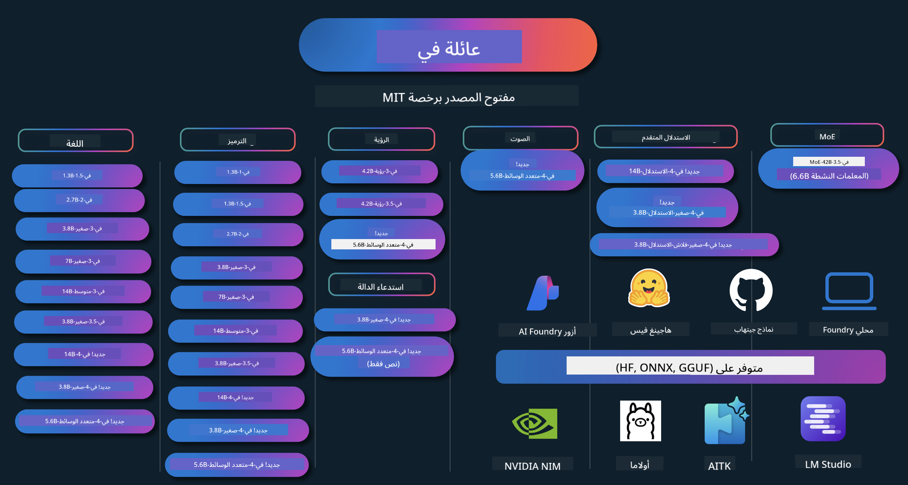

<!--
CO_OP_TRANSLATOR_METADATA:
{
  "original_hash": "5c07bb4c3c89a36c9be332a065a9a33c",
  "translation_date": "2025-07-16T14:53:06+00:00",
  "source_file": "README.md",
  "language_code": "ar"
}
-->
# كتاب وصفات Phi: أمثلة عملية مع نماذج Phi من مايكروسوفت

  

  
  
  

  
  

Phi هي سلسلة من نماذج الذكاء الاصطناعي مفتوحة المصدر التي طورتها مايكروسوفت.

يُعتبر Phi حالياً أقوى وأكفأ نموذج لغة صغير (SLM) من حيث التكلفة، مع أداء ممتاز في عدة مجالات مثل تعدد اللغات، الاستدلال، توليد النصوص/الدردشة، البرمجة، الصور، الصوت، وسيناريوهات أخرى.

يمكنك نشر Phi على السحابة أو على أجهزة الحافة، كما يمكنك بسهولة بناء تطبيقات ذكاء اصطناعي توليدية باستخدام موارد حوسبة محدودة.

اتبع هذه الخطوات للبدء باستخدام هذه الموارد:  
1. **انسخ المستودع**: اضغط على   
2. **استنسخ المستودع**: `git clone https://github.com/microsoft/PhiCookBook.git`  
3. [**انضم إلى مجتمع Microsoft AI على Discord وتواصل مع الخبراء والمطورين الآخرين**](https://discord.com/invite/ByRwuEEgH4?WT.mc_id=aiml-137032-kinfeylo)

### 🌐 دعم متعدد اللغات

#### مدعوم عبر GitHub Action (آلي ومحدث دائماً)

[الفرنسية](../fr/README.md) | [الإسبانية](../es/README.md) | [الألمانية](../de/README.md) | [الروسية](../ru/README.md) | [العربية](./README.md) | [الفارسية](../fa/README.md) | [الأردية](../ur/README.md) | [الصينية المبسطة](../zh/README.md) | [الصينية التقليدية (ماكاو)](../mo/README.md) | [الصينية التقليدية (هونغ كونغ)](../hk/README.md) | [الصينية التقليدية (تايوان)](../tw/README.md) | [اليابانية](../ja/README.md) | [الكورية](../ko/README.md) | [الهندية](../hi/README.md)  
[البنغالية](../bn/README.md) | [الماراثية](../mr/README.md) | [النيبالية](../ne/README.md) | [البنجابية (غورموخي)](../pa/README.md) | [البرتغالية (البرتغال)](../pt/README.md) | [البرتغالية (البرازيل)](../br/README.md) | [الإيطالية](../it/README.md) | [البولندية](../pl/README.md) | [التركية](../tr/README.md) | [اليونانية](../el/README.md) | [التايلاندية](../th/README.md) | [السويدية](../sv/README.md) | [الدنماركية](../da/README.md) | [النرويجية](../no/README.md) | [الفنلندية](../fi/README.md) | [الهولندية](../nl/README.md) | [العبرية](../he/README.md) | [الفيتنامية](../vi/README.md) | [الإندونيسية](../id/README.md) | [الماليزية](../ms/README.md) | [التاغالوغ (الفلبينية)](../tl/README.md) | [السواحيلية](../sw/README.md) | [الهنغارية](../hu/README.md) | [التشيكية](../cs/README.md) | [السلوفاكية](../sk/README.md) | [الرومانية](../ro/README.md) | [البلغارية](../bg/README.md) | [الصربية (السيريلية)](../sr/README.md) | [الكرواتية](../hr/README.md) | [السلوفينية](../sl/README.md)

## جدول المحتويات

- المقدمة  
  - [مرحباً بك في عائلة Phi](./md/01.Introduction/01/01.PhiFamily.md)  
  - [إعداد بيئتك](./md/01.Introduction/01/01.EnvironmentSetup.md)  
  - [فهم التقنيات الأساسية](./md/01.Introduction/01/01.Understandingtech.md)  
  - [السلامة في الذكاء الاصطناعي لنماذج Phi](./md/01.Introduction/01/01.AISafety.md)  
  - [دعم الأجهزة لنماذج Phi](./md/01.Introduction/01/01.Hardwaresupport.md)  
  - [نماذج Phi وتوفرها عبر المنصات](./md/01.Introduction/01/01.Edgeandcloud.md)  
  - [استخدام Guidance-ai و Phi](./md/01.Introduction/01/01.Guidance.md)  
  - [نماذج سوق GitHub](https://github.com/marketplace/models)  
  - [كتالوج نماذج Azure AI](https://ai.azure.com)

- استدلال Phi في بيئات مختلفة  
  - [Hugging face](./md/01.Introduction/02/01.HF.md)  
  - [نماذج GitHub](./md/01.Introduction/02/02.GitHubModel.md)  
  - [كتالوج نماذج Azure AI Foundry](./md/01.Introduction/02/03.AzureAIFoundry.md)  
  - [Ollama](./md/01.Introduction/02/04.Ollama.md)  
  - [أدوات AI لـ VSCode (AITK)](./md/01.Introduction/02/05.AITK.md)  
  - [NVIDIA NIM](./md/01.Introduction/02/06.NVIDIA.md)  
  - [Foundry محلي](./md/01.Introduction/02/07.FoundryLocal.md)

- استدلال عائلة Phi  
  - [استدلال Phi على iOS](./md/01.Introduction/03/iOS_Inference.md)  
  - [استدلال Phi على Android](./md/01.Introduction/03/Android_Inference.md)  
  - [استدلال Phi على Jetson](./md/01.Introduction/03/Jetson_Inference.md)  
  - [استدلال Phi على AI PC](./md/01.Introduction/03/AIPC_Inference.md)  
  - [استدلال Phi باستخدام إطار عمل Apple MLX](./md/01.Introduction/03/MLX_Inference.md)  
  - [استدلال Phi على الخادم المحلي](./md/01.Introduction/03/Local_Server_Inference.md)  
  - [استدلال Phi على الخادم البعيد باستخدام AI Toolkit](./md/01.Introduction/03/Remote_Interence.md)  
  - [استدلال Phi باستخدام Rust](./md/01.Introduction/03/Rust_Inference.md)  
  - [استدلال Phi--الرؤية محلياً](./md/01.Introduction/03/Vision_Inference.md)  
  - [استدلال Phi مع Kaito AKS، حاويات Azure (الدعم الرسمي)](./md/01.Introduction/03/Kaito_Inference.md)  
- [تكميم عائلة Phi](./md/01.Introduction/04/QuantifyingPhi.md)  
  - [تكميم Phi-3.5 / 4 باستخدام llama.cpp](./md/01.Introduction/04/UsingLlamacppQuantifyingPhi.md)  
  - [تكميم Phi-3.5 / 4 باستخدام امتدادات الذكاء الاصطناعي التوليدي لـ onnxruntime](./md/01.Introduction/04/UsingORTGenAIQuantifyingPhi.md)  
  - [تكميم Phi-3.5 / 4 باستخدام Intel OpenVINO](./md/01.Introduction/04/UsingIntelOpenVINOQuantifyingPhi.md)  
  - [تكميم Phi-3.5 / 4 باستخدام إطار عمل Apple MLX](./md/01.Introduction/04/UsingAppleMLXQuantifyingPhi.md)

- تقييم Phi  
  - [الذكاء الاصطناعي المسؤول](./md/01.Introduction/05/ResponsibleAI.md)  
  - [Azure AI Foundry للتقييم](./md/01.Introduction/05/AIFoundry.md)  
  - [استخدام Promptflow للتقييم](./md/01.Introduction/05/Promptflow.md)

- RAG مع Azure AI Search  
  - [كيفية استخدام Phi-4-mini و Phi-4-multimodal (RAG) مع Azure AI Search](https://github.com/microsoft/PhiCookBook/blob/main/code/06.E2E/E2E_Phi-4-RAG-Azure-AI-Search.ipynb)

- عينات تطوير تطبيقات Phi  
  - تطبيقات النص والدردشة  
    - عينات Phi-4 🆕  
      - [📓] [الدردشة مع نموذج Phi-4-mini ONNX](./md/02.Application/01.TextAndChat/Phi4/ChatWithPhi4ONNX/README.md)  
      - [الدردشة مع نموذج Phi-4 المحلي ONNX باستخدام .NET](../../md/04.HOL/dotnet/src/LabsPhi4-Chat-01OnnxRuntime)  
      - [تطبيق دردشة .NET Console مع Phi-4 ONNX باستخدام Sementic Kernel](../../md/04.HOL/dotnet/src/LabsPhi4-Chat-02SK)  
    - عينات Phi-3 / 3.5  
      - [روبوت دردشة محلي في المتصفح باستخدام Phi3، ONNX Runtime Web و WebGPU](https://github.com/microsoft/onnxruntime-inference-examples/tree/main/js/chat)  
      - [دردشة OpenVino](./md/02.Application/01.TextAndChat/Phi3/E2E_OpenVino_Chat.md)  
      - [نموذج متعدد - Phi-3-mini التفاعلي و OpenAI Whisper](./md/02.Application/01.TextAndChat/Phi3/E2E_Phi-3-mini_with_whisper.md)  
      - [MLFlow - بناء غلاف واستخدام Phi-3 مع MLFlow](./md//02.Application/01.TextAndChat/Phi3/E2E_Phi-3-MLflow.md)  
      - [تحسين النموذج - كيفية تحسين نموذج Phi-3-min لـ ONNX Runtime Web باستخدام Olive](https://github.com/microsoft/Olive/tree/main/examples/phi3)  
      - [تطبيق WinUI3 مع Phi-3 mini-4k-instruct-onnx](https://github.com/microsoft/Phi3-Chat-WinUI3-Sample/)  
      - [عينة تطبيق ملاحظات متعدد النماذج مدعوم بالذكاء الاصطناعي WinUI3](https://github.com/microsoft/ai-powered-notes-winui3-sample)
- [ضبط وتكامل نماذج Phi-3 المخصصة مع Prompt flow](./md/02.Application/01.TextAndChat/Phi3/E2E_Phi-3-FineTuning_PromptFlow_Integration.md)
- [ضبط وتكامل نماذج Phi-3 المخصصة مع Prompt flow في Azure AI Foundry](./md/02.Application/01.TextAndChat/Phi3/E2E_Phi-3-FineTuning_PromptFlow_Integration_AIFoundry.md)
- [تقييم نموذج Phi-3 / Phi-3.5 المضبوط في Azure AI Foundry مع التركيز على مبادئ الذكاء الاصطناعي المسؤول من مايكروسوفت](./md/02.Application/01.TextAndChat/Phi3/E2E_Phi-3-Evaluation_AIFoundry.md)
- [📓] [عينة توقع اللغة Phi-3.5-mini-instruct (صيني/إنجليزي)](../../md/02.Application/01.TextAndChat/Phi3/phi3-instruct-demo.ipynb)
- [روبوت الدردشة Phi-3.5-Instruct WebGPU RAG](./md/02.Application/01.TextAndChat/Phi3/WebGPUWithPhi35Readme.md)
- [استخدام GPU في ويندوز لإنشاء حل Prompt flow مع Phi-3.5-Instruct ONNX](./md/02.Application/01.TextAndChat/Phi3/UsingPromptFlowWithONNX.md)
- [استخدام Microsoft Phi-3.5 tflite لإنشاء تطبيق أندرويد](./md/02.Application/01.TextAndChat/Phi3/UsingPhi35TFLiteCreateAndroidApp.md)
- [مثال Q&A .NET باستخدام نموذج Phi-3 المحلي ONNX مع Microsoft.ML.OnnxRuntime](../../md/04.HOL/dotnet/src/LabsPhi301)
- [تطبيق دردشة Console .NET مع Semantic Kernel و Phi-3](../../md/04.HOL/dotnet/src/LabsPhi302)

- عينات كود SDK للاستدلال في Azure AI  
  - عينات Phi-4 🆕  
    - [📓] [توليد كود المشروع باستخدام Phi-4-multimodal](./md/02.Application/02.Code/Phi4/GenProjectCode/README.md)  
  - عينات Phi-3 / 3.5  
    - [بناء مساعد دردشة GitHub Copilot الخاص بك في Visual Studio Code مع عائلة Microsoft Phi-3](./md/02.Application/02.Code/Phi3/VSCodeExt/README.md)  
    - [إنشاء وكيل مساعد دردشة Visual Studio Code الخاص بك مع Phi-3.5 باستخدام نماذج GitHub](/md/02.Application/02.Code/Phi3/CreateVSCodeChatAgentWithGitHubModels.md)  

- عينات الاستدلال المتقدم  
  - عينات Phi-4 🆕  
    - [📓] [عينات Phi-4-mini-reasoning أو Phi-4-reasoning](./md/02.Application/03.AdvancedReasoning/Phi4/AdvancedResoningPhi4mini/README.md)  
    - [📓] [ضبط دقيق لـ Phi-4-mini-reasoning مع Microsoft Olive](../../md/02.Application/03.AdvancedReasoning/Phi4/AdvancedResoningPhi4mini/olive_ft_phi_4_reasoning_with_medicaldata.ipynb)  
    - [📓] [ضبط دقيق لـ Phi-4-mini-reasoning مع Apple MLX](../../md/02.Application/03.AdvancedReasoning/Phi4/AdvancedResoningPhi4mini/mlx_ft_phi_4_reasoning_with_medicaldata.ipynb)  
    - [📓] [Phi-4-mini-reasoning مع نماذج GitHub](../../md/02.Application/02.Code/Phi4r/github_models_inference.ipynb)  
    - [📓] [Phi-4-mini-reasoning مع نماذج Azure AI Foundry](../../md/02.Application/02.Code/Phi4r/azure_models_inference.ipynb)  
- العروض التوضيحية  
    - [عروض Phi-4-mini مستضافة على Hugging Face Spaces](https://huggingface.co/spaces/microsoft/phi-4-mini?WT.mc_id=aiml-137032-kinfeylo)  
    - [عروض Phi-4-multimodal مستضافة على Hugging Face Spaces](https://huggingface.co/spaces/microsoft/phi-4-multimodal?WT.mc_id=aiml-137032-kinfeylo)  
- عينات الرؤية  
  - عينات Phi-4 🆕  
    - [📓] [استخدام Phi-4-multimodal لقراءة الصور وتوليد الكود](./md/02.Application/04.Vision/Phi4/CreateFrontend/README.md)  
  - عينات Phi-3 / 3.5  
    - [📓][Phi-3-vision-تحويل نص الصورة إلى نص](../../md/02.Application/04.Vision/Phi3/E2E_Phi-3-vision-image-text-to-text-online-endpoint.ipynb)  
    - [Phi-3-vision-ONNX](https://onnxruntime.ai/docs/genai/tutorials/phi3-v.html)  
    - [📓][Phi-3-vision تضمين CLIP](../../md/02.Application/04.Vision/Phi3/E2E_Phi-3-vision-image-text-to-text-online-endpoint.ipynb)  
    - [عرض توضيحي: Phi-3 لإعادة التدوير](https://github.com/jennifermarsman/PhiRecycling/)  
    - [Phi-3-vision - مساعد اللغة البصرية - مع Phi3-Vision و OpenVINO](https://docs.openvino.ai/nightly/notebooks/phi-3-vision-with-output.html)  
    - [Phi-3 Vision Nvidia NIM](./md/02.Application/04.Vision/Phi3/E2E_Nvidia_NIM_Vision.md)  
    - [Phi-3 Vision OpenVino](./md/02.Application/04.Vision/Phi3/E2E_OpenVino_Phi3Vision.md)  
    - [📓][عينة Phi-3.5 Vision متعددة الإطارات أو متعددة الصور](../../md/02.Application/04.Vision/Phi3/phi3-vision-demo.ipynb)  
    - [نموذج Phi-3 Vision المحلي ONNX باستخدام Microsoft.ML.OnnxRuntime .NET](../../md/04.HOL/dotnet/src/LabsPhi303)  
    - [نموذج Phi-3 Vision المحلي ONNX قائم على القائمة باستخدام Microsoft.ML.OnnxRuntime .NET](../../md/04.HOL/dotnet/src/LabsPhi304)  

- عينات الرياضيات  
  - عينات Phi-4-Mini-Flash-Reasoning-Instruct 🆕 [عرض رياضي مع Phi-4-Mini-Flash-Reasoning-Instruct](../../md/02.Application/09.Math/MathDemo.ipynb)  

- عينات الصوت  
  - عينات Phi-4 🆕  
    - [📓] [استخراج نصوص الصوت باستخدام Phi-4-multimodal](./md/02.Application/05.Audio/Phi4/Transciption/README.md)  
    - [📓] [عينة صوتية Phi-4-multimodal](../../md/02.Application/05.Audio/Phi4/Siri/demo.ipynb)  
    - [📓] [عينة ترجمة الكلام Phi-4-multimodal](../../md/02.Application/05.Audio/Phi4/Translate/demo.ipynb)  
    - [تطبيق Console .NET يستخدم Phi-4-multimodal لتحليل ملف صوتي وتوليد نص](../../md/04.HOL/dotnet/src/LabsPhi4-MultiModal-02Audio)  

- عينات MOE  
  - عينات Phi-3 / 3.5  
    - [📓] [نماذج Phi-3.5 Mixture of Experts (MoEs) عينة وسائل التواصل الاجتماعي](../../md/02.Application/06.MoE/Phi3/phi3_moe_demo.ipynb)  
    - [📓] [بناء خط أنابيب توليد معزز بالاسترجاع (RAG) مع NVIDIA NIM Phi-3 MOE، Azure AI Search، و LlamaIndex](../../md/02.Application/06.MoE/Phi3/azure-ai-search-nvidia-rag.ipynb)  

- عينات استدعاء الدوال  
  - عينات Phi-4 🆕  
    - [📓] [استخدام استدعاء الدوال مع Phi-4-mini](./md/02.Application/07.FunctionCalling/Phi4/FunctionCallingBasic/README.md)  
    - [📓] [استخدام استدعاء الدوال لإنشاء وكلاء متعددين مع Phi-4-mini](../../md/02.Application/07.FunctionCalling/Phi4/Multiagents/Phi_4_mini_multiagent.ipynb)  
    - [📓] [استخدام استدعاء الدوال مع Ollama](../../md/02.Application/07.FunctionCalling/Phi4/Ollama/ollama_functioncalling.ipynb)  
    - [📓] [استخدام استدعاء الدوال مع ONNX](../../md/02.Application/07.FunctionCalling/Phi4/ONNX/onnx_parallel_functioncalling.ipynb)  

- عينات المزج متعدد الوسائط  
  - عينات Phi-4 🆕  
    - [📓] [استخدام Phi-4-multimodal كصحفي تقني](../../md/02.Application/08.Multimodel/Phi4/TechJournalist/phi_4_mm_audio_text_publish_news.ipynb)  
    - [تطبيق Console .NET يستخدم Phi-4-multimodal لتحليل الصور](../../md/04.HOL/dotnet/src/LabsPhi4-MultiModal-01Images)  

- ضبط عينات Phi  
  - [سيناريوهات الضبط الدقيق](./md/03.FineTuning/FineTuning_Scenarios.md)  
  - [الضبط الدقيق مقابل RAG](./md/03.FineTuning/FineTuning_vs_RAG.md)  
  - [الضبط الدقيق لجعل Phi-3 خبيرًا صناعيًا](./md/03.FineTuning/LetPhi3gotoIndustriy.md)  
  - [الضبط الدقيق لـ Phi-3 باستخدام AI Toolkit لـ VS Code](./md/03.FineTuning/Finetuning_VSCodeaitoolkit.md)  
  - [الضبط الدقيق لـ Phi-3 باستخدام خدمة Azure Machine Learning](./md/03.FineTuning/Introduce_AzureML.md)  
  - [الضبط الدقيق لـ Phi-3 باستخدام Lora](./md/03.FineTuning/FineTuning_Lora.md)  
  - [الضبط الدقيق لـ Phi-3 باستخدام QLora](./md/03.FineTuning/FineTuning_Qlora.md)  
  - [الضبط الدقيق لـ Phi-3 باستخدام Azure AI Foundry](./md/03.FineTuning/FineTuning_AIFoundry.md)  
  - [الضبط الدقيق لـ Phi-3 باستخدام Azure ML CLI/SDK](./md/03.FineTuning/FineTuning_MLSDK.md)  
  - [الضبط الدقيق باستخدام Microsoft Olive](./md/03.FineTuning/FineTuning_MicrosoftOlive.md)  
  - [مختبر عملي للضبط الدقيق باستخدام Microsoft Olive](./md/03.FineTuning/olive-lab/readme.md)  
  - [الضبط الدقيق لـ Phi-3-vision باستخدام Weights and Bias](./md/03.FineTuning/FineTuning_Phi-3-visionWandB.md)  
  - [الضبط الدقيق لـ Phi-3 باستخدام إطار عمل Apple MLX](./md/03.FineTuning/FineTuning_MLX.md)  
  - [الضبط الدقيق لـ Phi-3-vision (الدعم الرسمي)](./md/03.FineTuning/FineTuning_Vision.md)  
  - [الضبط الدقيق لـ Phi-3 مع Kaito AKS وحاويات Azure (الدعم الرسمي)](./md/03.FineTuning/FineTuning_Kaito.md)  
  - [الضبط الدقيق لـ Phi-3 و 3.5 Vision](https://github.com/2U1/Phi3-Vision-Finetune)  

- مختبر عملي  
  - [استكشاف النماذج المتطورة: LLMs، SLMs، التطوير المحلي والمزيد](https://github.com/microsoft/aitour-exploring-cutting-edge-models)  
  - [فتح إمكانيات معالجة اللغة الطبيعية: الضبط الدقيق مع Microsoft Olive](https://github.com/azure/Ignite_FineTuning_workshop)  

- أوراق بحثية أكاديمية ومنشورات  
  - [الكتب الدراسية هي كل ما تحتاجه II: تقرير فني phi-1.5](https://arxiv.org/abs/2309.05463)  
  - [تقرير فني Phi-3: نموذج لغة عالي القدرة يعمل محليًا على هاتفك](https://arxiv.org/abs/2404.14219)  
  - [تقرير فني Phi-4](https://arxiv.org/abs/2412.08905)  
  - [تقرير فني Phi-4-Mini: نماذج لغوية متعددة الوسائط مدمجة وقوية عبر مزيج من LoRAs](https://arxiv.org/abs/2503.01743)  
  - [تحسين نماذج اللغة الصغيرة لاستدعاء الوظائف داخل السيارة](https://arxiv.org/abs/2501.02342)  
  - [(WhyPHI) الضبط الدقيق لـ PHI-3 للإجابة على أسئلة الاختيار من متعدد: المنهجية، النتائج، والتحديات](https://arxiv.org/abs/2501.01588)
- [تقرير فني Phi-4-reasoning](https://www.microsoft.com/en-us/research/wp-content/uploads/2025/04/phi_4_reasoning.pdf)  
- [تقرير فني Phi-4-mini-reasoning](https://huggingface.co/microsoft/Phi-4-mini-reasoning/blob/main/Phi-4-Mini-Reasoning.pdf)

## استخدام نماذج Phi

### Phi على Azure AI Foundry

يمكنك تعلم كيفية استخدام Microsoft Phi وكيفية بناء حلول شاملة (E2E) على أجهزتك المختلفة. لتجربة Phi بنفسك، ابدأ بالتفاعل مع النماذج وتخصيص Phi لسيناريوهاتك باستخدام [كتالوج نماذج Azure AI Foundry](https://aka.ms/phi3-azure-ai). يمكنك معرفة المزيد في دليل البدء مع [Azure AI Foundry](/md/02.QuickStart/AzureAIFoundry_QuickStart.md)

**الملعب**  
لكل نموذج ملعب مخصص لاختبار النموذج [Azure AI Playground](https://aka.ms/try-phi3).

### Phi على نماذج GitHub

يمكنك تعلم كيفية استخدام Microsoft Phi وكيفية بناء حلول شاملة (E2E) على أجهزتك المختلفة. لتجربة Phi بنفسك، ابدأ بالتفاعل مع النموذج وتخصيص Phi لسيناريوهاتك باستخدام [كتالوج نماذج GitHub](https://github.com/marketplace/models?WT.mc_id=aiml-137032-kinfeylo). يمكنك معرفة المزيد في دليل البدء مع [كتالوج نماذج GitHub](/md/02.QuickStart/GitHubModel_QuickStart.md)

**الملعب**  
لكل نموذج ملعب مخصص [لاختبار النموذج](/md/02.QuickStart/GitHubModel_QuickStart.md).

### Phi على Hugging Face

يمكنك أيضًا العثور على النموذج على [Hugging Face](https://huggingface.co/microsoft)

**الملعب**  
[ملعب Hugging Chat](https://huggingface.co/chat/models/microsoft/Phi-3-mini-4k-instruct)

## الذكاء الاصطناعي المسؤول

تلتزم Microsoft بمساعدة عملائنا على استخدام منتجات الذكاء الاصطناعي بمسؤولية، ومشاركة تجاربنا، وبناء شراكات قائمة على الثقة من خلال أدوات مثل ملاحظات الشفافية وتقييمات الأثر. يمكن العثور على العديد من هذه الموارد في [https://aka.ms/RAI](https://aka.ms/RAI).  
تعتمد منهجية Microsoft في الذكاء الاصطناعي المسؤول على مبادئنا في العدالة، والموثوقية والسلامة، والخصوصية والأمان، والشمولية، والشفافية، والمساءلة.

يمكن أن تتصرف نماذج اللغة الطبيعية والصور والصوت واسعة النطاق - مثل تلك المستخدمة في هذا المثال - بطرق قد تكون غير عادلة أو غير موثوقة أو مسيئة، مما قد يسبب أضرارًا. يرجى مراجعة [ملاحظة الشفافية لخدمة Azure OpenAI](https://learn.microsoft.com/legal/cognitive-services/openai/transparency-note?tabs=text) للاطلاع على المخاطر والقيود.

النهج الموصى به لتقليل هذه المخاطر هو تضمين نظام أمان في البنية التحتية الخاصة بك يمكنه اكتشاف ومنع السلوك الضار. يوفر [Azure AI Content Safety](https://learn.microsoft.com/azure/ai-services/content-safety/overview) طبقة حماية مستقلة، قادرة على اكتشاف المحتوى الضار الذي ينشئه المستخدم أو الذكاء الاصطناعي في التطبيقات والخدمات. يشمل Azure AI Content Safety واجهات برمجة التطبيقات للنصوص والصور التي تتيح لك اكتشاف المواد الضارة. ضمن Azure AI Foundry، تتيح خدمة Content Safety عرض واستكشاف وتجربة أمثلة على الأكواد لاكتشاف المحتوى الضار عبر مختلف الوسائط. يوجهك [دليل البدء السريع التالي](https://learn.microsoft.com/azure/ai-services/content-safety/quickstart-text?tabs=visual-studio%2Clinux&pivots=programming-language-rest) خلال كيفية إرسال الطلبات إلى الخدمة.

جانب آخر يجب أخذه في الاعتبار هو أداء التطبيق بشكل عام. مع التطبيقات متعددة الوسائط والنماذج، نعني بالأداء أن النظام يعمل كما تتوقع أنت ومستخدموك، بما في ذلك عدم توليد مخرجات ضارة. من المهم تقييم أداء تطبيقك العام باستخدام [مقاييس الأداء والجودة والمخاطر والسلامة](https://learn.microsoft.com/azure/ai-studio/concepts/evaluation-metrics-built-in). كما يمكنك إنشاء وتقييم باستخدام [مقاييس مخصصة](https://learn.microsoft.com/azure/ai-studio/how-to/develop/evaluate-sdk#custom-evaluators).

يمكنك تقييم تطبيق الذكاء الاصطناعي الخاص بك في بيئة التطوير باستخدام [Azure AI Evaluation SDK](https://microsoft.github.io/promptflow/index.html). سواء باستخدام مجموعة بيانات اختبار أو هدف معين، يتم قياس نتائج تطبيق الذكاء الاصطناعي التوليدي الخاص بك كميًا باستخدام المقيمين المدمجين أو المقيمين المخصصين الذين تختارهم. للبدء باستخدام azure ai evaluation sdk لتقييم نظامك، يمكنك اتباع [دليل البدء السريع](https://learn.microsoft.com/azure/ai-studio/how-to/develop/flow-evaluate-sdk). بمجرد تنفيذ تقييم، يمكنك [عرض النتائج في Azure AI Foundry](https://learn.microsoft.com/azure/ai-studio/how-to/evaluate-flow-results).

## العلامات التجارية

قد يحتوي هذا المشروع على علامات تجارية أو شعارات لمشاريع أو منتجات أو خدمات. يخضع الاستخدام المصرح به لعلامات Microsoft التجارية أو شعاراتها ويجب أن يتبع [إرشادات العلامات التجارية والهوية التجارية لشركة Microsoft](https://www.microsoft.com/legal/intellectualproperty/trademarks/usage/general).  
يجب ألا يسبب استخدام علامات Microsoft التجارية أو شعاراتها في نسخ معدلة من هذا المشروع أي لبس أو يوحي برعاية Microsoft. وأي استخدام لعلامات تجارية أو شعارات لأطراف ثالثة يخضع لسياسات تلك الأطراف.

**إخلاء المسؤولية**:  
تمت ترجمة هذا المستند باستخدام خدمة الترجمة الآلية [Co-op Translator](https://github.com/Azure/co-op-translator). بينما نسعى لتحقيق الدقة، يرجى العلم أن الترجمات الآلية قد تحتوي على أخطاء أو عدم دقة. يجب اعتبار المستند الأصلي بلغته الأصلية المصدر الموثوق به. للمعلومات الهامة، يُنصح بالاعتماد على الترجمة البشرية المهنية. نحن غير مسؤولين عن أي سوء فهم أو تفسير ناتج عن استخدام هذه الترجمة.