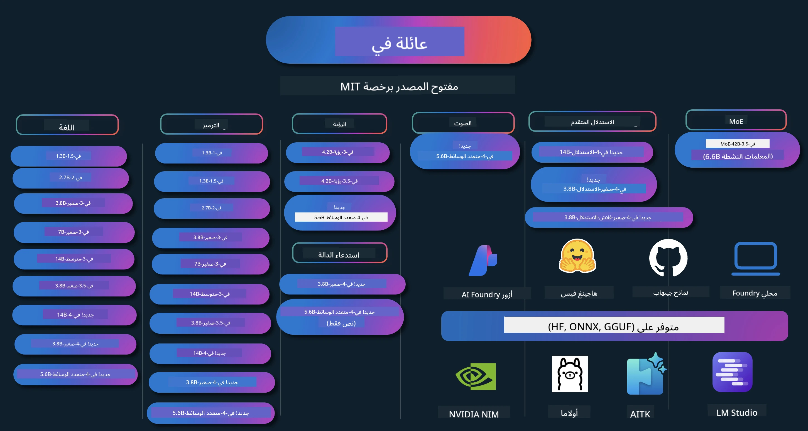

# كتاب وصفات في: أمثلة عملية مع نماذج في من مايكروسوفت

[](https://codespaces.new/microsoft/phicookbook)
[](https://vscode.dev/redirect?url=vscode://ms-vscode-remote.remote-containers/cloneInVolume?url=https://github.com/microsoft/phicookbook)

[](https://GitHub.com/microsoft/phicookbook/graphs/contributors/?WT.mc_id=aiml-137032-kinfeylo)
[](https://GitHub.com/microsoft/phicookbook/issues/?WT.mc_id=aiml-137032-kinfeylo)
[](https://GitHub.com/microsoft/phicookbook/pulls/?WT.mc_id=aiml-137032-kinfeylo)
[](http://makeapullrequest.com?WT.mc_id=aiml-137032-kinfeylo)

[](https://GitHub.com/microsoft/phicookbook/watchers/?WT.mc_id=aiml-137032-kinfeylo)
[](https://GitHub.com/microsoft/phicookbook/network/?WT.mc_id=aiml-137032-kinfeylo)
[](https://GitHub.com/microsoft/phicookbook/stargazers/?WT.mc_id=aiml-137032-kinfeylo)

[](https://discord.com/invite/ByRwuEEgH4)

في هي سلسلة من نماذج الذكاء الاصطناعي مفتوحة المصدر تم تطويرها من قبل مايكروسوفت.

في هي حالياً أقوى نموذج لغوي صغير (SLM) وأكثره فعالية من حيث التكلفة، مع معايير أداء جيدة جداً في اللغات المتعددة، الاستدلال، توليد النص/الدردشة، الترميز، الصور، الصوت وسيناريوهات أخرى.

يمكنك نشر في على السحابة أو على أجهزة الحافة، ويمكنك بسهولة بناء تطبيقات الذكاء الاصطناعي التوليدية مع قدرة حسابية محدودة.

اتبع هذه الخطوات للبدء باستخدام هذه الموارد:
1. **فرعي المستودع**: اضغط [](https://GitHub.com/microsoft/phicookbook/network/?WT.mc_id=aiml-137032-kinfeylo)
2. **انسخ المستودع**: `git clone https://github.com/microsoft/PhiCookBook.git`
3. [**انضم إلى مجتمع Microsoft AI في ديسكورد والتق بخبراء ومطورين زملاء**](https://discord.com/invite/ByRwuEEgH4?WT.mc_id=aiml-137032-kinfeylo)



### 🌐 دعم متعدد اللغات

#### مدعوم عبر GitHub Action (آلي ومحدث باستمرار)

<!-- CO-OP TRANSLATOR LANGUAGES TABLE START -->
[العربية](./README.md) | [البنغالية](../bn/README.md) | [البلغارية](../bg/README.md) | [البورمية (ميانمار)](../my/README.md) | [الصينية (المبسطة)](../zh-CN/README.md) | [الصينية (التقليدية، هونغ كونغ)](../zh-HK/README.md) | [الصينية (التقليدية، ماكاو)](../zh-MO/README.md) | [الصينية (التقليدية، تايوان)](../zh-TW/README.md) | [الكرواتية](../hr/README.md) | [التشيكية](../cs/README.md) | [الدنماركية](../da/README.md) | [الهولندية](../nl/README.md) | [الإستونية](../et/README.md) | [الفنلندية](../fi/README.md) | [الفرنسية](../fr/README.md) | [الألمانية](../de/README.md) | [اليونانية](../el/README.md) | [العبرية](../he/README.md) | [الهندية](../hi/README.md) | [الهنغارية](../hu/README.md) | [الإندونيسية](../id/README.md) | [الإيطالية](../it/README.md) | [اليابانية](../ja/README.md) | [الكنادا](../kn/README.md) | [الكورية](../ko/README.md) | [الليتوانية](../lt/README.md) | [الماليزية](../ms/README.md) | [المالايالامية](../ml/README.md) | [الماراثية](../mr/README.md) | [النيبالية](../ne/README.md) | [بيدجين نيجيرية](../pcm/README.md) | [النرويجية](../no/README.md) | [الفارسية (اللغة الفارسية)](../fa/README.md) | [البولندية](../pl/README.md) | [البرتغالية (البرازيل)](../pt-BR/README.md) | [البرتغالية (البرتغال)](../pt-PT/README.md) | [البنجابية (جورموخي)](../pa/README.md) | [الرومانية](../ro/README.md) | [الروسية](../ru/README.md) | [الصربية (السيريلية)](../sr/README.md) | [السلوفاكية](../sk/README.md) | [السلوفينية](../sl/README.md) | [الإسبانية](../es/README.md) | [السواحيلية](../sw/README.md) | [السويدية](../sv/README.md) | [التاغالوغ (الفلبينية)](../tl/README.md) | [التاميلية](../ta/README.md) | [التيلوغو](../te/README.md) | [التايلاندية](../th/README.md) | [التركية](../tr/README.md) | [الأوكرانية](../uk/README.md) | [الأردوية](../ur/README.md) | [الفيتنامية](../vi/README.md)

> **تفضل النسخ محليًا؟**
>
> يتضمن هذا المستودع أكثر من 50 ترجمة للغات مختلفة مما يزيد حجم التنزيل بشكل كبير. للنسخ بدون الترجمات، استخدم "السحب الجزئي":
>
> **باش / ماك أو إس / لينوكس:**
> ```bash
> git clone --filter=blob:none --sparse https://github.com/microsoft/PhiCookBook.git
> cd PhiCookBook
> git sparse-checkout set --no-cone '/*' '!translations' '!translated_images'
> ```
>
> **CMD (ويندوز):**
> ```cmd
> git clone --filter=blob:none --sparse https://github.com/microsoft/PhiCookBook.git
> cd PhiCookBook
> git sparse-checkout set --no-cone "/*" "!translations" "!translated_images"
> ```
>
> هذا يعطيك كل ما تحتاجه لإكمال الدورة مع تنزيل أسرع بكثير.
<!-- CO-OP TRANSLATOR LANGUAGES TABLE END -->

## جدول المحتويات

- مقدمة
  - [مرحباً بك في عائلة في](./md/01.Introduction/01/01.PhiFamily.md)
  - [إعداد البيئة الخاصة بك](./md/01.Introduction/01/01.EnvironmentSetup.md)
  - [فهم التقنيات الرئيسية](./md/01.Introduction/01/01.Understandingtech.md)
  - [أمان الذكاء الاصطناعي لنماذج في](./md/01.Introduction/01/01.AISafety.md)
  - [دعم الأجهزة الخاصة بـ في](./md/01.Introduction/01/01.Hardwaresupport.md)
  - [نماذج في والتوافر عبر المنصات](./md/01.Introduction/01/01.Edgeandcloud.md)
  - [استخدام Guidance-ai و في](./md/01.Introduction/01/01.Guidance.md)
  - [نماذج سوق GitHub](https://github.com/marketplace/models)
  - [كتالوج نماذج Azure AI](https://ai.azure.com)

- الاستدلال على في في بيئات مختلفة
    -  [Hugging face](./md/01.Introduction/02/01.HF.md)
    -  [نماذج GitHub](./md/01.Introduction/02/02.GitHubModel.md)
    -  [كتالوج نماذج Microsoft Foundry](./md/01.Introduction/02/03.AzureAIFoundry.md)
    -  [Ollama](./md/01.Introduction/02/04.Ollama.md)
    -  [مجموعة أدوات AI في VSCode (AITK)](./md/01.Introduction/02/05.AITK.md)
    -  [NVIDIA NIM](./md/01.Introduction/02/06.NVIDIA.md)
    -  [Foundry Local](./md/01.Introduction/02/07.FoundryLocal.md)

- استدلال عائلة في
    - [استدلال في على iOS](./md/01.Introduction/03/iOS_Inference.md)
    - [استدلال في على Android](./md/01.Introduction/03/Android_Inference.md)
    - [استدلال في على Jetson](./md/01.Introduction/03/Jetson_Inference.md)
    - [استدلال في على AI PC](./md/01.Introduction/03/AIPC_Inference.md)
    - [استدلال في مع إطار عمل Apple MLX](./md/01.Introduction/03/MLX_Inference.md)
    - [استدلال في على الخادم المحلي](./md/01.Introduction/03/Local_Server_Inference.md)
    - [استدلال في على الخادم البعيد باستخدام مجموعة أدوات AI](./md/01.Introduction/03/Remote_Interence.md)
    - [استدلال في مع Rust](./md/01.Introduction/03/Rust_Inference.md)
    - [استدلال في-الرؤية محلياً](./md/01.Introduction/03/Vision_Inference.md)
    - [استدلال في مع Kaito AKS، حاويات Azure (الدعم الرسمي)](./md/01.Introduction/03/Kaito_Inference.md)
-  [تكميم عائلة في](./md/01.Introduction/04/QuantifyingPhi.md)
    - [تكميم في-3.5 / 4 باستخدام llama.cpp](./md/01.Introduction/04/UsingLlamacppQuantifyingPhi.md)
    - [تكميم في-3.5 / 4 باستخدام امتدادات الذكاء الاصطناعي التوليدية لـ onnxruntime](./md/01.Introduction/04/UsingORTGenAIQuantifyingPhi.md)
    - [تكميم في-3.5 / 4 باستخدام Intel OpenVINO](./md/01.Introduction/04/UsingIntelOpenVINOQuantifyingPhi.md)
    - [تكميم في-3.5 / 4 باستخدام إطار عمل Apple MLX](./md/01.Introduction/04/UsingAppleMLXQuantifyingPhi.md)

-  تقييم في
    - [الذكاء الاصطناعي المسؤول](./md/01.Introduction/05/ResponsibleAI.md)
    - [Microsoft Foundry للتقييم](./md/01.Introduction/05/AIFoundry.md)
    - [استخدام Promptflow للتقييم](./md/01.Introduction/05/Promptflow.md)
 
- RAG مع Azure AI Search
    - [كيفية استخدام Phi-4-mini و Phi-4-multimodal (RAG) مع Azure AI Search](https://github.com/microsoft/PhiCookBook/blob/main/code/06.E2E/E2E_Phi-4-RAG-Azure-AI-Search.ipynb)

- عينات تطوير تطبيقات في
  - تطبيقات النص والدردشة
    - عينات Phi-4 🆕
      - [📓] [الدردشة مع نموذج Phi-4-mini ONNX](./md/02.Application/01.TextAndChat/Phi4/ChatWithPhi4ONNX/README.md)
      - [الدردشة مع نموذج Phi-4 المحلي ONNX .NET](../../md/04.HOL/dotnet/src/LabsPhi4-Chat-01OnnxRuntime)
      - [تطبيق دردشة .NET Console مع Phi-4 ONNX باستخدام Sementic Kernel](../../md/04.HOL/dotnet/src/LabsPhi4-Chat-02SK)
    - عينات Phi-3 / 3.5
      - [بوت دردشة محلي في المتصفح باستخدام Phi3، ONNX Runtime Web و WebGPU](https://github.com/microsoft/onnxruntime-inference-examples/tree/main/js/chat)
      - [دردشة OpenVino](./md/02.Application/01.TextAndChat/Phi3/E2E_OpenVino_Chat.md)
      - [نموذج متعدد - Phi-3-mini التفاعلي و OpenAI Whisper](./md/02.Application/01.TextAndChat/Phi3/E2E_Phi-3-mini_with_whisper.md)
      - [MLFlow - بناء غلاف واستخدام Phi-3 مع MLFlow](./md//02.Application/01.TextAndChat/Phi3/E2E_Phi-3-MLflow.md)
      - [تحسين النموذج - كيفية تحسين نموذج Phi-3-min لـ ONNX Runtime Web باستخدام Olive](https://github.com/microsoft/Olive/tree/main/examples/phi3)
      - [تطبيق WinUI3 مع Phi-3 mini-4k-instruct-onnx](https://github.com/microsoft/Phi3-Chat-WinUI3-Sample/)
      -[عينة تطبيق ملاحظات مدعوم بالذكاء الاصطناعي متعدد النماذج لـ WinUI3](https://github.com/microsoft/ai-powered-notes-winui3-sample)
      - [ضبط وتحسين نماذج Phi-3 مخصصة ودمجها مع Prompt flow](./md/02.Application/01.TextAndChat/Phi3/E2E_Phi-3-FineTuning_PromptFlow_Integration.md)
      - [ضبط وتحسين نماذج Phi-3 مخصصة ودمجها مع Prompt flow في Microsoft Foundry](./md/02.Application/01.TextAndChat/Phi3/E2E_Phi-3-FineTuning_PromptFlow_Integration_AIFoundry.md)
      - [تقييم نموذج Phi-3 / Phi-3.5 المحسن في Microsoft Foundry مع التركيز على مبادئ الذكاء الاصطناعي المسؤول من مايكروسوفت](./md/02.Application/01.TextAndChat/Phi3/E2E_Phi-3-Evaluation_AIFoundry.md)
      - [📓] [عينة توقع اللغة Phi-3.5-mini-instruct (صينية/إنجليزية)](./md/02.Application/01.TextAndChat/Phi3/phi3-instruct-demo.ipynb)
      - [روبوت دردشة Phi-3.5-Instruct WebGPU RAG](./md/02.Application/01.TextAndChat/Phi3/WebGPUWithPhi35Readme.md)
      - [استخدام GPU ويندوز لإنشاء حل Prompt flow مع Phi-3.5-Instruct ONNX](./md/02.Application/01.TextAndChat/Phi3/UsingPromptFlowWithONNX.md)
      - [استخدام Microsoft Phi-3.5 tflite لإنشاء تطبيق أندرويد](./md/02.Application/01.TextAndChat/Phi3/UsingPhi35TFLiteCreateAndroidApp.md)
      - [مثال أسئلة وأجوبة .NET باستخدام نموذج ONNX Phi-3 المحلي باستخدام Microsoft.ML.OnnxRuntime](../../md/04.HOL/dotnet/src/LabsPhi301)
      - [تطبيق دردشة وحدة تحكم .NET مع Semantic Kernel و Phi-3](../../md/04.HOL/dotnet/src/LabsPhi302)

  - عينات كود SDK استنتاج Azure AI 
    - عينات Phi-4 🆕
      - [📓] [توليد كود مشروع باستخدام Phi-4-multimodal](./md/02.Application/02.Code/Phi4/GenProjectCode/README.md)
    - عينات Phi-3 / 3.5
      - [بناء دردشة GitHub Copilot في Visual Studio Code الخاصة بك مع عائلة Microsoft Phi-3](./md/02.Application/02.Code/Phi3/VSCodeExt/README.md)
      - [إنشاء وكلاء دردشة GitHub Copilot الخاصة بك في Visual Studio Code مع Phi-3.5 بواسطة نماذج GitHub](/md/02.Application/02.Code/Phi3/CreateVSCodeChatAgentWithGitHubModels.md)

  - عينات التفكير المتقدم
    - عينات Phi-4 🆕
      - [📓] [عينات التفكير Phi-4-mini-reasoning أو Phi-4-reasoning](./md/02.Application/03.AdvancedReasoning/Phi4/AdvancedResoningPhi4mini/README.md)
      - [📓] [ضبط دقيق لـ Phi-4-mini-reasoning مع Microsoft Olive](./md/02.Application/03.AdvancedReasoning/Phi4/AdvancedResoningPhi4mini/olive_ft_phi_4_reasoning_with_medicaldata.ipynb)
      - [📓] [ضبط دقيق لـ Phi-4-mini-reasoning مع Apple MLX](./md/02.Application/03.AdvancedReasoning/Phi4/AdvancedResoningPhi4mini/mlx_ft_phi_4_reasoning_with_medicaldata.ipynb)
      - [📓] [Phi-4-mini-reasoning مع نماذج GitHub](./md/02.Application/02.Code/Phi4r/github_models_inference.ipynb)
      - [📓] [Phi-4-mini-reasoning مع نماذج Microsoft Foundry](./md/02.Application/02.Code/Phi4r/azure_models_inference.ipynb)
  - العروض التوضيحية
      - [عروض mini Phi-4 مستضافة على مساحات Hugging Face](https://huggingface.co/spaces/microsoft/phi-4-mini?WT.mc_id=aiml-137032-kinfeylo)
      - [عروض Phi-4-multimodal المستضافة على مساحات Hugginge Face](https://huggingface.co/spaces/microsoft/phi-4-multimodal?WT.mc_id=aiml-137032-kinfeylo)
  - عينات الرؤية
    - عينات Phi-4 🆕
      - [📓] [استخدام Phi-4-multimodal لقراءة الصور وتوليد الكود](./md/02.Application/04.Vision/Phi4/CreateFrontend/README.md) 
    - عينات Phi-3 / 3.5
      -  [📓][تحويل نص صورة Phi-3-vision إلى نص](./md/02.Application/04.Vision/Phi3/E2E_Phi-3-vision-image-text-to-text-online-endpoint.ipynb)
      - [Phi-3-vision-ONNX](https://onnxruntime.ai/docs/genai/tutorials/phi3-v.html)
      - [📓][تضمين CLIP لـ Phi-3-vision](./md/02.Application/04.Vision/Phi3/E2E_Phi-3-vision-image-text-to-text-online-endpoint.ipynb)
      - [عرض: إعادة التدوير Phi-3](https://github.com/jennifermarsman/PhiRecycling/)
      - [مساعد لغة بصري Phi-3-vision - مع Phi3-Vision و OpenVINO](https://docs.openvino.ai/nightly/notebooks/phi-3-vision-with-output.html)
      - [Phi-3 Vision Nvidia NIM](./md/02.Application/04.Vision/Phi3/E2E_Nvidia_NIM_Vision.md)
      - [Phi-3 Vision OpenVino](./md/02.Application/04.Vision/Phi3/E2E_OpenVino_Phi3Vision.md)
      - [📓][عينة رؤية متعددة الإطارات أو متعددة الصور لـ Phi-3.5 Vision](./md/02.Application/04.Vision/Phi3/phi3-vision-demo.ipynb)
      - [نموذج ONNX محلي لفوج Phi-3 Vision باستخدام Microsoft.ML.OnnxRuntime .NET](../../md/04.HOL/dotnet/src/LabsPhi303)
      - [نموذج ONNX محلي قائم على القائمة لـ Phi-3 Vision باستخدام Microsoft.ML.OnnxRuntime .NET](../../md/04.HOL/dotnet/src/LabsPhi304)

  - عينات الرياضيات
    - عينات Phi-4-Mini-Flash-Reasoning-Instruct 🆕 [عرض تجريبي للرياضيات مع Phi-4-Mini-Flash-Reasoning-Instruct](./md/02.Application/09.Math/MathDemo.ipynb)

  - عينات الصوت
    - عينات Phi-4 🆕
      - [📓] [استخراج نصوص الصوت باستخدام Phi-4-multimodal](./md/02.Application/05.Audio/Phi4/Transciption/README.md)
      - [📓] [عينة صوتية Phi-4-multimodal](./md/02.Application/05.Audio/Phi4/Siri/demo.ipynb)
      - [📓] [عينة ترجمة الكلام Phi-4-multimodal](./md/02.Application/05.Audio/Phi4/Translate/demo.ipynb)
      - [تطبيق وحدة تحكم .NET باستخدام Phi-4-multimodal لتحليل ملف صوتي وتوليد النص](../../md/04.HOL/dotnet/src/LabsPhi4-MultiModal-02Audio)

  - عينات MOE
    - عينات Phi-3 / 3.5
      - [📓] [نماذج مختلطة من الخبراء Phi-3.5 (MoEs) عينة الوسائط الاجتماعية](./md/02.Application/06.MoE/Phi3/phi3_moe_demo.ipynb)
      - [📓] [بناء خط أنابيب توليد معزز باسترجاع (RAG) مع NVIDIA NIM Phi-3 MOE، Azure AI Search، و LlamaIndex](./md/02.Application/06.MoE/Phi3/azure-ai-search-nvidia-rag.ipynb)
      - 
  - عينات استدعاء الدوال
    - عينات Phi-4 🆕
      -  [📓] [استخدام استدعاء الدالة مع Phi-4-mini](./md/02.Application/07.FunctionCalling/Phi4/FunctionCallingBasic/README.md)
      -  [📓] [استخدام استدعاء الدالة لإنشاء وكلاء متعددين مع Phi-4-mini](./md/02.Application/07.FunctionCalling/Phi4/Multiagents/Phi_4_mini_multiagent.ipynb)
      -  [📓] [استخدام استدعاء الدالة مع Ollama](./md/02.Application/07.FunctionCalling/Phi4/Ollama/ollama_functioncalling.ipynb)
      -  [📓] [استخدام استدعاء الدالة مع ONNX](./md/02.Application/07.FunctionCalling/Phi4/ONNX/onnx_parallel_functioncalling.ipynb)
  - عينات المزج متعدد الوسائط
    - عينات Phi-4 🆕
      -  [📓] [استخدام Phi-4-multimodal كصحفي تقني](./md/02.Application/08.Multimodel/Phi4/TechJournalist/phi_4_mm_audio_text_publish_news.ipynb)
      - [تطبيق وحدة تحكم .NET باستخدام Phi-4-multimodal لتحليل الصور](../../md/04.HOL/dotnet/src/LabsPhi4-MultiModal-01Images)

- عينات ضبط دقيقة لـ Phi
  - [سيناريوهات الضبط الدقيق](./md/03.FineTuning/FineTuning_Scenarios.md)
  - [الضبط الدقيق مقابل RAG](./md/03.FineTuning/FineTuning_vs_RAG.md)
  - [دع Phi-3 يصبح خبيرًا صناعيًا - ضبط دقيق](./md/03.FineTuning/LetPhi3gotoIndustriy.md)
  - [الضبط الدقيق لـ Phi-3 باستخدام أدوات AI لـ VS Code](./md/03.FineTuning/Finetuning_VSCodeaitoolkit.md)
  - [الضبط الدقيق لـ Phi-3 مع خدمة Azure Machine Learning](./md/03.FineTuning/Introduce_AzureML.md)
  - [الضبط الدقيق لـ Phi-3 بـ Lora](./md/03.FineTuning/FineTuning_Lora.md)
  - [الضبط الدقيق لـ Phi-3 بـ QLora](./md/03.FineTuning/FineTuning_Qlora.md)
  - [الضبط الدقيق لـ Phi-3 مع Microsoft Foundry](./md/03.FineTuning/FineTuning_AIFoundry.md)
  - [الضبط الدقيق لـ Phi-3 مع Azure ML CLI/SDK](./md/03.FineTuning/FineTuning_MLSDK.md)
  - [الضبط الدقيق مع Microsoft Olive](./md/03.FineTuning/FineTuning_MicrosoftOlive.md)
  - [معمل تطبيقي للضبط الدقيق باستخدام Microsoft Olive](./md/03.FineTuning/olive-lab/readme.md)
  - [الضبط الدقيق لـ Phi-3-vision باستخدام Weights and Bias](./md/03.FineTuning/FineTuning_Phi-3-visionWandB.md)
  - [الضبط الدقيق لـ Phi-3 باستخدام إطار عمل Apple MLX](./md/03.FineTuning/FineTuning_MLX.md)
  - [الضبط الدقيق لـ Phi-3-vision (الدعم الرسمي)](./md/03.FineTuning/FineTuning_Vision.md)
  - [الضبط الدقيق لـ Phi-3 باستخدام Kaito AKS وحاويات Azure (الدعم الرسمي)](./md/03.FineTuning/FineTuning_Kaito.md)
  - [الضبط الدقيق لـ Phi-3 و 3.5 Vision](https://github.com/2U1/Phi3-Vision-Finetune)

- معمل تطبيقي
  - [استكشاف النماذج المتقدمة: LLMs، SLMs، التطوير المحلي والمزيد](https://github.com/microsoft/aitour-exploring-cutting-edge-models)
  - [فتح إمكانيات معالجة اللغة الطبيعية: الضبط الدقيق مع Microsoft Olive](https://github.com/azure/Ignite_FineTuning_workshop)
- أوراق أبحاث أكاديمية ومنشورات
  - [الكتب الدراسية هي كل ما تحتاجه II: التقرير الفني phi-1.5](https://arxiv.org/abs/2309.05463)
  - [تقرير phi-3 الفني: نموذج لغة عالي القدرات محليًا على هاتفك](https://arxiv.org/abs/2404.14219)
  - [تقرير phi-4 الفني](https://arxiv.org/abs/2412.08905)
  - [التقرير الفني phi-4-Mini: نماذج لغوية متعددة الوسائط قوية ومضغوطة عبر مزيج من LoRAs](https://arxiv.org/abs/2503.01743)
  - [تحسين نماذج اللغة الصغيرة لاستدعاء الوظائف داخل السيارة](https://arxiv.org/abs/2501.02342)
  - [(لماذا PHI) تحسين PHI-3 للإجابة على الأسئلة متعددة الاختيارات: المنهجية، النتائج، والتحديات](https://arxiv.org/abs/2501.01588)
  - [تقرير phi-4-التفكير الفني](https://www.microsoft.com/en-us/research/wp-content/uploads/2025/04/phi_4_reasoning.pdf)
  - [تقرير phi-4-mini-التفكير الفني](https://huggingface.co/microsoft/Phi-4-mini-reasoning/blob/main/Phi-4-Mini-Reasoning.pdf)

## استخدام نماذج Phi

### Phi على Microsoft Foundry

يمكنك معرفة كيفية استخدام Microsoft Phi وكيفية بناء حلول شاملة على أجهزتك المختلفة. لتجربة Phi بنفسك، ابدأ بالتلاعب بالنماذج وتخصيص Phi لسيناريوهاتك باستخدام [كتالوج نماذج Microsoft Foundry](https://aka.ms/phi3-azure-ai) يمكنك معرفة المزيد في البدء مع [Microsoft Foundry](/md/02.QuickStart/AzureAIFoundry_QuickStart.md).

**ساحة اللعب**
لكل نموذج ساحة لعب مخصصة لاختبار النموذج [Azure AI Playground](https://aka.ms/try-phi3).

### Phi على نماذج GitHub

يمكنك معرفة كيفية استخدام Microsoft Phi وكيفية بناء حلول شاملة على أجهزتك المختلفة. لتجربة Phi بنفسك، ابدأ بالتلاعب بالنموذج وتخصيص Phi لسيناريوهاتك باستخدام [كتالوج نماذج GitHub](https://github.com/marketplace/models?WT.mc_id=aiml-137032-kinfeylo) يمكنك معرفة المزيد في البدء مع [كتالوج نماذج GitHub](/md/02.QuickStart/GitHubModel_QuickStart.md).

**ساحة اللعب**
كل نموذج له [ساحة لعب مخصصة لاختبار النموذج](/md/02.QuickStart/GitHubModel_QuickStart.md).

### Phi على Hugging Face

يمكنك أيضًا العثور على النموذج على [Hugging Face](https://huggingface.co/microsoft).

**ساحة اللعب**
[ساحة لعب Hugging Chat](https://huggingface.co/chat/models/microsoft/Phi-3-mini-4k-instruct).

 ## 🎒 دورات أخرى

ينتج فريقنا دورات أخرى! تحقق من:

<!-- CO-OP TRANSLATOR OTHER COURSES START -->
### LangChain
[](https://aka.ms/langchain4j-for-beginners)
[](https://aka.ms/langchainjs-for-beginners?WT.mc_id=m365-94501-dwahlin)
[](https://github.com/microsoft/langchain-for-beginners?WT.mc_id=m365-94501-dwahlin)
---

### Azure / Edge / MCP / Agents
[](https://github.com/microsoft/AZD-for-beginners?WT.mc_id=academic-105485-koreyst)
[](https://github.com/microsoft/edgeai-for-beginners?WT.mc_id=academic-105485-koreyst)
[](https://github.com/microsoft/mcp-for-beginners?WT.mc_id=academic-105485-koreyst)
[](https://github.com/microsoft/ai-agents-for-beginners?WT.mc_id=academic-105485-koreyst)

---
 
### سلسلة الذكاء الاصطناعي التوليدي
[](https://github.com/microsoft/generative-ai-for-beginners?WT.mc_id=academic-105485-koreyst)
[-9333EA?style=for-the-badge&labelColor=E5E7EB&color=9333EA)](https://github.com/microsoft/Generative-AI-for-beginners-dotnet?WT.mc_id=academic-105485-koreyst)
[-C084FC?style=for-the-badge&labelColor=E5E7EB&color=C084FC)](https://github.com/microsoft/generative-ai-for-beginners-java?WT.mc_id=academic-105485-koreyst)
[-E879F9?style=for-the-badge&labelColor=E5E7EB&color=E879F9)](https://github.com/microsoft/generative-ai-with-javascript?WT.mc_id=academic-105485-koreyst)

---
 
### التعلم الأساسي
[](https://aka.ms/ml-beginners?WT.mc_id=academic-105485-koreyst)
[](https://aka.ms/datascience-beginners?WT.mc_id=academic-105485-koreyst)
[](https://aka.ms/ai-beginners?WT.mc_id=academic-105485-koreyst)
[](https://github.com/microsoft/Security-101?WT.mc_id=academic-96948-sayoung)
[](https://aka.ms/webdev-beginners?WT.mc_id=academic-105485-koreyst)
[](https://aka.ms/iot-beginners?WT.mc_id=academic-105485-koreyst)
[](https://github.com/microsoft/xr-development-for-beginners?WT.mc_id=academic-105485-koreyst)

---
 
### سلسلة كو بايلوت
[](https://aka.ms/GitHubCopilotAI?WT.mc_id=academic-105485-koreyst)
[](https://github.com/microsoft/mastering-github-copilot-for-dotnet-csharp-developers?WT.mc_id=academic-105485-koreyst)
[](https://github.com/microsoft/CopilotAdventures?WT.mc_id=academic-105485-koreyst)
<!-- CO-OP TRANSLATOR OTHER COURSES END -->

## الذكاء الاصطناعي المسؤول 

تلتزم Microsoft بمساعدة عملائنا على استخدام منتجات الذكاء الاصطناعي لدينا بمسؤولية، ومشاركة ما تعلمناه، وبناء شراكات قائمة على الثقة من خلال أدوات مثل ملاحظات الشفافية وتقييمات الأثر. يمكن العثور على العديد من هذه الموارد في [https://aka.ms/RAI](https://aka.ms/RAI).
تعتمد منهجية Microsoft في الذكاء الاصطناعي المسؤول على مبادئ الذكاء الاصطناعي لدينا وهي: العدالة، الموثوقية والسلامة، الخصوصية والأمان، الشمولية، الشفافية، والمساءلة.

يمكن لنماذج اللغة والصورة والصوت واسعة النطاق - مثل المستخدمة في هذا المثال - أن تتصرف بطرق قد تكون غير عادلة، غير موثوقة، أو مسيئة، مما قد يسبب أضرارًا. يرجى مراجعة [ملاحظة الشفافية لخدمة Azure OpenAI](https://learn.microsoft.com/legal/cognitive-services/openai/transparency-note?tabs=text) للاطلاع على المخاطر والقيود.

النهج الموصى به للتخفيف من هذه المخاطر هو تضمين نظام أمان في هيكلك يمكنه اكتشاف ومنع السلوك الضار. توفر [خدمة أمان المحتوى من Azure AI](https://learn.microsoft.com/azure/ai-services/content-safety/overview) طبقة حماية مستقلة، قادرة على اكتشاف المحتوى الضار المُنشأ من المستخدم أو بواسطة الذكاء الاصطناعي في التطبيقات والخدمات. تتضمن خدمة أمان المحتوى من Azure AI واجهات برمجة التطبيقات للنصوص والصور التي تسمح لك باكتشاف المواد الضارة. ضمن Microsoft Foundry، تتيح لك خدمة أمان المحتوى عرض واستكشاف وتجربة أمثلة على الشيفرات لاكتشاف المحتوى الضار عبر وسائط متعددة. ترشدك الوثائق التالية [quickstart documentation](https://learn.microsoft.com/azure/ai-services/content-safety/quickstart-text?tabs=visual-studio%2Clinux&pivots=programming-language-rest) خلال إرسال الطلبات إلى الخدمة.
جانب آخر يجب أخذه في الاعتبار هو أداء التطبيق بشكل عام. مع التطبيقات متعددة الوسائط والنماذج المتعددة، نعتبر أن الأداء يعني أن النظام يعمل كما تتوقع أنت ومستخدموك، بما في ذلك عدم توليد مخرجات ضارة. من المهم تقييم أداء التطبيق العام الخاص بك باستخدام [مقاييس الأداء والجودة والمخاطر والسلامة](https://learn.microsoft.com/azure/ai-studio/concepts/evaluation-metrics-built-in). لديك أيضًا القدرة على الإنشاء والتقييم باستخدام [المقاييس المخصصة](https://learn.microsoft.com/azure/ai-studio/how-to/develop/evaluate-sdk#custom-evaluators).

يمكنك تقييم تطبيق الذكاء الاصطناعي الخاص بك في بيئة التطوير الخاصة بك باستخدام [مجموعة تطوير البرمجيات لتقييم الذكاء الاصطناعي من Azure](https://microsoft.github.io/promptflow/index.html). بناءً على مجموعة بيانات اختبار أو هدف معين، يتم قياس توليدات تطبيق الذكاء الاصطناعي التوليدي الخاص بك بطريقة كمية باستخدام المقاييس المدمجة أو المقاييس المخصصة التي تختارها. للبدء باستخدام مجموعة تطوير برمجيات تقييم الذكاء الاصطناعي من Azure لتقييم نظامك، يمكنك اتباع [دليل البدء السريع](https://learn.microsoft.com/azure/ai-studio/how-to/develop/flow-evaluate-sdk). بمجرد تنفيذ تشغيل للتقييم، يمكنك [عرض النتائج في Microsoft Foundry](https://learn.microsoft.com/azure/ai-studio/how-to/evaluate-flow-results). 

## العلامات التجارية

قد يحتوي هذا المشروع على علامات تجارية أو شعارات لمشاريع أو منتجات أو خدمات. الاستخدام المفوض لعلامات Microsoft التجارية أو شعاراتها يخضع ويجب أن يتبع [إرشادات العلامات التجارية والعلامة التجارية لمايكروسوفت](https://www.microsoft.com/legal/intellectualproperty/trademarks/usage/general).
يجب ألا يتسبب استخدام علامات Microsoft التجارية أو شعاراتها في نسخ معدلة من هذا المشروع في حدوث ارتباك أو الإيحاء برعاية Microsoft. أي استخدام لعلامات تجارية أو شعارات لأطراف ثالثة يخضع لسياسات تلك الأطراف الثالثة.

## الحصول على المساعدة

إذا واجهت مشكلة أو كان لديك أي استفسارات حول بناء تطبيقات الذكاء الاصطناعي، انضم إلى:

[](https://aka.ms/foundry/discord)

إذا كان لديك ملاحظات على المنتج أو أخطاء أثناء البناء، قم بزيارة:

[](https://aka.ms/foundry/forum)

---

<!-- CO-OP TRANSLATOR DISCLAIMER START -->
**إخلاء المسؤولية**:  
تمت ترجمة هذا المستند باستخدام خدمة الترجمة الآلية [Co-op Translator](https://github.com/Azure/co-op-translator). بينما نسعى لتحقيق الدقة، يرجى العلم أن الترجمات الآلية قد تحتوي على أخطاء أو عدم دقة. يجب اعتبار المستند الأصلي بلغته الأصلية المصدر المعتمد. بالنسبة للمعلومات الحرجة، يُوصى بالترجمة البشرية المهنية. نحن غير مسؤولين عن أي سوء فهم أو تفسير ناتج عن استخدام هذه الترجمة.
<!-- CO-OP TRANSLATOR DISCLAIMER END -->