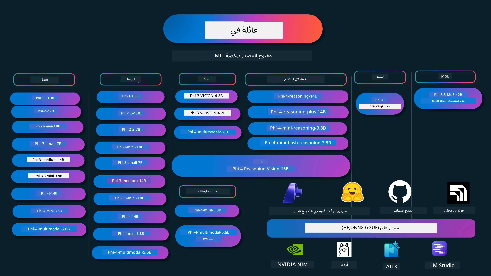

# كتاب وصفات Phi: أمثلة عملية مع نماذج Phi من مايكروسوفت

[](https://codespaces.new/microsoft/phicookbook)
[](https://vscode.dev/redirect?url=vscode://ms-vscode-remote.remote-containers/cloneInVolume?url=https://github.com/microsoft/phicookbook)

[](https://GitHub.com/microsoft/phicookbook/graphs/contributors/?WT.mc_id=aiml-137032-kinfeylo)
[](https://GitHub.com/microsoft/phicookbook/issues/?WT.mc_id=aiml-137032-kinfeylo)
[](https://GitHub.com/microsoft/phicookbook/pulls/?WT.mc_id=aiml-137032-kinfeylo)
[](http://makeapullrequest.com?WT.mc_id=aiml-137032-kinfeylo)

[](https://GitHub.com/microsoft/phicookbook/watchers/?WT.mc_id=aiml-137032-kinfeylo)
[](https://GitHub.com/microsoft/phicookbook/network/?WT.mc_id=aiml-137032-kinfeylo)
[](https://GitHub.com/microsoft/phicookbook/stargazers/?WT.mc_id=aiml-137032-kinfeylo)

[](https://discord.com/invite/ByRwuEEgH4)

Phi هي سلسلة من نماذج الذكاء الاصطناعي مفتوحة المصدر التي طورتها مايكروسوفت.

Phi هي حالياً أقوى نموذج لغوي صغير (SLM) من حيث القوة والتكلفة، مع مؤشرات أداء جيدة جداً في اللغات المتعددة، والتفكير، وتوليد النص/الدردشة، والترميز، والصور، والصوت، وسيناريوهات أخرى.

يمكنك نشر Phi في السحابة أو على أجهزة الحافة، ويمكنك بسهولة بناء تطبيقات الذكاء الاصطناعي التوليدية مع طاقة حوسبة محدودة.

اتبع هذه الخطوات للبدء في استخدام هذه الموارد:
1. **فَرع المستودع**: انقر على [](https://GitHub.com/microsoft/phicookbook/network/?WT.mc_id=aiml-137032-kinfeylo)
2. **استنساخ المستودع**: `git clone https://github.com/microsoft/PhiCookBook.git`
3. [**انضم إلى مجتمع Microsoft AI على Discord والتقِ بالخبراء والمطورين الآخرين**](https://discord.com/invite/ByRwuEEgH4?WT.mc_id=aiml-137032-kinfeylo)



### 🌐 دعم متعدد اللغات

#### مدعوم عبر GitHub Action (آلي ومحدث دائماً)

<!-- CO-OP TRANSLATOR LANGUAGES TABLE START -->
[العربية](./README.md) | [البنغالية](../bn/README.md) | [البلغارية](../bg/README.md) | [البرمية (ميانمار)](../my/README.md) | [الصينية (المبسطة)](../zh-CN/README.md) | [الصينية (التقليدية، هونغ كونغ)](../zh-HK/README.md) | [الصينية (التقليدية، ماكاو)](../zh-MO/README.md) | [الصينية (التقليدية، تايوان)](../zh-TW/README.md) | [الكرواتية](../hr/README.md) | [التشيكية](../cs/README.md) | [الدنماركية](../da/README.md) | [الهولندية](../nl/README.md) | [الإستونية](../et/README.md) | [الفنلندية](../fi/README.md) | [الفرنسية](../fr/README.md) | [الألمانية](../de/README.md) | [اليونانية](../el/README.md) | [العبرية](../he/README.md) | [الهندية](../hi/README.md) | [الهنغارية](../hu/README.md) | [الإندونيسية](../id/README.md) | [الإيطالية](../it/README.md) | [اليابانية](../ja/README.md) | [الكانادا](../kn/README.md) | [الخمير](../km/README.md) | [الكورية](../ko/README.md) | [اللتوانية](../lt/README.md) | [الماليزية](../ms/README.md) | [الماليالم](../ml/README.md) | [الماراثية](../mr/README.md) | [النيبالية](../ne/README.md) | [البيدجين النيجيري](../pcm/README.md) | [النرويجية](../no/README.md) | [الفارسية (اللغة الفارسية)](../fa/README.md) | [البولندية](../pl/README.md) | [البرتغالية (البرازيل)](../pt-BR/README.md) | [البرتغالية (البرتغال)](../pt-PT/README.md) | [البنجابية (غورموخي)](../pa/README.md) | [الرومانية](../ro/README.md) | [الروسية](../ru/README.md) | [الصربية (الكيريلية)](../sr/README.md) | [السلوفاكية](../sk/README.md) | [السلوفينية](../sl/README.md) | [الإسبانية](../es/README.md) | [السواحيلية](../sw/README.md) | [السويدية](../sv/README.md) | [التاغالوغ (الفلبينية)](../tl/README.md) | [التاميلية](../ta/README.md) | [التيلوغو](../te/README.md) | [التايلاندية](../th/README.md) | [التركية](../tr/README.md) | [الأوكرانية](../uk/README.md) | [الأردية](../ur/README.md) | [الفيتنامية](../vi/README.md)

> **هل تفضل الاستنساخ محلياً؟**
>
> هذا المستودع يتضمن أكثر من 50 ترجمة للغات مما يزيد بشكل كبير من حجم التنزيل. للاستنساخ بدون الترجمات، استخدم السحب الانتقائي (sparse checkout):
>
> **Bash / macOS / Linux:**
> ```bash
> git clone --filter=blob:none --sparse https://github.com/microsoft/PhiCookBook.git
> cd PhiCookBook
> git sparse-checkout set --no-cone '/*' '!translations' '!translated_images'
> ```
>
> **CMD (Windows):**
> ```cmd
> git clone --filter=blob:none --sparse https://github.com/microsoft/PhiCookBook.git
> cd PhiCookBook
> git sparse-checkout set --no-cone "/*" "!translations" "!translated_images"
> ```
>
> هذا يمنحك كل ما تحتاجه لإكمال الدورة مع تنزيل أسرع بكثير.
<!-- CO-OP TRANSLATOR LANGUAGES TABLE END -->

## جدول المحتويات
- مقدمة - [مرحبًا بك في عائلة في](./md/01.Introduction/01/01.PhiFamily.md) - [إعداد بيئتك](./md/01.Introduction/01/01.EnvironmentSetup.md) - [فهم التقنيات الرئيسية](./md/01.Introduction/01/01.Understandingtech.md) - [سلامة الذكاء الاصطناعي لنماذج في](./md/01.Introduction/01/01.AISafety.md) - [دعم أجهزة في](./md/01.Introduction/01/01.Hardwaresupport.md) - [نماذج في والتوافر عبر المنصات](./md/01.Introduction/01/01.Edgeandcloud.md) - [استخدام Guidance-ai و في](./md/01.Introduction/01/01.Guidance.md) - [نماذج سوق GitHub](https://github.com/marketplace/models) - [كتالوج نماذج Azure AI](https://ai.azure.com) - الاستدلال في في بيئات مختلفة - [Hugging face](./md/01.Introduction/02/01.HF.md) - [نماذج GitHub](./md/01.Introduction/02/02.GitHubModel.md) - [كتالوج نماذج Microsoft Foundry](./md/01.Introduction/02/03.AzureAIFoundry.md) - [Ollama](./md/01.Introduction/02/04.Ollama.md) - [مجموعة أدوات AI VSCode (AITK)](./md/01.Introduction/02/05.AITK.md) - [NVIDIA NIM](./md/01.Introduction/02/06.NVIDIA.md) - [Foundry محلي](./md/01.Introduction/02/07.FoundryLocal.md) - الاستدلال في عائلة في - [الاستدلال في في على iOS](./md/01.Introduction/03/iOS_Inference.md) - [الاستدلال في في على Android](./md/01.Introduction/03/Android_Inference.md) - [الاستدلال في في على Jetson](./md/01.Introduction/03/Jetson_Inference.md) - [الاستدلال في في على AI PC](./md/01.Introduction/03/AIPC_Inference.md) - [الاستدلال في في باستخدام إطار عمل Apple MLX](./md/01.Introduction/03/MLX_Inference.md) - [الاستدلال في في على الخادم المحلي](./md/01.Introduction/03/Local_Server_Inference.md) - [الاستدلال في في على الخادم البعيد باستخدام مجموعة أدوات AI](./md/01.Introduction/03/Remote_Interence.md) - [الاستدلال في في باستخدام Rust](./md/01.Introduction/03/Rust_Inference.md) - [الاستدلال في في--الرؤية محليًا](./md/01.Introduction/03/Vision_Inference.md) - [الاستدلال في في مع Kaito AKS، حاويات Azure (دعم رسمي)](./md/01.Introduction/03/Kaito_Inference.md) - [تحجيم عائلة في](./md/01.Introduction/04/QuantifyingPhi.md) - [تحجيم Phi-3.5 / 4 باستخدام llama.cpp](./md/01.Introduction/04/UsingLlamacppQuantifyingPhi.md) - [تحجيم Phi-3.5 / 4 باستخدام امتدادات الذكاء الاصطناعي التوليدية لـ onnxruntime](./md/01.Introduction/04/UsingORTGenAIQuantifyingPhi.md) - [تحجيم Phi-3.5 / 4 باستخدام Intel OpenVINO](./md/01.Introduction/04/UsingIntelOpenVINOQuantifyingPhi.md) - [تحجيم Phi-3.5 / 4 باستخدام إطار عمل Apple MLX](./md/01.Introduction/04/UsingAppleMLXQuantifyingPhi.md) - تقييم في - [الذكاء الاصطناعي المسؤول](./md/01.Introduction/05/ResponsibleAI.md) - [Microsoft Foundry للتقييم](./md/01.Introduction/05/AIFoundry.md) - [استخدام Promptflow للتقييم](./md/01.Introduction/05/Promptflow.md) - RAG مع Azure AI Search - [كيفية استخدام Phi-4-mini و Phi-4-multimodal (RAG) مع Azure AI Search](https://github.com/microsoft/PhiCookBook/blob/main/code/06.E2E/E2E_Phi-4-RAG-Azure-AI-Search.ipynb) - عينات تطوير تطبيقات في - تطبيقات النص والدردشة - عينات Phi-4 - [📓] [الدردشة مع نموذج Phi-4-mini ONNX](./md/02.Application/01.TextAndChat/Phi4/ChatWithPhi4ONNX/README.md) - [الدردشة مع نموذج Phi-4 المحلي ONNX .NET](../../md/04.HOL/dotnet/src/LabsPhi4-Chat-01OnnxRuntime) - [تطبيق الدردشة .NET Console مع Phi-4 ONNX باستخدام Semantic Kernel](../../md/04.HOL/dotnet/src/LabsPhi4-Chat-02SK) - عينات Phi-3 / 3.5 - [بوت دردشة محلي في المتصفح باستخدام Phi3، ONNX Runtime Web و WebGPU](https://github.com/microsoft/onnxruntime-inference-examples/tree/main/js/chat) - [دردشة OpenVino](./md/02.Application/01.TextAndChat/Phi3/E2E_OpenVino_Chat.md) - [نموذج متعدد - Phi-3-mini التفاعلي و OpenAI Whisper](./md/02.Application/01.TextAndChat/Phi3/E2E_Phi-3-mini_with_whisper.md) - [MLFlow - بناء غلاف واستخدام Phi-3 مع MLFlow](./md//02.Application/01.TextAndChat/Phi3/E2E_Phi-3-MLflow.md) - [تحسين النموذج - كيفية تحسين نموذج Phi-3-min لـ ONNX Runtime Web باستخدام Olive](https://github.com/microsoft/Olive/tree/main/examples/phi3) - [تطبيق WinUI3 مع Phi-3 mini-4k-instruct-onnx](https://github.com/microsoft/Phi3-Chat-WinUI3-Sample/) - [تطبيق ملاحظات متعدد النماذج مدعوم بالذكاء الاصطناعي على WinUI3](https://github.com/microsoft/ai-powered-notes-winui3-sample) - [تعديل وتكامل نماذج Phi-3 مخصصة باستخدام Prompt flow](./md/02.Application/01.TextAndChat/Phi3/E2E_Phi-3-FineTuning_PromptFlow_Integration.md) - [تعديل وتكامل نماذج Phi-3 مخصصة باستخدام Prompt flow في Microsoft Foundry](./md/02.Application/01.TextAndChat/Phi3/E2E_Phi-3-FineTuning_PromptFlow_Integration_AIFoundry.md) - [تقييم نموذج Phi-3 / Phi-3.5 المعدل في Microsoft Foundry مع التركيز على مبادئ الذكاء الاصطناعي المسؤول لشركة مايكروسوفت](./md/02.Application/01.TextAndChat/Phi3/E2E_Phi-3-Evaluation_AIFoundry.md) - [📓] [عينة توقع لغة Phi-3.5-mini-instruct (صينية/إنجليزية)](./md/02.Application/01.TextAndChat/Phi3/phi3-instruct-demo.ipynb) - [بوت دردشة RAG مع Phi-3.5-Instruct WebGPU](./md/02.Application/01.TextAndChat/Phi3/WebGPUWithPhi35Readme.md) - [استخدام GPU Windows لإنشاء حل Prompt flow مع Phi-3.5-Instruct ONNX](./md/02.Application/01.TextAndChat/Phi3/UsingPromptFlowWithONNX.md) - [استخدام Microsoft Phi-3.5 tflite لإنشاء تطبيق Android](./md/02.Application/01.TextAndChat/Phi3/UsingPhi35TFLiteCreateAndroidApp.md) - [مثال سؤال وجواب .NET باستخدام نموذج Phi-3 المحلي ONNX باستخدام Microsoft.ML.OnnxRuntime](../../md/04.HOL/dotnet/src/LabsPhi301) - [تطبيق دردشة Console .NET مع Semantic Kernel و Phi-3](../../md/04.HOL/dotnet/src/LabsPhi302) - عينات SDK استدلال Azure AI استنادًا إلى الكود - عينات Phi-4 - [📓] [توليد كود المشروع باستخدام Phi-4-multimodal](./md/02.Application/02.Code/Phi4/GenProjectCode/README.md) - عينات Phi-3 / 3.5 - [بناء مساعد دردشة GitHub لـ Visual Studio Code باستخدام عائلة Microsoft Phi-3](./md/02.Application/02.Code/Phi3/VSCodeExt/README.md) - [إنشاء وكيل دردشة مساعد Visual Studio Code الخاص بك مع Phi-3.5 بواسطة نماذج GitHub](/md/02.Application/02.Code/Phi3/CreateVSCodeChatAgentWithGitHubModels.md) - عينات التفكير المتقدم - عينات Phi-4 - [📓] [نماذج Phi-4-mini-reasoning أو Phi-4-reasoning](./md/02.Application/03.AdvancedReasoning/Phi4/AdvancedResoningPhi4mini/README.md) - [📓] [تعديل Phi-4-mini-reasoning مع Microsoft Olive](./md/02.Application/03.AdvancedReasoning/Phi4/AdvancedResoningPhi4mini/olive_ft_phi_4_reasoning_with_medicaldata.ipynb) - [📓] [تعديل Phi-4-mini-reasoning مع Apple MLX](./md/02.Application/03.AdvancedReasoning/Phi4/AdvancedResoningPhi4mini/mlx_ft_phi_4_reasoning_with_medicaldata.ipynb) - [📓] [Phi-4-mini-reasoning بنماذج GitHub](./md/02.Application/02.Code/Phi4r/github_models_inference.ipynb) - [📓] [Phi-4-mini-reasoning بنماذج Microsoft Foundry](./md/02.Application/02.Code/Phi4r/azure_models_inference.ipynb) -
العروض التوضيحية - [عروض Phi-4-mini مستضافة على Hugging Face Spaces](https://huggingface.co/spaces/microsoft/phi-4-mini?WT.mc_id=aiml-137032-kinfeylo) - [عروض Phi-4-multimodal مستضافة على Hugging Face Spaces](https://huggingface.co/spaces/microsoft/phi-4-multimodal?WT.mc_id=aiml-137032-kinfeylo) - عينات الرؤية - عينات Phi-4 - [📓] [استخدام Phi-4-multimodal لقراءة الصور وتوليد الشيفرة](./md/02.Application/04.Vision/Phi4/CreateFrontend/README.md) - عينات Phi-3 / 3.5 - [📓][نص إلى نص لصورة الرؤية في Phi-3](./md/02.Application/04.Vision/Phi3/E2E_Phi-3-vision-image-text-to-text-online-endpoint.ipynb) - [Phi-3-vision-ONNX](https://onnxruntime.ai/docs/genai/tutorials/phi3-v.html) - [📓][تضمين CLIP للرؤية في Phi-3](./md/02.Application/04.Vision/Phi3/E2E_Phi-3-vision-image-text-to-text-online-endpoint.ipynb) - [عرض تجريبي: إعادة تدوير Phi-3](https://github.com/jennifermarsman/PhiRecycling/) - [Phi-3-vision - مساعد لغة بصري - مع Phi3-Vision وOpenVINO](https://docs.openvino.ai/nightly/notebooks/phi-3-vision-with-output.html) - [Phi-3 Vision Nvidia NIM](./md/02.Application/04.Vision/Phi3/E2E_Nvidia_NIM_Vision.md) - [Phi-3 Vision OpenVino](./md/02.Application/04.Vision/Phi3/E2E_OpenVino_Phi3Vision.md) - [📓][عينة رؤية متعددة الإطارات أو متعددة الصور لـ Phi-3.5](./md/02.Application/04.Vision/Phi3/phi3-vision-demo.ipynb) - [نموذج ONNX محلي لرؤية Phi-3 باستخدام Microsoft.ML.OnnxRuntime .NET](../../md/04.HOL/dotnet/src/LabsPhi303) - [نموذج ONNX محلي لرؤية Phi-3 قائم على القائمة باستخدام Microsoft.ML.OnnxRuntime .NET](../../md/04.HOL/dotnet/src/LabsPhi304) - عينات الرؤية الاستنتاجية - Phi-4-Reasoning-Vision-15B - [📓] [استخدام Phi-4-Reasoning-Vision-15B للكشف عن عبور الطريق بشكل غير قانوني](./md/02.Application/10.ReasoningVision/Phi_4_reasoning_vision_15b_Jaywalking.ipynb) - [📓] [استخدام Phi-4-Reasoning-Vision-15B في الرياضيات](./md/02.Application/10.ReasoningVision/Phi_4_reasoning_vision_15b_Math.ipynb) - [📓] [استخدام Phi-4-Reasoning-Vision-15B للكشف عن واجهات المستخدم](./md/02.Application/10.ReasoningVision/Phi_4_reasoning_vision_15b_ui.ipynb) - عينات الرياضيات - عينات Phi-4-Mini-Flash-Reasoning-Instruct [عرض الرياضيات مع Phi-4-Mini-Flash-Reasoning-Instruct](./md/02.Application/09.Math/MathDemo.ipynb) - عينات الصوت - عينات Phi-4 - [📓] [استخراج النصوص الصوتية باستخدام Phi-4-multimodal](./md/02.Application/05.Audio/Phi4/Transciption/README.md) - [📓] [عينة صوتية لـ Phi-4-multimodal](./md/02.Application/05.Audio/Phi4/Siri/demo.ipynb) - [📓] [عينة ترجمة كلام باستخدام Phi-4-multimodal](./md/02.Application/05.Audio/Phi4/Translate/demo.ipynb) - [تطبيق .NET console باستخدام Phi-4-multimodal الصوتية لتحليل ملف صوتي وتوليد النص](../../md/04.HOL/dotnet/src/LabsPhi4-MultiModal-02Audio) - عينات MOE - عينات Phi-3 / 3.5 - [📓] [عينة نموذج خليط الخبراء Phi-3.5 (MoEs) لوسائل التواصل الاجتماعي](./md/02.Application/06.MoE/Phi3/phi3_moe_demo.ipynb) - [📓] [بناء خط أنابيب التجميع المعزز بالاستدعاء (RAG) باستخدام NVIDIA NIM Phi-3 MOE و Azure AI Search و LlamaIndex](./md/02.Application/06.MoE/Phi3/azure-ai-search-nvidia-rag.ipynb) - - عينات استدعاء الوظائف - عينات Phi-4 جديدة 🆕 - [📓] [استخدام استدعاء الوظيفة مع Phi-4-mini](./md/02.Application/07.FunctionCalling/Phi4/FunctionCallingBasic/README.md) - [📓] [استخدام استدعاء الوظيفة لإنشاء وكلاء متعددين مع Phi-4-mini](./md/02.Application/07.FunctionCalling/Phi4/Multiagents/Phi_4_mini_multiagent.ipynb) - [📓] [استخدام استدعاء الوظيفة مع Ollama](./md/02.Application/07.FunctionCalling/Phi4/Ollama/ollama_functioncalling.ipynb) - [📓] [استخدام استدعاء الوظيفة مع ONNX](./md/02.Application/07.FunctionCalling/Phi4/ONNX/onnx_parallel_functioncalling.ipynb) - عينات المزج متعدد النماذج - عينات Phi-4 جديدة 🆕 - [📓] [استخدام Phi-4-multimodal كصحفي تقني](./md/02.Application/08.Multimodel/Phi4/TechJournalist/phi_4_mm_audio_text_publish_news.ipynb) - [تطبيق .NET console باستخدام Phi-4-multimodal لتحليل الصور](../../md/04.HOL/dotnet/src/LabsPhi4-MultiModal-01Images) - عينات ضبط الدقة لـ Phi - [سيناريوهات ضبط الدقة](./md/03.FineTuning/FineTuning_Scenarios.md) - [ضبط الدقة مقابل RAG](./md/03.FineTuning/FineTuning_vs_RAG.md) - [ضبط الدقة: دع Phi-3 يصبح خبيرًا في الصناعة](./md/03.FineTuning/LetPhi3gotoIndustriy.md) - [ضبط الدقة لـ Phi-3 باستخدام AI Toolkit لـ VS Code](./md/03.FineTuning/Finetuning_VSCodeaitoolkit.md) - [ضبط الدقة لـ Phi-3 باستخدام خدمة Azure Machine Learning](./md/03.FineTuning/Introduce_AzureML.md) - [ضبط الدقة لـ Phi-3 باستخدام Lora](./md/03.FineTuning/FineTuning_Lora.md) - [ضبط الدقة لـ Phi-3 باستخدام QLora](./md/03.FineTuning/FineTuning_Qlora.md) - [ضبط الدقة لـ Phi-3 باستخدام Microsoft Foundry](./md/03.FineTuning/FineTuning_AIFoundry.md) - [ضبط الدقة لـ Phi-3 باستخدام Azure ML CLI/SDK](./md/03.FineTuning/FineTuning_MLSDK.md) - [الضبط الدقيق باستخدام Microsoft Olive](./md/03.FineTuning/FineTuning_MicrosoftOlive.md) - [مختبر عملي للضبط الدقيق باستخدام Microsoft Olive](./md/03.FineTuning/olive-lab/readme.md) - [ضبط دقة Phi-3-vision باستخدام Weights and Bias](./md/03.FineTuning/FineTuning_Phi-3-visionWandB.md) - [ضبط دقة Phi-3 باستخدام إطار عمل Apple MLX](./md/03.FineTuning/FineTuning_MLX.md) - [ضبط دقة Phi-3-vision (الدعم الرسمي)](./md/03.FineTuning/FineTuning_Vision.md) - [ضبط دقة Phi-3 باستخدام Kaito AKS و Azure Containers (الدعم الرسمي)](./md/03.FineTuning/FineTuning_Kaito.md) - [ضبط دقة Phi-3 و 3.5 Vision](https://github.com/2U1/Phi3-Vision-Finetune) - مختبر عملي - [استكشاف النماذج المتطورة: LLMs، SLMs، التطوير المحلي والمزيد](https://github.com/microsoft/aitour-exploring-cutting-edge-models) - [فتح إمكانات معالجة اللغة الطبيعية: الضبط الدقيق مع Microsoft Olive](https://github.com/azure/Ignite_FineTuning_workshop) - أوراق بحثية أكاديمية ومنشورات - [الكتب الدراسية هي كل ما تحتاجه II: تقرير فني phi-1.5](https://arxiv.org/abs/2309.05463) - [تقرير فني Phi-3: نموذج لغوي عالي القدرات محليًا على هاتفك](https://arxiv.org/abs/2404.14219) - [التقرير الفني لـ Phi-4](https://arxiv.org/abs/2412.08905) - [التقرير الفني لـ Phi-4-Mini: نماذج لغوية متعددة الوسائط صغيرة لكنها قوية عبر خليط من LoRAs](https://arxiv.org/abs/2503.01743) - [تحسين نماذج اللغة الصغيرة لاستدعاء الوظائف في المركبات](https://arxiv.org/abs/2501.02342) - [(لماذا PHI) ضبط دقة PHI-3 للإجابة على أسئلة الاختيار من متعدد: المنهجية والنتائج والتحديات](https://arxiv.org/abs/2501.01588) - [التقرير الفني لـ Phi-4-reasoning](https://www.microsoft.com/en-us/research/wp-content/uploads/2025/04/phi_4_reasoning.pdf)
- [تقرير فني عن Phi-4-mini-reasoning](https://huggingface.co/microsoft/Phi-4-mini-reasoning/blob/main/Phi-4-Mini-Reasoning.pdf)
# كتاب وصفات Phi: أمثلة عملية مع نماذج Phi من مايكروسوفت

[](https://codespaces.new/microsoft/phicookbook)  
[](https://vscode.dev/redirect?url=vscode://ms-vscode-remote.remote-containers/cloneInVolume?url=https://github.com/microsoft/phicookbook)

[](https://GitHub.com/microsoft/phicookbook/graphs/contributors/?WT.mc_id=aiml-137032-kinfeylo)  
[](https://GitHub.com/microsoft/phicookbook/issues/?WT.mc_id=aiml-137032-kinfeylo)  
[](https://GitHub.com/microsoft/phicookbook/pulls/?WT.mc_id=aiml-137032-kinfeylo)  
[](http://makeapullrequest.com?WT.mc_id=aiml-137032-kinfeylo)

[](https://GitHub.com/microsoft/phicookbook/watchers/?WT.mc_id=aiml-137032-kinfeylo)  
[](https://GitHub.com/microsoft/phicookbook/network/?WT.mc_id=aiml-137032-kinfeylo)  
[](https://GitHub.com/microsoft/phicookbook/stargazers/?WT.mc_id=aiml-137032-kinfeylo)

[](https://discord.com/invite/ByRwuEEgH4)

Phi هي سلسلة من نماذج الذكاء الاصطناعي مفتوحة المصدر التي طورتها مايكروسوفت.

Phi حاليًا هو النموذج اللغوي الصغير (SLM) الأقوى والأكثر فعالية من حيث التكلفة، مع نتائج قياسية جيدة جدًا في تعدد اللغات، والاستدلال، وتوليد النص/الدردشة، والبرمجة، والصور، والصوت وسيناريوهات أخرى.

يمكنك نشر Phi على السحابة أو على الأجهزة الطرفية، ويمكنك بسهولة بناء تطبيقات الذكاء الاصطناعي التوليدي مع قدرة حوسبة محدودة.

اتبع هذه الخطوات للبدء باستخدام هذه الموارد:  
1. **فرع المستودع**: انقر على [](https://GitHub.com/microsoft/phicookbook/network/?WT.mc_id=aiml-137032-kinfeylo)  
2. **انسخ المستودع**: `git clone https://github.com/microsoft/PhiCookBook.git`  
3. [**انضم إلى مجتمع مايكروسوفت AI على ديسكورد ولقِ الخبراء والمطورين الآخرين**](https://discord.com/invite/ByRwuEEgH4?WT.mc_id=aiml-137032-kinfeylo)


### 🌐 الدعم متعدد اللغات

#### مدعوم عبر GitHub Action (مؤتمت ودائم التحديث)

<!-- CO-OP TRANSLATOR LANGUAGES TABLE START -->
[العربية](./README.md) | [البنغالية](../bn/README.md) | [البلغارية](../bg/README.md) | [البورمية (ميانمار)](../my/README.md) | [الصينية (المبسطة)](../zh-CN/README.md) | [الصينية (التقليدية، هونغ كونغ)](../zh-HK/README.md) | [الصينية (التقليدية، ماكاو)](../zh-MO/README.md) | [الصينية (التقليدية، تايوان)](../zh-TW/README.md) | [الكرواتية](../hr/README.md) | [التشيكية](../cs/README.md) | [الدنماركية](../da/README.md) | [الهولندية](../nl/README.md) | [الإستونية](../et/README.md) | [الفنلندية](../fi/README.md) | [الفرنسية](../fr/README.md) | [الألمانية](../de/README.md) | [اليونانية](../el/README.md) | [العبرية](../he/README.md) | [الهندية](../hi/README.md) | [الهنغارية](../hu/README.md) | [الإندونيسية](../id/README.md) | [الإيطالية](../it/README.md) | [اليابانية](../ja/README.md) | [الكانادا](../kn/README.md) | [الخميرية](../km/README.md) | [الكورية](../ko/README.md) | [اللتوانية](../lt/README.md) | [الماليزية](../ms/README.md) | [المالايالامية](../ml/README.md) | [الماراثية](../mr/README.md) | [النيبالية](../ne/README.md) | [البيجينية النيجيرية](../pcm/README.md) | [النرويجية](../no/README.md) | [الفارسية (اللغة الفارسية)](../fa/README.md) | [البولندية](../pl/README.md) | [البرتغالية (البرازيل)](../pt-BR/README.md) | [البرتغالية (البرتغال)](../pt-PT/README.md) | [البنغالية (الجرموخي)](../pa/README.md) | [الرومانية](../ro/README.md) | [الروسية](../ru/README.md) | [الصربية (السيريلية)](../sr/README.md) | [السلوفاكية](../sk/README.md) | [السلوفينية](../sl/README.md) | [الإسبانية](../es/README.md) | [السواحيلية](../sw/README.md) | [السويدية](../sv/README.md) | [التاغالوغ (الفلبينية)](../tl/README.md) | [التاميل](../ta/README.md) | [التيلجو](../te/README.md) | [التايلاندية](../th/README.md) | [التركية](../tr/README.md) | [الأوكرانية](../uk/README.md) | [الأردية](../ur/README.md) | [الفيتنامية](../vi/README.md)

> **تفضل النسخ محليًا؟**  
>  
> هذا المستودع يتضمن ترجمة بأكثر من 50 لغة مما يزيد بشكل كبير من حجم التنزيل. للنسخ دون الترجمات، استخدم السحب الجزئي:  
>  
> **Bash / macOS / Linux:**  
> ```bash
> git clone --filter=blob:none --sparse https://github.com/microsoft/PhiCookBook.git
> cd PhiCookBook
> git sparse-checkout set --no-cone '/*' '!translations' '!translated_images'
> ```
>  
> **CMD (Windows):**  
> ```cmd
> git clone --filter=blob:none --sparse https://github.com/microsoft/PhiCookBook.git
> cd PhiCookBook
> git sparse-checkout set --no-cone "/*" "!translations" "!translated_images"
> ```
>  
> هذا يمنحك كل ما تحتاجه لإكمال الدورة مع تنزيل أسرع بكثير.
<!-- CO-OP TRANSLATOR LANGUAGES TABLE END -->

## جدول المحتويات

## استخدام نماذج Phi

### Phi على Microsoft Foundry

يمكنك تعلم كيفية استخدام Microsoft Phi وكيفية بناء حلول شاملة (E2E) على أجهزتك المختلفة. لتجربة Phi بنفسك، ابدأ بالتفاعل مع النماذج وتخصيص Phi لسيناريوهاتك باستخدام [كتالوج نماذج Azure AI من Microsoft Foundry](https://aka.ms/phi3-azure-ai) يمكنك معرفة المزيد في البدء مع [Microsoft Foundry](/md/02.QuickStart/AzureAIFoundry_QuickStart.md)

**ساحة اللعب**  
لكل نموذج ساحة لعب مخصصة لاختبار النموذج على [Azure AI Playground](https://aka.ms/try-phi3).

### Phi على نماذج GitHub

يمكنك تعلم كيفية استخدام Microsoft Phi وكيفية بناء حلول شاملة (E2E) لأجهزتك المختلفة. لتجربة Phi بنفسك، ابدأ بالتفاعل مع النموذج وتخصيص Phi لسيناريوهاتك باستخدام [كتالوج نماذج GitHub](https://github.com/marketplace/models?WT.mc_id=aiml-137032-kinfeylo) يمكنك معرفة المزيد في البدء مع [كتالوج GitHub للنماذج](/md/02.QuickStart/GitHubModel_QuickStart.md)

**ساحة اللعب**  
لكل نموذج ساحة لعب مخصصة لاختبار النموذج على [playground لاختبار النموذج](/md/02.QuickStart/GitHubModel_QuickStart.md).

### Phi على Hugging Face

يمكنك أيضًا العثور على النموذج على [Hugging Face](https://huggingface.co/microsoft)

**ساحة اللعب**  
[ساحة محادثة Hugging Chat playground](https://huggingface.co/chat/models/microsoft/Phi-3-mini-4k-instruct)

## 🎒 دورات أخرى

يقوم فريقنا بإنتاج دورات أخرى! اطلع على:

<!-- CO-OP TRANSLATOR OTHER COURSES START -->
### LangChain  
[](https://aka.ms/langchain4j-for-beginners)  
[](https://aka.ms/langchainjs-for-beginners?WT.mc_id=m365-94501-dwahlin)  
[](https://github.com/microsoft/langchain-for-beginners?WT.mc_id=m365-94501-dwahlin)  
---

### Azure / الحافة / MCP / الوكلاء  
[](https://github.com/microsoft/AZD-for-beginners?WT.mc_id=academic-105485-koreyst)  
[](https://github.com/microsoft/edgeai-for-beginners?WT.mc_id=academic-105485-koreyst)  
[](https://github.com/microsoft/mcp-for-beginners?WT.mc_id=academic-105485-koreyst)  
[](https://github.com/microsoft/ai-agents-for-beginners?WT.mc_id=academic-105485-koreyst)  

---
 
### سلسلة الذكاء الاصطناعي التوليدي  
[](https://github.com/microsoft/generative-ai-for-beginners?WT.mc_id=academic-105485-koreyst)  
[-9333EA?style=for-the-badge&labelColor=E5E7EB&color=9333EA)](https://github.com/microsoft/Generative-AI-for-beginners-dotnet?WT.mc_id=academic-105485-koreyst)  

[-C084FC?style=for-the-badge&labelColor=E5E7EB&color=C084FC)](https://github.com/microsoft/generative-ai-for-beginners-java?WT.mc_id=academic-105485-koreyst)
[-E879F9?style=for-the-badge&labelColor=E5E7EB&color=E879F9)](https://github.com/microsoft/generative-ai-with-javascript?WT.mc_id=academic-105485-koreyst)

---
 
### التعلم الأساسي
[](https://aka.ms/ml-beginners?WT.mc_id=academic-105485-koreyst)
[](https://aka.ms/datascience-beginners?WT.mc_id=academic-105485-koreyst)
[](https://aka.ms/ai-beginners?WT.mc_id=academic-105485-koreyst)
[](https://github.com/microsoft/Security-101?WT.mc_id=academic-96948-sayoung)
[](https://aka.ms/webdev-beginners?WT.mc_id=academic-105485-koreyst)
[](https://aka.ms/iot-beginners?WT.mc_id=academic-105485-koreyst)
[](https://github.com/microsoft/xr-development-for-beginners?WT.mc_id=academic-105485-koreyst)

---
 
### سلسلة كوبيلوت
[](https://aka.ms/GitHubCopilotAI?WT.mc_id=academic-105485-koreyst)
[](https://github.com/microsoft/mastering-github-copilot-for-dotnet-csharp-developers?WT.mc_id=academic-105485-koreyst)
[](https://github.com/microsoft/CopilotAdventures?WT.mc_id=academic-105485-koreyst)
<!-- CO-OP TRANSLATOR OTHER COURSES END -->

## الذكاء الاصطناعي المسؤول

تلتزم مايكروسوفت بمساعدة عملائنا على استخدام منتجات الذكاء الاصطناعي لدينا بمسؤولية، ومشاركة ما نتعلمه، وبناء شراكات تستند إلى الثقة من خلال أدوات مثل ملاحظات الشفافية وتقييمات التأثير. يمكن العثور على العديد من هذه الموارد في [https://aka.ms/RAI](https://aka.ms/RAI).
يستند نهج مايكروسوفت في الذكاء الاصطناعي المسؤول إلى مبادئ الذكاء الاصطناعي لدينا وهي: العدالة، والموثوقية والأمان، والخصوصية والأمان، والشمولية، والشفافية، والمساءلة.

يمكن للنماذج كبيرة النطاق للغة الطبيعية والصورة والكلام - مثل تلك المستخدمة في هذا المثال - أن تتصرف بطرق قد تكون غير عادلة أو غير موثوقة أو مسيئة، مما قد يسبب أضرارًا. يرجى الاطلاع على [ملاحظة الشفافية لخدمة Azure OpenAI](https://learn.microsoft.com/legal/cognitive-services/openai/transparency-note?tabs=text) للاطلاع على المخاطر والقيود.

النهج الموصى به لتقليل هذه المخاطر هو تضمين نظام أمان في البنية التحتية الخاصة بك يمكنه كشف ومنع السلوك الضار. يقدم [Azure AI Content Safety](https://learn.microsoft.com/azure/ai-services/content-safety/overview) طبقة حماية مستقلة، قادرة على كشف المحتوى الضار الذي ينشئه المستخدم والذكاء الاصطناعي في التطبيقات والخدمات. تشمل خدمة أمان المحتوى في Azure AI واجهات برمجة التطبيقات للنص والصورة التي تمكنك من الكشف عن المواد الضارة. ضمن Microsoft Foundry، تتيح لك خدمة أمان المحتوى عرض واستكشاف وتجربة تعليمات برمجية نموذجية للكشف عن المحتوى الضار عبر أوضاع مختلفة. يوجهك [وثائق البدء السريع التالية](https://learn.microsoft.com/azure/ai-services/content-safety/quickstart-text?tabs=visual-studio%2Clinux&pivots=programming-language-rest) في كيفية إجراء طلبات إلى هذه الخدمة.

جانب آخر يجب أخذه في الاعتبار هو أداء التطبيق الشامل. مع التطبيقات متعددة الأوضاع والنماذج، نعتبر الأداء أن النظام يعمل كما تتوقع أنت والمستخدمون لديك، بما في ذلك عدم توليد مخرجات ضارة. من المهم تقييم أداء تطبيقك العام باستخدام [مقيمي الأداء والجودة والمخاطر والسلامة](https://learn.microsoft.com/azure/ai-studio/concepts/evaluation-metrics-built-in). لديك أيضًا القدرة على إنشاء وتقييم باستخدام [مقيمي مخصصين](https://learn.microsoft.com/azure/ai-studio/how-to/develop/evaluate-sdk#custom-evaluators).

يمكنك تقييم تطبيق الذكاء الاصطناعي الخاص بك في بيئة التطوير باستخدام [مجموعة تطوير البرمجيات لتقييم Azure AI](https://microsoft.github.io/promptflow/index.html). استنادًا إلى مجموعة بيانات اختبار أو هدف معين، يتم قياس النتائج التي يولدها تطبيق الذكاء الاصطناعي التوليدي الخاص بك كمياً باستخدام مقيمين مدمجين أو مخصصين من اختيارك. للبدء باستخدام مجموعة تطوير البرمجيات لتقييم Azure AI لتقييم نظامك، يمكنك اتباع [دليل البدء السريع](https://learn.microsoft.com/azure/ai-studio/how-to/develop/flow-evaluate-sdk). بمجرد تنفيذ جولة التقييم، يمكنك [عرض النتائج في Microsoft Foundry](https://learn.microsoft.com/azure/ai-studio/how-to/evaluate-flow-results).

## العلامات التجارية

قد يحتوي هذا المشروع على علامات تجارية أو شعارات لمشاريع أو منتجات أو خدمات. الاستخدام المصرح به لعلامات مايكروسوفت التجارية أو شعاراتها يخضع ويجب أن يتبع [إرشادات العلامات التجارية والهوية التجارية لمايكروسوفت](https://www.microsoft.com/legal/intellectualproperty/trademarks/usage/general).
يجب ألا يؤدي استخدام علامات مايكروسوفت التجارية أو شعاراتها في نسخ معدلة من هذا المشروع إلى إحداث لبس أو الإيحاء برعاية مايكروسوفت. يخضع أي استخدام لعلامات تجارية أو شعارات طرف ثالث لسياسات هؤلاء الأطراف.

## الحصول على المساعدة

إذا واجهت صعوبة أو لديك أي أسئلة حول بناء تطبيقات الذكاء الاصطناعي، انضم إلى:

[](https://aka.ms/foundry/discord)

إذا كان لديك ملاحظات على المنتج أو أخطاء أثناء البناء، قم بزيارة:

[](https://aka.ms/foundry/forum)

---

<!-- CO-OP TRANSLATOR DISCLAIMER START -->
**إخلاء المسؤولية**:  
تمت ترجمة هذا المستند باستخدام خدمة الترجمة الآلية [Co-op Translator](https://github.com/Azure/co-op-translator). بينما نسعى لتحقيق الدقة، يرجى ملاحظة أن الترجمات الآلية قد تحتوي على أخطاء أو عدم دقة. يجب اعتبار المستند الأصلي بلغته الأصلية المصدر الموثوق به. للمعلومات الحساسة، يُنصح بالاعتماد على ترجمة بشرية محترفة. نحن غير مسؤولين عن أي سوء فهم أو تفسير خاطئ ينشأ عن استخدام هذه الترجمة.
<!-- CO-OP TRANSLATOR DISCLAIMER END -->