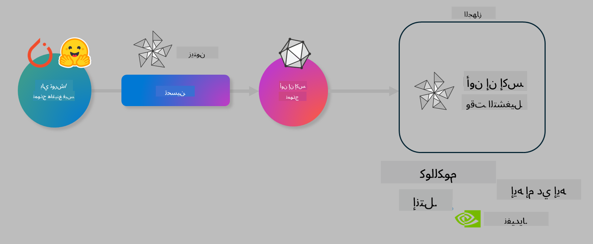

<!--
CO_OP_TRANSLATOR_METADATA:
{
  "original_hash": "6bbe47de3b974df7eea29dfeccf6032b",
  "translation_date": "2025-05-07T10:16:54+00:00",
  "source_file": "code/03.Finetuning/olive-lab/readme.md",
  "language_code": "ar"
}
-->
# مختبر. تحسين نماذج الذكاء الاصطناعي للاستدلال على الجهاز

## مقدمة

> [!IMPORTANT]
> يتطلب هذا المختبر وجود **بطاقة رسومات Nvidia A10 أو A100** مع التعريفات المرتبطة وأدوات CUDA (الإصدار 12+) مثبتة.

> [!NOTE]
> هذا مختبر مدته **35 دقيقة** يمنحك مقدمة عملية حول المفاهيم الأساسية لتحسين النماذج للاستدلال على الجهاز باستخدام OLIVE.

## أهداف التعلم

بحلول نهاية هذا المختبر، ستكون قادرًا على استخدام OLIVE لـ:

- تحويل نموذج الذكاء الاصطناعي إلى نموذج كمي باستخدام طريقة الكم AWQ.
- ضبط نموذج الذكاء الاصطناعي لمهمة محددة.
- إنشاء محولات LoRA (النموذج المضبوط) لاستدلال فعال على الجهاز باستخدام ONNX Runtime.

### ما هو Olive

Olive (*O*NNX *live*) هو مجموعة أدوات لتحسين النماذج مع واجهة سطر أوامر مرافقة تمكنك من نشر النماذج على بيئة تشغيل ONNX +++https://onnxruntime.ai+++ بجودة وأداء عاليين.



عادةً ما يكون الإدخال إلى Olive نموذج PyTorch أو Hugging Face، والإخراج هو نموذج ONNX محسّن يتم تشغيله على جهاز (هدف النشر) يعمل ببيئة تشغيل ONNX. سيقوم Olive بتحسين النموذج لمسرّع الذكاء الاصطناعي الخاص بجهاز النشر (NPU، GPU، CPU) الذي يوفره مورد الأجهزة مثل Qualcomm، AMD، Nvidia أو Intel.

ينفذ Olive *سير عمل*، وهو تسلسل مرتب من مهام تحسين النموذج الفردية المسماة *التمريرات* - من أمثلة التمريرات: ضغط النموذج، التقاط الرسم البياني، الكم، تحسين الرسم البياني. لكل تمريرة مجموعة من المعلمات التي يمكن ضبطها لتحقيق أفضل المقاييس، مثل الدقة والكمون، التي يتم تقييمها بواسطة المقيم المختص. يستخدم Olive استراتيجية بحث تعتمد على خوارزمية بحث لضبط كل تمريرة تلقائيًا واحدة تلو الأخرى أو مجموعة من التمريرات معًا.

#### فوائد Olive

- **تقليل الإحباط والوقت** الناتج عن التجارب اليدوية المتكررة مع تقنيات مختلفة لتحسين الرسم البياني، الضغط والكم. حدد قيود الجودة والأداء ودع Olive يجد أفضل نموذج لك تلقائيًا.
- **أكثر من 40 مكونًا مدمجًا لتحسين النماذج** تغطي أحدث التقنيات في الكم، الضغط، تحسين الرسم البياني والضبط الدقيق.
- **واجهة سطر أوامر سهلة الاستخدام** لمهام تحسين النماذج الشائعة. على سبيل المثال: olive quantize، olive auto-opt، olive finetune.
- تضمين حزم النماذج والنشر.
- دعم إنشاء نماذج لخدمة **Multi LoRA**.
- بناء سير العمل باستخدام YAML/JSON لتنظيم مهام تحسين النموذج والنشر.
- تكامل مع **Hugging Face** و **Azure AI**.
- آلية **تخزين مؤقت** مدمجة لتقليل التكاليف.

## تعليمات المختبر

> [!NOTE]
> يرجى التأكد من إعداد Azure AI Hub والمشروع الخاص بك وضبط حوسبة A100 وفقًا للمختبر 1.

### الخطوة 0: الاتصال بحوسبة Azure AI الخاصة بك

سوف تتصل بحوسبة Azure AI باستخدام ميزة الاتصال عن بُعد في **VS Code.**

1. افتح تطبيق **VS Code** على سطح المكتب:
1. افتح **لوحة الأوامر** باستخدام **Shift+Ctrl+P**
1. في لوحة الأوامر، ابحث عن **AzureML - remote: Connect to compute instance in New Window**.
1. اتبع التعليمات الظاهرة على الشاشة للاتصال بالحوسبة. سيتطلب ذلك اختيار اشتراك Azure الخاص بك، مجموعة الموارد، المشروع واسم الحوسبة الذي أعددته في المختبر 1.
1. بمجرد الاتصال بعقدة Azure ML Compute، سيظهر ذلك في **الزاوية السفلية اليسرى من Visual Code** `><Azure ML: Compute Name`

### الخطوة 1: استنساخ هذا المستودع

في VS Code، يمكنك فتح محطة جديدة باستخدام **Ctrl+J** واستنساخ هذا المستودع:

في المحطة يجب أن ترى موجه الأوامر

```
azureuser@computername:~/cloudfiles/code$ 
```
استنساخ الحل

```bash
cd ~/localfiles
git clone https://github.com/microsoft/phi-3cookbook.git
```

### الخطوة 2: فتح المجلد في VS Code

لفتح VS Code في المجلد المناسب، نفذ الأمر التالي في المحطة، والذي سيفتح نافذة جديدة:

```bash
code phi-3cookbook/code/04.Finetuning/Olive-lab
```

بدلاً من ذلك، يمكنك فتح المجلد من خلال اختيار **ملف** > **فتح مجلد**.

### الخطوة 3: التبعيات

افتح نافذة محطة في VS Code في مثيل Azure AI Compute الخاص بك (نصيحة: **Ctrl+J**) ونفذ الأوامر التالية لتثبيت التبعيات:

```bash
conda create -n olive-ai python=3.11 -y
conda activate olive-ai
pip install -r requirements.txt
az extension remove -n azure-cli-ml
az extension add -n ml
```

> [!NOTE]
> سيستغرق تثبيت جميع التبعيات حوالي 5 دقائق.

في هذا المختبر، ستقوم بتنزيل وتحميل النماذج إلى كتالوج نماذج Azure AI. للوصول إلى كتالوج النماذج، ستحتاج إلى تسجيل الدخول إلى Azure باستخدام:

```bash
az login
```

> [!NOTE]
> عند تسجيل الدخول، سيُطلب منك اختيار الاشتراك. تأكد من تعيين الاشتراك إلى الاشتراك المقدم لهذا المختبر.

### الخطوة 4: تنفيذ أوامر Olive

افتح نافذة محطة في VS Code في مثيل Azure AI Compute الخاص بك (نصيحة: **Ctrl+J**) وتأكد من تفعيل بيئة `olive-ai` conda:

```bash
conda activate olive-ai
```

بعد ذلك، نفذ أوامر Olive التالية في سطر الأوامر.

1. **فحص البيانات:** في هذا المثال، ستقوم بضبط نموذج Phi-3.5-Mini ليكون متخصصًا في الإجابة على أسئلة متعلقة بالسفر. يعرض الكود أدناه السجلات القليلة الأولى من مجموعة البيانات، وهي بتنسيق JSON lines:
   
    ```bash
    head data/data_sample_travel.jsonl
    ```
1. **تحويل النموذج إلى نموذج كمي:** قبل تدريب النموذج، تقوم أولاً بعملية الكم باستخدام الأمر التالي الذي يستخدم تقنية تسمى Active Aware Quantization (AWQ) +++https://arxiv.org/abs/2306.00978+++. تقوم AWQ بكم الأوزان بالنظر إلى التنشيطات التي يتم إنتاجها أثناء الاستدلال. هذا يعني أن عملية الكم تأخذ في الاعتبار توزيع البيانات الفعلي في التنشيطات، مما يؤدي إلى الحفاظ بشكل أفضل على دقة النموذج مقارنة بأساليب كم الأوزان التقليدية.
    
    ```bash
    olive quantize \
       --model_name_or_path microsoft/Phi-3.5-mini-instruct \
       --trust_remote_code \
       --algorithm awq \
       --output_path models/phi/awq \
       --log_level 1
    ```
    
    تستغرق عملية الكم AWQ حوالي **8 دقائق**، والتي ستؤدي إلى **تقليل حجم النموذج من ~7.5 جيجابايت إلى ~2.5 جيجابايت**.
   
   في هذا المختبر، نعرض لك كيفية إدخال النماذج من Hugging Face (على سبيل المثال: `microsoft/Phi-3.5-mini-instruct`). However, Olive also allows you to input models from the Azure AI catalog by updating the `model_name_or_path` argument to an Azure AI asset ID (for example:  `azureml://registries/azureml/models/Phi-3.5-mini-instruct/versions/4`). 

1. **Train the model:** Next, the `olive finetune` يقوم الأمر بضبط النموذج الكمي. تحويل النموذج إلى كمي *قبل* الضبط الدقيق بدلاً من بعده يعطي دقة أفضل لأن عملية الضبط الدقيق تستعيد بعض الخسارة الناتجة عن الكم.
    
    ```bash
    olive finetune \
        --method lora \
        --model_name_or_path models/phi/awq \
        --data_files "data/data_sample_travel.jsonl" \
        --data_name "json" \
        --text_template "<|user|>\n{prompt}<|end|>\n<|assistant|>\n{response}<|end|>" \
        --max_steps 100 \
        --output_path ./models/phi/ft \
        --log_level 1
    ```
    
    تستغرق عملية الضبط الدقيق حوالي **6 دقائق** (مع 100 خطوة).

1. **التحسين:** بعد تدريب النموذج، تقوم الآن بتحسين النموذج باستخدام أوامر Olive `auto-opt` command, which will capture the ONNX graph and automatically perform a number of optimizations to improve the model performance for CPU by compressing the model and doing fusions. It should be noted, that you can also optimize for other devices such as NPU or GPU by just updating the `--device` and `--provider` - لكن لأغراض هذا المختبر سنستخدم CPU.

    ```bash
    olive auto-opt \
       --model_name_or_path models/phi/ft/model \
       --adapter_path models/phi/ft/adapter \
       --device cpu \
       --provider CPUExecutionProvider \
       --use_ort_genai \
       --output_path models/phi/onnx-ao \
       --log_level 1
    ```
    
    تستغرق عملية التحسين حوالي **5 دقائق**.

### الخطوة 5: اختبار سريع للاستدلال على النموذج

لاختبار استدلال النموذج، أنشئ ملف Python في مجلدك باسم **app.py** وانسخ الكود التالي:

```python
import onnxruntime_genai as og
import numpy as np

print("loading model and adapters...", end="", flush=True)
model = og.Model("models/phi/onnx-ao/model")
adapters = og.Adapters(model)
adapters.load("models/phi/onnx-ao/model/adapter_weights.onnx_adapter", "travel")
print("DONE!")

tokenizer = og.Tokenizer(model)
tokenizer_stream = tokenizer.create_stream()

params = og.GeneratorParams(model)
params.set_search_options(max_length=100, past_present_share_buffer=False)
user_input = "what is the best thing to see in chicago"
params.input_ids = tokenizer.encode(f"<|user|>\n{user_input}<|end|>\n<|assistant|>\n")

generator = og.Generator(model, params)

generator.set_active_adapter(adapters, "travel")

print(f"{user_input}")

while not generator.is_done():
    generator.compute_logits()
    generator.generate_next_token()

    new_token = generator.get_next_tokens()[0]
    print(tokenizer_stream.decode(new_token), end='', flush=True)

print("\n")
```

نفذ الكود باستخدام:

```bash
python app.py
```

### الخطوة 6: رفع النموذج إلى Azure AI

رفع النموذج إلى مستودع نماذج Azure AI يجعل النموذج قابلًا للمشاركة مع أعضاء فريق التطوير الآخرين كما يدير التحكم في الإصدارات. لرفع النموذج، نفذ الأمر التالي:

> [!NOTE]
> قم بتحديث `{}` في `{}` placeholders with the name of your resource group and Azure AI Project Name. 

To find your resource group `"resourceGroup"` واسم مشروع Azure AI، ثم نفذ الأمر التالي

```
az ml workspace show
```

أو من خلال الذهاب إلى +++ai.azure.com+++ واختيار **مركز الإدارة** **المشروع** **نظرة عامة**

قم بتحديث عناصر النائب `{}` باسم مجموعة الموارد واسم مشروع Azure AI الخاص بك.

```bash
az ml model create \
    --name ft-for-travel \
    --version 1 \
    --path ./models/phi/onnx-ao \
    --resource-group {RESOURCE_GROUP_NAME} \
    --workspace-name {PROJECT_NAME}
```
يمكنك بعد ذلك رؤية النموذج الذي رفعته ونشره على https://ml.azure.com/model/list

**تنويه**:  
تمت ترجمة هذا المستند باستخدام خدمة الترجمة الآلية [Co-op Translator](https://github.com/Azure/co-op-translator). بينما نسعى لتحقيق الدقة، يرجى العلم أن الترجمات الآلية قد تحتوي على أخطاء أو عدم دقة. يجب اعتبار المستند الأصلي بلغته الأصلية المصدر الرسمي والمعتمد. للمعلومات الهامة، يُنصح بالاستعانة بترجمة بشرية محترفة. نحن غير مسؤولين عن أي سوء فهم أو تفسير خاطئ ناتج عن استخدام هذه الترجمة.