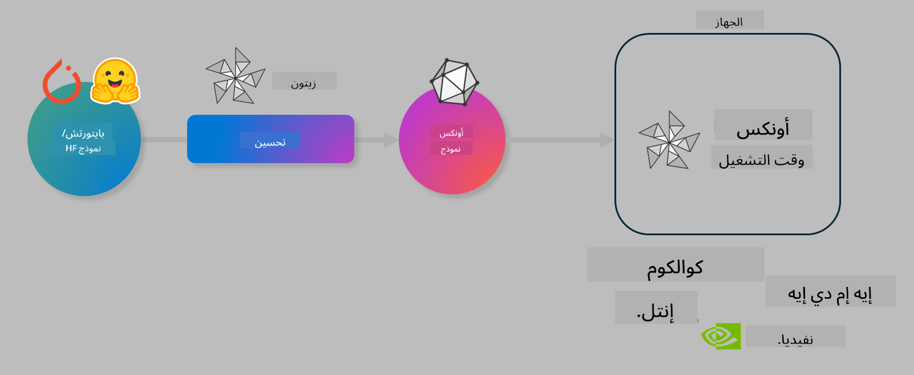

<!--
CO_OP_TRANSLATOR_METADATA:
{
  "original_hash": "6bbe47de3b974df7eea29dfeccf6032b",
  "translation_date": "2025-05-07T10:12:57+00:00",
  "source_file": "code/04.Finetuning/olive-lab/readme.md",
  "language_code": "ar"
}
-->
# مختبر. تحسين نماذج الذكاء الاصطناعي للاستدلال على الجهاز

## المقدمة

> [!IMPORTANT]
> يتطلب هذا المختبر **بطاقة رسومات Nvidia A10 أو A100** مع التعريفات المرتبطة وأدوات CUDA (الإصدار 12+) مثبتة.

> [!NOTE]
> هذا مختبر مدته **35 دقيقة** يقدم لك مقدمة عملية حول المفاهيم الأساسية لتحسين النماذج للاستدلال على الجهاز باستخدام OLIVE.

## أهداف التعلم

بحلول نهاية هذا المختبر، ستكون قادرًا على استخدام OLIVE لـ:

- تحويل نموذج ذكاء اصطناعي إلى كمي باستخدام طريقة التحويل الكمي AWQ.
- تحسين نموذج ذكاء اصطناعي لمهمة محددة.
- إنشاء محولات LoRA (نموذج محسّن) لاستدلال فعال على الجهاز باستخدام ONNX Runtime.

### ما هو Olive

Olive (*O*NNX *live*) هو مجموعة أدوات لتحسين النماذج مع واجهة سطر أوامر مرافقة تتيح لك نشر النماذج على بيئة ONNX runtime +++https://onnxruntime.ai+++ مع جودة وأداء عالٍ.



عادةً ما يكون الإدخال إلى Olive نموذج PyTorch أو Hugging Face، والإخراج هو نموذج ONNX محسّن يتم تشغيله على جهاز (هدف النشر) يعمل ببيئة ONNX runtime. يقوم Olive بتحسين النموذج لمعالج الذكاء الاصطناعي الخاص بهدف النشر (NPU، GPU، CPU) المزود من بائع الأجهزة مثل Qualcomm، AMD، Nvidia أو Intel.

يقوم Olive بتنفيذ *سير عمل*، وهو تسلسل مرتب من مهام تحسين النموذج الفردية التي تُسمى *تمريرات* - تشمل أمثلة التمريرات: ضغط النموذج، التقاط الرسم البياني، التحويل الكمي، تحسين الرسم البياني. لكل تمريرة مجموعة من المعلمات التي يمكن ضبطها لتحقيق أفضل المقاييس، مثل الدقة والكمون، التي يتم تقييمها بواسطة المقيم المعني. يستخدم Olive استراتيجية بحث تعتمد على خوارزمية بحث لضبط كل تمريرة تلقائيًا واحدة تلو الأخرى أو مجموعة تمريرات معًا.

#### فوائد Olive

- **تقليل الإحباط والوقت** الناتج عن التجارب اليدوية بالتجربة والخطأ مع تقنيات مختلفة لتحسين الرسم البياني، الضغط والتحويل الكمي. حدد قيود الجودة والأداء ودع Olive يجد أفضل نموذج لك تلقائيًا.
- **أكثر من 40 مكونًا مدمجًا لتحسين النماذج** تغطي أحدث التقنيات في التحويل الكمي، الضغط، تحسين الرسم البياني والتدريب الدقيق.
- **واجهة سطر أوامر سهلة الاستخدام** لمهام تحسين النماذج الشائعة. على سبيل المثال: olive quantize، olive auto-opt، olive finetune.
- تغليف النموذج والنشر مدمج.
- يدعم إنشاء نماذج لـ **خدمة Multi LoRA**.
- بناء سير العمل باستخدام YAML/JSON لتنظيم مهام تحسين النماذج والنشر.
- تكامل مع **Hugging Face** و **Azure AI**.
- آلية **تخزين مؤقت** مدمجة لـ **توفير التكاليف**.

## تعليمات المختبر

> [!NOTE]
> يرجى التأكد من أنك قد جهزت Azure AI Hub والمشروع وقمت بإعداد حساب A100 كما هو موضح في المختبر 1.

### الخطوة 0: الاتصال بحساب Azure AI Compute الخاص بك

سوف تتصل بحساب Azure AI Compute باستخدام ميزة الاتصال البعيد في **VS Code**.

1. افتح تطبيق **VS Code** على سطح المكتب:
1. افتح **لوحة الأوامر** باستخدام **Shift+Ctrl+P**
1. في لوحة الأوامر ابحث عن **AzureML - remote: Connect to compute instance in New Window**.
1. اتبع التعليمات التي تظهر على الشاشة للاتصال بحساب الحوسبة. يتضمن ذلك اختيار اشتراك Azure، مجموعة الموارد، المشروع واسم الحساب الذي قمت بإعداده في المختبر 1.
1. بمجرد اتصالك بعقدة Azure ML Compute، سيظهر ذلك في **أسفل يسار نافذة Visual Code** `><Azure ML: Compute Name`

### الخطوة 1: استنساخ هذا المستودع

في VS Code، يمكنك فتح نافذة طرفية جديدة باستخدام **Ctrl+J** واستنساخ هذا المستودع:

في الطرفية يجب أن ترى موجه الأوامر

```
azureuser@computername:~/cloudfiles/code$ 
```
استنساخ الحل

```bash
cd ~/localfiles
git clone https://github.com/microsoft/phi-3cookbook.git
```

### الخطوة 2: فتح المجلد في VS Code

لفتح VS Code في المجلد المناسب، نفذ الأمر التالي في الطرفية، والذي سيفتح نافذة جديدة:

```bash
code phi-3cookbook/code/04.Finetuning/Olive-lab
```

بدلاً من ذلك، يمكنك فتح المجلد عبر اختيار **ملف** > **فتح مجلد**.

### الخطوة 3: التبعيات

افتح نافذة طرفية في VS Code في حساب Azure AI Compute الخاص بك (نصيحة: **Ctrl+J**) ونفذ الأوامر التالية لتثبيت التبعيات:

```bash
conda create -n olive-ai python=3.11 -y
conda activate olive-ai
pip install -r requirements.txt
az extension remove -n azure-cli-ml
az extension add -n ml
```

> [!NOTE]
> سيستغرق تثبيت جميع التبعيات حوالي 5 دقائق.

في هذا المختبر، ستقوم بتنزيل وتحميل النماذج إلى كتالوج نماذج Azure AI. للوصول إلى كتالوج النماذج، ستحتاج إلى تسجيل الدخول إلى Azure باستخدام:

```bash
az login
```

> [!NOTE]
> عند تسجيل الدخول، سيُطلب منك اختيار الاشتراك. تأكد من تعيين الاشتراك إلى الاشتراك المخصص لهذا المختبر.

### الخطوة 4: تنفيذ أوامر Olive

افتح نافذة طرفية في VS Code في حساب Azure AI Compute الخاص بك (نصيحة: **Ctrl+J**) وتأكد من تفعيل بيئة `olive-ai` conda:

```bash
conda activate olive-ai
```

بعد ذلك، نفذ أوامر Olive التالية في سطر الأوامر.

1. **تفقد البيانات:** في هذا المثال، ستقوم بتحسين نموذج Phi-3.5-Mini بحيث يتخصص في الإجابة على أسئلة متعلقة بالسفر. يعرض الكود أدناه أول عدة سجلات من مجموعة البيانات، والتي تكون بتنسيق JSON lines:

    ```bash
    head data/data_sample_travel.jsonl
    ```
1. **تحويل النموذج إلى كمي:** قبل تدريب النموذج، تقوم أولاً بتحويله إلى كمي باستخدام الأمر التالي الذي يستخدم تقنية تسمى التحويل الكمي الواعي للنشاط (AWQ) +++https://arxiv.org/abs/2306.00978+++. تقوم AWQ بتحويل أوزان النموذج إلى كمي مع مراعاة التنشيطات الناتجة أثناء الاستدلال. هذا يعني أن عملية التحويل تأخذ في الاعتبار توزيع البيانات الفعلي في التنشيطات، مما يؤدي إلى الحفاظ بشكل أفضل على دقة النموذج مقارنة بطرق التحويل الكمي التقليدية.

    ```bash
    olive quantize \
       --model_name_or_path microsoft/Phi-3.5-mini-instruct \
       --trust_remote_code \
       --algorithm awq \
       --output_path models/phi/awq \
       --log_level 1
    ```

    يستغرق إكمال التحويل الكمي AWQ حوالي **8 دقائق**، مما سيؤدي إلى **تقليل حجم النموذج من ~7.5 جيجابايت إلى ~2.5 جيجابايت**.

    في هذا المختبر، نوضح لك كيفية إدخال النماذج من Hugging Face (على سبيل المثال: `microsoft/Phi-3.5-mini-instruct`). However, Olive also allows you to input models from the Azure AI catalog by updating the `model_name_or_path` argument to an Azure AI asset ID (for example:  `azureml://registries/azureml/models/Phi-3.5-mini-instruct/versions/4`). 

1. **Train the model:** Next, the `olive finetune` الأمر يقوم بتحسين النموذج المحول إلى كمي. تحويل النموذج إلى كمي *قبل* التدريب الدقيق بدلاً من بعده يعطي دقة أفضل لأن عملية التدريب الدقيق تعوض جزءًا من الخسارة الناتجة عن التحويل الكمي.

    ```bash
    olive finetune \
        --method lora \
        --model_name_or_path models/phi/awq \
        --data_files "data/data_sample_travel.jsonl" \
        --data_name "json" \
        --text_template "<|user|>\n{prompt}<|end|>\n<|assistant|>\n{response}<|end|>" \
        --max_steps 100 \
        --output_path ./models/phi/ft \
        --log_level 1
    ```

    يستغرق إكمال التدريب الدقيق (مع 100 خطوة) حوالي **6 دقائق**.

1. **التحسين:** بعد تدريب النموذج، تقوم الآن بتحسين النموذج باستخدام أوامر Olive مع الوسيطات `auto-opt` command, which will capture the ONNX graph and automatically perform a number of optimizations to improve the model performance for CPU by compressing the model and doing fusions. It should be noted, that you can also optimize for other devices such as NPU or GPU by just updating the `--device` and `--provider` - ولكن لأغراض هذا المختبر سنستخدم CPU.

    ```bash
    olive auto-opt \
       --model_name_or_path models/phi/ft/model \
       --adapter_path models/phi/ft/adapter \
       --device cpu \
       --provider CPUExecutionProvider \
       --use_ort_genai \
       --output_path models/phi/onnx-ao \
       --log_level 1
    ```

    يستغرق إكمال التحسين حوالي **5 دقائق**.

### الخطوة 5: اختبار سريع للاستدلال على النموذج

لاختبار الاستدلال على النموذج، أنشئ ملف Python في مجلدك يسمى **app.py** وانسخ والصق الكود التالي:

```python
import onnxruntime_genai as og
import numpy as np

print("loading model and adapters...", end="", flush=True)
model = og.Model("models/phi/onnx-ao/model")
adapters = og.Adapters(model)
adapters.load("models/phi/onnx-ao/model/adapter_weights.onnx_adapter", "travel")
print("DONE!")

tokenizer = og.Tokenizer(model)
tokenizer_stream = tokenizer.create_stream()

params = og.GeneratorParams(model)
params.set_search_options(max_length=100, past_present_share_buffer=False)
user_input = "what is the best thing to see in chicago"
params.input_ids = tokenizer.encode(f"<|user|>\n{user_input}<|end|>\n<|assistant|>\n")

generator = og.Generator(model, params)

generator.set_active_adapter(adapters, "travel")

print(f"{user_input}")

while not generator.is_done():
    generator.compute_logits()
    generator.generate_next_token()

    new_token = generator.get_next_tokens()[0]
    print(tokenizer_stream.decode(new_token), end='', flush=True)

print("\n")
```

نفذ الكود باستخدام:

```bash
python app.py
```

### الخطوة 6: رفع النموذج إلى Azure AI

رفع النموذج إلى مستودع نماذج Azure AI يجعل النموذج قابلًا للمشاركة مع أعضاء فريق التطوير الآخرين ويتولى أيضًا إدارة إصدارات النموذج. لرفع النموذج، نفذ الأمر التالي:

> [!NOTE]
> حدّث `{}` ` placeholders with the name of your resource group and Azure AI Project Name. 

To find your resource group ` باسم مجموعة الموارد واسم مشروع Azure AI، ثم نفذ الأمر التالي

```
az ml workspace show
```

أو عبر الذهاب إلى +++ai.azure.com+++ واختيار **مركز الإدارة** > **المشروع** > **نظرة عامة**

حدّث أماكن `{}` بأسماء مجموعة الموارد واسم مشروع Azure AI الخاص بك.

```bash
az ml model create \
    --name ft-for-travel \
    --version 1 \
    --path ./models/phi/onnx-ao \
    --resource-group {RESOURCE_GROUP_NAME} \
    --workspace-name {PROJECT_NAME}
```

يمكنك بعد ذلك رؤية النموذج الذي رفعته ونشره على https://ml.azure.com/model/list

**إخلاء مسؤولية**:  
تمت ترجمة هذا المستند باستخدام خدمة الترجمة الآلية [Co-op Translator](https://github.com/Azure/co-op-translator). بينما نسعى لتحقيق الدقة، يرجى العلم أن الترجمات الآلية قد تحتوي على أخطاء أو عدم دقة. يجب اعتبار المستند الأصلي بلغته الأصلية المصدر الموثوق به. للمعلومات الحساسة، يُنصح بالاعتماد على الترجمة المهنية البشرية. نحن غير مسؤولين عن أي سوء فهم أو تفسير ناتج عن استخدام هذه الترجمة.