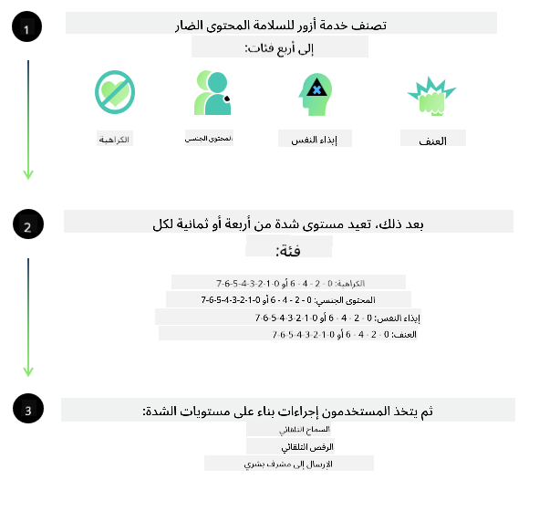

<!--
CO_OP_TRANSLATOR_METADATA:
{
  "original_hash": "c8273672cc57df2be675407a1383aaf0",
  "translation_date": "2025-05-07T10:49:37+00:00",
  "source_file": "md/01.Introduction/01/01.AISafety.md",
  "language_code": "ar"
}
-->
# أمان الذكاء الاصطناعي لنماذج Phi  
تم تطوير عائلة نماذج Phi وفقًا لـ [معيار الذكاء الاصطناعي المسؤول من Microsoft](https://query.prod.cms.rt.microsoft.com/cms/api/am/binary/RE5cmFl)، وهو مجموعة متطلبات على مستوى الشركة تستند إلى المبادئ الستة التالية: المساءلة، الشفافية، العدالة، الاعتمادية والسلامة، الخصوصية والأمان، والشمولية التي تشكل [مبادئ الذكاء الاصطناعي المسؤول من Microsoft](https://www.microsoft.com/ai/responsible-ai).

كما هو الحال مع نماذج Phi السابقة، تم اعتماد تقييم أمان متعدد الجوانب ونهج أمان بعد التدريب، مع اتخاذ تدابير إضافية لأخذ القدرات متعددة اللغات في هذا الإصدار بعين الاعتبار. نهجنا في تدريب الأمان والتقييمات، بما في ذلك الاختبار عبر لغات وفئات مخاطر متعددة، موضح في [ورقة أمان Phi بعد التدريب](https://arxiv.org/abs/2407.13833). بينما تستفيد نماذج Phi من هذا النهج، يجب على المطورين تطبيق أفضل ممارسات الذكاء الاصطناعي المسؤول، بما في ذلك رسم الخرائط، والقياس، والتخفيف من المخاطر المرتبطة بحالة الاستخدام الخاصة بهم والسياق الثقافي واللغوي.

## أفضل الممارسات  

مثل النماذج الأخرى، يمكن لعائلة نماذج Phi أن تتصرف بطرق قد تكون غير عادلة، أو غير موثوقة، أو مسيئة.

بعض السلوكيات المحدودة لنماذج SLM وLLM التي يجب أن تكون على دراية بها تشمل:

- **جودة الخدمة:** تم تدريب نماذج Phi بشكل أساسي على النصوص الإنجليزية. اللغات غير الإنجليزية ستواجه أداءً أقل جودة. قد تواجه تنويعات اللغة الإنجليزية التي تمثل تمثيلًا أقل في بيانات التدريب أداءً أسوأ مقارنةً بالإنجليزية الأمريكية القياسية.
- **تمثيل الأضرار واستمرار الصور النمطية:** يمكن لهذه النماذج أن تمثل مجموعات من الأشخاص بشكل مبالغ فيه أو ناقص، أو تمحو تمثيل بعض المجموعات، أو تعزز الصور النمطية المهينة أو السلبية. على الرغم من أمان ما بعد التدريب، قد تظل هذه القيود موجودة بسبب اختلاف مستويات تمثيل المجموعات المختلفة أو انتشار أمثلة الصور النمطية السلبية في بيانات التدريب التي تعكس أنماطًا واقعية وانحيازات مجتمعية.
- **المحتوى غير المناسب أو المسيء:** قد تنتج هذه النماذج أنواعًا أخرى من المحتوى غير المناسب أو المسيء، مما قد يجعل نشرها غير مناسب للسياقات الحساسة بدون تدابير إضافية خاصة بحالة الاستخدام.
- **موثوقية المعلومات:** يمكن لنماذج اللغة توليد محتوى غير منطقي أو اختلاق محتوى قد يبدو معقولًا لكنه غير دقيق أو قديم.
- **نطاق محدود للرمز البرمجي:** تعتمد غالبية بيانات تدريب Phi-3 على Python وتستخدم حزمًا شائعة مثل "typing, math, random, collections, datetime, itertools". إذا قام النموذج بإنشاء نصوص Python تستخدم حزمًا أخرى أو نصوصًا بلغات أخرى، نوصي بشدة بأن يقوم المستخدمون بالتحقق يدويًا من جميع استخدامات API.

يجب على المطورين تطبيق أفضل ممارسات الذكاء الاصطناعي المسؤول وهم مسؤولون عن ضمان امتثال حالة الاستخدام الخاصة بهم للقوانين واللوائح ذات الصلة (مثل الخصوصية، التجارة، إلخ).

## اعتبارات الذكاء الاصطناعي المسؤول  

مثل النماذج اللغوية الأخرى، يمكن لسلسلة نماذج Phi أن تتصرف بطرق قد تكون غير عادلة، أو غير موثوقة، أو مسيئة. بعض السلوكيات المحدودة التي يجب الانتباه إليها تشمل:

**جودة الخدمة:** تم تدريب نماذج Phi بشكل أساسي على النصوص الإنجليزية. اللغات غير الإنجليزية ستواجه أداءً أقل جودة. قد تواجه تنويعات اللغة الإنجليزية التي تمثل تمثيلًا أقل في بيانات التدريب أداءً أسوأ مقارنةً بالإنجليزية الأمريكية القياسية.

**تمثيل الأضرار واستمرار الصور النمطية:** يمكن لهذه النماذج أن تمثل مجموعات من الأشخاص بشكل مبالغ فيه أو ناقص، أو تمحو تمثيل بعض المجموعات، أو تعزز الصور النمطية المهينة أو السلبية. على الرغم من أمان ما بعد التدريب، قد تظل هذه القيود موجودة بسبب اختلاف مستويات تمثيل المجموعات المختلفة أو انتشار أمثلة الصور النمطية السلبية في بيانات التدريب التي تعكس أنماطًا واقعية وانحيازات مجتمعية.

**المحتوى غير المناسب أو المسيء:** قد تنتج هذه النماذج أنواعًا أخرى من المحتوى غير المناسب أو المسيء، مما قد يجعل نشرها غير مناسب للسياقات الحساسة بدون تدابير إضافية خاصة بحالة الاستخدام.  
**موثوقية المعلومات:** يمكن لنماذج اللغة توليد محتوى غير منطقي أو اختلاق محتوى قد يبدو معقولًا لكنه غير دقيق أو قديم.

**نطاق محدود للرمز البرمجي:** تعتمد غالبية بيانات تدريب Phi-3 على Python وتستخدم حزمًا شائعة مثل "typing, math, random, collections, datetime, itertools". إذا قام النموذج بإنشاء نصوص Python تستخدم حزمًا أخرى أو نصوصًا بلغات أخرى، نوصي بشدة بأن يقوم المستخدمون بالتحقق يدويًا من جميع استخدامات API.

يجب على المطورين تطبيق أفضل ممارسات الذكاء الاصطناعي المسؤول وهم مسؤولون عن ضمان امتثال حالة الاستخدام الخاصة بهم للقوانين واللوائح ذات الصلة (مثل الخصوصية، التجارة، إلخ). تشمل المجالات المهمة للنظر فيها:

**التخصيص:** قد لا تكون النماذج مناسبة للسيناريوهات التي قد يكون لها تأثير حاسم على الوضع القانوني أو تخصيص الموارد أو فرص الحياة (مثل: السكن، التوظيف، الائتمان، إلخ) بدون تقييمات إضافية وتقنيات إزالة التحيز الإضافية.

**السيناريوهات عالية المخاطر:** يجب على المطورين تقييم مدى ملاءمة استخدام النماذج في السيناريوهات عالية المخاطر حيث قد تكون المخرجات غير عادلة أو غير موثوقة أو مسيئة مكلفة للغاية أو تؤدي إلى ضرر. يشمل ذلك تقديم النصائح في المجالات الحساسة أو المتخصصة حيث الدقة والاعتمادية أمران حاسمان (مثل: النصائح القانونية أو الصحية). يجب تنفيذ تدابير حماية إضافية على مستوى التطبيق وفقًا لسياق النشر.

**المعلومات المضللة:** قد تنتج النماذج معلومات غير دقيقة. يجب على المطورين اتباع أفضل ممارسات الشفافية وإبلاغ المستخدمين النهائيين بأنهم يتعاملون مع نظام ذكاء اصطناعي. على مستوى التطبيق، يمكن للمطورين بناء آليات ردود فعل وخطوط أنابيب لتأسيس الردود على معلومات سياقية خاصة بحالة الاستخدام، وهي تقنية تعرف باسم توليد معزز بالاسترجاع (RAG).

**توليد المحتوى الضار:** يجب على المطورين تقييم المخرجات وفقًا لسياقها واستخدام المصنفات الأمنية المتاحة أو الحلول المخصصة المناسبة لحالة الاستخدام.

**سوء الاستخدام:** قد تكون أشكال أخرى من سوء الاستخدام مثل الاحتيال، الرسائل المزعجة، أو إنتاج البرمجيات الخبيثة ممكنة، ويجب على المطورين التأكد من أن تطبيقاتهم لا تنتهك القوانين واللوائح المعمول بها.

### الضبط الدقيق وأمان محتوى الذكاء الاصطناعي  

بعد ضبط النموذج، نوصي بشدة باستخدام تدابير [Azure AI Content Safety](https://learn.microsoft.com/azure/ai-services/content-safety/overview) لمراقبة المحتوى الذي تنتجه النماذج، والتعرف على المخاطر والتهديدات وقضايا الجودة المحتملة وحظرها.

يدعم [Azure AI Content Safety](https://learn.microsoft.com/azure/ai-services/content-safety/overview) المحتوى النصي والمرئي. يمكن نشره في السحابة، الحاويات المنفصلة، وعلى الأجهزة الطرفية/المضمنة.

## نظرة عامة على Azure AI Content Safety  

لا يعد Azure AI Content Safety حلاً موحدًا يناسب الجميع؛ يمكن تخصيصه ليتماشى مع سياسات الشركات الخاصة. بالإضافة إلى ذلك، تمكنه نماذجه متعددة اللغات من فهم لغات متعددة في الوقت نفسه.

- **Azure AI Content Safety**  
- **Microsoft Developer**  
- **5 فيديوهات**

تكتشف خدمة Azure AI Content Safety المحتوى الضار الذي ينشئه المستخدمون أو الذكاء الاصطناعي في التطبيقات والخدمات. تشمل واجهات برمجة التطبيقات للنصوص والصور التي تسمح لك بالكشف عن المواد الضارة أو غير المناسبة.

[AI Content Safety Playlist](https://www.youtube.com/playlist?list=PLlrxD0HtieHjaQ9bJjyp1T7FeCbmVcPkQ)

**تنويه**:  
تمت ترجمة هذا المستند باستخدام خدمة الترجمة الآلية [Co-op Translator](https://github.com/Azure/co-op-translator). بينما نسعى لتحقيق الدقة، يرجى العلم أن الترجمات الآلية قد تحتوي على أخطاء أو عدم دقة. يجب اعتبار المستند الأصلي بلغته الأصلية المصدر الموثوق به. للمعلومات الحساسة أو الهامة، يُنصح بالاستعانة بترجمة بشرية محترفة. نحن غير مسؤولين عن أي سوء فهم أو تفسير ناتج عن استخدام هذه الترجمة.