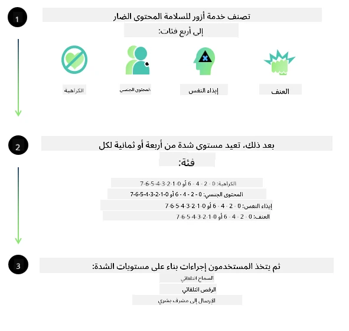
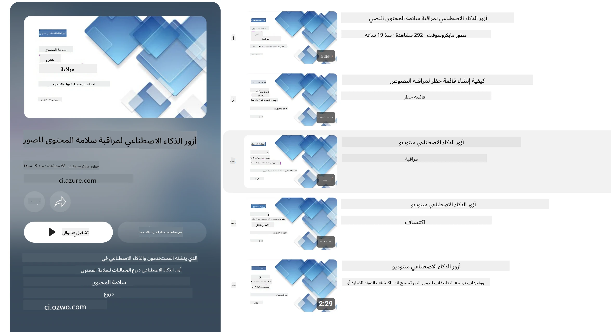

<!--
CO_OP_TRANSLATOR_METADATA:
{
  "original_hash": "839ccc4b3886ef10cfd4e64977f5792d",
  "translation_date": "2026-01-05T08:33:07+00:00",
  "source_file": "md/01.Introduction/01/01.AISafety.md",
  "language_code": "ar"
}
-->
# سلامة الذكاء الاصطناعي لنماذج Phi
تم تطوير عائلة نماذج Phi وفقًا لـ [معيار الذكاء الاصطناعي المسؤول من مايكروسوفت](https://www.microsoft.com/ai/principles-and-approach#responsible-ai-standard)، وهو مجموعة متطلبات على مستوى الشركة تستند إلى المبادئ الستة التالية: المساءلة، الشفافية، العدالة، الاعتمادية والسلامة، الخصوصية والأمان، والشمولية التي تشكل [مبادئ الذكاء الاصطناعي المسؤول لمايكروسوفت](https://www.microsoft.com/ai/responsible-ai).

مثل نماذج Phi السابقة، تم اعتماد تقييم سلامة متعدد الأوجه ونهج سلامة بعد التدريب، مع اتخاذ تدابير إضافية لأخذ قدرات متعددة اللغات في هذا الإصدار بعين الاعتبار. نهجنا في تدريب وتقييم السلامة، بما في ذلك الاختبار عبر عدة لغات وفئات مخاطر، موضح في [ورقة سلامة Phi بعد التدريب](https://arxiv.org/abs/2407.13833). بينما تستفيد نماذج Phi من هذا النهج، يجب على المطورين تطبيق ممارسات الذكاء الاصطناعي المسؤول المثلى، بما في ذلك رسم الخرائط وقياس وتخفيف المخاطر المرتبطة بالحالة الاستخدامية والسياق الثقافي واللغوي المحدد لديهم.

## أفضل الممارسات

مثل النماذج الأخرى، يمكن لعائلة نماذج Phi أن تتصرف بطرق قد تكون غير عادلة أو غير موثوقة أو مسيئة.

بعض السلوكيات المحدودة لنماذج SLM وLLM التي ينبغي أن تكون على علم بها تشمل:

- **جودة الخدمة:** تم تدريب نماذج Phi بشكل رئيسي على النصوص الإنجليزية. اللغات الأخرى غير الإنجليزية ستواجه أداءً أسوأ. قد تواجه لهجات اللغة الإنجليزية ذات التمثيل الأقل في بيانات التدريب أداءً أسوأ من اللغة الإنجليزية الأمريكية القياسية.
- **تمثيل الأضرار واستمرار الصور النمطية:** يمكن لهذه النماذج أن تمثل مجموعات من الناس بشكل مبالغ فيه أو ناقص، أو تمحو تمثيل بعض المجموعات، أو تعزز الصور النمطية المهينة أو السلبية. على الرغم من التدريب على السلامة بعد التدريب، قد تظل هذه القيود موجودة بسبب اختلاف مستويات التمثيل لمجموعات مختلفة أو انتشار أمثلة الصور النمطية السلبية في بيانات التدريب التي تعكس أنماطًا واقعية وانحيازات مجتمعية.
- **المحتوى غير المناسب أو المسيء:** قد تنتج هذه النماذج أنواعًا أخرى من المحتوى غير المناسب أو المسيء، مما قد يجعل استخدامها غير مناسب في السياقات الحساسة دون وجود تدابير تخفيف إضافية تتناسب مع الحالة الاستخدامية.
**موثوقية المعلومات:** يمكن لنماذج اللغة توليد محتوى غير منطقي أو اختلاق محتوى قد يبدو معقولًا لكنه غير دقيق أو قديم.
- **نطاق محدود للشفرة:** الغالبية العظمى من بيانات تدريب Phi-3 تعتمد على Python وتستخدم الحزم الشائعة مثل "typing, math, random, collections, datetime, itertools". إذا قام النموذج بتوليد سكربتات Python تستخدم حزمًا أخرى أو سكربتات بلغات أخرى، نوصي بشدة بأن يتحقق المستخدمون يدويًا من جميع استخدامات API.

يجب على المطورين تطبيق أفضل ممارسات الذكاء الاصطناعي المسؤول وهم مسؤولون عن ضمان أن تتوافق الحالة الاستخدامية المحددة مع القوانين واللوائح ذات الصلة (مثل الخصوصية، التجارة، إلخ).

## اعتبارات الذكاء الاصطناعي المسؤول

مثل نماذج اللغة الأخرى، يمكن لسلسلة نماذج Phi أن تتصرف بطرق قد تكون غير عادلة أو غير موثوقة أو مسيئة. بعض السلوكيات المحدودة التي يجب الانتباه إليها تشمل:

**جودة الخدمة:** تم تدريب نماذج Phi بشكل رئيسي على النصوص الإنجليزية. اللغات الأخرى غير الإنجليزية ستواجه أداءً أسوأ. قد تواجه لهجات اللغة الإنجليزية ذات التمثيل الأقل في بيانات التدريب أداءً أسوأ من اللغة الإنجليزية الأمريكية القياسية.

**تمثيل الأضرار واستمرار الصور النمطية:** يمكن لهذه النماذج أن تمثل مجموعات من الناس بشكل مبالغ فيه أو ناقص، أو تمحو تمثيل بعض المجموعات، أو تعزز الصور النمطية المهينة أو السلبية. على الرغم من التدريب على السلامة بعد التدريب، قد تظل هذه القيود موجودة بسبب اختلاف مستويات التمثيل لمجموعات مختلفة أو انتشار أمثلة الصور النمطية السلبية في بيانات التدريب التي تعكس أنماطًا واقعية وانحيازات مجتمعية.

**المحتوى غير المناسب أو المسيء:** قد تنتج هذه النماذج أنواعًا أخرى من المحتوى غير المناسب أو المسيء، مما قد يجعل استخدامها غير مناسب في السياقات الحساسة دون وجود تدابير تخفيف إضافية تتناسب مع الحالة الاستخدامية.
**موثوقية المعلومات:** يمكن لنماذج اللغة توليد محتوى غير منطقي أو اختلاق محتوى قد يبدو معقولًا لكنه غير دقيق أو قديم.

**نطاق محدود للشفرة:** الغالبية العظمى من بيانات تدريب Phi-3 تعتمد على Python وتستخدم الحزم الشائعة مثل "typing, math, random, collections, datetime, itertools". إذا قام النموذج بتوليد سكربتات Python تستخدم حزمًا أخرى أو سكربتات بلغات أخرى، نوصي بشدة بأن يتحقق المستخدمون يدويًا من جميع استخدامات API.

يجب على المطورين تطبيق أفضل ممارسات الذكاء الاصطناعي المسؤول وهم مسؤولون عن ضمان أن تتوافق الحالة الاستخدامية المحددة مع القوانين واللوائح ذات الصلة (مثل الخصوصية، التجارة، إلخ). المجالات المهمة للنظر فيها تشمل:

**التخصيص:** قد لا تكون النماذج مناسبة للحالات التي قد يكون لها تأثير كبير على الوضع القانوني أو تخصيص الموارد أو فرص الحياة (مثل الإسكان، التوظيف، الائتمان، إلخ) بدون تقييمات إضافية وتقنيات إزالة الانحياز الإضافية.

**السيناريوهات عالية المخاطر:** يجب على المطورين تقييم ملاءمة استخدام النماذج في السيناريوهات عالية المخاطر حيث قد تكون النتائج غير العادلة أو غير الموثوقة أو المسيئة مكلفة للغاية أو تؤدي إلى ضرر. ويشمل ذلك تقديم المشورة في المجالات الحساسة أو التخصصية حيث الدقة والموثوقية أمران حاسمان (مثل المشورة القانونية أو الصحية). يجب تنفيذ تدابير حماية إضافية على مستوى التطبيق وفقًا لسياق النشر.

**المعلومات المضللة:** قد تنتج النماذج معلومات غير دقيقة. يجب على المطورين اتباع أفضل ممارسات الشفافية وإبلاغ المستخدمين النهائيين بأنهم يتعاملون مع نظام ذكاء اصطناعي. على مستوى التطبيق، يمكن للمطورين بناء آليات تغذية راجعة وأنظمة لتأسيس الاستجابات بمعلومات سياقية خاصة بالحالة الاستخدامية، وهي تقنية تعرف باسم توليد معزز بالإسترجاع (RAG).

**توليد محتوى ضار:** يجب على المطورين تقييم المخرجات حسب سياقها واستخدام المصنفات المتاحة للسلامة أو الحلول المخصصة المناسبة لحالة الاستخدام.

**سوء الاستخدام:** قد تحدث أشكال أخرى من سوء الاستخدام مثل الاحتيال، الرسائل المزعجة، أو إنتاج البرمجيات الخبيثة، ويجب على المطورين ضمان أن تطبيقاتهم لا تنتهك القوانين واللوائح المعمول بها.

### الضبط الدقيق وسلامة محتوى الذكاء الاصطناعي

بعد ضبط النموذج بدقة، نوصي بشدة بالاستفادة من تدابير [سلامة محتوى الذكاء الاصطناعي من Azure](https://learn.microsoft.com/azure/ai-services/content-safety/overview) لمراقبة المحتوى الذي تنتجه النماذج، وتحديد وحظر المخاطر والتهديدات وقضايا الجودة المحتملة.

تدعم [سلامة محتوى الذكاء الاصطناعي من Azure](https://learn.microsoft.com/azure/ai-services/content-safety/overview) محتوى النصوص والصور على حد سواء. ويمكن نشرها في السحابة، الحاويات المنفصلة، وعلى الأجهزة الطرفية/المدمجة.

## نظرة عامة على سلامة محتوى الذكاء الاصطناعي من Azure

سلامة محتوى الذكاء الاصطناعي من Azure ليست حلاً موحدًا للجميع؛ إذ يمكن تخصيصها لتتوافق مع سياسات الشركات المحددة. بالإضافة إلى ذلك، تمكّن نماذجها متعددة اللغات من فهم عدة لغات في وقت واحد.

- **سلامة محتوى الذكاء الاصطناعي من Azure**
- **مطور مايكروسوفت**
- **5 فيديوهات**

تكتشف خدمة سلامة محتوى الذكاء الاصطناعي من Azure المحتوى الضار الذي يولده المستخدمون أو الذكاء الاصطناعي في التطبيقات والخدمات. وتشمل APIs للنصوص والصور تسمح لك باكتشاف المواد الضارة أو غير المناسبة.

[قائمة تشغيل سلامة محتوى الذكاء الاصطناعي](https://www.youtube.com/playlist?list=PLlrxD0HtieHjaQ9bJjyp1T7FeCbmVcPkQ)

---

<!-- CO-OP TRANSLATOR DISCLAIMER START -->
**تنويه**:  
تمت ترجمة هذا المستند باستخدام خدمة الترجمة الآلية [Co-op Translator](https://github.com/Azure/co-op-translator). بينما نسعى لتحقيق الدقة، يرجى العلم أن الترجمات الآلية قد تحتوي على أخطاء أو عدم دقة. يجب اعتبار المستند الأصلي بلغته الأصلية المصدر الموثوق به. للمعلومات الهامة، يُنصح بالاستعانة بترجمة بشرية محترفة. نحن غير مسؤولين عن أي سوء فهم أو تفسيرات خاطئة تنشأ عن استخدام هذه الترجمة.
<!-- CO-OP TRANSLATOR DISCLAIMER END -->