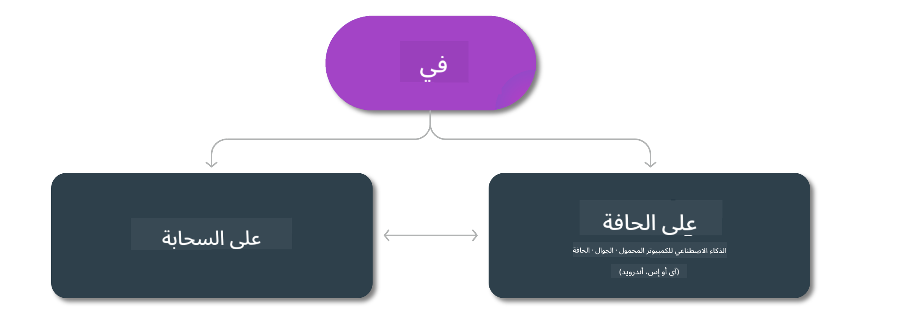

<!--
CO_OP_TRANSLATOR_METADATA:
{
  "original_hash": "777aa0ff38fceecc29a00834f2f7a2f0",
  "translation_date": "2025-05-07T10:51:03+00:00",
  "source_file": "md/01.Introduction/01/01.Edgeandcloud.md",
  "language_code": "ar"
}
-->
# نماذج Phi وتوفرها عبر المنصات

## سيناريوهات الحافة والسحابة

## توفر النموذج والموارد

| | | | | | | | | |
|-|-|-|-|-|-|-|-|-|
|النموذج|الإدخال|طول المحتوى|Azure AI (MaaS)|Azure ML (MaaP)|ONNX|Hugging Face|Ollama|Nvidia NIM|
|Phi-3-vision-128k-instruct|نص + صورة|128k|[الملعب والنشر](https://ai.azure.com/explore/models/Phi-3-vision-128k-instruct/version/2/registry/azureml)|[الملعب، النشر والتدريب الدقيق](https://ml.azure.com/registries/azureml/models/Phi-3-vision-128k-instruct/version/2)|[CUDA](https://huggingface.co/microsoft/Phi-3-vision-128k-instruct-onnx-cuda/tree/main),[CPU](https://huggingface.co/microsoft/Phi-3-vision-128k-instruct-onnx-cpu/tree/main), [DirectML](https://huggingface.co/microsoft/Phi-3-vision-128k-instruct-onnx-directml/tree/main)|[تحميل](https://huggingface.co/microsoft/Phi-3-vision-128k-instruct)|-غير متوفر-|[NIM APIs](https://build.nvidia.com/microsoft/phi-3-vision-128k-instruct)|
|Phi-3-mini-4k-instruct|نص|4k|[الملعب والنشر](https://aka.ms/phi3-mini-4k-azure-ml)|[الملعب، النشر](https://aka.ms/phi3-mini-4k-azure-ml) والتدريب الدقيق|[CUDA](https://huggingface.co/microsoft/Phi-3-mini-4k-instruct-onnx), [Web](https://huggingface.co/microsoft/Phi-3-mini-4k-instruct-onnx)|[الملعب والتحميل](https://huggingface.co/chat/models/microsoft/Phi-3-mini-4k-instruct)|[GGUF](https://huggingface.co/microsoft/Phi-3-mini-4k-instruct-gguf)|[NIM APIs](https://build.nvidia.com/microsoft/phi-3-mini-4k)|
|Phi-3-mini-128k-instruct|نص|128k|[الملعب والنشر](https://ai.azure.com/explore/models/Phi-3-mini-128k-instruct/version/9/registry/azureml)|[الملعب، النشر](https://ai.azure.com/explore/models/Phi-3-mini-128k-instruct/version/9/registry/azureml) والتدريب الدقيق|[CUDA](https://huggingface.co/microsoft/Phi-3-mini-128k-instruct-onnx)|[تحميل](https://huggingface.co/microsoft/Phi-3-mini-128k-instruct-onnx)|-غير متوفر-|[NIM APIs](https://build.nvidia.com/microsoft/phi-3-mini)|
|Phi-3-small-8k-instruct|نص|8k|[الملعب والنشر](https://ml.azure.com/registries/azureml/models/Phi-3-small-8k-instruct/version/2)|[الملعب، النشر](https://ai.azure.com/explore/models/Phi-3-small-8k-instruct/version/2/registry/azureml) والتدريب الدقيق|[CUDA](https://huggingface.co/microsoft/Phi-3-small-8k-instruct-onnx-cuda)|[تحميل](https://huggingface.co/microsoft/Phi-3-small-8k-instruct-onnx-cuda)|-غير متوفر-|[NIM APIs](https://build.nvidia.com/microsoft/phi-3-small-8k-instruct?docker=false)|
|Phi-3-small-128k-instruct|نص|128k|[الملعب والنشر](https://ai.azure.com/explore/models/Phi-3-small-128k-instruct/version/2/registry/azureml)|[الملعب، النشر](https://ml.azure.com/registries/azureml/models/Phi-3-small-128k-instruct/version/2) والتدريب الدقيق|[CUDA](https://huggingface.co/microsoft/Phi-3-medium-128k-instruct-onnx-cuda)|[تحميل](https://huggingface.co/microsoft/Phi-3-small-128k-instruct)|-غير متوفر-|[NIM APIs](https://build.nvidia.com/microsoft/phi-3-small-128k-instruct?docker=false)|
|Phi-3-medium-4k-instruct|نص|4k|[الملعب والنشر](https://huggingface.co/microsoft/Phi-3-medium-4k-instruct)|[الملعب، النشر](https://ml.azure.com/registries/azureml/models/Phi-3-medium-4k-instruct/version/2) والتخصيص|[CUDA](https://huggingface.co/microsoft/Phi-3-medium-4k-instruct-onnx-cuda/tree/main)، [CPU](https://huggingface.co/microsoft/Phi-3-medium-4k-instruct-onnx-cpu/tree/main)، [DirectML](https://huggingface.co/microsoft/Phi-3-medium-4k-instruct-onnx-directml/tree/main)|[تنزيل](https://huggingface.co/microsoft/Phi-3-medium-4k-instruct)|-NA-|[NIM APIs](https://build.nvidia.com/microsoft/phi-3-medium-4k-instruct?docker=false)|
|Phi-3-medium-128k-instruct|نص|128k|[الملعب والنشر](https://ai.azure.com/explore/models/Phi-3-medium-128k-instruct/version/2)|[الملعب، النشر](https://ml.azure.com/registries/azureml/models/Phi-3-medium-128k-instruct/version/2) والتخصيص|[CUDA](https://huggingface.co/microsoft/Phi-3-medium-128k-instruct-onnx-cuda/tree/main)، [CPU](https://huggingface.co/microsoft/Phi-3-medium-128k-instruct-onnx-cpu/tree/main)، [DirectML](https://huggingface.co/microsoft/Phi-3-medium-128k-instruct-onnx-directml/tree/main)|[تنزيل](https://huggingface.co/microsoft/Phi-3-medium-128k-instruct)|-NA-|-NA-|

**تنبيه**:  
تمت ترجمة هذا المستند باستخدام خدمة الترجمة الآلية [Co-op Translator](https://github.com/Azure/co-op-translator). بينما نسعى لتحقيق الدقة، يرجى العلم أن الترجمات الآلية قد تحتوي على أخطاء أو عدم دقة. يجب اعتبار المستند الأصلي بلغته الأصلية المصدر المعتمد. للمعلومات الهامة، يُنصح بالاستعانة بالترجمة المهنية البشرية. نحن غير مسؤولين عن أي سوء فهم أو تفسير ناتج عن استخدام هذه الترجمة.