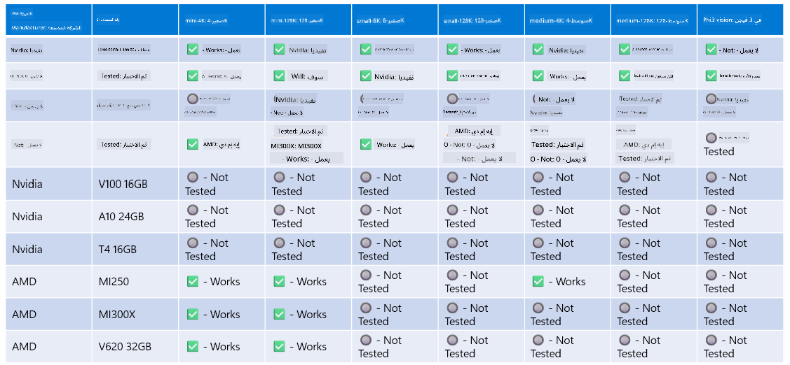

<!--
CO_OP_TRANSLATOR_METADATA:
{
  "original_hash": "8cdc17ce0f10535da30b53d23fe1a795",
  "translation_date": "2025-07-16T18:23:03+00:00",
  "source_file": "md/01.Introduction/01/01.Hardwaresupport.md",
  "language_code": "ar"
}
-->
# دعم أجهزة Phi

تم تحسين Microsoft Phi للعمل مع ONNX Runtime ويدعم Windows DirectML. يعمل بشكل جيد عبر أنواع مختلفة من الأجهزة، بما في ذلك وحدات معالجة الرسومات (GPU)، ووحدات المعالجة المركزية (CPU)، وحتى الأجهزة المحمولة.

## أجهزة الجهاز  
تشمل الأجهزة المدعومة بشكل خاص:

- وحدة معالجة الرسومات: RTX 4090 (DirectML)  
- وحدة معالجة الرسومات: 1 A100 80GB (CUDA)  
- وحدة المعالجة المركزية: Standard F64s v2 (64 vCPUs، 128 جيجابايت ذاكرة)

## الأجهزة المحمولة

- أندرويد - Samsung Galaxy S21  
- Apple iPhone 14 أو أحدث بمعالج A16/A17

## مواصفات أجهزة Phi

- الحد الأدنى من التكوين المطلوب.  
- ويندوز: وحدة معالجة رسومات تدعم DirectX 12 وذاكرة RAM مجمعة لا تقل عن 4 جيجابايت  

CUDA: وحدة معالجة رسومات NVIDIA بقدرة حسابية >= 7.02



## تشغيل onnxruntime على عدة وحدات معالجة رسومات

النماذج المتوفرة حالياً لـ Phi ONNX مخصصة لوحدة معالجة رسومات واحدة فقط. من الممكن دعم تعدد وحدات معالجة الرسومات لنموذج Phi، لكن ORT مع وحدتي GPU لا يضمن زيادة في الأداء مقارنة بتشغيل مثيلين من ort. يرجى مراجعة [ONNX Runtime](https://onnxruntime.ai/) لأحدث التحديثات.

في مؤتمر [Build 2024 فريق GenAI ONNX](https://youtu.be/WLW4SE8M9i8?si=EtG04UwDvcjunyfC) أعلنوا أنهم فعلوا دعم تعدد المثيلات بدلاً من تعدد وحدات معالجة الرسومات لنماذج Phi.

حالياً، يتيح لك هذا تشغيل مثيل واحد من onnxruntime أو onnxruntime-genai مع متغير البيئة CUDA_VISIBLE_DEVICES كما يلي.

```Python
CUDA_VISIBLE_DEVICES=0 python infer.py
CUDA_VISIBLE_DEVICES=1 python infer.py
```

لا تتردد في استكشاف Phi أكثر في [Azure AI Foundry](https://ai.azure.com)

**إخلاء المسؤولية**:  
تمت ترجمة هذا المستند باستخدام خدمة الترجمة الآلية [Co-op Translator](https://github.com/Azure/co-op-translator). بينما نسعى لتحقيق الدقة، يرجى العلم أن الترجمات الآلية قد تحتوي على أخطاء أو عدم دقة. يجب اعتبار المستند الأصلي بلغته الأصلية المصدر الموثوق به. للمعلومات الهامة، يُنصح بالاعتماد على الترجمة البشرية المهنية. نحن غير مسؤولين عن أي سوء فهم أو تفسير ناتج عن استخدام هذه الترجمة.