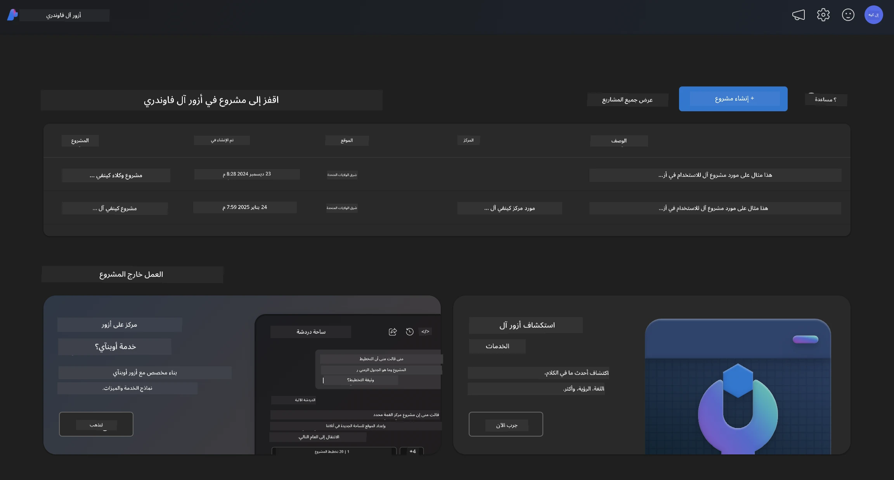
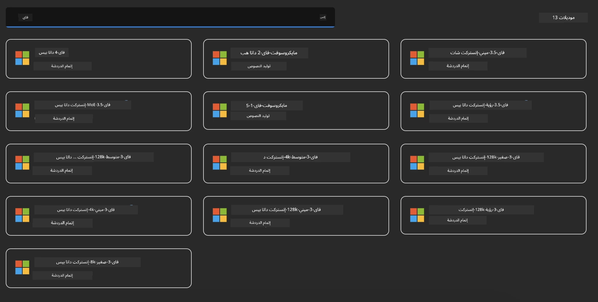
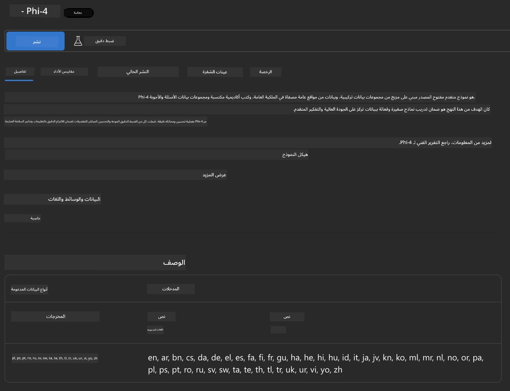
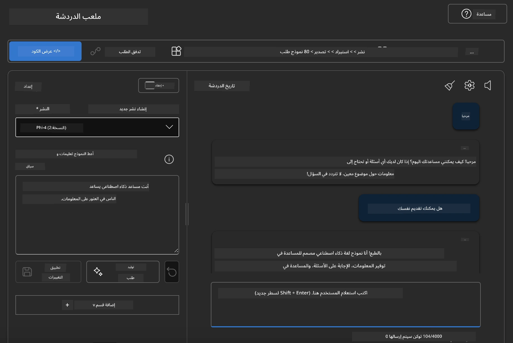

<!--
CO_OP_TRANSLATOR_METADATA:
{
  "original_hash": "3ae21dc5554e888defbe57946ee995ee",
  "translation_date": "2025-07-16T19:06:53+00:00",
  "source_file": "md/01.Introduction/02/03.AzureAIFoundry.md",
  "language_code": "ar"
}
-->
## عائلة Phi في Azure AI Foundry

[Azure AI Foundry](https://ai.azure.com) هي منصة موثوقة تمكّن المطورين من دفع عجلة الابتكار وتشكيل المستقبل باستخدام الذكاء الاصطناعي بطريقة آمنة، ومأمونة، ومسؤولة.

تم تصميم [Azure AI Foundry](https://ai.azure.com) للمطورين من أجل:

- بناء تطبيقات الذكاء الاصطناعي التوليدية على منصة بمستوى المؤسسات.
- استكشاف، بناء، اختبار، ونشر باستخدام أدوات الذكاء الاصطناعي المتقدمة ونماذج التعلم الآلي، مع الالتزام بممارسات الذكاء الاصطناعي المسؤولة.
- التعاون مع فريق طوال دورة حياة تطوير التطبيق.

مع Azure AI Foundry، يمكنك استكشاف مجموعة واسعة من النماذج، والخدمات، والقدرات، والبدء في بناء تطبيقات الذكاء الاصطناعي التي تلبي أهدافك بأفضل شكل. تسهل منصة Azure AI Foundry التوسع لتحويل إثبات المفاهيم إلى تطبيقات إنتاجية متكاملة بسهولة. كما تدعم المراقبة المستمرة والتحسين النجاح على المدى الطويل.



بالإضافة إلى استخدام Azure AOAI Service في Azure AI Foundry، يمكنك أيضًا استخدام نماذج الطرف الثالث في كتالوج نماذج Azure AI Foundry. هذا خيار جيد إذا كنت ترغب في استخدام Azure AI Foundry كمنصة حلول الذكاء الاصطناعي الخاصة بك.

يمكننا نشر نماذج عائلة Phi بسرعة من خلال كتالوج النماذج في Azure AI Foundry

[نماذج Microsoft Phi في نماذج Azure AI Foundry](https://ai.azure.com/explore/models/?selectedCollection=phi)



### **نشر Phi-4 في Azure AI Foundry**



### **اختبار Phi-4 في ملعب Azure AI Foundry**



### **تشغيل كود Python لاستدعاء Phi-4 في Azure AI Foundry**

```python

import os  
import base64
from openai import AzureOpenAI  
from azure.identity import DefaultAzureCredential, get_bearer_token_provider  
        
endpoint = os.getenv("ENDPOINT_URL", "Your Azure AOAI Service Endpoint")  
deployment = os.getenv("DEPLOYMENT_NAME", "Phi-4")  
      
token_provider = get_bearer_token_provider(  
    DefaultAzureCredential(),  
    "https://cognitiveservices.azure.com/.default"  
)  
  
client = AzureOpenAI(  
    azure_endpoint=endpoint,  
    azure_ad_token_provider=token_provider,  
    api_version="2024-05-01-preview",  
)  
  

chat_prompt = [
    {
        "role": "system",
        "content": "You are an AI assistant that helps people find information."
    },
    {
        "role": "user",
        "content": "can you introduce yourself"
    }
] 
    
# Include speech result if speech is enabled  
messages = chat_prompt 

completion = client.chat.completions.create(  
    model=deployment,  
    messages=messages,
    max_tokens=800,  
    temperature=0.7,  
    top_p=0.95,  
    frequency_penalty=0,  
    presence_penalty=0,
    stop=None,  
    stream=False  
)  
  
print(completion.to_json())  

```

**إخلاء المسؤولية**:  
تمت ترجمة هذا المستند باستخدام خدمة الترجمة الآلية [Co-op Translator](https://github.com/Azure/co-op-translator). بينما نسعى لتحقيق الدقة، يرجى العلم أن الترجمات الآلية قد تحتوي على أخطاء أو عدم دقة. يجب اعتبار المستند الأصلي بلغته الأصلية المصدر الموثوق به. للمعلومات الهامة، يُنصح بالاعتماد على الترجمة البشرية المهنية. نحن غير مسؤولين عن أي سوء فهم أو تفسير ناتج عن استخدام هذه الترجمة.