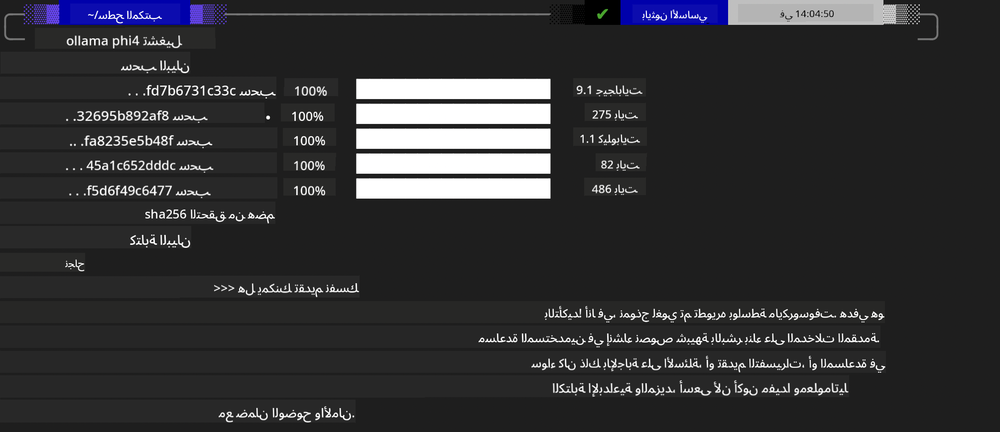
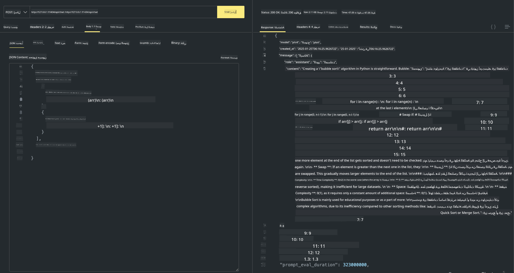

<!--
CO_OP_TRANSLATOR_METADATA:
{
  "original_hash": "0b38834693bb497f96bf53f0d941f9a1",
  "translation_date": "2025-05-07T10:39:24+00:00",
  "source_file": "md/01.Introduction/02/04.Ollama.md",
  "language_code": "ar"
}
-->
## عائلة Phi في Ollama


يتيح [Ollama](https://ollama.com) لعدد أكبر من الأشخاص نشر نماذج LLM أو SLM مفتوحة المصدر مباشرةً عبر سكربتات بسيطة، ويمكنه أيضًا بناء واجهات برمجة تطبيقات لمساعدة سيناريوهات تطبيقات Copilot المحلية.

## **1. التثبيت**

يدعم Ollama التشغيل على Windows وmacOS وLinux. يمكنك تثبيت Ollama من خلال هذا الرابط ([https://ollama.com/download](https://ollama.com/download)). بعد التثبيت الناجح، يمكنك استخدام سكربت Ollama مباشرة لاستدعاء Phi-3 عبر نافذة الطرفية. يمكنك الاطلاع على جميع [المكتبات المتاحة في Ollama](https://ollama.com/library). إذا فتحت هذا المستودع في Codespace، فسيكون Ollama مثبتًا بالفعل.

```bash

ollama run phi4

```

> [!NOTE]
> سيتم تنزيل النموذج أول مرة عند تشغيله لأول مرة. بالطبع، يمكنك أيضًا تحديد نموذج Phi-4 الذي تم تنزيله مباشرة. نأخذ WSL كمثال لتشغيل الأمر. بعد تنزيل النموذج بنجاح، يمكنك التفاعل مباشرة عبر الطرفية.



## **2. استدعاء API الخاصة بـ phi-4 من Ollama**

إذا كنت تريد استدعاء API الخاصة بـ Phi-4 التي تم إنشاؤها بواسطة ollama، يمكنك استخدام هذا الأمر في الطرفية لبدء خادم Ollama.

```bash

ollama serve

```

> [!NOTE]
> إذا كنت تستخدم MacOS أو Linux، يرجى ملاحظة أنك قد تواجه الخطأ التالي **"Error: listen tcp 127.0.0.1:11434: bind: address already in use"** قد يظهر هذا الخطأ عند تشغيل الأمر. يمكنك تجاهل هذا الخطأ لأنه عادةً ما يشير إلى أن الخادم يعمل بالفعل، أو يمكنك إيقافه ثم إعادة تشغيل Ollama:

**macOS**

```bash

brew services restart ollama

```

**Linux**

```bash

sudo systemctl stop ollama

```

يدعم Ollama واجهتي API: generate و chat. يمكنك استدعاء واجهة نموذج Ollama حسب حاجتك، عن طريق إرسال طلبات إلى الخدمة المحلية التي تعمل على المنفذ 11434.

**الدردشة**

```bash

curl http://127.0.0.1:11434/api/chat -d '{
  "model": "phi3",
  "messages": [
    {
      "role": "system",
      "content": "Your are a python developer."
    },
    {
      "role": "user",
      "content": "Help me generate a bubble algorithm"
    }
  ],
  "stream": false
  
}'

This is the result in Postman



## Additional Resources

Check the list of available models in Ollama in [their library](https://ollama.com/library).

Pull your model from the Ollama server using this command

```bash
ollama pull phi4
```

Run the model using this command

```bash
ollama run phi4
```

***Note:*** Visit this link [https://github.com/ollama/ollama/blob/main/docs/api.md](https://github.com/ollama/ollama/blob/main/docs/api.md) to learn more

## Calling Ollama from Python

You can use `requests` or `urllib3` to make requests to the local server endpoints used above. However, a popular way to use Ollama in Python is via the [openai](https://pypi.org/project/openai/) SDK, since Ollama provides OpenAI-compatible server endpoints as well.

Here is an example for phi3-mini:

```python
import openai

client = openai.OpenAI(
    base_url="http://localhost:11434/v1",
    api_key="nokeyneeded",
)

response = client.chat.completions.create(
    model="phi4",
    temperature=0.7,
    n=1,
    messages=[
        {"role": "system", "content": "أنت مساعد مفيد."},
        {"role": "user", "content": "اكتب هايكو عن قطة جائعة"},
    ],
)

print("الرد:")
print(response.choices[0].message.content)
```

## Calling Ollama from JavaScript 

```javascript
// مثال على تلخيص ملف باستخدام Phi-4
script({
    model: "ollama:phi4",
    title: "تلخيص باستخدام Phi-4",
    system: ["system"],
})

// مثال على التلخيص
const file = def("FILE", env.files)
$`لخص ${file} في فقرة واحدة.`
```

## Calling Ollama from C#

Create a new C# Console application and add the following NuGet package:

```bash
dotnet add package Microsoft.SemanticKernel --version 1.34.0
```

Then replace this code in the `Program.cs` file

```csharp
using Microsoft.SemanticKernel;
using Microsoft.SemanticKernel.ChatCompletion;

// إضافة خدمة إكمال الدردشة باستخدام نقطة نهاية خادم ollama المحلي
#pragma warning disable SKEXP0001, SKEXP0003, SKEXP0010, SKEXP0011, SKEXP0050, SKEXP0052
builder.AddOpenAIChatCompletion(
    modelId: "phi4",
    endpoint: new Uri("http://localhost:11434/"),
    apiKey: "non required");

// استدعاء موجه بسيط لخدمة الدردشة
string prompt = "اكتب نكتة عن القطط الصغيرة";
var response = await kernel.InvokePromptAsync(prompt);
Console.WriteLine(response.GetValue<string>());
```

Run the app with the command:

```bash
dotnet run

**إخلاء مسؤولية**:  
تمت ترجمة هذا المستند باستخدام خدمة الترجمة الآلية [Co-op Translator](https://github.com/Azure/co-op-translator). بينما نسعى لتحقيق الدقة، يرجى العلم أن الترجمات الآلية قد تحتوي على أخطاء أو عدم دقة. يجب اعتبار المستند الأصلي بلغته الأصلية المصدر الموثوق به. بالنسبة للمعلومات الهامة، يُنصح بالاعتماد على الترجمة البشرية المهنية. نحن غير مسؤولين عن أي سوء فهم أو تفسير ناتج عن استخدام هذه الترجمة.