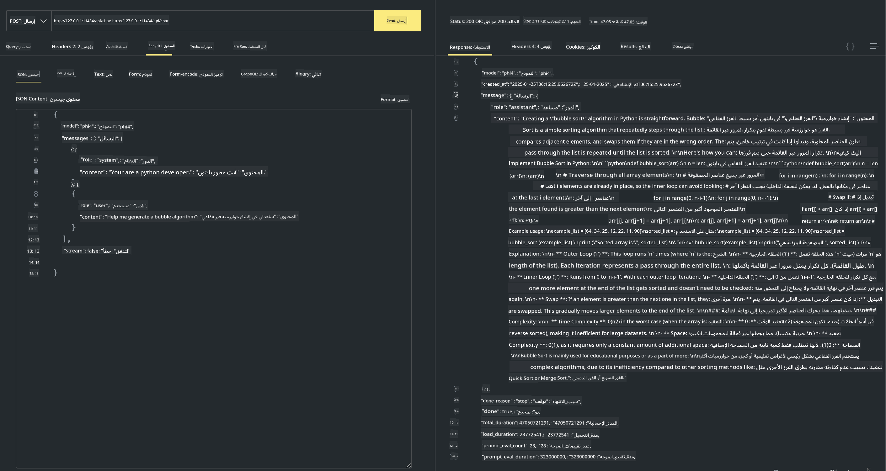

<!--
CO_OP_TRANSLATOR_METADATA:
{
  "original_hash": "2aa35f3c8b437fd5dc9995d53909d495",
  "translation_date": "2025-12-21T10:04:23+00:00",
  "source_file": "md/01.Introduction/02/04.Ollama.md",
  "language_code": "ar"
}
-->
## عائلة Phi في Ollama

[Ollama](https://ollama.com) يسمح للمزيد من الأشخاص بنشر نماذج LLM أو SLM مفتوحة المصدر مباشرةً من خلال نصوص بسيطة، ويمكنه أيضًا بناء واجهات برمجة تطبيقات لمساعدة سيناريوهات تطبيقات Copilot المحلية.

## **1. التثبيت**

Ollama يدعم التشغيل على Windows و macOS و Linux. يمكنك تثبيت Ollama من خلال هذا الرابط ([https://ollama.com/download](https://ollama.com/download)). بعد التثبيت الناجح، يمكنك استخدام سكربت Ollama مباشرةً لاستدعاء Phi-3 عبر نافذة الطرفية. يمكنك رؤية جميع [المكتبات المتاحة في Ollama](https://ollama.com/library). إذا فتحت هذا المستودع في Codespace، فسيكون Ollama مثبتًا بالفعل.

```bash

ollama run phi4

```

> [!NOTE]
> سيتم تنزيل النموذج أولاً عند تشغيله للمرة الأولى. بالطبع، يمكنك أيضًا تحديد نموذج Phi-4 الذي تم تنزيله مباشرةً. نأخذ WSL كمثال لتشغيل الأمر. بعد تنزيل النموذج بنجاح، يمكنك التفاعل مباشرةً في الطرفية.


## **2. استدعاء واجهة برمجة تطبيقات phi-4 من Ollama**

إذا كنت تريد استدعاء واجهة برمجة تطبيقات Phi-4 التي أنشأتها ollama، يمكنك استخدام هذا الأمر في الطرفية لبدء خادم Ollama.

```bash

ollama serve

```

> [!NOTE]
> إذا كنت تستخدم MacOS أو Linux، فقد تواجه الخطأ التالي **"Error: listen tcp 127.0.0.1:11434: bind: address already in use"** قد تحصل على هذا الخطأ عند تشغيل الأمر. يمكنك إما تجاهل هذا الخطأ، لأنه عادةً ما يشير إلى أن الخادم يعمل بالفعل، أو يمكنك إيقاف وإعادة تشغيل Ollama:

**macOS**

```bash

brew services restart ollama

```

**Linux**

```bash

sudo systemctl stop ollama

```

Ollama يدعم واجهتين برمجيتين: generate و chat. يمكنك استدعاء واجهة النموذج التي يوفرها Ollama وفقًا لاحتياجاتك، عن طريق إرسال طلبات إلى الخدمة المحلية التي تعمل على المنفذ 11434.

**Chat**

```bash

curl http://127.0.0.1:11434/api/chat -d '{
  "model": "phi3",
  "messages": [
    {
      "role": "system",
      "content": "Your are a python developer."
    },
    {
      "role": "user",
      "content": "Help me generate a bubble algorithm"
    }
  ],
  "stream": false
  
}'
```

هذه هي النتيجة في Postman



## موارد إضافية

اطلع على قائمة النماذج المتاحة في Ollama في [مكتبتهم](https://ollama.com/library).

اسحب نموذجك من خادم Ollama باستخدام هذا الأمر

```bash
ollama pull phi4
```

شغّل النموذج باستخدام هذا الأمر

```bash
ollama run phi4
```

***ملاحظة:*** قم بزيارة هذا الرابط [https://github.com/ollama/ollama/blob/main/docs/api.md](https://github.com/ollama/ollama/blob/main/docs/api.md) لمعرفة المزيد

## استدعاء Ollama من Python

يمكنك استخدام `requests` أو `urllib3` لإجراء طلبات إلى نقاط نهاية الخادم المحلية المستخدمة أعلاه. ومع ذلك، فإن طريقة شائعة لاستخدام Ollama في Python هي عبر حزمة [openai](https://pypi.org/project/openai/) SDK، لأن Ollama يوفر نقاط نهاية متوافقة مع OpenAI أيضًا.

فيما يلي مثال لـ phi3-mini:

```python
import openai

client = openai.OpenAI(
    base_url="http://localhost:11434/v1",
    api_key="nokeyneeded",
)

response = client.chat.completions.create(
    model="phi4",
    temperature=0.7,
    n=1,
    messages=[
        {"role": "system", "content": "You are a helpful assistant."},
        {"role": "user", "content": "Write a haiku about a hungry cat"},
    ],
)

print("Response:")
print(response.choices[0].message.content)
```

## استدعاء Ollama من JavaScript 

```javascript
// مثال على تلخيص ملف باستخدام Phi-4
script({
    model: "ollama:phi4",
    title: "Summarize with Phi-4",
    system: ["system"],
})

// مثال على التلخيص
const file = def("FILE", env.files)
$`Summarize ${file} in a single paragraph.`
```

## استدعاء Ollama من C#

أنشئ تطبيق C# Console جديد وأضف حزمة NuGet التالية:

```bash
dotnet add package Microsoft.SemanticKernel --version 1.34.0
```

ثم استبدل هذا الكود في ملف `Program.cs`

```csharp
using Microsoft.SemanticKernel;
using Microsoft.SemanticKernel.ChatCompletion;

// add chat completion service using the local ollama server endpoint
#pragma warning disable SKEXP0001, SKEXP0003, SKEXP0010, SKEXP0011, SKEXP0050, SKEXP0052
builder.AddOpenAIChatCompletion(
    modelId: "phi4",
    endpoint: new Uri("http://localhost:11434/"),
    apiKey: "non required");

// invoke a simple prompt to the chat service
string prompt = "Write a joke about kittens";
var response = await kernel.InvokePromptAsync(prompt);
Console.WriteLine(response.GetValue<string>());
```

شغّل التطبيق بالأمر:

```bash
dotnet run
```

---

<!-- CO-OP TRANSLATOR DISCLAIMER START -->
إخلاء المسؤولية:
تمت ترجمة هذا المستند باستخدام خدمة الترجمة الآلية [Co-op Translator](https://github.com/Azure/co-op-translator). وبينما نسعى إلى الدقة، يرجى العلم أن الترجمات الآلية قد تحتوي على أخطاء أو عدم دقة. يجب اعتبار المستند الأصلي بلغته الأصلية المصدر المعتمد. للمعلومات الحسّاسة أو الحرجة، يُنصح بالاستعانة بترجمة بشرية محترفة. نحن غير مسؤولين عن أي سوء فهم أو تأويل ينشأ عن استخدام هذه الترجمة.
<!-- CO-OP TRANSLATOR DISCLAIMER END -->