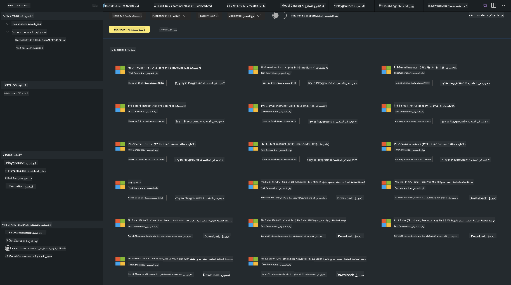
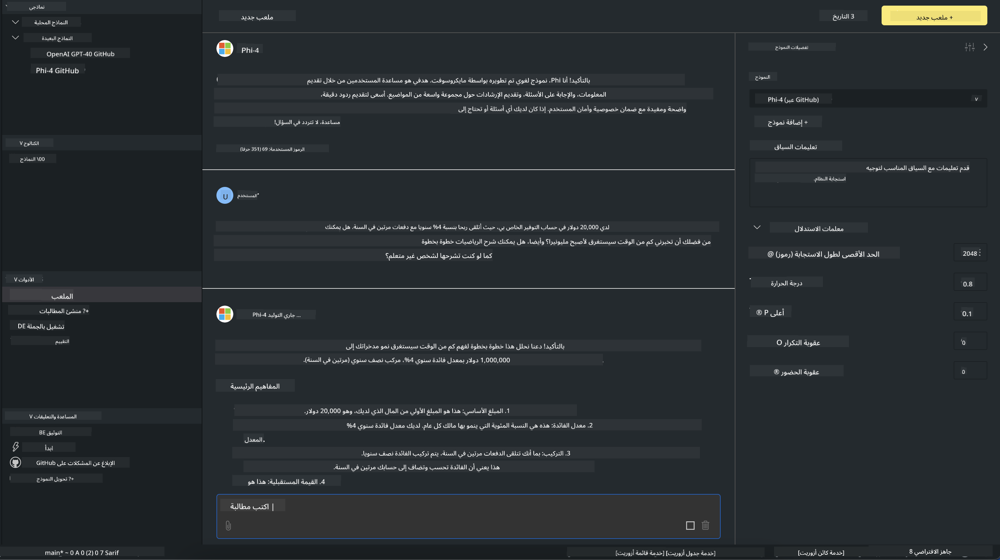

<!--
CO_OP_TRANSLATOR_METADATA:
{
  "original_hash": "4951d458c0b60c02cd1e751b40903877",
  "translation_date": "2025-07-16T19:21:16+00:00",
  "source_file": "md/01.Introduction/02/05.AITK.md",
  "language_code": "ar"
}
-->
# عائلة Phi في AITK

[AI Toolkit for VS Code](https://marketplace.visualstudio.com/items?itemName=ms-windows-ai-studio.windows-ai-studio) يُبسّط تطوير تطبيقات الذكاء الاصطناعي التوليدي من خلال جمع أدوات ونماذج تطوير الذكاء الاصطناعي المتقدمة من كتالوج Azure AI Foundry وكتالوجات أخرى مثل Hugging Face. ستتمكن من تصفح كتالوج نماذج الذكاء الاصطناعي المدعوم من GitHub Models و Azure AI Foundry Model Catalogs، وتحميلها محليًا أو عن بُعد، وضبطها بدقة، واختبارها، واستخدامها في تطبيقك.

سيعمل AI Toolkit Preview محليًا. يعتمد الاستدلال المحلي أو الضبط الدقيق على النموذج الذي اخترته، وقد تحتاج إلى وجود GPU مثل NVIDIA CUDA GPU. يمكنك أيضًا تشغيل نماذج GitHub مباشرة باستخدام AITK.

## البدء

[تعرف على كيفية تثبيت نظام ويندوز الفرعي للينكس](https://learn.microsoft.com/windows/wsl/install?WT.mc_id=aiml-137032-kinfeylo)

و[تغيير التوزيعة الافتراضية](https://learn.microsoft.com/windows/wsl/install#change-the-default-linux-distribution-installed).

[مستودع AI Toolkit على GitHub](https://github.com/microsoft/vscode-ai-toolkit/)

- ويندوز، لينكس، ماك أو إس
  
- للضبط الدقيق على كل من ويندوز ولينكس، ستحتاج إلى بطاقة Nvidia GPU. بالإضافة إلى ذلك، **ويندوز** يتطلب نظام فرعي للينكس مع توزيعة أوبونتو 18.4 أو أحدث. [تعرف على كيفية تثبيت نظام ويندوز الفرعي للينكس](https://learn.microsoft.com/windows/wsl/install) و[تغيير التوزيعة الافتراضية](https://learn.microsoft.com/windows/wsl/install#change-the-default-linux-distribution-installed).

### تثبيت AI Toolkit

يتم شحن AI Toolkit كـ [امتداد لـ Visual Studio Code](https://code.visualstudio.com/docs/setup/additional-components#_vs-code-extensions)، لذا تحتاج أولاً إلى تثبيت [VS Code](https://code.visualstudio.com/docs/setup/windows?WT.mc_id=aiml-137032-kinfeylo)، ثم تحميل AI Toolkit من [سوق VS](https://marketplace.visualstudio.com/items?itemName=ms-windows-ai-studio.windows-ai-studio).
[AI Toolkit متاح في سوق Visual Studio](https://marketplace.visualstudio.com/items?itemName=ms-windows-ai-studio.windows-ai-studio) ويمكن تثبيته مثل أي امتداد آخر لـ VS Code.

إذا لم تكن معتادًا على تثبيت امتدادات VS Code، اتبع الخطوات التالية:

### تسجيل الدخول

1. في شريط النشاط في VS Code اختر **Extensions**
1. في شريط البحث عن الامتدادات اكتب "AI Toolkit"
1. اختر "AI Toolkit for Visual Studio code"
1. اختر **Install**

الآن، أنت جاهز لاستخدام الامتداد!

سيُطلب منك تسجيل الدخول إلى GitHub، لذا يرجى الضغط على "Allow" للمتابعة. سيتم توجيهك إلى صفحة تسجيل الدخول في GitHub.

يرجى تسجيل الدخول واتباع خطوات العملية. بعد إتمامها بنجاح، سيتم توجيهك مرة أخرى إلى VS Code.

بمجرد تثبيت الامتداد سترى أيقونة AI Toolkit تظهر في شريط النشاط الخاص بك.

هيا نستكشف الإجراءات المتاحة!

### الإجراءات المتاحة

الشريط الجانبي الرئيسي لـ AI Toolkit منظم إلى  

- **Models**
- **Resources**
- **Playground**  
- **Fine-tuning**
- **Evaluation**

متاحة في قسم Resources. للبدء اختر **Model Catalog**.

### تحميل نموذج من الكتالوج

عند تشغيل AI Toolkit من شريط VS Code الجانبي، يمكنك الاختيار من الخيارات التالية:



- ابحث عن نموذج مدعوم من **Model Catalog** وحمّله محليًا
- اختبر استدلال النموذج في **Model Playground**
- اضبط النموذج بدقة محليًا أو عن بُعد في **Model Fine-tuning**
- انشر النماذج المضبوطة بدقة إلى السحابة عبر لوحة الأوامر لـ AI Toolkit
- تقييم النماذج

> [!NOTE]
>
> **GPU مقابل CPU**
>
> ستلاحظ أن بطاقات النماذج تعرض حجم النموذج، والمنصة، ونوع المعجل (CPU، GPU). لأداء محسن على **أجهزة ويندوز التي تحتوي على GPU واحد على الأقل**، اختر إصدارات النماذج التي تستهدف ويندوز فقط.
>
> هذا يضمن أن لديك نموذجًا محسنًا لمعجل DirectML.
>
> أسماء النماذج تكون بالشكل التالي
>
> - `{model_name}-{accelerator}-{quantization}-{format}`.
>
>للتحقق مما إذا كان لديك GPU على جهاز ويندوز الخاص بك، افتح **مدير المهام** ثم اختر تبويب **الأداء**. إذا كان لديك GPU(s)، فستُدرج تحت أسماء مثل "GPU 0" أو "GPU 1".

### تشغيل النموذج في الملعب

بعد ضبط جميع المعلمات، اضغط على **Generate Project**.

بمجرد تحميل النموذج، اختر **Load in Playground** على بطاقة النموذج في الكتالوج:

- بدء تحميل النموذج
- تثبيت جميع المتطلبات والاعتمادات
- إنشاء مساحة عمل في VS Code



### استخدام REST API في تطبيقك

يأتي AI Toolkit مع خادم ويب REST API محلي **على المنفذ 5272** يستخدم [تنسيق إكمالات دردشة OpenAI](https://platform.openai.com/docs/api-reference/chat/create).

هذا يتيح لك اختبار تطبيقك محليًا دون الحاجة للاعتماد على خدمة نموذج ذكاء اصطناعي سحابية. على سبيل المثال، يوضح ملف JSON التالي كيفية تكوين جسم الطلب:

```json
{
    "model": "Phi-4",
    "messages": [
        {
            "role": "user",
            "content": "what is the golden ratio?"
        }
    ],
    "temperature": 0.7,
    "top_p": 1,
    "top_k": 10,
    "max_tokens": 100,
    "stream": true
}
```

يمكنك اختبار REST API باستخدام (مثلاً) [Postman](https://www.postman.com/) أو أداة CURL (عميل URL):

```bash
curl -vX POST http://127.0.0.1:5272/v1/chat/completions -H 'Content-Type: application/json' -d @body.json
```

### استخدام مكتبة عميل OpenAI للبايثون

```python
from openai import OpenAI

client = OpenAI(
    base_url="http://127.0.0.1:5272/v1/", 
    api_key="x" # required for the API but not used
)

chat_completion = client.chat.completions.create(
    messages=[
        {
            "role": "user",
            "content": "what is the golden ratio?",
        }
    ],
    model="Phi-4",
)

print(chat_completion.choices[0].message.content)
```

### استخدام مكتبة عميل Azure OpenAI لـ .NET

أضف [مكتبة عميل Azure OpenAI لـ .NET](https://www.nuget.org/packages/Azure.AI.OpenAI/) إلى مشروعك باستخدام NuGet:

```bash
dotnet add {project_name} package Azure.AI.OpenAI --version 1.0.0-beta.17
```

أضف ملف C# باسم **OverridePolicy.cs** إلى مشروعك والصق الكود التالي:

```csharp
// OverridePolicy.cs
using Azure.Core.Pipeline;
using Azure.Core;

internal partial class OverrideRequestUriPolicy(Uri overrideUri)
    : HttpPipelineSynchronousPolicy
{
    private readonly Uri _overrideUri = overrideUri;

    public override void OnSendingRequest(HttpMessage message)
    {
        message.Request.Uri.Reset(_overrideUri);
    }
}
```

بعد ذلك، الصق الكود التالي في ملف **Program.cs** الخاص بك:

```csharp
// Program.cs
using Azure.AI.OpenAI;

Uri localhostUri = new("http://localhost:5272/v1/chat/completions");

OpenAIClientOptions clientOptions = new();
clientOptions.AddPolicy(
    new OverrideRequestUriPolicy(localhostUri),
    Azure.Core.HttpPipelinePosition.BeforeTransport);
OpenAIClient client = new(openAIApiKey: "unused", clientOptions);

ChatCompletionsOptions options = new()
{
    DeploymentName = "Phi-4",
    Messages =
    {
        new ChatRequestSystemMessage("You are a helpful assistant. Be brief and succinct."),
        new ChatRequestUserMessage("What is the golden ratio?"),
    }
};

StreamingResponse<StreamingChatCompletionsUpdate> streamingChatResponse
    = await client.GetChatCompletionsStreamingAsync(options);

await foreach (StreamingChatCompletionsUpdate chatChunk in streamingChatResponse)
{
    Console.Write(chatChunk.ContentUpdate);
}
```


## الضبط الدقيق باستخدام AI Toolkit

- ابدأ باكتشاف النماذج والملعب.
- الضبط الدقيق للنماذج والاستدلال باستخدام موارد الحوسبة المحلية.
- الضبط الدقيق والاستدلال عن بُعد باستخدام موارد Azure

[الضبط الدقيق باستخدام AI Toolkit](../../03.FineTuning/Finetuning_VSCodeaitoolkit.md)

## موارد الأسئلة والأجوبة لـ AI Toolkit

يرجى الرجوع إلى [صفحة الأسئلة والأجوبة](https://github.com/microsoft/vscode-ai-toolkit/blob/main/archive/QA.md) لأكثر المشاكل شيوعًا وحلولها

**إخلاء المسؤولية**:  
تمت ترجمة هذا المستند باستخدام خدمة الترجمة الآلية [Co-op Translator](https://github.com/Azure/co-op-translator). بينما نسعى لتحقيق الدقة، يرجى العلم أن الترجمات الآلية قد تحتوي على أخطاء أو عدم دقة. يجب اعتبار المستند الأصلي بلغته الأصلية المصدر الموثوق به. للمعلومات الهامة، يُنصح بالاعتماد على الترجمة البشرية المهنية. نحن غير مسؤولين عن أي سوء فهم أو تفسير ناتج عن استخدام هذه الترجمة.