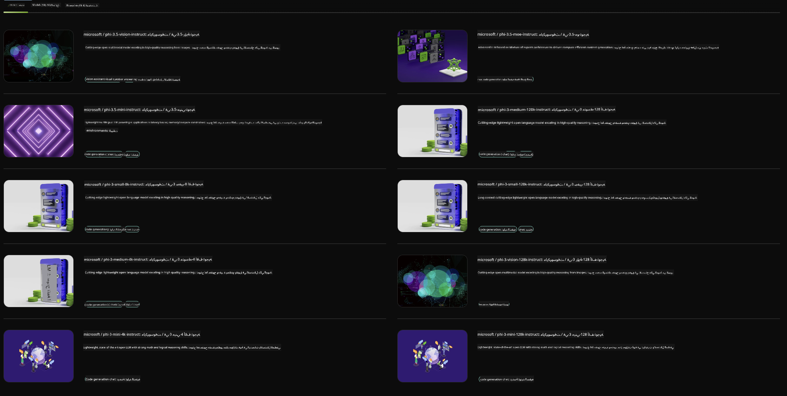

<!--
CO_OP_TRANSLATOR_METADATA:
{
  "original_hash": "7b08e277df2a9307f861ae54bc30c772",
  "translation_date": "2025-05-07T10:38:05+00:00",
  "source_file": "md/01.Introduction/02/06.NVIDIA.md",
  "language_code": "ar"
}
-->
## عائلة Phi في NVIDIA NIM

NVIDIA NIM هي مجموعة من الخدمات الصغيرة سهلة الاستخدام مصممة لتسريع نشر نماذج الذكاء الاصطناعي التوليدية عبر السحابة ومراكز البيانات ومحطات العمل. يتم تصنيف NIMs حسب عائلة النموذج وعلى أساس كل نموذج. على سبيل المثال، NVIDIA NIM لنماذج اللغة الكبيرة (LLMs) يجلب قوة أحدث نماذج LLMs لتطبيقات المؤسسات، موفراً قدرات لا مثيل لها في معالجة وفهم اللغة الطبيعية.

تجعل NIM من السهل على فرق تكنولوجيا المعلومات وDevOps استضافة نماذج اللغة الكبيرة (LLMs) في بيئاتهم المُدارة بأنفسهم مع توفير واجهات برمجة التطبيقات القياسية للصناعة للمطورين، مما يسمح لهم ببناء مساعدين ذكيين، وروبوتات دردشة، ومساعدي ذكاء اصطناعي يمكنهم تحويل أعمالهم. من خلال الاستفادة من تسريع GPU المتقدم من NVIDIA والنشر القابل للتوسع، توفر NIM أسرع طريق للاستدلال بأداء لا مثيل له.

يمكنك استخدام NVIDIA NIM لاستدلال نماذج عائلة Phi



### **نماذج - Phi-3-Vision في NVIDIA NIM**

تخيل أن لديك صورة (`demo.png`) وترغب في توليد كود بايثون يعالج هذه الصورة ويحفظ نسخة جديدة منها (`phi-3-vision.jpg`).

الكود أعلاه يَقوم بأتمتة هذه العملية من خلال:

1. إعداد البيئة والتكوينات اللازمة.
2. إنشاء موجه يُوجه النموذج لتوليد كود بايثون المطلوب.
3. إرسال الموجه إلى النموذج وجمع الكود الناتج.
4. استخراج وتشغيل الكود الناتج.
5. عرض الصور الأصلية والمعالجة.

هذا النهج يستفيد من قوة الذكاء الاصطناعي لأتمتة مهام معالجة الصور، مما يجعل تحقيق أهدافك أسهل وأسرع.

[حل الكود النموذجي](../../../../../code/06.E2E/E2E_Nvidia_NIM_Phi3_Vision.ipynb)

لنحلل ما يقوم به الكود خطوة بخطوة:

1. **تثبيت الحزمة المطلوبة**:
    ```python
    !pip install langchain_nvidia_ai_endpoints -U
    ```
    هذا الأمر يقوم بتثبيت حزمة `langchain_nvidia_ai_endpoints`، مع التأكد من أنها أحدث نسخة.

2. **استيراد الوحدات الضرورية**:
    ```python
    from langchain_nvidia_ai_endpoints import ChatNVIDIA
    import getpass
    import os
    import base64
    ```
    هذه الاستيرادات تجلب الوحدات اللازمة للتفاعل مع نقاط نهاية NVIDIA AI، وإدارة كلمات المرور بأمان، والتعامل مع نظام التشغيل، وترميز/فك ترميز البيانات بصيغة base64.

3. **إعداد مفتاح API**:
    ```python
    if not os.getenv("NVIDIA_API_KEY"):
        os.environ["NVIDIA_API_KEY"] = getpass.getpass("Enter your NVIDIA API key: ")
    ```
    هذا الكود يتحقق مما إذا كان متغير البيئة `NVIDIA_API_KEY` مُعداً، وإذا لم يكن كذلك، يطلب من المستخدم إدخال مفتاح API بأمان.

4. **تحديد النموذج ومسار الصورة**:
    ```python
    model = 'microsoft/phi-3-vision-128k-instruct'
    chat = ChatNVIDIA(model=model)
    img_path = './imgs/demo.png'
    ```
    هذا يحدد النموذج المستخدم، ينشئ مثيلاً من `ChatNVIDIA` باستخدام النموذج المحدد، ويحدد مسار ملف الصورة.

5. **إنشاء موجه نصي**:
    ```python
    text = "Please create Python code for image, and use plt to save the new picture under imgs/ and name it phi-3-vision.jpg."
    ```
    هذا يعرف موجه نصي يُرشد النموذج لتوليد كود بايثون لمعالجة صورة.

6. **ترميز الصورة بصيغة Base64**:
    ```python
    with open(img_path, "rb") as f:
        image_b64 = base64.b64encode(f.read()).decode()
    image = f''
    ```
    هذا الكود يقرأ ملف الصورة، ويرمزها بصيغة base64، وينشئ وسم HTML للصورة بالبيانات المشفرة.

7. **دمج النص والصورة في الموجه**:
    ```python
    prompt = f"{text} {image}"
    ```
    هذا يجمع الموجه النصي ووسم HTML الخاص بالصورة في سلسلة واحدة.

8. **توليد الكود باستخدام ChatNVIDIA**:
    ```python
    code = ""
    for chunk in chat.stream(prompt):
        print(chunk.content, end="")
        code += chunk.content
    ```
    هذا الكود يرسل الموجه إلى `ChatNVIDIA` model and collects the generated code in chunks, printing and appending each chunk to the `code` النصي الناتج.

9. **استخراج كود بايثون من المحتوى الناتج**:
    ```python
    begin = code.index('```python') + 9
    code = code[begin:]
    end = code.index('```')
    code = code[:end]
    ```
    هذا يستخرج كود بايثون الفعلي من المحتوى الناتج بإزالة تنسيق الماركدوان.

10. **تشغيل الكود الناتج**:
    ```python
    import subprocess
    result = subprocess.run(["python", "-c", code], capture_output=True)
    ```
    هذا يشغل كود بايثون المستخرج كعملية فرعية ويلتقط مخرجاته.

11. **عرض الصور**:
    ```python
    from IPython.display import Image, display
    display(Image(filename='./imgs/phi-3-vision.jpg'))
    display(Image(filename='./imgs/demo.png'))
    ```
    هذه الأسطر تعرض الصور باستخدام وحدة `IPython.display`.

**تنويه**:  
تمت ترجمة هذا المستند باستخدام خدمة الترجمة الآلية [Co-op Translator](https://github.com/Azure/co-op-translator). بينما نسعى لتحقيق الدقة، يرجى العلم أن الترجمات الآلية قد تحتوي على أخطاء أو عدم دقة. يجب اعتبار المستند الأصلي بلغته الأصلية المصدر الموثوق به. للمعلومات الهامة، يُنصح بالترجمة البشرية المهنية. نحن غير مسؤولين عن أي سوء فهم أو تفسيرات خاطئة ناتجة عن استخدام هذه الترجمة.