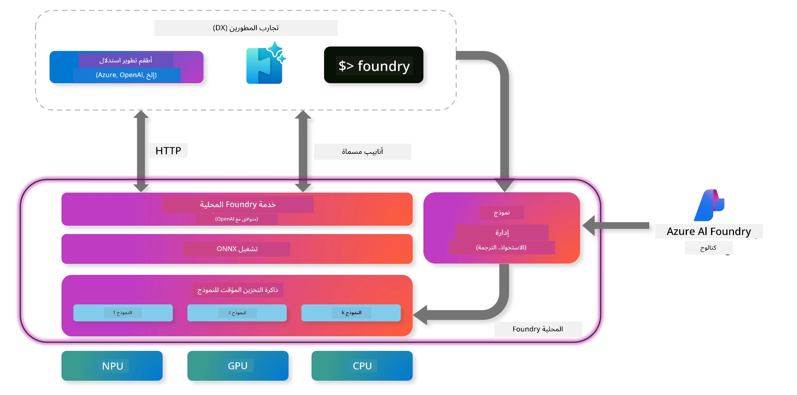
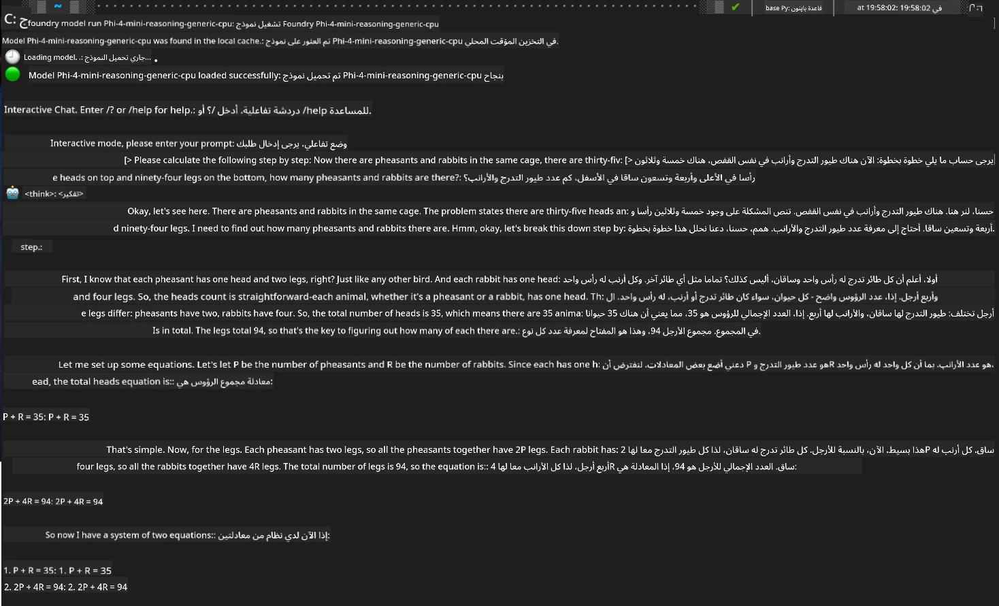

<!--
CO_OP_TRANSLATOR_METADATA:
{
  "original_hash": "52973a5680a65a810aa80b7036afd31f",
  "translation_date": "2025-07-16T19:42:14+00:00",
  "source_file": "md/01.Introduction/02/07.FoundryLocal.md",
  "language_code": "ar"
}
-->
## البدء مع نماذج Phi-Family في Foundry Local

### مقدمة عن Foundry Local

يُعد Foundry Local حلاً قويًا لتشغيل الذكاء الاصطناعي على الجهاز، حيث يتيح قدرات ذكاء اصطناعي بمستوى المؤسسات مباشرة على أجهزتك المحلية. سيرشدك هذا الدليل خلال إعداد واستخدام نماذج Phi-Family مع Foundry Local، مما يمنحك تحكمًا كاملاً في مهام الذكاء الاصطناعي مع الحفاظ على الخصوصية وتقليل التكاليف.

يوفر Foundry Local مزايا في الأداء والخصوصية والتخصيص والتكلفة من خلال تشغيل نماذج الذكاء الاصطناعي محليًا على جهازك. كما يندمج بسلاسة في سير عملك وتطبيقاتك الحالية عبر واجهة سطر الأوامر (CLI)، ومجموعة تطوير البرمجيات (SDK)، وواجهة برمجة التطبيقات REST.



### لماذا تختار Foundry Local؟

فهم فوائد Foundry Local سيساعدك على اتخاذ قرارات مدروسة بشأن استراتيجية نشر الذكاء الاصطناعي الخاصة بك:

- **تشغيل على الجهاز:** قم بتشغيل النماذج محليًا على أجهزتك الخاصة، مما يقلل التكاليف مع الحفاظ على جميع بياناتك على جهازك.

- **تخصيص النماذج:** اختر من بين النماذج الجاهزة أو استخدم نماذجك الخاصة لتلبية متطلبات وحالات استخدام محددة.

- **كفاءة التكلفة:** تخلص من تكاليف خدمات السحابة المتكررة باستخدام أجهزتك الحالية، مما يجعل الذكاء الاصطناعي أكثر سهولة.

- **تكامل سلس:** تواصل مع تطبيقاتك عبر SDK، ونقاط نهاية API، أو CLI، مع إمكانية التوسع بسهولة إلى Azure AI Foundry حسب حاجتك.

> **ملاحظة للبدء:** يركز هذا الدليل على استخدام Foundry Local من خلال واجهات CLI وSDK. ستتعلم كلا الطريقتين لمساعدتك في اختيار الأنسب لحالتك.

## الجزء الأول: إعداد Foundry Local CLI

### الخطوة 1: التثبيت

تعد واجهة Foundry Local CLI بوابتك لإدارة وتشغيل نماذج الذكاء الاصطناعي محليًا. لنبدأ بتثبيتها على نظامك.

**الأنظمة المدعومة:** ويندوز وماك

للحصول على تعليمات التثبيت التفصيلية، يرجى الرجوع إلى [التوثيق الرسمي لـ Foundry Local](https://github.com/microsoft/Foundry-Local/blob/main/README.md).

### الخطوة 2: استكشاف النماذج المتاحة

بعد تثبيت Foundry Local CLI، يمكنك اكتشاف النماذج المتوفرة لحالة استخدامك. سيعرض هذا الأمر جميع النماذج المدعومة:

```bash
foundry model list
```

### الخطوة 3: فهم نماذج Phi Family

تقدم عائلة Phi مجموعة من النماذج المحسنة لمختلف حالات الاستخدام وتكوينات الأجهزة. إليك نماذج Phi المتاحة في Foundry Local:

**نماذج Phi المتوفرة:**

- **phi-3.5-mini** - نموذج مدمج للمهام الأساسية
- **phi-3-mini-128k** - نسخة ذات سياق ممتد للمحادثات الطويلة
- **phi-3-mini-4k** - نموذج سياق قياسي للاستخدام العام
- **phi-4** - نموذج متقدم بقدرات محسنة
- **phi-4-mini** - نسخة خفيفة من Phi-4
- **phi-4-mini-reasoning** - متخصص في مهام التفكير المعقدة

> **التوافق مع الأجهزة:** يمكن تكوين كل نموذج لتسريع مختلف على الأجهزة (CPU، GPU) حسب قدرات نظامك.

### الخطوة 4: تشغيل أول نموذج Phi لك

لنبدأ بمثال عملي. سنشغل نموذج `phi-4-mini-reasoning`، الذي يتفوق في حل المشكلات المعقدة خطوة بخطوة.

**الأمر لتشغيل النموذج:**

```bash
foundry model run Phi-4-mini-reasoning-generic-cpu
```

> **الإعداد لأول مرة:** عند تشغيل نموذج لأول مرة، سيقوم Foundry Local بتنزيله تلقائيًا على جهازك المحلي. يختلف وقت التنزيل حسب سرعة الشبكة، لذا يرجى التحلي بالصبر أثناء الإعداد الأولي.

### الخطوة 5: اختبار النموذج بمشكلة حقيقية

الآن دعنا نختبر نموذجنا بمشكلة منطقية كلاسيكية لنرى كيف يؤدي التفكير خطوة بخطوة:

**مثال المشكلة:**

```txt
Please calculate the following step by step: Now there are pheasants and rabbits in the same cage, there are thirty-five heads on top and ninety-four legs on the bottom, how many pheasants and rabbits are there?
```

**السلوك المتوقع:** يجب على النموذج تفكيك هذه المشكلة إلى خطوات منطقية، باستخدام حقيقة أن الطواويس لها قدمان والأرانب لها أربع أرجل لحل نظام المعادلات.

**النتائج:**



## الجزء الثاني: بناء التطبيقات باستخدام Foundry Local SDK

### لماذا تستخدم SDK؟

بينما تعد واجهة CLI مثالية للاختبار والتفاعلات السريعة، تتيح لك SDK دمج Foundry Local في تطبيقاتك برمجيًا. هذا يفتح إمكانيات لـ:

- بناء تطبيقات مخصصة مدعومة بالذكاء الاصطناعي
- إنشاء سير عمل آلي
- دمج قدرات الذكاء الاصطناعي في الأنظمة القائمة
- تطوير روبوتات المحادثة والأدوات التفاعلية

### لغات البرمجة المدعومة

يوفر Foundry Local دعم SDK لعدة لغات برمجة لتناسب تفضيلاتك في التطوير:

**📦 SDKs المتاحة:**

- **C# (.NET):** [توثيق وأمثلة SDK](https://github.com/microsoft/Foundry-Local/tree/main/sdk/cs)
- **Python:** [توثيق وأمثلة SDK](https://github.com/microsoft/Foundry-Local/tree/main/sdk/python)
- **JavaScript:** [توثيق وأمثلة SDK](https://github.com/microsoft/Foundry-Local/tree/main/sdk/js)
- **Rust:** [توثيق وأمثلة SDK](https://github.com/microsoft/Foundry-Local/tree/main/sdk/rust)

### الخطوات التالية

1. **اختر SDK المفضل لديك** بناءً على بيئة التطوير الخاصة بك  
2. **اتبع التوثيق الخاص بكل SDK** للحصول على إرشادات التنفيذ التفصيلية  
3. **ابدأ بأمثلة بسيطة** قبل بناء تطبيقات معقدة  
4. **استكشف الكود النموذجي** المقدم في كل مستودع SDK  

## الخاتمة

لقد تعلمت الآن كيف:

- ✅ تثبيت وإعداد Foundry Local CLI  
- ✅ اكتشاف وتشغيل نماذج Phi Family  
- ✅ اختبار النماذج بمشاكل من العالم الحقيقي  
- ✅ فهم خيارات SDK لتطوير التطبيقات  

يوفر Foundry Local أساسًا قويًا لجلب قدرات الذكاء الاصطناعي مباشرة إلى بيئتك المحلية، مما يمنحك التحكم في الأداء والخصوصية والتكاليف مع الحفاظ على المرونة للتوسع إلى حلول السحابة عند الحاجة.

**إخلاء المسؤولية**:  
تمت ترجمة هذا المستند باستخدام خدمة الترجمة الآلية [Co-op Translator](https://github.com/Azure/co-op-translator). بينما نسعى لتحقيق الدقة، يرجى العلم أن الترجمات الآلية قد تحتوي على أخطاء أو عدم دقة. يجب اعتبار المستند الأصلي بلغته الأصلية المصدر الموثوق به. للمعلومات الهامة، يُنصح بالاعتماد على الترجمة البشرية المهنية. نحن غير مسؤولين عن أي سوء فهم أو تفسير ناتج عن استخدام هذه الترجمة.