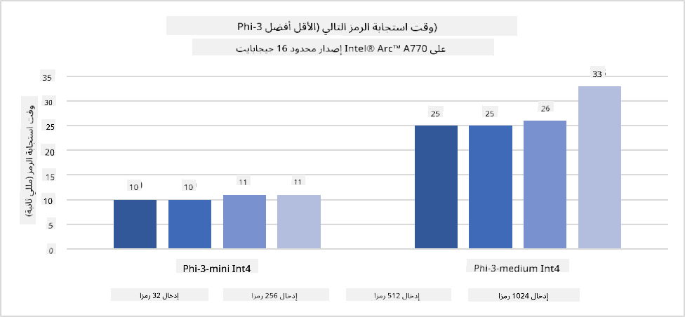

<!--
CO_OP_TRANSLATOR_METADATA:
{
  "original_hash": "e08ce816e23ad813244a09ca34ebb8ac",
  "translation_date": "2025-07-16T19:54:20+00:00",
  "source_file": "md/01.Introduction/03/AIPC_Inference.md",
  "language_code": "ar"
}
-->
# **تشغيل Phi-3 للاستدلال على حاسوب AI**

مع تقدم الذكاء الاصطناعي التوليدي وتحسن قدرات أجهزة الحافة، أصبح بإمكان عدد متزايد من نماذج الذكاء الاصطناعي التوليدية أن تُدمج في أجهزة المستخدمين الشخصية (BYOD). حواسيب AI هي من بين هذه النماذج. بدءًا من عام 2024، تعاونت Intel وAMD وQualcomm مع مصنعي الحواسيب لتقديم حواسيب AI تسهل نشر نماذج الذكاء الاصطناعي التوليدية المحلية عبر تعديلات في العتاد. في هذا النقاش، سنركز على حواسيب AI من Intel ونستعرض كيفية نشر Phi-3 على حاسوب AI من Intel.

### ما هو NPU

وحدة المعالجة العصبية (NPU) هي معالج مخصص أو وحدة معالجة ضمن نظام على شريحة (SoC) أكبر، مصممة خصيصًا لتسريع عمليات الشبكات العصبية ومهام الذكاء الاصطناعي. على عكس وحدات المعالجة المركزية (CPU) ووحدات معالجة الرسوميات (GPU) العامة، تم تحسين NPUs للحوسبة المتوازية المعتمدة على البيانات، مما يجعلها فعالة جدًا في معالجة كميات ضخمة من البيانات متعددة الوسائط مثل الفيديوهات والصور، وكذلك معالجة بيانات الشبكات العصبية. هي بارعة بشكل خاص في التعامل مع مهام الذكاء الاصطناعي مثل التعرف على الصوت، تمويه الخلفية في مكالمات الفيديو، وعمليات تحرير الصور أو الفيديو مثل اكتشاف الأجسام.

## NPU مقابل GPU

بينما تعمل العديد من مهام الذكاء الاصطناعي وتعلم الآلة على وحدات معالجة الرسوميات، هناك فرق جوهري بين GPU وNPU.
تشتهر وحدات معالجة الرسوميات بقدراتها على الحوسبة المتوازية، لكن ليست كل وحدات GPU فعالة بنفس القدر خارج نطاق معالجة الرسوميات. من ناحية أخرى، تم تصميم NPUs خصيصًا للعمليات الحسابية المعقدة المتعلقة بالشبكات العصبية، مما يجعلها فعالة للغاية في مهام الذكاء الاصطناعي.

باختصار، NPUs هي العباقرة الرياضيون الذين يسرعون حسابات الذكاء الاصطناعي، وتلعب دورًا رئيسيًا في عصر حواسيب AI الناشئ!

***هذا المثال مبني على أحدث معالج Intel Core Ultra من Intel***

## **1. استخدام NPU لتشغيل نموذج Phi-3**

جهاز Intel® NPU هو مسرع استدلال ذكاء اصطناعي مدمج مع معالجات Intel للعملاء، بدءًا من جيل معالجات Intel® Core™ Ultra (المعروف سابقًا باسم Meteor Lake). يتيح تنفيذ مهام الشبكات العصبية الاصطناعية بكفاءة في استهلاك الطاقة.




**مكتبة تسريع Intel NPU**

مكتبة تسريع Intel NPU [https://github.com/intel/intel-npu-acceleration-library](https://github.com/intel/intel-npu-acceleration-library) هي مكتبة بايثون مصممة لتعزيز كفاءة تطبيقاتك من خلال استغلال قوة وحدة المعالجة العصبية من Intel (NPU) لأداء حسابات عالية السرعة على العتاد المتوافق.

مثال على Phi-3-mini على حاسوب AI مدعوم بمعالجات Intel® Core™ Ultra.


تثبيت مكتبة بايثون باستخدام pip

```bash

   pip install intel-npu-acceleration-library

```

***ملاحظة*** المشروع لا يزال قيد التطوير، لكن النموذج المرجعي مكتمل جدًا بالفعل.

### **تشغيل Phi-3 باستخدام مكتبة تسريع Intel NPU**

باستخدام تسريع Intel NPU، لا تؤثر هذه المكتبة على عملية الترميز التقليدية. كل ما عليك هو استخدام هذه المكتبة لتكميم نموذج Phi-3 الأصلي، مثل FP16، INT8، INT4، مثل

```python
from transformers import AutoTokenizer, pipeline,TextStreamer
from intel_npu_acceleration_library import NPUModelForCausalLM, int4
from intel_npu_acceleration_library.compiler import CompilerConfig
import warnings

model_id = "microsoft/Phi-3-mini-4k-instruct"

compiler_conf = CompilerConfig(dtype=int4)
model = NPUModelForCausalLM.from_pretrained(
    model_id, use_cache=True, config=compiler_conf, attn_implementation="sdpa"
).eval()

tokenizer = AutoTokenizer.from_pretrained(model_id)

text_streamer = TextStreamer(tokenizer, skip_prompt=True)
```

بعد نجاح التكميم، استمر في التنفيذ لاستدعاء NPU لتشغيل نموذج Phi-3.

```python
generation_args = {
   "max_new_tokens": 1024,
   "return_full_text": False,
   "temperature": 0.3,
   "do_sample": False,
   "streamer": text_streamer,
}

pipe = pipeline(
   "text-generation",
   model=model,
   tokenizer=tokenizer,
)

query = "<|system|>You are a helpful AI assistant.<|end|><|user|>Can you introduce yourself?<|end|><|assistant|>"

with warnings.catch_warnings():
    warnings.simplefilter("ignore")
    pipe(query, **generation_args)
```

عند تنفيذ الكود، يمكننا مشاهدة حالة تشغيل NPU من خلال مدير المهام


***عينات*** : [AIPC_NPU_DEMO.ipynb](../../../../../code/03.Inference/AIPC/AIPC_NPU_DEMO.ipynb)

## **2. استخدام DirectML + ONNX Runtime لتشغيل نموذج Phi-3**

### **ما هو DirectML**

[DirectML](https://github.com/microsoft/DirectML) هو مكتبة DirectX 12 عالية الأداء ومعجلة بالعتاد لتعلم الآلة. يوفر DirectML تسريع GPU لمهام تعلم الآلة الشائعة عبر مجموعة واسعة من العتاد وبرامج التشغيل المدعومة، بما في ذلك جميع وحدات GPU القادرة على DirectX 12 من شركات مثل AMD وIntel وNVIDIA وQualcomm.

عند استخدامه بشكل مستقل، فإن واجهة برمجة تطبيقات DirectML هي مكتبة DirectX 12 منخفضة المستوى ومناسبة للتطبيقات عالية الأداء ومنخفضة الكمون مثل الأُطُر، الألعاب، والتطبيقات الزمن الحقيقي الأخرى. التوافق السلس لـ DirectML مع Direct3D 12 بالإضافة إلى انخفاض الحمل والتوافق عبر العتاد يجعل DirectML مثاليًا لتسريع تعلم الآلة عندما يكون الأداء العالي مرغوبًا فيه، وكذلك الاعتمادية والتنبؤ بالنتائج عبر العتاد أمرًا حاسمًا.

***ملاحظة*** : يدعم أحدث إصدار من DirectML بالفعل NPU (https://devblogs.microsoft.com/directx/introducing-neural-processor-unit-npu-support-in-directml-developer-preview/)

### DirectML و CUDA من حيث القدرات والأداء:

**DirectML** هي مكتبة تعلم آلة طورتها مايكروسوفت. صممت لتسريع مهام تعلم الآلة على أجهزة ويندوز، بما في ذلك الحواسيب المكتبية والمحمولة وأجهزة الحافة.
- مبنية على DX12: تعتمد DirectML على DirectX 12 (DX12)، الذي يوفر دعمًا واسعًا للعتاد عبر وحدات GPU، بما في ذلك NVIDIA وAMD.
- دعم أوسع: نظرًا لاعتمادها على DX12، يمكن لـ DirectML العمل مع أي GPU يدعم DX12، حتى المدمجة منها.
- معالجة الصور: تعالج DirectML الصور والبيانات الأخرى باستخدام الشبكات العصبية، مما يجعلها مناسبة لمهام مثل التعرف على الصور، اكتشاف الأجسام، وأكثر.
- سهولة الإعداد: إعداد DirectML بسيط ولا يتطلب SDKs أو مكتبات محددة من مصنعي GPU.
- الأداء: في بعض الحالات، تقدم DirectML أداءً جيدًا وقد تكون أسرع من CUDA، خاصة لبعض المهام.
- القيود: مع ذلك، هناك حالات قد تكون فيها DirectML أبطأ، خصوصًا مع أحجام دفعات كبيرة من نوع float16.

**CUDA** هي منصة الحوسبة المتوازية ونموذج البرمجة من NVIDIA. تتيح للمطورين استغلال قوة وحدات GPU من NVIDIA للحوسبة العامة، بما في ذلك تعلم الآلة والمحاكاة العلمية.
- مخصصة لـ NVIDIA: CUDA مدمجة بشكل وثيق مع وحدات GPU من NVIDIA ومصممة خصيصًا لها.
- محسنة للغاية: توفر أداءً ممتازًا للمهام المعجلة بواسطة GPU، خاصة عند استخدام وحدات NVIDIA.
- مستخدمة على نطاق واسع: العديد من أُطُر ومكتبات تعلم الآلة (مثل TensorFlow وPyTorch) تدعم CUDA.
- التخصيص: يمكن للمطورين ضبط إعدادات CUDA لمهام محددة، مما يؤدي إلى أداء مثالي.
- القيود: مع ذلك، اعتماد CUDA على عتاد NVIDIA قد يكون مقيدًا إذا كنت ترغب في توافق أوسع عبر وحدات GPU مختلفة.

### اختيار بين DirectML و CUDA

الاختيار بين DirectML و CUDA يعتمد على حالة الاستخدام الخاصة بك، توفر العتاد، وتفضيلاتك.
إذا كنت تبحث عن توافق أوسع وسهولة في الإعداد، قد يكون DirectML خيارًا جيدًا. أما إذا كان لديك وحدات GPU من NVIDIA وتحتاج إلى أداء محسن للغاية، فإن CUDA يبقى خيارًا قويًا. باختصار، لكل من DirectML و CUDA نقاط قوة وضعف، لذا ضع في اعتبارك متطلباتك والعتاد المتوفر عند اتخاذ القرار.

### **الذكاء الاصطناعي التوليدي مع ONNX Runtime**

في عصر الذكاء الاصطناعي، تعتبر قابلية نقل نماذج الذكاء الاصطناعي أمرًا مهمًا جدًا. يمكن لـ ONNX Runtime نشر النماذج المدربة بسهولة على أجهزة مختلفة. لا يحتاج المطورون للتركيز على إطار الاستدلال ويستخدمون واجهة برمجة تطبيقات موحدة لإتمام الاستدلال على النموذج. في عصر الذكاء الاصطناعي التوليدي، قامت ONNX Runtime أيضًا بتحسين الكود (https://onnxruntime.ai/docs/genai/). من خلال ONNX Runtime المحسنة، يمكن استدلال نموذج الذكاء الاصطناعي التوليدي المكمم على أجهزة مختلفة. في الذكاء الاصطناعي التوليدي مع ONNX Runtime، يمكنك استدعاء واجهة برمجة تطبيقات نموذج الذكاء الاصطناعي عبر بايثون، C#، C / C++. وبالطبع، يمكن الاستفادة من واجهة ONNX Runtime للذكاء الاصطناعي التوليدي على iPhone باستخدام C++.

[كود عينة](https://github.com/Azure-Samples/Phi-3MiniSamples/tree/main/onnx)

***ترجمة مكتبة الذكاء الاصطناعي التوليدي مع ONNX Runtime***

```bash

winget install --id=Kitware.CMake  -e

git clone https://github.com/microsoft/onnxruntime.git

cd .\onnxruntime\

./build.bat --build_shared_lib --skip_tests --parallel --use_dml --config Release

cd ../

git clone https://github.com/microsoft/onnxruntime-genai.git

cd .\onnxruntime-genai\

mkdir ort

cd ort

mkdir include

mkdir lib

copy ..\onnxruntime\include\onnxruntime\core\providers\dml\dml_provider_factory.h ort\include

copy ..\onnxruntime\include\onnxruntime\core\session\onnxruntime_c_api.h ort\include

copy ..\onnxruntime\build\Windows\Release\Release\*.dll ort\lib

copy ..\onnxruntime\build\Windows\Release\Release\onnxruntime.lib ort\lib

python build.py --use_dml


```

**تثبيت المكتبة**

```bash

pip install .\onnxruntime_genai_directml-0.3.0.dev0-cp310-cp310-win_amd64.whl

```

هذه هي نتيجة التشغيل


***عينات*** : [AIPC_DirectML_DEMO.ipynb](../../../../../code/03.Inference/AIPC/AIPC_DirectML_DEMO.ipynb)

## **3. استخدام Intel OpenVino لتشغيل نموذج Phi-3**

### **ما هو OpenVINO**

[OpenVINO](https://github.com/openvinotoolkit/openvino) هو مجموعة أدوات مفتوحة المصدر لتحسين ونشر نماذج التعلم العميق. يوفر أداءً معززًا لنماذج الرؤية، الصوت، واللغة من أُطُر شهيرة مثل TensorFlow وPyTorch وغيرها. ابدأ مع OpenVINO. يمكن أيضًا استخدام OpenVINO بالتزامن مع CPU وGPU لتشغيل نموذج Phi-3.

***ملاحظة***: حاليًا، لا يدعم OpenVINO NPU في الوقت الحالي.

### **تثبيت مكتبة OpenVINO**

```bash

 pip install git+https://github.com/huggingface/optimum-intel.git

 pip install git+https://github.com/openvinotoolkit/nncf.git

 pip install openvino-nightly

```

### **تشغيل Phi-3 باستخدام OpenVINO**

مثل NPU، يكمل OpenVINO استدعاء نماذج الذكاء الاصطناعي التوليدية عن طريق تشغيل النماذج المكممة. نحتاج أولًا إلى تكميم نموذج Phi-3 وإتمام التكميم عبر سطر الأوامر باستخدام optimum-cli

**INT4**

```bash

optimum-cli export openvino --model "microsoft/Phi-3-mini-4k-instruct" --task text-generation-with-past --weight-format int4 --group-size 128 --ratio 0.6  --sym  --trust-remote-code ./openvinomodel/phi3/int4

```

**FP16**

```bash

optimum-cli export openvino --model "microsoft/Phi-3-mini-4k-instruct" --task text-generation-with-past --weight-format fp16 --trust-remote-code ./openvinomodel/phi3/fp16

```

الصيغة المحولة، مثل هذه


تحميل مسارات النموذج (model_dir)، الإعدادات ذات الصلة (ov_config = {"PERFORMANCE_HINT": "LATENCY", "NUM_STREAMS": "1", "CACHE_DIR": ""})، والأجهزة المعجلة بالعتاد (GPU.0) عبر OVModelForCausalLM

```python

ov_model = OVModelForCausalLM.from_pretrained(
     model_dir,
     device='GPU.0',
     ov_config=ov_config,
     config=AutoConfig.from_pretrained(model_dir, trust_remote_code=True),
     trust_remote_code=True,
)

```

عند تنفيذ الكود، يمكننا مشاهدة حالة تشغيل GPU من خلال مدير المهام


***عينات*** : [AIPC_OpenVino_Demo.ipynb](../../../../../code/03.Inference/AIPC/AIPC_OpenVino_Demo.ipynb)

### ***ملاحظة*** : الطرق الثلاثة أعلاه لكل منها مزاياها، لكن يُنصح باستخدام تسريع NPU لاستدلال حواسيب AI.

**إخلاء المسؤولية**:  
تمت ترجمة هذا المستند باستخدام خدمة الترجمة الآلية [Co-op Translator](https://github.com/Azure/co-op-translator). بينما نسعى لتحقيق الدقة، يرجى العلم أن الترجمات الآلية قد تحتوي على أخطاء أو عدم دقة. يجب اعتبار المستند الأصلي بلغته الأصلية المصدر الموثوق به. للمعلومات الهامة، يُنصح بالاعتماد على الترجمة البشرية المهنية. نحن غير مسؤولين عن أي سوء فهم أو تفسير ناتج عن استخدام هذه الترجمة.