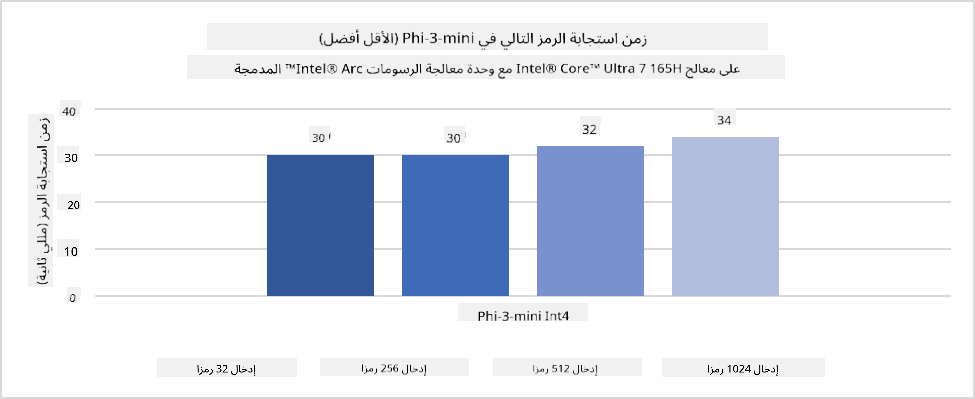
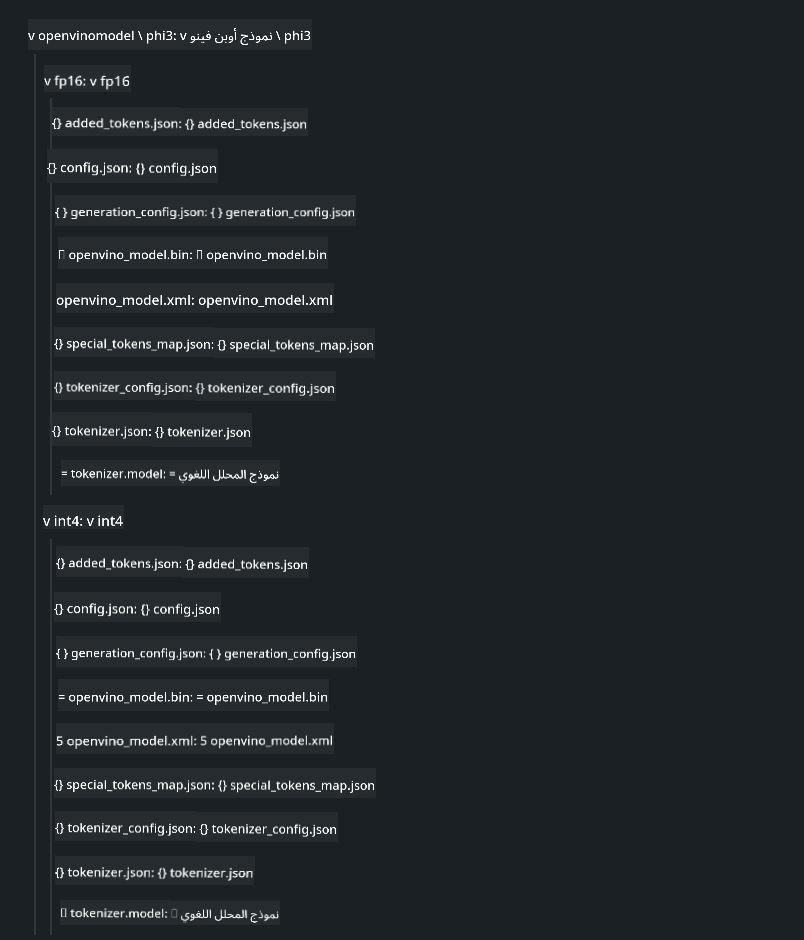
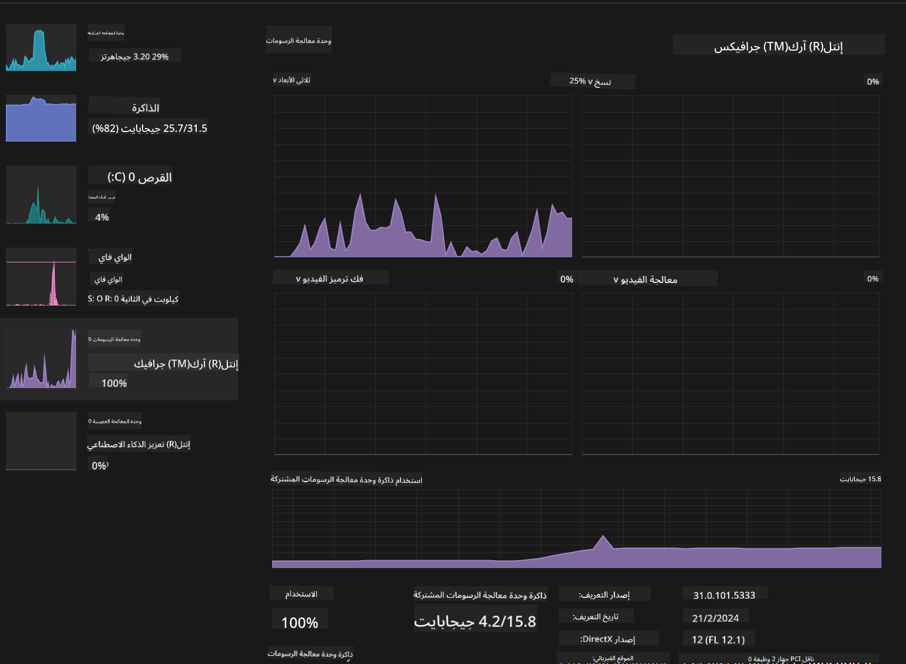

<!--
CO_OP_TRANSLATOR_METADATA:
{
  "original_hash": "e08ce816e23ad813244a09ca34ebb8ac",
  "translation_date": "2025-05-07T10:41:22+00:00",
  "source_file": "md/01.Introduction/03/AIPC_Inference.md",
  "language_code": "ar"
}
-->
# **الاستدلال Phi-3 في حاسوب الذكاء الاصطناعي**

مع تقدم الذكاء الاصطناعي التوليدي وتحسن قدرات الأجهزة الطرفية، أصبح بإمكان عدد متزايد من نماذج الذكاء الاصطناعي التوليدية أن تُدمج في أجهزة المستخدمين الخاصة (BYOD). تُعد حواسيب الذكاء الاصطناعي من بين هذه النماذج. بدءًا من عام 2024، تعاونت Intel وAMD وQualcomm مع مصنعي الحواسيب لتقديم حواسيب ذكاء اصطناعي تسهل نشر نماذج الذكاء الاصطناعي التوليدية المحلية من خلال تعديلات في الأجهزة. في هذا النقاش، سنركز على حواسيب Intel للذكاء الاصطناعي ونستعرض كيفية نشر Phi-3 على حاسوب Intel للذكاء الاصطناعي.

### ما هو NPU

وحدة المعالجة العصبية (NPU) هي معالج مخصص أو وحدة معالجة ضمن نظام على شريحة (SoC) أكبر، مصممة خصيصًا لتسريع عمليات الشبكات العصبية ومهام الذكاء الاصطناعي. بخلاف وحدات المعالجة المركزية (CPU) ووحدات معالجة الرسوميات (GPU) العامة، تم تحسين وحدات NPU للحوسبة المتوازية المعتمدة على البيانات، مما يجعلها فعالة جدًا في معالجة كميات ضخمة من البيانات المتعددة الوسائط مثل الفيديوهات والصور، وكذلك معالجة بيانات الشبكات العصبية. وهي متفوقة بشكل خاص في التعامل مع مهام الذكاء الاصطناعي مثل التعرف على الصوت، وتعتيم الخلفية في مكالمات الفيديو، وعمليات تحرير الصور أو الفيديو مثل اكتشاف الأجسام.

## NPU مقابل GPU

بينما تعمل العديد من أحمال عمل الذكاء الاصطناعي وتعلم الآلة على وحدات GPU، هناك فرق جوهري بين GPU وNPU.
تشتهر وحدات GPU بقدراتها في الحوسبة المتوازية، لكن ليست كل وحدات GPU متساوية في الكفاءة خارج معالجة الرسوميات. من ناحية أخرى، تم تصميم وحدات NPU خصيصًا للحسابات المعقدة المرتبطة بعمليات الشبكات العصبية، مما يجعلها فعالة جدًا في مهام الذكاء الاصطناعي.

باختصار، وحدات NPU هي العباقرة الرياضيون الذين يسرّعون حسابات الذكاء الاصطناعي، وتلعب دورًا رئيسيًا في عصر حواسيب الذكاء الاصطناعي الناشئ!

***هذا المثال قائم على أحدث معالج Intel Core Ultra من Intel***

## **1. استخدام NPU لتشغيل نموذج Phi-3**

جهاز Intel® NPU هو معجل استدلال للذكاء الاصطناعي مدمج مع وحدات المعالجة المركزية من Intel للعملاء، بدءًا من جيل Intel® Core™ Ultra (المعروف سابقًا باسم Meteor Lake). يتيح تنفيذ مهام الشبكات العصبية الاصطناعية بكفاءة عالية في استهلاك الطاقة.




**مكتبة تسريع Intel NPU**

مكتبة تسريع Intel NPU [https://github.com/intel/intel-npu-acceleration-library](https://github.com/intel/intel-npu-acceleration-library) هي مكتبة بايثون مصممة لتعزيز كفاءة تطبيقاتك من خلال استغلال قوة وحدة المعالجة العصبية من Intel لأداء حسابات عالية السرعة على الأجهزة المتوافقة.

مثال على Phi-3-mini على حاسوب ذكاء اصطناعي مدعوم بمعالجات Intel® Core™ Ultra.


تثبيت مكتبة بايثون باستخدام pip

```bash

   pip install intel-npu-acceleration-library

```

***ملاحظة*** المشروع لا يزال قيد التطوير، لكن النموذج المرجعي مكتمل جدًا بالفعل.

### **تشغيل Phi-3 باستخدام مكتبة تسريع Intel NPU**

باستخدام تسريع Intel NPU، لا تؤثر هذه المكتبة على عملية الترميز التقليدية. تحتاج فقط لاستخدام هذه المكتبة لتكميم نموذج Phi-3 الأصلي، مثل FP16، INT8، INT4، مثل

```python
from transformers import AutoTokenizer, pipeline,TextStreamer
from intel_npu_acceleration_library import NPUModelForCausalLM, int4
from intel_npu_acceleration_library.compiler import CompilerConfig
import warnings

model_id = "microsoft/Phi-3-mini-4k-instruct"

compiler_conf = CompilerConfig(dtype=int4)
model = NPUModelForCausalLM.from_pretrained(
    model_id, use_cache=True, config=compiler_conf, attn_implementation="sdpa"
).eval()

tokenizer = AutoTokenizer.from_pretrained(model_id)

text_streamer = TextStreamer(tokenizer, skip_prompt=True)
```

بعد نجاح التكميم، استمر في التنفيذ لاستدعاء NPU لتشغيل نموذج Phi-3.

```python
generation_args = {
   "max_new_tokens": 1024,
   "return_full_text": False,
   "temperature": 0.3,
   "do_sample": False,
   "streamer": text_streamer,
}

pipe = pipeline(
   "text-generation",
   model=model,
   tokenizer=tokenizer,
)

query = "<|system|>You are a helpful AI assistant.<|end|><|user|>Can you introduce yourself?<|end|><|assistant|>"

with warnings.catch_warnings():
    warnings.simplefilter("ignore")
    pipe(query, **generation_args)
```

عند تنفيذ الكود، يمكننا مشاهدة حالة تشغيل NPU من خلال مدير المهام


***عينات*** : [AIPC_NPU_DEMO.ipynb](../../../../../code/03.Inference/AIPC/AIPC_NPU_DEMO.ipynb)

## **2. استخدام DirectML + ONNX Runtime لتشغيل نموذج Phi-3**

### **ما هو DirectML**

[DirectML](https://github.com/microsoft/DirectML) هي مكتبة DirectX 12 عالية الأداء ومعجلة بواسطة الأجهزة لتعلم الآلة. توفر DirectML تسريع GPU لمهام تعلم الآلة الشائعة عبر مجموعة واسعة من الأجهزة وبرامج التشغيل المدعومة، بما في ذلك جميع وحدات GPU القادرة على DirectX 12 من شركات مثل AMD وIntel وNVIDIA وQualcomm.

عند استخدامه بشكل مستقل، تعد واجهة برمجة تطبيقات DirectML مكتبة DirectX 12 منخفضة المستوى ومناسبة للتطبيقات عالية الأداء وذات الكمون المنخفض مثل الأُطُر، الألعاب، والتطبيقات الزمن الحقيقي الأخرى. تجعل التوافق السلس بين DirectML وDirect3D 12 بالإضافة إلى انخفاض الحمل والتوافق عبر الأجهزة DirectML مثاليًا لتسريع تعلم الآلة عندما يكون الأداء العالي والموثوقية والتنبؤ بالنتائج عبر الأجهزة أمرًا حيويًا.

***ملاحظة*** : يدعم أحدث إصدار من DirectML وحدة NPU (https://devblogs.microsoft.com/directx/introducing-neural-processor-unit-npu-support-in-directml-developer-preview/)

### DirectML وCUDA من حيث القدرات والأداء:

**DirectML** هي مكتبة تعلم آلة طورتها مايكروسوفت. صممت لتسريع أحمال تعلم الآلة على أجهزة ويندوز، بما في ذلك الحواسيب المكتبية، المحمولة، والأجهزة الطرفية.
- مبنية على DX12: تعتمد DirectML على DirectX 12 (DX12)، الذي يوفر دعمًا واسعًا للأجهزة عبر وحدات GPU، بما في ذلك NVIDIA وAMD.
- دعم أوسع: نظرًا لاعتمادها على DX12، يمكن لـ DirectML العمل مع أي وحدة GPU تدعم DX12، حتى المدمجة منها.
- معالجة الصور: تعالج DirectML الصور والبيانات الأخرى باستخدام الشبكات العصبية، مما يجعلها مناسبة لمهام مثل التعرف على الصور، اكتشاف الأجسام، والمزيد.
- سهولة الإعداد: إعداد DirectML بسيط ولا يتطلب SDKs أو مكتبات محددة من مصنعي GPU.
- الأداء: في بعض الحالات، تقدم DirectML أداء جيدًا وقد تكون أسرع من CUDA، خصوصًا في بعض أحمال العمل.
- القيود: مع ذلك، هناك حالات قد تكون فيها DirectML أبطأ، خصوصًا مع أحجام دفعات كبيرة من نوع float16.

**CUDA** هي منصة الحوسبة المتوازية ونموذج البرمجة من NVIDIA. تتيح للمطورين استغلال قوة وحدات GPU من NVIDIA للحوسبة العامة، بما في ذلك تعلم الآلة والمحاكاة العلمية.
- مخصصة لـ NVIDIA: CUDA مدمجة بقوة مع وحدات GPU من NVIDIA ومصممة خصيصًا لها.
- محسنة للغاية: توفر أداءً ممتازًا للمهام المعجلة على GPU، خاصة عند استخدام وحدات NVIDIA.
- مستخدمة على نطاق واسع: تدعم العديد من أُطُر ومكتبات تعلم الآلة (مثل TensorFlow وPyTorch) CUDA.
- التخصيص: يمكن للمطورين ضبط إعدادات CUDA لمهام محددة لتحقيق أداء أمثل.
- القيود: مع ذلك، تعتمد CUDA على أجهزة NVIDIA، مما قد يحد من التوافق مع وحدات GPU أخرى.

### اختيار بين DirectML وCUDA

يعتمد الاختيار بين DirectML وCUDA على حالة الاستخدام المحددة، توفر الأجهزة، والتفضيلات.
إذا كنت تبحث عن توافق أوسع وسهولة في الإعداد، فقد يكون DirectML خيارًا جيدًا. أما إذا كان لديك وحدات GPU من NVIDIA وتحتاج إلى أداء محسن للغاية، فإن CUDA تظل خيارًا قويًا. باختصار، لكل من DirectML وCUDA نقاط قوة وضعف، لذا ضع في اعتبارك متطلباتك والأجهزة المتاحة عند اتخاذ القرار.

### **الذكاء الاصطناعي التوليدي مع ONNX Runtime**

في عصر الذكاء الاصطناعي، تعد قابلية نقل النماذج أمرًا مهمًا جدًا. يمكن لـ ONNX Runtime نشر النماذج المدربة بسهولة على أجهزة مختلفة. لا يحتاج المطورون للتركيز على إطار الاستدلال ويستخدمون واجهة برمجة تطبيقات موحدة لإتمام الاستدلال. في عصر الذكاء الاصطناعي التوليدي، قامت ONNX Runtime أيضًا بتحسين الكود (https://onnxruntime.ai/docs/genai/). من خلال ONNX Runtime المحسّن، يمكن استدلال نموذج الذكاء الاصطناعي التوليدي المكمم على أجهزة مختلفة. في الذكاء الاصطناعي التوليدي مع ONNX Runtime، يمكنك استدعاء واجهة برمجة نموذج الذكاء الاصطناعي عبر بايثون، C#، C / C++. وبالطبع، يمكن نشره على iPhone للاستفادة من واجهة ONNX Runtime للذكاء الاصطناعي التوليدي باستخدام C++.

[رمز العينة](https://github.com/Azure-Samples/Phi-3MiniSamples/tree/main/onnx)

***تجميع مكتبة الذكاء الاصطناعي التوليدي مع ONNX Runtime***

```bash

winget install --id=Kitware.CMake  -e

git clone https://github.com/microsoft/onnxruntime.git

cd .\onnxruntime\

./build.bat --build_shared_lib --skip_tests --parallel --use_dml --config Release

cd ../

git clone https://github.com/microsoft/onnxruntime-genai.git

cd .\onnxruntime-genai\

mkdir ort

cd ort

mkdir include

mkdir lib

copy ..\onnxruntime\include\onnxruntime\core\providers\dml\dml_provider_factory.h ort\include

copy ..\onnxruntime\include\onnxruntime\core\session\onnxruntime_c_api.h ort\include

copy ..\onnxruntime\build\Windows\Release\Release\*.dll ort\lib

copy ..\onnxruntime\build\Windows\Release\Release\onnxruntime.lib ort\lib

python build.py --use_dml


```

**تثبيت المكتبة**

```bash

pip install .\onnxruntime_genai_directml-0.3.0.dev0-cp310-cp310-win_amd64.whl

```

هذه هي نتيجة التشغيل


***عينات*** : [AIPC_DirectML_DEMO.ipynb](../../../../../code/03.Inference/AIPC/AIPC_DirectML_DEMO.ipynb)

## **3. استخدام Intel OpenVino لتشغيل نموذج Phi-3**

### **ما هو OpenVINO**

[OpenVINO](https://github.com/openvinotoolkit/openvino) هو مجموعة أدوات مفتوحة المصدر لتحسين ونشر نماذج التعلم العميق. يوفر أداءً معززًا لنماذج الرؤية، الصوت، واللغة من أُطُر شهيرة مثل TensorFlow، PyTorch، والمزيد. ابدأ مع OpenVINO. يمكن أيضًا استخدام OpenVINO بالتزامن مع CPU وGPU لتشغيل نموذج Phi-3.

***ملاحظة***: حاليًا، لا يدعم OpenVINO وحدة NPU.

### **تثبيت مكتبة OpenVINO**

```bash

 pip install git+https://github.com/huggingface/optimum-intel.git

 pip install git+https://github.com/openvinotoolkit/nncf.git

 pip install openvino-nightly

```

### **تشغيل Phi-3 مع OpenVINO**

مثل NPU، يكمل OpenVINO استدعاء نماذج الذكاء الاصطناعي التوليدي عبر تشغيل النماذج المكممة. نحتاج أولًا إلى تكميم نموذج Phi-3 وإتمام التكميم عبر سطر الأوامر باستخدام optimum-cli

**INT4**

```bash

optimum-cli export openvino --model "microsoft/Phi-3-mini-4k-instruct" --task text-generation-with-past --weight-format int4 --group-size 128 --ratio 0.6  --sym  --trust-remote-code ./openvinomodel/phi3/int4

```

**FP16**

```bash

optimum-cli export openvino --model "microsoft/Phi-3-mini-4k-instruct" --task text-generation-with-past --weight-format fp16 --trust-remote-code ./openvinomodel/phi3/fp16

```

الصيغة المحوّلة، مثل هذه



تحميل مسارات النموذج (model_dir)، التكوينات ذات الصلة (ov_config = {"PERFORMANCE_HINT": "LATENCY", "NUM_STREAMS": "1", "CACHE_DIR": ""})، والأجهزة المعجلة بواسطة العتاد (GPU.0) عبر OVModelForCausalLM

```python

ov_model = OVModelForCausalLM.from_pretrained(
     model_dir,
     device='GPU.0',
     ov_config=ov_config,
     config=AutoConfig.from_pretrained(model_dir, trust_remote_code=True),
     trust_remote_code=True,
)

```

عند تنفيذ الكود، يمكننا مشاهدة حالة تشغيل GPU من خلال مدير المهام



***عينات*** : [AIPC_OpenVino_Demo.ipynb](../../../../../code/03.Inference/AIPC/AIPC_OpenVino_Demo.ipynb)

### ***ملاحظة*** : الطرق الثلاثة أعلاه لكل منها مزاياها، لكن يُنصح باستخدام تسريع NPU للاستدلال على حواسيب الذكاء الاصطناعي.

**إخلاء المسؤولية**:  
تمت ترجمة هذا المستند باستخدام خدمة الترجمة الآلية [Co-op Translator](https://github.com/Azure/co-op-translator). بينما نسعى جاهدين لتحقيق الدقة، يرجى العلم أن الترجمات الآلية قد تحتوي على أخطاء أو عدم دقة. يجب اعتبار المستند الأصلي بلغته الأصلية المصدر المعتمد. للمعلومات الحساسة، يُنصح بالترجمة البشرية المهنية. نحن غير مسؤولين عن أي سوء فهم أو تفسيرات خاطئة ناتجة عن استخدام هذه الترجمة.