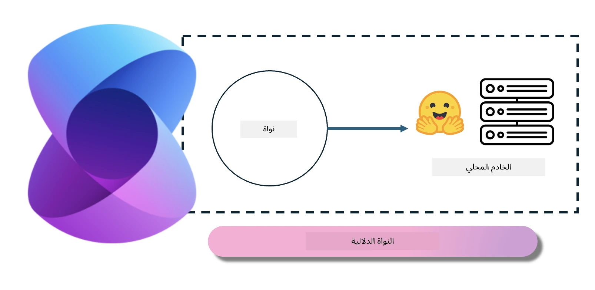
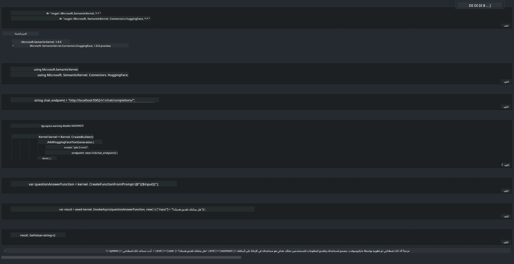

<!--
CO_OP_TRANSLATOR_METADATA:
{
  "original_hash": "bcf5dd7031db0031abdb9dd0c05ba118",
  "translation_date": "2025-07-16T20:55:12+00:00",
  "source_file": "md/01.Introduction/03/Local_Server_Inference.md",
  "language_code": "ar"
}
-->
# **تشغيل Phi-3 على خادم محلي**

يمكننا نشر Phi-3 على خادم محلي. يمكن للمستخدمين اختيار حلول [Ollama](https://ollama.com) أو [LM Studio](https://llamaedge.com)، أو يمكنهم كتابة كودهم الخاص. يمكنك ربط خدمات Phi-3 المحلية عبر [Semantic Kernel](https://github.com/microsoft/semantic-kernel?WT.mc_id=aiml-138114-kinfeylo) أو [Langchain](https://www.langchain.com/) لبناء تطبيقات Copilot.

## **استخدام Semantic Kernel للوصول إلى Phi-3-mini**

في تطبيق Copilot، نقوم بإنشاء التطبيقات من خلال Semantic Kernel / LangChain. هذا النوع من أُطُر العمل للتطبيقات عادةً ما يكون متوافقًا مع Azure OpenAI Service / نماذج OpenAI، ويمكنه أيضًا دعم النماذج مفتوحة المصدر على Hugging Face والنماذج المحلية. ماذا نفعل إذا أردنا استخدام Semantic Kernel للوصول إلى Phi-3-mini؟ باستخدام .NET كمثال، يمكننا دمجه مع Hugging Face Connector في Semantic Kernel. بشكل افتراضي، يمكنه التوافق مع معرف النموذج على Hugging Face (عند الاستخدام الأول، سيتم تنزيل النموذج من Hugging Face، وهذا يستغرق وقتًا طويلاً). يمكنك أيضًا الاتصال بالخدمة المحلية التي تم إنشاؤها. بالمقارنة بين الخيارين، نوصي باستخدام الخيار الأخير لأنه يمنح درجة أعلى من الاستقلالية، خاصة في تطبيقات المؤسسات.

من الشكل، يمكن الوصول إلى الخدمات المحلية عبر Semantic Kernel بسهولة للاتصال بخادم نموذج Phi-3-mini الذي تم إنشاؤه ذاتيًا. فيما يلي نتيجة التشغيل:

***Sample Code*** https://github.com/kinfey/Phi3MiniSamples/tree/main/semantickernel

**إخلاء المسؤولية**:  
تمت ترجمة هذا المستند باستخدام خدمة الترجمة الآلية [Co-op Translator](https://github.com/Azure/co-op-translator). بينما نسعى لتحقيق الدقة، يرجى العلم أن الترجمات الآلية قد تحتوي على أخطاء أو عدم دقة. يجب اعتبار المستند الأصلي بلغته الأصلية المصدر الموثوق به. للمعلومات الهامة، يُنصح بالاعتماد على الترجمة البشرية المهنية. نحن غير مسؤولين عن أي سوء فهم أو تفسير ناتج عن استخدام هذه الترجمة.