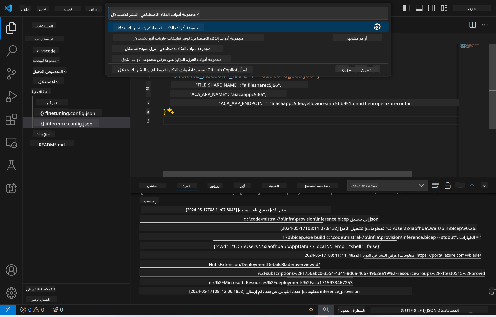
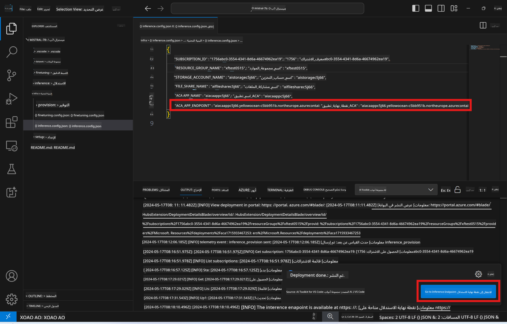

<!--
CO_OP_TRANSLATOR_METADATA:
{
  "original_hash": "a54cd3d65b6963e4e8ce21e143c3ab04",
  "translation_date": "2025-07-16T21:15:08+00:00",
  "source_file": "md/01.Introduction/03/Remote_Interence.md",
  "language_code": "ar"
}
-->
# الاستدلال عن بُعد باستخدام النموذج المُحسّن

بعد تدريب المحولات في البيئة البعيدة، استخدم تطبيق Gradio بسيط للتفاعل مع النموذج.


### توفير موارد Azure  
يجب عليك إعداد موارد Azure للاستدلال عن بُعد من خلال تنفيذ الأمر `AI Toolkit: Provision Azure Container Apps for inference` من لوحة الأوامر. خلال هذه العملية، سيُطلب منك اختيار اشتراك Azure ومجموعة الموارد الخاصة بك.  


بشكل افتراضي، يجب أن يتطابق الاشتراك ومجموعة الموارد الخاصة بالاستدلال مع تلك المستخدمة في التخصيص. سيستخدم الاستدلال نفس بيئة تطبيق Azure Container App ويصل إلى النموذج ومحول النموذج المخزن في Azure Files، والتي تم إنشاؤها أثناء خطوة التخصيص.

## استخدام AI Toolkit

### النشر للاستدلال  
إذا رغبت في تعديل كود الاستدلال أو إعادة تحميل نموذج الاستدلال، يرجى تنفيذ الأمر `AI Toolkit: Deploy for inference`. سيؤدي ذلك إلى مزامنة أحدث كود لديك مع ACA وإعادة تشغيل النسخة.



بعد إتمام النشر بنجاح، يصبح النموذج جاهزًا للتقييم باستخدام نقطة النهاية هذه.

### الوصول إلى واجهة برمجة تطبيقات الاستدلال

يمكنك الوصول إلى واجهة برمجة تطبيقات الاستدلال بالنقر على زر "*الانتقال إلى نقطة نهاية الاستدلال*" المعروض في إشعار VSCode. بدلاً من ذلك، يمكن العثور على نقطة نهاية واجهة الويب API تحت `ACA_APP_ENDPOINT` في ملف `./infra/inference.config.json` وفي لوحة الإخراج.



> **ملاحظة:** قد يستغرق تفعيل نقطة نهاية الاستدلال بضع دقائق لتصبح جاهزة تمامًا.

## مكونات الاستدلال المدرجة في القالب

| المجلد | المحتويات |
| ------ |--------- |
| `infra` | يحتوي على جميع التكوينات اللازمة للعمليات البعيدة. |
| `infra/provision/inference.parameters.json` | يحتوي على معلمات قوالب bicep، المستخدمة لتوفير موارد Azure للاستدلال. |
| `infra/provision/inference.bicep` | يحتوي على قوالب لتوفير موارد Azure للاستدلال. |
| `infra/inference.config.json` | ملف التكوين، الذي تم إنشاؤه بواسطة أمر `AI Toolkit: Provision Azure Container Apps for inference`. يُستخدم كمدخل لأوامر لوحة التحكم البعيدة الأخرى. |

### استخدام AI Toolkit لتكوين توفير موارد Azure  
قم بتكوين [AI Toolkit](https://marketplace.visualstudio.com/items?itemName=ms-windows-ai-studio.windows-ai-studio)

أمر Provision Azure Container Apps for inference.

يمكنك العثور على معلمات التكوين في ملف `./infra/provision/inference.parameters.json`. فيما يلي التفاصيل:  
| المعامل | الوصف |
| --------- |------------ |
| `defaultCommands` | هذه هي الأوامر لبدء واجهة برمجة تطبيقات الويب. |
| `maximumInstanceCount` | يحدد هذا المعامل الحد الأقصى لعدد مثيلات GPU. |
| `location` | الموقع الذي يتم فيه توفير موارد Azure. القيمة الافتراضية هي نفس موقع مجموعة الموارد المختارة. |
| `storageAccountName`, `fileShareName`, `acaEnvironmentName`, `acaEnvironmentStorageName`, `acaAppName`, `acaLogAnalyticsName` | تُستخدم هذه المعلمات لتسمية موارد Azure التي سيتم توفيرها. بشكل افتراضي، ستكون نفس أسماء موارد التخصيص. يمكنك إدخال اسم مورد جديد وغير مستخدم لإنشاء موارد مخصصة خاصة بك، أو يمكنك إدخال اسم مورد Azure موجود مسبقًا إذا كنت تفضل استخدامه. للمزيد من التفاصيل، راجع القسم [استخدام موارد Azure الموجودة](../../../../../md/01.Introduction/03). |

### استخدام موارد Azure الموجودة

بشكل افتراضي، يستخدم توفير الاستدلال نفس بيئة تطبيق Azure Container App، وحساب التخزين، ومشاركة ملفات Azure، وتحليلات السجلات التي تم استخدامها أثناء التخصيص. يتم إنشاء تطبيق Azure Container App منفصل مخصص فقط لواجهة برمجة تطبيقات الاستدلال.

إذا قمت بتخصيص موارد Azure أثناء خطوة التخصيص أو أردت استخدام موارد Azure الخاصة بك للاستدلال، حدد أسمائها في ملف `./infra/inference.parameters.json`. ثم، نفذ أمر `AI Toolkit: Provision Azure Container Apps for inference` من لوحة الأوامر. سيقوم هذا بتحديث الموارد المحددة وإنشاء الموارد المفقودة.

على سبيل المثال، إذا كان لديك بيئة حاويات Azure موجودة، يجب أن يبدو ملف `./infra/finetuning.parameters.json` الخاص بك كما يلي:

```json
{
    "$schema": "https://schema.management.azure.com/schemas/2019-04-01/deploymentParameters.json#",
    "contentVersion": "1.0.0.0",
    "parameters": {
      ...
      "acaEnvironmentName": {
        "value": "<your-aca-env-name>"
      },
      "acaEnvironmentStorageName": {
        "value": null
      },
      ...
    }
  }
```

### التوفير اليدوي  
إذا كنت تفضل تكوين موارد Azure يدويًا، يمكنك استخدام ملفات bicep المتوفرة في مجلدات `./infra/provision`. إذا كنت قد أعددت وكونت جميع موارد Azure بالفعل دون استخدام لوحة أوامر AI Toolkit، يمكنك ببساطة إدخال أسماء الموارد في ملف `inference.config.json`.

على سبيل المثال:

```json
{
  "SUBSCRIPTION_ID": "<your-subscription-id>",
  "RESOURCE_GROUP_NAME": "<your-resource-group-name>",
  "STORAGE_ACCOUNT_NAME": "<your-storage-account-name>",
  "FILE_SHARE_NAME": "<your-file-share-name>",
  "ACA_APP_NAME": "<your-aca-name>",
  "ACA_APP_ENDPOINT": "<your-aca-endpoint>"
}
```

**إخلاء المسؤولية**:  
تمت ترجمة هذا المستند باستخدام خدمة الترجمة الآلية [Co-op Translator](https://github.com/Azure/co-op-translator). بينما نسعى لتحقيق الدقة، يرجى العلم أن الترجمات الآلية قد تحتوي على أخطاء أو عدم دقة. يجب اعتبار المستند الأصلي بلغته الأصلية المصدر الموثوق به. للمعلومات الهامة، يُنصح بالترجمة البشرية المهنية. نحن غير مسؤولين عن أي سوء فهم أو تفسير ناتج عن استخدام هذه الترجمة.