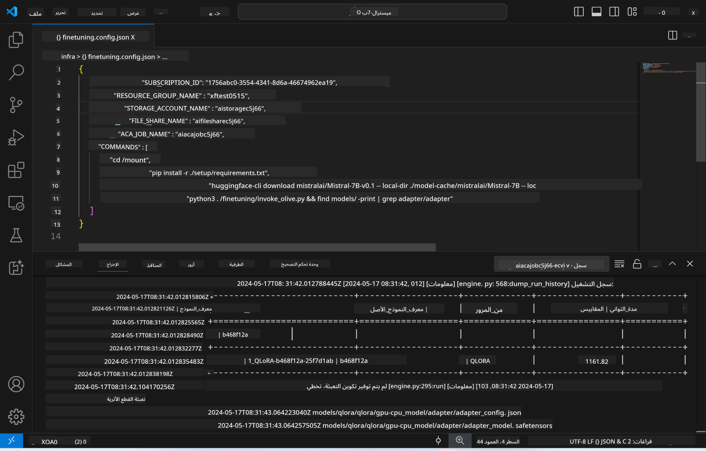

<!--
CO_OP_TRANSLATOR_METADATA:
{
  "original_hash": "a54cd3d65b6963e4e8ce21e143c3ab04",
  "translation_date": "2025-05-07T10:45:18+00:00",
  "source_file": "md/01.Introduction/03/Remote_Interence.md",
  "language_code": "ar"
}
-->
# الاستدلال عن بُعد باستخدام النموذج المُدرب بدقة

بعد تدريب المحولات في البيئة البعيدة، استخدم تطبيق Gradio بسيط للتفاعل مع النموذج.



### توفير موارد Azure  
تحتاج إلى إعداد موارد Azure للاستدلال عن بُعد عن طريق تنفيذ `AI Toolkit: Provision Azure Container Apps for inference` من لوحة الأوامر. خلال هذا الإعداد، سيُطلب منك اختيار اشتراك Azure ومجموعة الموارد الخاصة بك.  


بشكل افتراضي، يجب أن يتطابق الاشتراك ومجموعة الموارد للاستدلال مع تلك المستخدمة في التدريب الدقيق. سيستخدم الاستدلال نفس بيئة تطبيق حاويات Azure ويصل إلى النموذج ومحول النموذج المخزنين في ملفات Azure، والتي تم إنشاؤها أثناء خطوة التدريب الدقيق.

## استخدام مجموعة أدوات AI

### النشر للاستدلال  
إذا رغبت في تعديل كود الاستدلال أو إعادة تحميل نموذج الاستدلال، يرجى تنفيذ أمر `AI Toolkit: Deploy for inference`. هذا سيزامن أحدث كود لديك مع ACA ويعيد تشغيل النسخة.


بعد إتمام النشر بنجاح، يصبح النموذج جاهزًا للتقييم باستخدام نقطة النهاية هذه.

### الوصول إلى واجهة برمجة تطبيقات الاستدلال

يمكنك الوصول إلى واجهة برمجة تطبيقات الاستدلال بالنقر على زر "*الذهاب إلى نقطة نهاية الاستدلال*" المعروض في إشعار VSCode. بدلاً من ذلك، يمكن العثور على نقطة نهاية واجهة الويب تحت `ACA_APP_ENDPOINT` في `./infra/inference.config.json` وفي لوحة الإخراج.


> **ملاحظة:** قد تستغرق نقطة نهاية الاستدلال بضع دقائق لتصبح جاهزة للعمل بالكامل.

## مكونات الاستدلال المدرجة في القالب

| المجلد | المحتويات |
| ------ |--------- |
| `infra` | يحتوي على جميع التكوينات اللازمة للعمليات البعيدة. |
| `infra/provision/inference.parameters.json` | يحتوي على معلمات قوالب bicep، المستخدمة لتوفير موارد Azure للاستدلال. |
| `infra/provision/inference.bicep` | يحتوي على قوالب لتوفير موارد Azure للاستدلال. |
| `infra/inference.config.json` | ملف التكوين، الذي تم إنشاؤه بواسطة أمر `AI Toolkit: Provision Azure Container Apps for inference`. يُستخدم كمدخل لأوامر لوحة التحكم البعيدة الأخرى. |

### استخدام مجموعة أدوات AI لتكوين توفير موارد Azure  
قم بتكوين [مجموعة أدوات AI](https://marketplace.visualstudio.com/items?itemName=ms-windows-ai-studio.windows-ai-studio)

قم بتوفير تطبيقات حاويات Azure للاستدلال` command.

You can find configuration parameters in `./infra/provision/inference.parameters.json` file. Here are the details:
| Parameter | Description |
| --------- |------------ |
| `defaultCommands` | This is the commands to initiate a web API. |
| `maximumInstanceCount` | This parameter sets the maximum capacity of GPU instances. |
| `location` | This is the location where Azure resources are provisioned. The default value is the same as the chosen resource group's location. |
| `storageAccountName`, `fileShareName` `acaEnvironmentName`, `acaEnvironmentStorageName`, `acaAppName`,  `acaLogAnalyticsName` | These parameters are used to name the Azure resources for provision. By default, they will be same to the fine-tuning resource name. You can input a new, unused resource name to create your own custom-named resources, or you can input the name of an already existing Azure resource if you'd prefer to use that. For details, refer to the section [Using existing Azure Resources](../../../../../md/01.Introduction/03). |

### Using Existing Azure Resources

By default, the inference provision use the same Azure Container App Environment, Storage Account, Azure File Share, and Azure Log Analytics that were used for fine-tuning. A separate Azure Container App is created solely for the inference API. 

If you have customized the Azure resources during the fine-tuning step or want to use your own existing Azure resources for inference, specify their names in the `./infra/inference.parameters.json` ثم، شغّل أمر `AI Toolkit: Provision Azure Container Apps for inference` من لوحة الأوامر. هذا يقوم بتحديث أي موارد محددة وينشئ أي موارد مفقودة.

على سبيل المثال، إذا كان لديك بيئة حاويات Azure موجودة، يجب أن يبدو ملف `./infra/finetuning.parameters.json` كما يلي:

```json
{
    "$schema": "https://schema.management.azure.com/schemas/2019-04-01/deploymentParameters.json#",
    "contentVersion": "1.0.0.0",
    "parameters": {
      ...
      "acaEnvironmentName": {
        "value": "<your-aca-env-name>"
      },
      "acaEnvironmentStorageName": {
        "value": null
      },
      ...
    }
  }
```

### التوفير اليدوي  
إذا فضلت تكوين موارد Azure يدويًا، يمكنك استخدام ملفات bicep المقدمة في ملف `./infra/provision` folders. If you have already set up and configured all the Azure resources without using the AI Toolkit command palette, you can simply enter the resource names in the `inference.config.json`.

على سبيل المثال:

```json
{
  "SUBSCRIPTION_ID": "<your-subscription-id>",
  "RESOURCE_GROUP_NAME": "<your-resource-group-name>",
  "STORAGE_ACCOUNT_NAME": "<your-storage-account-name>",
  "FILE_SHARE_NAME": "<your-file-share-name>",
  "ACA_APP_NAME": "<your-aca-name>",
  "ACA_APP_ENDPOINT": "<your-aca-endpoint>"
}
```

**إخلاء المسؤولية**:  
تمت ترجمة هذا المستند باستخدام خدمة الترجمة الآلية [Co-op Translator](https://github.com/Azure/co-op-translator). بينما نسعى لتحقيق الدقة، يرجى العلم أن الترجمات الآلية قد تحتوي على أخطاء أو عدم دقة. يجب اعتبار المستند الأصلي بلغته الأصلية المصدر الموثوق به. بالنسبة للمعلومات الهامة، يُنصح بالترجمة المهنية البشرية. نحن غير مسؤولين عن أي سوء فهم أو تفسير خاطئ ناتج عن استخدام هذه الترجمة.