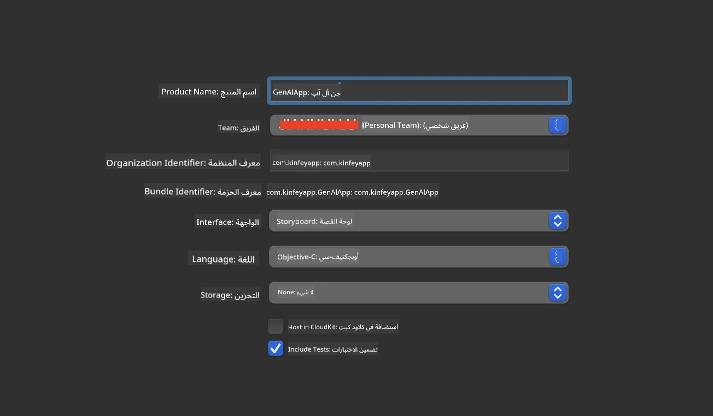
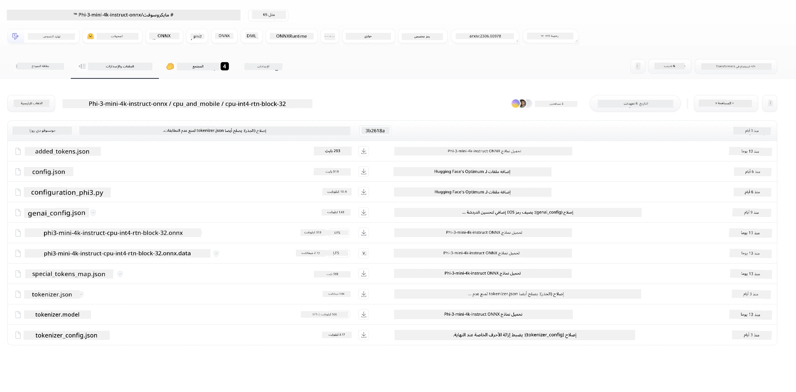
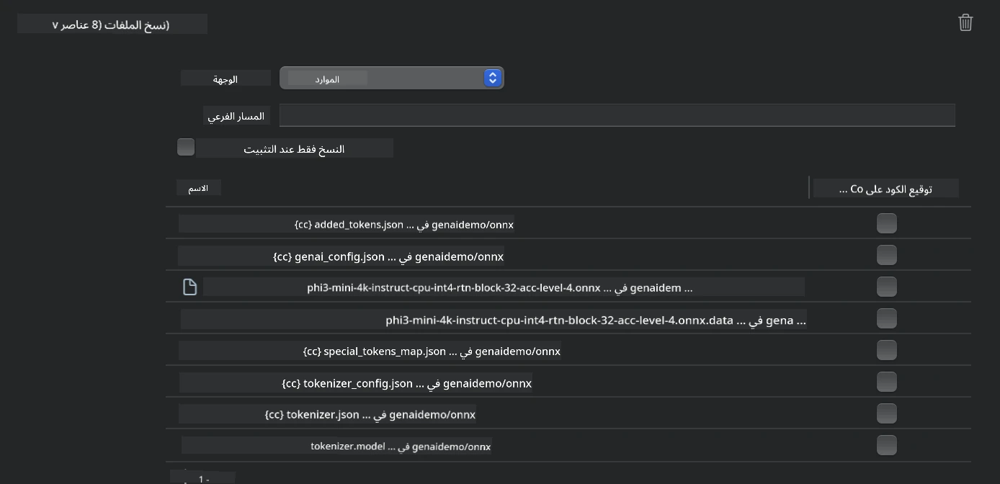
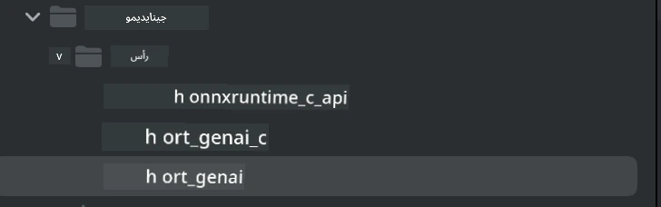
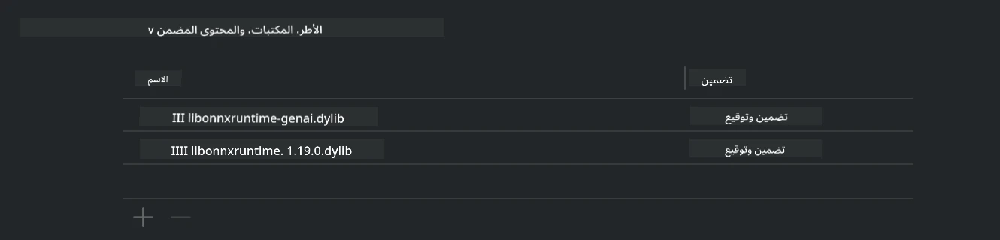
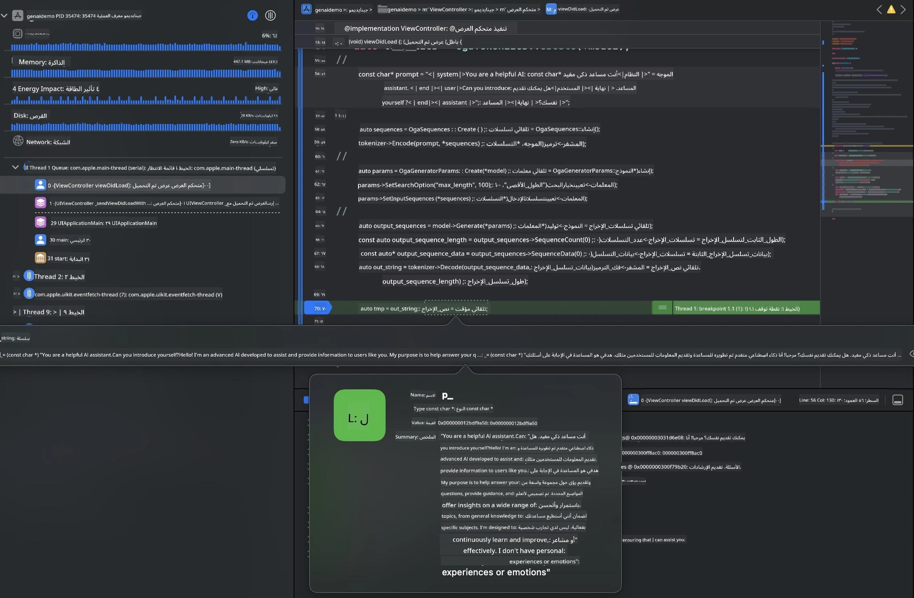

<!--
CO_OP_TRANSLATOR_METADATA:
{
  "original_hash": "82af197df38d25346a98f1f0e84d1698",
  "translation_date": "2025-07-16T20:17:57+00:00",
  "source_file": "md/01.Introduction/03/iOS_Inference.md",
  "language_code": "ar"
}
-->
# **تشغيل Phi-3 على iOS**

Phi-3-mini هي سلسلة جديدة من النماذج من مايكروسوفت تتيح نشر نماذج اللغة الكبيرة (LLMs) على أجهزة الحافة وأجهزة إنترنت الأشياء. تتوفر Phi-3-mini لأنظمة iOS وAndroid وأجهزة الحافة، مما يسمح بنشر الذكاء الاصطناعي التوليدي في بيئات BYOD. المثال التالي يوضح كيفية نشر Phi-3-mini على iOS.

## **1. التحضير**

- **أ.** macOS 14+
- **ب.** Xcode 15+
- **ج.** iOS SDK 17.x (iPhone 14 A16 أو أحدث)
- **د.** تثبيت Python 3.10+ (يوصى باستخدام Conda)
- **هـ.** تثبيت مكتبة Python: `python-flatbuffers`
- **و.** تثبيت CMake

### Semantic Kernel وعمليات الاستدلال

Semantic Kernel هو إطار عمل للتطبيقات يتيح لك إنشاء تطبيقات متوافقة مع Azure OpenAI Service، ونماذج OpenAI، وحتى النماذج المحلية. الوصول إلى الخدمات المحلية عبر Semantic Kernel يسهل التكامل مع خادم نموذج Phi-3-mini المستضاف ذاتيًا.

### استدعاء النماذج المكممة باستخدام Ollama أو LlamaEdge

يفضل العديد من المستخدمين استخدام النماذج المكممة لتشغيل النماذج محليًا. [Ollama](https://ollama.com) و [LlamaEdge](https://llamaedge.com) يتيحان للمستخدمين استدعاء نماذج مكممة مختلفة:

#### **Ollama**

يمكنك تشغيل `ollama run phi3` مباشرة أو تكوينه للعمل بدون اتصال. أنشئ ملف Modelfile مع مسار ملف `gguf` الخاص بك. مثال على كود تشغيل نموذج Phi-3-mini المكمم:

```gguf
FROM {Add your gguf file path}
TEMPLATE \"\"\"<|user|> .Prompt<|end|> <|assistant|>\"\"\"
PARAMETER stop <|end|>
PARAMETER num_ctx 4096
```

#### **LlamaEdge**

إذا كنت ترغب في استخدام `gguf` على السحابة وأجهزة الحافة في نفس الوقت، فإن LlamaEdge خيار ممتاز.

## **2. تجميع ONNX Runtime لنظام iOS**

```bash

git clone https://github.com/microsoft/onnxruntime.git

cd onnxruntime

./build.sh --build_shared_lib --ios --skip_tests --parallel --build_dir ./build_ios --ios --apple_sysroot iphoneos --osx_arch arm64 --apple_deploy_target 17.5 --cmake_generator Xcode --config Release

cd ../

```

### **ملاحظة**

- **أ.** قبل التجميع، تأكد من إعداد Xcode بشكل صحيح وتعيينه كدليل المطور النشط في الطرفية:

    ```bash
    sudo xcode-select -switch /Applications/Xcode.app/Contents/Developer
    ```

- **ب.** يجب تجميع ONNX Runtime لأنظمة مختلفة. بالنسبة لـ iOS، يمكنك التجميع لـ `arm64` أو `x86_64`.

- **ج.** يُفضل استخدام أحدث إصدار من iOS SDK للتجميع، لكن يمكنك استخدام إصدار أقدم إذا كنت بحاجة إلى التوافق مع SDKs سابقة.

## **3. تجميع الذكاء الاصطناعي التوليدي مع ONNX Runtime لنظام iOS**

> **ملاحظة:** نظرًا لأن الذكاء الاصطناعي التوليدي مع ONNX Runtime في مرحلة المعاينة، يرجى الانتباه لاحتمالية حدوث تغييرات.

```bash

git clone https://github.com/microsoft/onnxruntime-genai
 
cd onnxruntime-genai
 
mkdir ort
 
cd ort
 
mkdir include
 
mkdir lib
 
cd ../
 
cp ../onnxruntime/include/onnxruntime/core/session/onnxruntime_c_api.h ort/include
 
cp ../onnxruntime/build_ios/Release/Release-iphoneos/libonnxruntime*.dylib* ort/lib
 
export OPENCV_SKIP_XCODEBUILD_FORCE_TRYCOMPILE_DEBUG=1
 
python3 build.py --parallel --build_dir ./build_ios --ios --ios_sysroot iphoneos --ios_arch arm64 --ios_deployment_target 17.5 --cmake_generator Xcode --cmake_extra_defines CMAKE_XCODE_ATTRIBUTE_CODE_SIGNING_ALLOWED=NO

```

## **4. إنشاء تطبيق App في Xcode**

اخترت Objective-C كطريقة لتطوير التطبيق، لأن استخدام الذكاء الاصطناعي التوليدي مع ONNX Runtime API الخاص بـ C++ يتوافق بشكل أفضل مع Objective-C. بالطبع، يمكنك أيضًا إتمام الاستدعاءات ذات الصلة عبر جسر Swift.



## **5. نسخ نموذج ONNX المكمم INT4 إلى مشروع تطبيق App**

نحتاج إلى استيراد نموذج الكمّية INT4 بصيغة ONNX، والذي يجب تنزيله أولاً.



بعد التنزيل، يجب إضافته إلى مجلد Resources في المشروع داخل Xcode.



## **6. إضافة API الخاص بـ C++ في ViewControllers**

> **ملاحظة:**

- **أ.** أضف ملفات الرأس الخاصة بـ C++ المناسبة إلى المشروع.

  

- **ب.** أدرج مكتبة `onnxruntime-genai` الديناميكية في Xcode.

  

- **ج.** استخدم كود عينات C للاختبار. يمكنك أيضًا إضافة ميزات إضافية مثل ChatUI لمزيد من الوظائف.

- **د.** نظرًا لأنك بحاجة لاستخدام C++ في مشروعك، قم بإعادة تسمية `ViewController.m` إلى `ViewController.mm` لتمكين دعم Objective-C++.

```objc

    NSString *llmPath = [[NSBundle mainBundle] resourcePath];
    char const *modelPath = llmPath.cString;

    auto model =  OgaModel::Create(modelPath);

    auto tokenizer = OgaTokenizer::Create(*model);

    const char* prompt = "<|system|>You are a helpful AI assistant.<|end|><|user|>Can you introduce yourself?<|end|><|assistant|>";

    auto sequences = OgaSequences::Create();
    tokenizer->Encode(prompt, *sequences);

    auto params = OgaGeneratorParams::Create(*model);
    params->SetSearchOption("max_length", 100);
    params->SetInputSequences(*sequences);

    auto output_sequences = model->Generate(*params);
    const auto output_sequence_length = output_sequences->SequenceCount(0);
    const auto* output_sequence_data = output_sequences->SequenceData(0);
    auto out_string = tokenizer->Decode(output_sequence_data, output_sequence_length);
    
    auto tmp = out_string;

```

## **7. تشغيل التطبيق**

بمجرد الانتهاء من الإعداد، يمكنك تشغيل التطبيق لرؤية نتائج استدلال نموذج Phi-3-mini.



لمزيد من أكواد العينات والتعليمات التفصيلية، قم بزيارة [مستودع عينات Phi-3 Mini](https://github.com/Azure-Samples/Phi-3MiniSamples/tree/main/ios).

**إخلاء المسؤولية**:  
تمت ترجمة هذا المستند باستخدام خدمة الترجمة الآلية [Co-op Translator](https://github.com/Azure/co-op-translator). بينما نسعى لتحقيق الدقة، يرجى العلم أن الترجمات الآلية قد تحتوي على أخطاء أو عدم دقة. يجب اعتبار المستند الأصلي بلغته الأصلية المصدر الموثوق به. للمعلومات الهامة، يُنصح بالاعتماد على الترجمة البشرية المهنية. نحن غير مسؤولين عن أي سوء فهم أو تفسير ناتج عن استخدام هذه الترجمة.