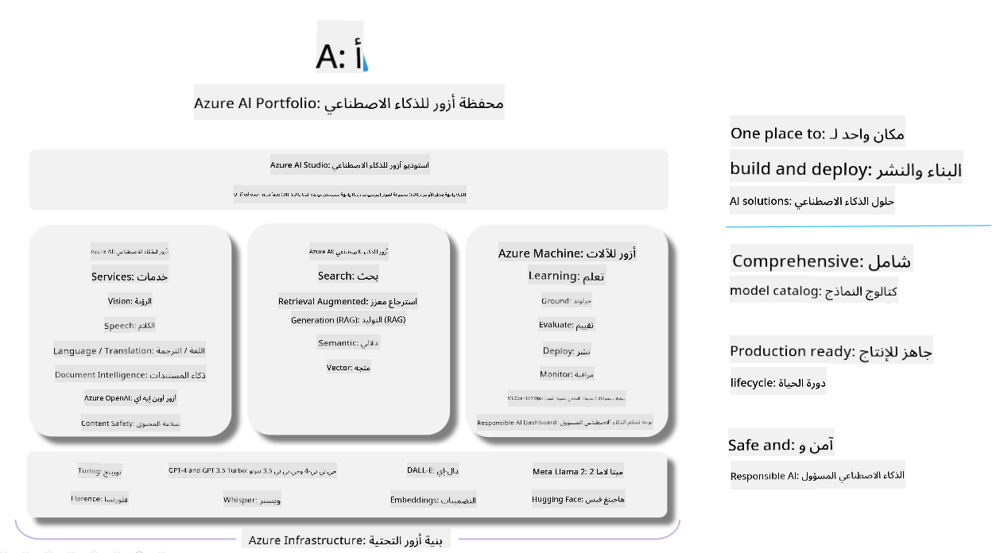

<!--
CO_OP_TRANSLATOR_METADATA:
{
  "original_hash": "7b4235159486df4000e16b7b46ddfec3",
  "translation_date": "2025-05-07T10:36:28+00:00",
  "source_file": "md/01.Introduction/05/AIFoundry.md",
  "language_code": "ar"
}
-->
# **استخدام Azure AI Foundry للتقييم**

كيفية تقييم تطبيق الذكاء الاصطناعي التوليدي الخاص بك باستخدام [Azure AI Foundry](https://ai.azure.com?WT.mc_id=aiml-138114-kinfeylo). سواء كنت تقوم بتقييم محادثات ذات جولة واحدة أو متعددة الجولات، يوفر Azure AI Foundry أدوات لتقييم أداء النموذج وسلامته.

## كيفية تقييم تطبيقات الذكاء الاصطناعي التوليدي باستخدام Azure AI Foundry
للحصول على تعليمات أكثر تفصيلاً، راجع [توثيق Azure AI Foundry](https://learn.microsoft.com/azure/ai-studio/how-to/evaluate-generative-ai-app?WT.mc_id=aiml-138114-kinfeylo)

فيما يلي خطوات البدء:

## تقييم نماذج الذكاء الاصطناعي التوليدي في Azure AI Foundry

**المتطلبات الأساسية**

- مجموعة بيانات اختبار إما بصيغة CSV أو JSON.
- نموذج ذكاء اصطناعي توليدي منشور (مثل Phi-3، GPT 3.5، GPT 4، أو نماذج Davinci).
- بيئة تشغيل تحتوي على مثيل حوسبة لتشغيل التقييم.

## مقاييس التقييم المدمجة

يتيح Azure AI Foundry تقييم المحادثات ذات الجولة الواحدة والمعقدة متعددة الجولات.
بالنسبة لسيناريوهات الاسترجاع المعزز للتوليد (RAG)، حيث يكون النموذج مستندًا إلى بيانات محددة، يمكنك تقييم الأداء باستخدام مقاييس التقييم المدمجة.
بالإضافة إلى ذلك، يمكنك تقييم سيناريوهات الإجابة على الأسئلة ذات الجولة الواحدة العامة (غير RAG).

## إنشاء تشغيل تقييم

من واجهة Azure AI Foundry، انتقل إلى صفحة التقييم أو صفحة تدفق المطالبات.
اتبع معالج إنشاء التقييم لإعداد تشغيل تقييم. يمكنك تقديم اسم اختياري للتقييم الخاص بك.
اختر السيناريو الذي يتماشى مع أهداف تطبيقك.
حدد مقياس تقييم واحد أو أكثر لتقييم مخرجات النموذج.

## تدفق تقييم مخصص (اختياري)

للحصول على مرونة أكبر، يمكنك إنشاء تدفق تقييم مخصص. قم بتخصيص عملية التقييم بناءً على متطلباتك الخاصة.

## عرض النتائج

بعد تشغيل التقييم، قم بتسجيل وعرض وتحليل مقاييس التقييم التفصيلية في Azure AI Foundry. احصل على رؤى حول قدرات وقيود تطبيقك.

**Note** Azure AI Foundry متاح حاليًا في المعاينة العامة، لذا يُنصح باستخدامه لأغراض التجريب والتطوير. بالنسبة لأعباء العمل الإنتاجية، فكر في خيارات أخرى. استكشف [توثيق AI Foundry الرسمي](https://learn.microsoft.com/azure/ai-studio/?WT.mc_id=aiml-138114-kinfeylo) لمزيد من التفاصيل والتعليمات خطوة بخطوة.

**إخلاء المسؤولية**:  
تمت ترجمة هذا المستند باستخدام خدمة الترجمة الآلية [Co-op Translator](https://github.com/Azure/co-op-translator). بينما نسعى لتحقيق الدقة، يرجى العلم أن الترجمات الآلية قد تحتوي على أخطاء أو عدم دقة. يجب اعتبار المستند الأصلي بلغته الأصلية المصدر الموثوق به. بالنسبة للمعلومات الهامة، يُنصح بالترجمة الاحترافية من قبل مترجم بشري. نحن غير مسؤولين عن أي سوء فهم أو تفسير ناتج عن استخدام هذه الترجمة.