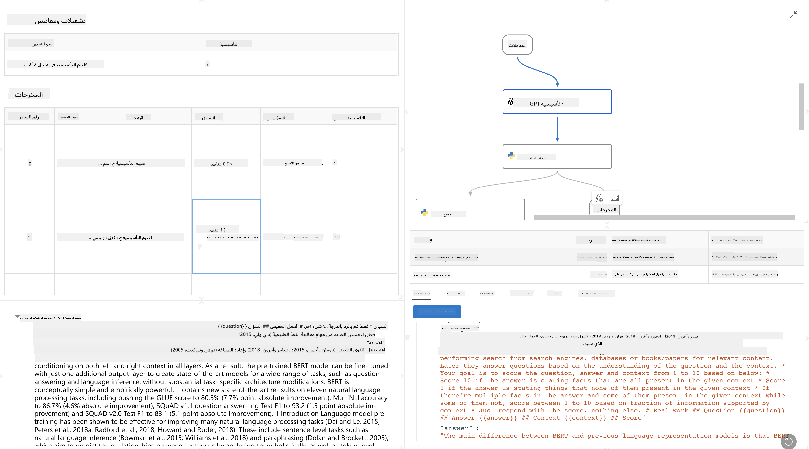

<!--
CO_OP_TRANSLATOR_METADATA:
{
  "original_hash": "3cbe7629d254f1043193b7fe22524d55",
  "translation_date": "2025-07-16T22:35:49+00:00",
  "source_file": "md/01.Introduction/05/Promptflow.md",
  "language_code": "ar"
}
-->
# **مقدمة عن Promptflow**

[Microsoft Prompt Flow](https://microsoft.github.io/promptflow/index.html?WT.mc_id=aiml-138114-kinfeylo) هو أداة مرئية لأتمتة سير العمل تتيح للمستخدمين إنشاء تدفقات عمل مؤتمتة باستخدام قوالب جاهزة وموصلات مخصصة. تم تصميمه لتمكين المطورين ومحللي الأعمال من بناء عمليات مؤتمتة بسرعة لمهام مثل إدارة البيانات، التعاون، وتحسين العمليات. مع Prompt Flow، يمكن للمستخدمين بسهولة ربط خدمات وتطبيقات وأنظمة مختلفة، وأتمتة العمليات التجارية المعقدة.

تم تصميم Microsoft Prompt Flow لتبسيط دورة تطوير تطبيقات الذكاء الاصطناعي المدعومة بنماذج اللغة الكبيرة (LLMs) من البداية للنهاية. سواء كنت في مرحلة التفكير، النمذجة الأولية، الاختبار، التقييم، أو النشر لتطبيقات تعتمد على LLM، فإن Prompt Flow يسهل العملية ويتيح لك بناء تطبيقات LLM بجودة إنتاجية.

## فيما يلي الميزات والفوائد الرئيسية لاستخدام Microsoft Prompt Flow:

**تجربة تأليف تفاعلية**

يوفر Prompt Flow تمثيلاً بصريًا لهياكل التدفق الخاصة بك، مما يسهل فهم مشاريعك والتنقل بينها.  
يقدم تجربة ترميز تشبه الدفتر لتطوير التدفقات وتصحيحها بكفاءة.

**تنويعات وضبط المطالبات**

أنشئ وقارن بين عدة تنويعات للمطالبات لتسهيل عملية تحسين تكرارية. قيّم أداء المطالبات المختلفة واختر الأكثر فاعلية.

**تدفقات تقييم مدمجة**  
قم بتقييم جودة وفعالية مطالباتك وتدفقاتك باستخدام أدوات التقييم المدمجة.  
افهم مدى أداء تطبيقاتك المعتمدة على LLM.

**موارد شاملة**

يحتوي Prompt Flow على مكتبة من الأدوات، العينات، والقوالب المدمجة. هذه الموارد تمثل نقطة انطلاق للتطوير، تلهم الإبداع، وتسّرع العملية.

**التعاون والاستعداد للمؤسسات**

يدعم التعاون الجماعي من خلال السماح لعدة مستخدمين بالعمل معًا على مشاريع هندسة المطالبات.  
يحافظ على التحكم في الإصدارات ويشارك المعرفة بفعالية. يبسط كامل عملية هندسة المطالبات، من التطوير والتقييم إلى النشر والمراقبة.

## التقييم في Prompt Flow

في Microsoft Prompt Flow، يلعب التقييم دورًا حيويًا في قياس مدى أداء نماذج الذكاء الاصطناعي الخاصة بك. دعونا نستعرض كيف يمكنك تخصيص تدفقات التقييم والمؤشرات داخل Prompt Flow:

**فهم التقييم في Prompt Flow**

في Prompt Flow، يمثل التدفق تسلسلًا من العقد التي تعالج المدخلات وتولد المخرجات. تدفقات التقييم هي نوع خاص من التدفقات مصممة لتقييم أداء التشغيل بناءً على معايير وأهداف محددة.

**الميزات الرئيسية لتدفقات التقييم**

عادةً ما تعمل بعد التدفق الذي يتم اختباره، باستخدام مخرجاته. تحسب درجات أو مؤشرات لقياس أداء التدفق المختبر. يمكن أن تشمل المؤشرات الدقة، درجات الصلة، أو أي مقاييس أخرى ذات صلة.

### تخصيص تدفقات التقييم

**تعريف المدخلات**

تحتاج تدفقات التقييم إلى استقبال مخرجات التشغيل الذي يتم اختباره. عرّف المدخلات بطريقة مشابهة للتدفقات العادية.  
على سبيل المثال، إذا كنت تقيم تدفق QnA، سمّ مدخلاً "answer". إذا كنت تقيم تدفق تصنيف، سمّ مدخلاً "category". قد تحتاج أيضًا إلى مدخلات الحقيقة الأرضية (مثل التسميات الفعلية).

**المخرجات والمؤشرات**

تنتج تدفقات التقييم نتائج تقيس أداء التدفق المختبر. يمكن حساب المؤشرات باستخدام Python أو LLM. استخدم الدالة log_metric() لتسجيل المؤشرات ذات الصلة.

**استخدام تدفقات التقييم المخصصة**

طوّر تدفق تقييم خاص بك يتناسب مع مهامك وأهدافك المحددة. خصص المؤشرات بناءً على أهداف التقييم الخاصة بك.  
طبق هذا التدفق المخصص على تشغيلات الدُفعات للاختبار على نطاق واسع.

## طرق التقييم المدمجة

يوفر Prompt Flow أيضًا طرق تقييم مدمجة.  
يمكنك تقديم تشغيلات دُفعات واستخدام هذه الطرق لتقييم مدى أداء تدفقك مع مجموعات بيانات كبيرة.  
اطلع على نتائج التقييم، قارن المؤشرات، وكرر حسب الحاجة.  
تذكر، التقييم ضروري لضمان أن نماذج الذكاء الاصطناعي الخاصة بك تلبي المعايير والأهداف المطلوبة. استكشف الوثائق الرسمية للحصول على تعليمات مفصلة حول تطوير واستخدام تدفقات التقييم في Microsoft Prompt Flow.

باختصار، يمكّن Microsoft Prompt Flow المطورين من إنشاء تطبيقات LLM عالية الجودة من خلال تبسيط هندسة المطالبات وتوفير بيئة تطوير قوية. إذا كنت تعمل مع LLMs، فإن Prompt Flow أداة قيمة تستحق الاستكشاف. استعرض [وثائق تقييم Prompt Flow](https://learn.microsoft.com/azure/machine-learning/prompt-flow/how-to-develop-an-evaluation-flow?view=azureml-api-2?WT.mc_id=aiml-138114-kinfeylo) للحصول على تعليمات مفصلة حول تطوير واستخدام تدفقات التقييم في Microsoft Prompt Flow.

**إخلاء المسؤولية**:  
تمت ترجمة هذا المستند باستخدام خدمة الترجمة الآلية [Co-op Translator](https://github.com/Azure/co-op-translator). بينما نسعى لتحقيق الدقة، يرجى العلم أن الترجمات الآلية قد تحتوي على أخطاء أو عدم دقة. يجب اعتبار المستند الأصلي بلغته الأصلية المصدر الموثوق به. للمعلومات الهامة، يُنصح بالاعتماد على الترجمة البشرية المهنية. نحن غير مسؤولين عن أي سوء فهم أو تفسير ناتج عن استخدام هذه الترجمة.