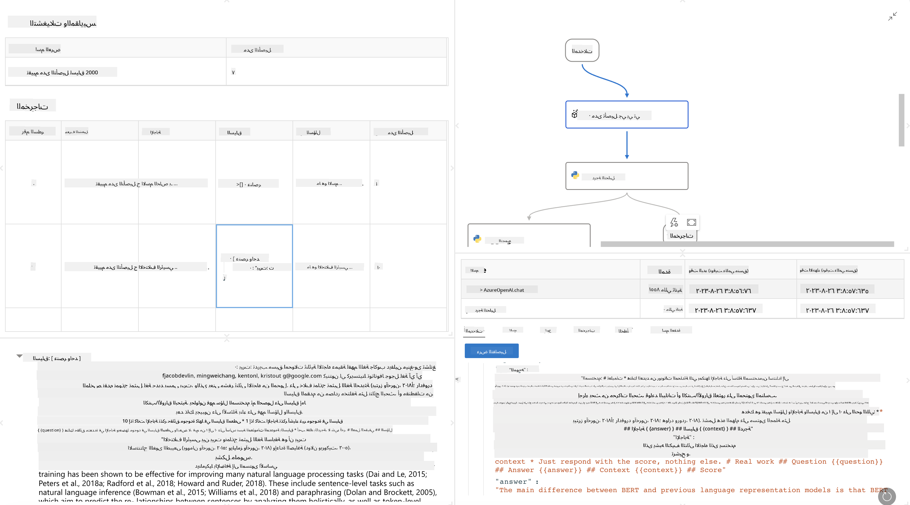

<!--
CO_OP_TRANSLATOR_METADATA:
{
  "original_hash": "3cbe7629d254f1043193b7fe22524d55",
  "translation_date": "2025-05-07T10:35:56+00:00",
  "source_file": "md/01.Introduction/05/Promptflow.md",
  "language_code": "ar"
}
-->
# **مقدمة عن Promptflow**

[Microsoft Prompt Flow](https://microsoft.github.io/promptflow/index.html?WT.mc_id=aiml-138114-kinfeylo) هو أداة تلقائية بصريّة لإنشاء تدفقات العمل تتيح للمستخدمين بناء تدفقات عمل مؤتمتة باستخدام قوالب معدة مسبقًا وموصلات مخصصة. تم تصميمه لتمكين المطورين ومحللي الأعمال من بناء عمليات مؤتمتة بسرعة لمهام مثل إدارة البيانات، التعاون، وتحسين العمليات. مع Prompt Flow، يمكن للمستخدمين بسهولة ربط خدمات وتطبيقات وأنظمة مختلفة، وأتمتة عمليات الأعمال المعقدة.

تم تصميم Microsoft Prompt Flow لتبسيط دورة تطوير تطبيقات الذكاء الاصطناعي المدعومة بنماذج اللغة الكبيرة (LLMs) من البداية إلى النهاية. سواء كنت تفكر في فكرة، أو تقوم بالنمذجة الأولية، أو الاختبار، أو التقييم، أو النشر لتطبيقات تعتمد على LLM، فإن Prompt Flow يبسط العملية ويتيح لك بناء تطبيقات LLM بجودة إنتاجية.

## فيما يلي الميزات والفوائد الرئيسية لاستخدام Microsoft Prompt Flow:

**تجربة تأليف تفاعلية**

يوفر Prompt Flow تمثيلاً بصريًا لهكيل التدفق الخاص بك، مما يسهل فهم مشاريعك والتنقل بينها.  
يقدم تجربة ترميز تشبه دفتر الملاحظات لتطوير التدفقات وتصحيحها بكفاءة.

**تنويعات الضبط والتحسين**

أنشئ وقارن بين عدة تنويعات من الطلبات لتسهيل عملية تحسين تدريجية. قيّم أداء الطلبات المختلفة واختر الأكثر فاعلية.

**تدفقات تقييم مدمجة**  
قيّم جودة وفعالية طلباتك وتدفقاتك باستخدام أدوات التقييم المدمجة.  
افهم مدى أداء تطبيقات LLM الخاصة بك.

**موارد شاملة**

يشتمل Prompt Flow على مكتبة من الأدوات، العينات، والقوالب المدمجة. هذه الموارد تُعد نقطة انطلاق للتطوير، وتلهم الإبداع، وتسرع العملية.

**التعاون وجاهزية المؤسسات**

يدعم التعاون بين الفرق من خلال السماح لعدة مستخدمين بالعمل معًا على مشاريع هندسة الطلبات.  
يحافظ على التحكم بالإصدارات ومشاركة المعرفة بفعالية. يبسط عملية هندسة الطلبات بأكملها، من التطوير والتقييم إلى النشر والمراقبة.

## التقييم في Prompt Flow

في Microsoft Prompt Flow، يلعب التقييم دورًا أساسيًا في قياس مدى أداء نماذج الذكاء الاصطناعي الخاصة بك. دعنا نستعرض كيف يمكنك تخصيص تدفقات التقييم والمؤشرات داخل Prompt Flow:

**فهم التقييم في Prompt Flow**

في Prompt Flow، يمثل التدفق تسلسلًا من العقد التي تعالج المدخلات وتولد المخرجات. تدفقات التقييم هي نوع خاص من التدفقات مصممة لتقييم أداء التشغيل بناءً على معايير وأهداف محددة.

**الميزات الرئيسية لتدفقات التقييم**

عادةً ما تعمل بعد التدفق الذي يتم اختباره، باستخدام مخرجاته. تحسب درجات أو مؤشرات لقياس أداء التدفق المختبر. يمكن أن تشمل المؤشرات الدقة، درجات الصلة، أو أي مقاييس ذات صلة أخرى.

### تخصيص تدفقات التقييم

**تعريف المدخلات**

تحتاج تدفقات التقييم إلى استلام مخرجات التشغيل الذي يتم اختباره. عرّف المدخلات بنفس طريقة التدفقات العادية.  
على سبيل المثال، إذا كنت تقيم تدفق سؤال وجواب، سمِّ مدخلاً "الإجابة". وإذا كنت تقيم تدفق تصنيف، سمِّ مدخلاً "الفئة". قد تكون مدخلات الحقيقة الأرضية (مثل التسميات الفعلية) ضرورية أيضًا.

**المخرجات والمؤشرات**

تنتج تدفقات التقييم نتائج تقيس أداء التدفق المختبر. يمكن حساب المؤشرات باستخدام Python أو LLM. استخدم دالة log_metric() لتسجيل المؤشرات ذات الصلة.

**استخدام تدفقات التقييم المخصصة**

طوّر تدفق تقييم خاص بك يتناسب مع مهامك وأهدافك المحددة. خصص المؤشرات بناءً على أهداف التقييم الخاصة بك.  
طبق هذا التدفق المخصص على عمليات تشغيل مجمعة للاختبار على نطاق واسع.

## طرق التقييم المدمجة

يوفر Prompt Flow أيضًا طرق تقييم مدمجة.  
يمكنك إرسال عمليات تشغيل مجمعة واستخدام هذه الطرق لتقييم مدى أداء تدفقك مع مجموعات بيانات كبيرة.  
عرض نتائج التقييم، مقارنة المؤشرات، والتكرار حسب الحاجة.  
تذكر أن التقييم ضروري لضمان تحقيق نماذج الذكاء الاصطناعي للمعايير والأهداف المرجوة. استكشف الوثائق الرسمية للحصول على تعليمات مفصلة حول تطوير واستخدام تدفقات التقييم في Microsoft Prompt Flow.

في الختام، يمكّن Microsoft Prompt Flow المطورين من إنشاء تطبيقات LLM عالية الجودة من خلال تبسيط هندسة الطلبات وتوفير بيئة تطوير قوية. إذا كنت تعمل مع LLMs، فإن Prompt Flow أداة قيّمة للاستكشاف. استعرض [وثائق تقييم Prompt Flow](https://learn.microsoft.com/azure/machine-learning/prompt-flow/how-to-develop-an-evaluation-flow?view=azureml-api-2?WT.mc_id=aiml-138114-kinfeylo) للحصول على تعليمات مفصلة حول تطوير واستخدام تدفقات التقييم في Microsoft Prompt Flow.

**تنويه**:  
تمت ترجمة هذا المستند باستخدام خدمة الترجمة الآلية [Co-op Translator](https://github.com/Azure/co-op-translator). بينما نسعى للدقة، يرجى العلم أن الترجمات الآلية قد تحتوي على أخطاء أو عدم دقة. يجب اعتبار المستند الأصلي بلغته الأصلية المصدر الرسمي والمعتمد. للمعلومات الهامة، يُنصح بالترجمة البشرية المهنية. نحن غير مسؤولين عن أي سوء فهم أو تفسير خاطئ ناتج عن استخدام هذه الترجمة.