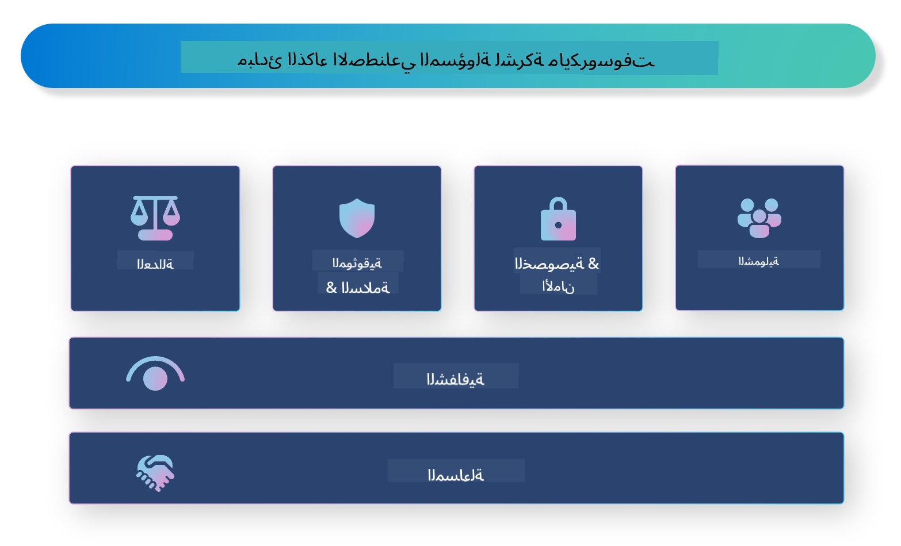

<!--
CO_OP_TRANSLATOR_METADATA:
{
  "original_hash": "805b96b20152936d8f4c587d90d6e06e",
  "translation_date": "2025-05-07T10:35:11+00:00",
  "source_file": "md/01.Introduction/05/ResponsibleAI.md",
  "language_code": "ar"
}
-->
# **مقدمة في الذكاء الاصطناعي المسؤول**

[Microsoft Responsible AI](https://www.microsoft.com/ai/responsible-ai?WT.mc_id=aiml-138114-kinfeylo) هي مبادرة تهدف إلى مساعدة المطورين والمنظمات في بناء أنظمة ذكاء اصطناعي شفافة، موثوقة، ومسؤولة. توفر المبادرة إرشادات وموارد لتطوير حلول ذكاء اصطناعي مسؤولة تتماشى مع المبادئ الأخلاقية مثل الخصوصية، العدالة، والشفافية. سنستعرض أيضًا بعض التحديات وأفضل الممارسات المرتبطة ببناء أنظمة ذكاء اصطناعي مسؤولة.

## نظرة عامة على Microsoft Responsible AI

**المبادئ الأخلاقية**

يرتكز Microsoft Responsible AI على مجموعة من المبادئ الأخلاقية مثل الخصوصية، العدالة، الشفافية، المساءلة، والسلامة. تهدف هذه المبادئ إلى ضمان تطوير أنظمة الذكاء الاصطناعي بطريقة أخلاقية ومسؤولة.

**الذكاء الاصطناعي الشفاف**

يؤكد Microsoft Responsible AI على أهمية الشفافية في أنظمة الذكاء الاصطناعي. يشمل ذلك تقديم تفسيرات واضحة لكيفية عمل نماذج الذكاء الاصطناعي، بالإضافة إلى ضمان توفر مصادر البيانات والخوارزميات للجمهور.

**الذكاء الاصطناعي المسؤول**

[Microsoft Responsible AI](https://www.microsoft.com/ai/responsible-ai?WT.mc_id=aiml-138114-kinfeylo) يشجع على تطوير أنظمة ذكاء اصطناعي مسؤولة قادرة على تقديم رؤى حول كيفية اتخاذ النماذج للقرارات. هذا يساعد المستخدمين على فهم نتائج أنظمة الذكاء الاصطناعي وبناء الثقة بها.

**الشمولية**

يجب تصميم أنظمة الذكاء الاصطناعي لتعود بالنفع على الجميع. تهدف Microsoft إلى إنشاء ذكاء اصطناعي شامل يأخذ بعين الاعتبار وجهات نظر متنوعة ويتجنب التحيز أو التمييز.

**الموثوقية والسلامة**

ضمان موثوقية وسلامة أنظمة الذكاء الاصطناعي أمر حيوي. تركز Microsoft على بناء نماذج قوية تعمل بشكل مستقر وتتجنب النتائج الضارة.

**العدالة في الذكاء الاصطناعي**

تعترف Microsoft Responsible AI بأن أنظمة الذكاء الاصطناعي قد تعزز التحيزات إذا تم تدريبها على بيانات أو خوارزميات متحيزة. توفر المبادرة إرشادات لتطوير أنظمة ذكاء اصطناعي عادلة لا تميز على أساس عوامل مثل العرق، الجنس، أو العمر.

**الخصوصية والأمان**

يؤكد Microsoft Responsible AI على أهمية حماية خصوصية المستخدم وأمن البيانات في أنظمة الذكاء الاصطناعي. يشمل ذلك تنفيذ تشفير قوي للبيانات وضوابط وصول، بالإضافة إلى إجراء تدقيقات منتظمة على أنظمة الذكاء الاصطناعي للكشف عن نقاط الضعف.

**المساءلة والمسؤولية**

يشجع Microsoft Responsible AI على المساءلة والمسؤولية في تطوير ونشر الذكاء الاصطناعي. يتضمن ذلك ضمان وعي المطورين والمنظمات بالمخاطر المحتملة المرتبطة بأنظمة الذكاء الاصطناعي واتخاذ خطوات لتخفيف هذه المخاطر.

## أفضل الممارسات لبناء أنظمة ذكاء اصطناعي مسؤولة

**تطوير نماذج ذكاء اصطناعي باستخدام مجموعات بيانات متنوعة**

لتجنب التحيز في أنظمة الذكاء الاصطناعي، من المهم استخدام مجموعات بيانات متنوعة تمثل نطاقًا واسعًا من وجهات النظر والتجارب.

**استخدام تقنيات الذكاء الاصطناعي القابلة للتفسير**

تساعد تقنيات الذكاء الاصطناعي القابلة للتفسير المستخدمين على فهم كيفية اتخاذ النماذج للقرارات، مما يعزز الثقة في النظام.

**إجراء تدقيقات منتظمة على أنظمة الذكاء الاصطناعي للكشف عن نقاط الضعف**

تساعد التدقيقات المنتظمة لأنظمة الذكاء الاصطناعي في تحديد المخاطر ونقاط الضعف التي تحتاج إلى معالجة.

**تنفيذ تشفير قوي للبيانات وضوابط الوصول**

يساعد تشفير البيانات وضوابط الوصول في حماية خصوصية المستخدم وأمنه في أنظمة الذكاء الاصطناعي.

**اتباع المبادئ الأخلاقية في تطوير الذكاء الاصطناعي**

اتباع المبادئ الأخلاقية مثل العدالة، الشفافية، والمساءلة يعزز الثقة في أنظمة الذكاء الاصطناعي ويضمن تطويرها بطريقة مسؤولة.

## استخدام AI Foundry للذكاء الاصطناعي المسؤول

[Azure AI Foundry](https://ai.azure.com?WT.mc_id=aiml-138114-kinfeylo) هو منصة قوية تتيح للمطورين والمنظمات إنشاء تطبيقات ذكية ومتطورة وجاهزة للسوق بسرعة وبمسؤولية. فيما يلي بعض الميزات والقدرات الرئيسية لـ Azure AI Foundry:

**واجهات برمجة التطبيقات والنماذج الجاهزة**

يوفر Azure AI Foundry واجهات برمجة تطبيقات ونماذج جاهزة وقابلة للتخصيص. تغطي هذه مجموعة واسعة من مهام الذكاء الاصطناعي، بما في ذلك الذكاء الاصطناعي التوليدي، معالجة اللغة الطبيعية للمحادثات، البحث، المراقبة، الترجمة، الصوت، الرؤية، واتخاذ القرار.

**تدفق المحفزات (Prompt Flow)**

يتيح تدفق المحفزات في Azure AI Foundry إنشاء تجارب ذكاء اصطناعي محادثية. يسمح لك بتصميم وإدارة تدفقات المحادثات، مما يسهل بناء روبوتات الدردشة، المساعدين الافتراضيين، وتطبيقات تفاعلية أخرى.

**التوليد المعزز بالاسترجاع (RAG)**

تقنية RAG تجمع بين النهج المعتمد على الاسترجاع والنهج التوليدي. تعزز جودة الاستجابات المولدة من خلال الاستفادة من المعرفة الموجودة مسبقًا (الاسترجاع) والإبداع في التوليد (التوليد).

**مقاييس التقييم والمراقبة للذكاء الاصطناعي التوليدي**

يوفر Azure AI Foundry أدوات لتقييم ومراقبة نماذج الذكاء الاصطناعي التوليدي. يمكنك تقييم أدائها، عدالتها، وغيرها من المقاييس المهمة لضمان النشر المسؤول. بالإضافة إلى ذلك، إذا قمت بإنشاء لوحة تحكم، يمكنك استخدام واجهة المستخدم بدون كود في Azure Machine Learning Studio لتخصيص وإنشاء لوحة تحكم Responsible AI وبطاقة تقييم مرتبطة بناءً على [Repsonsible AI Toolbox](https://responsibleaitoolbox.ai/?WT.mc_id=aiml-138114-kinfeylo) مكتبات Python. تساعد هذه البطاقة في مشاركة الرؤى الرئيسية المتعلقة بالعدالة، أهمية الميزات، واعتبارات النشر المسؤول مع أصحاب المصلحة الفنيين وغير الفنيين.

لاستخدام AI Foundry مع الذكاء الاصطناعي المسؤول، يمكنك اتباع أفضل الممارسات التالية:

**تحديد المشكلة وأهداف نظام الذكاء الاصطناعي**

قبل بدء عملية التطوير، من المهم تحديد المشكلة أو الهدف الذي يسعى نظام الذكاء الاصطناعي لحله بوضوح. سيساعدك ذلك في تحديد البيانات، الخوارزميات، والموارد اللازمة لبناء نموذج فعال.

**جمع ومعالجة البيانات ذات الصلة**

جودة وكمية البيانات المستخدمة في تدريب نظام الذكاء الاصطناعي تؤثر بشكل كبير على أدائه. لذلك، من المهم جمع بيانات ذات صلة، تنظيفها، معالجتها مسبقًا، والتأكد من تمثيلها للسكان أو المشكلة التي تحاول حلها.

**اختيار التقييم المناسب**

تتوفر خوارزميات تقييم متعددة. من المهم اختيار الخوارزمية الأنسب بناءً على بياناتك والمشكلة المطروحة.

**تقييم وتفسير النموذج**

بعد بناء نموذج ذكاء اصطناعي، من المهم تقييم أدائه باستخدام مقاييس مناسبة وتفسير النتائج بشفافية. سيساعدك ذلك في تحديد أي تحيزات أو قيود في النموذج وإجراء التحسينات اللازمة.

**ضمان الشفافية وقابلية التفسير**

يجب أن تكون أنظمة الذكاء الاصطناعي شفافة وقابلة للتفسير حتى يتمكن المستخدمون من فهم كيفية عملها وكيف تُتخذ القرارات. هذا مهم بشكل خاص للتطبيقات التي تؤثر بشكل كبير على حياة البشر، مثل الرعاية الصحية، المالية، والأنظمة القانونية.

**مراقبة وتحديث النموذج**

يجب مراقبة أنظمة الذكاء الاصطناعي باستمرار وتحديثها لضمان بقائها دقيقة وفعالة مع مرور الوقت. يتطلب ذلك صيانة مستمرة، اختبار، وإعادة تدريب للنموذج.

في الختام، Microsoft Responsible AI هي مبادرة تهدف إلى مساعدة المطورين والمنظمات في بناء أنظمة ذكاء اصطناعي شفافة، موثوقة، ومسؤولة. تذكر أن تنفيذ الذكاء الاصطناعي المسؤول أمر بالغ الأهمية، وAzure AI Foundry يسعى لجعله عمليًا للمنظمات. باتباع المبادئ الأخلاقية وأفضل الممارسات، يمكننا ضمان تطوير ونشر أنظمة الذكاء الاصطناعي بطريقة مسؤولة تعود بالنفع على المجتمع ككل.

**إخلاء مسؤولية**:  
تمت ترجمة هذا المستند باستخدام خدمة الترجمة الآلية [Co-op Translator](https://github.com/Azure/co-op-translator). بينما نسعى لتحقيق الدقة، يرجى العلم أن الترجمات الآلية قد تحتوي على أخطاء أو عدم دقة. يجب اعتبار المستند الأصلي بلغته الأصلية المصدر الرسمي والمعتمد. للمعلومات الهامة، يُنصح بالاعتماد على الترجمة الاحترافية البشرية. نحن غير مسؤولين عن أي سوء فهم أو تفسير ناتج عن استخدام هذه الترجمة.