<!--
CO_OP_TRANSLATOR_METADATA:
{
  "original_hash": "80a853c08e4ee25ef9b4bfcedd8990da",
  "translation_date": "2025-07-16T23:13:10+00:00",
  "source_file": "md/02.Application/01.TextAndChat/Phi3/E2E_Phi-3-Evaluation_AIFoundry.md",
  "language_code": "ar"
}
-->
# تقييم نموذج Phi-3 / Phi-3.5 المُحسّن في Azure AI Foundry مع التركيز على مبادئ الذكاء الاصطناعي المسؤول من مايكروسوفت

يعتمد هذا المثال الشامل (E2E) على الدليل "[تقييم نماذج Phi-3 / 3.5 المُحسّنة في Azure AI Foundry مع التركيز على الذكاء الاصطناعي المسؤول من مايكروسوفت](https://techcommunity.microsoft.com/blog/educatordeveloperblog/evaluate-fine-tuned-phi-3--3-5-models-in-azure-ai-studio-focusing-on-microsofts-/4227850?WT.mc_id=aiml-137032-kinfeylo)" من مجتمع مايكروسوفت التقني.

## نظرة عامة

### كيف يمكنك تقييم سلامة وأداء نموذج Phi-3 / Phi-3.5 المُحسّن في Azure AI Foundry؟

قد يؤدي تحسين النموذج أحيانًا إلى استجابات غير مقصودة أو غير مرغوبة. لضمان بقاء النموذج آمنًا وفعّالًا، من المهم تقييم احتمالية توليد محتوى ضار وقدرته على إنتاج استجابات دقيقة وذات صلة ومتسقة. في هذا الدرس، ستتعلم كيفية تقييم سلامة وأداء نموذج Phi-3 / Phi-3.5 المُحسّن والمُدمج مع Prompt flow في Azure AI Foundry.

فيما يلي عملية التقييم في Azure AI Foundry.

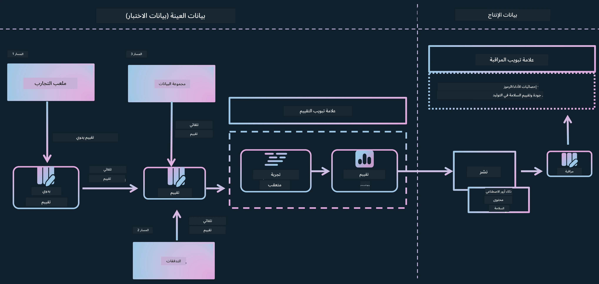

*مصدر الصورة: [تقييم تطبيقات الذكاء الاصطناعي التوليدي](https://learn.microsoft.com/azure/ai-studio/concepts/evaluation-approach-gen-ai?wt.mc_id%3Dstudentamb_279723)*

> [!NOTE]
>
> لمزيد من المعلومات التفصيلية واستكشاف موارد إضافية حول Phi-3 / Phi-3.5، يرجى زيارة [Phi-3CookBook](https://github.com/microsoft/Phi-3CookBook?wt.mc_id=studentamb_279723).

### المتطلبات الأساسية

- [Python](https://www.python.org/downloads)
- [اشتراك Azure](https://azure.microsoft.com/free?wt.mc_id=studentamb_279723)
- [Visual Studio Code](https://code.visualstudio.com)
- نموذج Phi-3 / Phi-3.5 مُحسّن

### جدول المحتويات

1. [**السيناريو 1: مقدمة لتقييم Prompt flow في Azure AI Foundry**](../../../../../../md/02.Application/01.TextAndChat/Phi3)

    - [مقدمة لتقييم السلامة](../../../../../../md/02.Application/01.TextAndChat/Phi3)
    - [مقدمة لتقييم الأداء](../../../../../../md/02.Application/01.TextAndChat/Phi3)

1. [**السيناريو 2: تقييم نموذج Phi-3 / Phi-3.5 في Azure AI Foundry**](../../../../../../md/02.Application/01.TextAndChat/Phi3)

    - [قبل أن تبدأ](../../../../../../md/02.Application/01.TextAndChat/Phi3)
    - [نشر Azure OpenAI لتقييم نموذج Phi-3 / Phi-3.5](../../../../../../md/02.Application/01.TextAndChat/Phi3)
    - [تقييم نموذج Phi-3 / Phi-3.5 المُحسّن باستخدام تقييم Prompt flow في Azure AI Foundry](../../../../../../md/02.Application/01.TextAndChat/Phi3)

1. [تهانينا!](../../../../../../md/02.Application/01.TextAndChat/Phi3)

## **السيناريو 1: مقدمة لتقييم Prompt flow في Azure AI Foundry**

### مقدمة لتقييم السلامة

لضمان أن نموذج الذكاء الاصطناعي الخاص بك أخلاقي وآمن، من الضروري تقييمه وفقًا لمبادئ الذكاء الاصطناعي المسؤول من مايكروسوفت. في Azure AI Foundry، تتيح لك تقييمات السلامة فحص مدى تعرض نموذجك لهجمات كسر الحماية (jailbreak) وإمكانية توليده لمحتوى ضار، وهو ما يتماشى مباشرة مع هذه المبادئ.


*مصدر الصورة: [تقييم تطبيقات الذكاء الاصطناعي التوليدي](https://learn.microsoft.com/azure/ai-studio/concepts/evaluation-approach-gen-ai?wt.mc_id%3Dstudentamb_279723)*

#### مبادئ الذكاء الاصطناعي المسؤول من مايكروسوفت

قبل البدء بالخطوات التقنية، من الضروري فهم مبادئ الذكاء الاصطناعي المسؤول من مايكروسوفت، وهو إطار أخلاقي يهدف إلى توجيه التطوير المسؤول، والنشر، وتشغيل أنظمة الذكاء الاصطناعي. توجه هذه المبادئ تصميم وتطوير ونشر أنظمة الذكاء الاصطناعي بشكل مسؤول، لضمان بناء تقنيات الذكاء الاصطناعي بطريقة عادلة، شفافة، وشاملة. تشكل هذه المبادئ الأساس لتقييم سلامة نماذج الذكاء الاصطناعي.

تشمل مبادئ الذكاء الاصطناعي المسؤول من مايكروسوفت:

- **العدالة والشمولية**: يجب أن تعامل أنظمة الذكاء الاصطناعي الجميع بعدل وتتجنب التأثير بشكل مختلف على مجموعات متشابهة من الناس. على سبيل المثال، عند تقديم أنظمة الذكاء الاصطناعي إرشادات حول العلاج الطبي، طلبات القروض، أو التوظيف، يجب أن تقدم نفس التوصيات لكل من لديه أعراض، ظروف مالية، أو مؤهلات مهنية مماثلة.

- **الموثوقية والسلامة**: لبناء الثقة، من الضروري أن تعمل أنظمة الذكاء الاصطناعي بشكل موثوق وآمن ومتسق. يجب أن تكون هذه الأنظمة قادرة على العمل كما صممت أصلاً، والاستجابة بأمان للظروف غير المتوقعة، ومقاومة التلاعب الضار. يعكس سلوكها وتنوع الظروف التي يمكنها التعامل معها مدى الحالات والظروف التي توقعها المطورون أثناء التصميم والاختبار.

- **الشفافية**: عندما تساعد أنظمة الذكاء الاصطناعي في اتخاذ قرارات تؤثر بشكل كبير على حياة الناس، من الضروري أن يفهم الناس كيف تم اتخاذ تلك القرارات. على سبيل المثال، قد يستخدم بنك نظام ذكاء اصطناعي لتحديد ما إذا كان الشخص مؤهلاً للحصول على ائتمان. قد تستخدم شركة نظام ذكاء اصطناعي لتحديد أكثر المرشحين تأهيلاً للتوظيف.

- **الخصوصية والأمان**: مع انتشار الذكاء الاصطناعي، أصبح حماية الخصوصية وتأمين المعلومات الشخصية والتجارية أكثر أهمية وتعقيدًا. مع الذكاء الاصطناعي، تتطلب الخصوصية وأمن البيانات اهتمامًا وثيقًا لأن الوصول إلى البيانات ضروري لأنظمة الذكاء الاصطناعي لتقديم تنبؤات وقرارات دقيقة ومستنيرة حول الأشخاص.

- **المساءلة**: يجب أن يكون الأشخاص الذين يصممون وينشرون أنظمة الذكاء الاصطناعي مسؤولين عن كيفية عمل أنظمتهم. يجب على المؤسسات الاستناد إلى معايير الصناعة لتطوير معايير المساءلة. يمكن لهذه المعايير ضمان ألا تكون أنظمة الذكاء الاصطناعي هي السلطة النهائية في أي قرار يؤثر على حياة الناس. كما يمكنها ضمان بقاء البشر مسيطرين بشكل فعّال على أنظمة الذكاء الاصطناعي ذات الاستقلالية العالية.

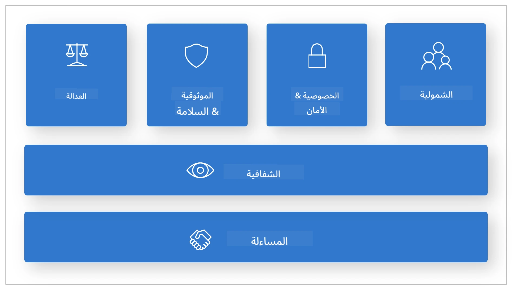

*مصدر الصورة: [ما هو الذكاء الاصطناعي المسؤول؟](https://learn.microsoft.com/azure/machine-learning/concept-responsible-ai?view=azureml-api-2&viewFallbackFrom=azureml-api-2%253fwt.mc_id%3Dstudentamb_279723)*

> [!NOTE]
> لمعرفة المزيد عن مبادئ الذكاء الاصطناعي المسؤول من مايكروسوفت، قم بزيارة [ما هو الذكاء الاصطناعي المسؤول؟](https://learn.microsoft.com/azure/machine-learning/concept-responsible-ai?view=azureml-api-2?wt.mc_id=studentamb_279723).

#### مقاييس السلامة

في هذا الدرس، ستقوم بتقييم سلامة نموذج Phi-3 المُحسّن باستخدام مقاييس السلامة في Azure AI Foundry. تساعدك هذه المقاييس على تقييم احتمالية توليد النموذج لمحتوى ضار ومدى تعرضه لهجمات كسر الحماية. تشمل مقاييس السلامة:

- **المحتوى المتعلق بإيذاء النفس**: يقيم ما إذا كان النموذج يميل إلى إنتاج محتوى متعلق بإيذاء النفس.
- **المحتوى الكريه وغير العادل**: يقيم ما إذا كان النموذج يميل إلى إنتاج محتوى كريه أو غير عادل.
- **المحتوى العنيف**: يقيم ما إذا كان النموذج يميل إلى إنتاج محتوى عنيف.
- **المحتوى الجنسي**: يقيم ما إذا كان النموذج يميل إلى إنتاج محتوى جنسي غير لائق.

يضمن تقييم هذه الجوانب ألا ينتج نموذج الذكاء الاصطناعي محتوى ضارًا أو مسيئًا، مما يجعله متوافقًا مع القيم المجتمعية والمعايير التنظيمية.


### مقدمة لتقييم الأداء

للتأكد من أن نموذج الذكاء الاصطناعي الخاص بك يعمل كما هو متوقع، من المهم تقييم أدائه مقابل مقاييس الأداء. في Azure AI Foundry، تتيح لك تقييمات الأداء فحص فعالية نموذجك في توليد استجابات دقيقة وذات صلة ومتسقة.


*مصدر الصورة: [تقييم تطبيقات الذكاء الاصطناعي التوليدي](https://learn.microsoft.com/azure/ai-studio/concepts/evaluation-approach-gen-ai?wt.mc_id%3Dstudentamb_279723)*

#### مقاييس الأداء

في هذا الدرس، ستقوم بتقييم أداء نموذج Phi-3 / Phi-3.5 المُحسّن باستخدام مقاييس الأداء في Azure AI Foundry. تساعدك هذه المقاييس على تقييم فعالية النموذج في توليد استجابات دقيقة وذات صلة ومتسقة. تشمل مقاييس الأداء:

- **الارتكاز على المصدر**: تقييم مدى توافق الإجابات المولدة مع المعلومات من المصدر المدخل.
- **الملاءمة**: تقييم مدى صلة الاستجابات المولدة بالأسئلة المطروحة.
- **التماسك**: تقييم مدى سلاسة تدفق النص المولد، وقراءته بشكل طبيعي، وشبهه بلغة الإنسان.
- **الطلاقة**: تقييم كفاءة اللغة في النص المولد.
- **التشابه مع GPT**: مقارنة الاستجابة المولدة مع الحقيقة الأرضية من حيث التشابه.
- **معدل F1**: حساب نسبة الكلمات المشتركة بين الاستجابة المولدة وبيانات المصدر.

تساعدك هذه المقاييس على تقييم فعالية النموذج في توليد استجابات دقيقة وذات صلة ومتسقة.

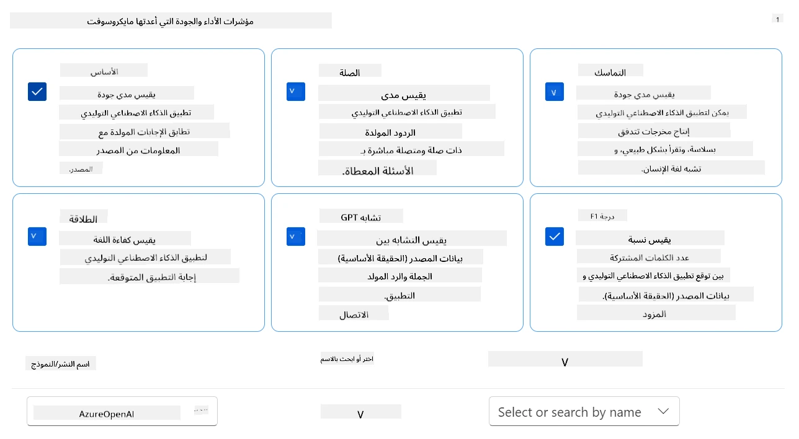

## **السيناريو 2: تقييم نموذج Phi-3 / Phi-3.5 في Azure AI Foundry**

### قبل أن تبدأ

هذا الدرس هو متابعة للمدونات السابقة، "[تحسين ودمج نماذج Phi-3 المخصصة مع Prompt Flow: دليل خطوة بخطوة](https://techcommunity.microsoft.com/t5/educator-developer-blog/fine-tune-and-integrate-custom-phi-3-models-with-prompt-flow/ba-p/4178612?wt.mc_id=studentamb_279723)" و "[تحسين ودمج نماذج Phi-3 المخصصة مع Prompt Flow في Azure AI Foundry](https://techcommunity.microsoft.com/t5/educator-developer-blog/fine-tune-and-integrate-custom-phi-3-models-with-prompt-flow-in/ba-p/4191726?wt.mc_id=studentamb_279723)." في هذه المشاركات، استعرضنا عملية تحسين نموذج Phi-3 / Phi-3.5 في Azure AI Foundry ودمجه مع Prompt flow.

في هذا الدرس، ستقوم بنشر نموذج Azure OpenAI كمُقيّم في Azure AI Foundry واستخدامه لتقييم نموذج Phi-3 / Phi-3.5 المُحسّن الخاص بك.

قبل أن تبدأ هذا الدرس، تأكد من توفر المتطلبات التالية كما هو موضح في الدروس السابقة:

1. مجموعة بيانات معدة لتقييم نموذج Phi-3 / Phi-3.5 المُحسّن.
1. نموذج Phi-3 / Phi-3.5 تم تحسينه ونشره في Azure Machine Learning.
1. Prompt flow مدمج مع نموذج Phi-3 / Phi-3.5 المُحسّن في Azure AI Foundry.

> [!NOTE]
> ستستخدم ملف *test_data.jsonl* الموجود في مجلد البيانات من مجموعة بيانات **ULTRACHAT_200k** التي تم تنزيلها في المدونات السابقة، كمجموعة بيانات لتقييم نموذج Phi-3 / Phi-3.5 المُحسّن.

#### دمج نموذج Phi-3 / Phi-3.5 المخصص مع Prompt flow في Azure AI Foundry (النهج القائم على الكود)
> [!NOTE]  
> إذا اتبعت النهج منخفض الكود الموضح في "[Fine-Tune and Integrate Custom Phi-3 Models with Prompt Flow in Azure AI Foundry](https://techcommunity.microsoft.com/t5/educator-developer-blog/fine-tune-and-integrate-custom-phi-3-models-with-prompt-flow-in/ba-p/4191726?wt.mc_id=studentamb_279723)"، يمكنك تخطي هذا التمرين والانتقال إلى التمرين التالي.  
> ومع ذلك، إذا اتبعت النهج القائم على الكود الموضح في "[Fine-Tune and Integrate Custom Phi-3 Models with Prompt Flow: Step-by-Step Guide](https://techcommunity.microsoft.com/t5/educator-developer-blog/fine-tune-and-integrate-custom-phi-3-models-with-prompt-flow/ba-p/4178612?wt.mc_id=studentamb_279723)" لضبط ونشر نموذج Phi-3 / Phi-3.5 الخاص بك، فإن عملية ربط النموذج بـ Prompt flow تختلف قليلاً. ستتعلم هذه العملية في هذا التمرين.
للمتابعة، تحتاج إلى دمج نموذج Phi-3 / Phi-3.5 المُحسّن الخاص بك في Prompt flow ضمن Azure AI Foundry.

#### إنشاء مركز Azure AI Foundry

يجب عليك إنشاء مركز قبل إنشاء المشروع. يعمل المركز كمجموعة موارد، مما يتيح لك تنظيم وإدارة عدة مشاريع داخل Azure AI Foundry.

1. سجّل الدخول إلى [Azure AI Foundry](https://ai.azure.com/?wt.mc_id=studentamb_279723).

1. اختر **All hubs** من القائمة الجانبية اليسرى.

1. اختر **+ New hub** من قائمة التنقل.

    

1. قم بالمهام التالية:

    - أدخل **Hub name**. يجب أن يكون اسمًا فريدًا.
    - اختر اشتراك Azure الخاص بك **Subscription**.
    - اختر **Resource group** التي تريد استخدامها (يمكنك إنشاء واحدة جديدة إذا لزم الأمر).
    - اختر **Location** التي تود استخدامها.
    - اختر **Connect Azure AI Services** التي تريد استخدامها (يمكنك إنشاء واحدة جديدة إذا لزم الأمر).
    - اختر **Connect Azure AI Search** ثم **Skip connecting**.

    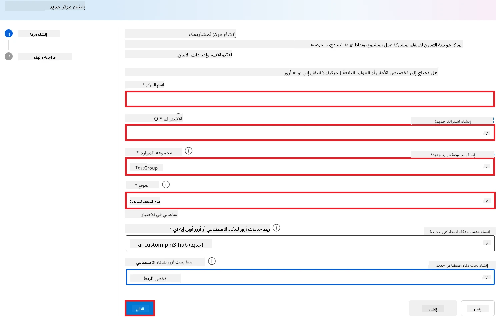

1. اختر **Next**.

#### إنشاء مشروع Azure AI Foundry

1. في المركز الذي أنشأته، اختر **All projects** من القائمة الجانبية اليسرى.

1. اختر **+ New project** من قائمة التنقل.

    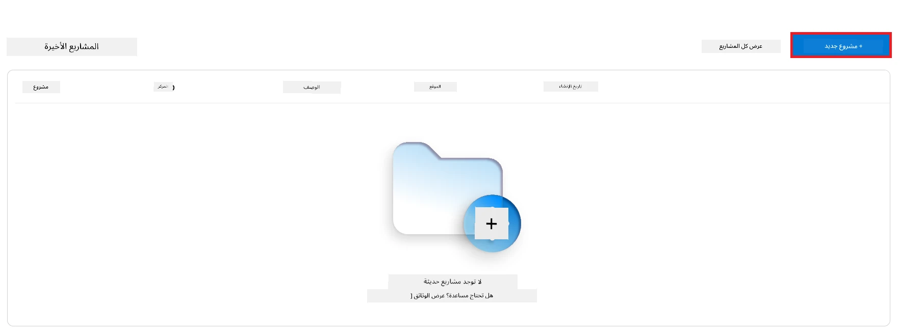

1. أدخل **Project name**. يجب أن يكون اسمًا فريدًا.

    

1. اختر **Create a project**.

#### إضافة اتصال مخصص لنموذج Phi-3 / Phi-3.5 المُحسّن

لدمج نموذج Phi-3 / Phi-3.5 المخصص مع Prompt flow، تحتاج إلى حفظ نقطة النهاية والمفتاح الخاص بالنموذج في اتصال مخصص. هذا الإعداد يضمن الوصول إلى نموذج Phi-3 / Phi-3.5 المخصص في Prompt flow.

#### تعيين مفتاح API وعنوان نقطة النهاية لنموذج Phi-3 / Phi-3.5 المُحسّن

1. زر [Azure ML Studio](https://ml.azure.com/home?wt.mc_id=studentamb_279723).

1. انتقل إلى مساحة عمل Azure Machine learning التي أنشأتها.

1. اختر **Endpoints** من القائمة الجانبية اليسرى.

    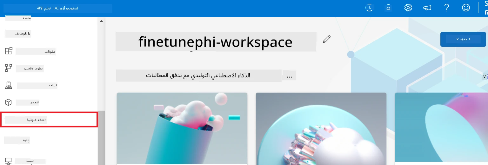

1. اختر نقطة النهاية التي أنشأتها.

    

1. اختر **Consume** من قائمة التنقل.

1. انسخ **REST endpoint** و**Primary key** الخاصين بك.

    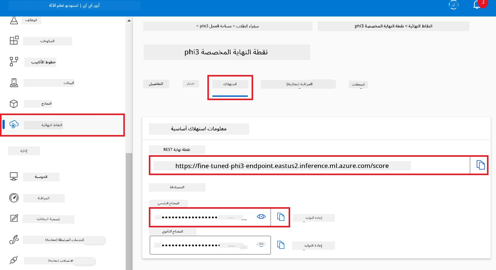

#### إضافة الاتصال المخصص

1. زر [Azure AI Foundry](https://ai.azure.com/?wt.mc_id=studentamb_279723).

1. انتقل إلى مشروع Azure AI Foundry الذي أنشأته.

1. في المشروع الذي أنشأته، اختر **Settings** من القائمة الجانبية اليسرى.

1. اختر **+ New connection**.

    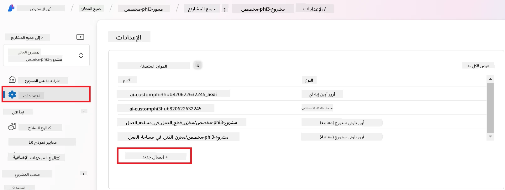

1. اختر **Custom keys** من قائمة التنقل.

    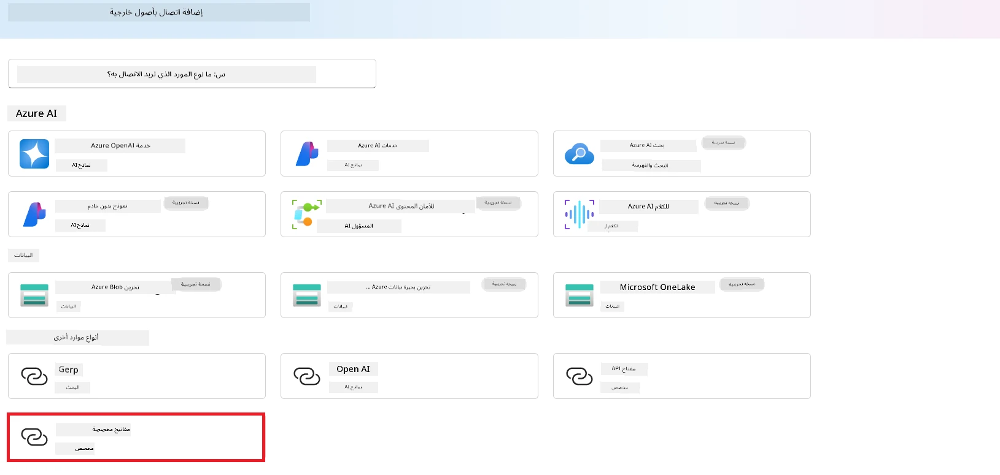

1. قم بالمهام التالية:

    - اختر **+ Add key value pairs**.
    - لأسم المفتاح، أدخل **endpoint** والصق نقطة النهاية التي نسختها من Azure ML Studio في حقل القيمة.
    - اختر **+ Add key value pairs** مرة أخرى.
    - لأسم المفتاح، أدخل **key** والصق المفتاح الذي نسخته من Azure ML Studio في حقل القيمة.
    - بعد إضافة المفاتيح، اختر **is secret** لمنع كشف المفتاح.

    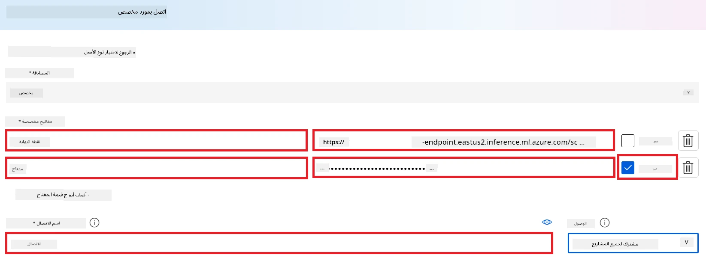

1. اختر **Add connection**.

#### إنشاء Prompt flow

لقد أضفت اتصالًا مخصصًا في Azure AI Foundry. الآن، دعنا ننشئ Prompt flow باستخدام الخطوات التالية. بعد ذلك، ستربط هذا الـ Prompt flow بالاتصال المخصص لاستخدام النموذج المُحسّن ضمن Prompt flow.

1. انتقل إلى مشروع Azure AI Foundry الذي أنشأته.

1. اختر **Prompt flow** من القائمة الجانبية اليسرى.

1. اختر **+ Create** من قائمة التنقل.

    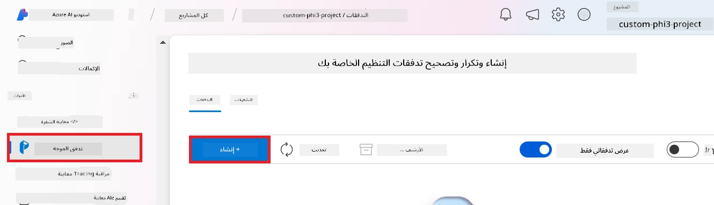

1. اختر **Chat flow** من قائمة التنقل.

    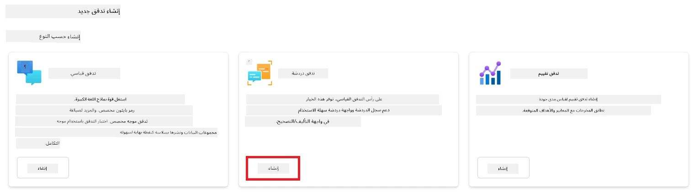

1. أدخل **Folder name** الذي تريد استخدامه.

    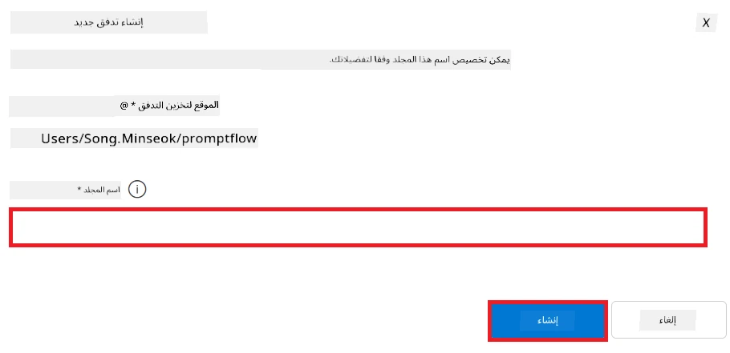

1. اختر **Create**.

#### إعداد Prompt flow للدردشة مع نموذج Phi-3 / Phi-3.5 المُحسّن الخاص بك

تحتاج إلى دمج نموذج Phi-3 / Phi-3.5 المُحسّن في Prompt flow. مع ذلك، فإن Prompt flow الحالي غير مصمم لهذا الغرض. لذلك، يجب عليك إعادة تصميم Prompt flow لتمكين دمج النموذج المخصص.

1. في Prompt flow، قم بالمهام التالية لإعادة بناء التدفق الحالي:

    - اختر **Raw file mode**.
    - احذف كل الكود الموجود في ملف *flow.dag.yml*.
    - أضف الكود التالي إلى *flow.dag.yml*.

        ```yml
        inputs:
          input_data:
            type: string
            default: "Who founded Microsoft?"

        outputs:
          answer:
            type: string
            reference: ${integrate_with_promptflow.output}

        nodes:
        - name: integrate_with_promptflow
          type: python
          source:
            type: code
            path: integrate_with_promptflow.py
          inputs:
            input_data: ${inputs.input_data}
        ```

    - اختر **Save**.

    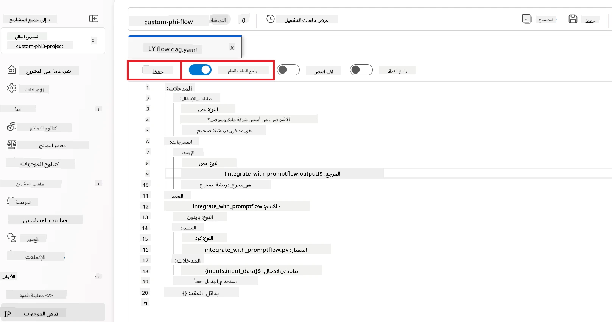

1. أضف الكود التالي إلى *integrate_with_promptflow.py* لاستخدام نموذج Phi-3 / Phi-3.5 المخصص في Prompt flow.

    ```python
    import logging
    import requests
    from promptflow import tool
    from promptflow.connections import CustomConnection

    # Logging setup
    logging.basicConfig(
        format="%(asctime)s - %(levelname)s - %(name)s - %(message)s",
        datefmt="%Y-%m-%d %H:%M:%S",
        level=logging.DEBUG
    )
    logger = logging.getLogger(__name__)

    def query_phi3_model(input_data: str, connection: CustomConnection) -> str:
        """
        Send a request to the Phi-3 / Phi-3.5 model endpoint with the given input data using Custom Connection.
        """

        # "connection" is the name of the Custom Connection, "endpoint", "key" are the keys in the Custom Connection
        endpoint_url = connection.endpoint
        api_key = connection.key

        headers = {
            "Content-Type": "application/json",
            "Authorization": f"Bearer {api_key}"
        }
    data = {
        "input_data": [input_data],
        "params": {
            "temperature": 0.7,
            "max_new_tokens": 128,
            "do_sample": True,
            "return_full_text": True
            }
        }
        try:
            response = requests.post(endpoint_url, json=data, headers=headers)
            response.raise_for_status()
            
            # Log the full JSON response
            logger.debug(f"Full JSON response: {response.json()}")

            result = response.json()["output"]
            logger.info("Successfully received response from Azure ML Endpoint.")
            return result
        except requests.exceptions.RequestException as e:
            logger.error(f"Error querying Azure ML Endpoint: {e}")
            raise

    @tool
    def my_python_tool(input_data: str, connection: CustomConnection) -> str:
        """
        Tool function to process input data and query the Phi-3 / Phi-3.5 model.
        """
        return query_phi3_model(input_data, connection)

    ```

    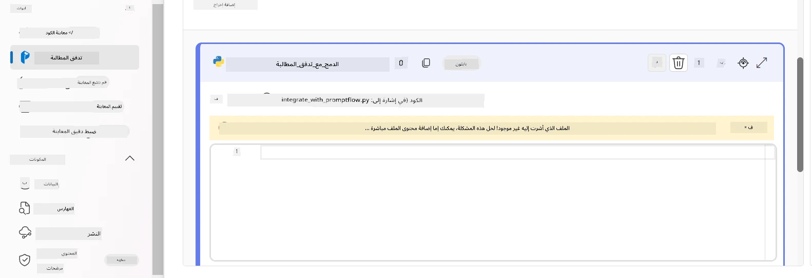

> [!NOTE]
> لمزيد من المعلومات التفصيلية حول استخدام Prompt flow في Azure AI Foundry، يمكنك الرجوع إلى [Prompt flow in Azure AI Foundry](https://learn.microsoft.com/azure/ai-studio/how-to/prompt-flow).

1. اختر **Chat input** و**Chat output** لتمكين الدردشة مع نموذجك.

    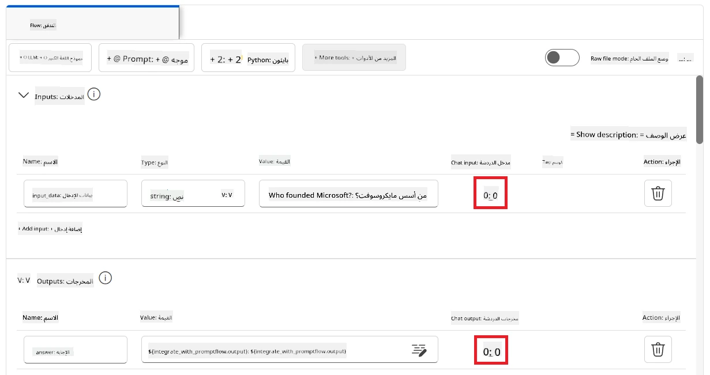

1. الآن أنت جاهز للدردشة مع نموذج Phi-3 / Phi-3.5 المخصص الخاص بك. في التمرين التالي، ستتعلم كيفية بدء Prompt flow واستخدامه للدردشة مع نموذج Phi-3 / Phi-3.5 المُحسّن.

> [!NOTE]
>
> يجب أن يبدو التدفق المعاد بناؤه كما في الصورة أدناه:
>
> 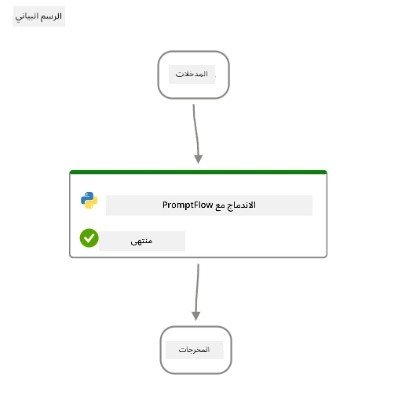
>

#### بدء Prompt flow

1. اختر **Start compute sessions** لبدء Prompt flow.

    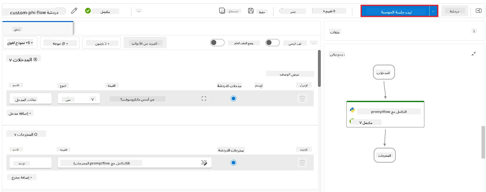

1. اختر **Validate and parse input** لتحديث المعلمات.

    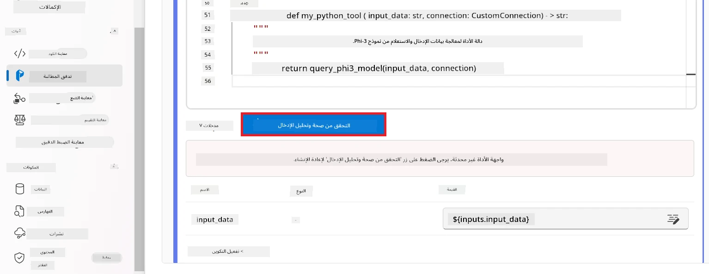

1. اختر **Value** الخاص بـ **connection** للاتصال المخصص الذي أنشأته. على سبيل المثال، *connection*.

    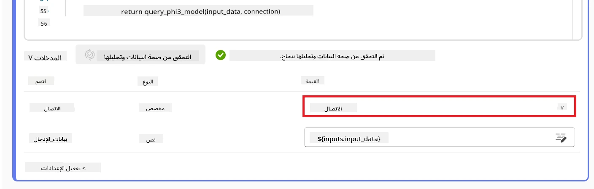

#### الدردشة مع نموذج Phi-3 / Phi-3.5 المخصص الخاص بك

1. اختر **Chat**.

    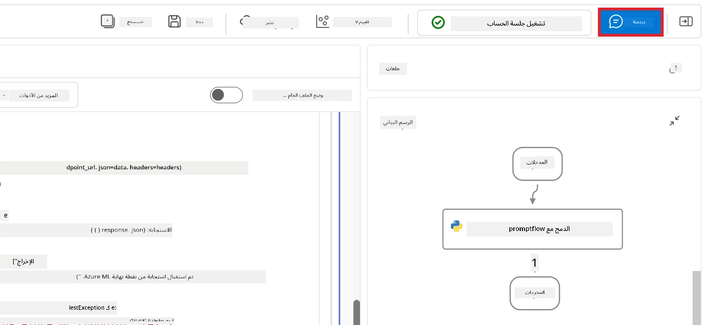

1. إليك مثال على النتائج: الآن يمكنك الدردشة مع نموذج Phi-3 / Phi-3.5 المخصص الخاص بك. يُنصح بطرح الأسئلة بناءً على البيانات المستخدمة في تحسين النموذج.

    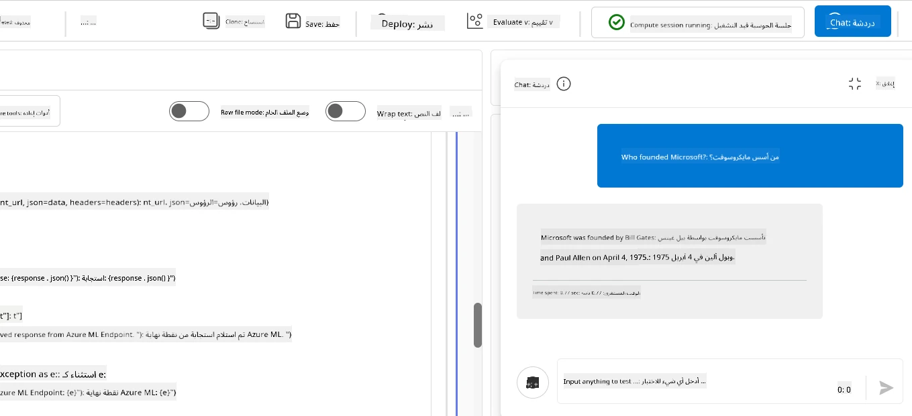

### نشر Azure OpenAI لتقييم نموذج Phi-3 / Phi-3.5

لتقييم نموذج Phi-3 / Phi-3.5 في Azure AI Foundry، تحتاج إلى نشر نموذج Azure OpenAI. سيتم استخدام هذا النموذج لتقييم أداء نموذج Phi-3 / Phi-3.5.

#### نشر Azure OpenAI

1. سجّل الدخول إلى [Azure AI Foundry](https://ai.azure.com/?wt.mc_id=studentamb_279723).

1. انتقل إلى مشروع Azure AI Foundry الذي أنشأته.

    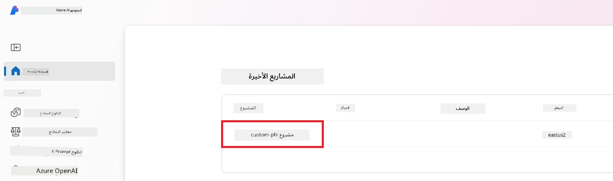

1. في المشروع الذي أنشأته، اختر **Deployments** من القائمة الجانبية اليسرى.

1. اختر **+ Deploy model** من قائمة التنقل.

1. اختر **Deploy base model**.

    

1. اختر نموذج Azure OpenAI الذي تريد استخدامه. على سبيل المثال، **gpt-4o**.

    

1. اختر **Confirm**.

### تقييم نموذج Phi-3 / Phi-3.5 المُحسّن باستخدام تقييم Prompt flow في Azure AI Foundry

### بدء تقييم جديد

1. زر [Azure AI Foundry](https://ai.azure.com/?wt.mc_id=studentamb_279723).

1. انتقل إلى مشروع Azure AI Foundry الذي أنشأته.

    

1. في المشروع الذي أنشأته، اختر **Evaluation** من القائمة الجانبية اليسرى.

1. اختر **+ New evaluation** من قائمة التنقل.

    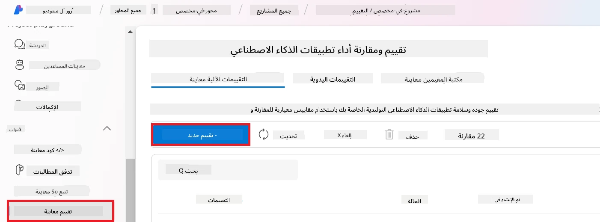

1. اختر تقييم **Prompt flow**.

    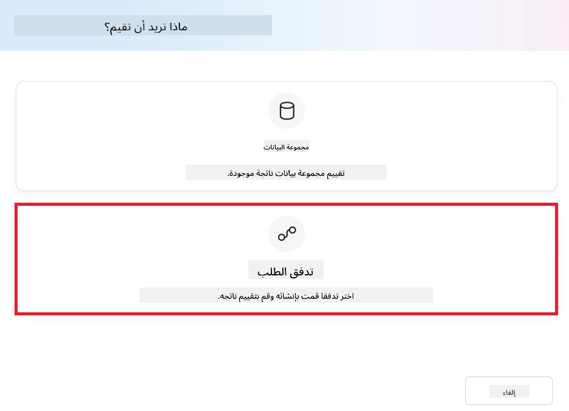

1. قم بالمهام التالية:

    - أدخل اسم التقييم. يجب أن يكون فريدًا.
    - اختر **Question and answer without context** كنوع المهمة، لأن مجموعة بيانات **UlTRACHAT_200k** المستخدمة في هذا الدليل لا تحتوي على سياق.
    - اختر الـ Prompt flow الذي تريد تقييمه.

    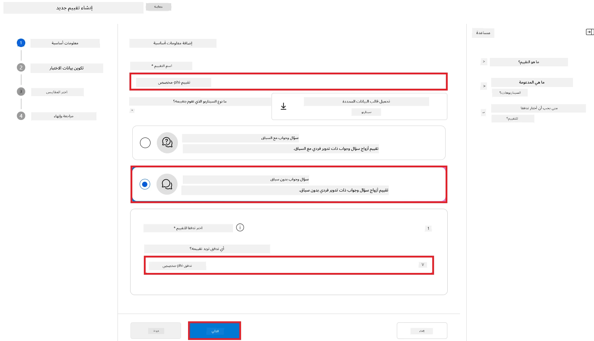

1. اختر **Next**.

1. قم بالمهام التالية:

    - اختر **Add your dataset** لتحميل مجموعة البيانات. على سبيل المثال، يمكنك تحميل ملف مجموعة البيانات التجريبية مثل *test_data.json1*، المرفق عند تنزيل مجموعة بيانات **ULTRACHAT_200k**.
    - اختر العمود المناسب من مجموعة البيانات الذي يتطابق مع بياناتك. على سبيل المثال، إذا كنت تستخدم مجموعة بيانات **ULTRACHAT_200k**، اختر **${data.prompt}** كعمود البيانات.

    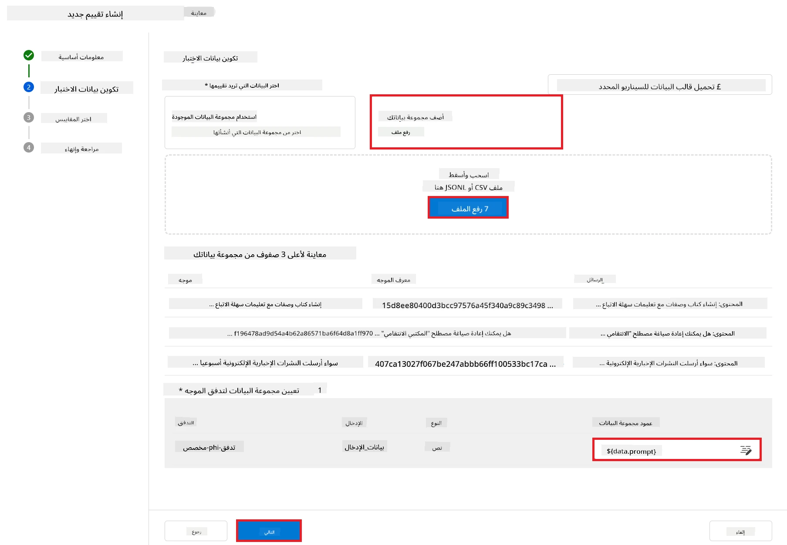

1. اختر **Next**.

1. قم بالمهام التالية لتكوين مقاييس الأداء والجودة:

    - اختر مقاييس الأداء والجودة التي تريد استخدامها.
    - اختر نموذج Azure OpenAI الذي أنشأته للتقييم. على سبيل المثال، اختر **gpt-4o**.

    

1. قم بالمهام التالية لتكوين مقاييس المخاطر والسلامة:

    - اختر مقاييس المخاطر والسلامة التي تريد استخدامها.
    - اختر العتبة لحساب معدل العيوب التي تريد استخدامها. على سبيل المثال، اختر **Medium**.
    - بالنسبة لـ **question**، اختر **Data source** إلى **{$data.prompt}**.
    - بالنسبة لـ **answer**، اختر **Data source** إلى **{$run.outputs.answer}**.
    - بالنسبة لـ **ground_truth**، اختر **Data source** إلى **{$data.message}**.

    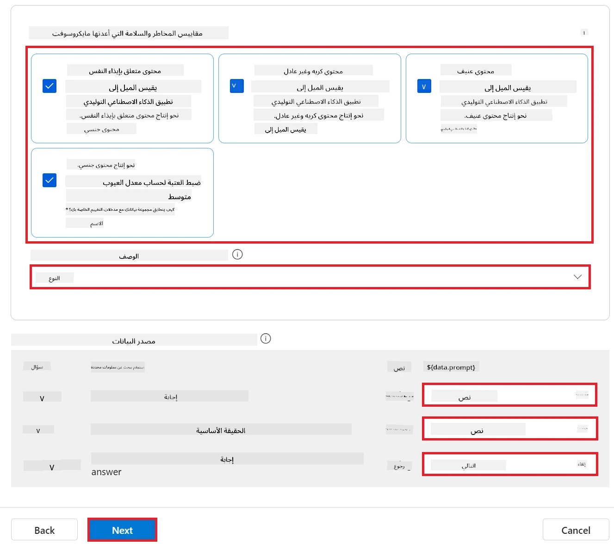

1. اختر **Next**.

1. اختر **Submit** لبدء التقييم.

1. سيستغرق التقييم بعض الوقت لإكماله. يمكنك متابعة التقدم في علامة التبويب **Evaluation**.

### مراجعة نتائج التقييم
> [!NOTE]
> النتائج المعروضة أدناه تهدف إلى توضيح عملية التقييم. في هذا الدرس، استخدمنا نموذجًا تم تحسينه على مجموعة بيانات صغيرة نسبيًا، مما قد يؤدي إلى نتائج أقل من المثالية. قد تختلف النتائج الفعلية بشكل كبير اعتمادًا على حجم وجودة وتنوع مجموعة البيانات المستخدمة، بالإضافة إلى التكوين المحدد للنموذج.
بمجرد الانتهاء من التقييم، يمكنك مراجعة النتائج لكل من مقاييس الأداء والسلامة.

1. مقاييس الأداء والجودة:

    - تقييم فعالية النموذج في توليد استجابات متماسكة، سلسة وذات صلة.

    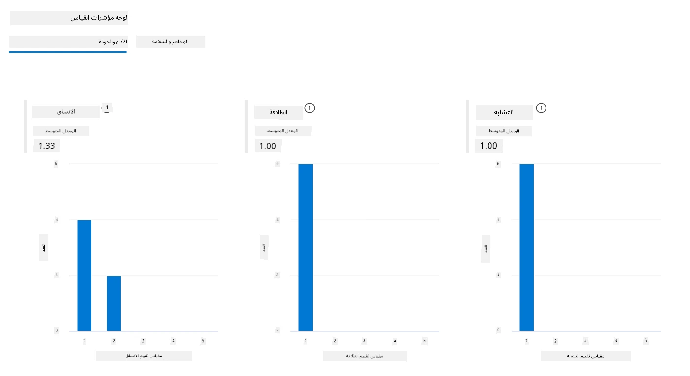

1. مقاييس المخاطر والسلامة:

    - التأكد من أن مخرجات النموذج آمنة وتتوافق مع مبادئ الذكاء الاصطناعي المسؤول، مع تجنب أي محتوى ضار أو مسيء.

    

1. يمكنك التمرير لأسفل لعرض **نتيجة المقاييس التفصيلية**.

    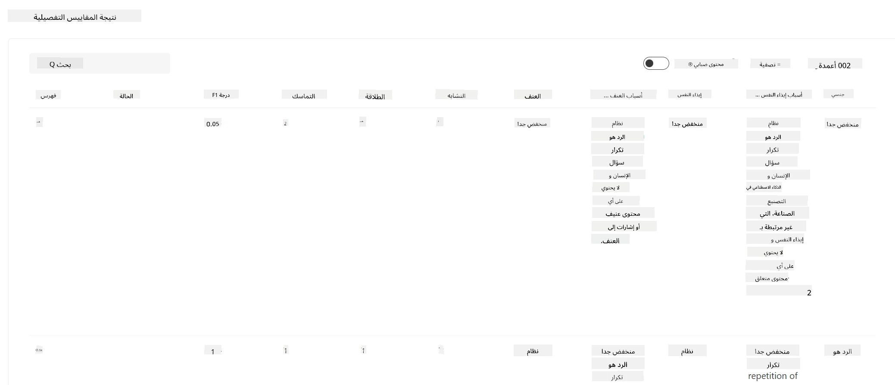

1. من خلال تقييم نموذج Phi-3 / Phi-3.5 المخصص الخاص بك مقابل كل من مقاييس الأداء والسلامة، يمكنك التأكد من أن النموذج ليس فعالًا فحسب، بل يلتزم أيضًا بممارسات الذكاء الاصطناعي المسؤول، مما يجعله جاهزًا للنشر في العالم الحقيقي.

## تهانينا!

### لقد أكملت هذا الدرس

لقد قمت بتقييم نموذج Phi-3 المحسن والمُدمج مع Prompt flow في Azure AI Foundry بنجاح. هذه خطوة مهمة لضمان أن نماذج الذكاء الاصطناعي الخاصة بك لا تؤدي أداءً جيدًا فحسب، بل تلتزم أيضًا بمبادئ الذكاء الاصطناعي المسؤول من مايكروسوفت لمساعدتك في بناء تطبيقات ذكاء اصطناعي موثوقة وجديرة بالثقة.


## تنظيف موارد Azure

قم بتنظيف موارد Azure الخاصة بك لتجنب أي رسوم إضافية على حسابك. انتقل إلى بوابة Azure واحذف الموارد التالية:

- مورد Azure Machine learning.
- نقطة نهاية نموذج Azure Machine learning.
- مورد مشروع Azure AI Foundry.
- مورد Azure AI Foundry Prompt flow.

### الخطوات التالية

#### الوثائق

- [تقييم أنظمة الذكاء الاصطناعي باستخدام لوحة معلومات الذكاء الاصطناعي المسؤول](https://learn.microsoft.com/azure/machine-learning/concept-responsible-ai-dashboard?view=azureml-api-2&source=recommendations?wt.mc_id=studentamb_279723)
- [مقاييس التقييم والمراقبة للذكاء الاصطناعي التوليدي](https://learn.microsoft.com/azure/ai-studio/concepts/evaluation-metrics-built-in?tabs=definition?wt.mc_id=studentamb_279723)
- [توثيق Azure AI Foundry](https://learn.microsoft.com/azure/ai-studio/?wt.mc_id=studentamb_279723)
- [توثيق Prompt flow](https://microsoft.github.io/promptflow/?wt.mc_id=studentamb_279723)

#### محتوى التدريب

- [مقدمة في نهج مايكروسوفت للذكاء الاصطناعي المسؤول](https://learn.microsoft.com/training/modules/introduction-to-microsofts-responsible-ai-approach/?source=recommendations?wt.mc_id=studentamb_279723)
- [مقدمة في Azure AI Foundry](https://learn.microsoft.com/training/modules/introduction-to-azure-ai-studio/?wt.mc_id=studentamb_279723)

### المرجع

- [ما هو الذكاء الاصطناعي المسؤول؟](https://learn.microsoft.com/azure/machine-learning/concept-responsible-ai?view=azureml-api-2?wt.mc_id=studentamb_279723)
- [الإعلان عن أدوات جديدة في Azure AI لمساعدتك في بناء تطبيقات ذكاء اصطناعي توليدي أكثر أمانًا وموثوقية](https://azure.microsoft.com/blog/announcing-new-tools-in-azure-ai-to-help-you-build-more-secure-and-trustworthy-generative-ai-applications/?wt.mc_id=studentamb_279723)
- [تقييم تطبيقات الذكاء الاصطناعي التوليدي](https://learn.microsoft.com/azure/ai-studio/concepts/evaluation-approach-gen-ai?wt.mc_id%3Dstudentamb_279723)

**إخلاء المسؤولية**:  
تمت ترجمة هذا المستند باستخدام خدمة الترجمة الآلية [Co-op Translator](https://github.com/Azure/co-op-translator). بينما نسعى لتحقيق الدقة، يرجى العلم أن الترجمات الآلية قد تحتوي على أخطاء أو عدم دقة. يجب اعتبار المستند الأصلي بلغته الأصلية المصدر الموثوق به. للمعلومات الهامة، يُنصح بالاعتماد على الترجمة البشرية المهنية. نحن غير مسؤولين عن أي سوء فهم أو تفسير ناتج عن استخدام هذه الترجمة.