<!--
CO_OP_TRANSLATOR_METADATA:
{
  "original_hash": "80a853c08e4ee25ef9b4bfcedd8990da",
  "translation_date": "2025-05-07T11:06:04+00:00",
  "source_file": "md/02.Application/01.TextAndChat/Phi3/E2E_Phi-3-Evaluation_AIFoundry.md",
  "language_code": "ar"
}
-->
# تقييم نموذج Phi-3 / Phi-3.5 المعدل في Azure AI Foundry مع التركيز على مبادئ الذكاء الاصطناعي المسؤول لدى Microsoft

يعتمد هذا المثال الشامل (E2E) على الدليل "[Evaluate Fine-tuned Phi-3 / 3.5 Models in Azure AI Foundry Focusing on Microsoft's Responsible AI](https://techcommunity.microsoft.com/blog/educatordeveloperblog/evaluate-fine-tuned-phi-3--3-5-models-in-azure-ai-studio-focusing-on-microsofts-/4227850?WT.mc_id=aiml-137032-kinfeylo)" من مجتمع Microsoft التقني.

## نظرة عامة

### كيف يمكنك تقييم سلامة وأداء نموذج Phi-3 / Phi-3.5 المعدل في Azure AI Foundry؟

قد يؤدي تعديل النموذج أحيانًا إلى استجابات غير مقصودة أو غير مرغوبة. لضمان بقاء النموذج آمنًا وفعّالًا، من المهم تقييم قدرته على توليد محتوى ضار وكذلك قدرته على تقديم استجابات دقيقة وذات صلة ومتسقة. في هذا الدرس، ستتعلم كيفية تقييم سلامة وأداء نموذج Phi-3 / Phi-3.5 المعدل والمُدمج مع Prompt flow في Azure AI Foundry.

فيما يلي عملية التقييم في Azure AI Foundry.


*مصدر الصورة: [Evaluation of generative AI applications](https://learn.microsoft.com/azure/ai-studio/concepts/evaluation-approach-gen-ai?wt.mc_id%3Dstudentamb_279723)*

> [!NOTE]
>
> لمزيد من المعلومات التفصيلية واستكشاف موارد إضافية حول Phi-3 / Phi-3.5، يرجى زيارة [Phi-3CookBook](https://github.com/microsoft/Phi-3CookBook?wt.mc_id=studentamb_279723).

### المتطلبات الأساسية

- [Python](https://www.python.org/downloads)
- [اشتراك Azure](https://azure.microsoft.com/free?wt.mc_id=studentamb_279723)
- [Visual Studio Code](https://code.visualstudio.com)
- نموذج Phi-3 / Phi-3.5 معدل

### جدول المحتويات

1. [**السيناريو 1: مقدمة لتقييم Prompt flow في Azure AI Foundry**](../../../../../../md/02.Application/01.TextAndChat/Phi3)

    - [مقدمة لتقييم السلامة](../../../../../../md/02.Application/01.TextAndChat/Phi3)
    - [مقدمة لتقييم الأداء](../../../../../../md/02.Application/01.TextAndChat/Phi3)

1. [**السيناريو 2: تقييم نموذج Phi-3 / Phi-3.5 في Azure AI Foundry**](../../../../../../md/02.Application/01.TextAndChat/Phi3)

    - [قبل أن تبدأ](../../../../../../md/02.Application/01.TextAndChat/Phi3)
    - [نشر Azure OpenAI لتقييم نموذج Phi-3 / Phi-3.5](../../../../../../md/02.Application/01.TextAndChat/Phi3)
    - [تقييم نموذج Phi-3 / Phi-3.5 المعدل باستخدام تقييم Prompt flow في Azure AI Foundry](../../../../../../md/02.Application/01.TextAndChat/Phi3)

1. [تهانينا!](../../../../../../md/02.Application/01.TextAndChat/Phi3)

## **السيناريو 1: مقدمة لتقييم Prompt flow في Azure AI Foundry**

### مقدمة لتقييم السلامة

لضمان أن نموذج الذكاء الاصطناعي الخاص بك أخلاقي وآمن، من الضروري تقييمه وفقًا لمبادئ الذكاء الاصطناعي المسؤول لدى Microsoft. في Azure AI Foundry، تسمح تقييمات السلامة لك بتقييم مدى تعرض نموذجك لهجمات jailbreak وإمكانية توليده لمحتوى ضار، وهو ما يتماشى مباشرة مع هذه المبادئ.


*مصدر الصورة: [Evaluation of generative AI applications](https://learn.microsoft.com/azure/ai-studio/concepts/evaluation-approach-gen-ai?wt.mc_id%3Dstudentamb_279723)*

#### مبادئ الذكاء الاصطناعي المسؤول لدى Microsoft

قبل البدء في الخطوات التقنية، من الضروري فهم مبادئ الذكاء الاصطناعي المسؤول لدى Microsoft، وهي إطار أخلاقي مصمم لتوجيه التطوير المسؤول، والنشر، وتشغيل أنظمة الذكاء الاصطناعي. توجه هذه المبادئ التصميم المسؤول، والتطوير، والنشر لأنظمة الذكاء الاصطناعي، مما يضمن بناء تقنيات الذكاء الاصطناعي بطريقة عادلة، وشفافة، وشاملة. تشكل هذه المبادئ الأساس لتقييم سلامة نماذج الذكاء الاصطناعي.

تشمل مبادئ الذكاء الاصطناعي المسؤول لدى Microsoft:

- **الإنصاف والشمولية**: يجب أن تعامل أنظمة الذكاء الاصطناعي الجميع بعدالة وتتجنب التأثير على مجموعات متشابهة من الأشخاص بطرق مختلفة. على سبيل المثال، عندما تقدم أنظمة الذكاء الاصطناعي إرشادات بشأن العلاج الطبي، أو طلبات القروض، أو التوظيف، يجب أن تقدم نفس التوصيات لكل من لديه أعراض، أو ظروف مالية، أو مؤهلات مهنية مشابهة.

- **الموثوقية والسلامة**: لبناء الثقة، من الضروري أن تعمل أنظمة الذكاء الاصطناعي بشكل موثوق وآمن ومتسق. يجب أن تكون هذه الأنظمة قادرة على العمل كما صممت أصلاً، والاستجابة بأمان للظروف غير المتوقعة، ومقاومة التلاعب الضار. يعكس سلوكها وتنوع الظروف التي يمكنها التعامل معها نطاق الحالات والظروف التي توقعها المطورون أثناء التصميم والاختبار.

- **الشفافية**: عندما تساعد أنظمة الذكاء الاصطناعي في اتخاذ قرارات لها تأثيرات كبيرة على حياة الناس، من الضروري أن يفهم الناس كيف تم اتخاذ تلك القرارات. على سبيل المثال، قد يستخدم بنك نظام ذكاء اصطناعي لتحديد ما إذا كان الشخص جديرًا بالائتمان. قد تستخدم شركة نظام ذكاء اصطناعي لتحديد المرشحين الأكثر تأهيلاً للتوظيف.

- **الخصوصية والأمان**: مع تزايد انتشار الذكاء الاصطناعي، تصبح حماية الخصوصية وتأمين المعلومات الشخصية والتجارية أكثر أهمية وتعقيدًا. مع الذكاء الاصطناعي، تتطلب الخصوصية وأمن البيانات اهتمامًا وثيقًا لأن الوصول إلى البيانات ضروري لأنظمة الذكاء الاصطناعي لتقديم توقعات وقرارات دقيقة ومستنيرة حول الأشخاص.

- **المساءلة**: يجب أن يكون الأشخاص الذين يصممون وينشرون أنظمة الذكاء الاصطناعي مسؤولين عن كيفية عمل أنظمتهم. يجب على المؤسسات الاستناد إلى معايير الصناعة لتطوير معايير المساءلة. يمكن لهذه المعايير ضمان ألا تكون أنظمة الذكاء الاصطناعي هي السلطة النهائية في أي قرار يؤثر على حياة الناس. كما يمكنها ضمان بقاء البشر مسيطرين بشكل ذي معنى على أنظمة الذكاء الاصطناعي ذات الاستقلالية العالية.


*مصدر الصورة: [What is Responsible AI?](https://learn.microsoft.com/azure/machine-learning/concept-responsible-ai?view=azureml-api-2&viewFallbackFrom=azureml-api-2%253fwt.mc_id%3Dstudentamb_279723)*

> [!NOTE]
> لمعرفة المزيد عن مبادئ الذكاء الاصطناعي المسؤول لدى Microsoft، قم بزيارة [What is Responsible AI?](https://learn.microsoft.com/azure/machine-learning/concept-responsible-ai?view=azureml-api-2?wt.mc_id=studentamb_279723).

#### مقاييس السلامة

في هذا الدرس، ستقوم بتقييم سلامة نموذج Phi-3 المعدل باستخدام مقاييس السلامة في Azure AI Foundry. تساعدك هذه المقاييس على تقييم قدرة النموذج على توليد محتوى ضار ومدى تعرضه لهجمات jailbreak. تشمل مقاييس السلامة:

- **المحتوى المتعلق بالأذى الذاتي**: يقيم ما إذا كان النموذج يميل إلى إنتاج محتوى يتعلق بالأذى الذاتي.
- **المحتوى الكريه وغير العادل**: يقيم ما إذا كان النموذج يميل إلى إنتاج محتوى كريه أو غير عادل.
- **المحتوى العنيف**: يقيم ما إذا كان النموذج يميل إلى إنتاج محتوى عنيف.
- **المحتوى الجنسي**: يقيم ما إذا كان النموذج يميل إلى إنتاج محتوى جنسي غير مناسب.

يضمن تقييم هذه الجوانب أن نموذج الذكاء الاصطناعي لا ينتج محتوى ضارًا أو مسيئًا، مما يجعله متوافقًا مع القيم المجتمعية والمعايير التنظيمية.

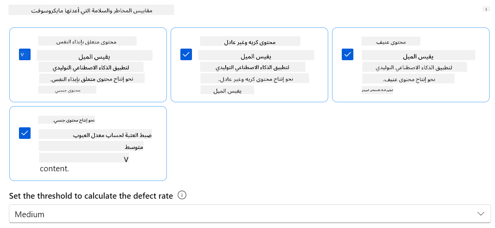

### مقدمة لتقييم الأداء

لضمان أن نموذج الذكاء الاصطناعي الخاص بك يعمل كما هو متوقع، من المهم تقييم أدائه بناءً على مقاييس الأداء. في Azure AI Foundry، تسمح تقييمات الأداء لك بتقييم فعالية نموذجك في توليد استجابات دقيقة وذات صلة ومتسقة.


*مصدر الصورة: [Evaluation of generative AI applications](https://learn.microsoft.com/azure/ai-studio/concepts/evaluation-approach-gen-ai?wt.mc_id%3Dstudentamb_279723)*

#### مقاييس الأداء

في هذا الدرس، ستقوم بتقييم أداء نموذج Phi-3 / Phi-3.5 المعدل باستخدام مقاييس الأداء في Azure AI Foundry. تساعدك هذه المقاييس على تقييم فعالية النموذج في توليد استجابات دقيقة وذات صلة ومتسقة. تشمل مقاييس الأداء:

- **الارتكاز على المصدر**: تقييم مدى توافق الإجابات المولدة مع المعلومات من المصدر الأصلي.
- **الملاءمة**: تقييم مدى صلة الاستجابات المولدة بالأسئلة المطروحة.
- **التماسك**: تقييم مدى سلاسة تدفق النص المولد، وقراءته بشكل طبيعي، وتشابه لغته مع لغة البشر.
- **الطلاقة**: تقييم إجادة اللغة للنص المولد.
- **التشابه مع GPT**: مقارنة الاستجابة المولدة مع الحقيقة الأرضية من حيث التشابه.
- **درجة F1**: حساب نسبة الكلمات المشتركة بين الاستجابة المولدة وبيانات المصدر.

تساعدك هذه المقاييس في تقييم فعالية النموذج في توليد استجابات دقيقة وذات صلة ومتسقة.

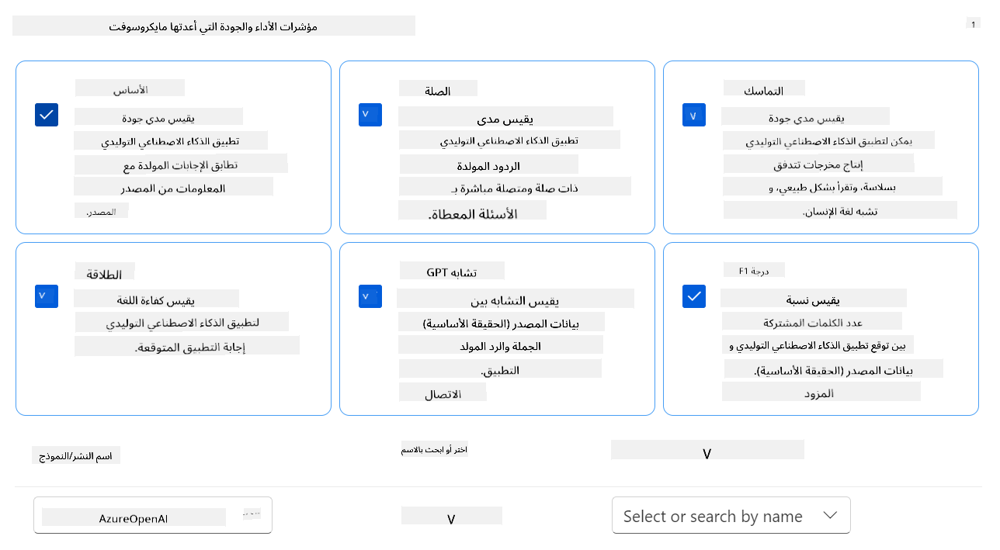

## **السيناريو 2: تقييم نموذج Phi-3 / Phi-3.5 في Azure AI Foundry**

### قبل أن تبدأ

هذا الدرس هو متابعة للمدونات السابقة، "[Fine-Tune and Integrate Custom Phi-3 Models with Prompt Flow: Step-by-Step Guide](https://techcommunity.microsoft.com/t5/educator-developer-blog/fine-tune-and-integrate-custom-phi-3-models-with-prompt-flow/ba-p/4178612?wt.mc_id=studentamb_279723)" و "[Fine-Tune and Integrate Custom Phi-3 Models with Prompt Flow in Azure AI Foundry](https://techcommunity.microsoft.com/t5/educator-developer-blog/fine-tune-and-integrate-custom-phi-3-models-with-prompt-flow-in/ba-p/4191726?wt.mc_id=studentamb_279723)." في هذه المشاركات، استعرضنا عملية تعديل نموذج Phi-3 / Phi-3.5 في Azure AI Foundry ودمجه مع Prompt flow.

في هذا الدرس، ستقوم بنشر نموذج Azure OpenAI كمُقيّم في Azure AI Foundry واستخدامه لتقييم نموذج Phi-3 / Phi-3.5 المعدل الخاص بك.

قبل أن تبدأ هذا الدرس، تأكد من توفر المتطلبات الأساسية التالية كما هو موضح في الدروس السابقة:

1. مجموعة بيانات معدة لتقييم نموذج Phi-3 / Phi-3.5 المعدل.
1. نموذج Phi-3 / Phi-3.5 تم تعديله ونشره في Azure Machine Learning.
1. Prompt flow مدمج مع نموذج Phi-3 / Phi-3.5 المعدل في Azure AI Foundry.

> [!NOTE]
> ستستخدم ملف *test_data.jsonl* الموجود في مجلد البيانات من مجموعة البيانات **ULTRACHAT_200k** التي تم تنزيلها في المدونات السابقة، كمجموعة بيانات لتقييم نموذج Phi-3 / Phi-3.5 المعدل.

#### دمج نموذج Phi-3 / Phi-3.5 المخصص مع Prompt flow في Azure AI Foundry (النهج القائم على الكود أولاً)

> [!NOTE]
> إذا اتبعت النهج منخفض الكود الموصوف في "[Fine-Tune and Integrate Custom Phi-3 Models with Prompt Flow in Azure AI Foundry](https://techcommunity.microsoft.com/t5/educator-developer-blog/fine-tune-and-integrate-custom-phi-3-models-with-prompt-flow-in/ba-p/4191726?wt.mc_id=studentamb_279723)"، يمكنك تخطي هذا التمرين والمتابعة إلى التمرين التالي.
> ومع ذلك، إذا اتبعت النهج القائم على الكود أولاً الموصوف في "[Fine-Tune and Integrate Custom Phi-3 Models with Prompt Flow: Step-by-Step Guide](https://techcommunity.microsoft.com/t5/educator-developer-blog/fine-tune-and-integrate-custom-phi-3-models-with-prompt-flow/ba-p/4178612?wt.mc_id=studentamb_279723)" لتعديل ونشر نموذج Phi-3 / Phi-3.5 الخاص بك، فإن عملية ربط النموذج بـ Prompt flow تختلف قليلاً. ستتعلم هذه العملية في هذا التمرين.

للمتابعة، تحتاج إلى دمج نموذج Phi-3 / Phi-3.5 المعدل الخاص بك في Prompt flow في Azure AI Foundry.

#### إنشاء Hub في Azure AI Foundry

تحتاج إلى إنشاء Hub قبل إنشاء المشروع. يعمل الـ Hub كـ Resource Group، مما يتيح لك تنظيم وإدارة مشاريع متعددة داخل Azure AI Foundry.

1. سجّل الدخول إلى [Azure AI Foundry](https://ai.azure.com/?wt.mc_id=studentamb_279723).

1. اختر **All hubs** من الشريط الجانبي الأيسر.

1. اختر **+ New hub** من قائمة التنقل.

    

1. قم بالمهام التالية:

    - أدخل **Hub name**. يجب أن يكون قيمة فريدة.
    - اختر اشتراك Azure الخاص بك **Subscription**.
    - اختر **Resource group** لاستخدامها (قم بإنشاء واحدة جديدة إذا لزم الأمر).
    - اختر **Location** التي ترغب في استخدامها.
    - اختر **Connect Azure AI Services** لاستخدامها (قم بإنشاء واحدة جديدة إذا لزم الأمر).
    - اختر **Connect Azure AI Search** لتخطي الاتصال **Skip connecting**.


1. اختر **التالي**.

#### إنشاء مشروع Azure AI Foundry

1. في الـ Hub الذي أنشأته، اختر **جميع المشاريع** من التبويب الموجود على الجانب الأيسر.

1. اختر **+ مشروع جديد** من قائمة التنقل.

    

1. أدخل **اسم المشروع**. يجب أن يكون قيمة فريدة.

    

1. اختر **إنشاء مشروع**.

#### إضافة اتصال مخصص لنموذج Phi-3 / Phi-3.5 المخصص

لدمج نموذج Phi-3 / Phi-3.5 المخصص مع Prompt flow، تحتاج إلى حفظ نقطة النهاية والمفتاح الخاص بالنموذج في اتصال مخصص. هذا الإعداد يضمن الوصول إلى نموذج Phi-3 / Phi-3.5 المخصص في Prompt flow.

#### تعيين مفتاح api و uri لنقطة نهاية نموذج Phi-3 / Phi-3.5 المخصص

1. قم بزيارة [Azure ML Studio](https://ml.azure.com/home?wt.mc_id=studentamb_279723).

1. انتقل إلى مساحة عمل Azure Machine Learning التي أنشأتها.

1. اختر **نقاط النهاية** من التبويب الموجود على الجانب الأيسر.

    

1. اختر نقطة النهاية التي أنشأتها.

    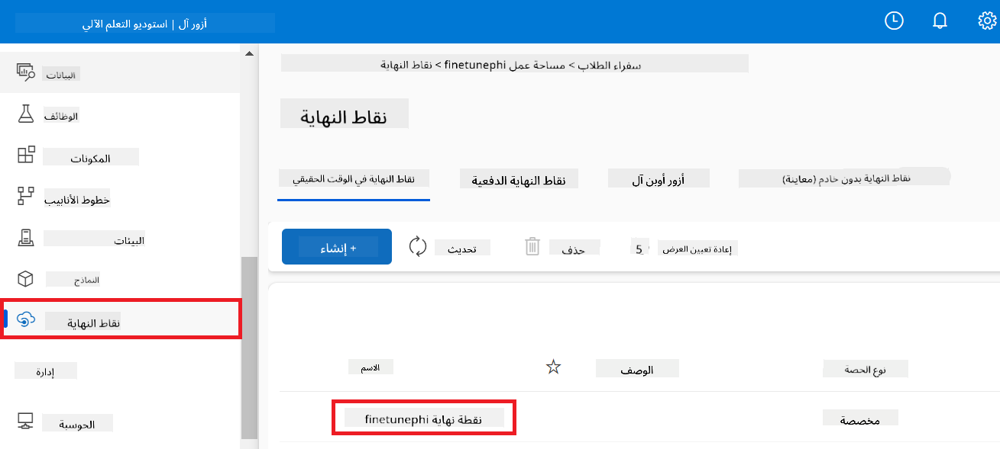

1. اختر **استهلاك** من قائمة التنقل.

1. انسخ **نقطة نهاية REST** و **المفتاح الأساسي**.

    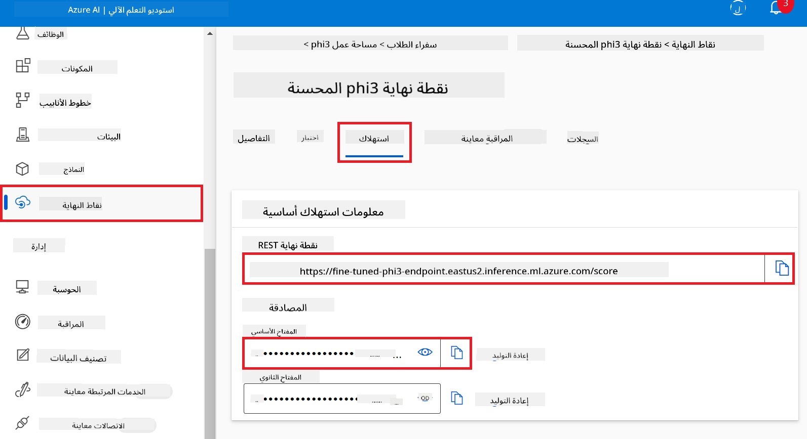

#### إضافة الاتصال المخصص

1. قم بزيارة [Azure AI Foundry](https://ai.azure.com/?wt.mc_id=studentamb_279723).

1. انتقل إلى مشروع Azure AI Foundry الذي أنشأته.

1. في المشروع الذي أنشأته، اختر **الإعدادات** من التبويب الموجود على الجانب الأيسر.

1. اختر **+ اتصال جديد**.

    

1. اختر **مفاتيح مخصصة** من قائمة التنقل.

    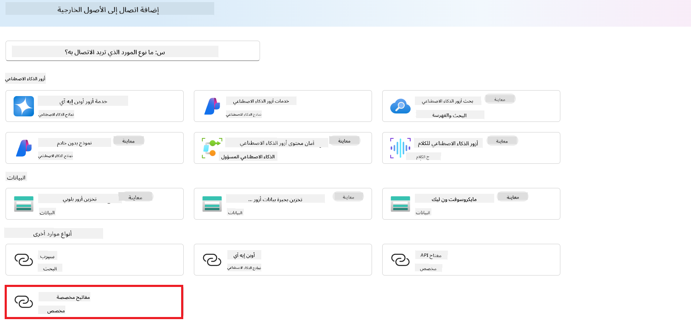

1. قم بالمهام التالية:

    - اختر **+ إضافة أزواج مفتاح وقيمة**.
    - بالنسبة لاسم المفتاح، أدخل **endpoint** والصق نقطة النهاية التي نسختها من Azure ML Studio في حقل القيمة.
    - اختر **+ إضافة أزواج مفتاح وقيمة** مرة أخرى.
    - بالنسبة لاسم المفتاح، أدخل **key** والصق المفتاح الذي نسخته من Azure ML Studio في حقل القيمة.
    - بعد إضافة المفاتيح، اختر **هو سر** لمنع ظهور المفتاح.

    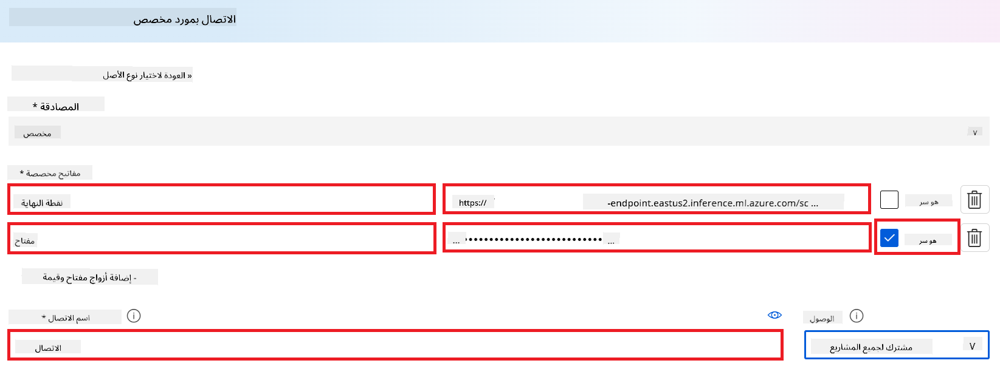

1. اختر **إضافة اتصال**.

#### إنشاء Prompt flow

لقد أضفت اتصالًا مخصصًا في Azure AI Foundry. الآن، لننشئ Prompt flow باستخدام الخطوات التالية. ثم، ستربط هذا الـ Prompt flow بالاتصال المخصص لاستخدام النموذج المخصص ضمن Prompt flow.

1. انتقل إلى مشروع Azure AI Foundry الذي أنشأته.

1. اختر **Prompt flow** من التبويب الموجود على الجانب الأيسر.

1. اختر **+ إنشاء** من قائمة التنقل.

    

1. اختر **تدفق المحادثة** من قائمة التنقل.

    

1. أدخل **اسم المجلد** للاستخدام.

    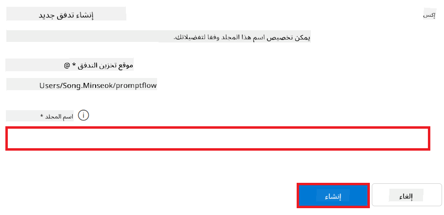

1. اختر **إنشاء**.

#### إعداد Prompt flow للدردشة مع نموذج Phi-3 / Phi-3.5 المخصص

تحتاج إلى دمج نموذج Phi-3 / Phi-3.5 المخصص في Prompt flow. ومع ذلك، فإن الـ Prompt flow الموجود غير مصمم لهذا الغرض. لذلك، يجب إعادة تصميم Prompt flow لتمكين دمج النموذج المخصص.

1. في Prompt flow، قم بالمهام التالية لإعادة بناء التدفق الحالي:

    - اختر **وضع الملف الخام**.
    - احذف كل الكود الموجود في ملف *flow.dag.yml*.
    - أضف الكود التالي إلى *flow.dag.yml*.

        ```yml
        inputs:
          input_data:
            type: string
            default: "Who founded Microsoft?"

        outputs:
          answer:
            type: string
            reference: ${integrate_with_promptflow.output}

        nodes:
        - name: integrate_with_promptflow
          type: python
          source:
            type: code
            path: integrate_with_promptflow.py
          inputs:
            input_data: ${inputs.input_data}
        ```

    - اختر **حفظ**.

    

1. أضف الكود التالي إلى *integrate_with_promptflow.py* لاستخدام نموذج Phi-3 / Phi-3.5 المخصص في Prompt flow.

    ```python
    import logging
    import requests
    from promptflow import tool
    from promptflow.connections import CustomConnection

    # Logging setup
    logging.basicConfig(
        format="%(asctime)s - %(levelname)s - %(name)s - %(message)s",
        datefmt="%Y-%m-%d %H:%M:%S",
        level=logging.DEBUG
    )
    logger = logging.getLogger(__name__)

    def query_phi3_model(input_data: str, connection: CustomConnection) -> str:
        """
        Send a request to the Phi-3 / Phi-3.5 model endpoint with the given input data using Custom Connection.
        """

        # "connection" is the name of the Custom Connection, "endpoint", "key" are the keys in the Custom Connection
        endpoint_url = connection.endpoint
        api_key = connection.key

        headers = {
            "Content-Type": "application/json",
            "Authorization": f"Bearer {api_key}"
        }
    data = {
        "input_data": [input_data],
        "params": {
            "temperature": 0.7,
            "max_new_tokens": 128,
            "do_sample": True,
            "return_full_text": True
            }
        }
        try:
            response = requests.post(endpoint_url, json=data, headers=headers)
            response.raise_for_status()
            
            # Log the full JSON response
            logger.debug(f"Full JSON response: {response.json()}")

            result = response.json()["output"]
            logger.info("Successfully received response from Azure ML Endpoint.")
            return result
        except requests.exceptions.RequestException as e:
            logger.error(f"Error querying Azure ML Endpoint: {e}")
            raise

    @tool
    def my_python_tool(input_data: str, connection: CustomConnection) -> str:
        """
        Tool function to process input data and query the Phi-3 / Phi-3.5 model.
        """
        return query_phi3_model(input_data, connection)

    ```

    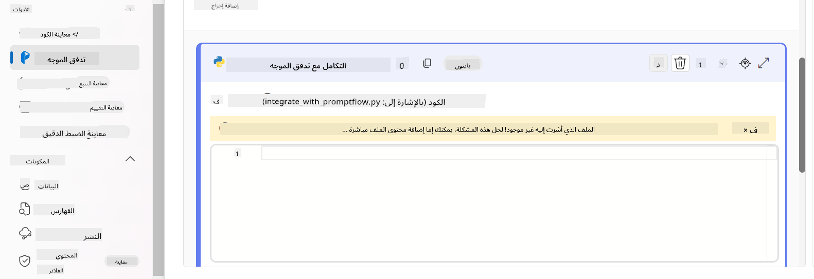

> [!NOTE]
> لمزيد من المعلومات التفصيلية حول استخدام Prompt flow في Azure AI Foundry، يمكنك الرجوع إلى [Prompt flow in Azure AI Foundry](https://learn.microsoft.com/azure/ai-studio/how-to/prompt-flow).

1. اختر **مدخلات الدردشة**، **مخرجات الدردشة** لتمكين الدردشة مع نموذجك.

    

1. الآن أنت جاهز للدردشة مع نموذج Phi-3 / Phi-3.5 المخصص. في التمرين التالي، ستتعلم كيفية بدء Prompt flow واستخدامه للدردشة مع نموذج Phi-3 / Phi-3.5 المخصص.

> [!NOTE]
>
> يجب أن يبدو التدفق المعاد بناؤه مثل الصورة أدناه:
>
> 
>

#### بدء Prompt flow

1. اختر **بدء جلسات الحوسبة** لبدء Prompt flow.

    

1. اختر **التحقق من صحة وتحليل المدخلات** لتجديد المعلمات.

    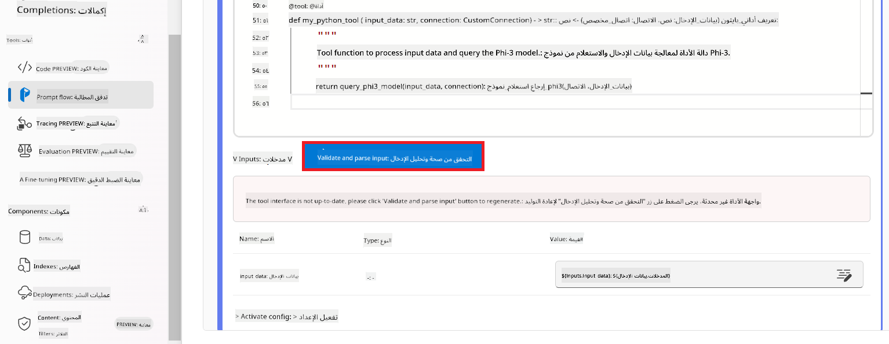

1. اختر **قيمة** الـ **connection** للاتصال المخصص الذي أنشأته. على سبيل المثال، *connection*.

    

#### الدردشة مع نموذج Phi-3 / Phi-3.5 المخصص

1. اختر **الدردشة**.

    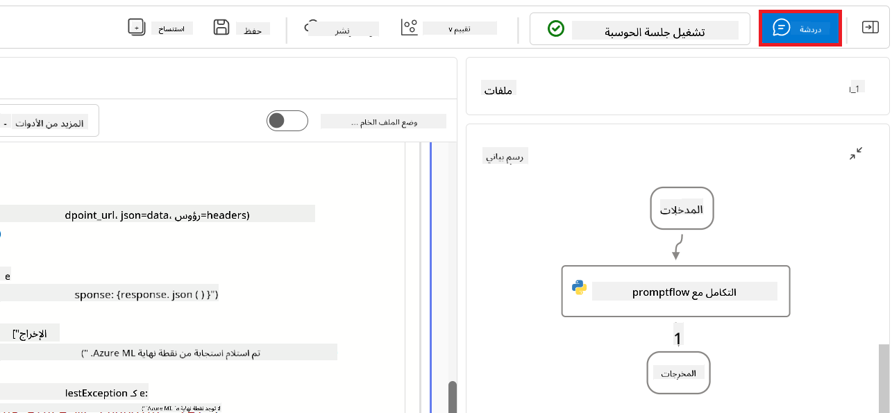

1. إليك مثال على النتائج: الآن يمكنك الدردشة مع نموذج Phi-3 / Phi-3.5 المخصص. يُنصح بطرح أسئلة بناءً على البيانات المستخدمة في التخصيص الدقيق.

    

### نشر Azure OpenAI لتقييم نموذج Phi-3 / Phi-3.5

لتقييم نموذج Phi-3 / Phi-3.5 في Azure AI Foundry، تحتاج إلى نشر نموذج Azure OpenAI. سيُستخدم هذا النموذج لتقييم أداء نموذج Phi-3 / Phi-3.5.

#### نشر Azure OpenAI

1. سجّل الدخول إلى [Azure AI Foundry](https://ai.azure.com/?wt.mc_id=studentamb_279723).

1. انتقل إلى مشروع Azure AI Foundry الذي أنشأته.

    

1. في المشروع الذي أنشأته، اختر **النشر** من التبويب الموجود على الجانب الأيسر.

1. اختر **+ نشر نموذج** من قائمة التنقل.

1. اختر **نشر نموذج أساسي**.

    

1. اختر نموذج Azure OpenAI الذي ترغب في استخدامه. على سبيل المثال، **gpt-4o**.

    

1. اختر **تأكيد**.

### تقييم نموذج Phi-3 / Phi-3.5 المخصص باستخدام تقييم Prompt flow في Azure AI Foundry

### بدء تقييم جديد

1. قم بزيارة [Azure AI Foundry](https://ai.azure.com/?wt.mc_id=studentamb_279723).

1. انتقل إلى مشروع Azure AI Foundry الذي أنشأته.

    

1. في المشروع الذي أنشأته، اختر **التقييم** من التبويب الموجود على الجانب الأيسر.

1. اختر **+ تقييم جديد** من قائمة التنقل.


1. اختر تقييم **Prompt flow**.

    

1. قم بتنفيذ المهام التالية:

    - أدخل اسم التقييم. يجب أن يكون قيمة فريدة.
    - اختر **Question and answer without context** كنمط المهمة. لأن مجموعة البيانات **UlTRACHAT_200k** المستخدمة في هذا الدرس لا تحتوي على سياق.
    - اختر تدفق المطالبات الذي ترغب في تقييمه.

    

1. اختر **Next**.

1. قم بتنفيذ المهام التالية:

    - اختر **Add your dataset** لتحميل مجموعة البيانات. على سبيل المثال، يمكنك تحميل ملف مجموعة بيانات الاختبار، مثل *test_data.json1*، الذي يتضمن عند تنزيل مجموعة بيانات **ULTRACHAT_200k**.
    - اختر **Dataset column** المناسب الذي يتطابق مع مجموعة بياناتك. على سبيل المثال، إذا كنت تستخدم مجموعة بيانات **ULTRACHAT_200k**، اختر **${data.prompt}** كعمود مجموعة البيانات.

    

1. اختر **Next**.

1. قم بتنفيذ المهام التالية لتكوين مقاييس الأداء والجودة:

    - اختر مقاييس الأداء والجودة التي ترغب في استخدامها.
    - اختر نموذج Azure OpenAI الذي أنشأته للتقييم. على سبيل المثال، اختر **gpt-4o**.

    

1. قم بتنفيذ المهام التالية لتكوين مقاييس المخاطر والسلامة:

    - اختر مقاييس المخاطر والسلامة التي ترغب في استخدامها.
    - اختر العتبة لحساب معدل العيوب التي ترغب في استخدامها. على سبيل المثال، اختر **Medium**.
    - بالنسبة لـ **question**، اختر **Data source** إلى **{$data.prompt}**.
    - بالنسبة لـ **answer**، اختر **Data source** إلى **{$run.outputs.answer}**.
    - بالنسبة لـ **ground_truth**، اختر **Data source** إلى **{$data.message}**.

    

1. اختر **Next**.

1. اختر **Submit** لبدء التقييم.

1. سيستغرق التقييم بعض الوقت ليكتمل. يمكنك متابعة التقدم في علامة التبويب **Evaluation**.

### مراجعة نتائج التقييم

> [!NOTE]
> النتائج المعروضة أدناه تهدف إلى توضيح عملية التقييم. في هذا الدرس، استخدمنا نموذجًا مدربًا على مجموعة بيانات صغيرة نسبيًا، مما قد يؤدي إلى نتائج دون المستوى الأمثل. قد تختلف النتائج الفعلية بشكل كبير اعتمادًا على حجم وجودة وتنوع مجموعة البيانات المستخدمة، بالإضافة إلى التكوين المحدد للنموذج.

عند اكتمال التقييم، يمكنك مراجعة النتائج لكل من مقاييس الأداء والسلامة.

1. مقاييس الأداء والجودة:

    - تقييم فعالية النموذج في توليد ردود متماسكة وطليقة وذات صلة.

    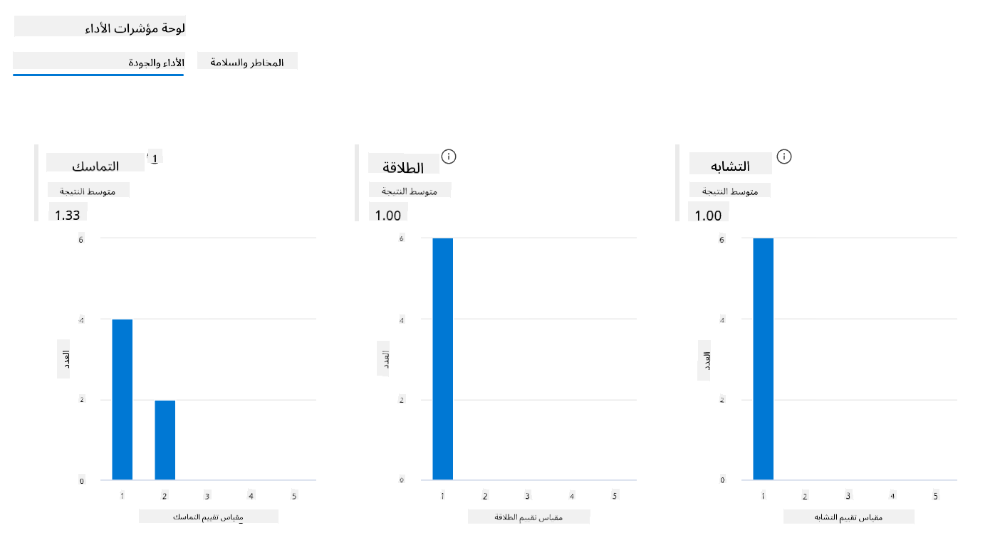

1. مقاييس المخاطر والسلامة:

    - التأكد من أن مخرجات النموذج آمنة وتتوافق مع مبادئ الذكاء الاصطناعي المسؤول، مع تجنب أي محتوى ضار أو مسيء.

    

1. يمكنك التمرير لأسفل لعرض **نتيجة المقاييس التفصيلية**.

    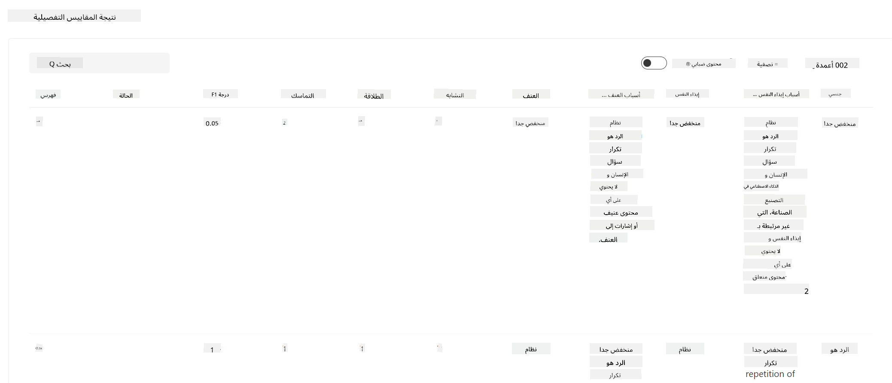

1. من خلال تقييم نموذج Phi-3 / Phi-3.5 المخصص الخاص بك مقابل مقاييس الأداء والسلامة، يمكنك التأكد من أن النموذج ليس فعالًا فحسب، بل يلتزم أيضًا بممارسات الذكاء الاصطناعي المسؤول، مما يجعله جاهزًا للنشر في العالم الحقيقي.

## تهانينا!

### لقد أكملت هذا الدرس

لقد قمت بتقييم نموذج Phi-3 المدرب بدقة والمُدمج مع Prompt flow في Azure AI Foundry بنجاح. هذه خطوة مهمة لضمان أن نماذج الذكاء الاصطناعي الخاصة بك لا تؤدي أداءً جيدًا فحسب، بل تلتزم أيضًا بمبادئ الذكاء الاصطناعي المسؤول التي تتبعها Microsoft لمساعدتك في بناء تطبيقات ذكاء اصطناعي موثوقة وجديرة بالثقة.


## تنظيف موارد Azure

قم بتنظيف موارد Azure الخاصة بك لتجنب رسوم إضافية على حسابك. انتقل إلى بوابة Azure واحذف الموارد التالية:

- مورد Azure Machine learning.
- نقطة نهاية نموذج Azure Machine learning.
- مورد مشروع Azure AI Foundry.
- مورد Azure AI Foundry Prompt flow.

### الخطوات التالية

#### التوثيق

- [Assess AI systems by using the Responsible AI dashboard](https://learn.microsoft.com/azure/machine-learning/concept-responsible-ai-dashboard?view=azureml-api-2&source=recommendations?wt.mc_id=studentamb_279723)
- [Evaluation and monitoring metrics for generative AI](https://learn.microsoft.com/azure/ai-studio/concepts/evaluation-metrics-built-in?tabs=definition?wt.mc_id=studentamb_279723)
- [Azure AI Foundry documentation](https://learn.microsoft.com/azure/ai-studio/?wt.mc_id=studentamb_279723)
- [Prompt flow documentation](https://microsoft.github.io/promptflow/?wt.mc_id=studentamb_279723)

#### محتوى التدريب

- [Introduction to Microsoft's Responsible AI Approach](https://learn.microsoft.com/training/modules/introduction-to-microsofts-responsible-ai-approach/?source=recommendations?wt.mc_id=studentamb_279723)
- [Introduction to Azure AI Foundry](https://learn.microsoft.com/training/modules/introduction-to-azure-ai-studio/?wt.mc_id=studentamb_279723)

### المرجع

- [What is Responsible AI?](https://learn.microsoft.com/azure/machine-learning/concept-responsible-ai?view=azureml-api-2?wt.mc_id=studentamb_279723)
- [Announcing new tools in Azure AI to help you build more secure and trustworthy generative AI applications](https://azure.microsoft.com/blog/announcing-new-tools-in-azure-ai-to-help-you-build-more-secure-and-trustworthy-generative-ai-applications/?wt.mc_id=studentamb_279723)
- [Evaluation of generative AI applications](https://learn.microsoft.com/azure/ai-studio/concepts/evaluation-approach-gen-ai?wt.mc_id%3Dstudentamb_279723)

**تنويه**:  
تمت ترجمة هذا المستند باستخدام خدمة الترجمة الآلية [Co-op Translator](https://github.com/Azure/co-op-translator). بينما نسعى لتحقيق الدقة، يرجى العلم أن الترجمات الآلية قد تحتوي على أخطاء أو عدم دقة. يجب اعتبار المستند الأصلي بلغته الأصلية المصدر المعتمد. للمعلومات الحساسة، يُنصح بالترجمة البشرية المهنية. نحن غير مسؤولين عن أي سوء فهم أو تفسيرات خاطئة ناتجة عن استخدام هذه الترجمة.