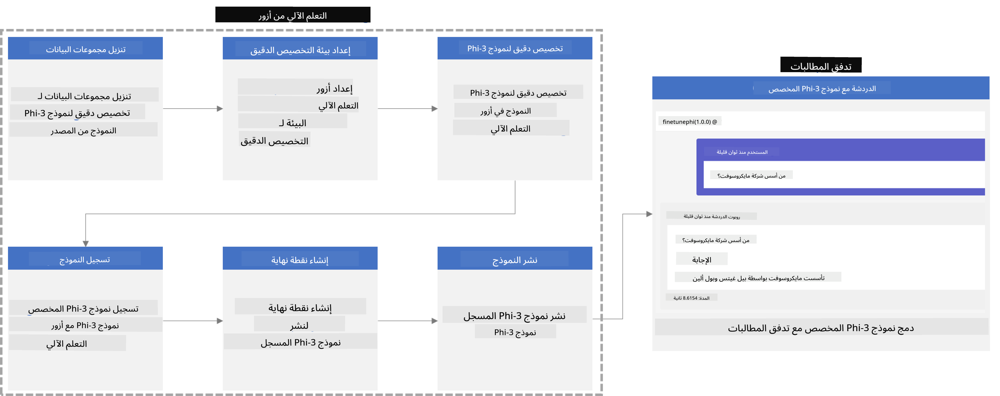
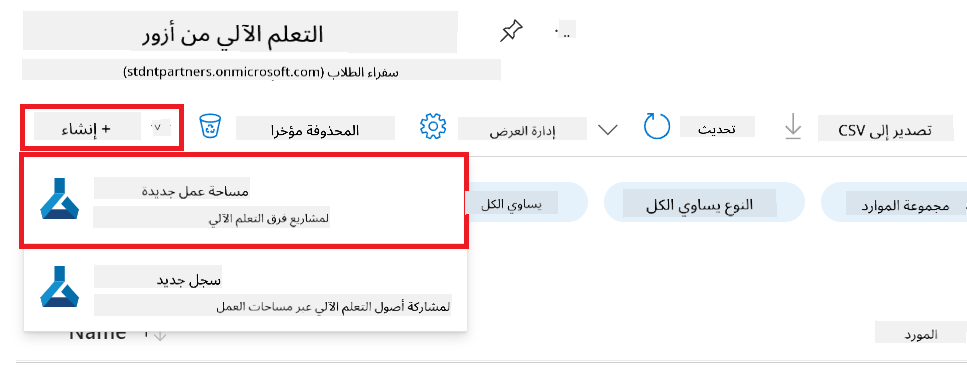
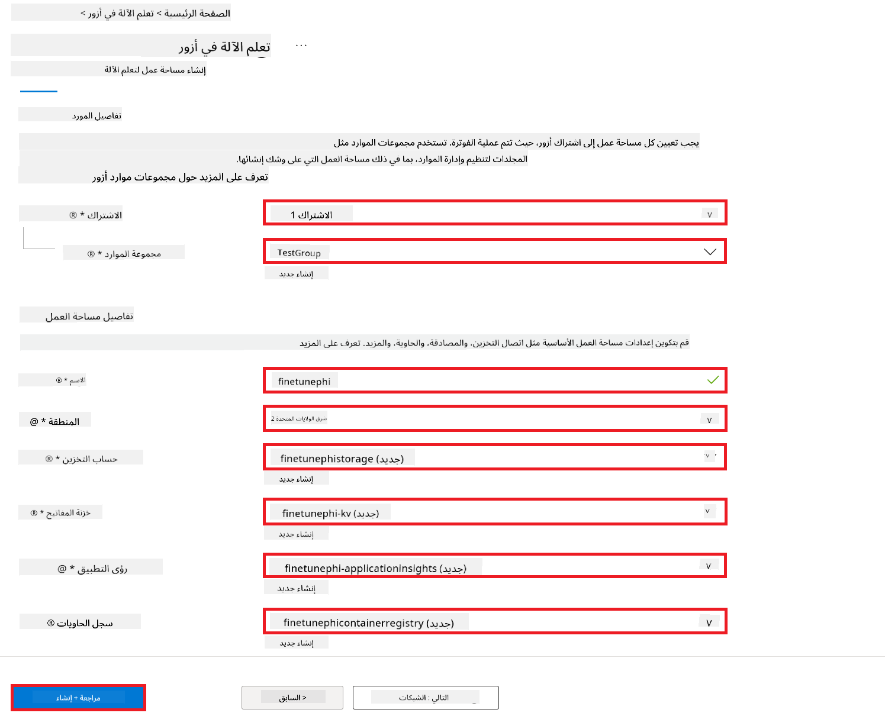
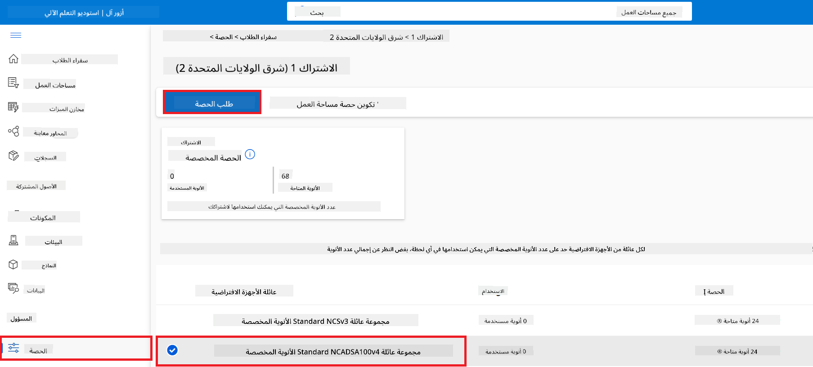
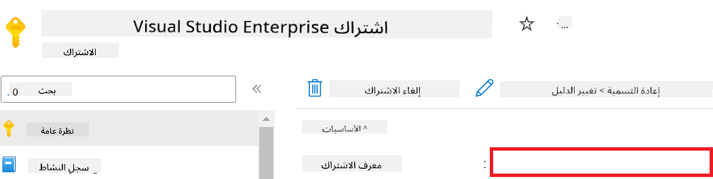
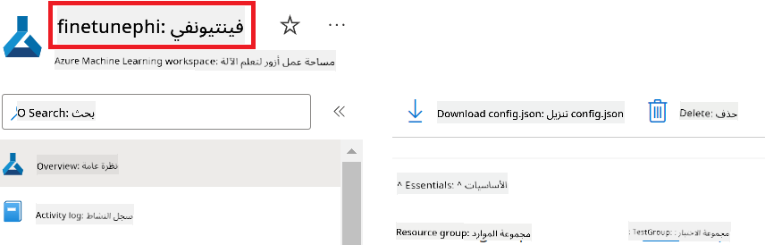
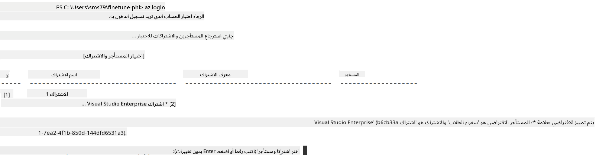
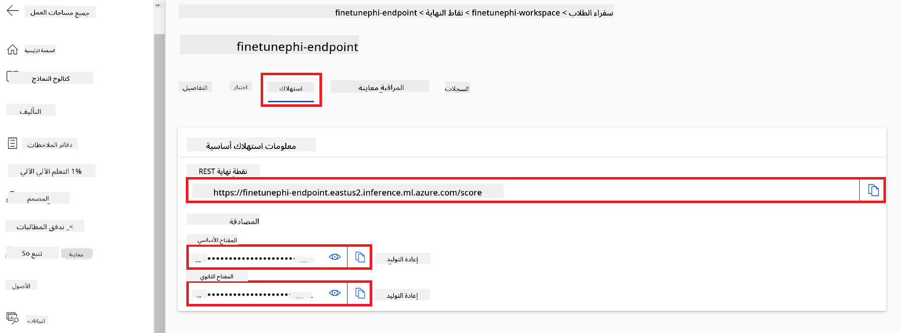
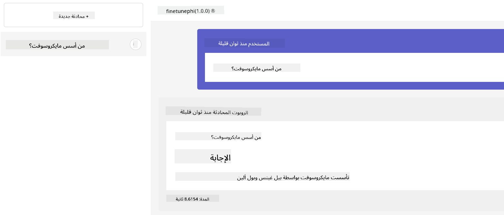

<!--
CO_OP_TRANSLATOR_METADATA:
{
  "original_hash": "7ca2c30fdb802664070e9cfbf92e24fe",
  "translation_date": "2026-01-05T08:31:04+00:00",
  "source_file": "md/02.Application/01.TextAndChat/Phi3/E2E_Phi-3-FineTuning_PromptFlow_Integration.md",
  "language_code": "ar"
}
-->
# تعديل وتكامل نماذج Phi-3 المخصصة مع Prompt flow

يعتمد هذا المثال الشامل (E2E) على الدليل "[تعديل وتكامل نماذج Phi-3 المخصصة مع Prompt Flow: دليل خطوة بخطوة](https://techcommunity.microsoft.com/t5/educator-developer-blog/fine-tune-and-integrate-custom-phi-3-models-with-prompt-flow/ba-p/4178612?WT.mc_id=aiml-137032-kinfeylo)" من مجتمع Microsoft Tech. يقدم العمليات الخاصة بتعديل النماذج بنعومة، نشرها، وتكامل نماذج Phi-3 المخصصة مع Prompt flow.

## نظرة عامة

في هذا المثال الشامل، ستتعلم كيفية تعديل نموذج Phi-3 ودمجه مع Prompt flow. من خلال الاستفادة من Azure Machine Learning و Prompt flow، ستؤسس سير عمل لنشر واستخدام نماذج الذكاء الاصطناعي المخصصة. ينقسم هذا المثال إلى ثلاث سيناريوهات:

**السيناريو 1: إعداد موارد Azure والاستعداد للتعديل**

**السيناريو 2: تعديل نموذج Phi-3 ونشره في Azure Machine Learning Studio**

**السيناريو 3: التكامل مع Prompt flow والدردشة مع نموذجك المخصص**

إليك نظرة عامة على هذا المثال الشامل.



### جدول المحتويات

1. **[السيناريو 1: إعداد موارد Azure والاستعداد للتعديل](../../../../../../md/02.Application/01.TextAndChat/Phi3)**
    - [إنشاء مساحة عمل Azure Machine Learning](../../../../../../md/02.Application/01.TextAndChat/Phi3)
    - [طلب حصص GPU في اشتراك Azure](../../../../../../md/02.Application/01.TextAndChat/Phi3)
    - [إضافة تعيين الدور](../../../../../../md/02.Application/01.TextAndChat/Phi3)
    - [إعداد المشروع](../../../../../../md/02.Application/01.TextAndChat/Phi3)
    - [تحضير مجموعة البيانات للتعديل](../../../../../../md/02.Application/01.TextAndChat/Phi3)

1. **[السيناريو 2: تعديل نموذج Phi-3 ونشره في Azure Machine Learning Studio](../../../../../../md/02.Application/01.TextAndChat/Phi3)**
    - [إعداد Azure CLI](../../../../../../md/02.Application/01.TextAndChat/Phi3)
    - [تعديل نموذج Phi-3](../../../../../../md/02.Application/01.TextAndChat/Phi3)
    - [نشر النموذج المعدل](../../../../../../md/02.Application/01.TextAndChat/Phi3)

1. **[السيناريو 3: التكامل مع Prompt flow والدردشة مع نموذجك المخصص](../../../../../../md/02.Application/01.TextAndChat/Phi3)**
    - [دمج نموذج Phi-3 المخصص مع Prompt flow](../../../../../../md/02.Application/01.TextAndChat/Phi3)
    - [الدردشة مع نموذجك المخصص](../../../../../../md/02.Application/01.TextAndChat/Phi3)

## السيناريو 1: إعداد موارد Azure والاستعداد للتعديل

### إنشاء مساحة عمل Azure Machine Learning

1. اكتب *azure machine learning* في **شريط البحث** في أعلى صفحة البوابة واختر **Azure Machine Learning** من الخيارات التي تظهر.

    

1. اختر **+ إنشاء** من قائمة التنقل.

1. اختر **مساحة عمل جديدة** من قائمة التنقل.

    

1. قم بالمهام التالية:

    - اختر **الاشتراك** الخاص بك في Azure.
    - اختر **مجموعة الموارد** التي ستستخدمها (أنشئ واحدة جديدة إذا لزم الأمر).
    - أدخل **اسم مساحة العمل**. يجب أن تكون قيمة فريدة.
    - اختر **المنطقة** التي تود استخدامها.
    - اختر **حساب التخزين** الذي ستستخدمه (أنشئ حسابًا جديدًا إذا لزم الأمر).
    - اختر **المخزن الرئيسي للمفاتيح (Key vault)** الذي ستستخدمه (أنشئ واحدًا جديدًا إذا لزم الأمر).
    - اختر **Application insights** التي ستستخدمها (أنشئ واحدة جديدة إذا لزم الأمر).
    - اختر **سجل الحاويات (Container registry)** الذي ستستخدمه (أنشئ واحدًا جديدًا إذا لزم الأمر).

    

1. اختر **مراجعة + إنشاء**.

1. اختر **إنشاء**.

### طلب حصص GPU في اشتراك Azure

في هذا المثال الشامل، ستستخدم *Standard_NC24ads_A100_v4 GPU* للتعديل، والتي تتطلب طلب حصة، و*Standard_E4s_v3* CPU للنشر، والتي لا تحتاج لطلب حصة.

> [!NOTE]
>
> لا يحق لحسابات الاشتراك من نوع "الدفع حسب الاستخدام" (نوع الاشتراك القياسي) الحصول على تخصيص GPU؛ الاشتراكات الاستفادية غير مدعومة حاليًا.
>
> للمستخدمين الذين لديهم اشتراكات استفادية (مثل اشتراك Visual Studio Enterprise) أو الراغبين في تجربة عملية التعديل والنشر بسرعة، يقدم هذا الدليل أيضًا إرشادات لتعديل باستخدام مجموعة بيانات صغيرة باستخدام CPU. ومع ذلك، من المهم ملاحظة أن نتائج التعديل تكون أفضل بكثير عند استخدام GPU مع مجموعات بيانات أكبر.

1. زر [Azure ML Studio](https://ml.azure.com/home?wt.mc_id=studentamb_279723).

1. قم بالمهام التالية لطلب حصة *Standard NCADSA100v4 Family*:

    - اختر **الحصة (Quota)** من علامة الجانب الأيسر.
    - اختر **عائلة الآلة الافتراضية** التي تريد استخدامها. مثال، اختر **Standard NCADSA100v4 Family Cluster Dedicated vCPUs** والتي تشمل *Standard_NC24ads_A100_v4* GPU.
    - اختر **طلب الحصة** من قائمة التنقل.

        

    - في صفحة طلب الحصة، أدخل **الحد الأقصى للأنوية الجديدة** التي تريد استخدامها. مثلًا، 24.
    - في صفحة طلب الحصة، اختر **إرسال** لطلب حصة GPU.

> [!NOTE]
> يمكنك اختيار GPU أو CPU المناسب لاحتياجاتك بالرجوع إلى وثيقة [أحجام الآلات الافتراضية في Azure](https://learn.microsoft.com/azure/virtual-machines/sizes/overview?tabs=breakdownseries%2Cgeneralsizelist%2Ccomputesizelist%2Cmemorysizelist%2Cstoragesizelist%2Cgpusizelist%2Cfpgasizelist%2Chpcsizelist).

### إضافة تعيين الدور

لتعديل ونشر نماذجك، يجب أولاً إنشاء هوية مُدارة معينة للمستخدم (User Assigned Managed Identity - UAI) ومنحها الأذونات المناسبة. ستستخدم هذه الهوية للمصادقة أثناء النشر.

#### إنشاء هوية مُدارة معينه للمستخدم (UAI)

1. اكتب *managed identities* في **شريط البحث** في أعلى صفحة البوابة واختر **Managed Identities** من الخيارات التي تظهر.

    

1. اختر **+ إنشاء**.

    

1. قم بالمهام التالية:

    - اختر اشتراك Azure الخاص بك.
    - اختر مجموعة الموارد التي تريد استخدامها (أنشئ واحدة جديدة إذا لزم الأمر).
    - اختر المنطقة التي تريد استخدامها.
    - أدخل **الاسم**. يجب أن يكون قيمة فريدة.

1. اختر **مراجعة + إنشاء**.

1. اختر **+ إنشاء**.

#### إضافة تعيين دور "المساهم" إلى الهوية المُدارة

1. انتقل إلى مورد الهوية المُدارة الذي قمت بإنشائه.

1. اختر **تعيينات الأدوار في Azure (Azure role assignments)** من علامة الجانب الأيسر.

1. اختر **+ إضافة تعيين دور** من قائمة التنقل.

1. في صفحة إضافة تعيين دور، قم بالمهام التالية:
    - حدد **النطاق (Scope)** ليكون **مجموعة الموارد (Resource group)**.
    - اختر اشتراك Azure الخاص بك.
    - اختر مجموعة الموارد التي ستستخدمها.
    - اختر الدور **مساهم (Contributor)**.

    

1. اختر **حفظ**.

#### إضافة تعيين دور "قارئ بيانات تخزين الكائنات (Storage Blob Data Reader)" إلى الهوية المُدارة

1. اكتب *storage accounts* في **شريط البحث** في أعلى صفحة البوابة واختر **Storage accounts** من الخيارات التي تظهر.

    

1. اختر حساب التخزين المرتبط بمساحة عمل Azure Machine Learning التي أنشأتها. مثال، *finetunephistorage*.

1. قم بالمهام التالية للانتقال إلى صفحة إضافة تعيين الدور:

    - انتقل إلى حساب التخزين Azure الذي أنشأته.
    - اختر **التحكم في الوصول (IAM)** من علامة الجانب الأيسر.
    - اختر **+ إضافة** من قائمة التنقل.
    - اختر **إضافة تعيين دور** من قائمة التنقل.

    

1. في صفحة إضافة تعيين دور، قم بالمهام التالية:

    - في صفحة الدور، اكتب *Storage Blob Data Reader* في **شريط البحث** واختر **Storage Blob Data Reader** من الخيارات التي تظهر.
    - في صفحة الدور، اختر **التالي**.
    - في صفحة الأعضاء، اختر **تعيين الوصول إلى** **هوية مُدارة (Managed identity)**.
    - في صفحة الأعضاء، اختر **+ اختيار الأعضاء**.
    - في صفحة اختيار الهويات المُدارة، اختر اشتراك Azure الخاص بك.
    - في صفحة اختيار الهويات المُدارة، اختر **الهوية المُدارة** إلى **Manage Identity**.
    - في صفحة اختيار الهويات المُدارة، اختر الهوية المُدارة التي أنشأتها. مثال، *finetunephi-managedidentity*.
    - في صفحة اختيار الهويات المُدارة، اختر **تحديد**.

    

1. اختر **مراجعة + تعيين**.

#### إضافة تعيين دور AcrPull إلى الهوية المُدارة

1. اكتب *container registries* في **شريط البحث** في أعلى صفحة البوابة واختر **Container registries** من الخيارات التي تظهر.

    

1. اختر سجل الحاويات المرتبط بمساحة عمل Azure Machine Learning. مثال، *finetunephicontainerregistries*.

1. قم بالمهام التالية للانتقال إلى صفحة إضافة تعيين الدور:

    - اختر **التحكم في الوصول (IAM)** من علامة الجانب الأيسر.
    - اختر **+ إضافة** من قائمة التنقل.
    - اختر **إضافة تعيين دور** من قائمة التنقل.

1. في صفحة إضافة تعيين دور، قم بالمهام التالية:

    - في صفحة الدور، اكتب *AcrPull* في **شريط البحث** واختر **AcrPull** من الخيارات التي تظهر.
    - في صفحة الدور، اختر **التالي**.
    - في صفحة الأعضاء، اختر **تعيين الوصول إلى** **هوية مُدارة (Managed identity)**.
    - في صفحة الأعضاء، اختر **+ اختيار الأعضاء**.
    - في صفحة اختيار الهويات المُدارة، اختر اشتراك Azure الخاص بك.
    - في صفحة اختيار الهويات المُدارة، اختر **الهوية المُدارة** إلى **Manage Identity**.
    - في صفحة اختيار الهويات المُدارة، اختر الهوية المُدارة التي أنشأتها. مثال، *finetunephi-managedidentity*.
    - في صفحة اختيار الهويات المُدارة، اختر **تحديد**.
    - اختر **مراجعة + تعيين**.

### إعداد المشروع

الآن، ستقوم بإنشاء مجلد للعمل فيه وإعداد بيئة افتراضية لتطوير برنامج يتفاعل مع المستخدمين ويستخدم محفوظات الدردشة المخزنة في Azure Cosmos DB لإثراء ردوده.

#### إنشاء مجلد للعمل بداخله

1. افتح نافذة المحطة (Terminal) واكتب الأمر التالي لإنشاء مجلد باسم *finetune-phi* في المسار الافتراضي.

    ```console
    mkdir finetune-phi
    ```

1. اكتب الأمر التالي داخل المحطة للتنقل إلى مجلد *finetune-phi* الذي أنشأته.

    ```console
    cd finetune-phi
    ```

#### إنشاء بيئة افتراضية

1. اكتب الأمر التالي داخل المحطة لإنشاء بيئة افتراضية باسم *.venv*.

    ```console
    python -m venv .venv
    ```

1. اكتب الأمر التالي داخل المحطة لتفعيل البيئة الافتراضية.

    ```console
    .venv\Scripts\activate.bat
    ```

> [!NOTE]
>
> إذا نجح الأمر، يجب أن ترى *(.venv)* قبل موجه الأمر.

#### تثبيت الحزم المطلوبة

1. اكتب الأوامر التالية داخل المحطة لتثبيت الحزم المطلوبة.

    ```console
    pip install datasets==2.19.1
    pip install transformers==4.41.1
    pip install azure-ai-ml==1.16.0
    pip install torch==2.3.1
    pip install trl==0.9.4
    pip install promptflow==1.12.0
    ```

#### إنشاء ملفات المشروع
في هذا التمرين، سوف تقوم بإنشاء الملفات الأساسية لمشروعنا. تتضمن هذه الملفات سكريبتات لتحميل مجموعة البيانات، إعداد بيئة Azure Machine Learning، تحسين نموذج Phi-3، ونشر النموذج المحسن. ستقوم أيضًا بإنشاء ملف *conda.yml* لإعداد بيئة التحسين.

في هذا التمرين، سوف:

- إنشاء ملف *download_dataset.py* لتحميل مجموعة البيانات.
- إنشاء ملف *setup_ml.py* لإعداد بيئة Azure Machine Learning.
- إنشاء ملف *fine_tune.py* داخل مجلد *finetuning_dir* لتحسين نموذج Phi-3 باستخدام مجموعة البيانات.
- إنشاء ملف *conda.yml* لإعداد بيئة التحسين.
- إنشاء ملف *deploy_model.py* لنشر النموذج المحسن.
- إنشاء ملف *integrate_with_promptflow.py*، لدمج النموذج المحسن وتنفيذ النموذج باستخدام Prompt flow.
- إنشاء ملف flow.dag.yml، لإعداد هيكل سير العمل في Prompt flow.
- إنشاء ملف *config.py* لإدخال معلومات Azure الخاصة بك.

> [!NOTE]
>
> هيكل المجلد الكامل:
>
> ```text
> └── YourUserName
> .    └── finetune-phi
> .        ├── finetuning_dir
> .        │      └── fine_tune.py
> .        ├── conda.yml
> .        ├── config.py
> .        ├── deploy_model.py
> .        ├── download_dataset.py
> .        ├── flow.dag.yml
> .        ├── integrate_with_promptflow.py
> .        └── setup_ml.py
> ```

1. افتح **Visual Studio Code**.

1. اختر **File** من شريط القائمة.

1. اختر **Open Folder**.

1. اختر مجلد *finetune-phi* الذي قمت بإنشائه، والذي يقع في *C:\Users\yourUserName\finetune-phi*.

    

1. في الجزء الأيسر من Visual Studio Code، انقر بزر الماوس الأيمن واختر **New File** لإنشاء ملف جديد باسم *download_dataset.py*.

1. في الجزء الأيسر من Visual Studio Code، انقر بزر الماوس الأيمن واختر **New File** لإنشاء ملف جديد باسم *setup_ml.py*.

1. في الجزء الأيسر من Visual Studio Code، انقر بزر الماوس الأيمن واختر **New File** لإنشاء ملف جديد باسم *deploy_model.py*.

    

1. في الجزء الأيسر من Visual Studio Code، انقر بزر الماوس الأيمن واختر **New Folder** لإنشاء مجلد جديد باسم *finetuning_dir*.

1. في مجلد *finetuning_dir*، أنشئ ملفًا جديدًا باسم *fine_tune.py*.

#### إنشاء وضبط ملف *conda.yml*

1. في الجزء الأيسر من Visual Studio Code، انقر بزر الماوس الأيمن واختر **New File** لإنشاء ملف جديد باسم *conda.yml*.

1. أضف الكود التالي إلى ملف *conda.yml* لإعداد بيئة التحسين لنموذج Phi-3.

    ```yml
    name: phi-3-training-env
    channels:
      - defaults
      - conda-forge
    dependencies:
      - python=3.10
      - pip
      - numpy<2.0
      - pip:
          - torch==2.4.0
          - torchvision==0.19.0
          - trl==0.8.6
          - transformers==4.41
          - datasets==2.21.0
          - azureml-core==1.57.0
          - azure-storage-blob==12.19.0
          - azure-ai-ml==1.16
          - azure-identity==1.17.1
          - accelerate==0.33.0
          - mlflow==2.15.1
          - azureml-mlflow==1.57.0
    ```

#### إنشاء وضبط ملف *config.py*

1. في الجزء الأيسر من Visual Studio Code، انقر بزر الماوس الأيمن واختر **New File** لإنشاء ملف جديد باسم *config.py*.

1. أضف الكود التالي إلى ملف *config.py* لإدخال معلومات Azure الخاصة بك.

    ```python
    # إعدادات أزور
    AZURE_SUBSCRIPTION_ID = "your_subscription_id"
    AZURE_RESOURCE_GROUP_NAME = "your_resource_group_name" # "TestGroup"

    # إعدادات التعلم الآلي في أزور
    AZURE_ML_WORKSPACE_NAME = "your_workspace_name" # "finetunephi-workspace"

    # إعدادات الهوية المُدارة لأزور
    AZURE_MANAGED_IDENTITY_CLIENT_ID = "your_azure_managed_identity_client_id"
    AZURE_MANAGED_IDENTITY_NAME = "your_azure_managed_identity_name" # "finetunephi-mangedidentity"
    AZURE_MANAGED_IDENTITY_RESOURCE_ID = f"/subscriptions/{AZURE_SUBSCRIPTION_ID}/resourceGroups/{AZURE_RESOURCE_GROUP_NAME}/providers/Microsoft.ManagedIdentity/userAssignedIdentities/{AZURE_MANAGED_IDENTITY_NAME}"

    # مسارات ملفات مجموعة البيانات
    TRAIN_DATA_PATH = "data/train_data.jsonl"
    TEST_DATA_PATH = "data/test_data.jsonl"

    # إعدادات النموذج المُحسّن
    AZURE_MODEL_NAME = "your_fine_tuned_model_name" # "finetune-phi-model"
    AZURE_ENDPOINT_NAME = "your_fine_tuned_model_endpoint_name" # "finetune-phi-endpoint"
    AZURE_DEPLOYMENT_NAME = "your_fine_tuned_model_deployment_name" # "finetune-phi-deployment"

    AZURE_ML_API_KEY = "your_fine_tuned_model_api_key"
    AZURE_ML_ENDPOINT = "your_fine_tuned_model_endpoint_uri" # "https://{your-endpoint-name}.{your-region}.inference.ml.azure.com/score"
    ```

#### إضافة متغيرات بيئة Azure

1. قم بتنفيذ المهام التالية لإضافة معرف الاشتراك الخاص بك في Azure:

    - اكتب *subscriptions* في **شريط البحث** في أعلى صفحة البوابة واختر **Subscriptions** من الخيارات الظاهرة.
    - اختر الاشتراك في Azure الذي تستخدمه حاليًا.
    - انسخ والصق معرف الاشتراك في ملف *config.py*.

    

1. قم بتنفيذ المهام التالية لإضافة اسم مساحة العمل في Azure:

    - انتقل إلى مورد Azure Machine Learning الذي أنشأته.
    - انسخ والصق اسم الحساب الخاص بك في ملف *config.py*.

    

1. قم بتنفيذ المهام التالية لإضافة اسم مجموعة الموارد في Azure:

    - انتقل إلى مورد Azure Machine Learning الذي أنشأته.
    - انسخ والصق اسم مجموعة الموارد الخاص بك في ملف *config.py*.

    

2. قم بتنفيذ المهام التالية لإضافة اسم الهوية المُدارة في Azure

    - انتقل إلى مورد Managed Identities الذي أنشأته.
    - انسخ والصق اسم الهوية المُدارة في Azure في ملف *config.py*.

    

### إعداد مجموعة البيانات للتحسين

في هذا التمرين، سوف تقوم بتشغيل ملف *download_dataset.py* لتحميل مجموعات بيانات *ULTRACHAT_200k* إلى بيئتك المحلية. ثم ستستخدم هذه المجموعات لتحسين نموذج Phi-3 في Azure Machine Learning.

#### تحميل مجموعة البيانات الخاصة بك باستخدام *download_dataset.py*

1. افتح ملف *download_dataset.py* في Visual Studio Code.

1. أضف الكود التالي داخل *download_dataset.py*.

    ```python
    import json
    import os
    from datasets import load_dataset
    from config import (
        TRAIN_DATA_PATH,
        TEST_DATA_PATH)

    def load_and_split_dataset(dataset_name, config_name, split_ratio):
        """
        Load and split a dataset.
        """
        # تحميل مجموعة البيانات بالاسم المحدد، التكوين، ونسبة التقسيم
        dataset = load_dataset(dataset_name, config_name, split=split_ratio)
        print(f"Original dataset size: {len(dataset)}")
        
        # تقسيم مجموعة البيانات إلى مجموعات تدريب واختبار (٨٠٪ تدريب، ٢٠٪ اختبار)
        split_dataset = dataset.train_test_split(test_size=0.2)
        print(f"Train dataset size: {len(split_dataset['train'])}")
        print(f"Test dataset size: {len(split_dataset['test'])}")
        
        return split_dataset

    def save_dataset_to_jsonl(dataset, filepath):
        """
        Save a dataset to a JSONL file.
        """
        # إنشاء الدليل إذا لم يكن موجودًا
        os.makedirs(os.path.dirname(filepath), exist_ok=True)
        
        # فتح الملف بوضع الكتابة
        with open(filepath, 'w', encoding='utf-8') as f:
            # التكرار على كل سجل في مجموعة البيانات
            for record in dataset:
                # تفريغ السجل ككائن JSON وكتابته في الملف
                json.dump(record, f)
                # كتابة حرف سطر جديد لفصل السجلات
                f.write('\n')
        
        print(f"Dataset saved to {filepath}")

    def main():
        """
        Main function to load, split, and save the dataset.
        """
        # تحميل وتقسيم مجموعة بيانات ULTRACHAT_200k بتكوين ونسبة تقسيم محددة
        dataset = load_and_split_dataset("HuggingFaceH4/ultrachat_200k", 'default', 'train_sft[:1%]')
        
        # استخراج مجموعات بيانات التدريب والاختبار من التقسيم
        train_dataset = dataset['train']
        test_dataset = dataset['test']

        # حفظ مجموعة بيانات التدريب في ملف JSONL
        save_dataset_to_jsonl(train_dataset, TRAIN_DATA_PATH)
        
        # حفظ مجموعة بيانات الاختبار في ملف JSONL منفصل
        save_dataset_to_jsonl(test_dataset, TEST_DATA_PATH)

    if __name__ == "__main__":
        main()

    ```

> [!TIP]
>
> **إرشادات للتحسين باستخدام مجموعة بيانات صغيرة باستخدام وحدة معالجة مركزية CPU**
>
> إذا كنت ترغب في استخدام وحدة معالجة مركزية لتحسين النموذج، فإن هذا الأسلوب مثالي لأولئك الذين يمتلكون اشتراكات فائدة (مثل اشتراك Visual Studio Enterprise) أو لاختبار سريع لعملية التحسين والنشر.
>
> استبدل `dataset = load_and_split_dataset("HuggingFaceH4/ultrachat_200k", 'default', 'train_sft[:1%]')` بـ `dataset = load_and_split_dataset("HuggingFaceH4/ultrachat_200k", 'default', 'train_sft[:10]')`
>

1. اكتب الأمر التالي داخل طرفية الأوامر لتشغيل السكريبت وتحميل مجموعة البيانات إلى بيئتك المحلية.

    ```console
    python download_data.py
    ```

1. تحقق من حفظ مجموعات البيانات بنجاح في مجلد *finetune-phi/data* المحلي.

> [!NOTE]
>
> **حجم مجموعة البيانات ووقت التحسين**
>
> في هذا المثال شامل النهاية للنهاية (E2E)، تستخدم فقط 1% من مجموعة البيانات (`train_sft[:1%]`). هذا يقلل بشكل كبير من كمية البيانات، مما يسرِّع كلًا من تحميل البيانات وعمليات التحسين. يمكنك تعديل النسبة لإيجاد التوازن المناسب بين وقت التدريب وأداء النموذج. استخدام جزء أصغر من مجموعة البيانات يقلل من الوقت المطلوب للتحسين، مما يجعل العملية أكثر قابلية للإدارة لعينة شاملة النهاية للنهاية.

## السيناريو 2: تحسين نموذج Phi-3 ونشره في استوديو Azure Machine Learning

### إعداد Azure CLI

تحتاج إلى إعداد Azure CLI للمصادقة على بيئتك. يسمح لك Azure CLI بإدارة موارد Azure مباشرة من سطر الأوامر ويزودك بالأذونات اللازمة لـ Azure Machine Learning للوصول إلى هذه الموارد. للبدء، قم بتثبيت [Azure CLI](https://learn.microsoft.com/cli/azure/install-azure-cli)

1. افتح نافذة الطرفية واكتب الأمر التالي لتسجيل الدخول إلى حساب Azure الخاص بك.

    ```console
    az login
    ```

1. اختر حساب Azure الخاص بك للاستخدام.

1. اختر الاشتراك في Azure للاستخدام.

    

> [!TIP]
>
> إذا كنت تواجه مشكلة في تسجيل الدخول إلى Azure، جرب استخدام رمز الجهاز. افتح نافذة الطرفية واكتب الأمر التالي لتسجيل الدخول إلى حساب Azure الخاص بك:
>
> ```console
> az login --use-device-code
> ```
>

### تحسين نموذج Phi-3

في هذا التمرين، سوف تقوم بتحسين نموذج Phi-3 باستخدام مجموعة البيانات المتوفرة. أولاً، ستقوم بتعريف عملية التحسين في ملف *fine_tune.py*. ثم، ستقوم بضبط بيئة Azure Machine Learning وبدء عملية التحسين عن طريق تشغيل ملف *setup_ml.py*. هذا السكريبت يضمن أن تتم عملية التحسين داخل بيئة Azure Machine Learning.

بتشغيل *setup_ml.py*، ستقوم بتشغيل عملية التحسين في بيئة Azure Machine Learning.

#### أضف الكود إلى ملف *fine_tune.py*

1. انتقل إلى مجلد *finetuning_dir* وافتح ملف *fine_tune.py* في Visual Studio Code.

1. أضف الكود التالي داخل ملف *fine_tune.py*.

    ```python
    import argparse
    import sys
    import logging
    import os
    from datasets import load_dataset
    import torch
    import mlflow
    from transformers import AutoModelForCausalLM, AutoTokenizer, TrainingArguments
    from trl import SFTTrainer

    # لتجنب خطأ INVALID_PARAMETER_VALUE في MLflow، قم بتعطيل تكامل MLflow
    os.environ["DISABLE_MLFLOW_INTEGRATION"] = "True"

    # إعداد التسجيل
    logging.basicConfig(
        format="%(asctime)s - %(levelname)s - %(name)s - %(message)s",
        datefmt="%Y-%m-%d %H:%M:%S",
        handlers=[logging.StreamHandler(sys.stdout)],
        level=logging.WARNING
    )
    logger = logging.getLogger(__name__)

    def initialize_model_and_tokenizer(model_name, model_kwargs):
        """
        Initialize the model and tokenizer with the given pretrained model name and arguments.
        """
        model = AutoModelForCausalLM.from_pretrained(model_name, **model_kwargs)
        tokenizer = AutoTokenizer.from_pretrained(model_name)
        tokenizer.model_max_length = 2048
        tokenizer.pad_token = tokenizer.unk_token
        tokenizer.pad_token_id = tokenizer.convert_tokens_to_ids(tokenizer.pad_token)
        tokenizer.padding_side = 'right'
        return model, tokenizer

    def apply_chat_template(example, tokenizer):
        """
        Apply a chat template to tokenize messages in the example.
        """
        messages = example["messages"]
        if messages[0]["role"] != "system":
            messages.insert(0, {"role": "system", "content": ""})
        example["text"] = tokenizer.apply_chat_template(
            messages, tokenize=False, add_generation_prompt=False
        )
        return example

    def load_and_preprocess_data(train_filepath, test_filepath, tokenizer):
        """
        Load and preprocess the dataset.
        """
        train_dataset = load_dataset('json', data_files=train_filepath, split='train')
        test_dataset = load_dataset('json', data_files=test_filepath, split='train')
        column_names = list(train_dataset.features)

        train_dataset = train_dataset.map(
            apply_chat_template,
            fn_kwargs={"tokenizer": tokenizer},
            num_proc=10,
            remove_columns=column_names,
            desc="Applying chat template to train dataset",
        )

        test_dataset = test_dataset.map(
            apply_chat_template,
            fn_kwargs={"tokenizer": tokenizer},
            num_proc=10,
            remove_columns=column_names,
            desc="Applying chat template to test dataset",
        )

        return train_dataset, test_dataset

    def train_and_evaluate_model(train_dataset, test_dataset, model, tokenizer, output_dir):
        """
        Train and evaluate the model.
        """
        training_args = TrainingArguments(
            bf16=True,
            do_eval=True,
            output_dir=output_dir,
            eval_strategy="epoch",
            learning_rate=5.0e-06,
            logging_steps=20,
            lr_scheduler_type="cosine",
            num_train_epochs=3,
            overwrite_output_dir=True,
            per_device_eval_batch_size=4,
            per_device_train_batch_size=4,
            remove_unused_columns=True,
            save_steps=500,
            seed=0,
            gradient_checkpointing=True,
            gradient_accumulation_steps=1,
            warmup_ratio=0.2,
        )

        trainer = SFTTrainer(
            model=model,
            args=training_args,
            train_dataset=train_dataset,
            eval_dataset=test_dataset,
            max_seq_length=2048,
            dataset_text_field="text",
            tokenizer=tokenizer,
            packing=True
        )

        train_result = trainer.train()
        trainer.log_metrics("train", train_result.metrics)

        mlflow.transformers.log_model(
            transformers_model={"model": trainer.model, "tokenizer": tokenizer},
            artifact_path=output_dir,
        )

        tokenizer.padding_side = 'left'
        eval_metrics = trainer.evaluate()
        eval_metrics["eval_samples"] = len(test_dataset)
        trainer.log_metrics("eval", eval_metrics)

    def main(train_file, eval_file, model_output_dir):
        """
        Main function to fine-tune the model.
        """
        model_kwargs = {
            "use_cache": False,
            "trust_remote_code": True,
            "torch_dtype": torch.bfloat16,
            "device_map": None,
            "attn_implementation": "eager"
        }

        # pretrained_model_name = "microsoft/Phi-3-mini-4k-instruct"
        pretrained_model_name = "microsoft/Phi-3.5-mini-instruct"

        with mlflow.start_run():
            model, tokenizer = initialize_model_and_tokenizer(pretrained_model_name, model_kwargs)
            train_dataset, test_dataset = load_and_preprocess_data(train_file, eval_file, tokenizer)
            train_and_evaluate_model(train_dataset, test_dataset, model, tokenizer, model_output_dir)

    if __name__ == "__main__":
        parser = argparse.ArgumentParser()
        parser.add_argument("--train-file", type=str, required=True, help="Path to the training data")
        parser.add_argument("--eval-file", type=str, required=True, help="Path to the evaluation data")
        parser.add_argument("--model_output_dir", type=str, required=True, help="Directory to save the fine-tuned model")
        args = parser.parse_args()
        main(args.train_file, args.eval_file, args.model_output_dir)

    ```

1. قم بحفظ وإغلاق ملف *fine_tune.py*.

> [!TIP]
> **يمكنك تحسين نموذج Phi-3.5**
>
> في ملف *fine_tune.py*، يمكنك تغيير القيمة `pretrained_model_name` من `"microsoft/Phi-3-mini-4k-instruct"` إلى أي نموذج ترغب في تحسينه. على سبيل المثال، إذا قمت بتغييره إلى `"microsoft/Phi-3.5-mini-instruct"`، فستستخدم نموذج Phi-3.5-mini-instruct للتحسين. للعثور على اسم النموذج الذي تفضله واستخدامه، قم بزيارة [Hugging Face](https://huggingface.co/)، وابحث عن النموذج الذي تهتم به، ثم انسخ والصق اسمه في الحقل `pretrained_model_name` في سكريبتك.
>
> <image type="content" src="../../../../imgs/02/FineTuning-PromptFlow/finetunephi3.5.png" alt-text="تحسين Phi-3.5.">
>

#### أضف الكود إلى ملف *setup_ml.py*

1. افتح ملف *setup_ml.py* في Visual Studio Code.

1. أضف الكود التالي داخل *setup_ml.py*.

    ```python
    import logging
    from azure.ai.ml import MLClient, command, Input
    from azure.ai.ml.entities import Environment, AmlCompute
    from azure.identity import AzureCliCredential
    from config import (
        AZURE_SUBSCRIPTION_ID,
        AZURE_RESOURCE_GROUP_NAME,
        AZURE_ML_WORKSPACE_NAME,
        TRAIN_DATA_PATH,
        TEST_DATA_PATH
    )

    # ثوابت

    # قم بإلغاء تعليق الأسطر التالية لاستخدام وحدة معالجة مركزية للتدريب
    # COMPUTE_INSTANCE_TYPE = "Standard_E16s_v3" # وحدة المعالجة المركزية
    # COMPUTE_NAME = "cpu-e16s-v3"
    # DOCKER_IMAGE_NAME = "mcr.microsoft.com/azureml/openmpi4.1.0-ubuntu20.04:latest"

    # قم بإلغاء تعليق الأسطر التالية لاستخدام وحدة معالجة رسومات للتدريب
    COMPUTE_INSTANCE_TYPE = "Standard_NC24ads_A100_v4"
    COMPUTE_NAME = "gpu-nc24s-a100-v4"
    DOCKER_IMAGE_NAME = "mcr.microsoft.com/azureml/curated/acft-hf-nlp-gpu:59"

    CONDA_FILE = "conda.yml"
    LOCATION = "eastus2" # استبدل بموقع عنقود الحوسبة الخاص بك
    FINETUNING_DIR = "./finetuning_dir" # المسار إلى برنامج ضبط النموذج الدقيق
    TRAINING_ENV_NAME = "phi-3-training-environment" # اسم بيئة التدريب
    MODEL_OUTPUT_DIR = "./model_output" # المسار إلى دليل مخرجات النموذج في Azure ML

    # إعداد التسجيل لتتبع العملية
    logger = logging.getLogger(__name__)
    logging.basicConfig(
        format="%(asctime)s - %(levelname)s - %(name)s - %(message)s",
        datefmt="%Y-%m-%d %H:%M:%S",
        level=logging.WARNING
    )

    def get_ml_client():
        """
        Initialize the ML Client using Azure CLI credentials.
        """
        credential = AzureCliCredential()
        return MLClient(credential, AZURE_SUBSCRIPTION_ID, AZURE_RESOURCE_GROUP_NAME, AZURE_ML_WORKSPACE_NAME)

    def create_or_get_environment(ml_client):
        """
        Create or update the training environment in Azure ML.
        """
        env = Environment(
            image=DOCKER_IMAGE_NAME,  # صورة دوكر للبيئة
            conda_file=CONDA_FILE,  # ملف بيئة Conda
            name=TRAINING_ENV_NAME,  # اسم البيئة
        )
        return ml_client.environments.create_or_update(env)

    def create_or_get_compute_cluster(ml_client, compute_name, COMPUTE_INSTANCE_TYPE, location):
        """
        Create or update the compute cluster in Azure ML.
        """
        try:
            compute_cluster = ml_client.compute.get(compute_name)
            logger.info(f"Compute cluster '{compute_name}' already exists. Reusing it for the current run.")
        except Exception:
            logger.info(f"Compute cluster '{compute_name}' does not exist. Creating a new one with size {COMPUTE_INSTANCE_TYPE}.")
            compute_cluster = AmlCompute(
                name=compute_name,
                size=COMPUTE_INSTANCE_TYPE,
                location=location,
                tier="Dedicated",  # طبقة عنقود الحوسبة
                min_instances=0,  # الحد الأدنى لعدد الحالات
                max_instances=1  # الحد الأقصى لعدد الحالات
            )
            ml_client.compute.begin_create_or_update(compute_cluster).wait()  # الانتظار لإنشاء العنقود
        return compute_cluster

    def create_fine_tuning_job(env, compute_name):
        """
        Set up the fine-tuning job in Azure ML.
        """
        return command(
            code=FINETUNING_DIR,  # المسار إلى fine_tune.py
            command=(
                "python fine_tune.py "
                "--train-file ${{inputs.train_file}} "
                "--eval-file ${{inputs.eval_file}} "
                "--model_output_dir ${{inputs.model_output}}"
            ),
            environment=env,  # بيئة التدريب
            compute=compute_name,  # عنقود الحوسبة للاستخدام
            inputs={
                "train_file": Input(type="uri_file", path=TRAIN_DATA_PATH),  # المسار إلى ملف بيانات التدريب
                "eval_file": Input(type="uri_file", path=TEST_DATA_PATH),  # المسار إلى ملف بيانات التقييم
                "model_output": MODEL_OUTPUT_DIR
            }
        )

    def main():
        """
        Main function to set up and run the fine-tuning job in Azure ML.
        """
        # تهيئة عميل ML
        ml_client = get_ml_client()

        # إنشاء البيئة
        env = create_or_get_environment(ml_client)
        
        # إنشاء أو الحصول على عنقود الحوسبة الحالي
        create_or_get_compute_cluster(ml_client, COMPUTE_NAME, COMPUTE_INSTANCE_TYPE, LOCATION)

        # إنشاء وتقديم مهمة الضبط الدقيق
        job = create_fine_tuning_job(env, COMPUTE_NAME)
        returned_job = ml_client.jobs.create_or_update(job)  # تقديم المهمة
        ml_client.jobs.stream(returned_job.name)  # بث سجلات المهمة
        
        # التقاط اسم المهمة
        job_name = returned_job.name
        print(f"Job name: {job_name}")

    if __name__ == "__main__":
        main()

    ```

1. استبدل `COMPUTE_INSTANCE_TYPE`، و `COMPUTE_NAME`، و `LOCATION` بالتفاصيل الخاصة بك.

    ```python
   # قم بإلغاء التعليق عن الأسطر التالية لاستخدام وحدة معالجة الرسوميات للتدريب
    COMPUTE_INSTANCE_TYPE = "Standard_NC24ads_A100_v4"
    COMPUTE_NAME = "gpu-nc24s-a100-v4"
    ...
    LOCATION = "eastus2" # استبدل بموقع تجمع الحوسبة الخاص بك
    ```

> [!TIP]
>
> **إرشادات للتحسين باستخدام مجموعة بيانات صغيرة باستخدام وحدة معالجة مركزية CPU**
>
> إذا كنت ترغب في استخدام وحدة معالجة مركزية لتحسين النموذج، فإن هذا الأسلوب مثالي لأولئك الذين يمتلكون اشتراكات فائدة (مثل اشتراك Visual Studio Enterprise) أو لاختبار سريع لعملية التحسين والنشر.
>
> 1. افتح ملف *setup_ml*.
> 1. استبدل `COMPUTE_INSTANCE_TYPE`، و `COMPUTE_NAME`، و `DOCKER_IMAGE_NAME` بالتالي. إذا لم يكن لديك وصول إلى *Standard_E16s_v3*، يمكنك استخدام مثيل CPU معادل أو طلب حصة جديدة.
> 1. استبدل `LOCATION` بالتفاصيل الخاصة بك.
>
>    ```python
>    # Uncomment the following lines to use a CPU instance for training
>    COMPUTE_INSTANCE_TYPE = "Standard_E16s_v3" # cpu
>    COMPUTE_NAME = "cpu-e16s-v3"
>    DOCKER_IMAGE_NAME = "mcr.microsoft.com/azureml/openmpi4.1.0-ubuntu20.04:latest"
>    LOCATION = "eastus2" # Replace with the location of your compute cluster
>    ```
>

1. اكتب الأمر التالي لتشغيل سكريبت *setup_ml.py* وبدء عملية التحسين في Azure Machine Learning.

    ```python
    python setup_ml.py
    ```

1. في هذا التمرين، قمت بنجاح بتحسين نموذج Phi-3 باستخدام Azure Machine Learning. عبر تشغيل سكريبت *setup_ml.py*، قمت بإعداد بيئة Azure Machine Learning وبدأت عملية التحسين المعرفة في ملف *fine_tune.py*. يرجى ملاحظة أن عملية التحسين قد تستغرق وقتًا طويلاً. بعد تشغيل الأمر `python setup_ml.py`، تحتاج إلى الانتظار حتى تكتمل العملية. يمكنك مراقبة حالة مهمة التحسين بمتابعة الرابط المقدم في الطرفية إلى بوابة Azure Machine Learning.

    

### نشر النموذج المحسن

لدمج نموذج Phi-3 المحسن مع Prompt Flow، تحتاج إلى نشر النموذج لجعله متاحًا للاستدلال في الوقت الحقيقي. تتضمن هذه العملية تسجيل النموذج، إنشاء نقطة نهاية على الإنترنت، ونشر النموذج.

#### تحديد اسم النموذج واسم نقطة النهاية واسم النشر

1. افتح ملف *config.py*.

1. استبدل `AZURE_MODEL_NAME = "your_fine_tuned_model_name"` بالاسم المرغوب لنموذجك.

1. استبدل `AZURE_ENDPOINT_NAME = "your_fine_tuned_model_endpoint_name"` بالاسم المرغوب لنقطة النهاية الخاصة بك.

1. استبدل `AZURE_DEPLOYMENT_NAME = "your_fine_tuned_model_deployment_name"` بالاسم المرغوب للنشر الخاص بك.

#### أضف الكود إلى ملف *deploy_model.py*

تشغيل ملف *deploy_model.py* يؤتمت عملية النشر بأكملها. فهو يقوم بتسجيل النموذج، إنشاء نقطة نهاية، وتنفيذ النشر استنادًا إلى الإعدادات المحددة في ملف config.py، والذي يشمل اسم النموذج، اسم نقطة النهاية، واسم النشر.

1. افتح ملف *deploy_model.py* في Visual Studio Code.

1. أضف الكود التالي داخل *deploy_model.py*.

    ```python
    import logging
    from azure.identity import AzureCliCredential
    from azure.ai.ml import MLClient
    from azure.ai.ml.entities import Model, ProbeSettings, ManagedOnlineEndpoint, ManagedOnlineDeployment, IdentityConfiguration, ManagedIdentityConfiguration, OnlineRequestSettings
    from azure.ai.ml.constants import AssetTypes

    # استيرادات التهيئة
    from config import (
        AZURE_SUBSCRIPTION_ID,
        AZURE_RESOURCE_GROUP_NAME,
        AZURE_ML_WORKSPACE_NAME,
        AZURE_MANAGED_IDENTITY_RESOURCE_ID,
        AZURE_MANAGED_IDENTITY_CLIENT_ID,
        AZURE_MODEL_NAME,
        AZURE_ENDPOINT_NAME,
        AZURE_DEPLOYMENT_NAME
    )

    # الثوابت
    JOB_NAME = "your-job-name"
    COMPUTE_INSTANCE_TYPE = "Standard_E4s_v3"

    deployment_env_vars = {
        "SUBSCRIPTION_ID": AZURE_SUBSCRIPTION_ID,
        "RESOURCE_GROUP_NAME": AZURE_RESOURCE_GROUP_NAME,
        "UAI_CLIENT_ID": AZURE_MANAGED_IDENTITY_CLIENT_ID,
    }

    # إعداد التسجيل
    logging.basicConfig(
        format="%(asctime)s - %(levelname)s - %(name)s - %(message)s",
        datefmt="%Y-%m-%d %H:%M:%S",
        level=logging.DEBUG
    )
    logger = logging.getLogger(__name__)

    def get_ml_client():
        """Initialize and return the ML Client."""
        credential = AzureCliCredential()
        return MLClient(credential, AZURE_SUBSCRIPTION_ID, AZURE_RESOURCE_GROUP_NAME, AZURE_ML_WORKSPACE_NAME)

    def register_model(ml_client, model_name, job_name):
        """Register a new model."""
        model_path = f"azureml://jobs/{job_name}/outputs/artifacts/paths/model_output"
        logger.info(f"Registering model {model_name} from job {job_name} at path {model_path}.")
        run_model = Model(
            path=model_path,
            name=model_name,
            description="Model created from run.",
            type=AssetTypes.MLFLOW_MODEL,
        )
        model = ml_client.models.create_or_update(run_model)
        logger.info(f"Registered model ID: {model.id}")
        return model

    def delete_existing_endpoint(ml_client, endpoint_name):
        """Delete existing endpoint if it exists."""
        try:
            endpoint_result = ml_client.online_endpoints.get(name=endpoint_name)
            logger.info(f"Deleting existing endpoint {endpoint_name}.")
            ml_client.online_endpoints.begin_delete(name=endpoint_name).result()
            logger.info(f"Deleted existing endpoint {endpoint_name}.")
        except Exception as e:
            logger.info(f"No existing endpoint {endpoint_name} found to delete: {e}")

    def create_or_update_endpoint(ml_client, endpoint_name, description=""):
        """Create or update an endpoint."""
        delete_existing_endpoint(ml_client, endpoint_name)
        logger.info(f"Creating new endpoint {endpoint_name}.")
        endpoint = ManagedOnlineEndpoint(
            name=endpoint_name,
            description=description,
            identity=IdentityConfiguration(
                type="user_assigned",
                user_assigned_identities=[ManagedIdentityConfiguration(resource_id=AZURE_MANAGED_IDENTITY_RESOURCE_ID)]
            )
        )
        endpoint_result = ml_client.online_endpoints.begin_create_or_update(endpoint).result()
        logger.info(f"Created new endpoint {endpoint_name}.")
        return endpoint_result

    def create_or_update_deployment(ml_client, endpoint_name, deployment_name, model):
        """Create or update a deployment."""

        logger.info(f"Creating deployment {deployment_name} for endpoint {endpoint_name}.")
        deployment = ManagedOnlineDeployment(
            name=deployment_name,
            endpoint_name=endpoint_name,
            model=model.id,
            instance_type=COMPUTE_INSTANCE_TYPE,
            instance_count=1,
            environment_variables=deployment_env_vars,
            request_settings=OnlineRequestSettings(
                max_concurrent_requests_per_instance=3,
                request_timeout_ms=180000,
                max_queue_wait_ms=120000
            ),
            liveness_probe=ProbeSettings(
                failure_threshold=30,
                success_threshold=1,
                period=100,
                initial_delay=500,
            ),
            readiness_probe=ProbeSettings(
                failure_threshold=30,
                success_threshold=1,
                period=100,
                initial_delay=500,
            ),
        )
        deployment_result = ml_client.online_deployments.begin_create_or_update(deployment).result()
        logger.info(f"Created deployment {deployment.name} for endpoint {endpoint_name}.")
        return deployment_result

    def set_traffic_to_deployment(ml_client, endpoint_name, deployment_name):
        """Set traffic to the specified deployment."""
        try:
            # جلب تفاصيل نقطة النهاية الحالية
            endpoint = ml_client.online_endpoints.get(name=endpoint_name)
            
            # تسجيل تخصيص المرور الحالي لأغراض التصحيح
            logger.info(f"Current traffic allocation: {endpoint.traffic}")
            
            # تعيين تخصيص المرور للنشر
            endpoint.traffic = {deployment_name: 100}
            
            # تحديث نقطة النهاية بتخصيص المرور الجديد
            endpoint_poller = ml_client.online_endpoints.begin_create_or_update(endpoint)
            updated_endpoint = endpoint_poller.result()
            
            # تسجيل تخصيص المرور المحدث لأغراض التصحيح
            logger.info(f"Updated traffic allocation: {updated_endpoint.traffic}")
            logger.info(f"Set traffic to deployment {deployment_name} at endpoint {endpoint_name}.")
            return updated_endpoint
        except Exception as e:
            # تسجيل أي أخطاء تحدث أثناء العملية
            logger.error(f"Failed to set traffic to deployment: {e}")
            raise


    def main():
        ml_client = get_ml_client()

        registered_model = register_model(ml_client, AZURE_MODEL_NAME, JOB_NAME)
        logger.info(f"Registered model ID: {registered_model.id}")

        endpoint = create_or_update_endpoint(ml_client, AZURE_ENDPOINT_NAME, "Endpoint for finetuned Phi-3 model")
        logger.info(f"Endpoint {AZURE_ENDPOINT_NAME} is ready.")

        try:
            deployment = create_or_update_deployment(ml_client, AZURE_ENDPOINT_NAME, AZURE_DEPLOYMENT_NAME, registered_model)
            logger.info(f"Deployment {AZURE_DEPLOYMENT_NAME} is created for endpoint {AZURE_ENDPOINT_NAME}.")

            set_traffic_to_deployment(ml_client, AZURE_ENDPOINT_NAME, AZURE_DEPLOYMENT_NAME)
            logger.info(f"Traffic is set to deployment {AZURE_DEPLOYMENT_NAME} at endpoint {AZURE_ENDPOINT_NAME}.")
        except Exception as e:
            logger.error(f"Failed to create or update deployment: {e}")

    if __name__ == "__main__":
        main()

    ```

1. قم بتنفيذ المهام التالية للحصول على `JOB_NAME`:

    - انتقل إلى مورد Azure Machine Learning الذي أنشأته.
    - اختر **Studio web URL** لفتح مساحة عمل Azure Machine Learning.
    - اختر **Jobs** من علامة التبويب على الجانب الأيسر.
    - اختر التجربة الخاصة بالتحسين. على سبيل المثال، *finetunephi*.
    - اختر المهمة التي أنشأتها.
- انسخ و الصق اسم وظيفتك في `JOB_NAME = "your-job-name"` في ملف *deploy_model.py*.

1. استبدل `COMPUTE_INSTANCE_TYPE` بتفاصيلك الخاصة.

1. اكتب الأمر التالي لتشغيل سكريبت *deploy_model.py* وبدء عملية النشر في Azure Machine Learning.

    ```python
    python deploy_model.py
    ```

> [!WARNING]
> لتجنب رسوم إضافية على حسابك، تأكد من حذف نقطة النهاية التي تم إنشاؤها في مساحة عمل Azure Machine Learning.
>

#### تحقق من حالة النشر في مساحة عمل Azure Machine Learning

1. قم بزيارة [Azure ML Studio](https://ml.azure.com/home?wt.mc_id=studentamb_279723).

1. انتقل إلى مساحة عمل Azure Machine Learning التي قمت بإنشائها.

1. اختر **Studio web URL** لفتح مساحة عمل Azure Machine Learning.

1. اختر **Endpoints** من تبويب الجانب الأيسر.

    

2. اختر نقطة النهاية التي أنشأتها.

    

3. في هذه الصفحة، يمكنك إدارة نقاط النهاية التي تم إنشاؤها أثناء عملية النشر.

## السيناريو 3: التكامل مع Prompt flow والدردشة مع نموذجك المخصص

### دمج نموذج Phi-3 المخصص مع Prompt flow

بعد نشر نموذجك المعَدّل بنجاح، يمكنك الآن دمجه مع Prompt flow لاستخدام نموذجك في تطبيقات الوقت الحقيقي، مما يتيح مجموعة متنوعة من المهام التفاعلية باستخدام نموذج Phi-3 المخصص الخاص بك.

#### تعيين مفتاح api وعنوان URI لنقطة النهاية لنموذج Phi-3 المعَدّل

1. انتقل إلى مساحة عمل Azure Machine Learning التي أنشأتها.
1. اختر **Endpoints** من تبويب الجانب الأيسر.
1. اختر نقطة النهاية التي أنشأتها.
1. اختر **Consume** من قائمة التنقل.
1. انسخ والصق **REST endpoint** في ملف *config.py*، مع استبدال `AZURE_ML_ENDPOINT = "your_fine_tuned_model_endpoint_uri"` بـ **REST endpoint** الخاص بك.
1. انسخ والصق **المفتاح الأساسي** في ملف *config.py*، مع استبدال `AZURE_ML_API_KEY = "your_fine_tuned_model_api_key"` بـ **المفتاح الأساسي** الخاص بك.

    

#### أضف الكود إلى ملف *flow.dag.yml*

1. افتح ملف *flow.dag.yml* في Visual Studio Code.

1. أضف الكود التالي إلى *flow.dag.yml*.

    ```yml
    inputs:
      input_data:
        type: string
        default: "Who founded Microsoft?"

    outputs:
      answer:
        type: string
        reference: ${integrate_with_promptflow.output}

    nodes:
    - name: integrate_with_promptflow
      type: python
      source:
        type: code
        path: integrate_with_promptflow.py
      inputs:
        input_data: ${inputs.input_data}
    ```

#### أضف الكود إلى ملف *integrate_with_promptflow.py*

1. افتح ملف *integrate_with_promptflow.py* في Visual Studio Code.

1. أضف الكود التالي إلى *integrate_with_promptflow.py*.

    ```python
    import logging
    import requests
    from promptflow.core import tool
    import asyncio
    import platform
    from config import (
        AZURE_ML_ENDPOINT,
        AZURE_ML_API_KEY
    )

    # إعداد التسجيل
    logging.basicConfig(
        format="%(asctime)s - %(levelname)s - %(name)s - %(message)s",
        datefmt="%Y-%m-%d %H:%M:%S",
        level=logging.DEBUG
    )
    logger = logging.getLogger(__name__)

    def query_azml_endpoint(input_data: list, endpoint_url: str, api_key: str) -> str:
        """
        Send a request to the Azure ML endpoint with the given input data.
        """
        headers = {
            "Content-Type": "application/json",
            "Authorization": f"Bearer {api_key}"
        }
        data = {
            "input_data": [input_data],
            "params": {
                "temperature": 0.7,
                "max_new_tokens": 128,
                "do_sample": True,
                "return_full_text": True
            }
        }
        try:
            response = requests.post(endpoint_url, json=data, headers=headers)
            response.raise_for_status()
            result = response.json()[0]
            logger.info("Successfully received response from Azure ML Endpoint.")
            return result
        except requests.exceptions.RequestException as e:
            logger.error(f"Error querying Azure ML Endpoint: {e}")
            raise

    def setup_asyncio_policy():
        """
        Setup asyncio event loop policy for Windows.
        """
        if platform.system() == 'Windows':
            asyncio.set_event_loop_policy(asyncio.WindowsSelectorEventLoopPolicy())
            logger.info("Set Windows asyncio event loop policy.")

    @tool
    def my_python_tool(input_data: str) -> str:
        """
        Tool function to process input data and query the Azure ML endpoint.
        """
        setup_asyncio_policy()
        return query_azml_endpoint(input_data, AZURE_ML_ENDPOINT, AZURE_ML_API_KEY)

    ```

### الدردشة مع نموذجك المخصص

1. اكتب الأمر التالي لتشغيل سكريبت *deploy_model.py* وبدء عملية النشر في Azure Machine Learning.

    ```python
    pf flow serve --source ./ --port 8080 --host localhost
    ```

1. إليك مثال على النتائج: يمكنك الآن الدردشة مع نموذج Phi-3 المخصص الخاص بك. يُنصح بطرح الأسئلة بناءً على البيانات المستخدمة في التهيئة الدقيقة.

    

---

<!-- CO-OP TRANSLATOR DISCLAIMER START -->
**تنبيه**:
تمت ترجمة هذا المستند باستخدام خدمة الترجمة الآلية [Co-op Translator](https://github.com/Azure/co-op-translator). بينما نسعى لتحقيق الدقة، يرجى التنبه إلى أن الترجمات الآلية قد تحتوي على أخطاء أو عدم دقة. يجب اعتبار المستند الأصلي بلغته الأصلية المصدر الموثوق والمعتمد. للمعلومات الحرجة، يُنصح بالاعتماد على الترجمة البشرية المهنية. نحن غير مسؤولين عن أي سوء فهم أو تفسير ناتج عن استخدام هذه الترجمة.
<!-- CO-OP TRANSLATOR DISCLAIMER END -->