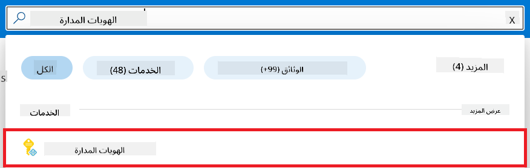
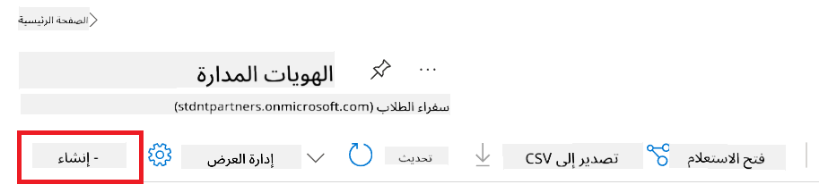
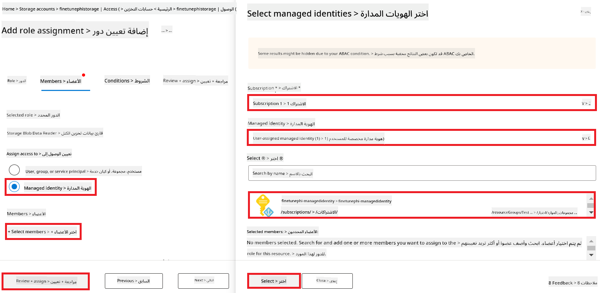
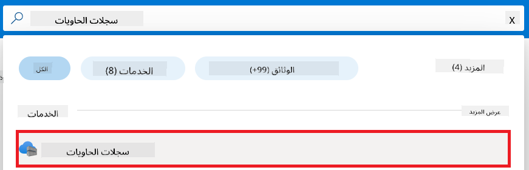
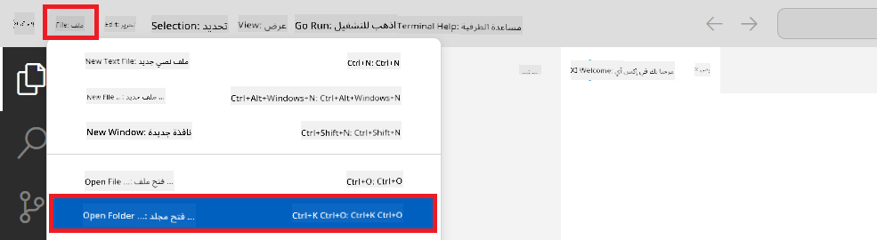
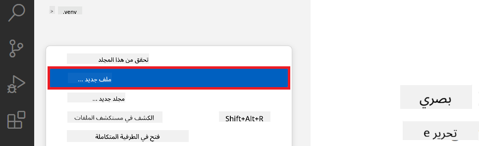
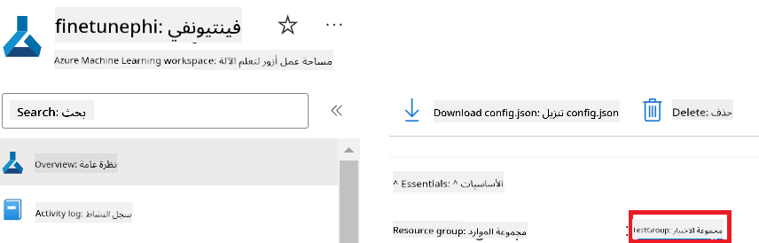
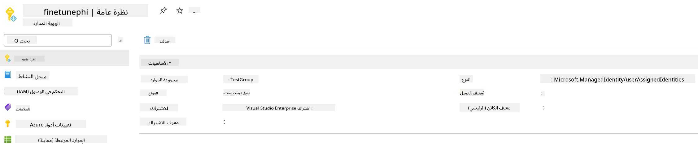
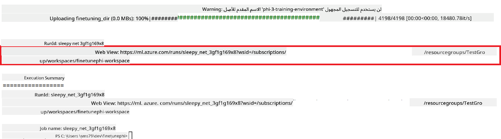
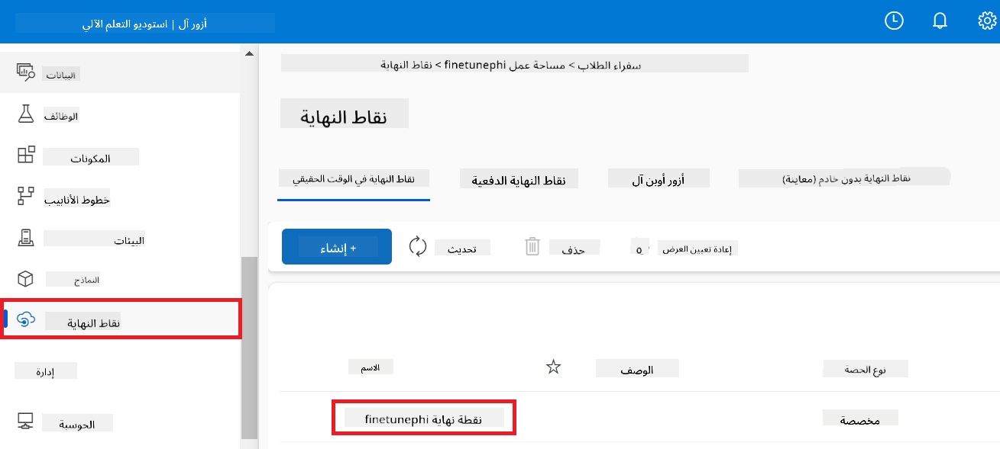

<!--
CO_OP_TRANSLATOR_METADATA:
{
  "original_hash": "455be2b7b9c3390d367d528f8fab2aa0",
  "translation_date": "2025-07-17T00:07:15+00:00",
  "source_file": "md/02.Application/01.TextAndChat/Phi3/E2E_Phi-3-FineTuning_PromptFlow_Integration.md",
  "language_code": "ar"
}
-->
# ضبط وتحسين نماذج Phi-3 المخصصة ودمجها مع Prompt flow

يعتمد هذا المثال الشامل (E2E) على الدليل "[ضبط وتحسين نماذج Phi-3 المخصصة مع Prompt Flow: دليل خطوة بخطوة](https://techcommunity.microsoft.com/t5/educator-developer-blog/fine-tune-and-integrate-custom-phi-3-models-with-prompt-flow/ba-p/4178612?WT.mc_id=aiml-137032-kinfeylo)" من مجتمع مايكروسوفت التقني. يشرح هذا المثال عمليات ضبط النماذج، نشرها، ودمج نماذج Phi-3 المخصصة مع Prompt flow.

## نظرة عامة

في هذا المثال الشامل، ستتعلم كيفية ضبط نموذج Phi-3 ودمجه مع Prompt flow. من خلال الاستفادة من Azure Machine Learning وPrompt flow، ستنشئ سير عمل لنشر واستخدام نماذج الذكاء الاصطناعي المخصصة. ينقسم هذا المثال إلى ثلاث سيناريوهات:

**السيناريو 1: إعداد موارد Azure والتحضير لعملية الضبط**

**السيناريو 2: ضبط نموذج Phi-3 ونشره في Azure Machine Learning Studio**

**السيناريو 3: الدمج مع Prompt flow والدردشة مع نموذجك المخصص**

فيما يلي نظرة عامة على هذا المثال الشامل.


### جدول المحتويات

1. **[السيناريو 1: إعداد موارد Azure والتحضير لعملية الضبط](../../../../../../md/02.Application/01.TextAndChat/Phi3)**
    - [إنشاء مساحة عمل Azure Machine Learning](../../../../../../md/02.Application/01.TextAndChat/Phi3)
    - [طلب حصص GPU في اشتراك Azure](../../../../../../md/02.Application/01.TextAndChat/Phi3)
    - [إضافة تعيين دور](../../../../../../md/02.Application/01.TextAndChat/Phi3)
    - [إعداد المشروع](../../../../../../md/02.Application/01.TextAndChat/Phi3)
    - [تحضير مجموعة البيانات للضبط](../../../../../../md/02.Application/01.TextAndChat/Phi3)

1. **[السيناريو 2: ضبط نموذج Phi-3 ونشره في Azure Machine Learning Studio](../../../../../../md/02.Application/01.TextAndChat/Phi3)**
    - [إعداد Azure CLI](../../../../../../md/02.Application/01.TextAndChat/Phi3)
    - [ضبط نموذج Phi-3](../../../../../../md/02.Application/01.TextAndChat/Phi3)
    - [نشر النموذج المضبوط](../../../../../../md/02.Application/01.TextAndChat/Phi3)

1. **[السيناريو 3: الدمج مع Prompt flow والدردشة مع نموذجك المخصص](../../../../../../md/02.Application/01.TextAndChat/Phi3)**
    - [دمج نموذج Phi-3 المخصص مع Prompt flow](../../../../../../md/02.Application/01.TextAndChat/Phi3)
    - [الدردشة مع نموذجك المخصص](../../../../../../md/02.Application/01.TextAndChat/Phi3)

## السيناريو 1: إعداد موارد Azure والتحضير لعملية الضبط

### إنشاء مساحة عمل Azure Machine Learning

1. اكتب *azure machine learning* في **شريط البحث** أعلى صفحة البوابة واختر **Azure Machine Learning** من الخيارات التي تظهر.

    

1. اختر **+ إنشاء** من قائمة التنقل.

1. اختر **مساحة عمل جديدة** من قائمة التنقل.

    

1. قم بالمهام التالية:

    - اختر **الاشتراك** الخاص بك في Azure.
    - اختر **مجموعة الموارد** التي تريد استخدامها (أنشئ واحدة جديدة إذا لزم الأمر).
    - أدخل **اسم مساحة العمل**. يجب أن يكون قيمة فريدة.
    - اختر **المنطقة** التي ترغب في استخدامها.
    - اختر **حساب التخزين** الذي تريد استخدامه (أنشئ واحدًا جديدًا إذا لزم الأمر).
    - اختر **مخزن المفاتيح** الذي تريد استخدامه (أنشئ واحدًا جديدًا إذا لزم الأمر).
    - اختر **Application insights** الذي تريد استخدامه (أنشئ واحدًا جديدًا إذا لزم الأمر).
    - اختر **سجل الحاويات** الذي تريد استخدامه (أنشئ واحدًا جديدًا إذا لزم الأمر).

    

1. اختر **مراجعة + إنشاء**.

1. اختر **إنشاء**.

### طلب حصص GPU في اشتراك Azure

في هذا المثال الشامل، ستستخدم *Standard_NC24ads_A100_v4 GPU* لعملية الضبط، والتي تتطلب طلب حصة، و*Standard_E4s_v3* CPU للنشر، والتي لا تتطلب طلب حصة.

> [!NOTE]
>
> فقط اشتراكات الدفع حسب الاستخدام (نوع الاشتراك القياسي) مؤهلة لتخصيص GPU؛ الاشتراكات المميزة غير مدعومة حاليًا.
>
> بالنسبة لأولئك الذين يستخدمون اشتراكات مميزة (مثل اشتراك Visual Studio Enterprise) أو الذين يرغبون في اختبار عملية الضبط والنشر بسرعة، يوفر هذا الدليل أيضًا إرشادات لضبط نموذج باستخدام مجموعة بيانات صغيرة باستخدام CPU. ومع ذلك، من المهم ملاحظة أن نتائج الضبط تكون أفضل بكثير عند استخدام GPU مع مجموعات بيانات أكبر.

1. قم بزيارة [Azure ML Studio](https://ml.azure.com/home?wt.mc_id=studentamb_279723).

1. قم بالمهام التالية لطلب حصة *Standard NCADSA100v4 Family*:

    - اختر **الحصة** من علامة التبويب على الجانب الأيسر.
    - اختر **عائلة الأجهزة الافتراضية** التي تريد استخدامها. على سبيل المثال، اختر **Standard NCADSA100v4 Family Cluster Dedicated vCPUs**، والتي تشمل *Standard_NC24ads_A100_v4* GPU.
    - اختر **طلب الحصة** من قائمة التنقل.

        

    - داخل صفحة طلب الحصة، أدخل **الحد الجديد للأنوية** التي ترغب في استخدامها. على سبيل المثال، 24.
    - داخل صفحة طلب الحصة، اختر **إرسال** لطلب حصة GPU.

> [!NOTE]
> يمكنك اختيار GPU أو CPU المناسب لاحتياجاتك بالرجوع إلى وثيقة [أحجام الأجهزة الافتراضية في Azure](https://learn.microsoft.com/azure/virtual-machines/sizes/overview?tabs=breakdownseries%2Cgeneralsizelist%2Ccomputesizelist%2Cmemorysizelist%2Cstoragesizelist%2Cgpusizelist%2Cfpgasizelist%2Chpcsizelist).

### إضافة تعيين دور

لضبط ونشر نماذجك، يجب أولاً إنشاء هوية مُدارة مخصصة للمستخدم (UAI) ومنحها الأذونات المناسبة. ستُستخدم هذه الهوية للمصادقة أثناء النشر.

#### إنشاء هوية مُدارة مخصصة للمستخدم (UAI)

1. اكتب *managed identities* في **شريط البحث** أعلى صفحة البوابة واختر **Managed Identities** من الخيارات التي تظهر.

    

1. اختر **+ إنشاء**.

    

1. قم بالمهام التالية:

    - اختر **الاشتراك** الخاص بك في Azure.
    - اختر **مجموعة الموارد** التي تريد استخدامها (أنشئ واحدة جديدة إذا لزم الأمر).
    - اختر **المنطقة** التي ترغب في استخدامها.
    - أدخل **الاسم**. يجب أن يكون قيمة فريدة.

1. اختر **مراجعة + إنشاء**.

1. اختر **+ إنشاء**.

#### إضافة تعيين دور Contributor إلى الهوية المُدارة

1. انتقل إلى مورد الهوية المُدارة الذي أنشأته.

1. اختر **تعيينات أدوار Azure** من علامة التبويب على الجانب الأيسر.

1. اختر **+ إضافة تعيين دور** من قائمة التنقل.

1. داخل صفحة إضافة تعيين دور، قم بالمهام التالية:
    - اختر **النطاق** إلى **مجموعة الموارد**.
    - اختر **الاشتراك** الخاص بك في Azure.
    - اختر **مجموعة الموارد** التي تريد استخدامها.
    - اختر **الدور** إلى **Contributor**.

    

1. اختر **حفظ**.

#### إضافة تعيين دور Storage Blob Data Reader إلى الهوية المُدارة

1. اكتب *storage accounts* في **شريط البحث** أعلى صفحة البوابة واختر **Storage accounts** من الخيارات التي تظهر.

    

1. اختر حساب التخزين المرتبط بمساحة عمل Azure Machine Learning التي أنشأتها. على سبيل المثال، *finetunephistorage*.

1. قم بالمهام التالية للانتقال إلى صفحة إضافة تعيين دور:

    - انتقل إلى حساب التخزين الذي أنشأته.
    - اختر **التحكم في الوصول (IAM)** من علامة التبويب على الجانب الأيسر.
    - اختر **+ إضافة** من قائمة التنقل.
    - اختر **إضافة تعيين دور** من قائمة التنقل.

    

1. داخل صفحة إضافة تعيين دور، قم بالمهام التالية:

    - داخل صفحة الدور، اكتب *Storage Blob Data Reader* في **شريط البحث** واختر **Storage Blob Data Reader** من الخيارات التي تظهر.
    - داخل صفحة الدور، اختر **التالي**.
    - داخل صفحة الأعضاء، اختر **تعيين الوصول إلى** **Managed identity**.
    - داخل صفحة الأعضاء، اختر **+ اختيار الأعضاء**.
    - داخل صفحة اختيار الهويات المُدارة، اختر **الاشتراك** الخاص بك في Azure.
    - داخل صفحة اختيار الهويات المُدارة، اختر **الهوية المُدارة** إلى **Manage Identity**.
    - داخل صفحة اختيار الهويات المُدارة، اختر الهوية المُدارة التي أنشأتها. على سبيل المثال، *finetunephi-managedidentity*.
    - داخل صفحة اختيار الهويات المُدارة، اختر **اختيار**.

    

1. اختر **مراجعة + تعيين**.

#### إضافة تعيين دور AcrPull إلى الهوية المُدارة

1. اكتب *container registries* في **شريط البحث** أعلى صفحة البوابة واختر **Container registries** من الخيارات التي تظهر.

    

1. اختر سجل الحاويات المرتبط بمساحة عمل Azure Machine Learning. على سبيل المثال، *finetunephicontainerregistries*

1. قم بالمهام التالية للانتقال إلى صفحة إضافة تعيين دور:

    - اختر **التحكم في الوصول (IAM)** من علامة التبويب على الجانب الأيسر.
    - اختر **+ إضافة** من قائمة التنقل.
    - اختر **إضافة تعيين دور** من قائمة التنقل.

1. داخل صفحة إضافة تعيين دور، قم بالمهام التالية:

    - داخل صفحة الدور، اكتب *AcrPull* في **شريط البحث** واختر **AcrPull** من الخيارات التي تظهر.
    - داخل صفحة الدور، اختر **التالي**.
    - داخل صفحة الأعضاء، اختر **تعيين الوصول إلى** **Managed identity**.
    - داخل صفحة الأعضاء، اختر **+ اختيار الأعضاء**.
    - داخل صفحة اختيار الهويات المُدارة، اختر **الاشتراك** الخاص بك في Azure.
    - داخل صفحة اختيار الهويات المُدارة، اختر **الهوية المُدارة** إلى **Manage Identity**.
    - داخل صفحة اختيار الهويات المُدارة، اختر الهوية المُدارة التي أنشأتها. على سبيل المثال، *finetunephi-managedidentity*.
    - داخل صفحة اختيار الهويات المُدارة، اختر **اختيار**.
    - اختر **مراجعة + تعيين**.

### إعداد المشروع

الآن، ستقوم بإنشاء مجلد للعمل بداخله وإعداد بيئة افتراضية لتطوير برنامج يتفاعل مع المستخدمين ويستخدم محفوظات الدردشة المخزنة من Azure Cosmos DB لإثراء ردوده.

#### إنشاء مجلد للعمل بداخله

1. افتح نافذة الطرفية واكتب الأمر التالي لإنشاء مجلد باسم *finetune-phi* في المسار الافتراضي.

    ```console
    mkdir finetune-phi
    ```

1. اكتب الأمر التالي داخل الطرفية للانتقال إلى مجلد *finetune-phi* الذي أنشأته.

    ```console
    cd finetune-phi
    ```

#### إنشاء بيئة افتراضية

1. اكتب الأمر التالي داخل الطرفية لإنشاء بيئة افتراضية باسم *.venv*.

    ```console
    python -m venv .venv
    ```

1. اكتب الأمر التالي داخل الطرفية لتفعيل البيئة الافتراضية.

    ```console
    .venv\Scripts\activate.bat
    ```
> [!NOTE]
>
> إذا نجح الأمر، يجب أن ترى *(.venv)* قبل موجه الأوامر.
#### تثبيت الحزم المطلوبة

1. اكتب الأوامر التالية داخل الطرفية لتثبيت الحزم المطلوبة.

    ```console
    pip install datasets==2.19.1
    pip install transformers==4.41.1
    pip install azure-ai-ml==1.16.0
    pip install torch==2.3.1
    pip install trl==0.9.4
    pip install promptflow==1.12.0
    ```

#### إنشاء ملفات المشروع

في هذا التمرين، ستقوم بإنشاء الملفات الأساسية لمشروعنا. تشمل هذه الملفات سكريبتات لتحميل مجموعة البيانات، إعداد بيئة Azure Machine Learning، ضبط نموذج Phi-3 بدقة، ونشر النموذج بعد ضبطه. كما ستقوم بإنشاء ملف *conda.yml* لإعداد بيئة الضبط الدقيق.

في هذا التمرين، ستقوم بـ:

- إنشاء ملف *download_dataset.py* لتحميل مجموعة البيانات.
- إنشاء ملف *setup_ml.py* لإعداد بيئة Azure Machine Learning.
- إنشاء ملف *fine_tune.py* داخل مجلد *finetuning_dir* لضبط نموذج Phi-3 باستخدام مجموعة البيانات.
- إنشاء ملف *conda.yml* لإعداد بيئة الضبط الدقيق.
- إنشاء ملف *deploy_model.py* لنشر النموذج بعد ضبطه.
- إنشاء ملف *integrate_with_promptflow.py* لدمج النموذج المضبوط وتنفيذه باستخدام Prompt flow.
- إنشاء ملف flow.dag.yml لإعداد هيكل سير العمل لـ Prompt flow.
- إنشاء ملف *config.py* لإدخال معلومات Azure.

> [!NOTE]
>
> هيكل المجلدات الكامل:
>
> ```text
> └── YourUserName
> .    └── finetune-phi
> .        ├── finetuning_dir
> .        │      └── fine_tune.py
> .        ├── conda.yml
> .        ├── config.py
> .        ├── deploy_model.py
> .        ├── download_dataset.py
> .        ├── flow.dag.yml
> .        ├── integrate_with_promptflow.py
> .        └── setup_ml.py
> ```

1. افتح **Visual Studio Code**.

1. اختر **File** من شريط القوائم.

1. اختر **Open Folder**.

1. اختر مجلد *finetune-phi* الذي أنشأته، والموجود في *C:\Users\yourUserName\finetune-phi*.

    

1. في الجزء الأيسر من Visual Studio Code، انقر بزر الماوس الأيمن واختر **New File** لإنشاء ملف جديد باسم *download_dataset.py*.

1. في الجزء الأيسر من Visual Studio Code، انقر بزر الماوس الأيمن واختر **New File** لإنشاء ملف جديد باسم *setup_ml.py*.

1. في الجزء الأيسر من Visual Studio Code، انقر بزر الماوس الأيمن واختر **New File** لإنشاء ملف جديد باسم *deploy_model.py*.

    

1. في الجزء الأيسر من Visual Studio Code، انقر بزر الماوس الأيمن واختر **New Folder** لإنشاء مجلد جديد باسم *finetuning_dir*.

1. داخل مجلد *finetuning_dir*، أنشئ ملفًا جديدًا باسم *fine_tune.py*.

#### إنشاء وتكوين ملف *conda.yml*

1. في الجزء الأيسر من Visual Studio Code، انقر بزر الماوس الأيمن واختر **New File** لإنشاء ملف جديد باسم *conda.yml*.

1. أضف الكود التالي إلى ملف *conda.yml* لإعداد بيئة الضبط الدقيق لنموذج Phi-3.

    ```yml
    name: phi-3-training-env
    channels:
      - defaults
      - conda-forge
    dependencies:
      - python=3.10
      - pip
      - numpy<2.0
      - pip:
          - torch==2.4.0
          - torchvision==0.19.0
          - trl==0.8.6
          - transformers==4.41
          - datasets==2.21.0
          - azureml-core==1.57.0
          - azure-storage-blob==12.19.0
          - azure-ai-ml==1.16
          - azure-identity==1.17.1
          - accelerate==0.33.0
          - mlflow==2.15.1
          - azureml-mlflow==1.57.0
    ```

#### إنشاء وتكوين ملف *config.py*

1. في الجزء الأيسر من Visual Studio Code، انقر بزر الماوس الأيمن واختر **New File** لإنشاء ملف جديد باسم *config.py*.

1. أضف الكود التالي إلى ملف *config.py* لإدخال معلومات Azure الخاصة بك.

    ```python
    # Azure settings
    AZURE_SUBSCRIPTION_ID = "your_subscription_id"
    AZURE_RESOURCE_GROUP_NAME = "your_resource_group_name" # "TestGroup"

    # Azure Machine Learning settings
    AZURE_ML_WORKSPACE_NAME = "your_workspace_name" # "finetunephi-workspace"

    # Azure Managed Identity settings
    AZURE_MANAGED_IDENTITY_CLIENT_ID = "your_azure_managed_identity_client_id"
    AZURE_MANAGED_IDENTITY_NAME = "your_azure_managed_identity_name" # "finetunephi-mangedidentity"
    AZURE_MANAGED_IDENTITY_RESOURCE_ID = f"/subscriptions/{AZURE_SUBSCRIPTION_ID}/resourceGroups/{AZURE_RESOURCE_GROUP_NAME}/providers/Microsoft.ManagedIdentity/userAssignedIdentities/{AZURE_MANAGED_IDENTITY_NAME}"

    # Dataset file paths
    TRAIN_DATA_PATH = "data/train_data.jsonl"
    TEST_DATA_PATH = "data/test_data.jsonl"

    # Fine-tuned model settings
    AZURE_MODEL_NAME = "your_fine_tuned_model_name" # "finetune-phi-model"
    AZURE_ENDPOINT_NAME = "your_fine_tuned_model_endpoint_name" # "finetune-phi-endpoint"
    AZURE_DEPLOYMENT_NAME = "your_fine_tuned_model_deployment_name" # "finetune-phi-deployment"

    AZURE_ML_API_KEY = "your_fine_tuned_model_api_key"
    AZURE_ML_ENDPOINT = "your_fine_tuned_model_endpoint_uri" # "https://{your-endpoint-name}.{your-region}.inference.ml.azure.com/score"
    ```

#### إضافة متغيرات بيئة Azure

1. قم بالمهام التالية لإضافة معرف اشتراك Azure:

    - اكتب *subscriptions* في **شريط البحث** أعلى صفحة البوابة واختر **Subscriptions** من الخيارات الظاهرة.
    - اختر اشتراك Azure الذي تستخدمه حاليًا.
    - انسخ والصق معرف الاشتراك في ملف *config.py*.

    

1. قم بالمهام التالية لإضافة اسم مساحة عمل Azure:

    - انتقل إلى مورد Azure Machine Learning الذي أنشأته.
    - انسخ والصق اسم حسابك في ملف *config.py*.

    

1. قم بالمهام التالية لإضافة اسم مجموعة موارد Azure:

    - انتقل إلى مورد Azure Machine Learning الذي أنشأته.
    - انسخ والصق اسم مجموعة موارد Azure في ملف *config.py*.

    

2. قم بالمهام التالية لإضافة اسم الهوية المُدارة لـ Azure

    - انتقل إلى مورد Managed Identities الذي أنشأته.
    - انسخ والصق اسم الهوية المُدارة في ملف *config.py*.

    

### تحضير مجموعة البيانات للضبط الدقيق

في هذا التمرين، ستشغل ملف *download_dataset.py* لتحميل مجموعة بيانات *ULTRACHAT_200k* إلى بيئتك المحلية. بعد ذلك، ستستخدم هذه المجموعة لضبط نموذج Phi-3 في Azure Machine Learning.

#### تحميل مجموعة البيانات باستخدام *download_dataset.py*

1. افتح ملف *download_dataset.py* في Visual Studio Code.

1. أضف الكود التالي داخل *download_dataset.py*.

    ```python
    import json
    import os
    from datasets import load_dataset
    from config import (
        TRAIN_DATA_PATH,
        TEST_DATA_PATH)

    def load_and_split_dataset(dataset_name, config_name, split_ratio):
        """
        Load and split a dataset.
        """
        # Load the dataset with the specified name, configuration, and split ratio
        dataset = load_dataset(dataset_name, config_name, split=split_ratio)
        print(f"Original dataset size: {len(dataset)}")
        
        # Split the dataset into train and test sets (80% train, 20% test)
        split_dataset = dataset.train_test_split(test_size=0.2)
        print(f"Train dataset size: {len(split_dataset['train'])}")
        print(f"Test dataset size: {len(split_dataset['test'])}")
        
        return split_dataset

    def save_dataset_to_jsonl(dataset, filepath):
        """
        Save a dataset to a JSONL file.
        """
        # Create the directory if it does not exist
        os.makedirs(os.path.dirname(filepath), exist_ok=True)
        
        # Open the file in write mode
        with open(filepath, 'w', encoding='utf-8') as f:
            # Iterate over each record in the dataset
            for record in dataset:
                # Dump the record as a JSON object and write it to the file
                json.dump(record, f)
                # Write a newline character to separate records
                f.write('\n')
        
        print(f"Dataset saved to {filepath}")

    def main():
        """
        Main function to load, split, and save the dataset.
        """
        # Load and split the ULTRACHAT_200k dataset with a specific configuration and split ratio
        dataset = load_and_split_dataset("HuggingFaceH4/ultrachat_200k", 'default', 'train_sft[:1%]')
        
        # Extract the train and test datasets from the split
        train_dataset = dataset['train']
        test_dataset = dataset['test']

        # Save the train dataset to a JSONL file
        save_dataset_to_jsonl(train_dataset, TRAIN_DATA_PATH)
        
        # Save the test dataset to a separate JSONL file
        save_dataset_to_jsonl(test_dataset, TEST_DATA_PATH)

    if __name__ == "__main__":
        main()

    ```

> [!TIP]
>
> **إرشادات للضبط الدقيق باستخدام مجموعة بيانات صغيرة على وحدة معالجة مركزية (CPU)**
>
> إذا كنت ترغب في استخدام وحدة معالجة مركزية للضبط الدقيق، فهذه الطريقة مناسبة لمن لديهم اشتراكات مميزة (مثل اشتراك Visual Studio Enterprise) أو لاختبار عملية الضبط والنشر بسرعة.
>
> استبدل `dataset = load_and_split_dataset("HuggingFaceH4/ultrachat_200k", 'default', 'train_sft[:1%]')` بـ `dataset = load_and_split_dataset("HuggingFaceH4/ultrachat_200k", 'default', 'train_sft[:10]')`
>

1. اكتب الأمر التالي داخل الطرفية لتشغيل السكريبت وتحميل مجموعة البيانات إلى بيئتك المحلية.

    ```console
    python download_data.py
    ```

1. تحقق من حفظ مجموعات البيانات بنجاح في مجلد *finetune-phi/data* المحلي.

> [!NOTE]
>
> **حجم مجموعة البيانات ووقت الضبط الدقيق**
>
> في هذا المثال الشامل، تستخدم فقط 1% من مجموعة البيانات (`train_sft[:1%]`). هذا يقلل بشكل كبير من حجم البيانات، مما يسرع من عمليات الرفع والضبط الدقيق. يمكنك تعديل النسبة لإيجاد التوازن المناسب بين وقت التدريب وأداء النموذج. استخدام جزء أصغر من مجموعة البيانات يقلل من الوقت المطلوب للضبط الدقيق، مما يجعل العملية أكثر سهولة في هذا المثال الشامل.

## السيناريو 2: ضبط نموذج Phi-3 ونشره في Azure Machine Learning Studio

### إعداد Azure CLI

تحتاج إلى إعداد Azure CLI للمصادقة على بيئتك. يسمح Azure CLI بإدارة موارد Azure مباشرة من سطر الأوامر ويوفر بيانات الاعتماد اللازمة لـ Azure Machine Learning للوصول إلى هذه الموارد. للبدء، قم بتثبيت [Azure CLI](https://learn.microsoft.com/cli/azure/install-azure-cli)

1. افتح نافذة طرفية واكتب الأمر التالي لتسجيل الدخول إلى حساب Azure الخاص بك.

    ```console
    az login
    ```

1. اختر حساب Azure الذي تريد استخدامه.

1. اختر اشتراك Azure الذي تريد استخدامه.

    

> [!TIP]
>
> إذا واجهت مشكلة في تسجيل الدخول إلى Azure، جرب استخدام رمز الجهاز. افتح نافذة طرفية واكتب الأمر التالي لتسجيل الدخول إلى حساب Azure الخاص بك:
>
> ```console
> az login --use-device-code
> ```
>

### ضبط نموذج Phi-3

في هذا التمرين، ستقوم بضبط نموذج Phi-3 باستخدام مجموعة البيانات المقدمة. أولاً، ستحدد عملية الضبط الدقيق في ملف *fine_tune.py*. ثم ستقوم بتكوين بيئة Azure Machine Learning وبدء عملية الضبط الدقيق بتشغيل ملف *setup_ml.py*. يضمن هذا السكريبت أن تتم عملية الضبط داخل بيئة Azure Machine Learning.

بتشغيل *setup_ml.py*، ستبدأ عملية الضبط الدقيق في بيئة Azure Machine Learning.

#### إضافة الكود إلى ملف *fine_tune.py*

1. انتقل إلى مجلد *finetuning_dir* وافتح ملف *fine_tune.py* في Visual Studio Code.

1. أضف الكود التالي داخل *fine_tune.py*.

    ```python
    import argparse
    import sys
    import logging
    import os
    from datasets import load_dataset
    import torch
    import mlflow
    from transformers import AutoModelForCausalLM, AutoTokenizer, TrainingArguments
    from trl import SFTTrainer

    # To avoid the INVALID_PARAMETER_VALUE error in MLflow, disable MLflow integration
    os.environ["DISABLE_MLFLOW_INTEGRATION"] = "True"

    # Logging setup
    logging.basicConfig(
        format="%(asctime)s - %(levelname)s - %(name)s - %(message)s",
        datefmt="%Y-%m-%d %H:%M:%S",
        handlers=[logging.StreamHandler(sys.stdout)],
        level=logging.WARNING
    )
    logger = logging.getLogger(__name__)

    def initialize_model_and_tokenizer(model_name, model_kwargs):
        """
        Initialize the model and tokenizer with the given pretrained model name and arguments.
        """
        model = AutoModelForCausalLM.from_pretrained(model_name, **model_kwargs)
        tokenizer = AutoTokenizer.from_pretrained(model_name)
        tokenizer.model_max_length = 2048
        tokenizer.pad_token = tokenizer.unk_token
        tokenizer.pad_token_id = tokenizer.convert_tokens_to_ids(tokenizer.pad_token)
        tokenizer.padding_side = 'right'
        return model, tokenizer

    def apply_chat_template(example, tokenizer):
        """
        Apply a chat template to tokenize messages in the example.
        """
        messages = example["messages"]
        if messages[0]["role"] != "system":
            messages.insert(0, {"role": "system", "content": ""})
        example["text"] = tokenizer.apply_chat_template(
            messages, tokenize=False, add_generation_prompt=False
        )
        return example

    def load_and_preprocess_data(train_filepath, test_filepath, tokenizer):
        """
        Load and preprocess the dataset.
        """
        train_dataset = load_dataset('json', data_files=train_filepath, split='train')
        test_dataset = load_dataset('json', data_files=test_filepath, split='train')
        column_names = list(train_dataset.features)

        train_dataset = train_dataset.map(
            apply_chat_template,
            fn_kwargs={"tokenizer": tokenizer},
            num_proc=10,
            remove_columns=column_names,
            desc="Applying chat template to train dataset",
        )

        test_dataset = test_dataset.map(
            apply_chat_template,
            fn_kwargs={"tokenizer": tokenizer},
            num_proc=10,
            remove_columns=column_names,
            desc="Applying chat template to test dataset",
        )

        return train_dataset, test_dataset

    def train_and_evaluate_model(train_dataset, test_dataset, model, tokenizer, output_dir):
        """
        Train and evaluate the model.
        """
        training_args = TrainingArguments(
            bf16=True,
            do_eval=True,
            output_dir=output_dir,
            eval_strategy="epoch",
            learning_rate=5.0e-06,
            logging_steps=20,
            lr_scheduler_type="cosine",
            num_train_epochs=3,
            overwrite_output_dir=True,
            per_device_eval_batch_size=4,
            per_device_train_batch_size=4,
            remove_unused_columns=True,
            save_steps=500,
            seed=0,
            gradient_checkpointing=True,
            gradient_accumulation_steps=1,
            warmup_ratio=0.2,
        )

        trainer = SFTTrainer(
            model=model,
            args=training_args,
            train_dataset=train_dataset,
            eval_dataset=test_dataset,
            max_seq_length=2048,
            dataset_text_field="text",
            tokenizer=tokenizer,
            packing=True
        )

        train_result = trainer.train()
        trainer.log_metrics("train", train_result.metrics)

        mlflow.transformers.log_model(
            transformers_model={"model": trainer.model, "tokenizer": tokenizer},
            artifact_path=output_dir,
        )

        tokenizer.padding_side = 'left'
        eval_metrics = trainer.evaluate()
        eval_metrics["eval_samples"] = len(test_dataset)
        trainer.log_metrics("eval", eval_metrics)

    def main(train_file, eval_file, model_output_dir):
        """
        Main function to fine-tune the model.
        """
        model_kwargs = {
            "use_cache": False,
            "trust_remote_code": True,
            "torch_dtype": torch.bfloat16,
            "device_map": None,
            "attn_implementation": "eager"
        }

        # pretrained_model_name = "microsoft/Phi-3-mini-4k-instruct"
        pretrained_model_name = "microsoft/Phi-3.5-mini-instruct"

        with mlflow.start_run():
            model, tokenizer = initialize_model_and_tokenizer(pretrained_model_name, model_kwargs)
            train_dataset, test_dataset = load_and_preprocess_data(train_file, eval_file, tokenizer)
            train_and_evaluate_model(train_dataset, test_dataset, model, tokenizer, model_output_dir)

    if __name__ == "__main__":
        parser = argparse.ArgumentParser()
        parser.add_argument("--train-file", type=str, required=True, help="Path to the training data")
        parser.add_argument("--eval-file", type=str, required=True, help="Path to the evaluation data")
        parser.add_argument("--model_output_dir", type=str, required=True, help="Directory to save the fine-tuned model")
        args = parser.parse_args()
        main(args.train_file, args.eval_file, args.model_output_dir)

    ```

1. احفظ وأغلق ملف *fine_tune.py*.

> [!TIP]
> **يمكنك ضبط نموذج Phi-3.5**
>
> في ملف *fine_tune.py*، يمكنك تغيير `pretrained_model_name` من `"microsoft/Phi-3-mini-4k-instruct"` إلى أي نموذج ترغب في ضبطه. على سبيل المثال، إذا غيرته إلى `"microsoft/Phi-3.5-mini-instruct"`، ستستخدم نموذج Phi-3.5-mini-instruct للضبط الدقيق. للعثور على اسم النموذج الذي تفضله واستخدامه، قم بزيارة [Hugging Face](https://huggingface.co/)، وابحث عن النموذج الذي تهتم به، ثم انسخ والصق اسمه في حقل `pretrained_model_name` في السكريبت الخاص بك.
>
> :::image type="content" source="../../imgs/03/FineTuning-PromptFlow/finetunephi3.5.png" alt-text="ضبط نموذج Phi-3.5.":::
>

#### إضافة الكود إلى ملف *setup_ml.py*

1. افتح ملف *setup_ml.py* في Visual Studio Code.

1. أضف الكود التالي داخل *setup_ml.py*.

    ```python
    import logging
    from azure.ai.ml import MLClient, command, Input
    from azure.ai.ml.entities import Environment, AmlCompute
    from azure.identity import AzureCliCredential
    from config import (
        AZURE_SUBSCRIPTION_ID,
        AZURE_RESOURCE_GROUP_NAME,
        AZURE_ML_WORKSPACE_NAME,
        TRAIN_DATA_PATH,
        TEST_DATA_PATH
    )

    # Constants

    # Uncomment the following lines to use a CPU instance for training
    # COMPUTE_INSTANCE_TYPE = "Standard_E16s_v3" # cpu
    # COMPUTE_NAME = "cpu-e16s-v3"
    # DOCKER_IMAGE_NAME = "mcr.microsoft.com/azureml/openmpi4.1.0-ubuntu20.04:latest"

    # Uncomment the following lines to use a GPU instance for training
    COMPUTE_INSTANCE_TYPE = "Standard_NC24ads_A100_v4"
    COMPUTE_NAME = "gpu-nc24s-a100-v4"
    DOCKER_IMAGE_NAME = "mcr.microsoft.com/azureml/curated/acft-hf-nlp-gpu:59"

    CONDA_FILE = "conda.yml"
    LOCATION = "eastus2" # Replace with the location of your compute cluster
    FINETUNING_DIR = "./finetuning_dir" # Path to the fine-tuning script
    TRAINING_ENV_NAME = "phi-3-training-environment" # Name of the training environment
    MODEL_OUTPUT_DIR = "./model_output" # Path to the model output directory in azure ml

    # Logging setup to track the process
    logger = logging.getLogger(__name__)
    logging.basicConfig(
        format="%(asctime)s - %(levelname)s - %(name)s - %(message)s",
        datefmt="%Y-%m-%d %H:%M:%S",
        level=logging.WARNING
    )

    def get_ml_client():
        """
        Initialize the ML Client using Azure CLI credentials.
        """
        credential = AzureCliCredential()
        return MLClient(credential, AZURE_SUBSCRIPTION_ID, AZURE_RESOURCE_GROUP_NAME, AZURE_ML_WORKSPACE_NAME)

    def create_or_get_environment(ml_client):
        """
        Create or update the training environment in Azure ML.
        """
        env = Environment(
            image=DOCKER_IMAGE_NAME,  # Docker image for the environment
            conda_file=CONDA_FILE,  # Conda environment file
            name=TRAINING_ENV_NAME,  # Name of the environment
        )
        return ml_client.environments.create_or_update(env)

    def create_or_get_compute_cluster(ml_client, compute_name, COMPUTE_INSTANCE_TYPE, location):
        """
        Create or update the compute cluster in Azure ML.
        """
        try:
            compute_cluster = ml_client.compute.get(compute_name)
            logger.info(f"Compute cluster '{compute_name}' already exists. Reusing it for the current run.")
        except Exception:
            logger.info(f"Compute cluster '{compute_name}' does not exist. Creating a new one with size {COMPUTE_INSTANCE_TYPE}.")
            compute_cluster = AmlCompute(
                name=compute_name,
                size=COMPUTE_INSTANCE_TYPE,
                location=location,
                tier="Dedicated",  # Tier of the compute cluster
                min_instances=0,  # Minimum number of instances
                max_instances=1  # Maximum number of instances
            )
            ml_client.compute.begin_create_or_update(compute_cluster).wait()  # Wait for the cluster to be created
        return compute_cluster

    def create_fine_tuning_job(env, compute_name):
        """
        Set up the fine-tuning job in Azure ML.
        """
        return command(
            code=FINETUNING_DIR,  # Path to fine_tune.py
            command=(
                "python fine_tune.py "
                "--train-file ${{inputs.train_file}} "
                "--eval-file ${{inputs.eval_file}} "
                "--model_output_dir ${{inputs.model_output}}"
            ),
            environment=env,  # Training environment
            compute=compute_name,  # Compute cluster to use
            inputs={
                "train_file": Input(type="uri_file", path=TRAIN_DATA_PATH),  # Path to the training data file
                "eval_file": Input(type="uri_file", path=TEST_DATA_PATH),  # Path to the evaluation data file
                "model_output": MODEL_OUTPUT_DIR
            }
        )

    def main():
        """
        Main function to set up and run the fine-tuning job in Azure ML.
        """
        # Initialize ML Client
        ml_client = get_ml_client()

        # Create Environment
        env = create_or_get_environment(ml_client)
        
        # Create or get existing compute cluster
        create_or_get_compute_cluster(ml_client, COMPUTE_NAME, COMPUTE_INSTANCE_TYPE, LOCATION)

        # Create and Submit Fine-Tuning Job
        job = create_fine_tuning_job(env, COMPUTE_NAME)
        returned_job = ml_client.jobs.create_or_update(job)  # Submit the job
        ml_client.jobs.stream(returned_job.name)  # Stream the job logs
        
        # Capture the job name
        job_name = returned_job.name
        print(f"Job name: {job_name}")

    if __name__ == "__main__":
        main()

    ```

1. استبدل `COMPUTE_INSTANCE_TYPE`، `COMPUTE_NAME`، و`LOCATION` بالتفاصيل الخاصة بك.

    ```python
   # Uncomment the following lines to use a GPU instance for training
    COMPUTE_INSTANCE_TYPE = "Standard_NC24ads_A100_v4"
    COMPUTE_NAME = "gpu-nc24s-a100-v4"
    ...
    LOCATION = "eastus2" # Replace with the location of your compute cluster
    ```

> [!TIP]
>
> **إرشادات للضبط الدقيق باستخدام مجموعة بيانات صغيرة على وحدة معالجة مركزية (CPU)**
>
> إذا كنت ترغب في استخدام وحدة معالجة مركزية للضبط الدقيق، فهذه الطريقة مناسبة لمن لديهم اشتراكات مميزة (مثل اشتراك Visual Studio Enterprise) أو لاختبار عملية الضبط والنشر بسرعة.
>
> 1. افتح ملف *setup_ml*.
> 1. استبدل `COMPUTE_INSTANCE_TYPE`، `COMPUTE_NAME`، و`DOCKER_IMAGE_NAME` بالتالي. إذا لم يكن لديك وصول إلى *Standard_E16s_v3*، يمكنك استخدام مثيل CPU مكافئ أو طلب حصة جديدة.
> 1. استبدل `LOCATION` بالتفاصيل الخاصة بك.
>
>    ```python
>    # Uncomment the following lines to use a CPU instance for training
>    COMPUTE_INSTANCE_TYPE = "Standard_E16s_v3" # cpu
>    COMPUTE_NAME = "cpu-e16s-v3"
>    DOCKER_IMAGE_NAME = "mcr.microsoft.com/azureml/openmpi4.1.0-ubuntu20.04:latest"
>    LOCATION = "eastus2" # Replace with the location of your compute cluster
>    ```
>

1. اكتب الأمر التالي لتشغيل سكريبت *setup_ml.py* وبدء عملية الضبط الدقيق في Azure Machine Learning.

    ```python
    python setup_ml.py
    ```

1. في هذا التمرين، نجحت في ضبط نموذج Phi-3 باستخدام Azure Machine Learning. بتشغيل سكريبت *setup_ml.py*، قمت بإعداد بيئة Azure Machine Learning وبدأت عملية الضبط الدقيق المعرفة في ملف *fine_tune.py*. يرجى ملاحظة أن عملية الضبط الدقيق قد تستغرق وقتًا طويلاً. بعد تشغيل الأمر `python setup_ml.py`، عليك الانتظار حتى تكتمل العملية. يمكنك متابعة حالة مهمة الضبط الدقيق عبر الرابط المقدم في الطرفية إلى بوابة Azure Machine Learning.

    

### نشر النموذج المضبوط

لدمج نموذج Phi-3 المضبوط مع Prompt Flow، تحتاج إلى نشر النموذج ليكون متاحًا للاستدلال في الوقت الحقيقي. تتضمن هذه العملية تسجيل النموذج، إنشاء نقطة نهاية عبر الإنترنت، ونشر النموذج.

#### تعيين اسم النموذج، اسم نقطة النهاية، واسم النشر للنشر

1. افتح ملف *config.py*.

1. استبدل `AZURE_MODEL_NAME = "your_fine_tuned_model_name"` بالاسم الذي تريده لنموذجك.

1. استبدل `AZURE_ENDPOINT_NAME = "your_fine_tuned_model_endpoint_name"` بالاسم الذي تريده لنقطة النهاية.

1. استبدل `AZURE_DEPLOYMENT_NAME = "your_fine_tuned_model_deployment_name"` بالاسم الذي تريده للنشر.

#### إضافة الكود إلى ملف *deploy_model.py*

تشغيل ملف *deploy_model.py* يقوم بأتمتة عملية النشر بالكامل. يسجل النموذج، ينشئ نقطة نهاية، وينفذ النشر بناءً على الإعدادات المحددة في ملف *config.py*، والتي تشمل اسم النموذج، اسم نقطة النهاية، واسم النشر.

1. افتح ملف *deploy_model.py* في Visual Studio Code.

1. أضف الكود التالي داخل *deploy_model.py*.

    ```python
    import logging
    from azure.identity import AzureCliCredential
    from azure.ai.ml import MLClient
    from azure.ai.ml.entities import Model, ProbeSettings, ManagedOnlineEndpoint, ManagedOnlineDeployment, IdentityConfiguration, ManagedIdentityConfiguration, OnlineRequestSettings
    from azure.ai.ml.constants import AssetTypes

    # Configuration imports
    from config import (
        AZURE_SUBSCRIPTION_ID,
        AZURE_RESOURCE_GROUP_NAME,
        AZURE_ML_WORKSPACE_NAME,
        AZURE_MANAGED_IDENTITY_RESOURCE_ID,
        AZURE_MANAGED_IDENTITY_CLIENT_ID,
        AZURE_MODEL_NAME,
        AZURE_ENDPOINT_NAME,
        AZURE_DEPLOYMENT_NAME
    )

    # Constants
    JOB_NAME = "your-job-name"
    COMPUTE_INSTANCE_TYPE = "Standard_E4s_v3"

    deployment_env_vars = {
        "SUBSCRIPTION_ID": AZURE_SUBSCRIPTION_ID,
        "RESOURCE_GROUP_NAME": AZURE_RESOURCE_GROUP_NAME,
        "UAI_CLIENT_ID": AZURE_MANAGED_IDENTITY_CLIENT_ID,
    }

    # Logging setup
    logging.basicConfig(
        format="%(asctime)s - %(levelname)s - %(name)s - %(message)s",
        datefmt="%Y-%m-%d %H:%M:%S",
        level=logging.DEBUG
    )
    logger = logging.getLogger(__name__)

    def get_ml_client():
        """Initialize and return the ML Client."""
        credential = AzureCliCredential()
        return MLClient(credential, AZURE_SUBSCRIPTION_ID, AZURE_RESOURCE_GROUP_NAME, AZURE_ML_WORKSPACE_NAME)

    def register_model(ml_client, model_name, job_name):
        """Register a new model."""
        model_path = f"azureml://jobs/{job_name}/outputs/artifacts/paths/model_output"
        logger.info(f"Registering model {model_name} from job {job_name} at path {model_path}.")
        run_model = Model(
            path=model_path,
            name=model_name,
            description="Model created from run.",
            type=AssetTypes.MLFLOW_MODEL,
        )
        model = ml_client.models.create_or_update(run_model)
        logger.info(f"Registered model ID: {model.id}")
        return model

    def delete_existing_endpoint(ml_client, endpoint_name):
        """Delete existing endpoint if it exists."""
        try:
            endpoint_result = ml_client.online_endpoints.get(name=endpoint_name)
            logger.info(f"Deleting existing endpoint {endpoint_name}.")
            ml_client.online_endpoints.begin_delete(name=endpoint_name).result()
            logger.info(f"Deleted existing endpoint {endpoint_name}.")
        except Exception as e:
            logger.info(f"No existing endpoint {endpoint_name} found to delete: {e}")

    def create_or_update_endpoint(ml_client, endpoint_name, description=""):
        """Create or update an endpoint."""
        delete_existing_endpoint(ml_client, endpoint_name)
        logger.info(f"Creating new endpoint {endpoint_name}.")
        endpoint = ManagedOnlineEndpoint(
            name=endpoint_name,
            description=description,
            identity=IdentityConfiguration(
                type="user_assigned",
                user_assigned_identities=[ManagedIdentityConfiguration(resource_id=AZURE_MANAGED_IDENTITY_RESOURCE_ID)]
            )
        )
        endpoint_result = ml_client.online_endpoints.begin_create_or_update(endpoint).result()
        logger.info(f"Created new endpoint {endpoint_name}.")
        return endpoint_result

    def create_or_update_deployment(ml_client, endpoint_name, deployment_name, model):
        """Create or update a deployment."""

        logger.info(f"Creating deployment {deployment_name} for endpoint {endpoint_name}.")
        deployment = ManagedOnlineDeployment(
            name=deployment_name,
            endpoint_name=endpoint_name,
            model=model.id,
            instance_type=COMPUTE_INSTANCE_TYPE,
            instance_count=1,
            environment_variables=deployment_env_vars,
            request_settings=OnlineRequestSettings(
                max_concurrent_requests_per_instance=3,
                request_timeout_ms=180000,
                max_queue_wait_ms=120000
            ),
            liveness_probe=ProbeSettings(
                failure_threshold=30,
                success_threshold=1,
                period=100,
                initial_delay=500,
            ),
            readiness_probe=ProbeSettings(
                failure_threshold=30,
                success_threshold=1,
                period=100,
                initial_delay=500,
            ),
        )
        deployment_result = ml_client.online_deployments.begin_create_or_update(deployment).result()
        logger.info(f"Created deployment {deployment.name} for endpoint {endpoint_name}.")
        return deployment_result

    def set_traffic_to_deployment(ml_client, endpoint_name, deployment_name):
        """Set traffic to the specified deployment."""
        try:
            # Fetch the current endpoint details
            endpoint = ml_client.online_endpoints.get(name=endpoint_name)
            
            # Log the current traffic allocation for debugging
            logger.info(f"Current traffic allocation: {endpoint.traffic}")
            
            # Set the traffic allocation for the deployment
            endpoint.traffic = {deployment_name: 100}
            
            # Update the endpoint with the new traffic allocation
            endpoint_poller = ml_client.online_endpoints.begin_create_or_update(endpoint)
            updated_endpoint = endpoint_poller.result()
            
            # Log the updated traffic allocation for debugging
            logger.info(f"Updated traffic allocation: {updated_endpoint.traffic}")
            logger.info(f"Set traffic to deployment {deployment_name} at endpoint {endpoint_name}.")
            return updated_endpoint
        except Exception as e:
            # Log any errors that occur during the process
            logger.error(f"Failed to set traffic to deployment: {e}")
            raise


    def main():
        ml_client = get_ml_client()

        registered_model = register_model(ml_client, AZURE_MODEL_NAME, JOB_NAME)
        logger.info(f"Registered model ID: {registered_model.id}")

        endpoint = create_or_update_endpoint(ml_client, AZURE_ENDPOINT_NAME, "Endpoint for finetuned Phi-3 model")
        logger.info(f"Endpoint {AZURE_ENDPOINT_NAME} is ready.")

        try:
            deployment = create_or_update_deployment(ml_client, AZURE_ENDPOINT_NAME, AZURE_DEPLOYMENT_NAME, registered_model)
            logger.info(f"Deployment {AZURE_DEPLOYMENT_NAME} is created for endpoint {AZURE_ENDPOINT_NAME}.")

            set_traffic_to_deployment(ml_client, AZURE_ENDPOINT_NAME, AZURE_DEPLOYMENT_NAME)
            logger.info(f"Traffic is set to deployment {AZURE_DEPLOYMENT_NAME} at endpoint {AZURE_ENDPOINT_NAME}.")
        except Exception as e:
            logger.error(f"Failed to create or update deployment: {e}")

    if __name__ == "__main__":
        main()

    ```

1. قم بالمهام التالية للحصول على `JOB_NAME`:

    - انتقل إلى مورد Azure Machine Learning الذي أنشأته.
    - اختر **Studio web URL** لفتح مساحة عمل Azure Machine Learning.
    - اختر **Jobs** من علامة التبويب الجانبية.
    - اختر التجربة الخاصة بالضبط الدقيق، مثل *finetunephi*.
    - اختر المهمة التي أنشأتها.
- انسخ والصق اسم وظيفتك في `JOB_NAME = "your-job-name"` في ملف *deploy_model.py*.

1. استبدل `COMPUTE_INSTANCE_TYPE` بالتفاصيل الخاصة بك.

1. اكتب الأمر التالي لتشغيل سكريبت *deploy_model.py* وبدء عملية النشر في Azure Machine Learning.

    ```python
    python deploy_model.py
    ```


> [!WARNING]
> لتجنب رسوم إضافية على حسابك، تأكد من حذف نقطة النهاية التي تم إنشاؤها في مساحة عمل Azure Machine Learning.
>

#### التحقق من حالة النشر في مساحة عمل Azure Machine Learning

1. قم بزيارة [Azure ML Studio](https://ml.azure.com/home?wt.mc_id=studentamb_279723).

1. انتقل إلى مساحة عمل Azure Machine Learning التي أنشأتها.

1. اختر **Studio web URL** لفتح مساحة عمل Azure Machine Learning.

1. اختر **Endpoints** من القائمة الجانبية.

    

2. اختر نقطة النهاية التي أنشأتها.

    

3. في هذه الصفحة، يمكنك إدارة نقاط النهاية التي تم إنشاؤها خلال عملية النشر.

## السيناريو 3: التكامل مع Prompt flow والدردشة مع نموذجك المخصص

### دمج نموذج Phi-3 المخصص مع Prompt flow

بعد نشر نموذجك المعدل بنجاح، يمكنك الآن دمجه مع Prompt flow لاستخدام نموذجك في التطبيقات الحية، مما يتيح مجموعة متنوعة من المهام التفاعلية مع نموذج Phi-3 المخصص الخاص بك.

#### تعيين مفتاح api و URI نقطة النهاية لنموذج Phi-3 المعدل

1. انتقل إلى مساحة عمل Azure Machine Learning التي أنشأتها.
1. اختر **Endpoints** من القائمة الجانبية.
1. اختر نقطة النهاية التي أنشأتها.
1. اختر **Consume** من قائمة التنقل.
1. انسخ والصق **REST endpoint** الخاص بك في ملف *config.py*، مع استبدال `AZURE_ML_ENDPOINT = "your_fine_tuned_model_endpoint_uri"` بـ **REST endpoint** الخاص بك.
1. انسخ والصق **المفتاح الأساسي** في ملف *config.py*، مع استبدال `AZURE_ML_API_KEY = "your_fine_tuned_model_api_key"` بـ **المفتاح الأساسي** الخاص بك.

    

#### إضافة الكود إلى ملف *flow.dag.yml*

1. افتح ملف *flow.dag.yml* في Visual Studio Code.

1. أضف الكود التالي إلى *flow.dag.yml*.

    ```yml
    inputs:
      input_data:
        type: string
        default: "Who founded Microsoft?"

    outputs:
      answer:
        type: string
        reference: ${integrate_with_promptflow.output}

    nodes:
    - name: integrate_with_promptflow
      type: python
      source:
        type: code
        path: integrate_with_promptflow.py
      inputs:
        input_data: ${inputs.input_data}
    ```

#### إضافة الكود إلى ملف *integrate_with_promptflow.py*

1. افتح ملف *integrate_with_promptflow.py* في Visual Studio Code.

1. أضف الكود التالي إلى *integrate_with_promptflow.py*.

    ```python
    import logging
    import requests
    from promptflow.core import tool
    import asyncio
    import platform
    from config import (
        AZURE_ML_ENDPOINT,
        AZURE_ML_API_KEY
    )

    # Logging setup
    logging.basicConfig(
        format="%(asctime)s - %(levelname)s - %(name)s - %(message)s",
        datefmt="%Y-%m-%d %H:%M:%S",
        level=logging.DEBUG
    )
    logger = logging.getLogger(__name__)

    def query_azml_endpoint(input_data: list, endpoint_url: str, api_key: str) -> str:
        """
        Send a request to the Azure ML endpoint with the given input data.
        """
        headers = {
            "Content-Type": "application/json",
            "Authorization": f"Bearer {api_key}"
        }
        data = {
            "input_data": [input_data],
            "params": {
                "temperature": 0.7,
                "max_new_tokens": 128,
                "do_sample": True,
                "return_full_text": True
            }
        }
        try:
            response = requests.post(endpoint_url, json=data, headers=headers)
            response.raise_for_status()
            result = response.json()[0]
            logger.info("Successfully received response from Azure ML Endpoint.")
            return result
        except requests.exceptions.RequestException as e:
            logger.error(f"Error querying Azure ML Endpoint: {e}")
            raise

    def setup_asyncio_policy():
        """
        Setup asyncio event loop policy for Windows.
        """
        if platform.system() == 'Windows':
            asyncio.set_event_loop_policy(asyncio.WindowsSelectorEventLoopPolicy())
            logger.info("Set Windows asyncio event loop policy.")

    @tool
    def my_python_tool(input_data: str) -> str:
        """
        Tool function to process input data and query the Azure ML endpoint.
        """
        setup_asyncio_policy()
        return query_azml_endpoint(input_data, AZURE_ML_ENDPOINT, AZURE_ML_API_KEY)

    ```

### الدردشة مع نموذجك المخصص

1. اكتب الأمر التالي لتشغيل سكريبت *deploy_model.py* وبدء عملية النشر في Azure Machine Learning.

    ```python
    pf flow serve --source ./ --port 8080 --host localhost
    ```

1. إليك مثال على النتائج: الآن يمكنك الدردشة مع نموذج Phi-3 المخصص الخاص بك. يُنصح بطرح أسئلة بناءً على البيانات المستخدمة في التعديل الدقيق.

    

**إخلاء المسؤولية**:  
تمت ترجمة هذا المستند باستخدام خدمة الترجمة الآلية [Co-op Translator](https://github.com/Azure/co-op-translator). بينما نسعى لتحقيق الدقة، يرجى العلم أن الترجمات الآلية قد تحتوي على أخطاء أو عدم دقة. يجب اعتبار المستند الأصلي بلغته الأصلية المصدر الموثوق به. للمعلومات الهامة، يُنصح بالاعتماد على الترجمة البشرية المهنية. نحن غير مسؤولين عن أي سوء فهم أو تفسير ناتج عن استخدام هذه الترجمة.