<!--
CO_OP_TRANSLATOR_METADATA:
{
  "original_hash": "ecbd9179a21edbaafaf114d47f09f3e3",
  "translation_date": "2025-07-17T01:00:54+00:00",
  "source_file": "md/02.Application/01.TextAndChat/Phi3/E2E_Phi-3-FineTuning_PromptFlow_Integration_AIFoundry.md",
  "language_code": "ar"
}
-->
# ضبط وتحسين نماذج Phi-3 المخصصة ودمجها مع Prompt flow في Azure AI Foundry

يعتمد هذا المثال الشامل (E2E) على الدليل "[ضبط وتحسين نماذج Phi-3 المخصصة مع Prompt Flow في Azure AI Foundry](https://techcommunity.microsoft.com/t5/educator-developer-blog/fine-tune-and-integrate-custom-phi-3-models-with-prompt-flow-in/ba-p/4191726?WT.mc_id=aiml-137032-kinfeylo)" من مجتمع Microsoft Tech. يشرح هذا الدليل عمليات ضبط النماذج، نشرها، ودمج نماذج Phi-3 المخصصة مع Prompt flow في Azure AI Foundry.  
على عكس المثال الشامل "[ضبط وتحسين ودمج نماذج Phi-3 المخصصة مع Prompt Flow](./E2E_Phi-3-FineTuning_PromptFlow_Integration.md)" الذي تضمن تشغيل الكود محليًا، يركز هذا الدليل بالكامل على ضبط ودمج النموذج داخل Azure AI / ML Studio.

## نظرة عامة

في هذا المثال الشامل، ستتعلم كيفية ضبط نموذج Phi-3 ودمجه مع Prompt flow في Azure AI Foundry. من خلال الاستفادة من Azure AI / ML Studio، ستنشئ سير عمل لنشر واستخدام نماذج الذكاء الاصطناعي المخصصة. ينقسم هذا المثال إلى ثلاث سيناريوهات:

**السيناريو 1: إعداد موارد Azure والتحضير لعملية الضبط**

**السيناريو 2: ضبط نموذج Phi-3 ونشره في Azure Machine Learning Studio**

**السيناريو 3: الدمج مع Prompt flow والدردشة مع نموذجك المخصص في Azure AI Foundry**

فيما يلي نظرة عامة على هذا المثال الشامل.

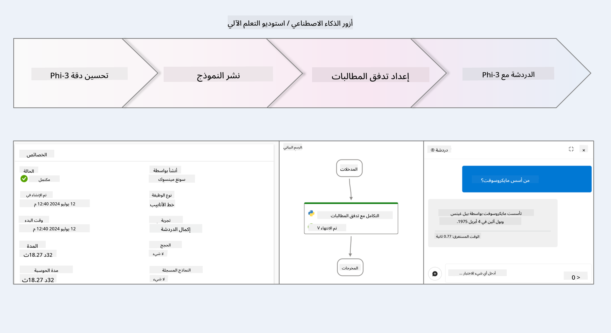

### جدول المحتويات

1. **[السيناريو 1: إعداد موارد Azure والتحضير لعملية الضبط](../../../../../../md/02.Application/01.TextAndChat/Phi3)**
    - [إنشاء مساحة عمل Azure Machine Learning](../../../../../../md/02.Application/01.TextAndChat/Phi3)
    - [طلب حصص GPU في اشتراك Azure](../../../../../../md/02.Application/01.TextAndChat/Phi3)
    - [إضافة تعيين دور](../../../../../../md/02.Application/01.TextAndChat/Phi3)
    - [إعداد المشروع](../../../../../../md/02.Application/01.TextAndChat/Phi3)
    - [تحضير مجموعة البيانات للضبط](../../../../../../md/02.Application/01.TextAndChat/Phi3)

1. **[السيناريو 2: ضبط نموذج Phi-3 ونشره في Azure Machine Learning Studio](../../../../../../md/02.Application/01.TextAndChat/Phi3)**
    - [ضبط نموذج Phi-3](../../../../../../md/02.Application/01.TextAndChat/Phi3)
    - [نشر نموذج Phi-3 بعد الضبط](../../../../../../md/02.Application/01.TextAndChat/Phi3)

1. **[السيناريو 3: الدمج مع Prompt flow والدردشة مع نموذجك المخصص في Azure AI Foundry](../../../../../../md/02.Application/01.TextAndChat/Phi3)**
    - [دمج نموذج Phi-3 المخصص مع Prompt flow](../../../../../../md/02.Application/01.TextAndChat/Phi3)
    - [الدردشة مع نموذج Phi-3 المخصص الخاص بك](../../../../../../md/02.Application/01.TextAndChat/Phi3)

## السيناريو 1: إعداد موارد Azure والتحضير لعملية الضبط

### إنشاء مساحة عمل Azure Machine Learning

1. اكتب *azure machine learning* في **شريط البحث** أعلى صفحة البوابة واختر **Azure Machine Learning** من الخيارات التي تظهر.

    

2. اختر **+ Create** من قائمة التنقل.

3. اختر **New workspace** من قائمة التنقل.

    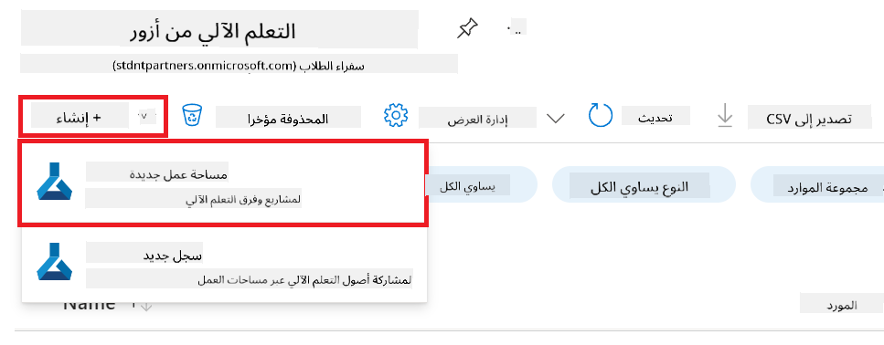

4. قم بالمهام التالية:

    - اختر **Subscription** الخاص بك في Azure.
    - اختر **Resource group** التي تريد استخدامها (يمكنك إنشاء واحدة جديدة إذا لزم الأمر).
    - أدخل **Workspace Name**. يجب أن يكون اسمًا فريدًا.
    - اختر **Region** التي ترغب في استخدامها.
    - اختر **Storage account** التي تريد استخدامها (يمكنك إنشاء واحدة جديدة إذا لزم الأمر).
    - اختر **Key vault** التي تريد استخدامها (يمكنك إنشاء واحدة جديدة إذا لزم الأمر).
    - اختر **Application insights** التي تريد استخدامها (يمكنك إنشاء واحدة جديدة إذا لزم الأمر).
    - اختر **Container registry** التي تريد استخدامها (يمكنك إنشاء واحدة جديدة إذا لزم الأمر).

    

5. اختر **Review + Create**.

6. اختر **Create**.

### طلب حصص GPU في اشتراك Azure

في هذا الدليل، ستتعلم كيفية ضبط ونشر نموذج Phi-3 باستخدام وحدات معالجة الرسومات (GPUs). لضبط النموذج، ستستخدم GPU من نوع *Standard_NC24ads_A100_v4*، والذي يتطلب طلب حصة. للنشر، ستستخدم GPU من نوع *Standard_NC6s_v3*، والذي يتطلب أيضًا طلب حصة.

> [!NOTE]
>
> فقط اشتراكات Pay-As-You-Go (نوع الاشتراك القياسي) مؤهلة للحصول على تخصيص GPU؛ الاشتراكات ذات الامتيازات غير مدعومة حاليًا.
>

1. قم بزيارة [Azure ML Studio](https://ml.azure.com/home?wt.mc_id=studentamb_279723).

1. قم بالمهام التالية لطلب حصة *Standard NCADSA100v4 Family*:

    - اختر **Quota** من القائمة الجانبية.
    - اختر **Virtual machine family** التي تريد استخدامها. على سبيل المثال، اختر **Standard NCADSA100v4 Family Cluster Dedicated vCPUs**، والتي تشمل GPU من نوع *Standard_NC24ads_A100_v4*.
    - اختر **Request quota** من قائمة التنقل.

        

    - في صفحة طلب الحصة، أدخل **New cores limit** التي ترغب في استخدامها. على سبيل المثال، 24.
    - في صفحة طلب الحصة، اختر **Submit** لتقديم طلب حصة GPU.

1. قم بالمهام التالية لطلب حصة *Standard NCSv3 Family*:

    - اختر **Quota** من القائمة الجانبية.
    - اختر **Virtual machine family** التي تريد استخدامها. على سبيل المثال، اختر **Standard NCSv3 Family Cluster Dedicated vCPUs**، والتي تشمل GPU من نوع *Standard_NC6s_v3*.
    - اختر **Request quota** من قائمة التنقل.
    - في صفحة طلب الحصة، أدخل **New cores limit** التي ترغب في استخدامها. على سبيل المثال، 24.
    - في صفحة طلب الحصة، اختر **Submit** لتقديم طلب حصة GPU.

### إضافة تعيين دور

لضبط ونشر نماذجك، يجب أولاً إنشاء هوية مُدارة مخصصة للمستخدم (User Assigned Managed Identity - UAI) ومنحها الأذونات المناسبة. ستُستخدم هذه الهوية للمصادقة أثناء النشر.

#### إنشاء هوية مُدارة مخصصة للمستخدم (UAI)

1. اكتب *managed identities* في **شريط البحث** أعلى صفحة البوابة واختر **Managed Identities** من الخيارات التي تظهر.

    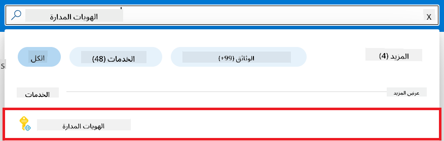

1. اختر **+ Create**.

    

1. قم بالمهام التالية:

    - اختر **Subscription** الخاص بك في Azure.
    - اختر **Resource group** التي تريد استخدامها (يمكنك إنشاء واحدة جديدة إذا لزم الأمر).
    - اختر **Region** التي ترغب في استخدامها.
    - أدخل **Name**. يجب أن يكون اسمًا فريدًا.

    

1. اختر **Review + create**.

1. اختر **+ Create**.

#### إضافة تعيين دور Contributor إلى الهوية المُدارة

1. انتقل إلى مورد الهوية المُدارة الذي أنشأته.

1. اختر **Azure role assignments** من القائمة الجانبية.

1. اختر **+Add role assignment** من قائمة التنقل.

1. في صفحة إضافة تعيين الدور، قم بالمهام التالية:
    - اختر **Scope** إلى **Resource group**.
    - اختر **Subscription** الخاص بك في Azure.
    - اختر **Resource group** التي تريد استخدامها.
    - اختر **Role** إلى **Contributor**.

    

2. اختر **Save**.

#### إضافة تعيين دور Storage Blob Data Reader إلى الهوية المُدارة

1. اكتب *storage accounts* في **شريط البحث** أعلى صفحة البوابة واختر **Storage accounts** من الخيارات التي تظهر.

    

1. اختر حساب التخزين المرتبط بمساحة عمل Azure Machine Learning التي أنشأتها. على سبيل المثال، *finetunephistorage*.

1. قم بالمهام التالية للانتقال إلى صفحة إضافة تعيين الدور:

    - انتقل إلى حساب التخزين الذي أنشأته في Azure.
    - اختر **Access Control (IAM)** من القائمة الجانبية.
    - اختر **+ Add** من قائمة التنقل.
    - اختر **Add role assignment** من قائمة التنقل.

    

1. في صفحة إضافة تعيين الدور، قم بالمهام التالية:

    - في صفحة الدور، اكتب *Storage Blob Data Reader* في **شريط البحث** واختر **Storage Blob Data Reader** من الخيارات التي تظهر.
    - في صفحة الدور، اختر **Next**.
    - في صفحة الأعضاء، اختر **Assign access to** إلى **Managed identity**.
    - في صفحة الأعضاء، اختر **+ Select members**.
    - في صفحة اختيار الهويات المُدارة، اختر **Subscription** الخاص بك في Azure.
    - في صفحة اختيار الهويات المُدارة، اختر **Managed identity** إلى **Manage Identity**.
    - في صفحة اختيار الهويات المُدارة، اختر الهوية المُدارة التي أنشأتها. على سبيل المثال، *finetunephi-managedidentity*.
    - في صفحة اختيار الهويات المُدارة، اختر **Select**.

    

1. اختر **Review + assign**.

#### إضافة تعيين دور AcrPull إلى الهوية المُدارة

1. اكتب *container registries* في **شريط البحث** أعلى صفحة البوابة واختر **Container registries** من الخيارات التي تظهر.

    

1. اختر سجل الحاويات المرتبط بمساحة عمل Azure Machine Learning. على سبيل المثال، *finetunephicontainerregistry*

1. قم بالمهام التالية للانتقال إلى صفحة إضافة تعيين الدور:

    - اختر **Access Control (IAM)** من القائمة الجانبية.
    - اختر **+ Add** من قائمة التنقل.
    - اختر **Add role assignment** من قائمة التنقل.

1. في صفحة إضافة تعيين الدور، قم بالمهام التالية:

    - في صفحة الدور، اكتب *AcrPull* في **شريط البحث** واختر **AcrPull** من الخيارات التي تظهر.
    - في صفحة الدور، اختر **Next**.
    - في صفحة الأعضاء، اختر **Assign access to** إلى **Managed identity**.
    - في صفحة الأعضاء، اختر **+ Select members**.
    - في صفحة اختيار الهويات المُدارة، اختر **Subscription** الخاص بك في Azure.
    - في صفحة اختيار الهويات المُدارة، اختر **Managed identity** إلى **Manage Identity**.
    - في صفحة اختيار الهويات المُدارة، اختر الهوية المُدارة التي أنشأتها. على سبيل المثال، *finetunephi-managedidentity*.
    - في صفحة اختيار الهويات المُدارة، اختر **Select**.
    - اختر **Review + assign**.

### إعداد المشروع

لتنزيل مجموعات البيانات اللازمة للضبط، ستقوم بإعداد بيئة محلية.

في هذا التمرين، ستقوم بـ

- إنشاء مجلد للعمل بداخله.
- إنشاء بيئة افتراضية.
- تثبيت الحزم المطلوبة.
- إنشاء ملف *download_dataset.py* لتنزيل مجموعة البيانات.

#### إنشاء مجلد للعمل بداخله

1. افتح نافذة طرفية واكتب الأمر التالي لإنشاء مجلد باسم *finetune-phi* في المسار الافتراضي.

    ```console
    mkdir finetune-phi
    ```

2. اكتب الأمر التالي في الطرفية للانتقال إلى مجلد *finetune-phi* الذي أنشأته.
#### إنشاء بيئة افتراضية

1. اكتب الأمر التالي داخل الطرفية لإنشاء بيئة افتراضية باسم *.venv*.

    ```console
    python -m venv .venv
    ```

2. اكتب الأمر التالي داخل الطرفية لتفعيل البيئة الافتراضية.

    ```console
    .venv\Scripts\activate.bat
    ```


> [!NOTE]
> إذا نجح الأمر، يجب أن ترى *(.venv)* قبل موجه الأوامر.

#### تثبيت الحزم المطلوبة

1. اكتب الأوامر التالية داخل الطرفية لتثبيت الحزم المطلوبة.

    ```console
    pip install datasets==2.19.1
    ```

#### إنشاء `donload_dataset.py`

> [!NOTE]
> الهيكل الكامل للمجلد:
>
> ```text
> └── YourUserName
> .    └── finetune-phi
> .        └── download_dataset.py
> ```

1. افتح **Visual Studio Code**.

1. اختر **File** من شريط القوائم.

1. اختر **Open Folder**.

1. اختر مجلد *finetune-phi* الذي أنشأته، والموجود في *C:\Users\yourUserName\finetune-phi*.

    

1. في الجزء الأيسر من Visual Studio Code، انقر بزر الماوس الأيمن واختر **New File** لإنشاء ملف جديد باسم *download_dataset.py*.

    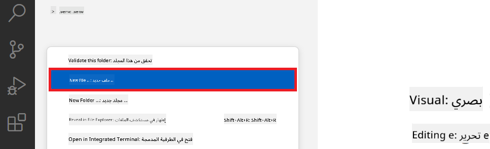

### تحضير مجموعة البيانات للتدريب الدقيق

في هذا التمرين، ستقوم بتشغيل ملف *download_dataset.py* لتحميل مجموعات بيانات *ultrachat_200k* إلى بيئتك المحلية. ثم ستستخدم هذه المجموعات لتدريب نموذج Phi-3 بدقة في Azure Machine Learning.

في هذا التمرين، ستقوم بـ:

- إضافة كود إلى ملف *download_dataset.py* لتحميل مجموعات البيانات.
- تشغيل ملف *download_dataset.py* لتحميل مجموعات البيانات إلى بيئتك المحلية.

#### تحميل مجموعة البيانات باستخدام *download_dataset.py*

1. افتح ملف *download_dataset.py* في Visual Studio Code.

1. أضف الكود التالي داخل ملف *download_dataset.py*.

    ```python
    import json
    import os
    from datasets import load_dataset

    def load_and_split_dataset(dataset_name, config_name, split_ratio):
        """
        Load and split a dataset.
        """
        # Load the dataset with the specified name, configuration, and split ratio
        dataset = load_dataset(dataset_name, config_name, split=split_ratio)
        print(f"Original dataset size: {len(dataset)}")
        
        # Split the dataset into train and test sets (80% train, 20% test)
        split_dataset = dataset.train_test_split(test_size=0.2)
        print(f"Train dataset size: {len(split_dataset['train'])}")
        print(f"Test dataset size: {len(split_dataset['test'])}")
        
        return split_dataset

    def save_dataset_to_jsonl(dataset, filepath):
        """
        Save a dataset to a JSONL file.
        """
        # Create the directory if it does not exist
        os.makedirs(os.path.dirname(filepath), exist_ok=True)
        
        # Open the file in write mode
        with open(filepath, 'w', encoding='utf-8') as f:
            # Iterate over each record in the dataset
            for record in dataset:
                # Dump the record as a JSON object and write it to the file
                json.dump(record, f)
                # Write a newline character to separate records
                f.write('\n')
        
        print(f"Dataset saved to {filepath}")

    def main():
        """
        Main function to load, split, and save the dataset.
        """
        # Load and split the ULTRACHAT_200k dataset with a specific configuration and split ratio
        dataset = load_and_split_dataset("HuggingFaceH4/ultrachat_200k", 'default', 'train_sft[:1%]')
        
        # Extract the train and test datasets from the split
        train_dataset = dataset['train']
        test_dataset = dataset['test']

        # Save the train dataset to a JSONL file
        save_dataset_to_jsonl(train_dataset, "data/train_data.jsonl")
        
        # Save the test dataset to a separate JSONL file
        save_dataset_to_jsonl(test_dataset, "data/test_data.jsonl")

    if __name__ == "__main__":
        main()

    ```

1. اكتب الأمر التالي داخل الطرفية لتشغيل السكريبت وتحميل مجموعة البيانات إلى بيئتك المحلية.

    ```console
    python download_dataset.py
    ```

1. تحقق من أن مجموعات البيانات تم حفظها بنجاح في مجلد *finetune-phi/data* المحلي.

> [!NOTE]
>
> #### ملاحظة حول حجم مجموعة البيانات ووقت التدريب الدقيق
>
> في هذا الدرس، تستخدم فقط 1% من مجموعة البيانات (`split='train[:1%]'`). هذا يقلل بشكل كبير من حجم البيانات، مما يسرع من عمليات الرفع والتدريب الدقيق. يمكنك تعديل النسبة لإيجاد التوازن المناسب بين وقت التدريب وأداء النموذج. استخدام جزء أصغر من مجموعة البيانات يقلل من الوقت المطلوب للتدريب الدقيق، مما يجعل العملية أكثر سهولة في سياق الدروس.

## السيناريو 2: تدريب نموذج Phi-3 بدقة ونشره في Azure Machine Learning Studio

### تدريب نموذج Phi-3 بدقة

في هذا التمرين، ستقوم بتدريب نموذج Phi-3 بدقة في Azure Machine Learning Studio.

في هذا التمرين، ستقوم بـ:

- إنشاء مجموعة حوسبة للتدريب الدقيق.
- تدريب نموذج Phi-3 بدقة في Azure Machine Learning Studio.

#### إنشاء مجموعة حوسبة للتدريب الدقيق

1. قم بزيارة [Azure ML Studio](https://ml.azure.com/home?wt.mc_id=studentamb_279723).

1. اختر **Compute** من القائمة الجانبية.

1. اختر **Compute clusters** من قائمة التنقل.

1. اختر **+ New**.

    

1. قم بالمهام التالية:

    - اختر **Region** التي ترغب في استخدامها.
    - اختر **Virtual machine tier** إلى **Dedicated**.
    - اختر **Virtual machine type** إلى **GPU**.
    - اختر فلتر **Virtual machine size** إلى **Select from all options**.
    - اختر **Virtual machine size** إلى **Standard_NC24ads_A100_v4**.

    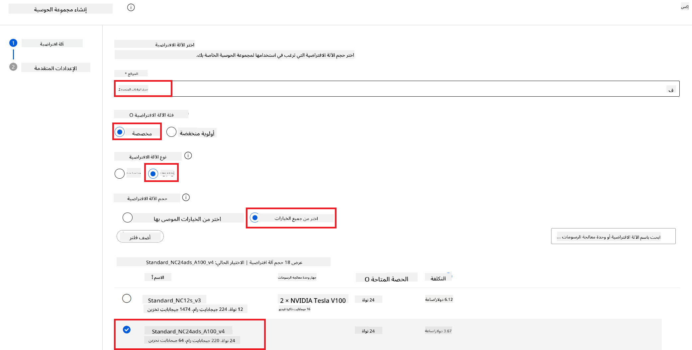

1. اختر **Next**.

1. قم بالمهام التالية:

    - أدخل **Compute name**. يجب أن يكون قيمة فريدة.
    - اختر **Minimum number of nodes** إلى **0**.
    - اختر **Maximum number of nodes** إلى **1**.
    - اختر **Idle seconds before scale down** إلى **120**.

    

1. اختر **Create**.

#### تدريب نموذج Phi-3 بدقة

1. قم بزيارة [Azure ML Studio](https://ml.azure.com/home?wt.mc_id=studentamb_279723).

1. اختر مساحة عمل Azure Machine Learning التي أنشأتها.

    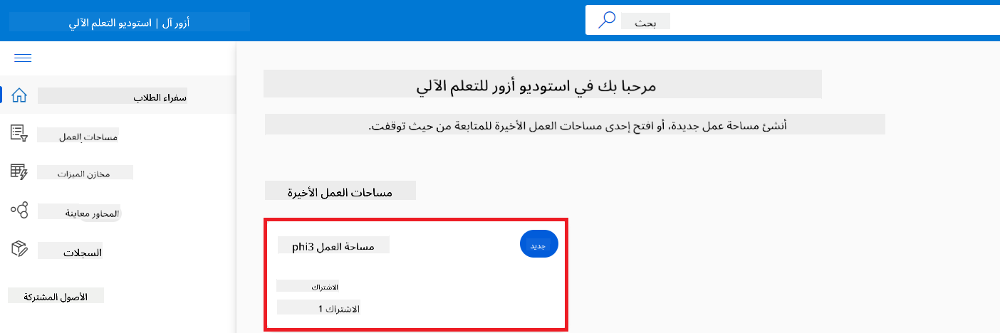

1. قم بالمهام التالية:

    - اختر **Model catalog** من القائمة الجانبية.
    - اكتب *phi-3-mini-4k* في **شريط البحث** واختر **Phi-3-mini-4k-instruct** من الخيارات التي تظهر.

    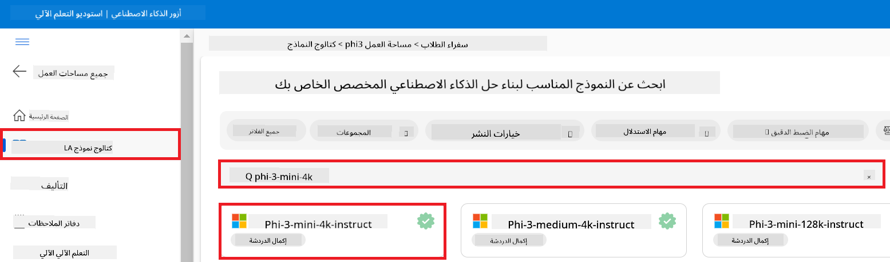

1. اختر **Fine-tune** من قائمة التنقل.

    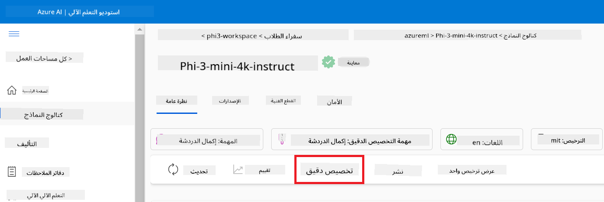

1. قم بالمهام التالية:

    - اختر **Select task type** إلى **Chat completion**.
    - اختر **+ Select data** لرفع **بيانات التدريب**.
    - اختر نوع رفع بيانات التحقق إلى **Provide different validation data**.
    - اختر **+ Select data** لرفع **بيانات التحقق**.

    

    > [!TIP]
    >
    > يمكنك اختيار **Advanced settings** لتخصيص الإعدادات مثل **learning_rate** و **lr_scheduler_type** لتحسين عملية التدريب الدقيق حسب احتياجاتك الخاصة.

1. اختر **Finish**.

1. في هذا التمرين، نجحت في تدريب نموذج Phi-3 بدقة باستخدام Azure Machine Learning. يرجى ملاحظة أن عملية التدريب الدقيق قد تستغرق وقتًا طويلاً. بعد تشغيل مهمة التدريب الدقيق، عليك الانتظار حتى تكتمل. يمكنك متابعة حالة المهمة من خلال التوجه إلى تبويب Jobs في الجانب الأيسر من مساحة عمل Azure Machine Learning الخاصة بك. في السلسلة التالية، ستقوم بنشر النموذج المدرب ودمجه مع Prompt flow.

    

### نشر نموذج Phi-3 المدرب بدقة

لدمج نموذج Phi-3 المدرب بدقة مع Prompt flow، تحتاج إلى نشر النموذج ليكون متاحًا للاستدلال في الوقت الحقيقي. تتضمن هذه العملية تسجيل النموذج، إنشاء نقطة نهاية عبر الإنترنت، ونشر النموذج.

في هذا التمرين، ستقوم بـ:

- تسجيل النموذج المدرب في مساحة عمل Azure Machine Learning.
- إنشاء نقطة نهاية عبر الإنترنت.
- نشر نموذج Phi-3 المدرب المسجل.

#### تسجيل النموذج المدرب

1. قم بزيارة [Azure ML Studio](https://ml.azure.com/home?wt.mc_id=studentamb_279723).

1. اختر مساحة عمل Azure Machine Learning التي أنشأتها.

    

1. اختر **Models** من القائمة الجانبية.
1. اختر **+ Register**.
1. اختر **From a job output**.

    

1. اختر المهمة التي أنشأتها.

    

1. اختر **Next**.

1. اختر **Model type** إلى **MLflow**.

1. تأكد من اختيار **Job output**؛ يجب أن يكون محددًا تلقائيًا.

    

2. اختر **Next**.

3. اختر **Register**.

    

4. يمكنك عرض النموذج المسجل من خلال الانتقال إلى قائمة **Models** من القائمة الجانبية.

    

#### نشر النموذج المدرب

1. انتقل إلى مساحة عمل Azure Machine Learning التي أنشأتها.

1. اختر **Endpoints** من القائمة الجانبية.

1. اختر **Real-time endpoints** من قائمة التنقل.

    

1. اختر **Create**.

1. اختر النموذج المسجل الذي أنشأته.

    

1. اختر **Select**.

1. قم بالمهام التالية:

    - اختر **Virtual machine** إلى *Standard_NC6s_v3*.
    - اختر عدد النسخ التي ترغب في استخدامها، مثلاً *1*.
    - اختر **Endpoint** إلى **New** لإنشاء نقطة نهاية جديدة.
    - أدخل **Endpoint name**. يجب أن يكون قيمة فريدة.
    - أدخل **Deployment name**. يجب أن يكون قيمة فريدة.

    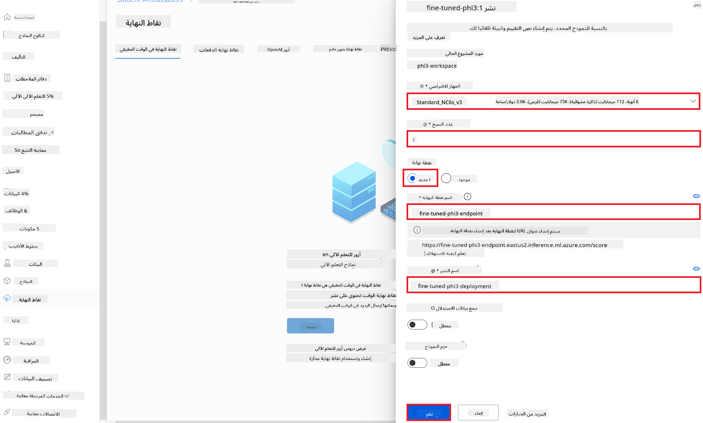

1. اختر **Deploy**.

> [!WARNING]
> لتجنب رسوم إضافية على حسابك، تأكد من حذف نقطة النهاية التي أنشأتها في مساحة عمل Azure Machine Learning.
>

#### التحقق من حالة النشر في مساحة عمل Azure Machine Learning

1. انتقل إلى مساحة عمل Azure Machine Learning التي أنشأتها.

1. اختر **Endpoints** من القائمة الجانبية.

1. اختر نقطة النهاية التي أنشأتها.

    

1. في هذه الصفحة، يمكنك إدارة نقاط النهاية أثناء عملية النشر.

> [!NOTE]
> بمجرد اكتمال النشر، تأكد من أن **Live traffic** مضبوط على **100%**. إذا لم يكن كذلك، اختر **Update traffic** لتعديل إعدادات المرور. لاحظ أنه لا يمكنك اختبار النموذج إذا كان المرور مضبوطًا على 0%.
>
> 
>

## السيناريو 3: الدمج مع Prompt flow والدردشة مع نموذجك المخصص في Azure AI Foundry

### دمج نموذج Phi-3 المخصص مع Prompt flow

بعد نشر نموذجك المدرب بنجاح، يمكنك الآن دمجه مع Prompt Flow لاستخدامه في التطبيقات الحية، مما يتيح مجموعة متنوعة من المهام التفاعلية مع نموذج Phi-3 المخصص الخاص بك.

في هذا التمرين، ستقوم بـ:

- إنشاء Azure AI Foundry Hub.
- إنشاء مشروع Azure AI Foundry.
- إنشاء Prompt flow.
- إضافة اتصال مخصص لنموذج Phi-3 المدرب.
- إعداد Prompt flow للدردشة مع نموذج Phi-3 المخصص الخاص بك.
> [!NOTE]
> يمكنك أيضًا الدمج مع Promptflow باستخدام Azure ML Studio. يمكن تطبيق نفس عملية الدمج على Azure ML Studio.
#### إنشاء مركز Azure AI Foundry

يجب عليك إنشاء مركز قبل إنشاء المشروع. يعمل المركز مثل مجموعة موارد، مما يتيح لك تنظيم وإدارة عدة مشاريع داخل Azure AI Foundry.

1. قم بزيارة [Azure AI Foundry](https://ai.azure.com/?WT.mc_id=aiml-137032-kinfeylo).

1. اختر **All hubs** من القائمة الجانبية.

1. اختر **+ New hub** من قائمة التنقل.

    

1. قم بالمهام التالية:

    - أدخل **Hub name**. يجب أن يكون قيمة فريدة.
    - اختر اشتراك Azure الخاص بك **Subscription**.
    - اختر **Resource group** التي تريد استخدامها (يمكنك إنشاء واحدة جديدة إذا لزم الأمر).
    - اختر **Location** التي تود استخدامها.
    - اختر **Connect Azure AI Services** التي تريد استخدامها (يمكنك إنشاء واحدة جديدة إذا لزم الأمر).
    - اختر **Connect Azure AI Search** ثم **Skip connecting**.

    

1. اختر **Next**.

#### إنشاء مشروع Azure AI Foundry

1. في المركز الذي أنشأته، اختر **All projects** من القائمة الجانبية.

1. اختر **+ New project** من قائمة التنقل.

    

1. أدخل **Project name**. يجب أن يكون قيمة فريدة.

    

1. اختر **Create a project**.

#### إضافة اتصال مخصص لنموذج Phi-3 المحسن

لدمج نموذج Phi-3 المخصص مع Prompt flow، تحتاج إلى حفظ نقطة النهاية والمفتاح الخاص بالنموذج في اتصال مخصص. هذا الإعداد يضمن الوصول إلى نموذج Phi-3 المخصص داخل Prompt flow.

#### تعيين مفتاح API وعنوان نقطة النهاية لنموذج Phi-3 المحسن

1. قم بزيارة [Azure ML Studio](https://ml.azure.com/home?WT.mc_id=aiml-137032-kinfeylo).

1. انتقل إلى مساحة عمل Azure Machine learning التي أنشأتها.

1. اختر **Endpoints** من القائمة الجانبية.

    

1. اختر نقطة النهاية التي أنشأتها.

    

1. اختر **Consume** من قائمة التنقل.

1. انسخ **REST endpoint** و **Primary key** الخاصين بك.

    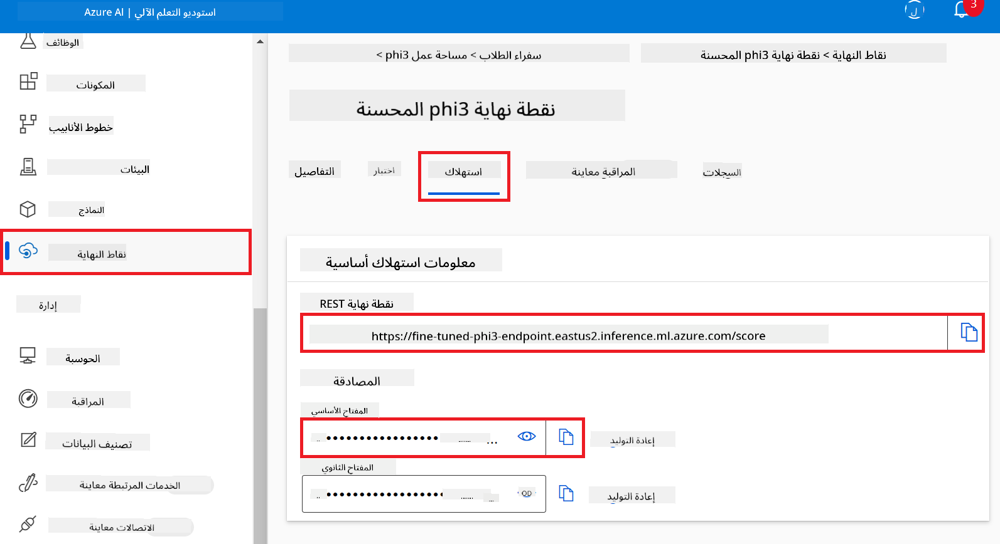

#### إضافة الاتصال المخصص

1. قم بزيارة [Azure AI Foundry](https://ai.azure.com/?WT.mc_id=aiml-137032-kinfeylo).

1. انتقل إلى مشروع Azure AI Foundry الذي أنشأته.

1. في المشروع الذي أنشأته، اختر **Settings** من القائمة الجانبية.

1. اختر **+ New connection**.

    

1. اختر **Custom keys** من قائمة التنقل.

    

1. قم بالمهام التالية:

    - اختر **+ Add key value pairs**.
    - في خانة اسم المفتاح، أدخل **endpoint** والصق نقطة النهاية التي نسختها من Azure ML Studio في خانة القيمة.
    - اختر **+ Add key value pairs** مرة أخرى.
    - في خانة اسم المفتاح، أدخل **key** والصق المفتاح الذي نسخته من Azure ML Studio في خانة القيمة.
    - بعد إضافة المفاتيح، اختر **is secret** لمنع كشف المفتاح.

    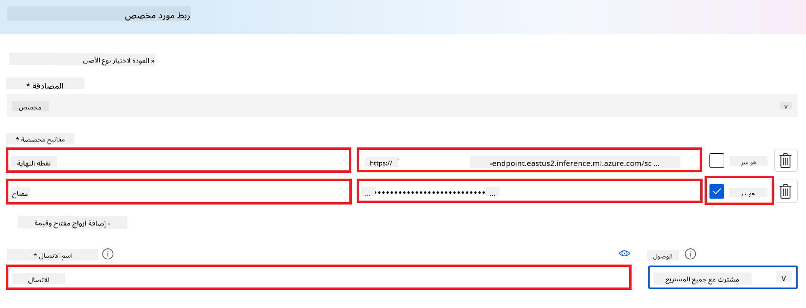

1. اختر **Add connection**.

#### إنشاء Prompt flow

لقد أضفت اتصالًا مخصصًا في Azure AI Foundry. الآن، دعنا ننشئ Prompt flow باستخدام الخطوات التالية. بعد ذلك، ستربط هذا الـ Prompt flow بالاتصال المخصص حتى تتمكن من استخدام النموذج المحسن داخل Prompt flow.

1. انتقل إلى مشروع Azure AI Foundry الذي أنشأته.

1. اختر **Prompt flow** من القائمة الجانبية.

1. اختر **+ Create** من قائمة التنقل.

    

1. اختر **Chat flow** من قائمة التنقل.

    

1. أدخل **Folder name** التي تريد استخدامها.

    

2. اختر **Create**.

#### إعداد Prompt flow للدردشة مع نموذج Phi-3 المخصص

تحتاج إلى دمج نموذج Phi-3 المحسن في Prompt flow. ومع ذلك، فإن Prompt flow الحالي غير مصمم لهذا الغرض. لذلك، يجب إعادة تصميم Prompt flow لتمكين دمج النموذج المخصص.

1. في Prompt flow، قم بالمهام التالية لإعادة بناء التدفق الحالي:

    - اختر **Raw file mode**.
    - احذف كل الكود الموجود في ملف *flow.dag.yml*.
    - أضف الكود التالي إلى ملف *flow.dag.yml*.

        ```yml
        inputs:
          input_data:
            type: string
            default: "Who founded Microsoft?"

        outputs:
          answer:
            type: string
            reference: ${integrate_with_promptflow.output}

        nodes:
        - name: integrate_with_promptflow
          type: python
          source:
            type: code
            path: integrate_with_promptflow.py
          inputs:
            input_data: ${inputs.input_data}
        ```

    - اختر **Save**.

    

1. أضف الكود التالي إلى ملف *integrate_with_promptflow.py* لاستخدام نموذج Phi-3 المخصص في Prompt flow.

    ```python
    import logging
    import requests
    from promptflow import tool
    from promptflow.connections import CustomConnection

    # Logging setup
    logging.basicConfig(
        format="%(asctime)s - %(levelname)s - %(name)s - %(message)s",
        datefmt="%Y-%m-%d %H:%M:%S",
        level=logging.DEBUG
    )
    logger = logging.getLogger(__name__)

    def query_phi3_model(input_data: str, connection: CustomConnection) -> str:
        """
        Send a request to the Phi-3 model endpoint with the given input data using Custom Connection.
        """

        # "connection" is the name of the Custom Connection, "endpoint", "key" are the keys in the Custom Connection
        endpoint_url = connection.endpoint
        api_key = connection.key

        headers = {
            "Content-Type": "application/json",
            "Authorization": f"Bearer {api_key}"
        }
        data = {
            "input_data": {
                "input_string": [
                    {"role": "user", "content": input_data}
                ],
                "parameters": {
                    "temperature": 0.7,
                    "max_new_tokens": 128
                }
            }
        }
        try:
            response = requests.post(endpoint_url, json=data, headers=headers)
            response.raise_for_status()
            
            # Log the full JSON response
            logger.debug(f"Full JSON response: {response.json()}")

            result = response.json()["output"]
            logger.info("Successfully received response from Azure ML Endpoint.")
            return result
        except requests.exceptions.RequestException as e:
            logger.error(f"Error querying Azure ML Endpoint: {e}")
            raise

    @tool
    def my_python_tool(input_data: str, connection: CustomConnection) -> str:
        """
        Tool function to process input data and query the Phi-3 model.
        """
        return query_phi3_model(input_data, connection)

    ```

    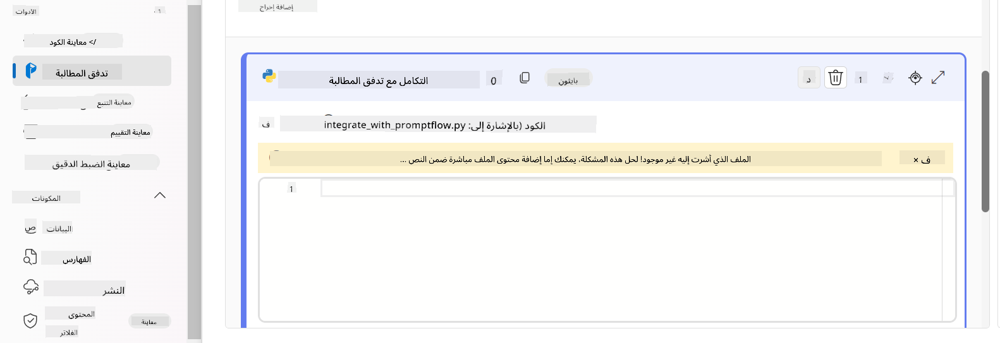

> [!NOTE]
> لمزيد من المعلومات التفصيلية حول استخدام Prompt flow في Azure AI Foundry، يمكنك الرجوع إلى [Prompt flow in Azure AI Foundry](https://learn.microsoft.com/azure/ai-studio/how-to/prompt-flow).

1. اختر **Chat input** و **Chat output** لتمكين الدردشة مع نموذجك.

    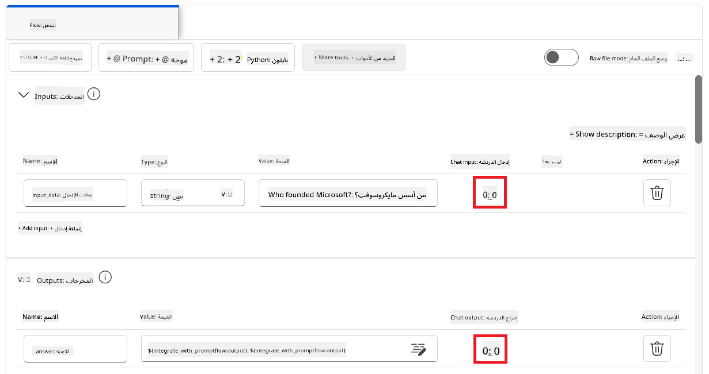

1. الآن أنت جاهز للدردشة مع نموذج Phi-3 المخصص. في التمرين التالي، ستتعلم كيفية بدء Prompt flow واستخدامه للدردشة مع نموذج Phi-3 المحسن.

> [!NOTE]
>
> يجب أن يبدو التدفق المعاد بناؤه كما في الصورة أدناه:
>
> 
>

### الدردشة مع نموذج Phi-3 المخصص

الآن بعد أن قمت بتحسين ودمج نموذج Phi-3 المخصص مع Prompt flow، أنت جاهز لبدء التفاعل معه. سيرشدك هذا التمرين خلال عملية إعداد وبدء الدردشة مع نموذجك باستخدام Prompt flow. باتباع هذه الخطوات، ستتمكن من الاستفادة الكاملة من قدرات نموذج Phi-3 المحسن لمهام ومحادثات متنوعة.

- دردش مع نموذج Phi-3 المخصص باستخدام Prompt flow.

#### بدء Prompt flow

1. اختر **Start compute sessions** لبدء Prompt flow.

    

1. اختر **Validate and parse input** لتحديث المعلمات.

    

1. اختر **Value** الخاص بـ **connection** للاتصال المخصص الذي أنشأته. على سبيل المثال، *connection*.

    

#### الدردشة مع النموذج المخصص

1. اختر **Chat**.

    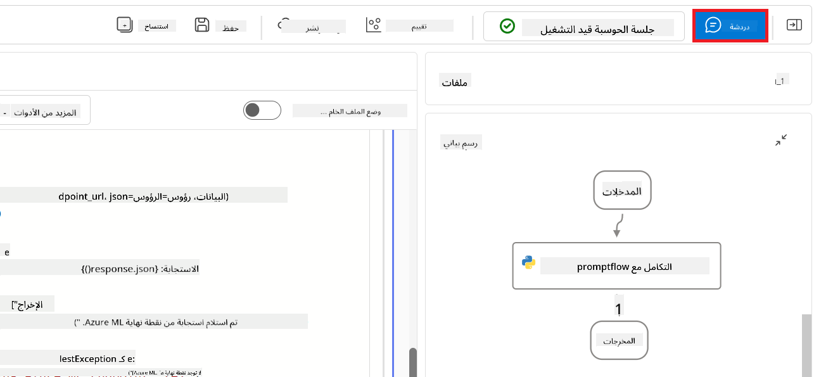

1. إليك مثال على النتائج: الآن يمكنك الدردشة مع نموذج Phi-3 المخصص. يُنصح بطرح أسئلة بناءً على البيانات المستخدمة في تحسين النموذج.

    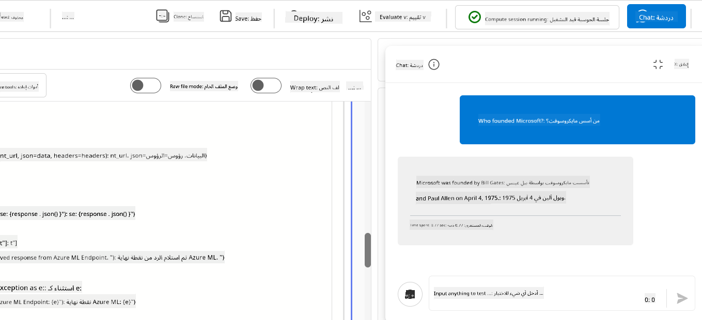

**إخلاء المسؤولية**:  
تمت ترجمة هذا المستند باستخدام خدمة الترجمة الآلية [Co-op Translator](https://github.com/Azure/co-op-translator). بينما نسعى لتحقيق الدقة، يرجى العلم أن الترجمات الآلية قد تحتوي على أخطاء أو عدم دقة. يجب اعتبار المستند الأصلي بلغته الأصلية المصدر الموثوق به. للمعلومات الهامة، يُنصح بالاعتماد على الترجمة البشرية المهنية. نحن غير مسؤولين عن أي سوء فهم أو تفسير ناتج عن استخدام هذه الترجمة.