# ضبط النماذج المخصصة Phi-3 ودمجها مع تدفق المطالبات في Azure AI Foundry

يعتمد هذا المثال الشامل (E2E) على الدليل "[ضبط ودمج نماذج Phi-3 المخصصة مع تدفق المطالبات في Azure AI Foundry](https://techcommunity.microsoft.com/t5/educator-developer-blog/fine-tune-and-integrate-custom-phi-3-models-with-prompt-flow-in/ba-p/4191726?WT.mc_id=aiml-137032-kinfeylo)" من مجتمع Microsoft التقني. يقدم العمليات الخاصة بضبط النماذج، ونشرها، ودمج نماذج Phi-3 المخصصة مع تدفق المطالبات في Azure AI Foundry.
بخلاف المثال الشامل E2E، "[ضبط ودمج نماذج Phi-3 المخصصة مع تدفق المطالبات](./E2E_Phi-3-FineTuning_PromptFlow_Integration.md)"، الذي تضمن تشغيل الشيفرة محليًا، يركز هذا الدليل بالكامل على ضبط ودمج النموذج الخاص بك داخل Azure AI / ML Studio.

## نظرة عامة

في هذا المثال الشامل E2E، ستتعلم كيفية ضبط نموذج Phi-3 ودمجه مع تدفق المطالبات في Azure AI Foundry. من خلال الاستفادة من Azure AI / ML Studio، ستؤسس سير عمل لنشر واستخدام نماذج الذكاء الاصطناعي المخصصة. ينقسم هذا المثال الشامل إلى ثلاثة سيناريوهات:

**السيناريو 1: إعداد موارد Azure والتحضير لعملية الضبط**

**السيناريو 2: ضبط نموذج Phi-3 ونشره في Azure Machine Learning Studio**

**السيناريو 3: الدمج مع تدفق المطالبات والدردشة مع نموذجك المخصص في Azure AI Foundry**

إليك نظرة عامة على هذا المثال الشامل.


### جدول المحتويات

1. **[السيناريو 1: إعداد موارد Azure والتحضير لعملية الضبط](../../../../../../md/02.Application/01.TextAndChat/Phi3)**
    - [إنشاء مساحة عمل Azure Machine Learning](../../../../../../md/02.Application/01.TextAndChat/Phi3)
    - [طلب حصص GPU في اشتراك Azure](../../../../../../md/02.Application/01.TextAndChat/Phi3)
    - [إضافة تعيين دور](../../../../../../md/02.Application/01.TextAndChat/Phi3)
    - [إعداد المشروع](../../../../../../md/02.Application/01.TextAndChat/Phi3)
    - [تحضير مجموعة البيانات لعملية الضبط](../../../../../../md/02.Application/01.TextAndChat/Phi3)

1. **[السيناريو 2: ضبط نموذج Phi-3 ونشره في Azure Machine Learning Studio](../../../../../../md/02.Application/01.TextAndChat/Phi3)**
    - [ضبط نموذج Phi-3](../../../../../../md/02.Application/01.TextAndChat/Phi3)
    - [نشر نموذج Phi-3 المزود بالضبط](../../../../../../md/02.Application/01.TextAndChat/Phi3)

1. **[السيناريو 3: الدمج مع تدفق المطالبات والدردشة مع نموذجك المخصص في Azure AI Foundry](../../../../../../md/02.Application/01.TextAndChat/Phi3)**
    - [دمج نموذج Phi-3 المخصص مع تدفق المطالبات](../../../../../../md/02.Application/01.TextAndChat/Phi3)
    - [الدردشة مع نموذج Phi-3 المخصص](../../../../../../md/02.Application/01.TextAndChat/Phi3)

## السيناريو 1: إعداد موارد Azure والتحضير لعملية الضبط

### إنشاء مساحة عمل Azure Machine Learning

1. اكتب *azure machine learning* في **شريط البحث** أعلى صفحة البوابة واختر **Azure Machine Learning** من الخيارات التي تظهر.

    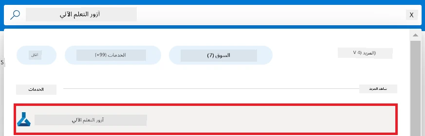

2. اختر **+ إنشاء** من قائمة التنقل.

3. اختر **مساحة عمل جديدة** من قائمة التنقل.

    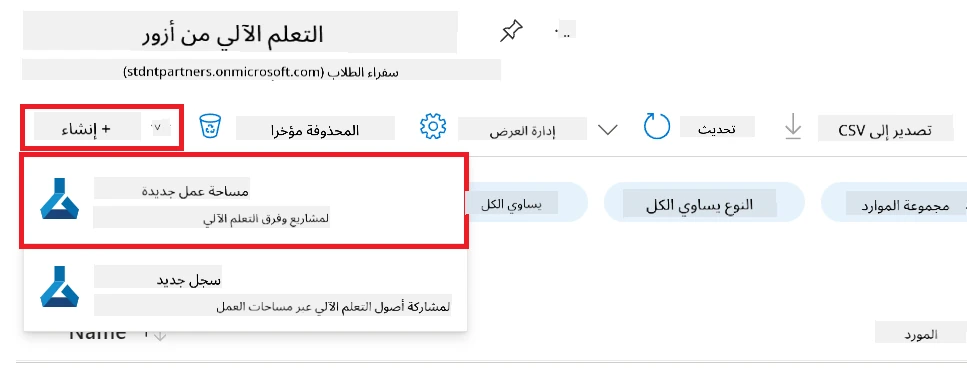

4. قم بالمهام التالية:

    - اختر **الاشتراك** الخاص بك في Azure.
    - اختر **مجموعة الموارد** التي تريد استخدامها (قم بإنشاء واحدة جديدة إذا لزم الأمر).
    - أدخل **اسم مساحة العمل**. يجب أن يكون قيمة فريدة.
    - اختر **المنطقة** التي تود استخدامها.
    - اختر **حساب التخزين** الذي تريد استخدامه (قم بإنشاء واحد جديد إذا لزم الأمر).
    - اختر **مفتاح القبو** الذي تريد استخدامه (قم بإنشاء واحد جديد إذا لزم الأمر).
    - اختر **رؤى التطبيق** التي تريد استخدامها (قم بإنشاء واحدة جديدة إذا لزم الأمر).
    - اختر **سجل الحاويات** الذي تريد استخدامه (قم بإنشاء واحد جديد إذا لزم الأمر).

    

5. اختر **مراجعة + إنشاء**.

6. اختر **إنشاء**.

### طلب حصص GPU في اشتراك Azure

في هذا الدليل، ستتعلم كيفية ضبط ونشر نموذج Phi-3 باستخدام وحدات معالجة الرسومات (GPU). للضبط، ستستخدم وحدة GPU من النوع *Standard_NC24ads_A100_v4*، والتي تتطلب طلب حصة. للنشر، ستستخدم وحدة GPU من النوع *Standard_NC6s_v3*، والتي تتطلب أيضا طلب حصة.

> [!NOTE]
>
> الاشتراكات بنظام الدفع عند الاستخدام فقط (نوع الاشتراك القياسي) مؤهلة لتخصيص وحدات GPU؛ اشتراكات الفائدة غير مدعومة حاليا.
>

1. زر [Azure ML Studio](https://ml.azure.com/home?wt.mc_id=studentamb_279723).

1. قم بالمهام التالية لطلب حصة *Standard NCADSA100v4 Family*:

    - اختر **الحصة** من علامة التبويب الجانبية اليسرى.
    - اختر **عائلة الأجهزة الافتراضية** المراد استخدامها. على سبيل المثال، اختر **Standard NCADSA100v4 Family Cluster Dedicated vCPUs**، التي تشمل وحدة GPU *Standard_NC24ads_A100_v4*.
    - اختر **طلب الحصة** من قائمة التنقل.

        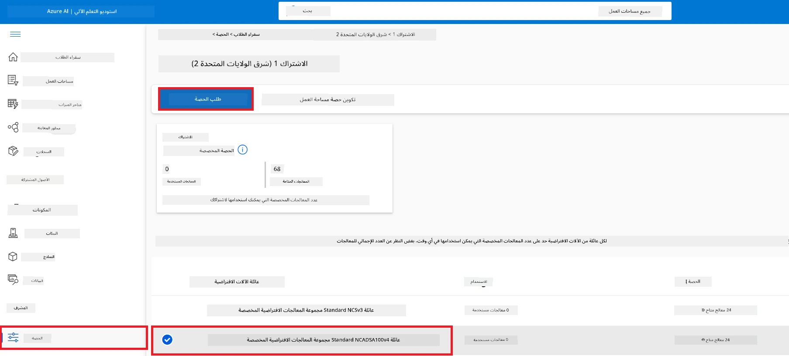

    - في صفحة طلب الحصة، أدخل **الحد الأقصى للنوى الجديد** الذي ترغب في استخدامه. على سبيل المثال، 24.
    - في صفحة طلب الحصة، اختر **إرسال** لطلب حصة وحدة GPU.

1. قم بالمهام التالية لطلب حصة *Standard NCSv3 Family*:

    - اختر **الحصة** من علامة التبويب الجانبية اليسرى.
    - اختر **عائلة الأجهزة الافتراضية** المراد استخدامها. على سبيل المثال، اختر **Standard NCSv3 Family Cluster Dedicated vCPUs**، التي تشمل وحدة GPU *Standard_NC6s_v3*.
    - اختر **طلب الحصة** من قائمة التنقل.
    - في صفحة طلب الحصة، أدخل **الحد الأقصى للنوى الجديد** الذي ترغب في استخدامه. على سبيل المثال، 24.
    - في صفحة طلب الحصة، اختر **إرسال** لطلب حصة وحدة GPU.

### إضافة تعيين دور

لتتمكن من ضبط ونشر نماذجك، يجب أولاً إنشاء هوية مُدارة معينة للمستخدم (UAI) وتعيين الأذونات المناسبة لها. ستُستخدم هذه الهوية المُدارة للمصادقة أثناء النشر.

#### إنشاء هوية مُدارة معينة للمستخدم (UAI)

1. اكتب *managed identities* في **شريط البحث** أعلى صفحة البوابة واختر **Managed Identities** من الخيارات التي تظهر.

    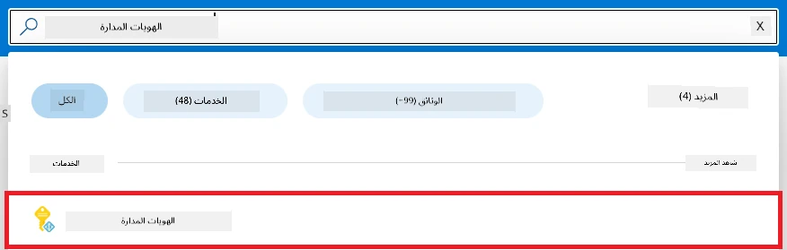

1. اختر **+ إنشاء**.

    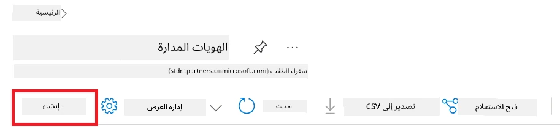

1. قم بالمهام التالية:

    - اختر **الاشتراك** الخاص بك في Azure.
    - اختر **مجموعة الموارد** التي تريد استخدامها (قم بإنشاء واحدة جديدة إذا لزم الأمر).
    - اختر **المنطقة** التي تود استخدامها.
    - أدخل **الاسم**. يجب أن يكون قيمة فريدة.

    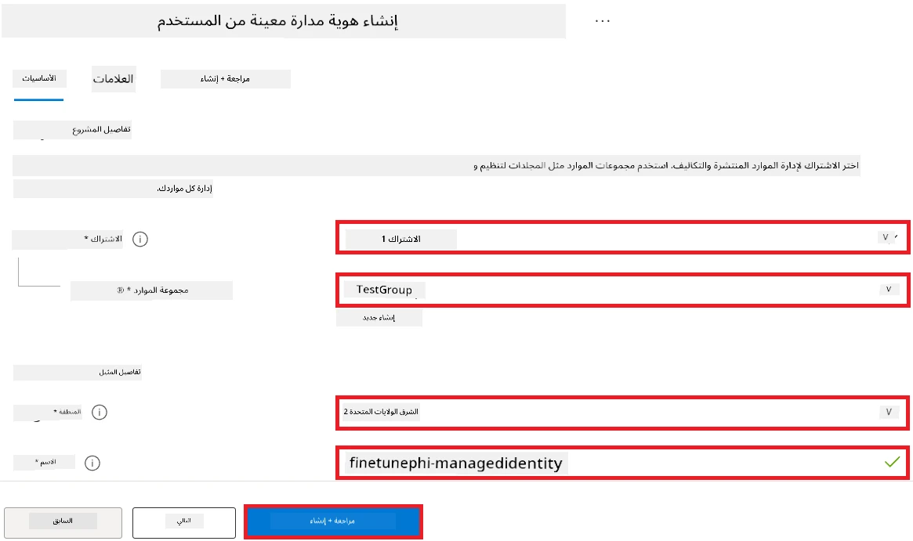

1. اختر **مراجعة + إنشاء**.

1. اختر **+ إنشاء**.

#### إضافة تعيين دور "Contributor" إلى الهوية المُدارة

1. انتقل إلى مورد الهوية المُدارة الذي أنشأته.

1. اختر **تعيينات أدوار Azure** من علامة التبويب الجانبية اليسرى.

1. اختر **+ إضافة تعيين دور** من قائمة التنقل.

1. في صفحة إضافة تعيين الدور، قم بالمهام التالية:
    - اختر **النطاق** ليكون **مجموعة الموارد**.
    - اختر **الاشتراك** الخاص بك في Azure.
    - اختر **مجموعة الموارد** التي تريد استخدامها.
    - اختر **الدور** ليكون **Contributor**.

    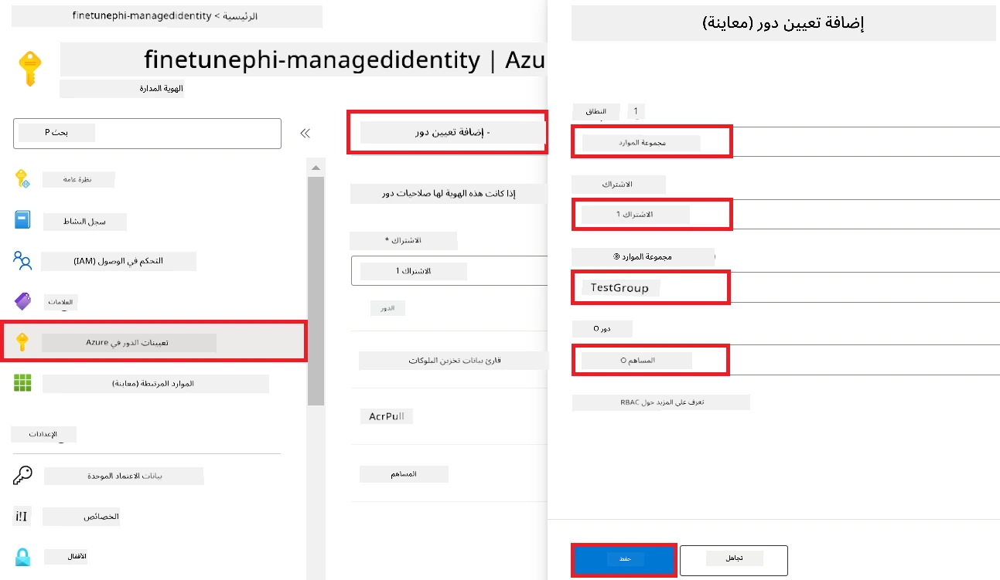

2. اختر **حفظ**.

#### إضافة تعيين دور "Storage Blob Data Reader" إلى الهوية المُدارة

1. اكتب *storage accounts* في **شريط البحث** أعلى صفحة البوابة واختر **Storage accounts** من الخيارات التي تظهر.

    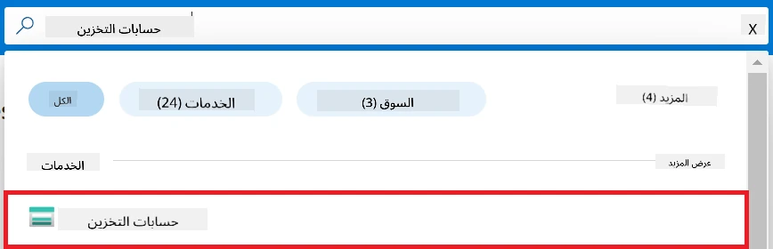

1. اختر حساب التخزين المرتبط بمساحة عمل Azure Machine Learning التي أنشأتها. على سبيل المثال، *finetunephistorage*.

1. قم بالمهام التالية للانتقال إلى صفحة إضافة تعيين الدور:

    - انتقل إلى حساب تخزين Azure الذي أنشأته.
    - اختر **التحكم في الوصول (IAM)** من علامة التبويب الجانبية اليسرى.
    - اختر **+ إضافة** من قائمة التنقل.
    - اختر **إضافة تعيين دور** من قائمة التنقل.

    

1. في صفحة إضافة تعيين الدور، قم بالمهام التالية:

    - داخل صفحة الدور، اكتب *Storage Blob Data Reader* في **شريط البحث** واختر **Storage Blob Data Reader** من الخيارات التي تظهر.
    - داخل صفحة الدور، اختر **التالي**.
    - داخل صفحة الأعضاء، اختر **تعيين الوصول إلى** **Managed identity**.
    - داخل صفحة الأعضاء، اختر **+ اختيار الأعضاء**.
    - داخل صفحة اختيار الهويات المُدارة، اختر **الاشتراك** الخاص بك في Azure.
    - داخل صفحة اختيار الهويات المُدارة، اختر **الهوية المُدارة** لتكون **Manage Identity**.
    - داخل صفحة اختيار الهويات المُدارة، اختر الهوية المُدارة التي أنشأتها، على سبيل المثال *finetunephi-managedidentity*.
    - داخل صفحة اختيار الهويات المُدارة، اختر **اختيار**.

    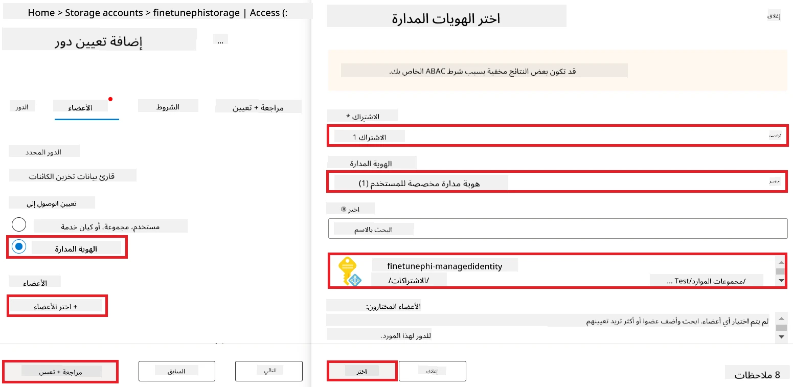

1. اختر **مراجعة + تعيين**.

#### إضافة تعيين دور "AcrPull" إلى الهوية المُدارة

1. اكتب *container registries* في **شريط البحث** أعلى صفحة البوابة واختر **Container registries** من الخيارات التي تظهر.

    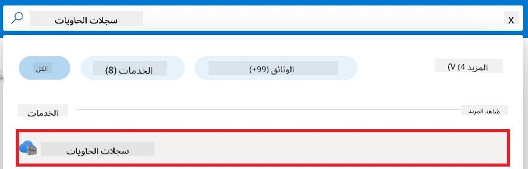

1. اختر سجل الحاويات المرتبط بمساحة عمل Azure Machine Learning. على سبيل المثال، *finetunephicontainerregistry*

1. قم بالمهام التالية للانتقال إلى صفحة إضافة تعيين الدور:

    - اختر **التحكم في الوصول (IAM)** من علامة التبويب الجانبية اليسرى.
    - اختر **+ إضافة** من قائمة التنقل.
    - اختر **إضافة تعيين دور** من قائمة التنقل.

1. في صفحة إضافة تعيين الدور، قم بالمهام التالية:

    - في صفحة الدور، اكتب *AcrPull* في **شريط البحث** واختر **AcrPull** من الخيارات التي تظهر.
    - في صفحة الدور، اختر **التالي**.
    - في صفحة الأعضاء، اختر **تعيين الوصول إلى** **Managed identity**.
    - في صفحة الأعضاء، اختر **+ اختيار الأعضاء**.
    - في صفحة اختيار الهويات المُدارة، اختر **الاشتراك** الخاص بك في Azure.
    - في صفحة اختيار الهويات المُدارة، اختر **الهوية المُدارة** لتكون **Manage Identity**.
    - في صفحة اختيار الهويات المُدارة، اختر الهوية المُدارة التي أنشأتها، على سبيل المثال *finetunephi-managedidentity*.
    - في صفحة اختيار الهويات المُدارة، اختر **اختيار**.
    - اختر **مراجعة + تعيين**.

### إعداد المشروع

لتنزيل مجموعات البيانات المطلوبة لضبط النموذج، ستقوم بإعداد بيئة محلية.

في هذا التمرين، ستقوم بـ

- إنشاء مجلد للعمل بداخله.
- إنشاء بيئة افتراضية.
- تثبيت الحزم المطلوبة.
- إنشاء ملف *download_dataset.py* لتنزيل مجموعة البيانات.

#### إنشاء مجلد للعمل بداخله

1. افتح نافذة طرفية واكتب الأمر التالي لإنشاء مجلد باسم *finetune-phi* في المسار الافتراضي.

    ```console
    mkdir finetune-phi
    ```

2. اكتب الأمر التالي داخل طرفيتك للانتقال إلى مجلد *finetune-phi* الذي أنشأته.

    ```console
    cd finetune-phi
    ```

#### إنشاء بيئة افتراضية

1. اكتب الأمر التالي داخل طرفيتك لإنشاء بيئة افتراضية باسم *.venv*.

    ```console
    python -m venv .venv
    ```

2. اكتب الأمر التالي داخل طرفيتك لتفعيل البيئة الافتراضية.

    ```console
    .venv\Scripts\activate.bat
    ```

> [!NOTE]
> إذا تم الأمر بنجاح، يجب أن ترى *(.venv)* قبل موجه الأمر.

#### تثبيت الحزم المطلوبة

1. اكتب الأوامر التالية داخل طرفيتك لتثبيت الحزم المطلوبة.

    ```console
    pip install datasets==2.19.1
    ```

#### إنشاء `donload_dataset.py`

> [!NOTE]
> الهيكل الكامل للمجلد:
>
> ```text
> └── YourUserName
> .    └── finetune-phi
> .        └── download_dataset.py
> ```

1. افتح **Visual Studio Code**.

1. اختر **ملف** من شريط القائمة.

1. اختر **فتح مجلد**.

1. اختر مجلد *finetune-phi* الذي أنشأته، الموجود في *C:\Users\yourUserName\finetune-phi*.

    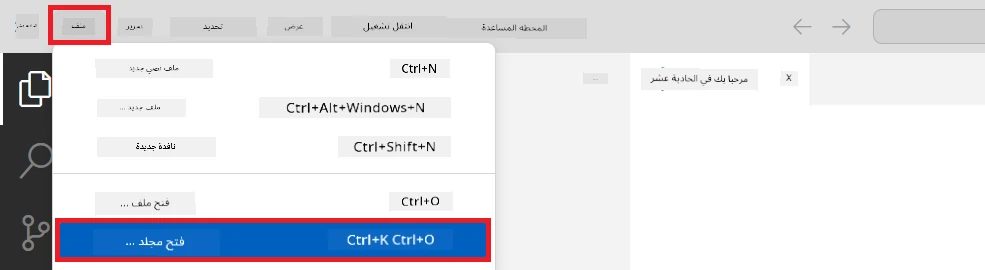

1. في اللوحة اليسرى من Visual Studio Code، انقر بزر الفأرة الأيمن واختر **ملف جديد** لإنشاء ملف جديد باسم *download_dataset.py*.

    

### إعداد بيانات التدريب لضبط النموذج

في هذا التمرين، ستقوم بتشغيل ملف *download_dataset.py* لتحميل مجموعات بيانات *ultrachat_200k* إلى بيئتك المحلية. ثم ستستخدم هذه البيانات لضبط نموذج Phi-3 في Azure Machine Learning.

في هذا التمرين، ستقوم بـ:

- إضافة الكود إلى ملف *download_dataset.py* لتحميل مجموعات البيانات.
- تشغيل ملف *download_dataset.py* لتحميل مجموعات البيانات إلى بيئتك المحلية.

#### تحميل مجموعة البيانات باستخدام *download_dataset.py*

1. افتح ملف *download_dataset.py* في Visual Studio Code.

1. أضف الكود التالي في ملف *download_dataset.py*.

    ```python
    import json
    import os
    from datasets import load_dataset

    def load_and_split_dataset(dataset_name, config_name, split_ratio):
        """
        Load and split a dataset.
        """
        # تحميل مجموعة البيانات بالاسم المحدد، والإعداد، ونسبة التقسيم
        dataset = load_dataset(dataset_name, config_name, split=split_ratio)
        print(f"Original dataset size: {len(dataset)}")
        
        # تقسيم مجموعة البيانات إلى مجموعات تدريب واختبار (80% تدريب، 20% اختبار)
        split_dataset = dataset.train_test_split(test_size=0.2)
        print(f"Train dataset size: {len(split_dataset['train'])}")
        print(f"Test dataset size: {len(split_dataset['test'])}")
        
        return split_dataset

    def save_dataset_to_jsonl(dataset, filepath):
        """
        Save a dataset to a JSONL file.
        """
        # إنشاء الدليل إذا لم يكن موجودًا
        os.makedirs(os.path.dirname(filepath), exist_ok=True)
        
        # فتح الملف بوضع الكتابة
        with open(filepath, 'w', encoding='utf-8') as f:
            # التكرار على كل سجل في مجموعة البيانات
            for record in dataset:
                # تفريغ السجل ككائن JSON وكتابته في الملف
                json.dump(record, f)
                # كتابة حرف سطر جديد لفصل السجلات
                f.write('\n')
        
        print(f"Dataset saved to {filepath}")

    def main():
        """
        Main function to load, split, and save the dataset.
        """
        # تحميل وتقسيم مجموعة بيانات ULTRACHAT_200k بإعداد معين ونسبة تقسيم محددة
        dataset = load_and_split_dataset("HuggingFaceH4/ultrachat_200k", 'default', 'train_sft[:1%]')
        
        # استخراج مجموعات بيانات التدريب والاختبار من التقسيم
        train_dataset = dataset['train']
        test_dataset = dataset['test']

        # حفظ مجموعة بيانات التدريب في ملف JSONL
        save_dataset_to_jsonl(train_dataset, "data/train_data.jsonl")
        
        # حفظ مجموعة بيانات الاختبار في ملف JSONL منفصل
        save_dataset_to_jsonl(test_dataset, "data/test_data.jsonl")

    if __name__ == "__main__":
        main()

    ```

1. اكتب الأمر التالي داخل طرفيتك لتشغيل السكريبت وتحميل مجموعة البيانات إلى بيئتك المحلية.

    ```console
    python download_dataset.py
    ```

1. تحقق من حفظ مجموعات البيانات بنجاح في المجلد *finetune-phi/data* المحلي.

> [!NOTE]
>
> #### ملاحظة حول حجم مجموعة البيانات ووقت الضبط
>
> في هذا الدليل، تستخدم فقط 1% من مجموعة البيانات (`split='train[:1%]'`). هذا يقلل بشكل كبير من كمية البيانات، مما يسرع من عمليات التحميل والضبط. يمكنك تعديل النسبة لإيجاد التوازن المناسب بين وقت التدريب وأداء النموذج. استخدام جزء أصغر من مجموعة البيانات يقلل من الوقت المطلوب للضبط، مما يجعل العملية أكثر قابلية للإدارة في دليل تعليمي.

## السيناريو 2: ضبط نموذج Phi-3 ونشره في Azure Machine Learning Studio

### ضبط نموذج Phi-3

في هذا التمرين، ستقوم بضبط نموذج Phi-3 في Azure Machine Learning Studio.

في هذا التمرين، ستقوم بـ:

- إنشاء مجموعة حوسبة لضبط النموذج.
- ضبط نموذج Phi-3 في Azure Machine Learning Studio.

#### إنشاء مجموعة حوسبة لضبط النموذج

1. زر [Azure ML Studio](https://ml.azure.com/home?wt.mc_id=studentamb_279723).

1. اختر **الحوسبة** من القائمة الجانبية اليمنى.

1. اختر **مجموعات الحوسبة** من قائمة التنقل.

1. اختر **+ جديد**.

    

1. قم بالمهام التالية:

    - اختر **المنطقة** التي تريد استخدامها.
    - اختر **فئة الجهاز الافتراضي** إلى **مخصص**.
    - اختر **نوع الجهاز الافتراضي** إلى **GPU**.
    - اختر فلتر **حجم الجهاز الافتراضي** إلى **اختر من جميع الخيارات**.
    - اختر **حجم الجهاز الافتراضي** إلى **Standard_NC24ads_A100_v4**.

    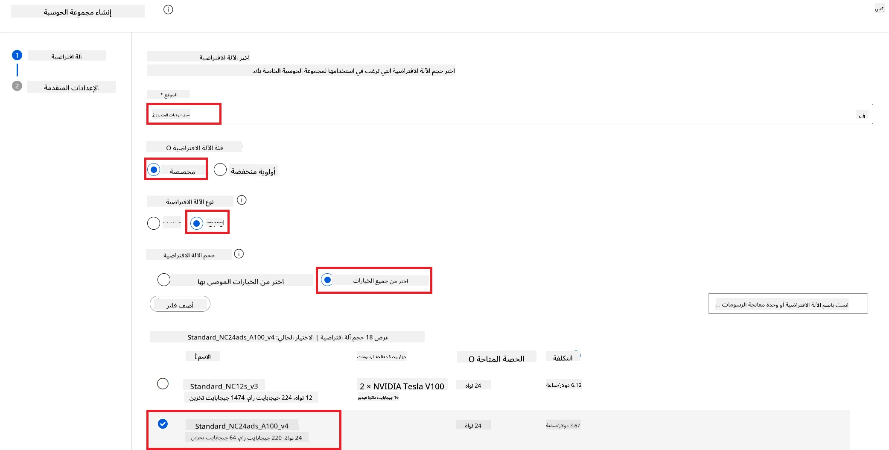

1. اختر **التالي**.

1. قم بالمهام التالية:

    - أدخل **اسم الحوسبة**. يجب أن يكون قيمة فريدة.
    - اختر **الحد الأدنى لعدد العقد** إلى **0**.
    - اختر **الحد الأقصى لعدد العقد** إلى **1**.
    - اختر **الثواني قبل تقليل الحجم** إلى **120**.

    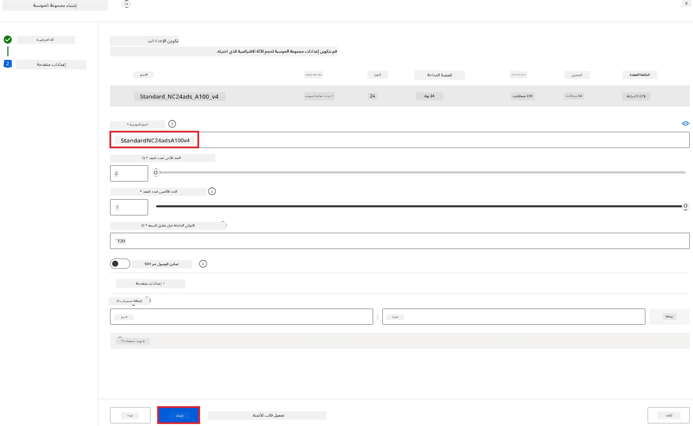

1. اختر **إنشاء**.

#### ضبط نموذج Phi-3

1. زر [Azure ML Studio](https://ml.azure.com/home?wt.mc_id=studentamb_279723).

1. اختر مساحة عمل Azure Machine Learning التي أنشأتها.

    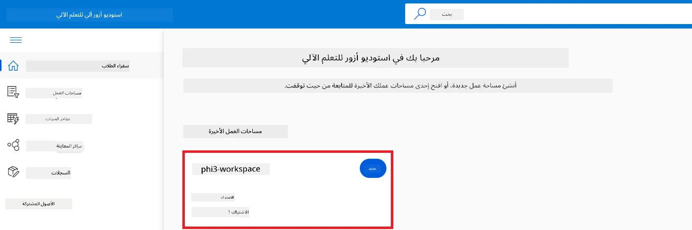

1. قم بالمهام التالية:

    - اختر **كتالوج النماذج** من القائمة الجانبية اليمنى.
    - اكتب *phi-3-mini-4k* في شريط البحث واختر **Phi-3-mini-4k-instruct** من الخيارات التي تظهر.

    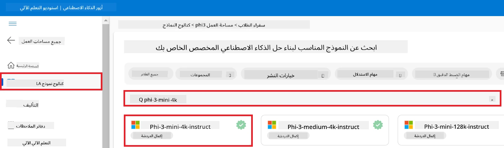

1. اختر **ضبط** من قائمة التنقل.

    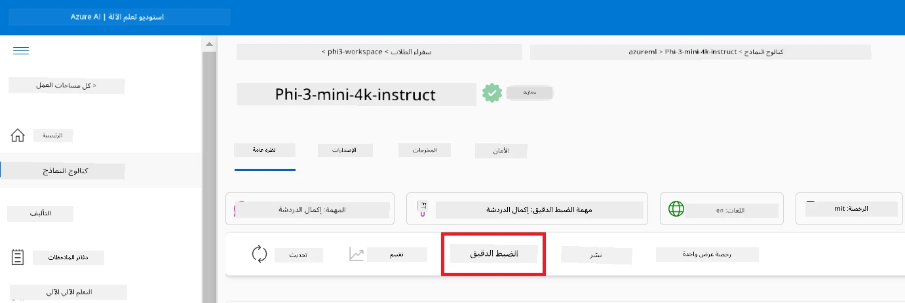

1. قم بالمهام التالية:

    - اختر **تحديد نوع المهمة** إلى **اكتمال المحادثة**.
    - اختر **+ اختيار بيانات** لتحميل **بيانات التدريب**.
    - اختر نوع تحميل بيانات التحقق إلى **توفير بيانات تحقق مختلفة**.
    - اختر **+ اختيار بيانات** لتحميل **بيانات التحقق**.

    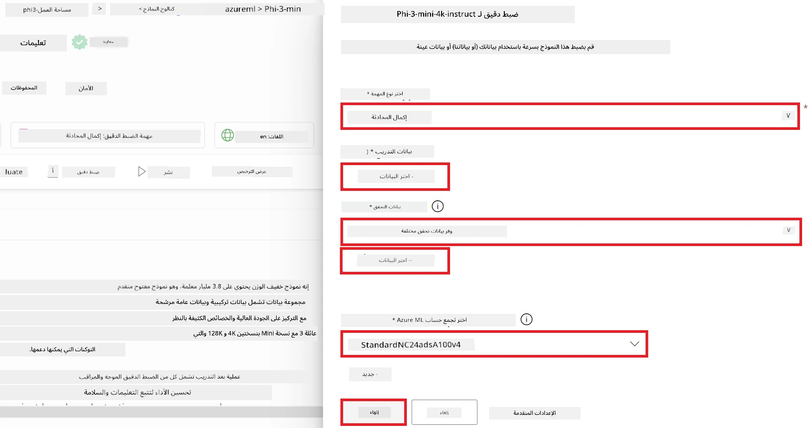

> [!TIP]
>
> يمكنك اختيار **الإعدادات المتقدمة** لتخصيص الإعدادات مثل **learning_rate** و **lr_scheduler_type** لتحسين عملية الضبط حسب احتياجاتك الخاصة.

1. اختر **إنهاء**.

1. في هذا التمرين، قمت بضبط نموذج Phi-3 بنجاح باستخدام Azure Machine Learning. يرجى ملاحظة أن عملية الضبط قد تستغرق وقتًا طويلاً. بعد تشغيل مهمة الضبط، تحتاج إلى الانتظار حتى تكتمل. يمكنك مراقبة حالة مهمة الضبط عن طريق الانتقال إلى تبويب الوظائف على الجانب الأيسر من مساحة عمل Azure Machine Learning الخاصة بك. في السلسلة التالية، ستقوم بنشر النموذج الذي تم ضبطه ودمجه مع Prompt flow.

    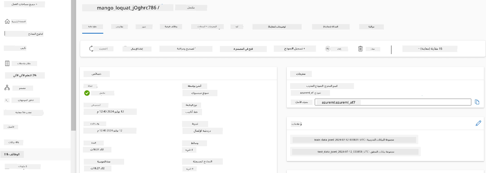

### نشر نموذج Phi-3 الذي تم ضبطه

لدمج نموذج Phi-3 المخصص مع Prompt flow، تحتاج إلى نشر النموذج لجعله متاحًا للاستدلال في الوقت الحقيقي. تتضمن هذه العملية تسجيل النموذج، وإنشاء نقطة نهاية عبر الإنترنت، ونشر النموذج.

في هذا التمرين، ستقوم بـ:

- تسجيل النموذج الذي تم ضبطه في مساحة عمل Azure Machine Learning.
- إنشاء نقطة نهاية عبر الإنترنت.
- نشر نموذج Phi-3 الذي تم تسجيله والمضبوط.

#### تسجيل النموذج الذي تم ضبطه

1. زر [Azure ML Studio](https://ml.azure.com/home?wt.mc_id=studentamb_279723).

1. اختر مساحة عمل Azure Machine Learning التي أنشأتها.

    

1. اختر **النماذج** من القائمة الجانبية اليمنى.
1. اختر **+ تسجيل**.
1. اختر **من مخرجات المهمة**.

    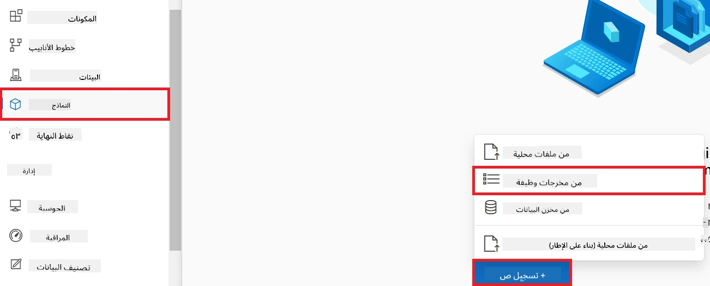

1. اختر المهمة التي أنشأتها.

    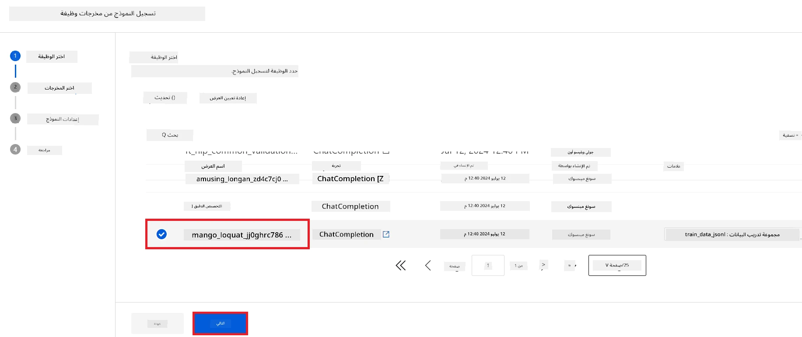

1. اختر **التالي**.

1. اختر **نوع النموذج** إلى **MLflow**.

1. تأكد من اختيار **مخرجات المهمة**؛ يجب أن تكون مختارة تلقائيًا.

    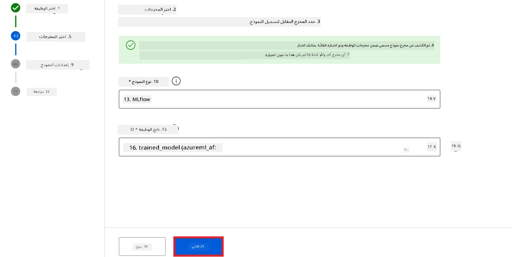

2. اختر **التالي**.

3. اختر **تسجيل**.

    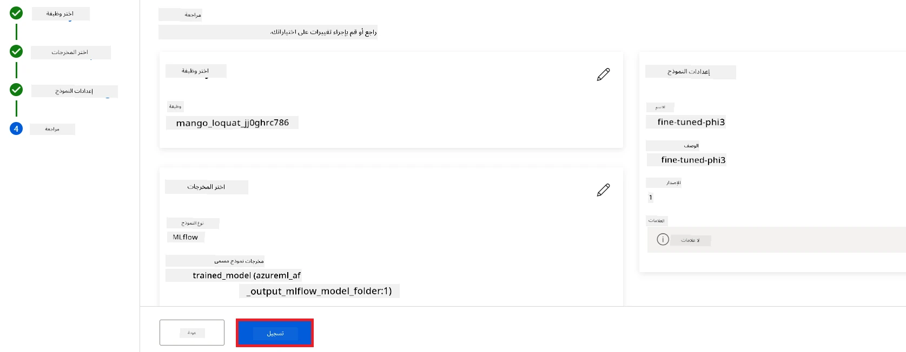

4. يمكنك عرض نموذجك المسجل بالانتقال إلى قائمة **النماذج** من القائمة الجانبية اليمنى.

    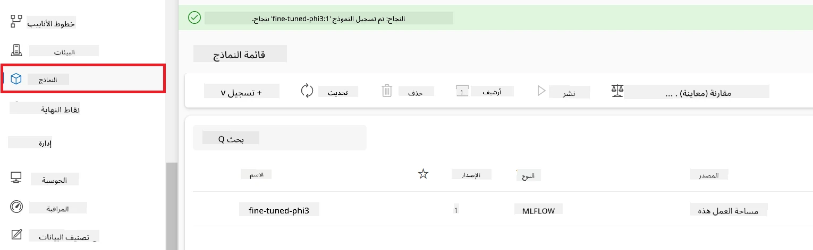

#### نشر النموذج الذي تم ضبطه

1. انتقل إلى مساحة عمل Azure Machine Learning التي أنشأتها.

1. اختر **نقاط النهاية** من القائمة الجانبية اليمنى.

1. اختر **نقاط النهاية في الوقت الحقيقي** من قائمة التنقل.

    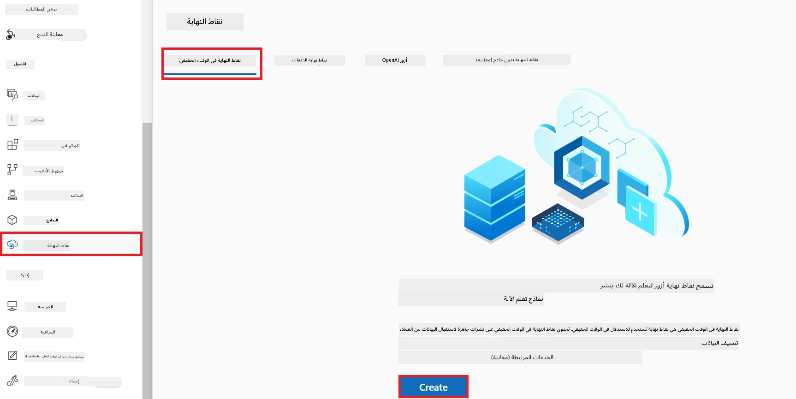

1. اختر **إنشاء**.

1. اختر النموذج المسجل الذي أنشأته.

    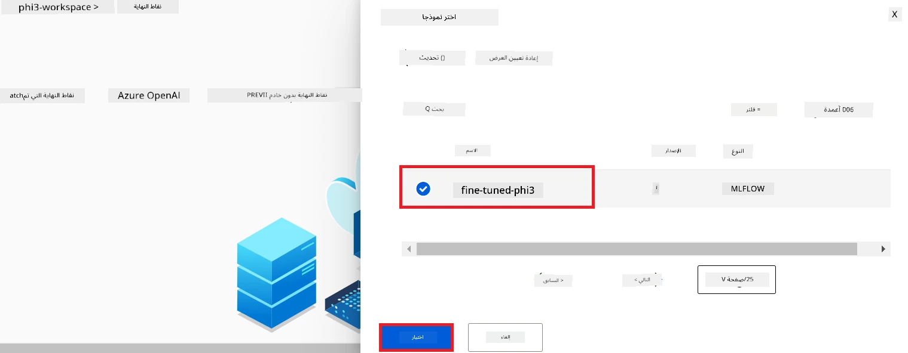

1. اختر **اختيار**.

1. قم بالمهام التالية:

    - اختر **الجهاز الافتراضي** إلى *Standard_NC6s_v3*.
    - اختر عدد الحواسيب الافتراضية التي ترغب في استخدامها. على سبيل المثال، *1*.
    - اختر **نقطة النهاية** إلى **جديدة** لإنشاء نقطة نهاية جديدة.
    - أدخل **اسم نقطة النهاية**. يجب أن يكون قيمة فريدة.
    - أدخل **اسم النشر**. يجب أن يكون قيمة فريدة.

    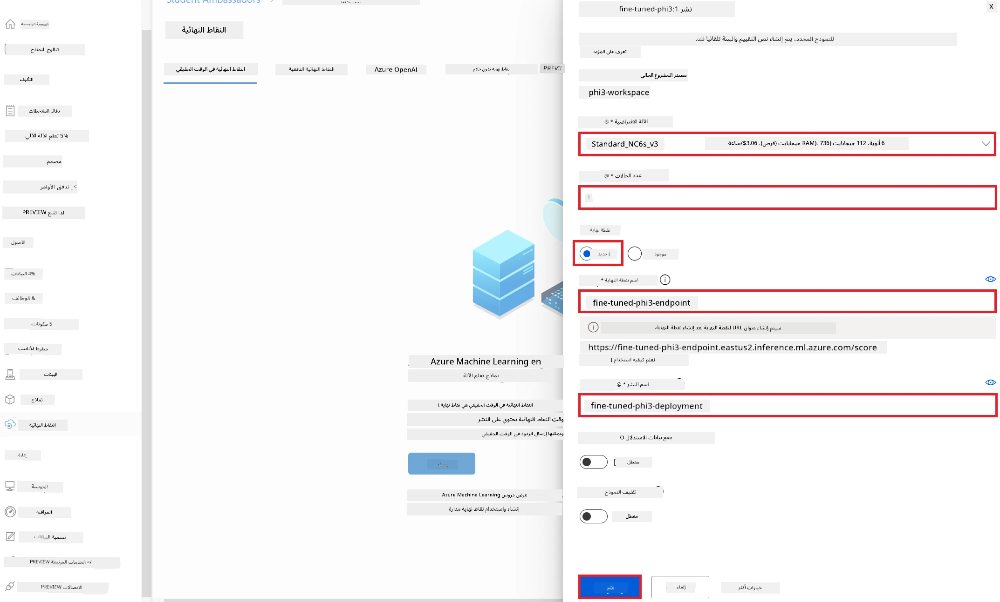

1. اختر **نشر**.

> [!WARNING]
> لتجنب رسوم إضافية على حسابك، تأكد من حذف نقطة النهاية المنشأة في مساحة عمل Azure Machine Learning.
>

#### التحقق من حالة النشر في مساحة عمل Azure Machine Learning

1. انتقل إلى مساحة عمل Azure Machine Learning التي أنشأتها.

1. اختر **نقاط النهاية** من القائمة الجانبية اليمنى.

1. اختر نقطة النهاية التي أنشأتها.

    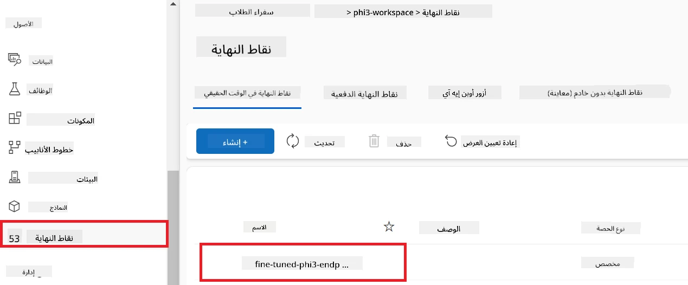

1. في هذه الصفحة، يمكنك إدارة نقاط النهاية أثناء عملية النشر.

> [!NOTE]
> بمجرد اكتمال النشر، تأكد من أن **حركة المرور الحية** مضبوطة على **100%**. إذا لم تكن كذلك، اختر **تحديث حركة المرور** لضبط الإعدادات. لاحظ أنه لا يمكن اختبار النموذج إذا كانت حركة المرور مضبوطة على 0%.
>
> 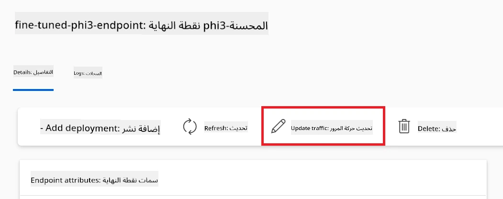
>

## السيناريو 3: الدمج مع Prompt flow والمحادثة مع نموذجك المخصص في Azure AI Foundry

### دمج نموذج Phi-3 المخصص مع Prompt flow

بعد نشر نموذجك الذي تم ضبطه بنجاح، يمكنك الآن دمجه مع Prompt Flow لاستخدام نموذجك في التطبيقات في الوقت الحقيقي، مما يمكن من تنفيذ مهام تفاعلية متنوعة مع نموذج Phi-3 المخصص الخاص بك.

في هذا التمرين، ستقوم بـ:

- إنشاء مركز Azure AI Foundry.
- إنشاء مشروع Azure AI Foundry.
- إنشاء Prompt flow.
- إضافة اتصال مخصص لنموذج Phi-3 الذي تم ضبطه.
- إعداد Prompt flow للمحادثة مع نموذج Phi-3 المخصص الخاص بك.

> [!NOTE]
> يمكنك أيضًا الدمج مع Promptflow باستخدام Azure ML Studio. يمكن تطبيق نفس عملية الدمج على Azure ML Studio.

#### إنشاء مركز Azure AI Foundry

تحتاج إلى إنشاء مركز قبل إنشاء المشروع. يعمل المركز كمجموعة موارد، مما يسمح لك بتنظيم وإدارة عدة مشاريع داخل Azure AI Foundry.

1. زر [Azure AI Foundry](https://ai.azure.com/?WT.mc_id=aiml-137032-kinfeylo).

1. اختر **كل المراكز** من القائمة الجانبية اليمنى.

1. اختر **+ مركز جديد** من قائمة التنقل.
    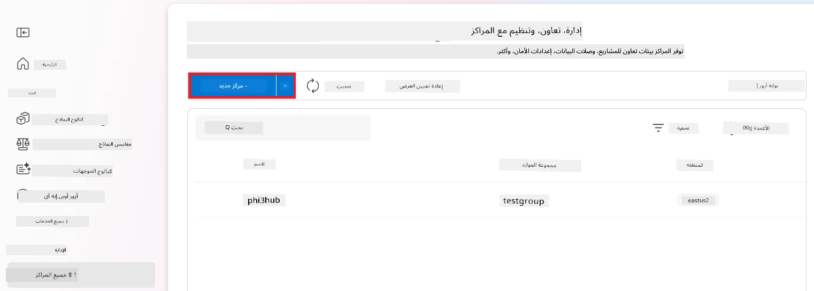

1. قم بتنفيذ المهام التالية:

    - أدخل **اسم المحور**. يجب أن يكون قيمة فريدة.
    - اختر **الاشتراك** الخاص بك في Azure.
    - اختر **مجموعة الموارد** التي تريد استخدامها (أنشئ مجموعة جديدة إذا لزم الأمر).
    - اختر **الموقع** الذي ترغب في استخدامه.
    - اختر **الاتصال بخدمات Azure AI** التي تريد استخدامها (أنشئ واحدة جديدة إذا لزم الأمر).
    - اختر **الاتصال بـ Azure AI Search** لتحديد **تخطي الاتصال**.

    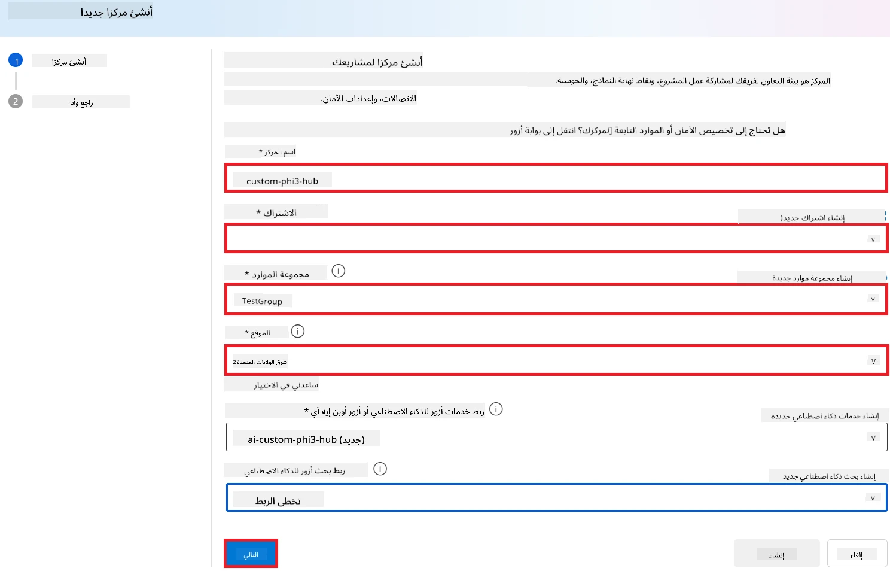

1. اختر **التالي**.

#### إنشاء مشروع Azure AI Foundry

1. في المحور الذي أنشأته، اختر **جميع المشاريع** من تبويب الجانب الأيسر.

1. اختر **+ مشروع جديد** من قائمة التنقل.

    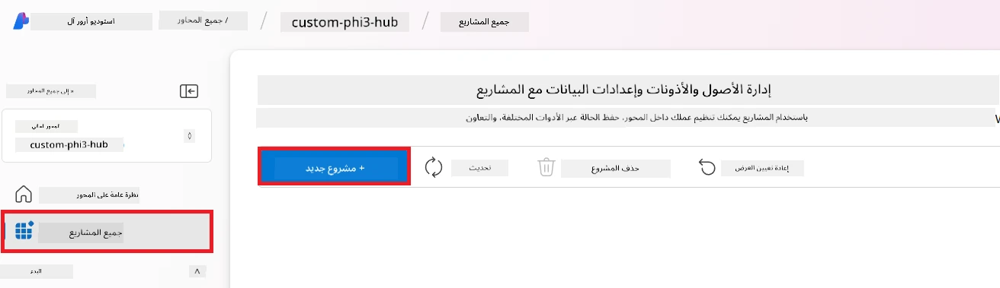

1. أدخل **اسم المشروع**. يجب أن يكون قيمة فريدة.

    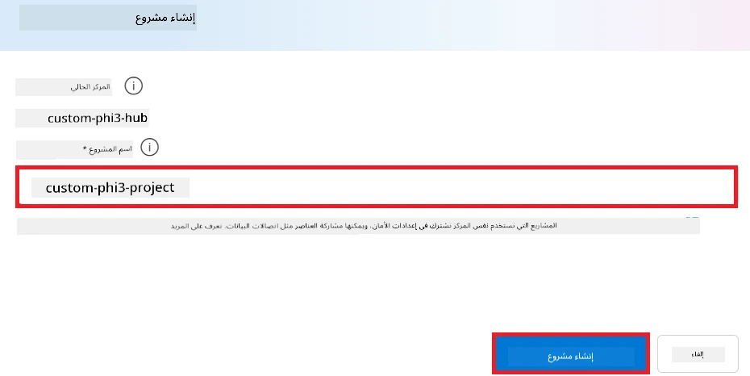

1. اختر **إنشاء مشروع**.

#### إضافة اتصال مخصص لنموذج Phi-3 المحسن

لدمج نموذج Phi-3 المخصص الخاص بك مع Prompt flow، تحتاج إلى حفظ نقطة النهاية والمفتاح الخاص بالنموذج في اتصال مخصص. يضمن هذا الإعداد الوصول إلى نموذج Phi-3 المخصص الخاص بك في Prompt flow.

#### تعيين مفتاح API وعنوان URI لنقطة نهاية نموذج Phi-3 المحسن

1. قم بزيارة [Azure ML Studio](https://ml.azure.com/home?WT.mc_id=aiml-137032-kinfeylo).

1. انتقل إلى مساحة عمل تعلم الآلة Azure التي أنشأتها.

1. اختر **نقاط النهاية** من تبويب الجانب الأيسر.

    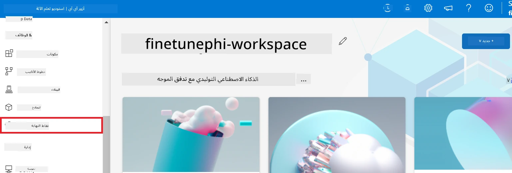

1. اختر نقطة النهاية التي أنشأتها.

    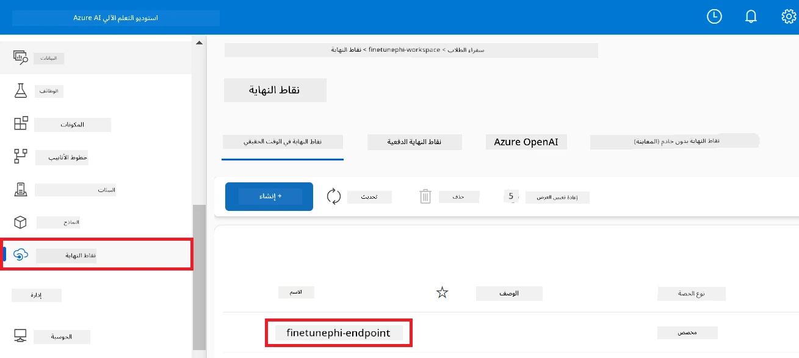

1. اختر **الاستهلاك** من قائمة التنقل.

1. انسخ **نقطة نهاية REST** و **المفتاح الأساسي** الخاص بك.

    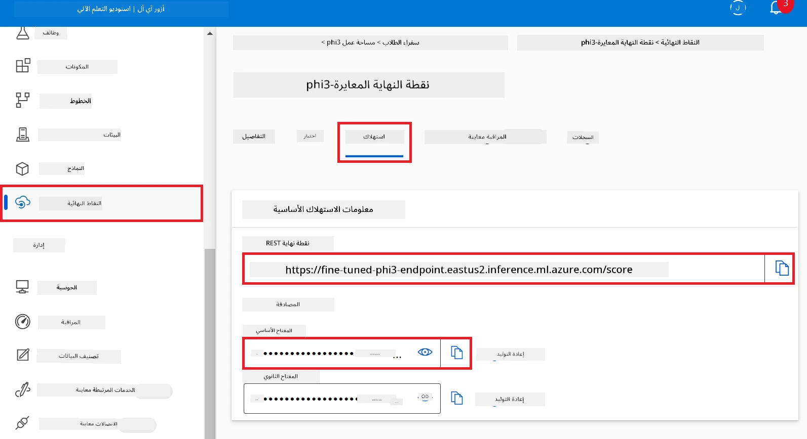

#### إضافة الاتصال المخصص

1. قم بزيارة [Azure AI Foundry](https://ai.azure.com/?WT.mc_id=aiml-137032-kinfeylo).

1. انتقل إلى مشروع Azure AI Foundry الذي أنشأته.

1. في المشروع الذي أنشأته، اختر **الإعدادات** من تبويب الجانب الأيسر.

1. اختر **+ اتصال جديد**.

    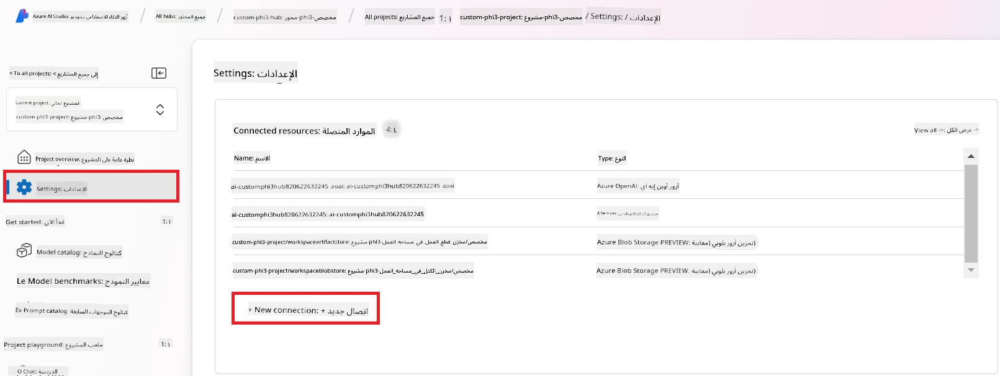

1. اختر **المفاتيح المخصصة** من قائمة التنقل.

    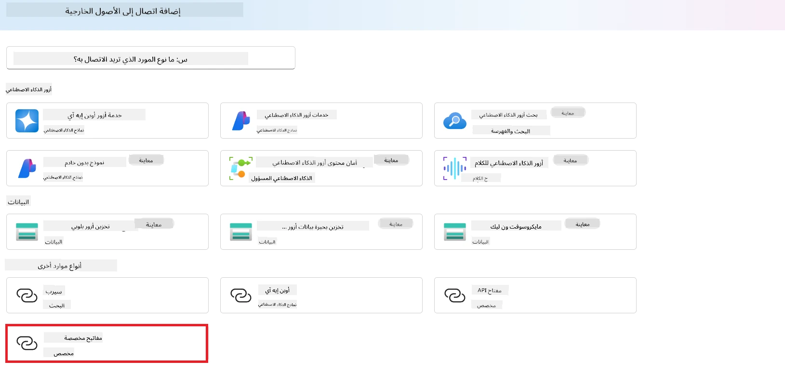

1. قم بتنفيذ المهام التالية:

    - اختر **+ إضافة أزواج مفتاح وقيمة**.
    - لأسم المفتاح، أدخل **endpoint** والصق نقطة النهاية التي نسختها من Azure ML Studio في حقل القيمة.
    - اختر **+ إضافة أزواج مفتاح وقيمة** مرة أخرى.
    - لأسم المفتاح، أدخل **key** والصق المفتاح الذي نسخته من Azure ML Studio في حقل القيمة.
    - بعد إضافة المفاتيح، اختر **هو سرّي** لمنع الكشف عن المفتاح.

    

1. اختر **إضافة اتصال**.

#### إنشاء Prompt flow

لقد أضفت اتصالًا مخصصًا في Azure AI Foundry. الآن، لنقم بإنشاء Prompt flow باستخدام الخطوات التالية. ثم ستقوم بربط هذا الـ Prompt flow بالاتصال المخصص حتى تتمكن من استخدام النموذج المحسن داخل Prompt flow.

1. انتقل إلى مشروع Azure AI Foundry الذي أنشأته.

1. اختر **Prompt flow** من تبويب الجانب الأيسر.

1. اختر **+ إنشاء** من قائمة التنقل.

    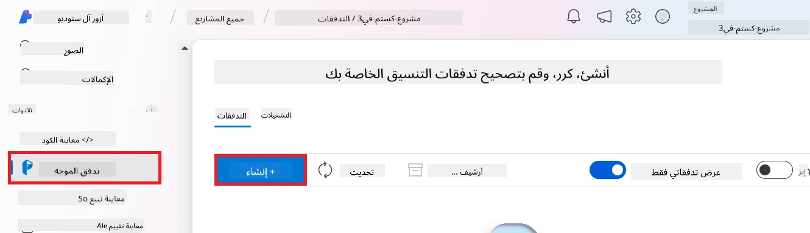

1. اختر **تدفق الدردشة** من قائمة التنقل.

    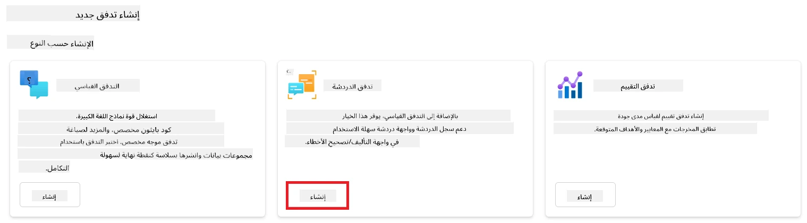

1. أدخل **اسم المجلد** للاستخدام.

    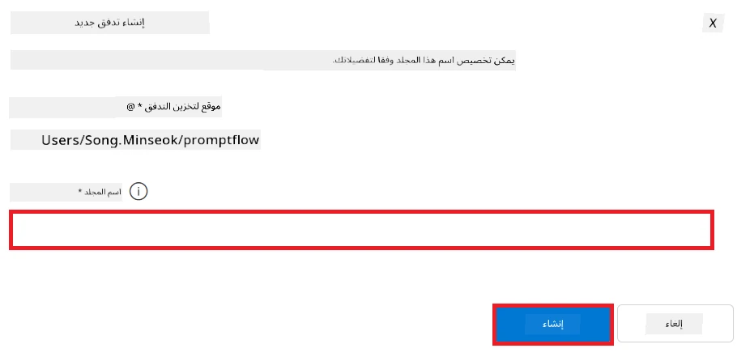

2. اختر **إنشاء**.

#### إعداد Prompt flow للدردشة مع نموذج Phi-3 المخصص الخاص بك

تحتاج إلى دمج نموذج Phi-3 المحسّن داخل Prompt flow. ومع ذلك، فإن Prompt flow الحالي المقدم غير مصمم لهذا الغرض. لذلك، يجب إعادة تصميم Prompt flow للسماح بدمج النموذج المخصص.

1. في Prompt flow، قم بتنفيذ المهام التالية لإعادة بناء التدفق الحالي:

    - اختر **وضع ملف خام**.
    - احذف كل الكود الموجود في ملف *flow.dag.yml*.
    - أضف الكود التالي في ملف *flow.dag.yml*.

        ```yml
        inputs:
          input_data:
            type: string
            default: "Who founded Microsoft?"

        outputs:
          answer:
            type: string
            reference: ${integrate_with_promptflow.output}

        nodes:
        - name: integrate_with_promptflow
          type: python
          source:
            type: code
            path: integrate_with_promptflow.py
          inputs:
            input_data: ${inputs.input_data}
        ```

    - اختر **حفظ**.

    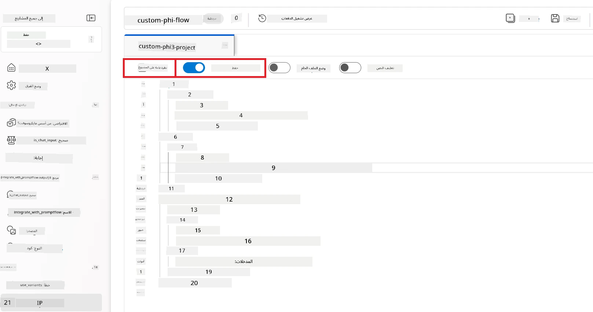

1. أضف الكود التالي إلى ملف *integrate_with_promptflow.py* لاستخدام نموذج Phi-3 المخصص في Prompt flow.

    ```python
    import logging
    import requests
    from promptflow import tool
    from promptflow.connections import CustomConnection

    # إعداد التسجيل
    logging.basicConfig(
        format="%(asctime)s - %(levelname)s - %(name)s - %(message)s",
        datefmt="%Y-%m-%d %H:%M:%S",
        level=logging.DEBUG
    )
    logger = logging.getLogger(__name__)

    def query_phi3_model(input_data: str, connection: CustomConnection) -> str:
        """
        Send a request to the Phi-3 model endpoint with the given input data using Custom Connection.
        """

        # "connection" هو اسم الاتصال المخصص، و "endpoint"، و "key" هي المفاتيح في الاتصال المخصص
        endpoint_url = connection.endpoint
        api_key = connection.key

        headers = {
            "Content-Type": "application/json",
            "Authorization": f"Bearer {api_key}"
        }
        data = {
            "input_data": {
                "input_string": [
                    {"role": "user", "content": input_data}
                ],
                "parameters": {
                    "temperature": 0.7,
                    "max_new_tokens": 128
                }
            }
        }
        try:
            response = requests.post(endpoint_url, json=data, headers=headers)
            response.raise_for_status()
            
            # سجل الاستجابة الكاملة بصيغة JSON
            logger.debug(f"Full JSON response: {response.json()}")

            result = response.json()["output"]
            logger.info("Successfully received response from Azure ML Endpoint.")
            return result
        except requests.exceptions.RequestException as e:
            logger.error(f"Error querying Azure ML Endpoint: {e}")
            raise

    @tool
    def my_python_tool(input_data: str, connection: CustomConnection) -> str:
        """
        Tool function to process input data and query the Phi-3 model.
        """
        return query_phi3_model(input_data, connection)

    ```

    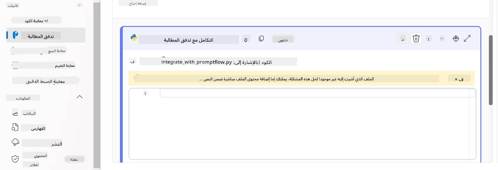

> [!NOTE]
> لمزيد من المعلومات التفصيلية حول استخدام Prompt flow في Azure AI Foundry، يمكنك الرجوع إلى [Prompt flow في Azure AI Foundry](https://learn.microsoft.com/azure/ai-studio/how-to/prompt-flow).

1. اختر **إدخال الدردشة**، و **إخراج الدردشة** لتمكين الدردشة مع نموذجك.

    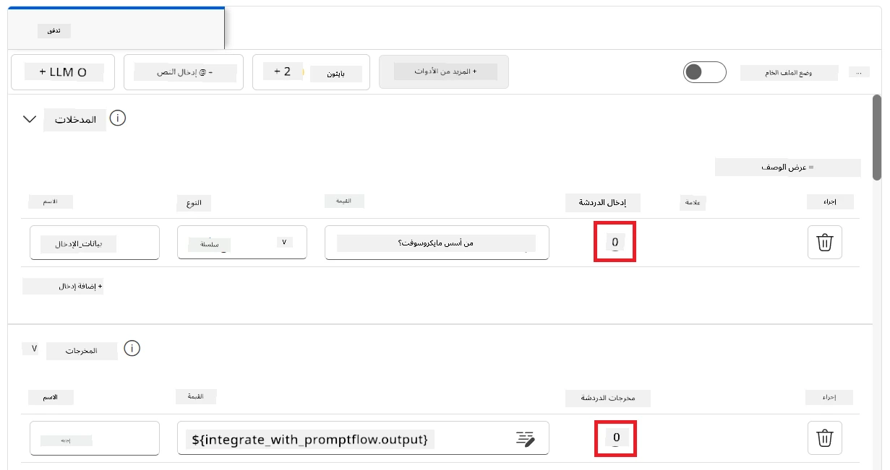

1. الآن أنت جاهز للدردشة مع نموذج Phi-3 المخصص الخاص بك. في التمرين التالي، ستتعلم كيفية بدء Prompt flow واستخدامه للدردشة مع نموذج Phi-3 المحسّن الخاص بك.

> [!NOTE]
>
> يجب أن يبدو التدفق المعاد بناؤه مثل الصورة أدناه:
>
> 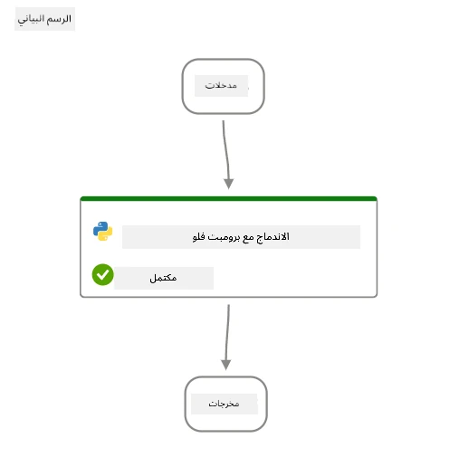
>

### الدردشة مع نموذج Phi-3 المخصص الخاص بك

الآن وبعد أن قمت بضبط وتحسين نموذج Phi-3 المخصص ودمجه مع Prompt flow، أنت جاهز للبدء بالتفاعل معه. سيرشدك هذا التمرين خلال خطوات إعداد وبدء جلسة دردشة مع نموذجك باستخدام Prompt flow. باتباع هذه الخطوات، ستتمكن من الاستفادة الكاملة من قدرات نموذج Phi-3 المحسن لمهام مختلفة ومحادثات متنوعة.

- دردش مع نموذج Phi-3 المخصص الخاص بك باستخدام Prompt flow.

#### بدء Prompt flow

1. اختر **بدء جلسات الحوسبة** لبدء Prompt flow.

    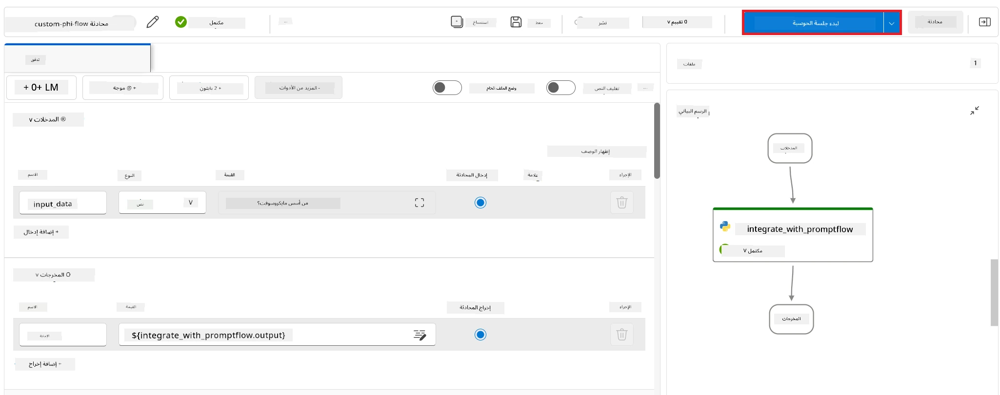

1. اختر **التحقق من صحة وتحليل الإدخال** لتحديث المعلمات.

    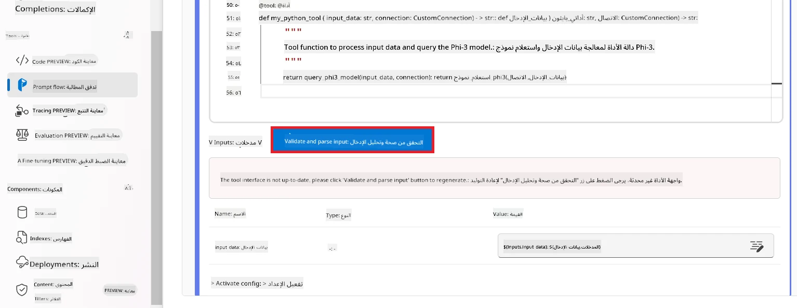

1. اختر **قيمة** الـ **connection** للاتصال المخصص الذي أنشأته. على سبيل المثال، *connection*.

    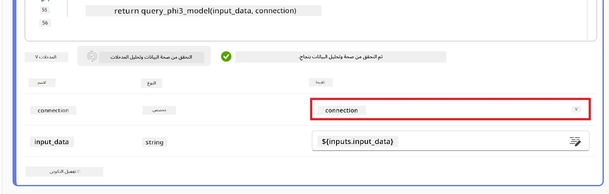

#### دردش مع نموذجك المخصص

1. اختر **الدردشة**.

    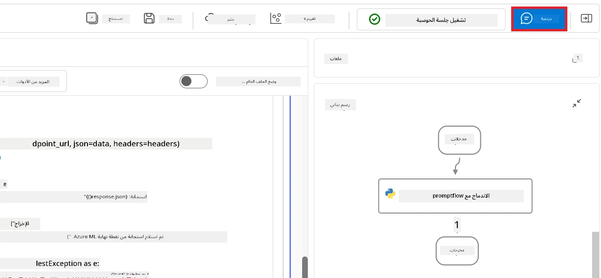

1. فيما يلي مثال على النتائج: الآن يمكنك الدردشة مع نموذج Phi-3 المخصص الخاص بك. يُنصح بطرح أسئلة بناءً على البيانات المستخدمة لضبط النموذج.

    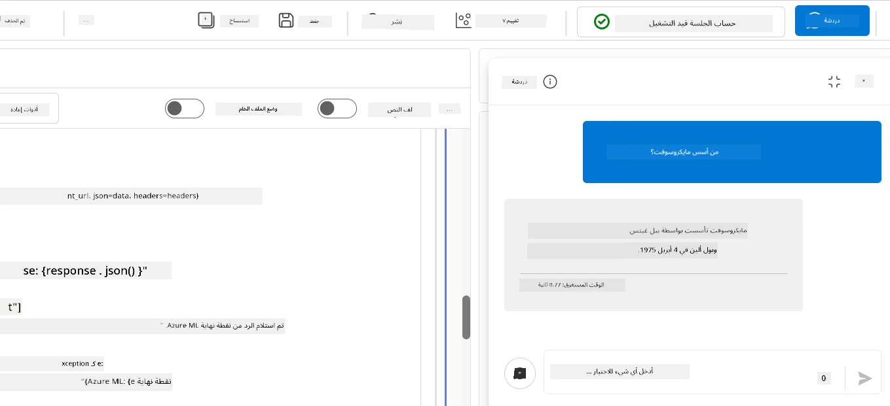

---

<!-- CO-OP TRANSLATOR DISCLAIMER START -->
**تنويه**:  
تم ترجمة هذا المستند باستخدام خدمة الترجمة الآلية [Co-op Translator](https://github.com/Azure/co-op-translator). بينما نسعى لتحقيق الدقة، يرجى العلم أن الترجمات الآلية قد تحتوي على أخطاء أو معلومات غير دقيقة. ينبغي اعتبار الوثيقة الأصلية بلغتها الأصلية المصدر المعتمد. للمعلومات الحساسة أو المهمة، يُنصح بالاستعانة بترجمة بشرية محترفة. نحن غير مسؤولين عن أي سوء فهم أو تفسيرات خاطئة تنشأ عن استخدام هذه الترجمة.
<!-- CO-OP TRANSLATOR DISCLAIMER END -->