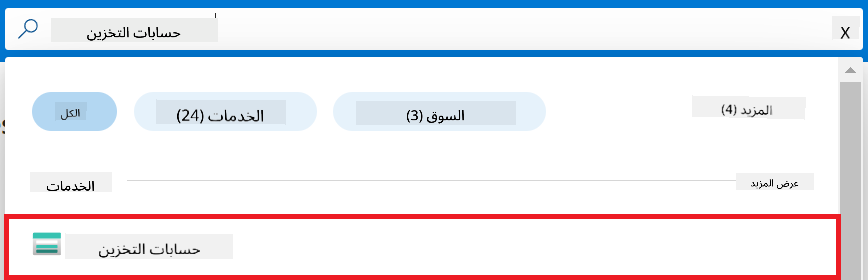
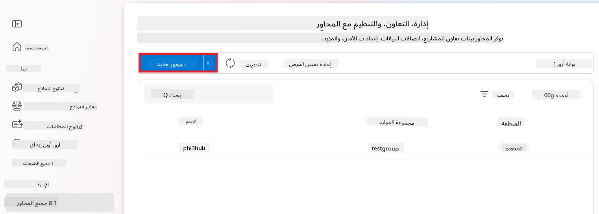

<!--
CO_OP_TRANSLATOR_METADATA:
{
  "original_hash": "ecbd9179a21edbaafaf114d47f09f3e3",
  "translation_date": "2025-05-07T11:00:28+00:00",
  "source_file": "md/02.Application/01.TextAndChat/Phi3/E2E_Phi-3-FineTuning_PromptFlow_Integration_AIFoundry.md",
  "language_code": "ar"
}
-->
# ضبط وتكامل نماذج Phi-3 المخصصة مع Prompt flow في Azure AI Foundry

تعتمد هذه العينة الشاملة (E2E) على الدليل "[ضبط وتكامل نماذج Phi-3 المخصصة مع Prompt Flow في Azure AI Foundry](https://techcommunity.microsoft.com/t5/educator-developer-blog/fine-tune-and-integrate-custom-phi-3-models-with-prompt-flow-in/ba-p/4191726?WT.mc_id=aiml-137032-kinfeylo)" من مجتمع Microsoft Tech. تقدم هذه العينة عمليات الضبط الدقيق، والنشر، والتكامل لنماذج Phi-3 المخصصة مع Prompt flow في Azure AI Foundry.
على عكس العينة الشاملة، "[ضبط وتكامل نماذج Phi-3 المخصصة مع Prompt Flow](./E2E_Phi-3-FineTuning_PromptFlow_Integration.md)"، التي تضمنت تشغيل الكود محليًا، يركز هذا الدليل بالكامل على ضبط وتكامل النموذج الخاص بك داخل Azure AI / ML Studio.

## نظرة عامة

في هذه العينة الشاملة، ستتعلم كيفية ضبط نموذج Phi-3 ودمجه مع Prompt flow في Azure AI Foundry. من خلال الاستفادة من Azure AI / ML Studio، ستنشئ سير عمل لنشر واستخدام نماذج الذكاء الاصطناعي المخصصة. تنقسم هذه العينة إلى ثلاث سيناريوهات:

**السيناريو 1: إعداد موارد Azure والتحضير للضبط الدقيق**

**السيناريو 2: ضبط نموذج Phi-3 ونشره في Azure Machine Learning Studio**

**السيناريو 3: التكامل مع Prompt flow والدردشة مع نموذجك المخصص في Azure AI Foundry**

إليك نظرة عامة على هذه العينة الشاملة.


### جدول المحتويات

1. **[السيناريو 1: إعداد موارد Azure والتحضير للضبط الدقيق](../../../../../../md/02.Application/01.TextAndChat/Phi3)**
    - [إنشاء مساحة عمل Azure Machine Learning](../../../../../../md/02.Application/01.TextAndChat/Phi3)
    - [طلب حصص GPU في اشتراك Azure](../../../../../../md/02.Application/01.TextAndChat/Phi3)
    - [إضافة تعيين دور](../../../../../../md/02.Application/01.TextAndChat/Phi3)
    - [إعداد المشروع](../../../../../../md/02.Application/01.TextAndChat/Phi3)
    - [تحضير مجموعة البيانات للضبط الدقيق](../../../../../../md/02.Application/01.TextAndChat/Phi3)

1. **[السيناريو 2: ضبط نموذج Phi-3 ونشره في Azure Machine Learning Studio](../../../../../../md/02.Application/01.TextAndChat/Phi3)**
    - [ضبط نموذج Phi-3](../../../../../../md/02.Application/01.TextAndChat/Phi3)
    - [نشر نموذج Phi-3 المضبوط](../../../../../../md/02.Application/01.TextAndChat/Phi3)

1. **[السيناريو 3: التكامل مع Prompt flow والدردشة مع نموذجك المخصص في Azure AI Foundry](../../../../../../md/02.Application/01.TextAndChat/Phi3)**
    - [تكامل نموذج Phi-3 المخصص مع Prompt flow](../../../../../../md/02.Application/01.TextAndChat/Phi3)
    - [الدردشة مع نموذج Phi-3 المخصص الخاص بك](../../../../../../md/02.Application/01.TextAndChat/Phi3)

## السيناريو 1: إعداد موارد Azure والتحضير للضبط الدقيق

### إنشاء مساحة عمل Azure Machine Learning

1. اكتب *azure machine learning* في **شريط البحث** أعلى صفحة البوابة واختر **Azure Machine Learning** من الخيارات التي تظهر.

    

2. اختر **+ إنشاء** من قائمة التنقل.

3. اختر **مساحة عمل جديدة** من قائمة التنقل.

    

4. قم بالمهام التالية:

    - اختر **الاشتراك** الخاص بك في Azure.
    - اختر **مجموعة الموارد** التي تريد استخدامها (أنشئ واحدة جديدة إذا لزم الأمر).
    - أدخل **اسم مساحة العمل**. يجب أن يكون قيمة فريدة.
    - اختر **المنطقة** التي ترغب في استخدامها.
    - اختر **حساب التخزين** الذي تريد استخدامه (أنشئ واحدًا جديدًا إذا لزم الأمر).
    - اختر **مخزن المفاتيح** الذي تريد استخدامه (أنشئ واحدًا جديدًا إذا لزم الأمر).
    - اختر **Application insights** الذي تريد استخدامه (أنشئ واحدًا جديدًا إذا لزم الأمر).
    - اختر **سجل الحاويات** الذي تريد استخدامه (أنشئ واحدًا جديدًا إذا لزم الأمر).

    

5. اختر **مراجعة + إنشاء**.

6. اختر **إنشاء**.

### طلب حصص GPU في اشتراك Azure

في هذا الدليل، ستتعلم كيفية ضبط ونشر نموذج Phi-3 باستخدام وحدات معالجة الرسوميات (GPUs). للضبط الدقيق، ستستخدم GPU من نوع *Standard_NC24ads_A100_v4*، والذي يتطلب طلب حصة. للنشر، ستستخدم GPU من نوع *Standard_NC6s_v3*، والذي يتطلب أيضًا طلب حصة.

> [!NOTE]
>
> الاشتراكات من نوع Pay-As-You-Go فقط (نوع الاشتراك القياسي) مؤهلة لتخصيص GPU؛ الاشتراكات ذات الفوائد غير مدعومة حاليًا.
>

1. قم بزيارة [Azure ML Studio](https://ml.azure.com/home?wt.mc_id=studentamb_279723).

1. قم بالمهام التالية لطلب حصة *Standard NCADSA100v4 Family*:

    - اختر **الحصص** من علامة التبويب الجانبية.
    - اختر **عائلة الأجهزة الافتراضية** التي تريد استخدامها. على سبيل المثال، اختر **Standard NCADSA100v4 Family Cluster Dedicated vCPUs**، والتي تتضمن GPU من نوع *Standard_NC24ads_A100_v4*.
    - اختر **طلب الحصة** من قائمة التنقل.

        

    - في صفحة طلب الحصة، أدخل **الحد الجديد للنوى** الذي ترغب في استخدامه. على سبيل المثال، 24.
    - في صفحة طلب الحصة، اختر **إرسال** لطلب حصة GPU.

1. قم بالمهام التالية لطلب حصة *Standard NCSv3 Family*:

    - اختر **الحصص** من علامة التبويب الجانبية.
    - اختر **عائلة الأجهزة الافتراضية** التي تريد استخدامها. على سبيل المثال، اختر **Standard NCSv3 Family Cluster Dedicated vCPUs**، والتي تتضمن GPU من نوع *Standard_NC6s_v3*.
    - اختر **طلب الحصة** من قائمة التنقل.
    - في صفحة طلب الحصة، أدخل **الحد الجديد للنوى** الذي ترغب في استخدامه. على سبيل المثال، 24.
    - في صفحة طلب الحصة، اختر **إرسال** لطلب حصة GPU.

### إضافة تعيين دور

لضبط ونشر نماذجك، يجب أولاً إنشاء هوية مُدارة مخصصة للمستخدم (UAI) ومنحها الأذونات المناسبة. ستُستخدم هذه الهوية المُدارة للمصادقة أثناء النشر.

#### إنشاء هوية مُدارة مخصصة للمستخدم (UAI)

1. اكتب *managed identities* في **شريط البحث** أعلى صفحة البوابة واختر **Managed Identities** من الخيارات التي تظهر.

    

1. اختر **+ إنشاء**.

    

1. قم بالمهام التالية:

    - اختر **الاشتراك** الخاص بك في Azure.
    - اختر **مجموعة الموارد** التي تريد استخدامها (أنشئ واحدة جديدة إذا لزم الأمر).
    - اختر **المنطقة** التي ترغب في استخدامها.
    - أدخل **الاسم**. يجب أن يكون قيمة فريدة.

    

1. اختر **مراجعة + إنشاء**.

1. اختر **+ إنشاء**.

#### إضافة تعيين دور Contributor إلى الهوية المُدارة

1. انتقل إلى مورد الهوية المُدارة الذي أنشأته.

1. اختر **تعيينات أدوار Azure** من علامة التبويب الجانبية.

1. اختر **+ إضافة تعيين دور** من قائمة التنقل.

1. في صفحة إضافة تعيين دور، قم بالمهام التالية:
    - اختر **النطاق** إلى **مجموعة الموارد**.
    - اختر **الاشتراك** الخاص بك في Azure.
    - اختر **مجموعة الموارد** التي تريد استخدامها.
    - اختر **الدور** إلى **Contributor**.

    

2. اختر **حفظ**.

#### إضافة تعيين دور Storage Blob Data Reader إلى الهوية المُدارة

1. اكتب *storage accounts* في **شريط البحث** أعلى صفحة البوابة واختر **Storage accounts** من الخيارات التي تظهر.

    

1. اختر حساب التخزين المرتبط بمساحة عمل Azure Machine Learning التي أنشأتها. على سبيل المثال، *finetunephistorage*.

1. قم بالمهام التالية للانتقال إلى صفحة إضافة تعيين دور:

    - انتقل إلى حساب تخزين Azure الذي أنشأته.
    - اختر **التحكم في الوصول (IAM)** من علامة التبويب الجانبية.
    - اختر **+ إضافة** من قائمة التنقل.
    - اختر **إضافة تعيين دور** من قائمة التنقل.

    

1. في صفحة إضافة تعيين دور، قم بالمهام التالية:

    - في صفحة الدور، اكتب *Storage Blob Data Reader* في **شريط البحث** واختر **Storage Blob Data Reader** من الخيارات التي تظهر.
    - في صفحة الدور، اختر **التالي**.
    - في صفحة الأعضاء، اختر **تعيين الوصول إلى** **Managed identity**.
    - في صفحة الأعضاء، اختر **+ تحديد الأعضاء**.
    - في صفحة تحديد الهويات المُدارة، اختر **الاشتراك** الخاص بك في Azure.
    - في صفحة تحديد الهويات المُدارة، اختر **الهوية المُدارة** إلى **Manage Identity**.
    - في صفحة تحديد الهويات المُدارة، اختر الهوية المُدارة التي أنشأتها. على سبيل المثال، *finetunephi-managedidentity*.
    - في صفحة تحديد الهويات المُدارة، اختر **تحديد**.

    

1. اختر **مراجعة + تعيين**.

#### إضافة تعيين دور AcrPull إلى الهوية المُدارة

1. اكتب *container registries* في **شريط البحث** أعلى صفحة البوابة واختر **Container registries** من الخيارات التي تظهر.

    

1. اختر سجل الحاويات المرتبط بمساحة عمل Azure Machine Learning. على سبيل المثال، *finetunephicontainerregistry*

1. قم بالمهام التالية للانتقال إلى صفحة إضافة تعيين دور:

    - اختر **التحكم في الوصول (IAM)** من علامة التبويب الجانبية.
    - اختر **+ إضافة** من قائمة التنقل.
    - اختر **إضافة تعيين دور** من قائمة التنقل.

1. في صفحة إضافة تعيين دور، قم بالمهام التالية:

    - في صفحة الدور، اكتب *AcrPull* في **شريط البحث** واختر **AcrPull** من الخيارات التي تظهر.
    - في صفحة الدور، اختر **التالي**.
    - في صفحة الأعضاء، اختر **تعيين الوصول إلى** **Managed identity**.
    - في صفحة الأعضاء، اختر **+ تحديد الأعضاء**.
    - في صفحة تحديد الهويات المُدارة، اختر **الاشتراك** الخاص بك في Azure.
    - في صفحة تحديد الهويات المُدارة، اختر **الهوية المُدارة** إلى **Manage Identity**.
    - في صفحة تحديد الهويات المُدارة، اختر الهوية المُدارة التي أنشأتها. على سبيل المثال، *finetunephi-managedidentity*.
    - في صفحة تحديد الهويات المُدارة، اختر **تحديد**.
    - اختر **مراجعة + تعيين**.

### إعداد المشروع

لتحميل مجموعات البيانات اللازمة للضبط الدقيق، ستقوم بإعداد بيئة محلية.

في هذا التمرين، ستقوم بـ

- إنشاء مجلد للعمل بداخله.
- إنشاء بيئة افتراضية.
- تثبيت الحزم المطلوبة.
- إنشاء ملف *download_dataset.py* لتحميل مجموعة البيانات.

#### إنشاء مجلد للعمل بداخله

1. افتح نافذة الطرفية واكتب الأمر التالي لإنشاء مجلد باسم *finetune-phi* في المسار الافتراضي.

    ```console
    mkdir finetune-phi
    ```

2. اكتب الأمر التالي داخل الطرفية للانتقال إلى مجلد *finetune-phi* الذي أنشأته.

    ```console
    cd finetune-phi
    ```

#### إنشاء بيئة افتراضية

1. اكتب الأمر التالي داخل الطرفية لإنشاء بيئة افتراضية باسم *.venv*.

    ```console
    python -m venv .venv
    ```

2. اكتب الأمر التالي داخل الطرفية لتنشيط البيئة الافتراضية.

    ```console
    .venv\Scripts\activate.bat
    ```

> [!NOTE]
> إذا نجح الأمر، يجب أن ترى *(.venv)* قبل موجه الأوامر.

#### تثبيت الحزم المطلوبة

1. اكتب الأوامر التالية داخل الطرفية لتثبيت الحزم المطلوبة.

    ```console
    pip install datasets==2.19.1
    ```

#### إنشاء `download_dataset.py`

> [!NOTE]
> الهيكل الكامل للمجلد:
>
> ```text
> └── YourUserName
> .    └── finetune-phi
> .        └── download_dataset.py
> ```

1. افتح **Visual Studio Code**.

1. اختر **ملف** من شريط القوائم.

1. اختر **فتح مجلد**.

1. اختر مجلد *finetune-phi* الذي أنشأته، الموجود في *C:\Users\yourUserName\finetune-phi*.

    

1. في اللوحة اليسرى في Visual Studio Code، انقر بزر الماوس الأيمن واختر **ملف جديد** لإنشاء ملف جديد باسم *download_dataset.py*.

    

### تحضير مجموعة البيانات للضبط الدقيق

في هذا التمرين، ستشغل ملف *download_dataset.py* لتحميل مجموعات بيانات *ultrachat_200k* إلى بيئتك المحلية. ثم ستستخدم هذه المجموعات لضبط نموذج Phi-3 في Azure Machine Learning.

في هذا التمرين، ستقوم بـ:

- إضافة كود إلى ملف *download_dataset.py* لتحميل مجموعات البيانات.
- تشغيل ملف *download_dataset.py* لتحميل مجموعات البيانات إلى بيئتك المحلية.

#### تحميل مجموعة البيانات باستخدام *download_dataset.py*

1. افتح ملف *download_dataset.py* في Visual Studio Code.

1. أضف الكود التالي داخل ملف *download_dataset.py*.

    ```python
    import json
    import os
    from datasets import load_dataset

    def load_and_split_dataset(dataset_name, config_name, split_ratio):
        """
        Load and split a dataset.
        """
        # Load the dataset with the specified name, configuration, and split ratio
        dataset = load_dataset(dataset_name, config_name, split=split_ratio)
        print(f"Original dataset size: {len(dataset)}")
        
        # Split the dataset into train and test sets (80% train, 20% test)
        split_dataset = dataset.train_test_split(test_size=0.2)
        print(f"Train dataset size: {len(split_dataset['train'])}")
        print(f"Test dataset size: {len(split_dataset['test'])}")
        
        return split_dataset

    def save_dataset_to_jsonl(dataset, filepath):
        """
        Save a dataset to a JSONL file.
        """
        # Create the directory if it does not exist
        os.makedirs(os.path.dirname(filepath), exist_ok=True)
        
        # Open the file in write mode
        with open(filepath, 'w', encoding='utf-8') as f:
            # Iterate over each record in the dataset
            for record in dataset:
                # Dump the record as a JSON object and write it to the file
                json.dump(record, f)
                # Write a newline character to separate records
                f.write('\n')
        
        print(f"Dataset saved to {filepath}")

    def main():
        """
        Main function to load, split, and save the dataset.
        """
        # Load and split the ULTRACHAT_200k dataset with a specific configuration and split ratio
        dataset = load_and_split_dataset("HuggingFaceH4/ultrachat_200k", 'default', 'train_sft[:1%]')
        
        # Extract the train and test datasets from the split
        train_dataset = dataset['train']
        test_dataset = dataset['test']

        # Save the train dataset to a JSONL file
        save_dataset_to_jsonl(train_dataset, "data/train_data.jsonl")
        
        # Save the test dataset to a separate JSONL file
        save_dataset_to_jsonl(test_dataset, "data/test_data.jsonl")

    if __name__ == "__main__":
        main()

    ```

1. اكتب الأمر التالي داخل الطرفية لتشغيل السكريبت وتحميل مجموعة البيانات إلى بيئتك المحلية.

    ```console
    python download_dataset.py
    ```

1. تحقق من أن مجموعات البيانات تم حفظها بنجاح في دليل *finetune-phi/data* المحلي الخاص بك.

> [!NOTE]
>
> #### ملاحظة حول حجم مجموعة البيانات ووقت الضبط الدقيق
>
> في هذا الدليل، تستخدم فقط 1% من مجموعة البيانات (`split='train[:1%]'`). هذا يقلل بشكل كبير من حجم البيانات، مما يسرع كل من عملية الرفع والضبط الدقيق. يمكنك تعديل النسبة لإيجاد التوازن المناسب بين وقت التدريب وأداء النموذج. استخدام جزء أصغر من مجموعة البيانات يقلل من الوقت المطلوب للضبط الدقيق، مما يجعل العملية أكثر قابلية للإدارة في سياق الدليل.

## السيناريو 2: ضبط نموذج Phi-3 ونشره في Azure Machine Learning Studio

### ضبط نموذج Phi-3

في هذا التمرين، ستقوم بضبط نموذج Phi-3 في Azure Machine Learning Studio.

في هذا التمرين، ستقوم بـ:

- إنشاء عنقود حوسبة للضبط الدقيق.
- ضبط نموذج Phi-3 في Azure Machine Learning Studio.

#### إنشاء عنقود حوسبة للضبط الدقيق
1. قم بزيارة [Azure ML Studio](https://ml.azure.com/home?wt.mc_id=studentamb_279723).

1. اختر **Compute** من علامة التبويب على الجانب الأيسر.

1. اختر **Compute clusters** من قائمة التنقل.

1. اختر **+ New**.

    

1. قم بالمهام التالية:

    - اختر **Region** التي ترغب في استخدامها.
    - اختر **Virtual machine tier** إلى **Dedicated**.
    - اختر **Virtual machine type** إلى **GPU**.
    - اختر فلتر **Virtual machine size** إلى **Select from all options**.
    - اختر **Virtual machine size** إلى **Standard_NC24ads_A100_v4**.

    

1. اختر **Next**.

1. قم بالمهام التالية:

    - أدخل **Compute name**. يجب أن يكون قيمة فريدة.
    - اختر **Minimum number of nodes** إلى **0**.
    - اختر **Maximum number of nodes** إلى **1**.
    - اختر **Idle seconds before scale down** إلى **120**.

    

1. اختر **Create**.

#### ضبط نموذج Phi-3 بدقة

1. قم بزيارة [Azure ML Studio](https://ml.azure.com/home?wt.mc_id=studentamb_279723).

1. اختر مساحة عمل Azure Machine Learning التي أنشأتها.

    

1. قم بالمهام التالية:

    - اختر **Model catalog** من علامة التبويب على الجانب الأيسر.
    - اكتب *phi-3-mini-4k* في **شريط البحث** واختر **Phi-3-mini-4k-instruct** من الخيارات التي تظهر.

    

1. اختر **Fine-tune** من قائمة التنقل.

    

1. قم بالمهام التالية:

    - اختر **Select task type** إلى **Chat completion**.
    - اختر **+ Select data** لتحميل **Traning data**.
    - اختر نوع تحميل بيانات التحقق إلى **Provide different validation data**.
    - اختر **+ Select data** لتحميل **Validation data**.

    

    > [!TIP]
    >
    > يمكنك اختيار **Advanced settings** لتخصيص الإعدادات مثل **learning_rate** و **lr_scheduler_type** لتحسين عملية الضبط الدقيق حسب احتياجاتك الخاصة.

1. اختر **Finish**.

1. في هذا التمرين، قمت بضبط نموذج Phi-3 بدقة باستخدام Azure Machine Learning بنجاح. يرجى ملاحظة أن عملية الضبط الدقيق قد تستغرق وقتًا طويلاً. بعد تشغيل مهمة الضبط الدقيق، تحتاج إلى الانتظار حتى تكتمل. يمكنك مراقبة حالة مهمة الضبط الدقيق من خلال الانتقال إلى علامة التبويب Jobs على الجانب الأيسر من مساحة عمل Azure Machine Learning الخاصة بك. في السلسلة التالية، ستقوم بنشر النموذج المضبوط ودمجه مع Prompt flow.

    

### نشر نموذج Phi-3 المضبوط

لدمج نموذج Phi-3 المضبوط مع Prompt flow، تحتاج إلى نشر النموذج لجعله متاحًا للاستدلال في الوقت الحقيقي. تتضمن هذه العملية تسجيل النموذج، إنشاء نقطة نهاية عبر الإنترنت، ونشر النموذج.

في هذا التمرين، ستقوم بـ:

- تسجيل النموذج المضبوط في مساحة عمل Azure Machine Learning.
- إنشاء نقطة نهاية عبر الإنترنت.
- نشر نموذج Phi-3 المضبوط المسجل.

#### تسجيل النموذج المضبوط

1. قم بزيارة [Azure ML Studio](https://ml.azure.com/home?wt.mc_id=studentamb_279723).

1. اختر مساحة عمل Azure Machine Learning التي أنشأتها.

    

1. اختر **Models** من علامة التبويب على الجانب الأيسر.
1. اختر **+ Register**.
1. اختر **From a job output**.

    

1. اختر المهمة التي أنشأتها.

    

1. اختر **Next**.

1. اختر **Model type** إلى **MLflow**.

1. تأكد من اختيار **Job output**؛ يجب أن يكون محددًا تلقائيًا.

    

2. اختر **Next**.

3. اختر **Register**.

    

4. يمكنك عرض النموذج المسجل من خلال الانتقال إلى قائمة **Models** من علامة التبويب على الجانب الأيسر.

    

#### نشر النموذج المضبوط

1. انتقل إلى مساحة عمل Azure Machine Learning التي أنشأتها.

1. اختر **Endpoints** من علامة التبويب على الجانب الأيسر.

1. اختر **Real-time endpoints** من قائمة التنقل.

    

1. اختر **Create**.

1. اختر النموذج المسجل الذي أنشأته.

    

1. اختر **Select**.

1. قم بالمهام التالية:

    - اختر **Virtual machine** إلى *Standard_NC6s_v3*.
    - اختر عدد **Instance count** الذي ترغب في استخدامه. على سبيل المثال، *1*.
    - اختر **Endpoint** إلى **New** لإنشاء نقطة نهاية جديدة.
    - أدخل **Endpoint name**. يجب أن يكون قيمة فريدة.
    - أدخل **Deployment name**. يجب أن يكون قيمة فريدة.

    

1. اختر **Deploy**.

> [!WARNING]
> لتجنب رسوم إضافية على حسابك، تأكد من حذف نقطة النهاية التي أنشأتها في مساحة عمل Azure Machine Learning.
>

#### التحقق من حالة النشر في مساحة عمل Azure Machine Learning

1. انتقل إلى مساحة عمل Azure Machine Learning التي أنشأتها.

1. اختر **Endpoints** من علامة التبويب على الجانب الأيسر.

1. اختر نقطة النهاية التي أنشأتها.

    

1. في هذه الصفحة، يمكنك إدارة نقاط النهاية أثناء عملية النشر.

> [!NOTE]
> بمجرد اكتمال النشر، تأكد من ضبط **Live traffic** إلى **100%**. إذا لم يكن كذلك، اختر **Update traffic** لضبط إعدادات حركة المرور. لاحظ أنه لا يمكنك اختبار النموذج إذا كانت حركة المرور مضبوطة على 0%.
>
> 
>

## السيناريو 3: الدمج مع Prompt flow والدردشة مع نموذجك المخصص في Azure AI Foundry

### دمج نموذج Phi-3 المخصص مع Prompt flow

بعد نشر نموذجك المضبوط بنجاح، يمكنك الآن دمجه مع Prompt Flow لاستخدام نموذجك في التطبيقات الحية، مما يتيح مجموعة متنوعة من المهام التفاعلية مع نموذج Phi-3 المخصص الخاص بك.

في هذا التمرين، ستقوم بـ:

- إنشاء Azure AI Foundry Hub.
- إنشاء مشروع Azure AI Foundry.
- إنشاء Prompt flow.
- إضافة اتصال مخصص لنموذج Phi-3 المضبوط.
- إعداد Prompt flow للدردشة مع نموذج Phi-3 المخصص الخاص بك.

> [!NOTE]
> يمكنك أيضًا الدمج مع Promptflow باستخدام Azure ML Studio. يمكن تطبيق نفس عملية الدمج على Azure ML Studio.

#### إنشاء Azure AI Foundry Hub

تحتاج إلى إنشاء Hub قبل إنشاء المشروع. يعمل الـ Hub كمجموعة موارد، مما يتيح لك تنظيم وإدارة مشاريع متعددة داخل Azure AI Foundry.

1. قم بزيارة [Azure AI Foundry](https://ai.azure.com/?WT.mc_id=aiml-137032-kinfeylo).

1. اختر **All hubs** من علامة التبويب على الجانب الأيسر.

1. اختر **+ New hub** من قائمة التنقل.

    

1. قم بالمهام التالية:

    - أدخل **Hub name**. يجب أن يكون قيمة فريدة.
    - اختر اشتراك Azure الخاص بك **Subscription**.
    - اختر **Resource group** التي ترغب في استخدامها (قم بإنشاء واحدة جديدة إذا لزم الأمر).
    - اختر **Location** التي ترغب في استخدامها.
    - اختر **Connect Azure AI Services** التي ترغب في استخدامها (قم بإنشاء واحدة جديدة إذا لزم الأمر).
    - اختر **Connect Azure AI Search** إلى **Skip connecting**.

    

1. اختر **Next**.

#### إنشاء مشروع Azure AI Foundry

1. في الـ Hub الذي أنشأته، اختر **All projects** من علامة التبويب على الجانب الأيسر.

1. اختر **+ New project** من قائمة التنقل.

    

1. أدخل **Project name**. يجب أن يكون قيمة فريدة.

    

1. اختر **Create a project**.

#### إضافة اتصال مخصص لنموذج Phi-3 المضبوط

لدمج نموذج Phi-3 المخصص مع Prompt flow، تحتاج إلى حفظ نقطة النهاية والمفتاح الخاص بالنموذج في اتصال مخصص. هذا الإعداد يضمن الوصول إلى نموذج Phi-3 المخصص في Prompt flow.

#### تعيين مفتاح API وعنوان URI لنقطة النهاية لنموذج Phi-3 المضبوط

1. قم بزيارة [Azure ML Studio](https://ml.azure.com/home?WT.mc_id=aiml-137032-kinfeylo).

1. انتقل إلى مساحة عمل Azure Machine Learning التي أنشأتها.

1. اختر **Endpoints** من علامة التبويب على الجانب الأيسر.

    

1. اختر نقطة النهاية التي أنشأتها.

    

1. اختر **Consume** من قائمة التنقل.

1. انسخ **REST endpoint** و **Primary key** الخاصين بك.


#### إضافة الاتصال المخصص

1. قم بزيارة [Azure AI Foundry](https://ai.azure.com/?WT.mc_id=aiml-137032-kinfeylo).

1. انتقل إلى مشروع Azure AI Foundry الذي أنشأته.

1. في المشروع الذي أنشأته، اختر **الإعدادات** من علامة التبويب الجانبية اليسرى.

1. اختر **+ اتصال جديد**.

    

1. اختر **مفاتيح مخصصة** من قائمة التنقل.

    

1. قم بالمهام التالية:

    - اختر **+ إضافة أزواج قيم المفتاح**.
    - بالنسبة لاسم المفتاح، أدخل **endpoint** والصق نقطة النهاية التي نسختها من Azure ML Studio في حقل القيمة.
    - اختر **+ إضافة أزواج قيم المفتاح** مرة أخرى.
    - بالنسبة لاسم المفتاح، أدخل **key** والصق المفتاح الذي نسخته من Azure ML Studio في حقل القيمة.
    - بعد إضافة المفاتيح، اختر **is secret** لمنع الكشف عن المفتاح.

    

1. اختر **إضافة الاتصال**.

#### إنشاء Prompt flow

لقد أضفت اتصالًا مخصصًا في Azure AI Foundry. الآن، دعنا ننشئ Prompt flow باستخدام الخطوات التالية. ثم، ستقوم بربط هذا Prompt flow بالاتصال المخصص حتى تتمكن من استخدام النموذج المُحسّن داخل Prompt flow.

1. انتقل إلى مشروع Azure AI Foundry الذي أنشأته.

1. اختر **Prompt flow** من علامة التبويب الجانبية اليسرى.

1. اختر **+ إنشاء** من قائمة التنقل.

    

1. اختر **تدفق الدردشة** من قائمة التنقل.

    

1. أدخل **اسم المجلد** الذي تريد استخدامه.

    

2. اختر **إنشاء**.

#### إعداد Prompt flow للدردشة مع نموذج Phi-3 المخصص الخاص بك

تحتاج إلى دمج نموذج Phi-3 المحسّن داخل Prompt flow. مع ذلك، فإن Prompt flow الحالي المقدم غير مصمم لهذا الغرض. لذلك، يجب إعادة تصميم Prompt flow لتمكين دمج النموذج المخصص.

1. في Prompt flow، قم بالمهام التالية لإعادة بناء التدفق الحالي:

    - اختر **وضع الملف الخام**.
    - احذف كل الكود الموجود في ملف *flow.dag.yml*.
    - أضف الكود التالي إلى ملف *flow.dag.yml*.

        ```yml
        inputs:
          input_data:
            type: string
            default: "Who founded Microsoft?"

        outputs:
          answer:
            type: string
            reference: ${integrate_with_promptflow.output}

        nodes:
        - name: integrate_with_promptflow
          type: python
          source:
            type: code
            path: integrate_with_promptflow.py
          inputs:
            input_data: ${inputs.input_data}
        ```

    - اختر **حفظ**.

    

1. أضف الكود التالي إلى ملف *integrate_with_promptflow.py* لاستخدام نموذج Phi-3 المخصص في Prompt flow.

    ```python
    import logging
    import requests
    from promptflow import tool
    from promptflow.connections import CustomConnection

    # Logging setup
    logging.basicConfig(
        format="%(asctime)s - %(levelname)s - %(name)s - %(message)s",
        datefmt="%Y-%m-%d %H:%M:%S",
        level=logging.DEBUG
    )
    logger = logging.getLogger(__name__)

    def query_phi3_model(input_data: str, connection: CustomConnection) -> str:
        """
        Send a request to the Phi-3 model endpoint with the given input data using Custom Connection.
        """

        # "connection" is the name of the Custom Connection, "endpoint", "key" are the keys in the Custom Connection
        endpoint_url = connection.endpoint
        api_key = connection.key

        headers = {
            "Content-Type": "application/json",
            "Authorization": f"Bearer {api_key}"
        }
        data = {
            "input_data": {
                "input_string": [
                    {"role": "user", "content": input_data}
                ],
                "parameters": {
                    "temperature": 0.7,
                    "max_new_tokens": 128
                }
            }
        }
        try:
            response = requests.post(endpoint_url, json=data, headers=headers)
            response.raise_for_status()
            
            # Log the full JSON response
            logger.debug(f"Full JSON response: {response.json()}")

            result = response.json()["output"]
            logger.info("Successfully received response from Azure ML Endpoint.")
            return result
        except requests.exceptions.RequestException as e:
            logger.error(f"Error querying Azure ML Endpoint: {e}")
            raise

    @tool
    def my_python_tool(input_data: str, connection: CustomConnection) -> str:
        """
        Tool function to process input data and query the Phi-3 model.
        """
        return query_phi3_model(input_data, connection)

    ```

    

> [!NOTE]
> لمزيد من المعلومات التفصيلية حول استخدام Prompt flow في Azure AI Foundry، يمكنك الرجوع إلى [Prompt flow في Azure AI Foundry](https://learn.microsoft.com/azure/ai-studio/how-to/prompt-flow).

1. اختر **مدخلات الدردشة**، **مخرجات الدردشة** لتمكين الدردشة مع نموذجك.

    

1. الآن أنت جاهز للدردشة مع نموذج Phi-3 المخصص الخاص بك. في التمرين التالي، ستتعلم كيفية بدء Prompt flow واستخدامه للدردشة مع نموذج Phi-3 المحسّن.

> [!NOTE]
>
> يجب أن يبدو التدفق المعاد بناؤه مثل الصورة أدناه:
>
> 
>

### الدردشة مع نموذج Phi-3 المخصص الخاص بك

الآن بعد أن قمت بتحسين ودمج نموذج Phi-3 المخصص مع Prompt flow، أنت جاهز لبدء التفاعل معه. سيرشدك هذا التمرين خلال عملية إعداد وبدء الدردشة مع نموذجك باستخدام Prompt flow. باتباع هذه الخطوات، ستتمكن من الاستفادة الكاملة من قدرات نموذج Phi-3 المحسّن لمهام ومحادثات متنوعة.

- دردش مع نموذج Phi-3 المخصص باستخدام Prompt flow.

#### بدء Prompt flow

1. اختر **بدء جلسات الحوسبة** لبدء Prompt flow.

    

1. اختر **التحقق وتحليل المدخلات** لتحديث المعلمات.

    

1. اختر **قيمة** الـ **connection** للاتصال المخصص الذي أنشأته. على سبيل المثال، *connection*.

    

#### الدردشة مع نموذجك المخصص

1. اختر **الدردشة**.

    

1. إليك مثال على النتائج: الآن يمكنك الدردشة مع نموذج Phi-3 المخصص الخاص بك. يُنصح بطرح الأسئلة بناءً على البيانات المستخدمة في تحسين النموذج.

    

**إخلاء المسؤولية**:  
تمت ترجمة هذا المستند باستخدام خدمة الترجمة الآلية [Co-op Translator](https://github.com/Azure/co-op-translator). بينما نسعى جاهدين للدقة، يرجى العلم أن الترجمات الآلية قد تحتوي على أخطاء أو عدم دقة. يجب اعتبار المستند الأصلي بلغته الأصلية المصدر المعتمد. للمعلومات الحساسة، يُنصح بالاستعانة بترجمة بشرية محترفة. نحن غير مسؤولين عن أي سوء فهم أو تفسيرات خاطئة تنشأ عن استخدام هذه الترجمة.