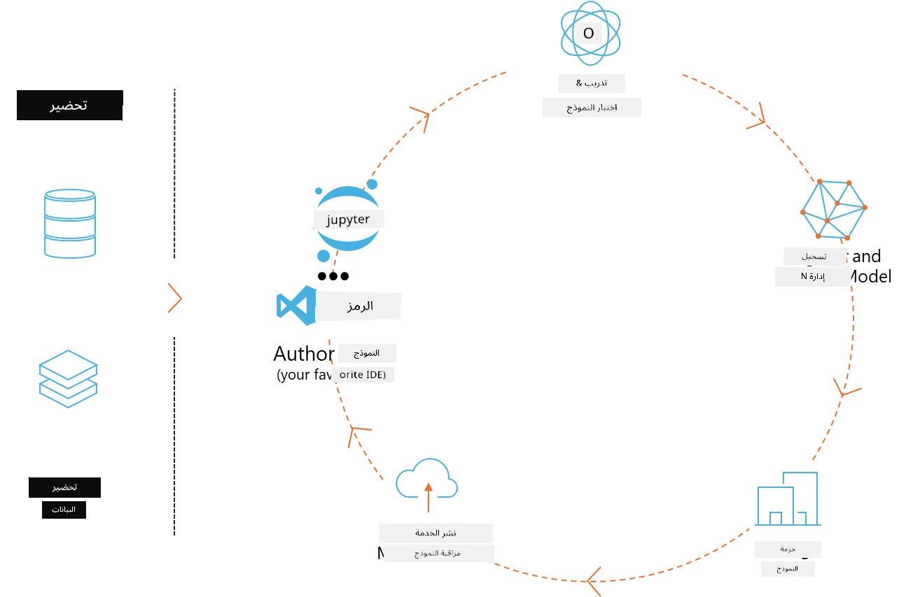
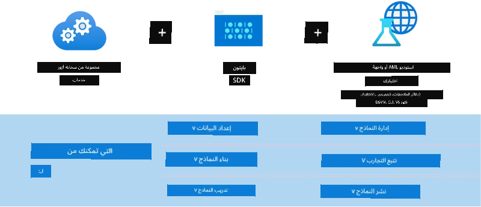

<!--
CO_OP_TRANSLATOR_METADATA:
{
  "original_hash": "f61c383bbf0c3dac97e43f833c258731",
  "translation_date": "2025-07-17T02:26:04+00:00",
  "source_file": "md/02.Application/01.TextAndChat/Phi3/E2E_Phi-3-MLflow.md",
  "language_code": "ar"
}
-->
# MLflow

[MLflow](https://mlflow.org/) هو منصة مفتوحة المصدر مصممة لإدارة دورة حياة تعلم الآلة من البداية إلى النهاية.



يُستخدم MLFlow لإدارة دورة حياة تعلم الآلة، بما في ذلك التجارب، وإعادة الإنتاج، والنشر، وسجل النماذج المركزي. يقدم MLflow حالياً أربعة مكونات.

- **MLflow Tracking:** تسجيل واستعلام التجارب، الكود، تكوين البيانات والنتائج.
- **MLflow Projects:** حزم كود علوم البيانات بصيغة تسمح بإعادة تشغيله على أي منصة.
- **Mlflow Models:** نشر نماذج تعلم الآلة في بيئات تقديم متنوعة.
- **Model Registry:** تخزين، توضيح وإدارة النماذج في مستودع مركزي.

يتضمن قدرات لتتبع التجارب، حزم الكود لتشغيلات قابلة لإعادة الإنتاج، ومشاركة ونشر النماذج. تم دمج MLFlow في Databricks ويدعم مجموعة متنوعة من مكتبات تعلم الآلة، مما يجعله غير مرتبط بمكتبة معينة. يمكن استخدامه مع أي مكتبة تعلم آلة وأي لغة برمجة، حيث يوفر واجهة REST API وCLI لسهولة الاستخدام.


تشمل الميزات الرئيسية لـ MLFlow:

- **تتبع التجارب:** تسجيل ومقارنة المعلمات والنتائج.
- **إدارة النماذج:** نشر النماذج على منصات تقديم واستدلال مختلفة.
- **سجل النماذج:** إدارة دورة حياة نماذج MLflow بشكل تعاوني، بما في ذلك إصدار النماذج والتعليقات التوضيحية.
- **المشاريع:** حزم كود تعلم الآلة للمشاركة أو للاستخدام الإنتاجي.

يدعم MLFlow أيضاً حلقة MLOps التي تشمل تحضير البيانات، تسجيل وإدارة النماذج، حزم النماذج للتنفيذ، نشر الخدمات، ومراقبة النماذج. يهدف إلى تبسيط عملية الانتقال من النموذج الأولي إلى سير عمل الإنتاج، خاصة في بيئات السحابة والحافة.

## سيناريو شامل - بناء غلاف واستخدام Phi-3 كنموذج MLFlow

في هذا المثال الشامل سنوضح طريقتين مختلفتين لبناء غلاف حول نموذج اللغة الصغيرة Phi-3 (SLM) ثم تشغيله كنموذج MLFlow سواء محلياً أو في السحابة، مثلاً في مساحة عمل Azure Machine Learning.



| المشروع | الوصف | الموقع |
| ------------ | ----------- | -------- |
| Transformer Pipeline | يعتبر Transformer Pipeline الخيار الأسهل لبناء غلاف إذا كنت تريد استخدام نموذج HuggingFace مع نكهة المحولات التجريبية في MLFlow. | [**TransformerPipeline.ipynb**](../../../../../../code/06.E2E/E2E_Phi-3-MLflow_TransformerPipeline.ipynb) |
| Custom Python Wrapper | في وقت كتابة هذا، لم يكن Transformer Pipeline يدعم توليد غلاف MLFlow لنماذج HuggingFace بصيغة ONNX، حتى مع حزمة optimum التجريبية في بايثون. في مثل هذه الحالات، يمكنك بناء غلاف بايثون مخصص لوضع MLFlow. | [**CustomPythonWrapper.ipynb**](../../../../../../code/06.E2E/E2E_Phi-3-MLflow_CustomPythonWrapper.ipynb) |

## المشروع: Transformer Pipeline

1. ستحتاج إلى حزم بايثون ذات صلة من MLFlow وHuggingFace:

    ``` Python
    import mlflow
    import transformers
    ```

2. بعد ذلك، يجب أن تبدأ خط أنابيب المحولات بالإشارة إلى نموذج Phi-3 المستهدف في سجل HuggingFace. كما هو موضح في بطاقة نموذج _Phi-3-mini-4k-instruct_، فإن مهمته من نوع "توليد النص":

    ``` Python
    pipeline = transformers.pipeline(
        task = "text-generation",
        model = "microsoft/Phi-3-mini-4k-instruct"
    )
    ```

3. يمكنك الآن حفظ خط أنابيب المحولات لنموذج Phi-3 بصيغة MLFlow وتوفير تفاصيل إضافية مثل مسار القطع الفنية المستهدف، إعدادات تكوين النموذج المحددة ونوع واجهة برمجة التطبيقات للاستدلال:

    ``` Python
    model_info = mlflow.transformers.log_model(
        transformers_model = pipeline,
        artifact_path = "phi3-mlflow-model",
        model_config = model_config,
        task = "llm/v1/chat"
    )
    ```

## المشروع: Custom Python Wrapper

1. يمكننا هنا استخدام واجهة برمجة التطبيقات [ONNX Runtime generate() API](https://github.com/microsoft/onnxruntime-genai) من مايكروسوفت لاستدلال نموذج ONNX وترميز/فك ترميز الرموز. عليك اختيار حزمة _onnxruntime_genai_ لحوسبتك المستهدفة، مع المثال أدناه الذي يستهدف وحدة المعالجة المركزية:

    ``` Python
    import mlflow
    from mlflow.models import infer_signature
    import onnxruntime_genai as og
    ```

1. تقوم فئتنا المخصصة بتنفيذ طريقتين: _load_context()_ لتهيئة **نموذج ONNX** الخاص بـ Phi-3 Mini 4K Instruct، **معلمات المولد** و**المحول الرمزي**؛ و _predict()_ لتوليد رموز الإخراج للموجه المقدم:

    ``` Python
    class Phi3Model(mlflow.pyfunc.PythonModel):
        def load_context(self, context):
            # Retrieving model from the artifacts
            model_path = context.artifacts["phi3-mini-onnx"]
            model_options = {
                 "max_length": 300,
                 "temperature": 0.2,         
            }
        
            # Defining the model
            self.phi3_model = og.Model(model_path)
            self.params = og.GeneratorParams(self.phi3_model)
            self.params.set_search_options(**model_options)
            
            # Defining the tokenizer
            self.tokenizer = og.Tokenizer(self.phi3_model)
    
        def predict(self, context, model_input):
            # Retrieving prompt from the input
            prompt = model_input["prompt"][0]
            self.params.input_ids = self.tokenizer.encode(prompt)
    
            # Generating the model's response
            response = self.phi3_model.generate(self.params)
    
            return self.tokenizer.decode(response[0][len(self.params.input_ids):])
    ```

1. يمكنك الآن استخدام دالة _mlflow.pyfunc.log_model()_ لتوليد غلاف بايثون مخصص (بصيغة pickle) لنموذج Phi-3، مع النموذج الأصلي ONNX والاعتمادات المطلوبة:

    ``` Python
    model_info = mlflow.pyfunc.log_model(
        artifact_path = artifact_path,
        python_model = Phi3Model(),
        artifacts = {
            "phi3-mini-onnx": "cpu_and_mobile/cpu-int4-rtn-block-32-acc-level-4",
        },
        input_example = input_example,
        signature = infer_signature(input_example, ["Run"]),
        extra_pip_requirements = ["torch", "onnxruntime_genai", "numpy"],
    )
    ```

## توقيعات نماذج MLFlow المولدة

1. في الخطوة 3 من مشروع Transformer Pipeline أعلاه، قمنا بتعيين مهمة نموذج MLFlow إلى "_llm/v1/chat_". هذا التوجيه يولد غلاف API للنموذج، متوافق مع واجهة OpenAI Chat API كما هو موضح أدناه:

    ``` Python
    {inputs: 
      ['messages': Array({content: string (required), name: string (optional), role: string (required)}) (required), 'temperature': double (optional), 'max_tokens': long (optional), 'stop': Array(string) (optional), 'n': long (optional), 'stream': boolean (optional)],
    outputs: 
      ['id': string (required), 'object': string (required), 'created': long (required), 'model': string (required), 'choices': Array({finish_reason: string (required), index: long (required), message: {content: string (required), name: string (optional), role: string (required)} (required)}) (required), 'usage': {completion_tokens: long (required), prompt_tokens: long (required), total_tokens: long (required)} (required)],
    params: 
      None}
    ```

1. كنتيجة لذلك، يمكنك إرسال الموجه الخاص بك بالتنسيق التالي:

    ``` Python
    messages = [{"role": "user", "content": "What is the capital of Spain?"}]
    ```

1. ثم، استخدم معالجة ما بعد متوافقة مع OpenAI API، مثل _response[0][‘choices’][0][‘message’][‘content’]_, لتحسين مخرجاتك إلى شيء مثل هذا:

    ``` JSON
    Question: What is the capital of Spain?
    
    Answer: The capital of Spain is Madrid. It is the largest city in Spain and serves as the political, economic, and cultural center of the country. Madrid is located in the center of the Iberian Peninsula and is known for its rich history, art, and architecture, including the Royal Palace, the Prado Museum, and the Plaza Mayor.
    
    Usage: {'prompt_tokens': 11, 'completion_tokens': 73, 'total_tokens': 84}
    ```

1. في الخطوة 3 من مشروع Custom Python Wrapper أعلاه، نسمح لحزمة MLFlow بتوليد توقيع النموذج من مثال إدخال معين. ستبدو توقيع غلاف MLFlow الخاص بنا كما يلي:

    ``` Python
    {inputs: 
      ['prompt': string (required)],
    outputs: 
      [string (required)],
    params: 
      None}
    ```

1. لذلك، يجب أن يحتوي موجهنا على مفتاح قاموس "prompt"، مشابه لهذا:

    ``` Python
    {"prompt": "<|system|>You are a stand-up comedian.<|end|><|user|>Tell me a joke about atom<|end|><|assistant|>",}
    ```

1. سيتم تقديم مخرجات النموذج بعد ذلك بصيغة نصية:

    ``` JSON
    Alright, here's a little atom-related joke for you!
    
    Why don't electrons ever play hide and seek with protons?
    
    Because good luck finding them when they're always "sharing" their electrons!
    
    Remember, this is all in good fun, and we're just having a little atomic-level humor!
    ```

**إخلاء مسؤولية**:  
تمت ترجمة هذا المستند باستخدام خدمة الترجمة الآلية [Co-op Translator](https://github.com/Azure/co-op-translator). بينما نسعى لتحقيق الدقة، يرجى العلم أن الترجمات الآلية قد تحتوي على أخطاء أو عدم دقة. يجب اعتبار المستند الأصلي بلغته الأصلية المصدر الموثوق به. للمعلومات الهامة، يُنصح بالاعتماد على الترجمة البشرية المهنية. نحن غير مسؤولين عن أي سوء فهم أو تفسير ناتج عن استخدام هذه الترجمة.