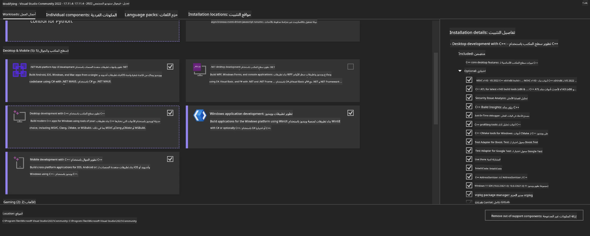
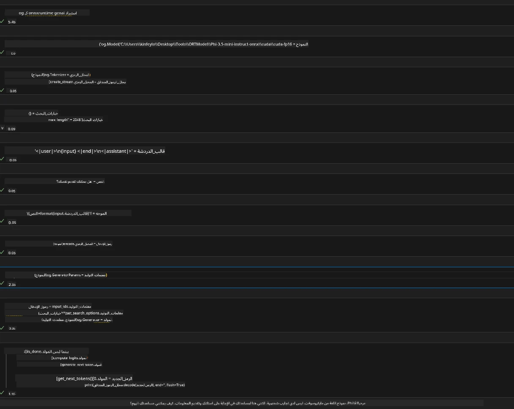
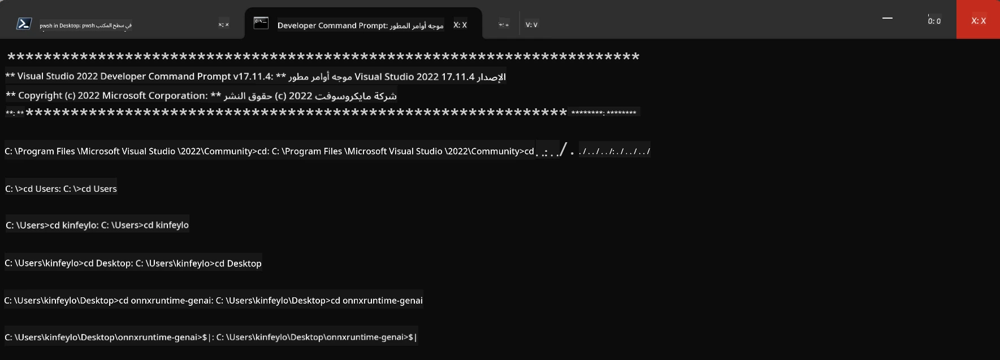

# **دليل استخدام OnnxRuntime GenAI مع GPU على ويندوز**

يوفر هذا الدليل خطوات إعداد واستخدام ONNX Runtime (ORT) مع وحدات معالجة الرسومات (GPU) على نظام ويندوز. الهدف هو مساعدتك في الاستفادة من تسريع GPU لنماذجك، مما يحسن الأداء والكفاءة.

يحتوي المستند على إرشادات حول:

- إعداد البيئة: تعليمات تثبيت المتطلبات اللازمة مثل CUDA وcuDNN وONNX Runtime.
- التهيئة: كيفية ضبط البيئة وONNX Runtime لاستخدام موارد GPU بشكل فعال.
- نصائح التحسين: إرشادات لضبط إعدادات GPU لتحقيق أفضل أداء.

### **1. Python 3.10.x /3.11.8**

   ***ملاحظة*** يُنصح باستخدام [miniforge](https://github.com/conda-forge/miniforge/releases/latest/download/Miniforge3-Windows-x86_64.exe) كبيئة بايثون الخاصة بك

   ```bash

   conda create -n pydev python==3.11.8

   conda activate pydev

   ```

   ***تذكير*** إذا قمت بتثبيت أي مكتبة ONNX خاصة ببايثون، يرجى إزالتها أولاً

### **2. تثبيت CMake باستخدام winget**

   ```bash

   winget install -e --id Kitware.CMake

   ```

### **3. تثبيت Visual Studio 2022 - تطوير سطح المكتب باستخدام C++**

   ***ملاحظة*** إذا لم ترغب في الترجمة، يمكنك تخطي هذه الخطوة



### **4. تثبيت تعريف NVIDIA**

1. **تعريف NVIDIA GPU**  [https://www.nvidia.com/en-us/drivers/](https://www.nvidia.com/en-us/drivers/)

2. **NVIDIA CUDA 12.4** [https://developer.nvidia.com/cuda-12-4-0-download-archive](https://developer.nvidia.com/cuda-12-4-0-download-archive)

3. **NVIDIA CUDNN 9.4**  [https://developer.nvidia.com/cudnn-downloads](https://developer.nvidia.com/cudnn-downloads)

***تذكير*** يرجى استخدام الإعدادات الافتراضية أثناء التثبيت

### **5. إعداد بيئة NVIDIA**

انسخ ملفات NVIDIA CUDNN 9.4 من مجلدات lib وbin وinclude إلى مجلدات NVIDIA CUDA 12.4 المقابلة

- انسخ ملفات *'C:\Program Files\NVIDIA\CUDNN\v9.4\bin\12.6'* إلى  *'C:\Program Files\NVIDIA GPU Computing Toolkit\CUDA\v12.4\bin'*

- انسخ ملفات *'C:\Program Files\NVIDIA\CUDNN\v9.4\include\12.6'* إلى  *'C:\Program Files\NVIDIA GPU Computing Toolkit\CUDA\v12.4\include'*

- انسخ ملفات *'C:\Program Files\NVIDIA\CUDNN\v9.4\lib\12.6'* إلى  *'C:\Program Files\NVIDIA GPU Computing Toolkit\CUDA\v12.4\lib\x64'*

### **6. تحميل Phi-3.5-mini-instruct-onnx**

   ```bash

   winget install -e --id Git.Git

   winget install -e --id GitHub.GitLFS

   git lfs install

   git clone https://huggingface.co/microsoft/Phi-3.5-mini-instruct-onnx

   ```

### **7. تشغيل InferencePhi35Instruct.ipynb**

   افتح [دفتر الملاحظات](../../../../../../code/09.UpdateSamples/Aug/ortgpu-phi35-instruct.ipynb) وقم بالتنفيذ



### **8. ترجمة ORT GenAI GPU**

   ***ملاحظة*** 
   
   1. يرجى إزالة تثبيت جميع مكتبات onnx و onnxruntime و onnxruntime-genai أولاً

   ```bash

   pip list 
   
   ```

   ثم قم بإزالة تثبيت جميع مكتبات onnxruntime مثل:

   ```bash

   pip uninstall onnxruntime

   pip uninstall onnxruntime-genai

   pip uninstall onnxruntume-genai-cuda
   
   ```

   2. تحقق من دعم امتداد Visual Studio

   تحقق من وجود المجلد C:\Program Files\NVIDIA GPU Computing Toolkit\CUDA\v12.4\extras\visual_studio_integration داخل C:\Program Files\NVIDIA GPU Computing Toolkit\CUDA\v12.4\extras

   إذا لم يكن موجودًا، تحقق من مجلدات تعريف Cuda الأخرى وانسخ مجلد visual_studio_integration ومحتوياته إلى C:\Program Files\NVIDIA GPU Computing Toolkit\CUDA\v12.4\extras\visual_studio_integration

   - إذا لم ترغب في الترجمة، يمكنك تخطي هذه الخطوة

   ```bash

   git clone https://github.com/microsoft/onnxruntime-genai

   ```

   - قم بتحميل [https://github.com/microsoft/onnxruntime/releases/download/v1.19.2/onnxruntime-win-x64-gpu-1.19.2.zip](https://github.com/microsoft/onnxruntime/releases/download/v1.19.2/onnxruntime-win-x64-gpu-1.19.2.zip)

   - فك ضغط onnxruntime-win-x64-gpu-1.19.2.zip وأعد تسميته إلى **ort**، ثم انسخ مجلد ort إلى onnxruntime-genai

   - باستخدام Windows Terminal، افتح Developer Command Prompt لـ VS 2022 واذهب إلى مجلد onnxruntime-genai



   - قم بترجمته باستخدام بيئة بايثون الخاصة بك

   ```bash

   cd onnxruntime-genai

   python build.py --use_cuda  --cuda_home "C:\Program Files\NVIDIA GPU Computing Toolkit\CUDA\v12.4" --config Release
 

   cd build/Windows/Release/Wheel

   pip install .whl

   ```

**إخلاء المسؤولية**:  
تمت ترجمة هذا المستند باستخدام خدمة الترجمة الآلية [Co-op Translator](https://github.com/Azure/co-op-translator). بينما نسعى لتحقيق الدقة، يرجى العلم أن الترجمات الآلية قد تحتوي على أخطاء أو عدم دقة. يجب اعتبار المستند الأصلي بلغته الأصلية المصدر الموثوق به. للمعلومات الهامة، يُنصح بالاعتماد على الترجمة البشرية المهنية. نحن غير مسؤولين عن أي سوء فهم أو تفسير ناتج عن استخدام هذه الترجمة.