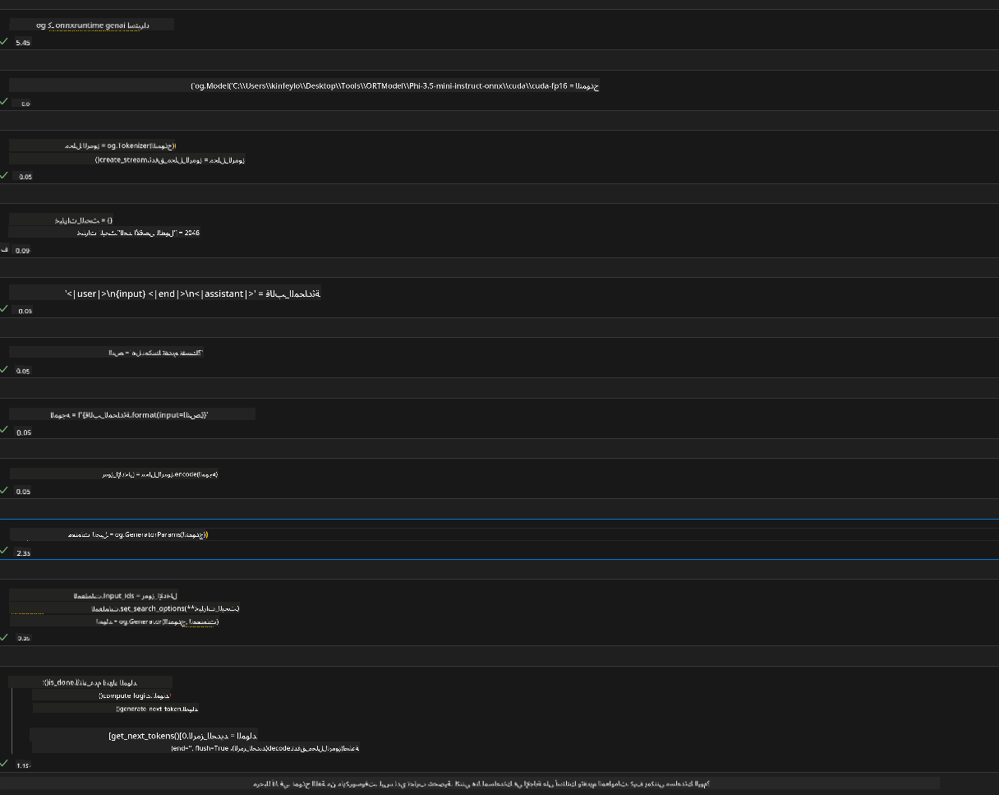
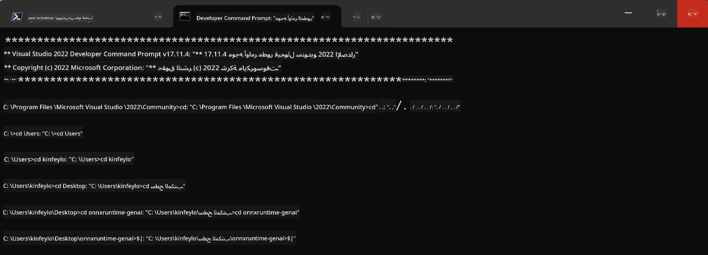

<!--
CO_OP_TRANSLATOR_METADATA:
{
  "original_hash": "b066fc29c1b2129df84e027cb75119ce",
  "translation_date": "2025-05-07T11:03:25+00:00",
  "source_file": "md/02.Application/01.TextAndChat/Phi3/ORTWindowGPUGuideline.md",
  "language_code": "ar"
}
-->
# **دليل استخدام OnnxRuntime GenAI على Windows GPU**

يوفر هذا الدليل خطوات إعداد واستخدام ONNX Runtime (ORT) مع وحدات معالجة الرسومات على نظام ويندوز. الهدف هو مساعدتك في الاستفادة من تسريع GPU لنماذجك، مما يحسن الأداء والكفاءة.

يوضح المستند الإرشادات التالية:

- إعداد البيئة: تعليمات تثبيت الاعتمادات اللازمة مثل CUDA وcuDNN وONNX Runtime.
- التهيئة: كيفية ضبط البيئة وONNX Runtime لاستخدام موارد GPU بفعالية.
- نصائح التحسين: إرشادات لضبط إعدادات GPU لتحقيق أفضل أداء.

### **1. Python 3.10.x /3.11.8**

   ***Note*** يُفضل استخدام [miniforge](https://github.com/conda-forge/miniforge/releases/latest/download/Miniforge3-Windows-x86_64.exe) كبيئة Python الخاصة بك

   ```bash

   conda create -n pydev python==3.11.8

   conda activate pydev

   ```

   ***Reminder*** إذا قمت بتثبيت أي مكتبة ONNX لبايثون مسبقًا، يرجى إزالتها

### **2. تثبيت CMake باستخدام winget**

   ```bash

   winget install -e --id Kitware.CMake

   ```

### **3. تثبيت Visual Studio 2022 - تطوير سطح المكتب باستخدام C++**

   ***Note*** إذا لم ترغب في الترجمة، يمكنك تخطي هذه الخطوة


### **4. تثبيت برنامج تشغيل NVIDIA**

1. **برنامج تشغيل NVIDIA GPU**  [https://www.nvidia.com/en-us/drivers/](https://www.nvidia.com/en-us/drivers/)

2. **NVIDIA CUDA 12.4** [https://developer.nvidia.com/cuda-12-4-0-download-archive](https://developer.nvidia.com/cuda-12-4-0-download-archive)

3. **NVIDIA CUDNN 9.4**  [https://developer.nvidia.com/cudnn-downloads](https://developer.nvidia.com/cudnn-downloads)

***Reminder*** يرجى استخدام الإعدادات الافتراضية أثناء التثبيت

### **5. إعداد بيئة NVIDIA**

انسخ ملفات NVIDIA CUDNN 9.4 lib وbin وinclude إلى مجلدات NVIDIA CUDA 12.4 lib وbin وinclude

- انسخ ملفات *'C:\Program Files\NVIDIA\CUDNN\v9.4\bin\12.6'* إلى  *'C:\Program Files\NVIDIA GPU Computing Toolkit\CUDA\v12.4\bin'*

- انسخ ملفات *'C:\Program Files\NVIDIA\CUDNN\v9.4\include\12.6'* إلى  *'C:\Program Files\NVIDIA GPU Computing Toolkit\CUDA\v12.4\include'*

- انسخ ملفات *'C:\Program Files\NVIDIA\CUDNN\v9.4\lib\12.6'* إلى  *'C:\Program Files\NVIDIA GPU Computing Toolkit\CUDA\v12.4\lib\x64'*

### **6. تحميل Phi-3.5-mini-instruct-onnx**

   ```bash

   winget install -e --id Git.Git

   winget install -e --id GitHub.GitLFS

   git lfs install

   git clone https://huggingface.co/microsoft/Phi-3.5-mini-instruct-onnx

   ```

### **7. تشغيل InferencePhi35Instruct.ipynb**

   افتح [دفتر الملاحظات](../../../../../../code/09.UpdateSamples/Aug/ortgpu-phi35-instruct.ipynb) وقم بالتنفيذ



### **8. ترجمة ORT GenAI GPU**

   ***Note*** 
   
   1. يرجى إلغاء تثبيت جميع مكتبات onnx و onnxruntime و onnxruntime-genai أولاً

   ```bash

   pip list 
   
   ```

   ثم قم بإلغاء تثبيت جميع مكتبات onnxruntime مثل

   ```bash

   pip uninstall onnxruntime

   pip uninstall onnxruntime-genai

   pip uninstall onnxruntume-genai-cuda
   
   ```

   2. تحقق من دعم امتداد Visual Studio

   تأكد من وجود المجلد C:\Program Files\NVIDIA GPU Computing Toolkit\CUDA\v12.4\extras\visual_studio_integration داخل C:\Program Files\NVIDIA GPU Computing Toolkit\CUDA\v12.4\extras  
   
   إذا لم تجده، تحقق من مجلدات أدوات Cuda الأخرى وانسخ مجلد visual_studio_integration ومحتوياته إلى C:\Program Files\NVIDIA GPU Computing Toolkit\CUDA\v12.4\extras\visual_studio_integration

   - إذا لم ترغب في الترجمة، يمكنك تخطي هذه الخطوة

   ```bash

   git clone https://github.com/microsoft/onnxruntime-genai

   ```

   - قم بتنزيل [https://github.com/microsoft/onnxruntime/releases/download/v1.19.2/onnxruntime-win-x64-gpu-1.19.2.zip](https://github.com/microsoft/onnxruntime/releases/download/v1.19.2/onnxruntime-win-x64-gpu-1.19.2.zip)

   - فك ضغط onnxruntime-win-x64-gpu-1.19.2.zip وأعد تسميته إلى **ort**، ثم انسخ مجلد ort إلى onnxruntime-genai

   - باستخدام Windows Terminal، انتقل إلى Developer Command Prompt لـ VS 2022 واذهب إلى مجلد onnxruntime-genai



   - قم بترجمته باستخدام بيئة البايثون الخاصة بك

   ```bash

   cd onnxruntime-genai

   python build.py --use_cuda  --cuda_home "C:\Program Files\NVIDIA GPU Computing Toolkit\CUDA\v12.4" --config Release
 

   cd build/Windows/Release/Wheel

   pip install .whl

   ```

**تنويه**:  
تمت ترجمة هذا المستند باستخدام خدمة الترجمة الآلية [Co-op Translator](https://github.com/Azure/co-op-translator). بينما نسعى لتحقيق الدقة، يرجى العلم أن الترجمات الآلية قد تحتوي على أخطاء أو عدم دقة. يجب اعتبار المستند الأصلي بلغته الأصلية المصدر المعتمد. للمعلومات الحساسة، يُنصح بالاستعانة بترجمة بشرية محترفة. نحن غير مسؤولين عن أي سوء فهم أو تفسير خاطئ ناتج عن استخدام هذه الترجمة.