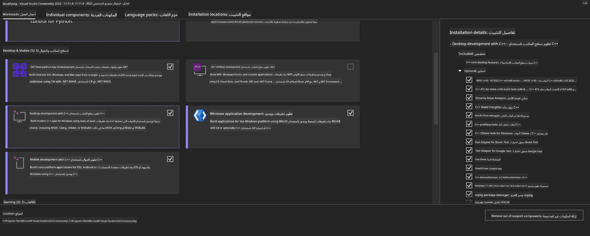
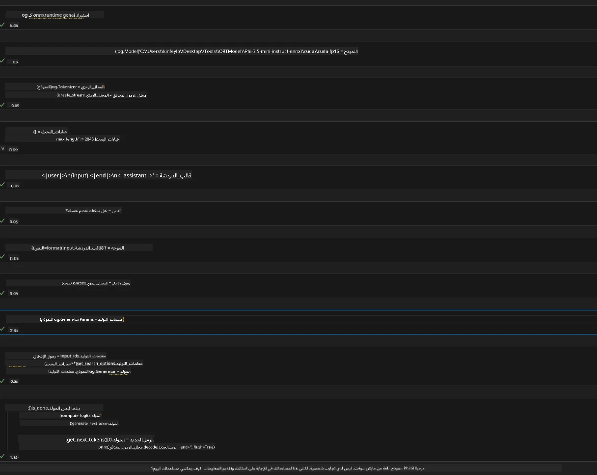
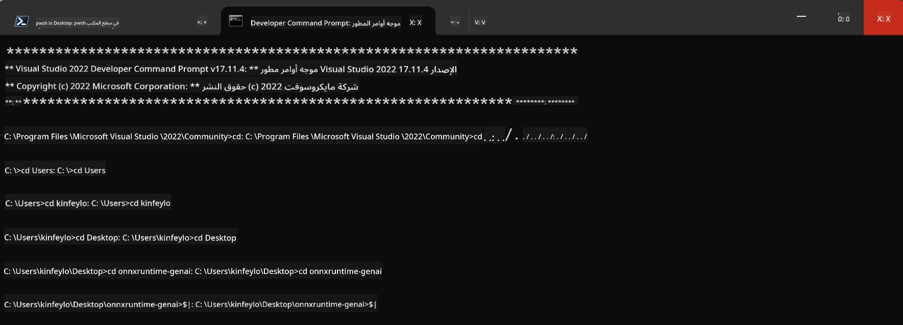

# **دليل استخدام OnnxRuntime GenAI على Windows مع GPU**

يوفر هذا الدليل خطوات لإعداد واستخدام ONNX Runtime (ORT) مع وحدات معالجة الرسومات على نظام Windows. تم تصميمه لمساعدتك في الاستفادة من تسريع وحدة معالجة الرسومات لنماذجك، مما يحسن الأداء والكفاءة.

يقدم المستند إرشادات حول:

- إعداد البيئة: تعليمات تثبيت الاعتمادات اللازمة مثل CUDA وcuDNN وONNX Runtime.
- التهيئة: كيفية تكوين البيئة وONNX Runtime لاستخدام موارد GPU بفعالية.
- نصائح التحسين: نصائح حول كيفية ضبط إعدادات GPU للحصول على أفضل أداء.

### **1. بايثون 3.10.x /3.11.8**

   ***ملاحظة*** يُنصح باستخدام [miniforge](https://github.com/conda-forge/miniforge/releases/latest/download/Miniforge3-Windows-x86_64.exe) كبيئة بايثون الخاصة بك

   ```bash

   conda create -n pydev python==3.11.8

   conda activate pydev

   ```

   ***تذكير*** إذا قمت بتثبيت أي مكتبة ONNX للبايثون، يرجى إلغاء تثبيتها

### **2. تثبيت CMake باستخدام winget**


   ```bash

   winget install -e --id Kitware.CMake

   ```

### **3. تثبيت Visual Studio 2022 - تطوير سطح المكتب باستخدام C++**

   ***ملاحظة*** إذا كنت لا ترغب في التجميع يمكنك تخطي هذه الخطوة




### **4. تثبيت برنامج تشغيل NVIDIA**

1. **برنامج تشغيل NVIDIA GPU**  [https://www.nvidia.com/en-us/drivers/](https://www.nvidia.com/en-us/drivers/)

2. **NVIDIA CUDA 12.4** [https://developer.nvidia.com/cuda-12-4-0-download-archive](https://developer.nvidia.com/cuda-12-4-0-download-archive)

3. **NVIDIA CUDNN 9.4**  [https://developer.nvidia.com/cudnn-downloads](https://developer.nvidia.com/cudnn-downloads)

***تذكير*** يرجى استخدام الإعدادات الافتراضية أثناء عملية التثبيت 

### **5. إعداد بيئة NVIDIA**

انسخ ملفات lib وbin وinclude الخاصة بـ NVIDIA CUDNN 9.4 إلى مجلدات lib وbin وinclude الخاصة بـ NVIDIA CUDA 12.4

- انسخ ملفات *'C:\Program Files\NVIDIA\CUDNN\v9.4\bin\12.6'* إلى *'C:\Program Files\NVIDIA GPU Computing Toolkit\CUDA\v12.4\bin'*

- انسخ ملفات *'C:\Program Files\NVIDIA\CUDNN\v9.4\include\12.6'* إلى *'C:\Program Files\NVIDIA GPU Computing Toolkit\CUDA\v12.4\include'*

- انسخ ملفات *'C:\Program Files\NVIDIA\CUDNN\v9.4\lib\12.6'* إلى *'C:\Program Files\NVIDIA GPU Computing Toolkit\CUDA\v12.4\lib\x64'*


### **6. تنزيل Phi-3.5-mini-instruct-onnx**


   ```bash

   winget install -e --id Git.Git

   winget install -e --id GitHub.GitLFS

   git lfs install

   git clone https://huggingface.co/microsoft/Phi-3.5-mini-instruct-onnx

   ```

### **7. تشغيل InferencePhi35Instruct.ipynb**

   افتح [دفتر الملاحظات](../../../../code/09.UpdateSamples/Aug/ortgpu-phi35-instruct.ipynb) ونفذ 





### **8. تجميع ORT GenAI GPU**


   ***ملاحظة*** 
   
   1. يرجى إلغاء تثبيت كل ما يتعلق ب onnx و onnxruntime و onnxruntime-genai أولاً

   
   ```bash

   pip list 
   
   ```

   ثم قم بإلغاء تثبيت جميع مكتبات onnxruntime مثل


   ```bash

   pip uninstall onnxruntime

   pip uninstall onnxruntime-genai

   pip uninstall onnxruntume-genai-cuda
   
   ```

   2. تحقق من دعم امتداد Visual Studio 

   تحقق من C:\Program Files\NVIDIA GPU Computing Toolkit\CUDA\v12.4\extras لضمان وجود C:\Program Files\NVIDIA GPU Computing Toolkit\CUDA\v12.4\extras\visual_studio_integration. 
   
   إذا لم يتم العثور عليه تحقق من مجلدات أدوات CUDA الأخرى ونسخ مجلد visual_studio_integration ومحتوياته إلى C:\Program Files\NVIDIA GPU Computing Toolkit\CUDA\v12.4\extras\visual_studio_integration


   - إذا كنت لا تريد التجميع يمكنك تخطي هذه الخطوة


   ```bash

   git clone https://github.com/microsoft/onnxruntime-genai

   ```

   - قم بتنزيل [https://github.com/microsoft/onnxruntime/releases/download/v1.19.2/onnxruntime-win-x64-gpu-1.19.2.zip](https://github.com/microsoft/onnxruntime/releases/download/v1.19.2/onnxruntime-win-x64-gpu-1.19.2.zip)

   - فك ضغط onnxruntime-win-x64-gpu-1.19.2.zip ، وأعد تسميته إلى **ort**، وانسخ مجلد ort إلى onnxruntime-genai

   - باستخدام Windows Terminal، اذهب إلى Developer Command Prompt لـ VS 2022 واذهب إلى onnxruntime-genai 



   - قم بتجميعه باستخدام بيئة البايثون الخاصة بك

   
   ```bash

   cd onnxruntime-genai

   python build.py --use_cuda  --cuda_home "C:\Program Files\NVIDIA GPU Computing Toolkit\CUDA\v12.4" --config Release
 

   cd build/Windows/Release/Wheel

   pip install .whl

   ```

---

<!-- CO-OP TRANSLATOR DISCLAIMER START -->
**تنويه**:
تمت ترجمة هذا المستند باستخدام خدمة الترجمة بالذكاء الاصطناعي [Co-op Translator](https://github.com/Azure/co-op-translator). بينما نسعى للدقة، يرجى العلم أن الترجمات الآلية قد تحتوي على أخطاء أو عدم دقة. يجب اعتبار المستند الأصلي بلغته الأصلية المصدر الرسمي والمعتمد. للمعلومات الهامة، يُنصح بالاستعانة بترجمة بشرية محترفة. نحن غير مسؤولين عن أي سوء فهم أو تفسير ناتج عن استخدام هذه الترجمة.
<!-- CO-OP TRANSLATOR DISCLAIMER END -->