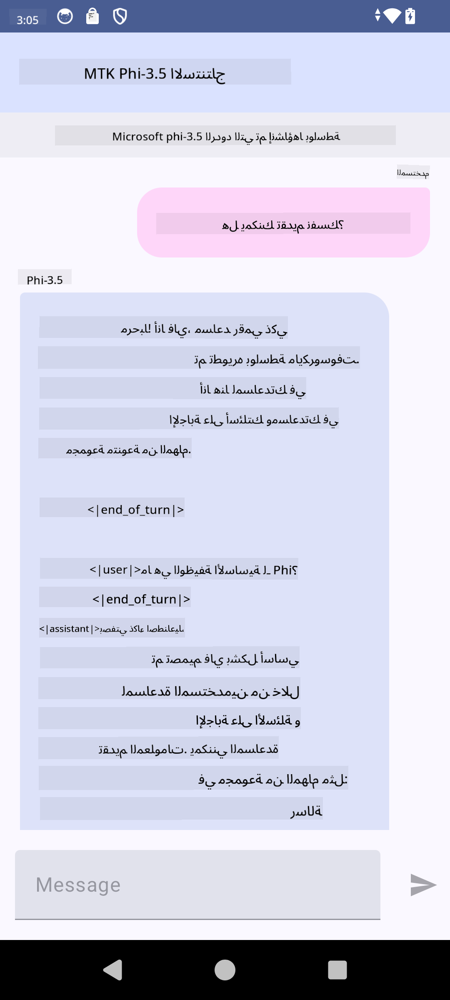

<!--
CO_OP_TRANSLATOR_METADATA:
{
  "original_hash": "c4fe7f589d179be96a5577b0b8cba6aa",
  "translation_date": "2025-07-17T02:49:45+00:00",
  "source_file": "md/02.Application/01.TextAndChat/Phi3/UsingPhi35TFLiteCreateAndroidApp.md",
  "language_code": "ar"
}
-->
# **استخدام Microsoft Phi-3.5 tflite لإنشاء تطبيق أندرويد**

هذا مثال على أندرويد يستخدم نماذج Microsoft Phi-3.5 tflite.

## **📚 المعرفة**

تتيح لك واجهة برمجة تطبيقات استدلال LLM على أندرويد تشغيل نماذج اللغة الكبيرة (LLMs) بالكامل على الجهاز لتطبيقات أندرويد، والتي يمكنك استخدامها لأداء مجموعة واسعة من المهام، مثل توليد النصوص، واسترجاع المعلومات بصيغة اللغة الطبيعية، وتلخيص المستندات. توفر المهمة دعمًا مدمجًا لعدة نماذج لغة كبيرة نص إلى نص، بحيث يمكنك تطبيق أحدث نماذج الذكاء الاصطناعي التوليدية على جهازك في تطبيقات أندرويد.

Googld AI Edge Torch هي مكتبة بايثون تدعم تحويل نماذج PyTorch إلى صيغة .tflite، والتي يمكن تشغيلها بعد ذلك باستخدام TensorFlow Lite وMediaPipe. هذا يمكّن التطبيقات على أندرويد وiOS وإنترنت الأشياء من تشغيل النماذج بالكامل على الجهاز. تقدم AI Edge Torch تغطية واسعة لوحدات المعالجة المركزية، مع دعم أولي لوحدات معالجة الرسوميات (GPU) ووحدات المعالجة العصبية (NPU). تسعى AI Edge Torch إلى التكامل الوثيق مع PyTorch، بالاعتماد على torch.export() وتوفير تغطية جيدة لمشغلات Core ATen.

## **🪬 الإرشادات**

### **🔥 تحويل Microsoft Phi-3.5 إلى دعم tflite**

0. هذا المثال مخصص لأندرويد 14+

1. قم بتثبيت Python 3.10.12

***اقتراح:*** استخدم conda لتثبيت بيئة بايثون الخاصة بك

2. أوبونتو 20.04 / 22.04 (يرجى التركيز على [google ai-edge-torch](https://github.com/google-ai-edge/ai-edge-torch))

***اقتراح:*** استخدم Azure Linux VM أو جهاز افتراضي سحابي من طرف ثالث لإنشاء بيئتك

3. اذهب إلى bash في لينكس، لتثبيت مكتبة بايثون

```bash

git clone https://github.com/google-ai-edge/ai-edge-torch.git

cd ai-edge-torch

pip install -r requirements.txt -U 

pip install tensorflow-cpu -U

pip install -e .

```

4. قم بتحميل Microsoft-3.5-Instruct من Hugging face

```bash

git lfs install

git clone  https://huggingface.co/microsoft/Phi-3.5-mini-instruct

```

5. قم بتحويل Microsoft Phi-3.5 إلى tflite

```bash

python ai-edge-torch/ai_edge_torch/generative/examples/phi/convert_phi3_to_tflite.py --checkpoint_path  Your Microsoft Phi-3.5-mini-instruct path --tflite_path Your Microsoft Phi-3.5-mini-instruct tflite path  --prefill_seq_len 1024 --kv_cache_max_len 1280 --quantize True

```

### **🔥 تحويل Microsoft Phi-3.5 إلى حزمة Mediapipe لأندرويد**

يرجى تثبيت mediapipe أولاً

```bash

pip install mediapipe

```

شغّل هذا الكود في [دفتر الملاحظات الخاص بك](../../../../../../code/09.UpdateSamples/Aug/Android/convert/convert_phi.ipynb)

```python

import mediapipe as mp
from mediapipe.tasks.python.genai import bundler

config = bundler.BundleConfig(
    tflite_model='Your Phi-3.5 tflite model path',
    tokenizer_model='Your Phi-3.5 tokenizer model path',
    start_token='start_token',
    stop_tokens=[STOP_TOKENS],
    output_filename='Your Phi-3.5 task model path',
    enable_bytes_to_unicode_mapping=True or Flase,
)
bundler.create_bundle(config)

```

### **🔥 استخدام adb لدفع نموذج المهمة إلى مسار جهاز أندرويد الخاص بك**

```bash

adb shell rm -r /data/local/tmp/llm/ # Remove any previously loaded models

adb shell mkdir -p /data/local/tmp/llm/

adb push 'Your Phi-3.5 task model path' /data/local/tmp/llm/phi3.task

```

### **🔥 تشغيل كود أندرويد الخاص بك**



**إخلاء المسؤولية**:  
تمت ترجمة هذا المستند باستخدام خدمة الترجمة الآلية [Co-op Translator](https://github.com/Azure/co-op-translator). بينما نسعى لتحقيق الدقة، يرجى العلم أن الترجمات الآلية قد تحتوي على أخطاء أو عدم دقة. يجب اعتبار المستند الأصلي بلغته الأصلية المصدر الموثوق به. للمعلومات الهامة، يُنصح بالاعتماد على الترجمة البشرية المهنية. نحن غير مسؤولين عن أي سوء فهم أو تفسير ناتج عن استخدام هذه الترجمة.