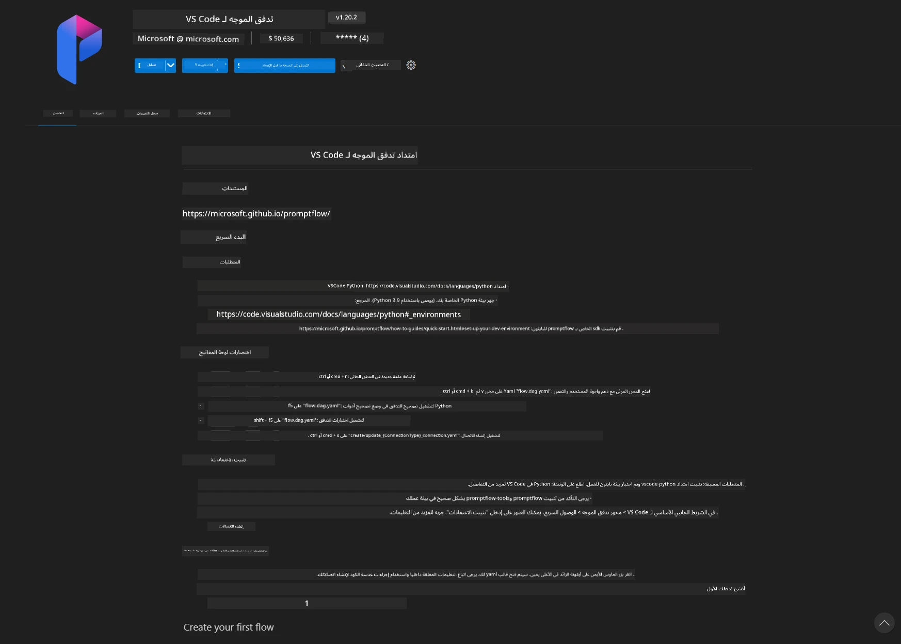
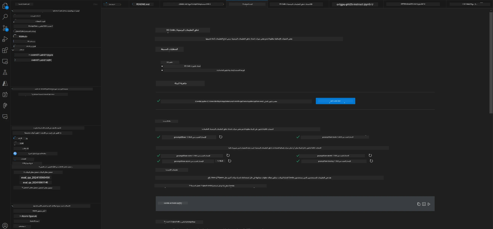
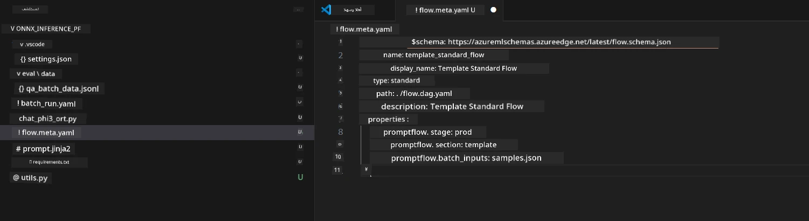
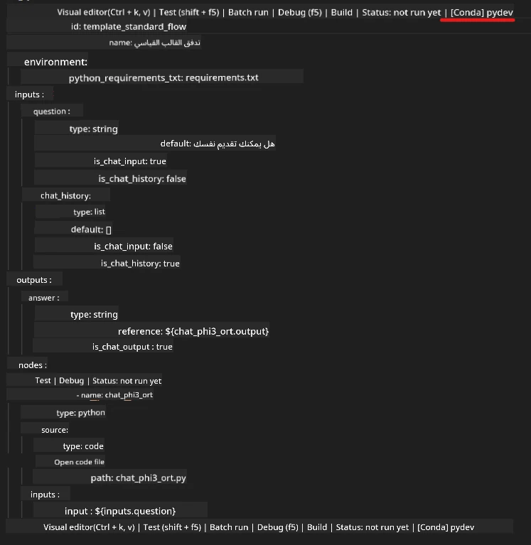
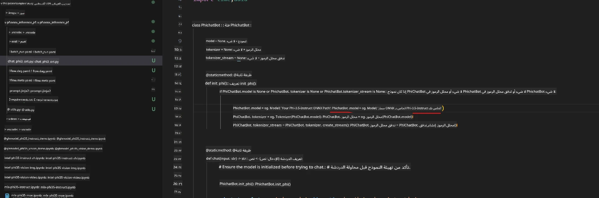
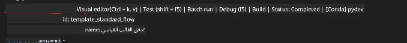
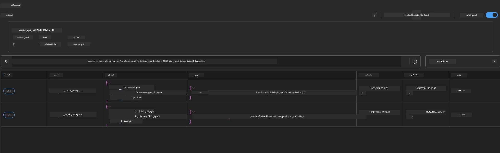

<!--
CO_OP_TRANSLATOR_METADATA:
{
  "original_hash": "92e7dac1e5af0dd7c94170fdaf6860fe",
  "translation_date": "2025-07-17T02:57:05+00:00",
  "source_file": "md/02.Application/01.TextAndChat/Phi3/UsingPromptFlowWithONNX.md",
  "language_code": "ar"
}
-->
# استخدام GPU في ويندوز لإنشاء حل Prompt flow مع Phi-3.5-Instruct ONNX

الوثيقة التالية هي مثال يوضح كيفية استخدام PromptFlow مع ONNX (Open Neural Network Exchange) لتطوير تطبيقات الذكاء الاصطناعي المبنية على نماذج Phi-3.

PromptFlow هي مجموعة أدوات تطوير تهدف إلى تبسيط دورة التطوير الشاملة لتطبيقات الذكاء الاصطناعي المعتمدة على نماذج اللغة الكبيرة (LLM)، بدءًا من الفكرة والنماذج الأولية وصولًا إلى الاختبار والتقييم.

من خلال دمج PromptFlow مع ONNX، يمكن للمطورين:

- تحسين أداء النموذج: الاستفادة من ONNX لتنفيذ النموذج ونشره بكفاءة.
- تبسيط التطوير: استخدام PromptFlow لإدارة سير العمل وأتمتة المهام المتكررة.
- تعزيز التعاون: تسهيل التعاون بين أعضاء الفريق من خلال توفير بيئة تطوير موحدة.

**Prompt flow** هي مجموعة أدوات تطوير تهدف إلى تبسيط دورة التطوير الشاملة لتطبيقات الذكاء الاصطناعي المعتمدة على نماذج اللغة الكبيرة، بدءًا من الفكرة، والنماذج الأولية، والاختبار، والتقييم، وصولًا إلى النشر في الإنتاج والمراقبة. تجعل هندسة المطالبات أسهل بكثير وتمكنك من بناء تطبيقات LLM بجودة إنتاجية.

يمكن لـ Prompt flow الاتصال بـ OpenAI، وAzure OpenAI Service، والنماذج القابلة للتخصيص (Huggingface، LLM/SLM محلي). نأمل في نشر نموذج ONNX المكمم لـ Phi-3.5 في التطبيقات المحلية. يمكن لـ Prompt flow مساعدتنا في تخطيط أعمالنا بشكل أفضل وإكمال الحلول المحلية المعتمدة على Phi-3.5. في هذا المثال، سنجمع بين مكتبة ONNX Runtime GenAI لإكمال حل Prompt flow بناءً على GPU في ويندوز.

## **التثبيت**

### **ONNX Runtime GenAI لـ Windows GPU**

اقرأ هذا الدليل لضبط ONNX Runtime GenAI لـ Windows GPU [اضغط هنا](./ORTWindowGPUGuideline.md)

### **إعداد Prompt flow في VSCode**

1. تثبيت امتداد Prompt flow في VS Code



2. بعد تثبيت امتداد Prompt flow في VS Code، انقر على الامتداد واختر **Installation dependencies** واتبع هذا الدليل لتثبيت SDK الخاص بـ Prompt flow في بيئتك



3. قم بتحميل [كود العينة](../../../../../../code/09.UpdateSamples/Aug/pf/onnx_inference_pf) وافتح هذا المثال باستخدام VS Code



4. افتح **flow.dag.yaml** لاختيار بيئة Python الخاصة بك



   افتح **chat_phi3_ort.py** لتغيير موقع نموذج Phi-3.5-instruct ONNX الخاص بك



5. شغّل prompt flow للاختبار

افتح **flow.dag.yaml** وانقر على المحرر المرئي



بعد النقر، قم بتشغيله للاختبار


1. يمكنك تشغيل الدُفعات في الطرفية لمراجعة المزيد من النتائج


```bash

pf run create --file batch_run.yaml --stream --name 'Your eval qa name'    

```

يمكنك مراجعة النتائج في متصفحك الافتراضي




**إخلاء مسؤولية**:  
تمت ترجمة هذا المستند باستخدام خدمة الترجمة الآلية [Co-op Translator](https://github.com/Azure/co-op-translator). بينما نسعى لتحقيق الدقة، يرجى العلم أن الترجمات الآلية قد تحتوي على أخطاء أو عدم دقة. يجب اعتبار المستند الأصلي بلغته الأصلية المصدر الموثوق به. للمعلومات الهامة، يُنصح بالاعتماد على الترجمة البشرية المهنية. نحن غير مسؤولين عن أي سوء فهم أو تفسير ناتج عن استخدام هذه الترجمة.