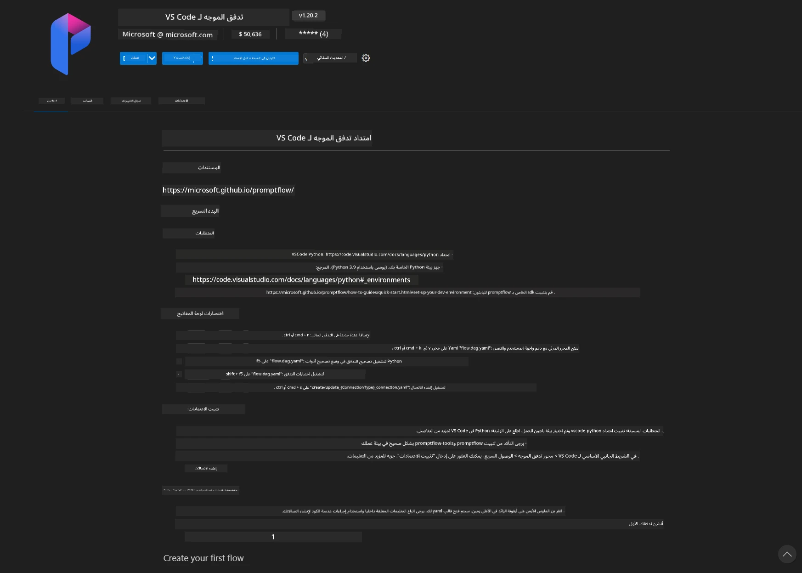
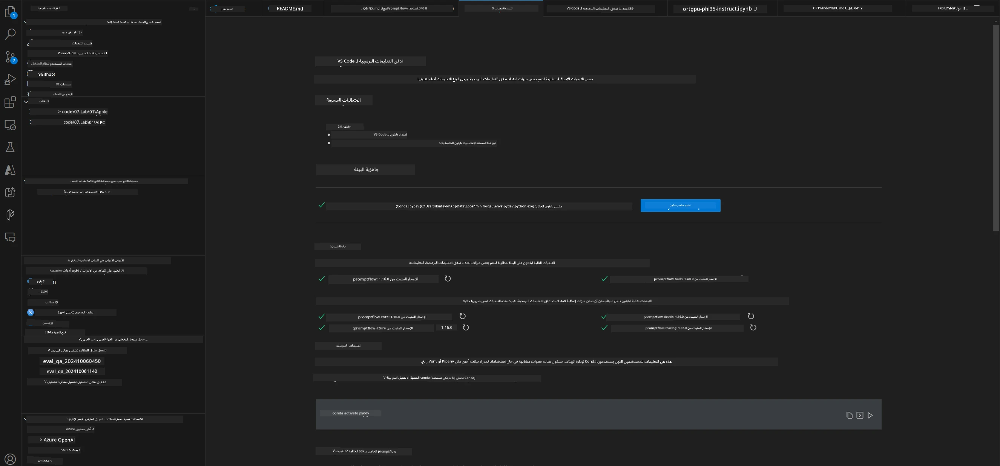
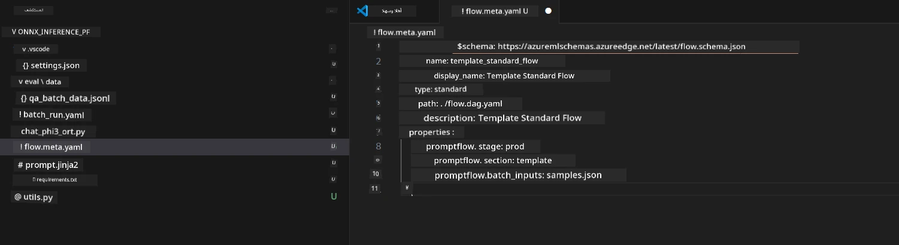
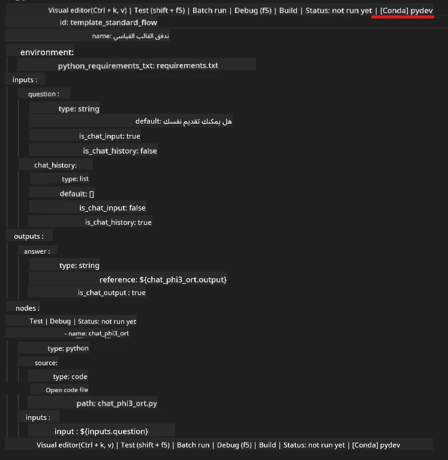
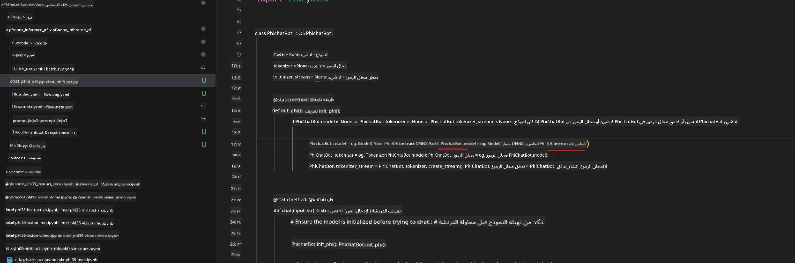
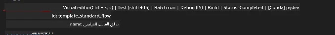
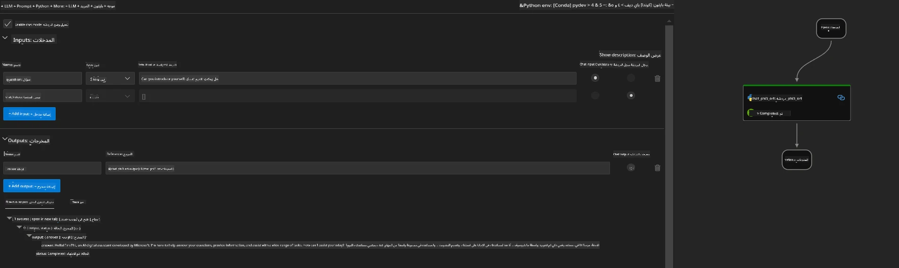
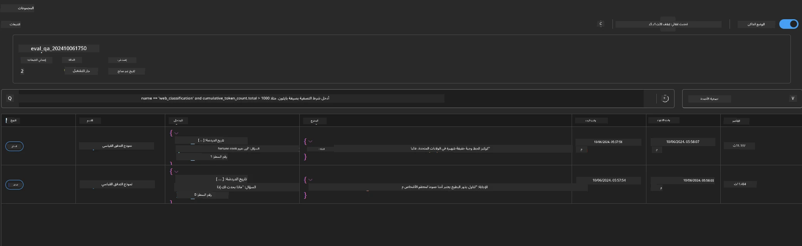

# استخدام GPU لنظام ويندوز لإنشاء حل Prompt flow مع Phi-3.5-Instruct ONNX

المستند التالي هو مثال على كيفية استخدام PromptFlow مع ONNX (Open Neural Network Exchange) لتطوير تطبيقات الذكاء الاصطناعي المبنية على نماذج Phi-3.

PromptFlow هو مجموعة من أدوات التطوير المصممة لتبسيط دورة التطوير الشاملة لتطبيقات الذكاء الاصطناعي المعتمدة على النماذج اللغوية الكبيرة (LLM)، من توليد الأفكار والنمذجة الأولية إلى الاختبار والتقييم.

من خلال دمج PromptFlow مع ONNX، يمكن للمطورين:

- تحسين أداء النموذج: الاستفادة من ONNX لتحقيق استدلال ونشر فعال للنماذج.
- تبسيط التطوير: استخدام PromptFlow لإدارة سير العمل وأتمتة المهام المتكررة.
- تعزيز التعاون: تسهيل التعاون الأفضل بين أعضاء الفريق من خلال توفير بيئة تطوير موحدة.

**Prompt flow** هي مجموعة من أدوات التطوير المصممة لتبسيط دورة التطوير الشاملة لتطبيقات الذكاء الاصطناعي المعتمدة على النماذج اللغوية الكبيرة، من توليد الأفكار والنمذجة الأولية والاختبار والتقييم إلى النشر في الإنتاج والمراقبة. إنه يجعل هندسة التوجيه أسهل بكثير ويمكّنك من بناء تطبيقات LLM بجودة الإنتاج.

يمكن لـ Prompt flow الاتصال بـ OpenAI، خدمة Azure OpenAI، والنماذج القابلة للتخصيص (Huggingface، LLM/SLM المحلي). نأمل في نشر نموذج Phi-3.5 ONNX الكمي على التطبيقات المحلية. يمكن لـ Prompt flow مساعدتنا في تخطيط أعمالنا بشكل أفضل وإكمال الحلول المحلية المبنية على Phi-3.5. في هذا المثال، سنجمع مكتبة ONNX Runtime GenAI لإكمال حل Prompt flow المعتمد على GPU لنظام ويندوز.

## **التثبيت**

### **ONNX Runtime GenAI لـ GPU على ويندوز**

اقرأ هذا الدليل لضبط ONNX Runtime GenAI لـ GPU على ويندوز [انقر هنا](./ORTWindowGPUGuideline.md)

### **إعداد Prompt flow في VSCode**

1. تثبيت امتداد Prompt flow في VS Code



2. بعد تثبيت امتداد Prompt flow في VS Code، انقر على الامتداد، واختر **تركيب التبعيات** واتبع هذا الدليل لتثبيت SDK الخاص بـ Prompt flow في بيئتك



3. قم بتنزيل [كود العينة](../../../../../../code/09.UpdateSamples/Aug/pf/onnx_inference_pf) واستخدم VS Code لفتح هذه العينة



4. افتح **flow.dag.yaml** لاختيار بيئة البايثون الخاصة بك



   افتح **chat_phi3_ort.py** لتغيير موقع نموذج Phi-3.5-instruct ONNX الخاص بك



5. شغّل Prompt flow لاختباره

افتح **flow.dag.yaml** وانقر على المحرر البصري



بعد النقر هنا، قم بتشغيله للاختبار



1. يمكنك تشغيل الدُفعة في الطرفية للتحقق من المزيد من النتائج


```bash

pf run create --file batch_run.yaml --stream --name 'Your eval qa name'    

```

يمكنك التحقق من النتائج في المتصفح الافتراضي لديك




---

<!-- CO-OP TRANSLATOR DISCLAIMER START -->
**تنويه**:
تمت ترجمة هذا المستند باستخدام خدمة الترجمة بالذكاء الاصطناعي [Co-op Translator](https://github.com/Azure/co-op-translator). بينما نسعى للدقة، يرجى العلم أن الترجمات الآلية قد تحتوي على أخطاء أو عدم دقة. يجب اعتبار المستند الأصلي بلغته الأصلية المصدر الرسمي والمعتمد. للمعلومات الهامة، يُنصح بالاستعانة بترجمة بشرية محترفة. نحن غير مسؤولين عن أي سوء فهم أو تفسير ناتج عن استخدام هذه الترجمة.
<!-- CO-OP TRANSLATOR DISCLAIMER END -->