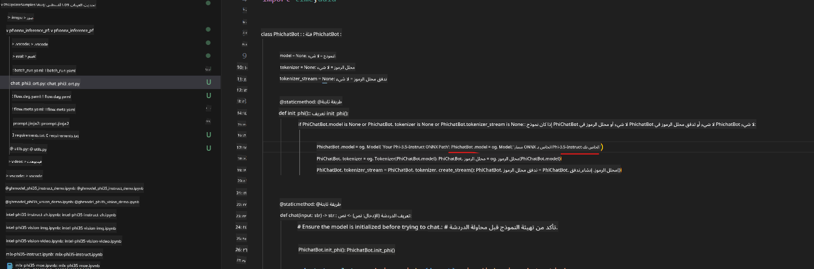
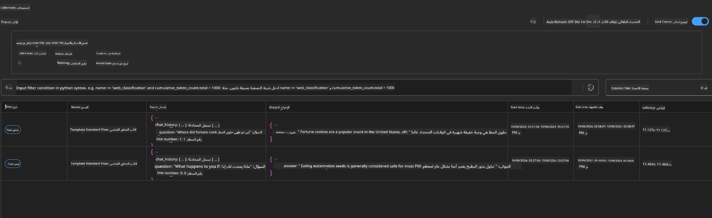

<!--
CO_OP_TRANSLATOR_METADATA:
{
  "original_hash": "92e7dac1e5af0dd7c94170fdaf6860fe",
  "translation_date": "2025-05-07T11:05:37+00:00",
  "source_file": "md/02.Application/01.TextAndChat/Phi3/UsingPromptFlowWithONNX.md",
  "language_code": "ar"
}
-->
# استخدام GPU ويندوز لإنشاء حل Prompt flow مع Phi-3.5-Instruct ONNX

الوثيقة التالية مثال على كيفية استخدام PromptFlow مع ONNX (Open Neural Network Exchange) لتطوير تطبيقات الذكاء الاصطناعي المبنية على نماذج Phi-3.

PromptFlow هي مجموعة أدوات تطوير تهدف إلى تبسيط دورة تطوير تطبيقات الذكاء الاصطناعي القائمة على نماذج اللغة الكبيرة (LLM)، بدءًا من الفكرة والنماذج الأولية وصولاً إلى الاختبار والتقييم.

من خلال دمج PromptFlow مع ONNX، يمكن للمطورين:

- تحسين أداء النموذج: الاستفادة من ONNX لتشغيل النماذج بكفاءة ونشرها.
- تبسيط التطوير: استخدام PromptFlow لإدارة سير العمل وأتمتة المهام المتكررة.
- تعزيز التعاون: تسهيل التعاون بين أعضاء الفريق من خلال توفير بيئة تطوير موحدة.

**Prompt flow** هي مجموعة أدوات تطوير تهدف إلى تبسيط دورة تطوير تطبيقات الذكاء الاصطناعي القائمة على نماذج اللغة الكبيرة، من الفكرة، والنماذج الأولية، والاختبار، والتقييم، إلى النشر والمراقبة في الإنتاج. تجعل هندسة الـ prompt أسهل بكثير وتمكنك من بناء تطبيقات LLM بجودة إنتاجية.

يمكن لـ Prompt flow الاتصال بـ OpenAI، وAzure OpenAI Service، والنماذج القابلة للتخصيص (Huggingface، نماذج LLM/SLM المحلية). نأمل في نشر نموذج ONNX الكمومي Phi-3.5 على التطبيقات المحلية. يمكن لـ Prompt flow مساعدتنا في التخطيط الأفضل لأعمالنا وإكمال الحلول المحلية بناءً على Phi-3.5. في هذا المثال، سندمج مكتبة ONNX Runtime GenAI لإكمال حل Prompt flow بناءً على GPU ويندوز.

## **التثبيت**

### **ONNX Runtime GenAI لـ Windows GPU**

اقرأ هذا الدليل لضبط ONNX Runtime GenAI لـ Windows GPU [اضغط هنا](./ORTWindowGPUGuideline.md)

### **إعداد Prompt flow في VSCode**

1. تثبيت امتداد Prompt flow في VS Code


2. بعد تثبيت امتداد Prompt flow في VS Code، اضغط على الامتداد، واختر **Installation dependencies** واتبع هذا الدليل لتثبيت Prompt flow SDK في بيئتك


3. تحميل [رمز العينة](../../../../../../code/09.UpdateSamples/Aug/pf/onnx_inference_pf) واستخدام VS Code لفتح هذا المثال


4. افتح **flow.dag.yaml** لاختيار بيئة Python الخاصة بك


   افتح **chat_phi3_ort.py** لتغيير موقع نموذج Phi-3.5-instruct ONNX الخاص بك



5. شغّل Prompt flow للاختبار

افتح **flow.dag.yaml** واضغط على المحرر المرئي


بعد الضغط على هذا، قم بتشغيله للاختبار


1. يمكنك تشغيل دفعة في الطرفية لمراجعة المزيد من النتائج


```bash

pf run create --file batch_run.yaml --stream --name 'Your eval qa name'    

```

يمكنك مراجعة النتائج في متصفحك الافتراضي




**إخلاء المسؤولية**:  
تمت ترجمة هذا المستند باستخدام خدمة الترجمة الآلية [Co-op Translator](https://github.com/Azure/co-op-translator). بينما نسعى جاهدين لتحقيق الدقة، يرجى العلم أن الترجمات الآلية قد تحتوي على أخطاء أو عدم دقة. يجب اعتبار المستند الأصلي بلغته الأصلية المصدر المعتمد. للمعلومات الحساسة، يُنصح بالترجمة الاحترافية من قبل مترجم بشري. نحن غير مسؤولين عن أي سوء فهم أو تفسيرات خاطئة ناتجة عن استخدام هذه الترجمة.