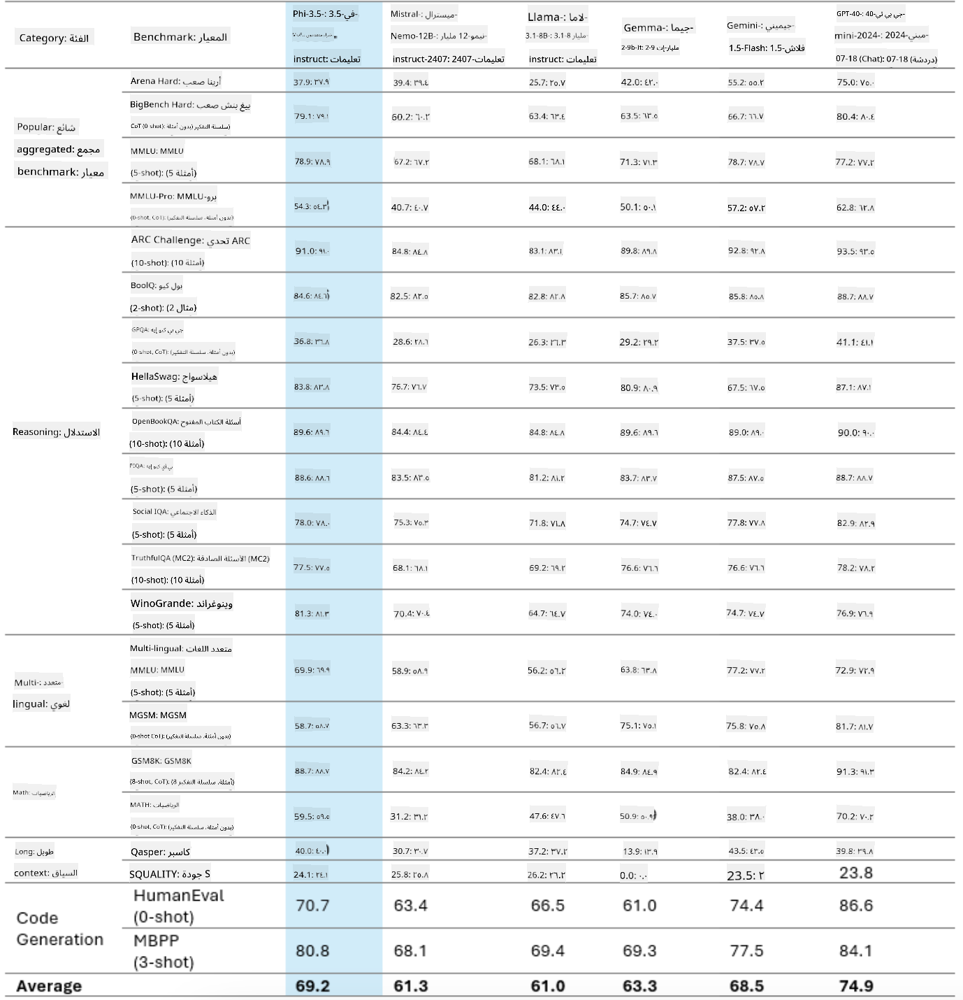

<!--
CO_OP_TRANSLATOR_METADATA:
{
  "original_hash": "35bf81388ac6917277b8d9a0c39bdc70",
  "translation_date": "2025-07-17T03:21:24+00:00",
  "source_file": "md/02.Application/02.Code/Phi3/CreateVSCodeChatAgentWithGitHubModels.md",
  "language_code": "ar"
}
-->
# **أنشئ وكيل دردشة خاص بك في Visual Studio Code باستخدام Phi-3.5 من GitHub Models**

هل تستخدم Visual Studio Code Copilot؟ خاصة في الدردشة، يمكنك استخدام وكلاء مختلفين لتحسين القدرة على إنشاء وكتابة وصيانة المشاريع في Visual Studio Code. يوفر Visual Studio Code واجهة برمجة تطبيقات (API) تتيح للشركات والأفراد إنشاء وكلاء مختلفين بناءً على أعمالهم لتوسيع قدراتهم في مجالات متخصصة مختلفة. في هذه المقالة، سنركز على **Phi-3.5-mini-instruct (128k)** و **Phi-3.5-vision-instruct (128k)** من GitHub Models لإنشاء وكيل Visual Studio Code خاص بك.

## **حول Phi-3.5 في GitHub Models**

نعلم أن Phi-3/3.5-mini-instruct في عائلة Phi-3/3.5 يمتلك قدرات قوية في فهم وتوليد الأكواد، وله مزايا مقارنة بـ Gemma-2-9b و Mistral-Nemo-12B-instruct-2407.



توفر أحدث نماذج GitHub Models بالفعل إمكانية الوصول إلى نماذج Phi-3.5-mini-instruct (128k) و Phi-3.5-vision-instruct (128k). يمكن للمطورين الوصول إليها من خلال OpenAI SDK، و Azure AI Inference SDK، و REST API.


***ملاحظة:*** يُنصح باستخدام Azure AI Inference SDK هنا، لأنه يمكنه التبديل بشكل أفضل مع Azure Model Catalog في بيئة الإنتاج.

فيما يلي نتائج **Phi-3.5-mini-instruct (128k)** و **Phi-3.5-vision-instruct (128k)** في سيناريو توليد الأكواد بعد الربط مع GitHub Models، وكذلك التحضير للأمثلة التالية.

**عرض توضيحي: توليد كود من Prompt باستخدام GitHub Models Phi-3.5-mini-instruct (128k)** ([اضغط هنا](../../../../../../code/09.UpdateSamples/Aug/ghmodel_phi35_instruct_demo.ipynb))

**عرض توضيحي: توليد كود من صورة باستخدام GitHub Models Phi-3.5-vision-instruct (128k)** ([اضغط هنا](../../../../../../code/09.UpdateSamples/Aug/ghmodel_phi35_vision_demo.ipynb))


## **حول وكيل دردشة GitHub Copilot**

يمكن لوكيل دردشة GitHub Copilot إتمام مهام مختلفة في سيناريوهات مشاريع متنوعة بناءً على الكود. يحتوي النظام على أربعة وكلاء: workspace، github، terminal، vscode


بإضافة اسم الوكيل مع ‘@’، يمكنك إتمام العمل المقابل بسرعة. بالنسبة للمؤسسات، إذا أضفت محتوى متعلقًا بأعمالك مثل المتطلبات، الترميز، مواصفات الاختبار، والإصدار، يمكنك الحصول على وظائف خاصة أكثر قوة للمؤسسات بناءً على GitHub Copilot.

تم الآن إصدار واجهة برمجة التطبيقات (API) لوكيل دردشة Visual Studio Code رسميًا، مما يسمح للمؤسسات أو مطوري المؤسسات بتطوير وكلاء بناءً على أنظمة بيئية مختلفة لأعمال البرمجيات. بناءً على طريقة تطوير امتدادات Visual Studio Code، يمكنك بسهولة الوصول إلى واجهة API لوكيل دردشة Visual Studio Code. يمكننا التطوير بناءً على هذه العملية.


يمكن لسيناريو التطوير دعم الوصول إلى واجهات برمجة تطبيقات نماذج الطرف الثالث (مثل GitHub Models، Azure Model Catalog، والخدمات المبنية ذاتيًا على نماذج مفتوحة المصدر) ويمكن أيضًا استخدام نماذج gpt-35-turbo، gpt-4، و gpt-4o المقدمة من GitHub Copilot.

## **إضافة وكيل @phicoding مبني على Phi-3.5**

نحاول دمج قدرات البرمجة لـ Phi-3.5 لإتمام كتابة الأكواد، توليد أكواد من الصور، ومهام أخرى. إكمال وكيل مبني حول Phi-3.5 - @PHI، وفيما يلي بعض الوظائف:

1. توليد مقدمة ذاتية بناءً على GPT-4o المقدم من GitHub Copilot عبر الأمر **@phicoding /help**

2. توليد كود بلغات برمجة مختلفة بناءً على **Phi-3.5-mini-instruct (128k)** عبر الأمر **@phicoding /gen**

3. توليد كود بناءً على **Phi-3.5-vision-instruct (128k)** وإكمال الصور عبر الأمر **@phicoding /image**


## **الخطوات المتعلقة**

1. تثبيت دعم تطوير امتدادات Visual Studio Code باستخدام npm

```bash

npm install --global yo generator-code 

```
2. إنشاء إضافة امتداد Visual Studio Code (باستخدام وضع تطوير Typescript، باسم phiext)

```bash

yo code 

```

3. افتح المشروع الذي تم إنشاؤه وعدل package.json. هنا التعليمات والتكوينات المتعلقة، بالإضافة إلى تكوين GitHub Models. لاحظ أنه يجب إضافة رمز GitHub Models الخاص بك هنا.

```json

{
  "name": "phiext",
  "displayName": "phiext",
  "description": "",
  "version": "0.0.1",
  "engines": {
    "vscode": "^1.93.0"
  },
  "categories": [
    "AI",
    "Chat"
  ],
  "activationEvents": [],
  "enabledApiProposals": [
      "chatVariableResolver"
  ],
  "main": "./dist/extension.js",
  "contributes": {
    "chatParticipants": [
        {
            "id": "chat.phicoding",
            "name": "phicoding",
            "description": "Hey! I am Microsoft Phi-3.5, She can help me with coding problems, such as generation code with your natural language, or even generation code about chart from images. Just ask me anything!",
            "isSticky": true,
            "commands": [
                {
                    "name": "help",
                    "description": "Introduce myself to you"
                },
                {
                    "name": "gen",
                    "description": "Generate code for you with Microsoft Phi-3.5-mini-instruct"
                },
                {
                    "name": "image",
                    "description": "Generate code for chart from image(png or jpg) with Microsoft Phi-3.5-vision-instruct, please add image url like this : https://ajaytech.co/wp-content/uploads/2019/09/index.png"
                }
            ]
        }
    ],
    "commands": [
        {
            "command": "phicoding.namesInEditor",
            "title": "Use Microsoft Phi 3.5 in Editor"
        }
    ],
    "configuration": {
      "type": "object",
      "title": "githubmodels",
      "properties": {
        "githubmodels.endpoint": {
          "type": "string",
          "default": "https://models.inference.ai.azure.com",
          "description": "Your GitHub Models Endpoint",
          "order": 0
        },
        "githubmodels.api_key": {
          "type": "string",
          "default": "Your GitHub Models Token",
          "description": "Your GitHub Models Token",
          "order": 1
        },
        "githubmodels.phi35instruct": {
          "type": "string",
          "default": "Phi-3.5-mini-instruct",
          "description": "Your Phi-35-Instruct Model",
          "order": 2
        },
        "githubmodels.phi35vision": {
          "type": "string",
          "default": "Phi-3.5-vision-instruct",
          "description": "Your Phi-35-Vision Model",
          "order": 3
        }
      }
    }
  },
  "scripts": {
    "vscode:prepublish": "npm run package",
    "compile": "webpack",
    "watch": "webpack --watch",
    "package": "webpack --mode production --devtool hidden-source-map",
    "compile-tests": "tsc -p . --outDir out",
    "watch-tests": "tsc -p . -w --outDir out",
    "pretest": "npm run compile-tests && npm run compile && npm run lint",
    "lint": "eslint src",
    "test": "vscode-test"
  },
  "devDependencies": {
    "@types/vscode": "^1.93.0",
    "@types/mocha": "^10.0.7",
    "@types/node": "20.x",
    "@typescript-eslint/eslint-plugin": "^8.3.0",
    "@typescript-eslint/parser": "^8.3.0",
    "eslint": "^9.9.1",
    "typescript": "^5.5.4",
    "ts-loader": "^9.5.1",
    "webpack": "^5.94.0",
    "webpack-cli": "^5.1.4",
    "@vscode/test-cli": "^0.0.10",
    "@vscode/test-electron": "^2.4.1"
  },
  "dependencies": {
    "@types/node-fetch": "^2.6.11",
    "node-fetch": "^3.3.2",
    "@azure-rest/ai-inference": "latest",
    "@azure/core-auth": "latest",
    "@azure/core-sse": "latest"
  }
}


```

4. تعديل src/extension.ts

```typescript

// The module 'vscode' contains the VS Code extensibility API
// Import the module and reference it with the alias vscode in your code below
import * as vscode from 'vscode';
import ModelClient from "@azure-rest/ai-inference";
import { AzureKeyCredential } from "@azure/core-auth";


interface IPhiChatResult extends vscode.ChatResult {
    metadata: {
        command: string;
    };
}


const MODEL_SELECTOR: vscode.LanguageModelChatSelector = { vendor: 'copilot', family: 'gpt-4o' };

function isValidImageUrl(url: string): boolean {
    const regex = /^(https?:\/\/.*\.(?:png|jpg))$/i;
    return regex.test(url);
}
  

// This method is called when your extension is activated
// Your extension is activated the very first time the command is executed
export function activate(context: vscode.ExtensionContext) {

    const codinghandler: vscode.ChatRequestHandler = async (request: vscode.ChatRequest, context: vscode.ChatContext, stream: vscode.ChatResponseStream, token: vscode.CancellationToken): Promise<IPhiChatResult> => {


        const config : any = vscode.workspace.getConfiguration('githubmodels');
        const endPoint: string = config.get('endpoint');
        const apiKey: string = config.get('api_key');
        const phi35instruct: string = config.get('phi35instruct');
        const phi35vision: string = config.get('phi35vision');
        
        if (request.command === 'help') {

            const content = "Welcome to Coding assistant with Microsoft Phi-3.5"; 
            stream.progress(content);


            try {
                const [model] = await vscode.lm.selectChatModels(MODEL_SELECTOR);
                if (model) {
                    const messages = [
                        vscode.LanguageModelChatMessage.User("Please help me express this content in a humorous way: I am a programming assistant who can help you convert natural language into code and generate code based on the charts in the images. output format like this : Hey I am Phi ......")
                    ];
                    const chatResponse = await model.sendRequest(messages, {}, token);
                    for await (const fragment of chatResponse.text) {
                        stream.markdown(fragment);
                    }
                }
            } catch(err) {
                console.log(err);
            }


            return { metadata: { command: 'help' } };

        }

        
        if (request.command === 'gen') {

            const content = "Welcome to use phi-3.5 to generate code";

            stream.progress(content);

            const client = new ModelClient(endPoint, new AzureKeyCredential(apiKey));

            const response = await client.path("/chat/completions").post({
              body: {
                messages: [
                  { role:"system", content: "You are a coding assistant.Help answer all code generation questions." },
                  { role:"user", content: request.prompt }
                ],
                model: phi35instruct,
                temperature: 0.4,
                max_tokens: 1000,
                top_p: 1.
              }
            });

            stream.markdown(response.body.choices[0].message.content);

            return { metadata: { command: 'gen' } };

        }


        
        if (request.command === 'image') {


            const content = "Welcome to use phi-3.5 to generate code from image(png or jpg),image url like this:https://ajaytech.co/wp-content/uploads/2019/09/index.png";

            stream.progress(content);

            if (!isValidImageUrl(request.prompt)) {
                stream.markdown('Please provide a valid image URL');
                return { metadata: { command: 'image' } };
            }
            else
            {

                const client = new ModelClient(endPoint, new AzureKeyCredential(apiKey));
    
                const response = await client.path("/chat/completions").post({
                    body: {
                      messages: [
                        { role: "system", content: "You are a helpful assistant that describes images in details." },
                        { role: "user", content: [
                            { type: "text", text: "Please generate code according to the chart in the picture according to the following requirements\n1. Keep all information in the chart, including data and text\n2. Do not generate additional information that is not included in the chart\n3. Please extract data from the picture, do not generate it from csv\n4. Please save the regenerated chart as a chart and save it to ./output/demo.png"},
                            { type: "image_url", image_url: {url: request.prompt}
                            }
                          ]
                        }
                      ],
                      model: phi35vision,
                      temperature: 0.4,
                      max_tokens: 2048,
                      top_p: 1.
                    }
                  });
    
                
                stream.markdown(response.body.choices[0].message.content);
    
                return { metadata: { command: 'image' } };
            }


        }


        return { metadata: { command: '' } };
    };


    const phi_ext = vscode.chat.createChatParticipant("chat.phicoding", codinghandler);

    phi_ext.iconPath = new vscode.ThemeIcon('sparkle');


    phi_ext.followupProvider = {
        provideFollowups(result: IPhiChatResult, context: vscode.ChatContext, token: vscode.CancellationToken) {
            return [{
                prompt: 'Let us coding with Phi-3.5 😋😋😋😋',
                label: vscode.l10n.t('Enjoy coding with Phi-3.5'),
                command: 'help'
            } satisfies vscode.ChatFollowup];
        }
    };

    context.subscriptions.push(phi_ext);
}

// This method is called when your extension is deactivated
export function deactivate() {}


```

6. التشغيل

***/help***


***@phicoding /help***


***@phicoding /gen***


***@phicoding /image***


يمكنك تحميل كود العينة: [اضغط هنا](../../../../../../code/09.UpdateSamples/Aug/vscode)

## **الموارد**

1. سجل في GitHub Models [https://gh.io/models](https://gh.io/models)

2. تعلّم تطوير امتدادات Visual Studio Code [https://code.visualstudio.com/api/get-started/your-first-extension](https://code.visualstudio.com/api/get-started/your-first-extension)

3. تعرّف على واجهة برمجة تطبيقات دردشة Visual Studio Code Coilot [https://code.visualstudio.com/api/extension-guides/chat](https://code.visualstudio.com/api/extension-guides/chat)

**إخلاء المسؤولية**:  
تمت ترجمة هذا المستند باستخدام خدمة الترجمة الآلية [Co-op Translator](https://github.com/Azure/co-op-translator). بينما نسعى لتحقيق الدقة، يرجى العلم أن الترجمات الآلية قد تحتوي على أخطاء أو عدم دقة. يجب اعتبار المستند الأصلي بلغته الأصلية المصدر الموثوق به. للمعلومات الهامة، يُنصح بالترجمة البشرية المهنية. نحن غير مسؤولين عن أي سوء فهم أو تفسير ناتج عن استخدام هذه الترجمة.