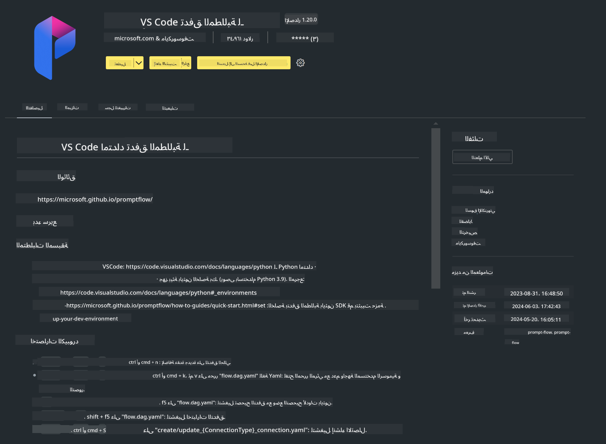

<!--
CO_OP_TRANSLATOR_METADATA:
{
  "original_hash": "a4ef39027902e82f2c33d568d2a2259a",
  "translation_date": "2025-07-17T03:47:59+00:00",
  "source_file": "md/02.Application/02.Code/Phi3/VSCodeExt/HOL/AIPC/01.Installations.md",
  "language_code": "ar"
}
-->
# **المختبر 0 - التثبيت**

عند دخولنا إلى المختبر، نحتاج إلى إعداد البيئة المناسبة:

### **1. بايثون 3.11+**

يوصى باستخدام miniforge لتكوين بيئة بايثون الخاصة بك

لإعداد miniforge، يرجى الرجوع إلى [https://github.com/conda-forge/miniforge](https://github.com/conda-forge/miniforge)

بعد إعداد miniforge، قم بتشغيل الأمر التالي في Power Shell

```bash

conda create -n pyenv python==3.11.8 -y

conda activate pyenv

```

### **2. تثبيت مكتبة Prompt flow SDK**

في المختبر 1، نستخدم Prompt flow، لذلك تحتاج إلى إعداد مكتبة Prompt flow SDK.

```bash

pip install promptflow --upgrade

```

يمكنك التحقق من promptflow sdk باستخدام هذا الأمر

```bash

pf --version

```

### **3. تثبيت إضافة Visual Studio Code لـ Prompt flow**



### **4. مكتبة تسريع Intel NPU**

تدعم معالجات Intel الجديدة وحدة NPU. إذا كنت ترغب في استخدام NPU لتشغيل LLMs / SLMs محليًا، يمكنك استخدام ***مكتبة تسريع Intel NPU***. إذا أردت معرفة المزيد، يمكنك قراءة [https://github.com/microsoft/PhiCookBook/blob/main/md/01.Introduction/03/AIPC_Inference.md](https://github.com/microsoft/PhiCookBook/blob/main/md/01.Introduction/03/AIPC_Inference.md).

قم بتثبيت مكتبة تسريع Intel NPU في bash

```bash

pip install intel-npu-acceleration-library

```

***ملاحظة***: يرجى ملاحظة أن هذه المكتبة تدعم transformers ***4.40.2***، يرجى التأكد من الإصدار

### **5. مكتبات بايثون الأخرى**

قم بإنشاء ملف requirements.txt وأضف هذا المحتوى

```txt

notebook
numpy 
scipy 
scikit-learn 
matplotlib 
pandas 
pillow 
graphviz

```

### **6. تثبيت NVM**

قم بتثبيت nvm في Powershell

```bash

winget install -e --id CoreyButler.NVMforWindows

```

قم بتثبيت nodejs 18.20

```bash

nvm install 18.20.0

nvm use 18.20.0

```

### **7. تثبيت دعم تطوير Visual Studio Code**

```bash

npm install --global yo generator-code

```

تهانينا! لقد قمت بإعداد SDK بنجاح. الآن، تابع الخطوات العملية.

**إخلاء المسؤولية**:  
تمت ترجمة هذا المستند باستخدام خدمة الترجمة الآلية [Co-op Translator](https://github.com/Azure/co-op-translator). بينما نسعى لتحقيق الدقة، يرجى العلم أن الترجمات الآلية قد تحتوي على أخطاء أو عدم دقة. يجب اعتبار المستند الأصلي بلغته الأصلية المصدر الموثوق به. للمعلومات الهامة، يُنصح بالاعتماد على الترجمة البشرية المهنية. نحن غير مسؤولين عن أي سوء فهم أو تفسير ناتج عن استخدام هذه الترجمة.