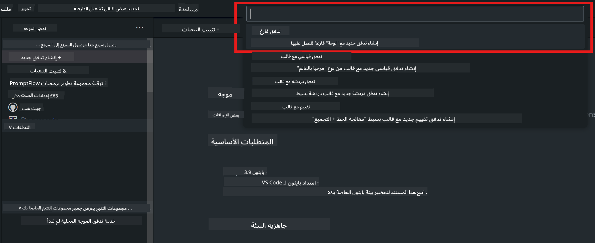

<!--
CO_OP_TRANSLATOR_METADATA:
{
  "original_hash": "bc29f7fe7fc16bed6932733eac8c81b8",
  "translation_date": "2025-05-07T10:55:17+00:00",
  "source_file": "md/02.Application/02.Code/Phi3/VSCodeExt/HOL/AIPC/02.PromptflowWithNPU.md",
  "language_code": "ar"
}
-->
# **المعمل 2 - تشغيل Prompt flow مع Phi-3-mini في AIPC**

## **ما هو Prompt flow**

Prompt flow هو مجموعة أدوات تطوير مصممة لتبسيط دورة تطوير تطبيقات الذكاء الاصطناعي المعتمدة على نماذج اللغة الكبيرة (LLM) من الفكرة، والنمذجة الأولية، والاختبار، والتقييم، إلى النشر في الإنتاج والمراقبة. يجعل هندسة الـ prompt أسهل بكثير ويتيح لك بناء تطبيقات LLM بجودة الإنتاج.

مع Prompt flow، ستكون قادرًا على:

- إنشاء تدفقات تربط بين نماذج LLM، والـ prompts، وكود بايثون، وأدوات أخرى معًا في سير عمل قابل للتنفيذ.

- تصحيح الأخطاء وتكرار التدفقات الخاصة بك، خاصة التفاعل مع نماذج LLM بسهولة.

- تقييم تدفقاتك، وحساب مقاييس الجودة والأداء باستخدام مجموعات بيانات أكبر.

- دمج الاختبار والتقييم في نظام CI/CD الخاص بك لضمان جودة التدفق.

- نشر تدفقاتك على منصة الخدمة التي تختارها أو دمجها بسهولة في قاعدة كود تطبيقك.

- (اختياري لكن موصى به بشدة) التعاون مع فريقك باستخدام النسخة السحابية من Prompt flow في Azure AI.

## **ما هو AIPC**

الكمبيوتر الشخصي الذكي (AI PC) يحتوي على وحدة معالجة مركزية (CPU)، ووحدة معالجة رسومات (GPU)، ووحدة معالجة عصبية (NPU)، كل منها يتمتع بقدرات تسريع ذكاء اصطناعي محددة. وحدة المعالجة العصبية (NPU) هي مسرع متخصص يتعامل مع مهام الذكاء الاصطناعي (AI) والتعلم الآلي (ML) مباشرة على جهاز الكمبيوتر الخاص بك بدلاً من إرسال البيانات للمعالجة في السحابة. يمكن لوحدات GPU وCPU أيضًا معالجة هذه الأحمال، لكن NPU مميز بشكل خاص في حسابات الذكاء الاصطناعي منخفضة الطاقة. يمثل AI PC تحولًا جذريًا في كيفية عمل حواسيبنا. إنه ليس حلاً لمشكلة لم تكن موجودة من قبل، بل يعد بتحسين كبير في استخدامات الكمبيوتر اليومية.

فكيف يعمل؟ مقارنة بالذكاء الاصطناعي التوليدي ونماذج اللغة الكبيرة الضخمة (LLMs) المدربة على كم هائل من البيانات العامة، فإن الذكاء الاصطناعي الذي يحدث على جهاز الكمبيوتر الخاص بك أكثر سهولة على كل المستويات تقريبًا. المفهوم أسهل في الفهم، وبما أنه مدرب على بياناتك، دون الحاجة للوصول إلى السحابة، فإن الفوائد تكون أكثر جاذبية على الفور لفئة أوسع من المستخدمين.

على المدى القريب، يشمل عالم AI PC المساعدين الشخصيين ونماذج الذكاء الاصطناعي الصغيرة التي تعمل مباشرة على جهاز الكمبيوتر الخاص بك، باستخدام بياناتك لتقديم تحسينات ذكية شخصية وخاصة وأكثر أمانًا للأشياء التي تقوم بها يوميًا – مثل تدوين ملاحظات الاجتماعات، تنظيم دوري كرة القدم الخيالية، أتمتة تحسينات تحرير الصور والفيديو، أو وضع جدول مثالي للقاء عائلي بناءً على أوقات وصول ومغادرة الجميع.

## **بناء تدفقات توليد الكود على AIPC**

***ملاحظة*** ：إذا لم تكمل تثبيت البيئة، يرجى زيارة [Lab 0 -Installations](./01.Installations.md)

1. افتح امتداد Prompt flow في Visual Studio Code وأنشئ مشروع تدفق فارغ



2. أضف معلمات الإدخال والإخراج وأضف كود بايثون كتدفق جديد


يمكنك الرجوع إلى هذا الهيكل (flow.dag.yaml) لبناء تدفقك

```yaml

inputs:
  question:
    type: string
    default: how to write Bubble Algorithm
outputs:
  answer:
    type: string
    reference: ${Chat_With_Phi3.output}
nodes:
- name: Chat_With_Phi3
  type: python
  source:
    type: code
    path: Chat_With_Phi3.py
  inputs:
    question: ${inputs.question}


```

3. أضف الكود في ***Chat_With_Phi3.py***

```python


from promptflow.core import tool

# import torch
from transformers import AutoTokenizer, pipeline,TextStreamer
import intel_npu_acceleration_library as npu_lib

import warnings

import asyncio
import platform

class Phi3CodeAgent:
    
    model = None
    tokenizer = None
    text_streamer = None
    
    model_id = "microsoft/Phi-3-mini-4k-instruct"

    @staticmethod
    def init_phi3():
        
        if Phi3CodeAgent.model is None or Phi3CodeAgent.tokenizer is None or Phi3CodeAgent.text_streamer is None:
            Phi3CodeAgent.model = npu_lib.NPUModelForCausalLM.from_pretrained(
                                    Phi3CodeAgent.model_id,
                                    torch_dtype="auto",
                                    dtype=npu_lib.int4,
                                    trust_remote_code=True
                                )
            Phi3CodeAgent.tokenizer = AutoTokenizer.from_pretrained(Phi3CodeAgent.model_id)
            Phi3CodeAgent.text_streamer = TextStreamer(Phi3CodeAgent.tokenizer, skip_prompt=True)

    

    @staticmethod
    def chat_with_phi3(prompt):
        
        Phi3CodeAgent.init_phi3()

        messages = "<|system|>You are a AI Python coding assistant. Please help me to generate code in Python.The answer only genertated Python code, but any comments and instructions do not need to be generated<|end|><|user|>" + prompt +"<|end|><|assistant|>"


        generation_args = {
            "max_new_tokens": 1024,
            "return_full_text": False,
            "temperature": 0.3,
            "do_sample": False,
            "streamer": Phi3CodeAgent.text_streamer,
        }

        pipe = pipeline(
            "text-generation",
            model=Phi3CodeAgent.model,
            tokenizer=Phi3CodeAgent.tokenizer,
            # **generation_args
        )

        result = ''

        with warnings.catch_warnings():
            warnings.simplefilter("ignore")
            response = pipe(messages, **generation_args)
            result =response[0]['generated_text']
            return result


@tool
def my_python_tool(question: str) -> str:
    if platform.system() == 'Windows':
        asyncio.set_event_loop_policy(asyncio.WindowsSelectorEventLoopPolicy())
    return Phi3CodeAgent.chat_with_phi3(question)


```

4. يمكنك اختبار التدفق من خلال التصحيح أو التشغيل للتحقق من صحة توليد الكود


5. شغل التدفق كـ API تطوير في الطرفية

```

pf flow serve --source ./ --port 8080 --host localhost   

```

يمكنك اختباره في Postman / Thunder Client

### **ملاحظة**

1. التشغيل الأول يستغرق وقتًا طويلاً. يُنصح بتحميل نموذج phi-3 من خلال Hugging face CLI.

2. نظرًا للطاقة الحاسوبية المحدودة لوحدة Intel NPU، يُفضل استخدام Phi-3-mini-4k-instruct

3. نستخدم تسريع Intel NPU لتحويل الكمية إلى INT4، ولكن إذا أعدت تشغيل الخدمة، يجب حذف مجلدات cache و nc_workshop.

## **المصادر**

1. تعلم Promptflow [https://microsoft.github.io/promptflow/](https://microsoft.github.io/promptflow/)

2. تعلم تسريع Intel NPU [https://github.com/intel/intel-npu-acceleration-library](https://github.com/intel/intel-npu-acceleration-library)

3. كود العينة، تحميل [Local NPU Agent Sample Code](../../../../../../../../../code/07.Lab/01/AIPC)

**إخلاء مسؤولية**:  
تمت ترجمة هذا المستند باستخدام خدمة الترجمة الآلية [Co-op Translator](https://github.com/Azure/co-op-translator). بينما نسعى لتحقيق الدقة، يرجى العلم أن الترجمات الآلية قد تحتوي على أخطاء أو عدم دقة. يجب اعتبار المستند الأصلي بلغته الأصلية المصدر الرسمي والمعتمد. بالنسبة للمعلومات الهامة، يُنصح بالاعتماد على الترجمة المهنية البشرية. نحن غير مسؤولين عن أي سوء فهم أو تفسير ناتج عن استخدام هذه الترجمة.