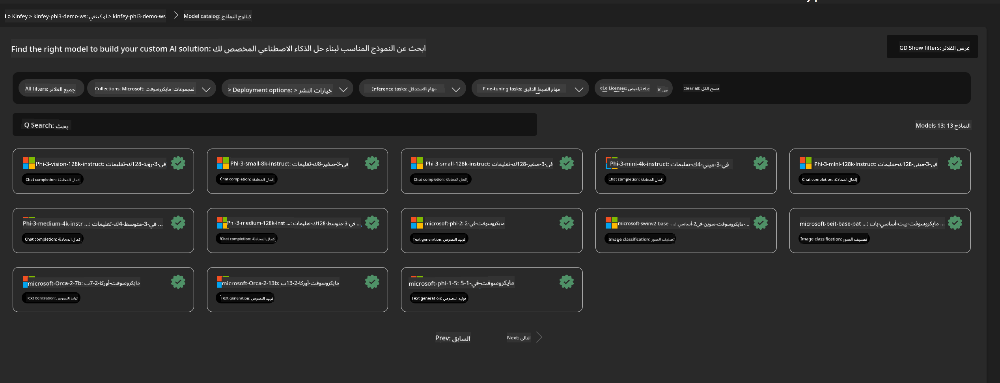
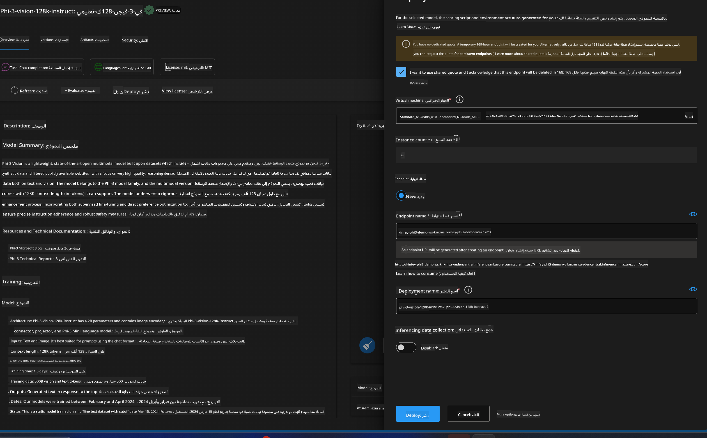
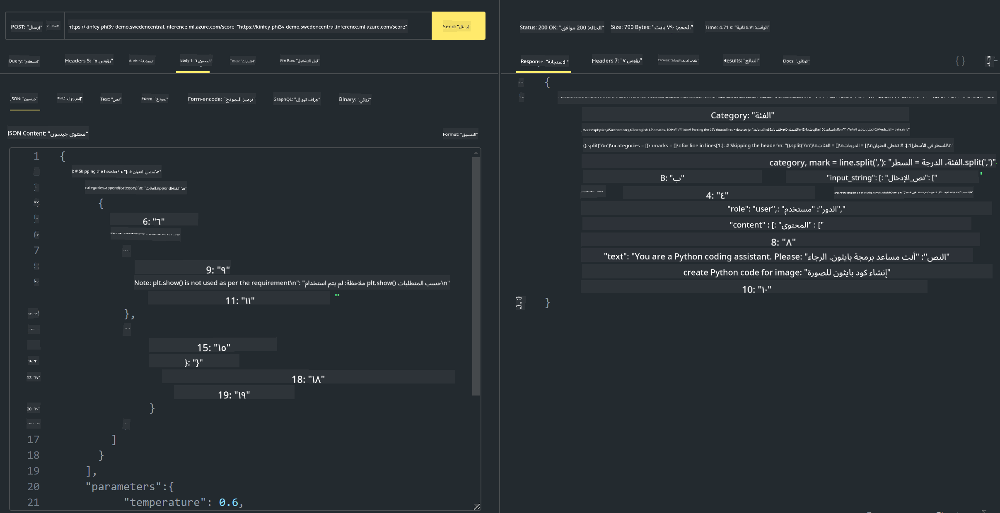

<!--
CO_OP_TRANSLATOR_METADATA:
{
  "original_hash": "20cb4e6ac1686248e8be913ccf6c2bc2",
  "translation_date": "2025-05-07T10:55:51+00:00",
  "source_file": "md/02.Application/02.Code/Phi3/VSCodeExt/HOL/AIPC/03.DeployPhi3VisionOnAzure.md",
  "language_code": "ar"
}
-->
# **المختبر 3 - نشر Phi-3-vision على خدمة Azure لتعلم الآلة**

نستخدم NPU لإكمال نشر الكود المحلي في بيئة الإنتاج، ثم نرغب في إدخال القدرة على استخدام PHI-3-VISION من خلالها لتحقيق تحويل الصور إلى كود.

في هذا التقديم، يمكننا بسرعة بناء خدمة نموذج كنموذج Phi-3 Vision في خدمة Azure لتعلم الآلة.

***Note***： تتطلب Phi-3 Vision قدرة حسابية لتوليد المحتوى بسرعة أكبر. نحتاج إلى قوة حوسبة سحابية لمساعدتنا في تحقيق ذلك.


### **1. إنشاء خدمة Azure لتعلم الآلة**

نحتاج إلى إنشاء خدمة Azure لتعلم الآلة في بوابة Azure. إذا كنت ترغب في التعلم كيف، يرجى زيارة هذا الرابط [https://learn.microsoft.com/azure/machine-learning/quickstart-create-resources?view=azureml-api-2](https://learn.microsoft.com/azure/machine-learning/quickstart-create-resources?view=azureml-api-2)


### **2. اختيار Phi-3 Vision في خدمة Azure لتعلم الآلة**




### **3. نشر Phi-3-Vision في Azure**





### **4. اختبار نقطة النهاية في Postman**





***Note***

1. يجب أن تتضمن المعلمات المرسلة Authorization و azureml-model-deployment و Content-Type. تحتاج إلى التحقق من معلومات النشر للحصول عليها.

2. لنقل المعلمات، يحتاج Phi-3-Vision إلى إرسال رابط صورة. يرجى الرجوع إلى طريقة GPT-4-Vision لنقل المعلمات، مثل

```json

{
  "input_data":{
    "input_string":[
      {
        "role":"user",
        "content":[ 
          {
            "type": "text",
            "text": "You are a Python coding assistant.Please create Python code for image "
          },
          {
              "type": "image_url",
              "image_url": {
                "url": "https://ajaytech.co/wp-content/uploads/2019/09/index.png"
              }
          }
        ]
      }
    ],
    "parameters":{
          "temperature": 0.6,
          "top_p": 0.9,
          "do_sample": false,
          "max_new_tokens": 2048
    }
  }
}

```

3. استدعاء **/score** باستخدام طريقة Post

**مبروك**! لقد أكملت النشر السريع لـ PHI-3-VISION وجربت كيفية استخدام الصور لتوليد الكود. بعد ذلك، يمكننا بناء التطبيقات بالجمع بين NPUs والسحابة

**إخلاء المسؤولية**:  
تمت ترجمة هذا المستند باستخدام خدمة الترجمة الآلية [Co-op Translator](https://github.com/Azure/co-op-translator). بينما نسعى لتحقيق الدقة، يرجى العلم أن الترجمات الآلية قد تحتوي على أخطاء أو عدم دقة. يجب اعتبار المستند الأصلي بلغته الأصلية المصدر الموثوق به. بالنسبة للمعلومات الحساسة، يُنصح بالاستعانة بترجمة بشرية محترفة. نحن غير مسؤولين عن أي سوء فهم أو تفسير ناتج عن استخدام هذه الترجمة.