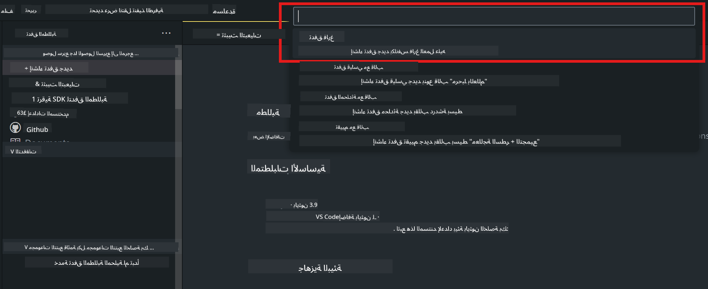
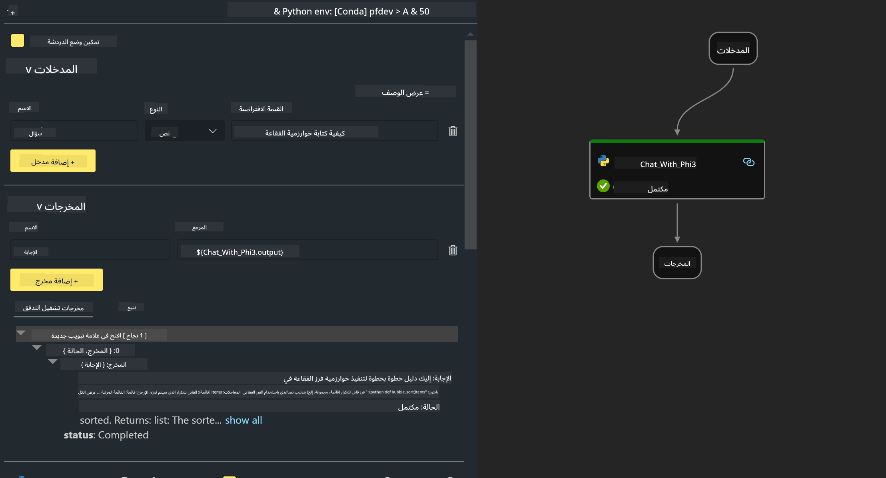
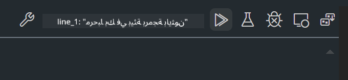

<!--
CO_OP_TRANSLATOR_METADATA:
{
  "original_hash": "3dbbf568625b1ee04b354c2dc81d3248",
  "translation_date": "2025-05-07T10:57:42+00:00",
  "source_file": "md/02.Application/02.Code/Phi3/VSCodeExt/HOL/Apple/02.PromptflowWithMLX.md",
  "language_code": "ar"
}
-->
# **المختبر 2 - تشغيل Prompt flow مع Phi-3-mini في AIPC**

## **ما هو Prompt flow**

Prompt flow هو مجموعة أدوات تطوير تهدف إلى تبسيط دورة تطوير تطبيقات الذكاء الاصطناعي المعتمدة على LLM من البداية للنهاية، بدءًا من الفكرة، والنماذج الأولية، والاختبار، والتقييم، وصولاً إلى النشر في الإنتاج والمراقبة. يجعل هندسة المطالبات أسهل بكثير ويسمح لك ببناء تطبيقات LLM بجودة إنتاجية.

مع prompt flow، ستتمكن من:

- إنشاء تدفقات تربط بين LLMs، والمطالبات، وكود بايثون، وأدوات أخرى معًا في سير عمل قابل للتنفيذ.

- تصحيح الأخطاء وتكرار التدفقات الخاصة بك، خاصة التفاعل مع LLMs بسهولة.

- تقييم التدفقات الخاصة بك، وحساب مقاييس الجودة والأداء باستخدام مجموعات بيانات أكبر.

- دمج الاختبار والتقييم في نظام CI/CD الخاص بك لضمان جودة التدفق.

- نشر التدفقات على منصة الخدمة التي تختارها أو دمجها بسهولة في قاعدة كود التطبيق الخاص بك.

- (اختياري ولكن موصى به بشدة) التعاون مع فريقك من خلال الاستفادة من النسخة السحابية من Prompt flow في Azure AI.

## **بناء تدفقات توليد الكود على Apple Silicon**

***Note*** ：إذا لم تكمل تثبيت البيئة، يرجى زيارة [Lab 0 -Installations](./01.Installations.md)

1. افتح امتداد Prompt flow في Visual Studio Code وأنشئ مشروع تدفق فارغ



2. أضف معلمات الإدخال والإخراج وأضف كود بايثون كتدفق جديد



يمكنك الرجوع إلى هذا الهيكل (flow.dag.yaml) لبناء تدفقك

```yaml

inputs:
  prompt:
    type: string
    default: Write python code for Fibonacci serie. Please use markdown as output
outputs:
  result:
    type: string
    reference: ${gen_code_by_phi3.output}
nodes:
- name: gen_code_by_phi3
  type: python
  source:
    type: code
    path: gen_code_by_phi3.py
  inputs:
    prompt: ${inputs.prompt}


```

3. تحديد كمية phi-3-mini

نأمل في تشغيل SLM بشكل أفضل على الأجهزة المحلية. بشكل عام، نقوم بتحديد كمية النموذج (INT4, FP16, FP32)

```bash

python -m mlx_lm.convert --hf-path microsoft/Phi-3-mini-4k-instruct

```

**Note:** المجلد الافتراضي هو mlx_model

4. أضف الكود في ***Chat_With_Phi3.py***

```python


from promptflow import tool

from mlx_lm import load, generate


# The inputs section will change based on the arguments of the tool function, after you save the code
# Adding type to arguments and return value will help the system show the types properly
# Please update the function name/signature per need
@tool
def my_python_tool(prompt: str) -> str:

    model_id = './mlx_model_phi3_mini'

    model, tokenizer = load(model_id)

    # <|user|>\nWrite python code for Fibonacci serie. Please use markdown as output<|end|>\n<|assistant|>

    response = generate(model, tokenizer, prompt="<|user|>\n" + prompt  + "<|end|>\n<|assistant|>", max_tokens=2048, verbose=True)

    return response


```

4. يمكنك اختبار التدفق من خلال التصحيح أو التشغيل للتحقق مما إذا كان توليد الكود يعمل بشكل صحيح أم لا



5. شغل التدفق كواجهة برمجة تطبيقات تطويرية في الطرفية

```

pf flow serve --source ./ --port 8080 --host localhost   

```

يمكنك اختباره في Postman / Thunder Client

### **Note**

1. التشغيل الأول يستغرق وقتًا طويلاً. يُنصح بتنزيل نموذج phi-3 من Hugging face CLI.

2. نظرًا لقدرات الحوسبة المحدودة لـ Intel NPU، يُفضل استخدام Phi-3-mini-4k-instruct

3. نستخدم تسريع Intel NPU لتحديد كمية التحويل إلى INT4، ولكن إذا أعدت تشغيل الخدمة، يجب عليك حذف مجلدي cache و nc_workshop.

## **الموارد**

1. تعلم Promptflow [https://microsoft.github.io/promptflow/](https://microsoft.github.io/promptflow/)

2. تعلم تسريع Intel NPU [https://github.com/intel/intel-npu-acceleration-library](https://github.com/intel/intel-npu-acceleration-library)

3. كود عينة، تحميل [Local NPU Agent Sample Code](../../../../../../../../../code/07.Lab/01/AIPC/local-npu-agent)

**إخلاء المسؤولية**:  
تمت ترجمة هذا المستند باستخدام خدمة الترجمة الآلية [Co-op Translator](https://github.com/Azure/co-op-translator). بينما نسعى لتحقيق الدقة، يرجى العلم أن الترجمات الآلية قد تحتوي على أخطاء أو عدم دقة. يجب اعتبار المستند الأصلي بلغته الأصلية المصدر الموثوق به. للمعلومات الهامة، يُنصح بالترجمة الاحترافية البشرية. نحن غير مسؤولين عن أي سوء فهم أو تفسير خاطئ ينشأ عن استخدام هذه الترجمة.