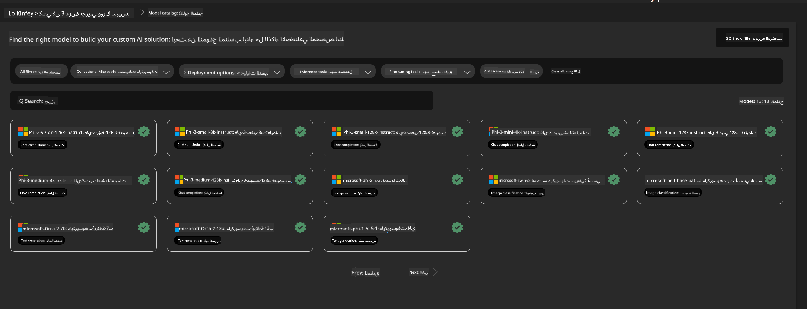
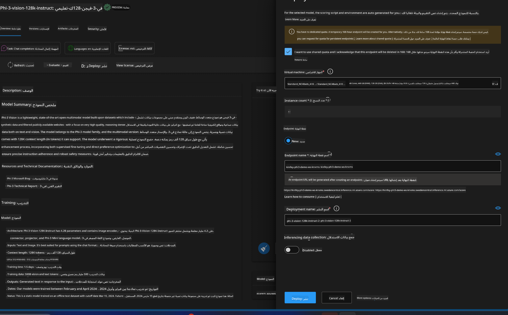

<!--
CO_OP_TRANSLATOR_METADATA:
{
  "original_hash": "20cb4e6ac1686248e8be913ccf6c2bc2",
  "translation_date": "2025-05-07T10:56:56+00:00",
  "source_file": "md/02.Application/02.Code/Phi3/VSCodeExt/HOL/Apple/03.DeployPhi3VisionOnAzure.md",
  "language_code": "ar"
}
-->
# **المختبر 3 - نشر Phi-3-vision على خدمة Azure Machine Learning**

نستخدم NPU لإكمال نشر الكود المحلي في الإنتاج، ثم نرغب في إدخال القدرة على تقديم PHI-3-VISION من خلاله لتحقيق تحويل الصور إلى كود.

في هذا التقديم، يمكننا بسرعة بناء خدمة نموذج كخدمة Phi-3 Vision في Azure Machine Learning Service.

***Note***： تتطلب Phi-3 Vision قوة حسابية لتوليد المحتوى بسرعة أكبر. نحتاج إلى قوة الحوسبة السحابية لمساعدتنا في تحقيق ذلك.


### **1. إنشاء خدمة Azure Machine Learning**

نحتاج إلى إنشاء خدمة Azure Machine Learning في بوابة Azure. إذا أردت معرفة الطريقة، يرجى زيارة هذا الرابط [https://learn.microsoft.com/azure/machine-learning/quickstart-create-resources?view=azureml-api-2](https://learn.microsoft.com/azure/machine-learning/quickstart-create-resources?view=azureml-api-2)


### **2. اختيار Phi-3 Vision في Azure Machine Learning Service**




### **3. نشر Phi-3-Vision في Azure**





### **4. اختبار نقطة النهاية في Postman**


***Note***

1. يجب أن تتضمن المعلمات المرسلة Authorization و azureml-model-deployment و Content-Type. تحتاج إلى التحقق من معلومات النشر للحصول عليها.

2. لنقل المعلمات، يحتاج Phi-3-Vision إلى إرسال رابط صورة. يرجى الرجوع إلى طريقة GPT-4-Vision لنقل المعلمات، مثل

```json

{
  "input_data":{
    "input_string":[
      {
        "role":"user",
        "content":[ 
          {
            "type": "text",
            "text": "You are a Python coding assistant.Please create Python code for image "
          },
          {
              "type": "image_url",
              "image_url": {
                "url": "https://ajaytech.co/wp-content/uploads/2019/09/index.png"
              }
          }
        ]
      }
    ],
    "parameters":{
          "temperature": 0.6,
          "top_p": 0.9,
          "do_sample": false,
          "max_new_tokens": 2048
    }
  }
}

```

3. استدعِ **/score** باستخدام طريقة Post

**تهانينا**! لقد أكملت نشر PHI-3-VISION السريع وجربت كيفية استخدام الصور لتوليد الكود. بعد ذلك، يمكننا بناء التطبيقات بالجمع بين NPUs والسحابة.

**إخلاء المسؤولية**:  
تمت ترجمة هذا المستند باستخدام خدمة الترجمة الآلية [Co-op Translator](https://github.com/Azure/co-op-translator). بينما نسعى لتحقيق الدقة، يرجى العلم أن الترجمات الآلية قد تحتوي على أخطاء أو عدم دقة. يجب اعتبار المستند الأصلي بلغته الأصلية المصدر الموثوق به. للمعلومات الحساسة، يُنصح بالاعتماد على الترجمة البشرية المهنية. نحن غير مسؤولين عن أي سوء فهم أو تفسير خاطئ ناتج عن استخدام هذه الترجمة.