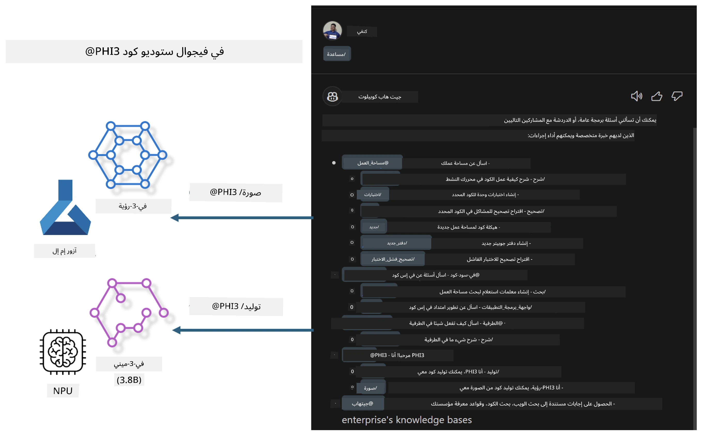

<!--
CO_OP_TRANSLATOR_METADATA:
{
  "original_hash": "00b7a699de8ac405fa821f4c0f7fc0ab",
  "translation_date": "2025-07-17T03:33:30+00:00",
  "source_file": "md/02.Application/02.Code/Phi3/VSCodeExt/README.md",
  "language_code": "ar"
}
-->
# **ابنِ وكيل GitHub Copilot Chat الخاص بك في Visual Studio Code باستخدام عائلة Microsoft Phi-3**

هل استخدمت وكيل مساحة العمل في GitHub Copilot Chat؟ هل ترغب في بناء وكيل كود خاص بفريقك؟ تهدف هذه الورشة العملية إلى دمج النموذج مفتوح المصدر لبناء وكيل أعمال برمجي على مستوى المؤسسات.

## **الأساسيات**

### **لماذا تختار Microsoft Phi-3**

Phi-3 هي سلسلة عائلية تشمل phi-3-mini وphi-3-small وphi-3-medium، تعتمد على معلمات تدريب مختلفة لتوليد النصوص، إكمال الحوارات، وتوليد الأكواد. هناك أيضًا phi-3-vision المبني على الرؤية. وهي مناسبة للمؤسسات أو الفرق المختلفة لإنشاء حلول ذكاء اصطناعي توليدية تعمل دون اتصال.

يوصى بقراءة هذا الرابط [https://github.com/microsoft/PhiCookBook/blob/main/md/01.Introduction/01/01.PhiFamily.md](https://github.com/microsoft/PhiCookBook/blob/main/md/01.Introduction/01/01.PhiFamily.md)

### **Microsoft GitHub Copilot Chat**

امتداد GitHub Copilot Chat يوفر لك واجهة دردشة تتيح لك التفاعل مع GitHub Copilot والحصول على إجابات لأسئلة متعلقة بالبرمجة مباشرة داخل VS Code، دون الحاجة للتنقل بين الوثائق أو البحث في المنتديات عبر الإنترنت.

قد يستخدم Copilot Chat تمييز الصياغة، التراجع، وميزات تنسيق أخرى لإضفاء وضوح على الرد المولد. بناءً على نوع السؤال من المستخدم، قد يحتوي الرد على روابط للسياق الذي استخدمه Copilot لتوليد الإجابة، مثل ملفات الكود المصدر أو الوثائق، أو أزرار للوصول إلى وظائف VS Code.

- يندمج Copilot Chat في سير عمل المطور ويقدم لك المساعدة حيثما تحتاجها:

- ابدأ محادثة دردشة داخلية مباشرة من المحرر أو الطرفية للحصول على المساعدة أثناء البرمجة

- استخدم عرض الدردشة ليكون لديك مساعد ذكاء اصطناعي بجانبك لمساعدتك في أي وقت

- أطلق Quick Chat لطرح سؤال سريع والعودة إلى ما كنت تفعله

يمكنك استخدام GitHub Copilot Chat في سيناريوهات متعددة، مثل:

- الإجابة على أسئلة برمجية حول أفضل طريقة لحل مشكلة

- شرح كود شخص آخر واقتراح تحسينات

- اقتراح إصلاحات للكود

- توليد حالات اختبار الوحدة

- توليد توثيق للكود

يوصى بقراءة هذا الرابط [https://code.visualstudio.com/docs/copilot/copilot-chat](https://code.visualstudio.com/docs/copilot/copilot-chat?WT.mc_id=aiml-137032-kinfeylo)

###  **Microsoft GitHub Copilot Chat @workspace**

الرجوع إلى **@workspace** في Copilot Chat يتيح لك طرح أسئلة حول كامل قاعدة الكود الخاصة بك. بناءً على السؤال، يقوم Copilot باسترجاع الملفات والرموز ذات الصلة بذكاء، والتي يشير إليها في إجابته كرابط وأمثلة كود.

للإجابة على سؤالك، يبحث **@workspace** في نفس المصادر التي يستخدمها المطور عند التنقل في قاعدة الكود في VS Code:

- جميع الملفات في مساحة العمل، باستثناء الملفات التي تم تجاهلها بواسطة ملف .gitignore

- هيكل الدليل مع المجلدات والملفات المتداخلة

- فهرس بحث الكود الخاص بـ GitHub، إذا كانت مساحة العمل مستودع GitHub ومفهرسة بواسطة بحث الكود

- الرموز والتعريفات في مساحة العمل

- النص المحدد حاليًا أو النص المرئي في المحرر النشط

ملاحظة: يتم تجاوز .gitignore إذا كان لديك ملف مفتوح أو نص محدد داخل ملف تم تجاهله.

يوصى بقراءة هذا الرابط [[https://code.visualstudio.com/docs/copilot/copilot-chat](https://code.visualstudio.com/docs/copilot/workspace-context?WT.mc_id=aiml-137032-kinfeylo)]

## **تعرف أكثر على هذه الورشة**

لقد حسّن GitHub Copilot بشكل كبير من كفاءة البرمجة في المؤسسات، وكل مؤسسة تأمل في تخصيص الوظائف ذات الصلة بـ GitHub Copilot. قامت العديد من المؤسسات بتخصيص امتدادات مشابهة لـ GitHub Copilot بناءً على سيناريوهات أعمالها الخاصة والنماذج مفتوحة المصدر. بالنسبة للمؤسسات، فإن الامتدادات المخصصة أسهل في التحكم، لكن هذا يؤثر أيضًا على تجربة المستخدم. فبعد كل شيء، يمتلك GitHub Copilot وظائف أقوى في التعامل مع السيناريوهات العامة والاحترافية. إذا أمكن الحفاظ على تجربة متسقة، فسيكون من الأفضل تخصيص امتداد المؤسسة الخاص. يوفر GitHub Copilot Chat واجهات برمجة تطبيقات ذات صلة للمؤسسات لتوسيع تجربة الدردشة. الحفاظ على تجربة متسقة ووجود وظائف مخصصة هو تجربة مستخدم أفضل.

تعتمد هذه الورشة بشكل رئيسي على نموذج Phi-3 مع الجمع بين NPU المحلي وAzure الهجين لبناء وكيل مخصص في GitHub Copilot Chat ***@PHI3*** لمساعدة مطوري المؤسسات في إكمال توليد الكود***(@PHI3 /gen)*** وتوليد الكود بناءً على الصور ***(@PHI3 /img)***.

### ***ملاحظة:*** 

يتم تنفيذ هذه الورشة حاليًا في AIPC لمعالجات Intel وApple Silicon. سنستمر في تحديث نسخة Qualcomm من NPU.

## **الورشة**

| الاسم | الوصف | AIPC | Apple |
| ------------ | ----------- | -------- |-------- |
| Lab0 - التثبيتات(✅) | تكوين وتثبيت البيئات والأدوات ذات الصلة | [اذهب](./HOL/AIPC/01.Installations.md) |[اذهب](./HOL/Apple/01.Installations.md) |
| Lab1 - تشغيل تدفق Prompt مع Phi-3-mini (✅) | الجمع بين AIPC / Apple Silicon، باستخدام NPU المحلي لإنشاء توليد الكود عبر Phi-3-mini | [اذهب](./HOL/AIPC/02.PromptflowWithNPU.md) |  [اذهب](./HOL/Apple/02.PromptflowWithMLX.md) |
| Lab2 - نشر Phi-3-vision على خدمة Azure Machine Learning(✅) | توليد الكود من خلال نشر كتالوج النماذج في خدمة Azure Machine Learning - صورة Phi-3-vision | [اذهب](./HOL/AIPC/03.DeployPhi3VisionOnAzure.md) |[اذهب](./HOL/Apple/03.DeployPhi3VisionOnAzure.md) |
| Lab3 - إنشاء وكيل @phi-3 في GitHub Copilot Chat(✅)  | إنشاء وكيل Phi-3 مخصص في GitHub Copilot Chat لإكمال توليد الكود، توليد كود الرسوم البيانية، RAG، وغيرها | [اذهب](./HOL/AIPC/04.CreatePhi3AgentInVSCode.md) | [اذهب](./HOL/Apple/04.CreatePhi3AgentInVSCode.md) |
| كود نموذجي (✅)  | تحميل كود نموذجي | [اذهب](../../../../../../../code/07.Lab/01/AIPC) | [اذهب](../../../../../../../code/07.Lab/01/Apple) |

## **الموارد**

1. Phi-3 Cookbook [https://github.com/microsoft/Phi-3CookBook](https://github.com/microsoft/Phi-3CookBook)

2. تعرف أكثر على GitHub Copilot [https://learn.microsoft.com/training/paths/copilot/](https://learn.microsoft.com/training/paths/copilot/?WT.mc_id=aiml-137032-kinfeylo)

3. تعرف أكثر على GitHub Copilot Chat [https://learn.microsoft.com/training/paths/accelerate-app-development-using-github-copilot/](https://learn.microsoft.com/training/paths/accelerate-app-development-using-github-copilot/?WT.mc_id=aiml-137032-kinfeylo)

4. تعرف أكثر على GitHub Copilot Chat API [https://code.visualstudio.com/api/extension-guides/chat](https://code.visualstudio.com/api/extension-guides/chat?WT.mc_id=aiml-137032-kinfeylo)

5. تعرف أكثر على Azure AI Foundry [https://learn.microsoft.com/training/paths/create-custom-copilots-ai-studio/](https://learn.microsoft.com/training/paths/create-custom-copilots-ai-studio/?WT.mc_id=aiml-137032-kinfeylo)

6. تعرف أكثر على كتالوج النماذج في Azure AI Foundry [https://learn.microsoft.com/azure/ai-studio/how-to/model-catalog-overview](https://learn.microsoft.com/azure/ai-studio/how-to/model-catalog-overview)

**إخلاء المسؤولية**:  
تمت ترجمة هذا المستند باستخدام خدمة الترجمة الآلية [Co-op Translator](https://github.com/Azure/co-op-translator). بينما نسعى لتحقيق الدقة، يرجى العلم أن الترجمات الآلية قد تحتوي على أخطاء أو عدم دقة. يجب اعتبار المستند الأصلي بلغته الأصلية المصدر الموثوق به. للمعلومات الهامة، يُنصح بالاعتماد على الترجمة البشرية المهنية. نحن غير مسؤولين عن أي سوء فهم أو تفسير ناتج عن استخدام هذه الترجمة.