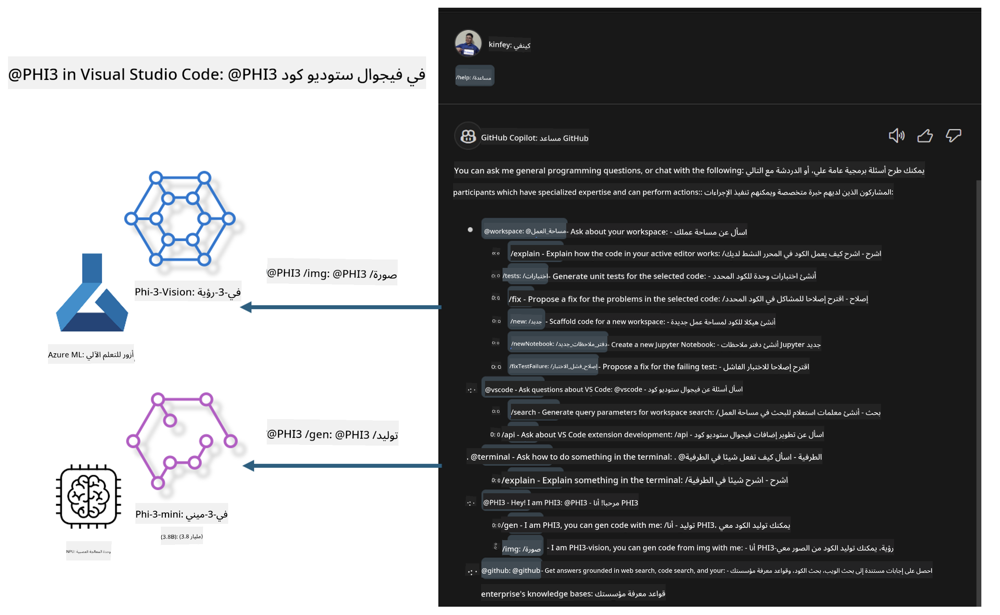

<!--
CO_OP_TRANSLATOR_METADATA:
{
  "original_hash": "00b7a699de8ac405fa821f4c0f7fc0ab",
  "translation_date": "2025-05-07T10:54:16+00:00",
  "source_file": "md/02.Application/02.Code/Phi3/VSCodeExt/README.md",
  "language_code": "ar"
}
-->
# **ابنِ دردشة GitHub Copilot الخاصة بك في Visual Studio Code باستخدام عائلة Microsoft Phi-3**

هل سبق لك استخدام وكيل مساحة العمل في دردشة GitHub Copilot؟ هل ترغب في بناء وكيل الكود الخاص بفريقك؟ تهدف هذه الورشة العملية إلى دمج النموذج المفتوح المصدر لبناء وكيل أعمال كود على مستوى المؤسسات.

## **الأساس**

### **لماذا تختار Microsoft Phi-3**

تُعد Phi-3 سلسلة عائلية تشمل phi-3-mini و phi-3-small و phi-3-medium، تعتمد على معلمات تدريب مختلفة لتوليد النصوص، إكمال الحوار، وتوليد الكود. هناك أيضًا phi-3-vision المبني على الرؤية. تناسب هذه النماذج المؤسسات أو الفرق المختلفة لإنشاء حلول ذكاء اصطناعي توليدي تعمل دون اتصال.

يوصى بقراءة هذا الرابط [https://github.com/microsoft/PhiCookBook/blob/main/md/01.Introduction/01/01.PhiFamily.md](https://github.com/microsoft/PhiCookBook/blob/main/md/01.Introduction/01/01.PhiFamily.md)

### **Microsoft GitHub Copilot Chat**

تمنحك إضافة GitHub Copilot Chat واجهة دردشة تتيح لك التفاعل مع GitHub Copilot والحصول على إجابات لأسئلة متعلقة بالبرمجة مباشرة داخل VS Code، دون الحاجة إلى التنقل بين الوثائق أو البحث في المنتديات عبر الإنترنت.

قد يستخدم Copilot Chat تمييز الصياغة، التراجع، وميزات تنسيق أخرى لإضفاء وضوح على الردود المولدة. حسب نوع السؤال من المستخدم، قد يحتوي الرد على روابط للسياق الذي استخدمه Copilot لتوليد الرد، مثل ملفات الكود المصدر أو الوثائق، أو أزرار للوصول إلى وظائف VS Code.

- يدمج Copilot Chat في سير عمل المطور ويوفر لك المساعدة عند الحاجة:

- ابدأ محادثة داخلية مباشرة من المحرر أو الطرفية للحصول على مساعدة أثناء البرمجة

- استخدم عرض الدردشة للحصول على مساعد ذكي بجانبك لمساعدتك في أي وقت

- أطلق Quick Chat لطرح سؤال سريع والعودة إلى عملك

يمكنك استخدام GitHub Copilot Chat في سيناريوهات مختلفة، مثل:

- الإجابة على أسئلة البرمجة حول أفضل طريقة لحل مشكلة

- شرح كود شخص آخر واقتراح تحسينات

- اقتراح إصلاحات للكود

- توليد حالات اختبار وحدة

- توليد توثيق للكود

يوصى بقراءة هذا الرابط [https://code.visualstudio.com/docs/copilot/copilot-chat](https://code.visualstudio.com/docs/copilot/copilot-chat?WT.mc_id=aiml-137032-kinfeylo)

###  **Microsoft GitHub Copilot Chat @workspace**

الرجوع إلى **@workspace** في Copilot Chat يتيح لك طرح أسئلة حول قاعدة الكود الكاملة الخاصة بك. بناءً على السؤال، يسترجع Copilot بذكاء الملفات والرموز ذات الصلة، والتي يشير إليها بعد ذلك في إجابته كرابط وأمثلة كود.

للإجابة على سؤالك، يبحث **@workspace** في نفس المصادر التي يستخدمها المطور عند التنقل في قاعدة الكود داخل VS Code:

- جميع الملفات في مساحة العمل، باستثناء الملفات التي تم تجاهلها بواسطة ملف .gitignore

- هيكل المجلدات مع أسماء المجلدات والملفات المتداخلة

- فهرس بحث الكود الخاص بـ GitHub، إذا كانت مساحة العمل مستودع GitHub ومفهرسة بواسطة بحث الكود

- الرموز والتعريفات في مساحة العمل

- النص المحدد حاليًا أو النص المرئي في المحرر النشط

ملاحظة: يتم تجاوز .gitignore إذا كان لديك ملف مفتوح أو نص محدد داخل ملف تم تجاهله.

يوصى بقراءة هذا الرابط [[https://code.visualstudio.com/docs/copilot/copilot-chat](https://code.visualstudio.com/docs/copilot/workspace-context?WT.mc_id=aiml-137032-kinfeylo)]

## **المزيد عن هذه الورشة**

حسّن GitHub Copilot بشكل كبير من كفاءة البرمجة في المؤسسات، وكل مؤسسة تأمل في تخصيص الوظائف ذات الصلة بـ GitHub Copilot. قامت العديد من المؤسسات بتخصيص إضافات مشابهة لـ GitHub Copilot بناءً على سيناريوهات أعمالها الخاصة والنماذج المفتوحة المصدر. بالنسبة للمؤسسات، تكون الإضافات المخصصة أسهل في التحكم، لكن هذا يؤثر أيضًا على تجربة المستخدم. فبعد كل شيء، يمتلك GitHub Copilot وظائف أقوى في التعامل مع السيناريوهات العامة والاحترافية. إذا أمكن الحفاظ على تجربة متسقة، فسيكون من الأفضل تخصيص إضافة المؤسسة الخاصة. توفر GitHub Copilot Chat واجهات برمجة تطبيقات ذات صلة للمؤسسات لتوسيع تجربة الدردشة. الحفاظ على تجربة متسقة وامتلاك وظائف مخصصة هو تجربة مستخدم أفضل.

تستخدم هذه الورشة بشكل رئيسي نموذج Phi-3 مع NPU محلي وهجين Azure لبناء وكيل مخصص في GitHub Copilot Chat ***@PHI3*** لمساعدة مطوري المؤسسات على إكمال توليد الكود ***(@PHI3 /gen)*** وتوليد الكود بناءً على الصور ***(@PHI3 /img)***.

### ***ملاحظة:***

تم تنفيذ هذه الورشة حاليًا في AIPC لمعالجات Intel و Apple Silicon. سنستمر في تحديث نسخة Qualcomm من NPU.

## **الورشة**

| الاسم | الوصف | AIPC | Apple |
| ------------ | ----------- | -------- |-------- |
| Lab0 - Installations(✅) | تكوين وتثبيت البيئات والأدوات المتعلقة | [Go](./HOL/AIPC/01.Installations.md) |[Go](./HOL/Apple/01.Installations.md) |
| Lab1 - Run Prompt flow with Phi-3-mini (✅) | الجمع بين AIPC / Apple Silicon، باستخدام NPU محلي لإنشاء توليد الكود عبر Phi-3-mini | [Go](./HOL/AIPC/02.PromptflowWithNPU.md) |  [Go](./HOL/Apple/02.PromptflowWithMLX.md) |
| Lab2 - Deploy Phi-3-vision on Azure Machine Learning Service(✅) | توليد الكود عن طريق نشر نموذج كتالوج خدمة Azure Machine Learning - صورة Phi-3-vision | [Go](./HOL/AIPC/03.DeployPhi3VisionOnAzure.md) |[Go](./HOL/Apple/03.DeployPhi3VisionOnAzure.md) |
| Lab3 - Create a @phi-3 agent in GitHub Copilot Chat(✅)  | إنشاء وكيل Phi-3 مخصص في GitHub Copilot Chat لإكمال توليد الكود، توليد كود الرسوم البيانية، RAG، إلخ | [Go](./HOL/AIPC/04.CreatePhi3AgentInVSCode.md) | [Go](./HOL/Apple/04.CreatePhi3AgentInVSCode.md) |
| Sample Code (✅)  | تحميل كود تجريبي | [Go](../../../../../../../code/07.Lab/01/AIPC) | [Go](../../../../../../../code/07.Lab/01/Apple) |

## **الموارد**

1. Phi-3 Cookbook [https://github.com/microsoft/Phi-3CookBook](https://github.com/microsoft/Phi-3CookBook)

2. تعلّم المزيد عن GitHub Copilot [https://learn.microsoft.com/training/paths/copilot/](https://learn.microsoft.com/training/paths/copilot/?WT.mc_id=aiml-137032-kinfeylo)

3. تعلّم المزيد عن GitHub Copilot Chat [https://learn.microsoft.com/training/paths/accelerate-app-development-using-github-copilot/](https://learn.microsoft.com/training/paths/accelerate-app-development-using-github-copilot/?WT.mc_id=aiml-137032-kinfeylo)

4. تعلّم المزيد عن GitHub Copilot Chat API [https://code.visualstudio.com/api/extension-guides/chat](https://code.visualstudio.com/api/extension-guides/chat?WT.mc_id=aiml-137032-kinfeylo)

5. تعلّم المزيد عن Azure AI Foundry [https://learn.microsoft.com/training/paths/create-custom-copilots-ai-studio/](https://learn.microsoft.com/training/paths/create-custom-copilots-ai-studio/?WT.mc_id=aiml-137032-kinfeylo)

6. تعلّم المزيد عن كتالوج نماذج Azure AI Foundry [https://learn.microsoft.com/azure/ai-studio/how-to/model-catalog-overview](https://learn.microsoft.com/azure/ai-studio/how-to/model-catalog-overview)

**إخلاء المسؤولية**:  
تمت ترجمة هذا المستند باستخدام خدمة الترجمة الآلية [Co-op Translator](https://github.com/Azure/co-op-translator). بينما نسعى لتحقيق الدقة، يرجى العلم أن الترجمات الآلية قد تحتوي على أخطاء أو عدم دقة. يجب اعتبار المستند الأصلي بلغته الأصلية المصدر الموثوق به. للمعلومات الحساسة، يُنصح بالترجمة المهنية البشرية. نحن غير مسؤولين عن أي سوء فهم أو تفسير ناتج عن استخدام هذه الترجمة.