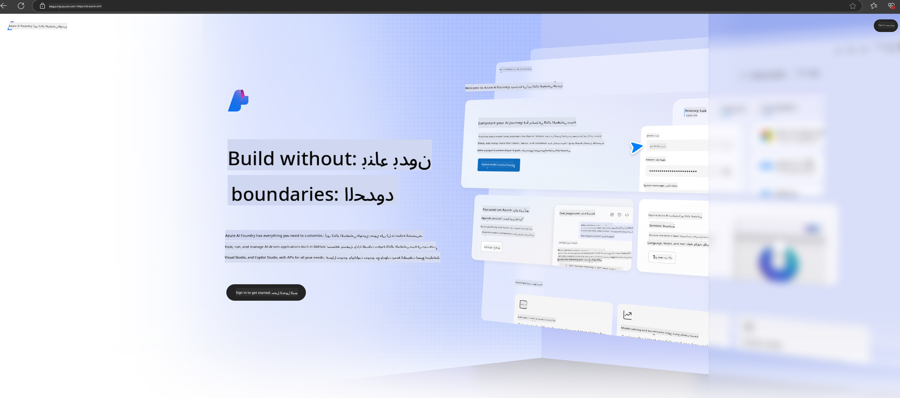

<!--
CO_OP_TRANSLATOR_METADATA:
{
  "original_hash": "3a1e48b628022485aac989c9f733e792",
  "translation_date": "2025-05-07T10:19:54+00:00",
  "source_file": "md/02.QuickStart/AzureAIFoundry_QuickStart.md",
  "language_code": "ar"
}
-->
# **استخدام Phi-3 في Azure AI Foundry**

مع تطور الذكاء الاصطناعي التوليدي، نأمل في استخدام منصة موحدة لإدارة نماذج اللغة الكبيرة (LLM) ونماذج اللغة الصغيرة (SLM)، ودمج بيانات المؤسسة، وعمليات الضبط الدقيق / RAG، وتقييم مختلف أعمال المؤسسة بعد دمج LLM و SLM، وغيرها، بحيث يمكن لتطبيقات الذكاء الاصطناعي التوليدي أن تُنفذ بشكل أذكى. [Azure AI Foundry](https://ai.azure.com) هي منصة تطبيقات ذكاء اصطناعي توليدي على مستوى المؤسسات.

مع Azure AI Foundry، يمكنك تقييم استجابات نموذج اللغة الكبير (LLM) وتنظيم مكونات تطبيق المطالبات باستخدام تدفق المطالبات لتحقيق أداء أفضل. تسهل المنصة التوسع لتحويل إثبات المفاهيم إلى إنتاج كامل بسهولة. كما تدعم المراقبة المستمرة والتحسين لضمان النجاح على المدى الطويل.

يمكننا نشر نموذج Phi-3 بسرعة على Azure AI Foundry من خلال خطوات بسيطة، ثم استخدام Azure AI Foundry لإكمال أعمال Playground/Chat، والضبط الدقيق، والتقييم المتعلقة بـ Phi-3.

## **1. التحضير**

إذا كان لديك بالفعل [Azure Developer CLI](https://learn.microsoft.com/azure/developer/azure-developer-cli/overview?WT.mc_id=aiml-138114-kinfeylo) مثبتًا على جهازك، فإن استخدام هذا القالب بسيط للغاية من خلال تشغيل هذا الأمر في مجلد جديد.

## الإنشاء اليدوي

إنشاء مشروع ومركز في Microsoft Azure AI Foundry طريقة رائعة لتنظيم وإدارة عملك في مجال الذكاء الاصطناعي. إليك دليل خطوة بخطوة للبدء:

### إنشاء مشروع في Azure AI Foundry

1. **اذهب إلى Azure AI Foundry**: سجّل الدخول إلى بوابة Azure AI Foundry.
2. **إنشاء مشروع**:
   - إذا كنت داخل مشروع، اختر "Azure AI Foundry" من أعلى يسار الصفحة للعودة إلى الصفحة الرئيسية.
   - اختر "+ إنشاء مشروع".
   - أدخل اسمًا للمشروع.
   - إذا كان لديك مركز، فسيتم اختياره تلقائيًا. إذا كان لديك حق الوصول لأكثر من مركز، يمكنك اختيار مركز مختلف من القائمة المنسدلة. إذا أردت إنشاء مركز جديد، اختر "إنشاء مركز جديد" وقدم اسمًا.
   - اختر "إنشاء".

### إنشاء مركز في Azure AI Foundry

1. **اذهب إلى Azure AI Foundry**: سجّل الدخول باستخدام حساب Azure الخاص بك.
2. **إنشاء مركز**:
   - اختر مركز الإدارة من القائمة اليسرى.
   - اختر "كل الموارد"، ثم السهم المنسدل بجانب "+ مشروع جديد" واختر "+ مركز جديد".
   - في مربع الحوار "إنشاء مركز جديد"، أدخل اسمًا لمركزك (مثلاً contoso-hub) وعدّل الحقول الأخرى حسب الرغبة.
   - اختر "التالي"، راجع المعلومات، ثم اختر "إنشاء".

لمزيد من التعليمات التفصيلية، يمكنك الرجوع إلى [توثيق مايكروسوفت الرسمي](https://learn.microsoft.com/azure/ai-studio/how-to/create-projects).

بعد الإنشاء بنجاح، يمكنك الوصول إلى الاستوديو الذي أنشأته عبر [ai.azure.com](https://ai.azure.com/)

يمكن أن يكون هناك عدة مشاريع على AI Foundry واحد. أنشئ مشروعًا في AI Foundry للتحضير.

أنشئ Azure AI Foundry [QuickStarts](https://learn.microsoft.com/azure/ai-studio/quickstarts/get-started-code)

## **2. نشر نموذج Phi في Azure AI Foundry**

انقر على خيار الاستكشاف للمشروع للدخول إلى كتالوج النماذج واختر Phi-3

اختر Phi-3-mini-4k-instruct

انقر على "نشر" لنشر نموذج Phi-3-mini-4k-instruct

> [!NOTE]
>
> يمكنك اختيار قوة الحوسبة عند النشر

## **3. الدردشة في Playground مع Phi في Azure AI Foundry**

اذهب إلى صفحة النشر، اختر Playground، وتحدث مع Phi-3 في Azure AI Foundry

## **4. نشر النموذج من Azure AI Foundry**

لنشر نموذج من كتالوج نماذج Azure، يمكنك اتباع الخطوات التالية:

- سجّل الدخول إلى Azure AI Foundry.
- اختر النموذج الذي تريد نشره من كتالوج نماذج Azure AI Foundry.
- في صفحة تفاصيل النموذج، اختر نشر ثم اختر API بدون خادم مع Azure AI Content Safety.
- اختر المشروع الذي تريد نشر نماذجك فيه. لاستخدام عرض API بدون خادم، يجب أن يكون مساحة العمل ضمن منطقة East US 2 أو Sweden Central. يمكنك تخصيص اسم النشر.
- في معالج النشر، اختر التسعير والشروط للاطلاع على التسعير وشروط الاستخدام.
- اختر نشر. انتظر حتى يصبح النشر جاهزًا ويتم توجيهك إلى صفحة النشرات.
- اختر فتح في playground للبدء بالتفاعل مع النموذج.
- يمكنك العودة إلى صفحة النشرات، اختيار النشر، وتدوين عنوان URL الخاص بالنقطة النهائية والمفتاح السري، اللذين يمكنك استخدامهما لاستدعاء النشر وتوليد النتائج.
- يمكنك دائمًا العثور على تفاصيل النقطة النهائية، العنوان، ومفاتيح الوصول من خلال الانتقال إلى علامة التبويب Build واختيار النشرات من قسم المكونات.

> [!NOTE]
> يرجى ملاحظة أنه يجب أن يكون لحسابك أذونات دور Azure AI Developer على مجموعة الموارد لأداء هذه الخطوات.

## **5. استخدام Phi API في Azure AI Foundry**

يمكنك الوصول إلى https://{اسم مشروعك}.region.inference.ml.azure.com/swagger.json عبر Postman باستخدام GET ودمجه مع المفتاح للتعرف على الواجهات المتوفرة

يمكنك الحصول على معلمات الطلب بسهولة، وكذلك معلمات الاستجابة.

**إخلاء المسؤولية**:  
تمت ترجمة هذا المستند باستخدام خدمة الترجمة الآلية [Co-op Translator](https://github.com/Azure/co-op-translator). بينما نسعى لتحقيق الدقة، يرجى العلم أن الترجمات الآلية قد تحتوي على أخطاء أو عدم دقة. يجب اعتبار المستند الأصلي بلغته الأصلية المصدر الموثوق به. للمعلومات الحساسة، يُنصح بالاستعانة بترجمة بشرية محترفة. نحن غير مسؤولين عن أي سوء فهم أو تفسير ناتج عن استخدام هذه الترجمة.